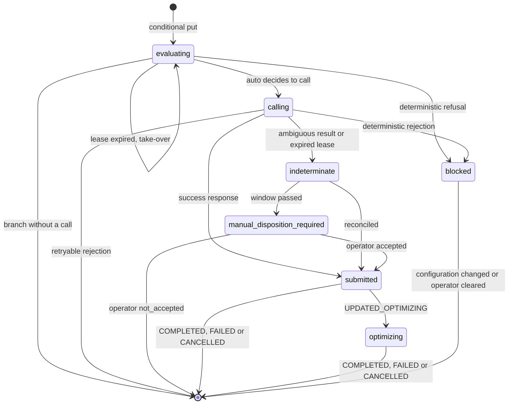

# T4 Guarded SSD Auto-Increase for Amazon FSx for NetApp ONTAP: Implementation Design

🌐 [日本語](../ja/capacity-automation-t4-design.md) | **English** (this page)

> **Status / audience / evidence tiers**
>
> Status: implemented at `terraform/fsxn-ssd-auto-increase/`, offline-verified (`terraform test`, `make terraform`, pytest), and run on 2026-10-09 against one first-generation file system on the reversible paths, with no capacity change ([record](verification-results-cloudwatch-monitoring.md#terraform-ssd-auto-increase-module-run-on-2026-10-09)). The real increase has not run. Audience: engineers who build, review or test the T4 module for Amazon FSx for NetApp ONTAP. Readers deciding whether to automate at all should start with [Monitoring-Driven Capacity Automation](capacity-automation.md), which compares T4 with the AWS sample and a manual runbook. Evidence tiers: `documented` (stated on the cited AWS, HashiCorp or NetApp page, read 2026-10-07 or 2026-10-08), `code-inspected` (read from the AWS sample code, not executed), `hypothesis` (inferred, not checked), `open` (not answered by any source read). Values use placeholders (`fs-0123456789abcdef0`, `123456789012`, `ap-northeast-1`).

## Executive summary

T4 raises SSD capacity only inside a required absolute ceiling, and only after every guard on this page passes. The ceiling is validated twice against the documented per-file-system maximum for the deployment type and HA-pair count: by Terraform before deployment and by the function before each request. A request goes out only from a lock state that stores its facts first. While the acceptance of a request is unknown, no second request is sent. A deterministic error, such as a ceiling above the service maximum or a `BadRequest`, latches a `blocked` state and is reported once; the hourly schedule does not repeat the request. Progress is tracked from `AdministrativeActions`: `UPDATED_OPTIMIZING` means the new capacity is usable and storage optimization is still running, so it is recorded as `capacity_available` and tracking continues until the action reaches `COMPLETED`, `FAILED` or `CANCELLED`. The audit record is an S3 Object Lock archive. `auto` mode requires compliance-mode retention; governance mode is accepted only in `notify_only` and `approve`, because a principal holding `s3:BypassGovernanceRetention` can delete or shorten governance-protected versions.

> **Scope note**
>
> This page specifies behaviour, not code. The option comparison, the irreversibility facts, Terraform `ignore_changes`, the volume autosize and throughput runbooks, and the adoption order are in [capacity-automation.md](capacity-automation.md). Thresholds and the headroom formula are in [sizing-and-headroom.md](sizing-and-headroom.md).

## AWS sample review in detail

T4's guards are written against the published AWS sample ([Updating storage capacity dynamically](https://docs.aws.amazon.com/fsx/latest/ONTAPGuide/automate-storage-capacity-increase.html) and its two downloadable archives, read 2026-10-07). The reader guide lists the points that bear on choosing an option; this is the full review.

- Parameters and defaults (`documented`): `FileSystemId`, `LowFreeDataStorageCapacityThreshold` (no default), `EmailAddress`, `LambdaS3Bucket`, `LambdaS3Key`, `PercentIncrease` 20 (10-100), `EnableIntelligentScaling` true, `MaxIncrementPercent` 100 (10-500), `GrowthThresholds`, `MinHoursBetweenScaling` 6 (1-24), `MaxRetryAttempts` 12 (1-50), `RetryDelayMinutes` 5 (1-60), `RetryBufferMinutes` 5 (0-60), `ScheduleCleanupAgeDays` 7 (1-30). The alarm fires after the threshold is exceeded continuously for 5 minutes.
- No customer-set absolute ceiling and no approval or dry-run mode (`code-inspected`). The upper bound is the service maximum by deployment type, held as constants in the code.
- IAM grants `fsx:UpdateFileSystem` and `fsx:DescribeFileSystems` on `Resource: "*"` (`code-inspected`).
- The intelligent path and the path with insufficient history compute `int(current * (1 + pct / 100))`, which truncates; the fixed path uses `math.ceil` (`code-inspected`). With `pct` clamped to 10, a 1,024 GiB file system gets 1,126 GiB instead of 1,126.4, which is below the documented minimum of 10%, so `UpdateFileSystem` would presumably reject it (`hypothesis`).
- When the capped target equals the maximum, the handler stops with "Already at or near maximum capacity" and does not call the API, even when the current capacity is below the maximum (`code-inspected`).
- The success message says the operation completes in "5-10 minutes"; AWS documents that storage optimization usually runs for a few hours afterwards ([storage-capacity-and-IOPS](https://docs.aws.amazon.com/fsx/latest/ONTAPGuide/storage-capacity-and-IOPS.html)).
- CloudWatch invokes alarm actions only on a state change ([AlarmThatSendsEmail](https://docs.aws.amazon.com/AmazonCloudWatch/latest/monitoring/AlarmThatSendsEmail.html), `documented`). If one increase leaves utilization above the threshold, the alarm stays in ALARM and no second increase is triggered; the sample's retries cover cooldown blocks only (`hypothesis` for the sample, not executed).
- The alarm selects `StorageTier` and `DataType` without `Aggregate` (`code-inspected`), so per-aggregate fill on a second-generation, multi-HA-pair file system is not watched (`hypothesis`).

> **Licence note**
>
> Both archives carry an Amazon copyright header followed by MIT No Attribution-style terms (`code-inspected`). This project references the design and writes its own code for T4; it does not vendor the sample.

## Flow and components

A CloudWatch alarm on `StorageCapacityUtilization` (`StorageTier=SSD`, `DataType=All`; on second generation, one more alarm per `Aggregate`) publishes to a trigger SNS topic, which invokes a Lambda function outside any VPC that calls AWS APIs only. Because alarm actions fire only on a state change ([AlarmThatSendsEmail](https://docs.aws.amazon.com/AmazonCloudWatch/latest/monitoring/AlarmThatSendsEmail.html), `documented`), an EventBridge Scheduler schedule also invokes the function hourly. Every invocation reads the trigger alarm's state with `cloudwatch:DescribeAlarms` and acts only while the alarm is in ALARM, so the alarm's own evaluation (datapoints to alarm, missing-data handling) decides and the function does not recompute it. Reports and `approve` emails go to a second, notification SNS topic that has no Lambda subscription, so a report cannot invoke the function again. The function never publishes to the trigger topic.

Components to operate: the function, the schedule, two SNS topics, a DynamoDB lock table, a CloudWatch Logs log group for the decision log, and an S3 bucket with Object Lock for the decision archive. The bucket is administered outside the module.

> **Network note**
>
> T4 calls only AWS APIs, so its Lambda function runs outside a VPC. This differs from the T2 qtree and SnapMirror collectors, which need a VPC path to the ONTAP management endpoint.

## Guards

| Guard | Behaviour | Why |
|---|---|---|
| `max_storage_capacity_gib` | Required absolute ceiling, no default; the target never exceeds it. Validated at deploy time and at run time against the documented maximum for the file system's shape (next section) | The service maximum is not a budget, and a ceiling the service cannot honour must fail once, before any request |
| `mode` | `notify_only` (default): computes and reports, never calls the API. `approve`: sends an SNS email with the computed `aws fsx update-file-system` command for a person to run. `auto`: calls the API | Lets a team observe the decisions before granting the action. Whether Systems Manager Automation approval can replace the email is `open` |
| Alarm state | Every invocation, from SNS or the schedule, calls `DescribeAlarms` with the names of the trigger alarms and continues only when at least one is in `ALARM`. Otherwise it records `alarm_not_in_alarm` and releases the lock | Reuses the alarm's M-of-N and `TreatMissingData` semantics instead of re-implementing them; a scheduled run while the alarm is OK does nothing |
| Target computation | `target = min(ceiling, max(ceil(current × 1.10), ceil(current × (1 + increase_percent / 100))))`; no call when `target < ceil(current × 1.10)` or `target ≤ current`, and the report says the ceiling is reached | Ceil rounding keeps every request at or above the 10% minimum ([storage-capacity-and-IOPS](https://docs.aws.amazon.com/fsx/latest/ONTAPGuide/storage-capacity-and-IOPS.html), `documented`) |
| Administrative actions | No call while any `FILE_SYSTEM_UPDATE` action is `PENDING`, `IN_PROGRESS`, `UPDATED_OPTIMIZING`, `OPTIMIZING` or `PAUSED`, or any `STORAGE_OPTIMIZATION` action is present and not `COMPLETED`. Read once when the evaluation starts and again immediately before `UpdateFileSystem`, after the lock is held | First generation can queue, second generation cannot ([managing-throughput-capacity](https://docs.aws.amazon.com/fsx/latest/ONTAPGuide/managing-throughput-capacity.html), `documented`). Whether a new request is accepted while storage optimization runs is `open`, so the guard does not test it |
| Concurrency | Reserved concurrency of 1 on the function, plus a per-file-system lock: a DynamoDB conditional put keyed on the file system ID that succeeds only when no item exists, or the item is `evaluating` with its `expires_at` in the past and no pending archive events. An invocation that does not get the lock acts on the state it finds, as the lock-state table says; none of those actions calls `UpdateFileSystem` | Per-aggregate alarms, the hourly schedule and retries can run at the same time; a read-then-write check alone lets two invocations both see no update and both submit one. The condition compares `expires_at` itself. The lock table has no DynamoDB TTL: `expires_at` is only the lease comparison value, so a durable state (`submitted`, `optimizing`, `indeterminate`, `manual_disposition_required`, `blocked`) is never deleted by the service before its designed release, which would otherwise drop the latch, the same-token barrier or the one-request chain |
| Cooldown | Reads the `RequestTime` of the last SSD, IOPS or throughput change from `AdministrativeActions`; defers when it is less than 6 hours ago and reports the next eligible time | The cooldown is shared across the three settings ([storage-capacity-and-IOPS](https://docs.aws.amazon.com/fsx/latest/ONTAPGuide/storage-capacity-and-IOPS.html), `documented`) |
| IOPS mode | `AUTOMATIC`: no IOPS argument. `USER_PROVISIONED`: `Iops = max(current, 3 × target)`; when that exceeds the maximum SSD IOPS for the deployment type and Region, latch `blocked` with `iops_exceeds_maximum` and notify once | User-provisioned IOPS must be at least 3 per requested GiB ([increase-storage-capacity](https://docs.aws.amazon.com/fsx/latest/ONTAPGuide/increase-storage-capacity.html)). The quotas page lists first generation at 160,000 in US East (Ohio), US East (N. Virginia), US West (Oregon) and Europe (Ireland) and 80,000 in the other Regions, and second generation at 200,000 per HA pair for Single-AZ (up to 12 pairs) and 200,000 in total for Multi-AZ ([quotas](https://docs.aws.amazon.com/fsx/latest/ONTAPGuide/limits.html), `documented`) |
| IAM | `fsx:UpdateFileSystem` on `arn:aws:fsx:ap-northeast-1:123456789012:file-system/fs-0123456789abcdef0` only | Limits the blast radius to one file system. The Service Authorization Reference lists `file-system*` as the required resource type for `fsx:UpdateFileSystem` ([list_fsx](https://docs.aws.amazon.com/service-authorization/latest/reference/list_fsx.html), `documented`). That the scoped Allow works for this module's policy is not yet checked; the policy simulation in the test plan closes it |
| Report | SNS message on the notification topic before the call and at each later state change: correlation ID, current GiB, target GiB, mode, reason, cooldown state, `AdministrativeActions` status | Tells an operator what happened. SNS delivery is transient and an email subscription can stay unconfirmed, so the report is not the record |
| Decision log (operational history) | One structured JSON log line per archive event in CloudWatch Logs: correlation ID, inputs (alarm state, utilization, current GiB, ceiling, mode, cooldown state, `AdministrativeActions`, lock state), decision, reason and, when the API was called, the request ID of `UpdateFileSystem`. Log group retention is a module input (default 365 days) | Searchable history for operators. It is not the audit record: retention deletes events, and an identity with the right permissions can delete the log group |
| Decision archive (audit record) | One object per event under the evaluation's correlation ID, in an S3 bucket with Object Lock default retention, administered outside the function's role. In `auto` the intent event is written and its retention checked before `UpdateFileSystem`; the function does not call when either fails. `auto` requires compliance mode | CloudTrail records API calls only, not `notify_only`, deferral, lock-contention or refusal decisions. The retention modes and their limits are in the decision-archive section |

## Ceiling validation

The service maximum depends on the deployment shape. The quotas page lists the maximum SSD storage capacity per file system as 192 TiB for first-generation file systems, 512 TiB for second-generation Multi-AZ, and 512 TiB per HA pair up to 1 PiB for second-generation Single-AZ ([quotas](https://docs.aws.amazon.com/fsx/latest/ONTAPGuide/limits.html), `documented`, read 2026-10-08). The AWS sample holds the same values as constants (196,608 GiB; 524,288 GiB per HA pair capped at 1,048,576 GiB; `code-inspected`).

| Deployment type | Maximum SSD capacity per file system |
|---|---|
| `SINGLE_AZ_1`, `MULTI_AZ_1` (first generation) | 196,608 GiB |
| `MULTI_AZ_2` | 524,288 GiB |
| `SINGLE_AZ_2` | min(524,288 × HA pairs, 1,048,576) GiB |

The same page lists an account-level, per-Region quota of 524,288 GiB of SSD capacity across all FSx for ONTAP file systems, which can be increased. A ceiling within the per-file-system maximum can therefore still be rejected with `ServiceLimitExceeded`; the latch in the failure-classification section handles that case.

At deploy time, two checks fail the plan before anything is created. Variable validation rejects a ceiling that is not a whole number from 1,024 to 1,048,576 GiB, the widest documented range. A resource precondition reads the file system through the `aws_fsx_ontap_file_system` data source, which exposes `deployment_type`, `ha_pairs` and `storage_capacity` ([data source](https://registry.terraform.io/providers/hashicorp/aws/latest/docs/data-sources/fsx_ontap_file_system), `documented`), and rejects a ceiling above the shape's maximum. Terraform runs variable validation before it generates a plan and evaluates preconditions after planning, before it creates the resource ([validate](https://developer.hashicorp.com/terraform/language/validate), `documented`). A `check` block warns, without blocking, when the ceiling leaves no room for one 10% increase.

```hcl
# Implemented in terraform/fsxn-ssd-auto-increase/variables.tf and main.tf.
variable "max_storage_capacity_gib" {
  type        = number
  description = "Required absolute SSD ceiling in GiB. No default."

  validation {
    condition = (
      var.max_storage_capacity_gib == floor(var.max_storage_capacity_gib) &&
      var.max_storage_capacity_gib >= 1024 &&
      var.max_storage_capacity_gib <= 1048576
    )
    error_message = "max_storage_capacity_gib must be a whole number from 1024 to 1048576 GiB."
  }
}

data "aws_fsx_ontap_file_system" "target" {
  id = var.file_system_id
}

locals {
  # Per-file-system SSD maximum by deployment shape (FSx for ONTAP quotas page).
  shape_max_gib = {
    SINGLE_AZ_1 = 196608
    MULTI_AZ_1  = 196608
    MULTI_AZ_2  = 524288
    SINGLE_AZ_2 = min(524288 * data.aws_fsx_ontap_file_system.target.ha_pairs, 1048576)
  }[data.aws_fsx_ontap_file_system.target.deployment_type]

  # Passed to the function; a blocked latch clears when this value changes.
  config_fingerprint = sha256(jsonencode({
    ceiling          = var.max_storage_capacity_gib
    increase_percent = var.increase_percent
    mode             = var.mode
    archive_mode     = var.decision_archive_required_mode
  }))
}

resource "aws_lambda_function" "evaluator" {
  # ... function arguments ...

  lifecycle {
    precondition {
      condition     = var.max_storage_capacity_gib <= local.shape_max_gib
      error_message = "max_storage_capacity_gib exceeds the SSD maximum for this deployment type and HA-pair count."
    }
    precondition {
      condition     = var.mode != "auto" || var.decision_archive_required_mode == "COMPLIANCE"
      error_message = "mode = auto requires decision_archive_required_mode = COMPLIANCE."
    }
  }
}

check "ceiling_leaves_room" {
  assert {
    condition     = var.max_storage_capacity_gib >= ceil(data.aws_fsx_ontap_file_system.target.storage_capacity * 1.1)
    error_message = "The ceiling is below current capacity plus the 10% minimum increase; T4 can never act."
  }
}
```

At run time, before computing the target, the function reads `DeploymentType`, `HAPairs` and `StorageCapacity` from `DescribeFileSystems` and applies the same table. When the ceiling exceeds the maximum, it records `ceiling_exceeds_service_maximum`, makes no call, latches `blocked` and notifies once. The run-time check covers a file system whose shape changed after deployment and a plan that ran without the precondition.

> **Ceiling note**
>
> A map lookup on an unknown `deployment_type` fails the plan. That is intended: a deployment type this design does not list should stop the module rather than fall back to a default maximum. Whether the provider reads `ha_pairs` for every deployment type at plan time was not tested (`open`).

## Lock states

The lock item is keyed on the file system ID. Each conditional write that releases or changes it also requires the owner to be the invocation's own correlation ID, and the expected current state.



| State | Written when | A later invocation that finds it | Released or changed when |
|---|---|---|---|
| `evaluating`, lease valid | Conditional put at the start of every evaluation: owner correlation ID, start time, `expires_at` = start + function timeout + 1 minute. No request facts | Reports "evaluation already running" and stops | Deleted by the owner at the end of every branch that does not call: `notify_only`, `approve`, alarm not in ALARM, ceiling reached, cooldown deferred, administrative action in progress, archive retention unproven, intent write failed. Changed to `blocked` on a deterministic refusal before the call (`ceiling_exceeds_service_maximum`, `iops_exceeds_maximum`). Changed to `calling` when `auto` decides to call |
| `evaluating`, lease expired | The owner stopped before storing request facts: crash or timeout | Takes the lock as a new `evaluating` item with a new correlation ID and re-runs every guard; its `decision` event names the superseded correlation ID. No request was sent, because a call is made only from `calling` | When the take-over put succeeds |
| `calling` | Conditional update by the owner after the intent event is archived and its retention checked, immediately before `UpdateFileSystem`: `ClientRequestToken` (the correlation ID), target GiB, IOPS arguments, request time, a new `expires_at`. When this update fails, there is no call | Lease valid: reports "evaluation already running" and stops. Lease expired: archives `ambiguous` and changes the item to `indeterminate`, keeping every request fact | By the owner, by error class (failure-classification section): to `submitted` after a success response; to `blocked` after a deterministic rejection, once `rejected` is archived and the failure reported; deleted after a retryable rejection, once `rejected` is archived; to `indeterminate` after an ambiguous result (a 5xx error, a timeout, no response or an unlisted error code), once `ambiguous` is archived |
| `indeterminate` | A request went out and no response confirmed acceptance or rejection. Keeps the original correlation ID, `ClientRequestToken`, target and request time, and sets `reconcile_until` = request time + `indeterminate_reconcile_hours` | Never calls `UpdateFileSystem` and never issues a new token. Looks in `AdministrativeActions` for a `FILE_SYSTEM_UPDATE` with `RequestTime` at or after the recorded request time and `TargetFileSystemValues.StorageCapacity` equal to the recorded target. Found: archives `reconciled` and changes the item to `submitted`. Not found before `reconcile_until`: logs `reconcile_pending` and stops | To `submitted` on a match. To `manual_disposition_required` when `reconcile_until` passes without one, with a report on the notification topic |
| `manual_disposition_required` | Reconciliation found no match within its window | Never calls `UpdateFileSystem`. Checks once more for a match, then repeats the report that names the item and the open request | An operator sets `disposition` on the item to `accepted` or `not_accepted` together with the evidence used. The next invocation archives `reconciled` with that evidence; `accepted` moves the item to `submitted`, `not_accepted` deletes it. Only after that can a new evaluation, with a new correlation ID and token, start |
| `submitted` | Conditional update after a success response (request ID, `report_sent`) or after reconciliation (the matched action); keeps the request facts | Sends the report when `report_sent` is false; never calls `UpdateFileSystem`. Reads the matching action's status | To `optimizing` when the action reaches `UPDATED_OPTIMIZING`, once `capacity_available` is archived and its report sent. Deleted when the action reaches `COMPLETED`, `FAILED` or `CANCELLED`, once `terminal` is archived and the final report sent |
| `optimizing` | The matching `FILE_SYSTEM_UPDATE` reached `UPDATED_OPTIMIZING`: the new capacity is usable and storage optimization is running | Never calls `UpdateFileSystem`. Reads the status and the `STORAGE_OPTIMIZATION` `ProgressPercent` into the decision log; `OPTIMIZING`, `PAUSED` and `UPDATED_OPTIMIZING` keep the state | Deleted when the action reaches `COMPLETED`, `FAILED` or `CANCELLED`, once `terminal` is archived and the final report sent |
| `blocked` | A deterministic refusal: `ceiling_exceeds_service_maximum` or `iops_exceeds_maximum` before a call, or a deterministic rejection after one. Stores the reason, the error code if any, and the `config_fingerprint` the function was deployed with | Never calls `UpdateFileSystem` and sends no further report. Logs `blocked` with the stored reason. When the deployed `config_fingerprint` differs from the stored one, archives `reconciled` (source `configuration_change`), deletes the item and evaluates afresh | When the configuration changes (new fingerprint), or an operator sets `disposition` to `cleared` with the corrective action taken (for example an IAM fix or a quota increase that the fingerprint does not cover) |

The lock is held until the action is terminal, so one item follows one request to its end. Releasing it at `UPDATED_OPTIMIZING` would not by itself let a second request out, because the administrative-action guard treats `UPDATED_OPTIMIZING` as active and the cooldown guard reads history on its own. The design keeps the item anyway, so that the archive's `terminal` event and the final report always belong to the evaluation that made the request.

> **Optimization note**
>
> AWS documents `UPDATED_OPTIMIZING` as the state in which the file system has the new storage capacity and Amazon FSx is running storage optimization ([AdministrativeAction](https://docs.aws.amazon.com/fsx/latest/APIReference/API_AdministrativeAction.html), `documented`). An SSD increase creates a `FILE_SYSTEM_UPDATE` and a `STORAGE_OPTIMIZATION` action; when optimization completes, the `FILE_SYSTEM_UPDATE` becomes `COMPLETED` and the `STORAGE_OPTIMIZATION` action no longer appears ([monitoring storage capacity increases](https://docs.aws.amazon.com/fsx/latest/ONTAPGuide/monitoring-storage-capacity-increase.html), `documented`). The documented `Status` values are `FAILED`, `IN_PROGRESS`, `PENDING`, `COMPLETED`, `UPDATED_OPTIMIZING`, `OPTIMIZING`, `PAUSED` and `CANCELLED`. T4 treats only `COMPLETED`, `FAILED` and `CANCELLED` as terminal.

## Request acceptance and reconciliation

> **Idempotency note**
>
> Each request carries the correlation ID as `ClientRequestToken`, which Amazon FSx uses for idempotent updates; a second request with the same token and different parameters returns `IncompatibleParameterError` ([UpdateFileSystem](https://docs.aws.amazon.com/fsx/latest/APIReference/API_UpdateFileSystem.html), `documented`). How long a token is honoured is not documented (`open`), and whether an accepted request appears in `AdministrativeActions` promptly is `hypothesis`. The lock therefore neither resends nor replaces the token while acceptance is unknown: an `indeterminate` item keeps it until a match or an operator's disposition settles the request. The lock-state tests cover the delayed-visibility case with mocks only.

`indeterminate_reconcile_hours` defaults to 6. If the first request was accepted, the documented cooldown blocks any further SSD, IOPS or throughput change for at least six hours anyway ([storage-capacity-and-IOPS](https://docs.aws.amazon.com/fsx/latest/ONTAPGuide/storage-capacity-and-IOPS.html), `documented`), so waiting that long before escalating delays a second increase no more than the accepted case would. The headroom formula already budgets `T_cooldown` for this, and a manual disposition adds `T_human` ([sizing-and-headroom.md](sizing-and-headroom.md#headroom-formula)). The window bounds how long automation looks for a match. It does not claim that an accepted request becomes visible within six hours.

Manual disposition. `not_accepted` needs two checks made after the window: no matching `FILE_SYSTEM_UPDATE` in `AdministrativeActions`, and no `UpdateFileSystem` event without an `errorCode` for this file system in CloudTrail at or after the recorded request time. CloudTrail can deliver events late and marks them with a `DELIVERY_DELAY` addendum ([CloudTrail record contents](https://docs.aws.amazon.com/awscloudtrail/latest/userguide/cloudtrail-event-reference-record-contents.html), `documented`), so the check is a judgement, not a proof; that is why a person makes it. Whether the CloudTrail event shows the `ClientRequestToken` in its request parameters is `hypothesis`. `accepted` needs either check to find the request. The operator's role writes the lock table; the function's role does not change.

## Failure classification

`UpdateFileSystem` documents `BadRequest`, `FileSystemNotFound`, `IncompatibleParameterError`, `InvalidNetworkSettings`, `MissingFileSystemConfiguration`, `ServiceLimitExceeded` and `UnsupportedOperation` as HTTP 400 errors, and `InternalServerError` as HTTP 500 ([UpdateFileSystem](https://docs.aws.amazon.com/fsx/latest/APIReference/API_UpdateFileSystem.html), `documented`, read 2026-10-08). The errors common to all Amazon FSx actions include `AccessDeniedException` (403), `ValidationError` (400), `ThrottlingException` (400, retried automatically by the AWS SDKs), `ExpiredTokenException` (403), `RequestTimeoutException` (408), `RequestAbortedException` (400), `InternalFailure` (500) and `ServiceUnavailable` (503) ([Common Error Types](https://docs.aws.amazon.com/fsx/latest/APIReference/CommonErrors.html), `documented`, read 2026-10-08). The status code alone does not decide the class: a 400 can be a throttle or an aborted request.

| Class | Errors | Handling | Why |
|---|---|---|---|
| Deterministic refusal before a call | `ceiling_exceeds_service_maximum`, `iops_exceeds_maximum` | No call. Archive `decision` with the reason, latch `blocked`, notify once | The same configuration produces the same refusal on every tick |
| Deterministic rejection | `BadRequest`, `FileSystemNotFound`, `IncompatibleParameterError`, `InvalidNetworkSettings`, `MissingFileSystemConfiguration`, `ServiceLimitExceeded`, `UnsupportedOperation`, `ValidationError`, `AccessDeniedException` | Archive `rejected`, latch `blocked`, notify once. The hourly schedule does not resend | The same request fails the same way until the configuration, a permission or a quota changes. An hourly resend would repeat a non-retryable request and its failure report |
| Retryable rejection | `ThrottlingException` that the SDK's own retries did not clear; `ExpiredTokenException` | Archive `rejected` with the code, delete the item; the next scheduled run may evaluate again | Both depend on load or credentials, not on the request |
| Ambiguous | `InternalServerError`, `InternalFailure`, `ServiceUnavailable`, `RequestTimeoutException`, `RequestAbortedException`, a client-side timeout, no response, and any error code not listed in this table | Archive `ambiguous`, move to `indeterminate`, reconcile | The request may have been accepted. An unknown code is treated as possibly accepted, which is the fail-closed reading for an increase that cannot be undone on first generation |

> **Failure-handling note**
>
> The `blocked` latch fails closed once: one report, then silence from the function until the configuration changes or an operator clears it. No other part of this design repeats a notification while the latch holds. The trigger alarm keeps evaluating and stays in ALARM, so the condition remains visible in the CloudWatch console and through `DescribeAlarms`, but the alarm invoked its actions on the transition into ALARM and does not invoke them again while it stays there; only Auto Scaling actions repeat ([AlarmThatSendsEmail](https://docs.aws.amazon.com/AmazonCloudWatch/latest/monitoring/AlarmThatSendsEmail.html), `documented`). On-call therefore receives at most the transition notification, if the alarm has an email action, and the single `blocked` report, not a reminder. A recurring reminder needs a separate mechanism, for example a schedule that re-reads the lock table and repeats until an operator acknowledges it. T4 does not include one.

## Decision archive

Each event is its own object at `<prefix><file-system-id>/<correlation-id>/<sequence>-<event>.json`, written with `If-None-Match: *` so that a retry cannot replace an event ([PutObject](https://docs.aws.amazon.com/AmazonS3/latest/API/API_PutObject.html), `documented`; how that condition behaves on an Object Lock bucket is not tested). The decision log gets one line per event with the same fields.

| Event | Written | Contents | When the write fails |
|---|---|---|---|
| `decision` | Once per evaluation. In `auto` with a call, before `UpdateFileSystem`, as the intent; otherwise at the end of the evaluation | Inputs, decision, reason. For an intent also `ClientRequestToken`, target GiB and IOPS arguments; for a take-over, the superseded correlation ID | Intent: no call; the item is deleted and the failure reported (fail closed). Any other decision: nothing to block; the log line and the report name the missing object |
| `accepted` | After a success response | Request ID of `UpdateFileSystem`, response time, the returned administrative actions | Post-call: the body goes into the lock item's `pending_events` |
| `rejected` | After a deterministic or retryable rejection | Error code, request ID, error class | Post-call, as for `accepted` |
| `ambiguous` | After an ambiguous result, or when a later invocation finds a `calling` item with an expired lease | What was observed and when, the request facts | Post-call, as for `accepted` |
| `reconciled` | When reconciliation finds the matching action, when the next invocation applies an operator's disposition, or when a changed `config_fingerprint` clears `blocked` | Source (`administrative_action`, `operator` or `configuration_change`), the matched action or the evidence, the resulting state | Post-call, as for `accepted` |
| `capacity_available` | When the matching action reaches `UPDATED_OPTIMIZING` | `StorageCapacity` now reported, the `STORAGE_OPTIMIZATION` status and `ProgressPercent` | Post-call, as for `accepted` |
| `terminal` | When the matching action reaches `COMPLETED`, `FAILED` or `CANCELLED` | Final status, `StorageCapacity` after the action, failure details | Post-call, as for `accepted` |

A post-call write failure cannot undo the call, so it leaves a recoverable pending state instead of blocking. While `pending_events` is not empty, the item is neither deleted nor taken over; the next invocation writes the pending events first and then applies the release the owner recorded. If the lock-table write fails as well, the item stays `calling`, its lease expires and reconciliation takes over; the archive then lacks the request ID, and the `reconciled` event says so.

Retention contract. The archive relies on the bucket's default retention. The function sends no retention headers and has no `s3:PutObjectRetention`. Default retention protects every object version placed in the bucket, with the retain-until date computed from the version's creation time ([object-lock](https://docs.aws.amazon.com/AmazonS3/latest/userguide/object-lock.html), `documented`). Two inputs state what the bucket must provide, `decision_archive_required_mode` and `decision_archive_min_retention_days`, and the function proves them at run time. Whether the provider can read a bucket's Object Lock configuration at plan time was not checked (`open`).

1. Before the first event of an evaluation, `GetBucketObjectLockConfiguration` must show Object Lock enabled with a default retention in the required mode and at least the minimum period.
2. After each write, `GetObjectRetention` on the returned version ID must show that mode and a retain-until date no earlier than the time before the write plus the minimum period ([GetObjectRetention](https://docs.aws.amazon.com/AmazonS3/latest/API/API_GetObjectRetention.html), `documented`).
3. Every write sets a checksum algorithm, because an upload to a bucket with retention configured needs a `Content-MD5` or `x-amz-sdk-checksum-algorithm` header ([PutObject](https://docs.aws.amazon.com/AmazonS3/latest/API/API_PutObject.html), `documented`).

In `auto`, a failure of step 1, or of step 2 on the intent, records `archive_retention_unproven`, makes no call and reports the failure. In `notify_only` and `approve` the evaluation goes on and the report names the gap. A failure on a post-call event is reported and does not undo the call. The bucket owner can also bound retention periods with the `s3:object-lock-remaining-retention-days` condition key in the bucket policy ([object-lock](https://docs.aws.amazon.com/AmazonS3/latest/userguide/object-lock.html), `documented`).

Retention mode by T4 mode. The two Object Lock modes protect against different principals ([object-lock](https://docs.aws.amazon.com/AmazonS3/latest/userguide/object-lock.html), `documented`, re-read 2026-10-08).

| T4 mode | Archive mode accepted | What the record withstands |
|---|---|---|
| `notify_only`, `approve` | `GOVERNANCE` or `COMPLIANCE` | Governance mode is tamper-resistant, not immutable: the function role and any identity without `s3:BypassGovernanceRetention` cannot delete a version or shorten its retention, but a principal with that permission can, by sending `x-amz-bypass-governance-retention:true`. The Amazon S3 console sends that header by default |
| `auto` | `COMPLIANCE` only, enforced by the deploy-time precondition and by the run-time check in step 1 | No user, including the root user, can overwrite or delete a locked version or shorten its retention; the only way to delete it before its retain-until date is to delete the AWS account |

> **Audit note**
>
> Compliance-mode retention cannot be shortened, so a production compliance bucket is a long-lived commitment. Test the `notify_only` path on a disposable bucket in governance mode with a short retention. Test the `auto` paths (IAM-deny control run, concurrency) on a disposable bucket in compliance mode with a 1-day default retention; its objects, and therefore the bucket, cannot be deleted until that day passes. Choose the production retention period as a separate, deliberate decision. No price was looked up for the archive storage.

## Module interface

Values below are placeholders; the implemented inputs are in
`terraform/fsxn-ssd-auto-increase/variables.tf`.

```hcl
# Implemented module at terraform/fsxn-ssd-auto-increase/.
module "ssd_auto_increase" {
  source = "github.com/Yoshiki0705/FSx-for-ONTAP-Observability-integrations//terraform/fsxn-ssd-auto-increase?ref=<planned>"

  file_system_id                = "fs-0123456789abcdef0"
  max_storage_capacity_gib      = 2048          # required absolute ceiling, validated against the shape maximum
  mode                          = "notify_only" # notify_only (default) | approve | auto
  trigger_threshold_percent     = 80
  increase_percent              = 10             # never below the 10% service minimum
  reevaluation_schedule         = "rate(1 hour)" # bounds T_recheck in the headroom formula
  log_retention_days            = 365            # decision log, operational history (CloudWatch Logs)
  indeterminate_reconcile_hours = 6              # then manual disposition; no new token before it

  # Decision archive (audit record): an existing S3 bucket with Object Lock default
  # retention, administered outside this module. The function gets s3:PutObject on the
  # prefix plus read-only retention checks; it never sets or changes retention.
  decision_archive_bucket             = "<object-lock-bucket-name>" # required
  decision_archive_prefix             = "fsx-ssd-auto-increase/"
  decision_archive_required_mode      = "COMPLIANCE" # default; GOVERNANCE only with notify_only or approve
  decision_archive_min_retention_days = 365          # checked on the bucket and on each object

  # The module creates two SNS topics:
  #   trigger topic      : alarm -> Lambda (the only Lambda subscription)
  #   notification topic : reports and approve emails -> notification_email
  # The function never publishes to the trigger topic.
  notification_email = "ops@example.com"
}
```

`mode` defaults to `notify_only`, so deploying the module changes nothing on the file system; the adoption order is in [capacity-automation.md](capacity-automation.md#staged-adoption).

> **Notification note**
>
> An SNS email subscription stays pending until the recipient confirms it. In `approve` mode an unconfirmed subscription on the notification topic means nobody receives the command, and the alarm stays in ALARM. Confirm the subscription before relying on the mode; the decision log and the archive still record each evaluation either way.

## IAM permissions

> **Security note**
>
> The function needs `fsx:DescribeFileSystems`, `cloudwatch:DescribeAlarms` on the trigger alarms, `cloudwatch:GetMetricData` for the report values, `sns:Publish` on the notification topic, item read and write on the lock table, `s3:PutObject` and the read-only `s3:GetObjectRetention` on the archive prefix, the read-only `s3:GetBucketObjectLockConfiguration` on the archive bucket, and log writes, in addition to `fsx:UpdateFileSystem`. It gets no `s3:DeleteObject`, `s3:PutObjectRetention` or `s3:BypassGovernanceRetention`. The Service Authorization Reference lists no resource type for `fsx:DescribeFileSystems`, so that action needs `"*"`; `fsx:UpdateFileSystem` lists `file-system*` ([list_fsx](https://docs.aws.amazon.com/service-authorization/latest/reference/list_fsx.html)), and `cloudwatch:DescribeAlarms` lists `alarm*`, so it can be scoped to `arn:aws:cloudwatch:ap-northeast-1:123456789012:alarm:<trigger-alarm-name>` ([list_cloudwatch](https://docs.aws.amazon.com/service-authorization/latest/reference/list_cloudwatch.html)) (both `documented`, read 2026-10-07). A documented resource type is not a tested policy: T4 counts as complete only after the policy simulation passes.

The operator's role, not the function's, writes `disposition` on lock items and administers the archive bucket.

## Test plan

The offline rows (deploy-time ceiling validation, target computation and
guards, lock-state transitions, archive writes) have been executed: `terraform
test` and the pytest suites under `shared/lambda/ssd_auto_increase/tests/` pass.
The live rows were run on 2026-10-09 on one first-generation, single-HA-pair
file system ([record](verification-results-cloudwatch-monitoring.md#terraform-ssd-auto-increase-module-run-on-2026-10-09)).
The `notify_only`, `approve`, IAM-deny, policy-simulation, alarm-OK and
concurrency rows passed; in the concurrency row, reserved concurrency
serialized the two invocations, and the lock lease paths were run separately.
The decision-archive row is open: compliance-mode retention and the refused
bypass delete were shown, but the positive controls for identities A and B were
not run, and a run stopped by the `blocked` latch writes no archive object.
The real-increase row was not run. The run also found two other differences
from the wording below: every evaluation that makes no call sends a report, and
an `archive_retention_unproven` report carries `lock_state` `calling`.

| Test | Reversible | Expected evidence | Cost / risk |
|---|---|---|---|
| `notify_only`, alarm forced with `aws cloudwatch set-alarm-state` or a threshold below current utilization | Yes | SNS report with current, target, reason on the notification topic; one decision log line and one `decision` archive object with the same correlation ID, whose retention passed the check; the function was invoked once, not again by its own report; CloudTrail shows no `UpdateFileSystem` | Near zero; `set-alarm-state` lasts until the next evaluation ([AlarmThatSendsEmail](https://docs.aws.amazon.com/AmazonCloudWatch/latest/monitoring/AlarmThatSendsEmail.html)) |
| `approve` | Yes | Email with the computed command; no API call | Near zero |
| `auto` with an explicit IAM deny on `fsx:UpdateFileSystem` (control run), compliance-mode disposable archive | Yes, after the 1-day retention | `AccessDenied` in the function log shows the call reached authorization. It does not show that the ARN-scoped Allow works. The archive holds `decision` (intent) and `rejected` under one correlation ID; the lock item is `blocked` with the error and the fingerprint; exactly one failure report reached the notification topic. The next scheduled run while the alarm is in ALARM makes no call and sends no report. Changing the fingerprint (for example `increase_percent`) or an operator's `cleared` disposition removes the latch | Near zero; the archive bucket cannot be deleted for 1 day |
| Policy simulation of the scoped Allow (`aws iam simulate-custom-policy` with the module's policy) | Yes (read-only API) | `fsx:UpdateFileSystem` on `arn:aws:fsx:ap-northeast-1:123456789012:file-system/fs-0123456789abcdef0` is `allowed`; on another file system ARN it is `implicitDeny`. `cloudwatch:DescribeAlarms` is `allowed` on the trigger alarm ARN and `implicitDeny` on another alarm ARN. `s3:DeleteObject`, `s3:PutObjectRetention` and `s3:BypassGovernanceRetention` on the archive are `implicitDeny`; `s3:GetObjectRetention` on the prefix and `s3:GetBucketObjectLockConfiguration` on the bucket are `allowed` | None |
| Scheduled invocation while the trigger alarm is OK | Yes | Decision `alarm_not_in_alarm` in the log and the archive; no `UpdateFileSystem` in CloudTrail; no lock item left | Near zero |
| Two concurrent invocations in `auto`, behind the IAM deny, after the latch is cleared | Yes | One invocation holds the lock and logs `AccessDenied`; the other reports "evaluation already running" and makes no call | Near zero |
| Deploy-time ceiling validation (`terraform plan` and `terraform test` with a mocked data source) | Yes | A ceiling of 1,023 or 1,048,577 GiB, or a fractional value, fails variable validation. On a `SINGLE_AZ_1` shape, 196,609 GiB fails the precondition and 196,608 passes; on `SINGLE_AZ_2` with 1 HA pair, 524,289 fails and 524,288 passes, and with 2 HA pairs 1,048,576 passes. `mode = "auto"` with `GOVERNANCE` fails the precondition. A ceiling below `ceil(current × 1.1)` produces the `check` warning without failing | None |
| Target computation and guards (unit tests) | Yes | Ceil at 10%, ceiling, cooldown, `AdministrativeActions` read before and after the lock, an active `UPDATED_OPTIMIZING` or `STORAGE_OPTIMIZATION` blocking a call, alarm state (`ALARM`, `OK`, `INSUFFICIENT_DATA`), lock contention and expiry, IOPS modes and the per-Region IOPS maximum. Run-time ceiling check: a mocked shape whose maximum is below the ceiling records `ceiling_exceeds_service_maximum`, makes zero calls, latches `blocked` and sends one report over several scheduled runs; a changed fingerprint clears it | None |
| Lock-state transitions (unit tests) | Yes | A crash in `evaluating` (lease expires, take-over with a new token records the superseded ID and runs every guard again); a crash in `calling` before or after the call (the item becomes `indeterminate` with the same token); delayed visibility (a timeout, then a mocked `AdministrativeActions` without the match for several runs and with it afterwards: no further call, then `submitted`); never visible (the window passes: `manual_disposition_required`, zero further calls, a new token only after `not_accepted`); a deterministic rejection (`BadRequest`, `ServiceLimitExceeded`, `AccessDeniedException`: `rejected` archived, `blocked` latched, one report, zero calls on the following runs); a retryable rejection (`ThrottlingException`: item deleted, the next run evaluates again); an unlisted error code (treated as ambiguous: `indeterminate`, no resend); accepted then report failed (`submitted` with `report_sent` false: the next run reports and does not call); `UPDATED_OPTIMIZING` (`capacity_available` archived, state `optimizing`, no `terminal` event, no lock release), then `COMPLETED` (`terminal` archived, final report, item deleted); `FAILED` and `CANCELLED` from both `submitted` and `optimizing`; release in `notify_only`, `approve`, ceiling-reached, cooldown-deferred and alarm-OK branches | None |
| Archive writes (unit tests) | Yes | An intent write failure or a failed retention check in `auto` blocks the call, and the same failures in `notify_only` do not stop the evaluation; a post-call write failure keeps the event in `pending_events`, the next run writes it first, and the item is not released before; a post-call failure of both the archive and the lock-table write ends in reconciliation; a `GOVERNANCE` bucket in `auto` records `archive_retention_unproven` and makes no call | None |
| Decision archive retention | Governance bucket: yes, with a short retention. Compliance bucket: no before its retain-until date (1 day in this test) | Every evaluation has its event sequence under one correlation ID, including `notify_only`, deferral and `blocked` decisions. For each archived version, `GetObjectRetention` shows the configured mode and a retain-until date at or after its creation time plus the configured period. Control identity A, allowed `s3:DeleteObject` and `s3:DeleteObjectVersion` on the archive and on a second disposable bucket without Object Lock, deletes a version in the second bucket (positive control) and gets `AccessDenied` on an archived version. Control identity B additionally holds `s3:BypassGovernanceRetention` and sends the bypass header: it deletes a version in a governance-mode disposable bucket (positive control for the bypass) and gets `AccessDenied` on a version in the compliance-mode archive. A simple delete only adds a delete marker and `ListObjectVersions` still shows the locked version ([object-lock](https://docs.aws.amazon.com/AmazonS3/latest/userguide/object-lock.html)). Pointed at a bucket without default retention, with a shorter period, or in governance mode under `auto`, the function records `archive_retention_unproven` and makes no call; with `PutObject` denied, the same | Price not looked up; storage for the retention period; the compliance bucket stays for 1 day |
| Real increase | No on first generation: at least 10% kept until the file system is deleted; starts the 6-hour cooldown | `AdministrativeActions` shows `FILE_SYSTEM_UPDATE` through `UPDATED_OPTIMIZING` to `COMPLETED`; new `StorageCapacity`; the archive holds `decision`, `accepted`, `capacity_available` and `terminal` under one correlation ID, and the request ID in `accepted` matches the `requestID` of the CloudTrail `UpdateFileSystem` event; the lock item is released only after `terminal`. This is also the live positive control for the scoped Allow | Price not looked up; only with explicit approval or on a disposable file system |

T4 counts as complete when the `notify_only`, `approve`, IAM-deny, policy simulation, alarm-OK, concurrency, deploy-time ceiling validation and decision-archive rows pass and the unit tests cover every guard and every lock-state transition, including the delayed-visibility, never-visible, latched and optimizing cases. The immutability claim for the audit record holds only for the compliance-mode archive, proven by control identity B; governance mode is recorded as tamper-resistant. The CloudWatch Logs decision log alone does not meet the audit-trail requirement. The deny run alone does not close the resource-scope question. The real increase stays outside the completion condition and runs only under its own approval boundary.

## FAQ

**Q: Why not release the lock at `UPDATED_OPTIMIZING`, since the capacity is already usable**?
A: Releasing it would be safe for request deduplication, because the administrative-action and cooldown guards still block a second request. Holding it keeps one item, one archive sequence and one final report per request, and stops the archive from calling an operation complete while storage optimization runs.

**Q: Why does a `BadRequest` latch instead of being retried**?
A: The function sends the same request for the same configuration on every tick. A non-retryable error would therefore repeat every hour with the same failure report. The latch reports once and waits for a configuration change or an operator.

**Q: Is a governance-mode archive good enough for audits**?
A: It protects the record from the function and from identities without `s3:BypassGovernanceRetention`, and that is what `notify_only` and `approve` accept. Whether it meets a specific audit requirement is a decision for the team that owns that requirement, not a property of this design. For `auto`, T4 requires compliance mode.

**Q: Can the ceiling be checked against the account quota**?
A: Not from the target alone. The per-Region account quota covers all FSx for ONTAP file systems in the account and can be increased ([quotas](https://docs.aws.amazon.com/fsx/latest/ONTAPGuide/limits.html)). A request that exceeds it fails with `ServiceLimitExceeded`, which latches `blocked`.

## Related Documents

- [Monitoring-Driven Capacity Automation](capacity-automation.md): the reader guide; options, constraints, runbooks and the summary of these guards.
- [Sizing and Headroom](sizing-and-headroom.md): the headroom formula behind `T_recheck`, `T_cooldown` and `T_human`.
- [Amazon FSx for NetApp ONTAP Monitoring Design](monitoring-design.md#terraform-implementation-phases): the T4 phase row and its completion criteria.
- [Updating storage capacity dynamically](https://docs.aws.amazon.com/fsx/latest/ONTAPGuide/automate-storage-capacity-increase.html): the AWS sample that T4 is compared with.
- [Monitoring storage capacity increases](https://docs.aws.amazon.com/fsx/latest/ONTAPGuide/monitoring-storage-capacity-increase.html): the `AdministrativeActions` sequence for an SSD increase.
