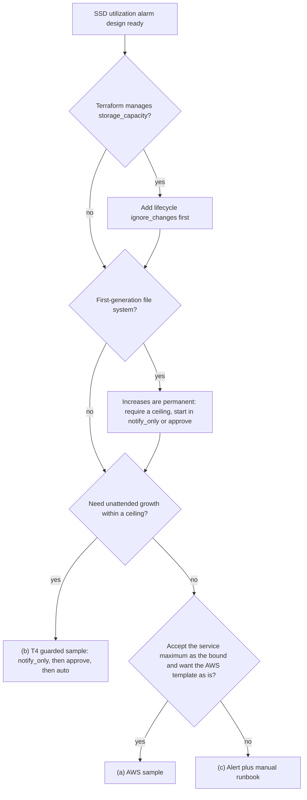

# Monitoring-Driven Capacity Automation for Amazon FSx for NetApp ONTAP

🌐 [日本語](../ja/capacity-automation.md) | **English** (this page)

> **Status / audience / evidence tiers**
>
> Status: design. The guarded SSD auto-increase sample (T4) is implemented at `terraform/fsxn-ssd-auto-increase/` and offline-verified; live verification is pending, so nothing on this page has run against a file system. Audience: AWS users deciding whether, and how far, monitoring of Amazon FSx for NetApp ONTAP should act on its own. The T4 state machine, archive schema, IAM statements and test plan are in the companion [T4 implementation design](capacity-automation-t4-design.md). Evidence tiers: `documented` (stated on the cited AWS or NetApp page, re-read 2026-10-07), `code-inspected` (read from the AWS sample code downloaded on 2026-10-07, not executed), `verified-in-repo` (a dated record in [CloudWatch monitoring verification results](verification-results-cloudwatch-monitoring.md)), `hypothesis` (inferred, not checked), `open` (not answered by any source read). Values use placeholders (`fs-0123456789abcdef0`, `123456789012`, `ap-northeast-1`).

## Executive summary

Three options exist for acting on an SSD capacity alarm: (a) the AWS dynamic-scaling sample as published, (b) the T4 guarded sample in this repository (implemented, offline-verified, live verification pending), and (c) an alert plus a manual runbook. They differ mainly in who sets the upper bound and who approves the change. On a first-generation file system every increase is permanent, and each change to SSD capacity, IOPS or throughput starts a shared 6-hour cooldown, so the bound and the approval step matter more than the speed of the reaction. T4 adds a required ceiling, a `notify_only` default and IAM scoped to one file system; it is offered to teams that choose to automate, not as a default to switch on. Throughput capacity changes stay an alert plus a human-approved runbook, because each change fails over the file server. Volume autosize is configured in ONTAP and watched with an EMS log alarm; the AWS volume API has no autosize field ([UpdateOntapVolumeConfiguration](https://docs.aws.amazon.com/fsx/latest/APIReference/API_UpdateOntapVolumeConfiguration.html), `documented`).

> **Scope note**
>
> Thresholds and the headroom formula that decide when any of this fires are in [sizing-and-headroom.md](sizing-and-headroom.md). This page covers what acts on the alarm. Security response (blocking users or IPs) is a separate concern, covered by [automated-response-guide.md](automated-response-guide.md).

## What can and cannot be automated

| Layer | API | Reversible? | This project's choice |
|---|---|---|---|
| SSD storage capacity | `UpdateFileSystem` `StorageCapacity` | First generation: no. Second generation: yes, but a decrease takes hours to weeks and is billed at both sizes while it runs | Guarded sample T4 (implemented; live verification pending) |
| Provisioned SSD IOPS | `UpdateFileSystem` `OntapConfiguration.DiskIopsConfiguration` | Changes share the 6-hour cooldown | Handled inside T4 only as far as an SSD increase requires |
| Throughput capacity | `UpdateFileSystem` `ThroughputCapacity` or `ThroughputCapacityPerHAPair` | Yes, by another change after the cooldown; each change fails over the file server | Alert plus a human-approved runbook |
| Volume size | `UpdateVolume` `SizeInMegabytes` | Yes | Manual or Terraform |
| Volume autosize | ONTAP CLI `volume autosize` or REST `PATCH /api/storage/volumes/{uuid}`; not in the AWS API | Disabling it: yes, with `-mode off`, which stops future resizing and keeps the current size. A grow already made is undone only by a separate volume resize (`UpdateVolume` `SizeInMegabytes` or ONTAP `volume size`), limited by the data the volume holds | ONTAP runbook plus an EMS log alarm |

Sources: [storage-capacity-and-IOPS](https://docs.aws.amazon.com/fsx/latest/ONTAPGuide/storage-capacity-and-IOPS.html), [managing-throughput-capacity](https://docs.aws.amazon.com/fsx/latest/ONTAPGuide/managing-throughput-capacity.html), [enable-volume-autosizing](https://docs.aws.amazon.com/fsx/latest/ONTAPGuide/enable-volume-autosizing.html) (all `documented`).

## Irreversibility and cooldown

| Fact | Consequence for automation | Source |
|---|---|---|
| First-generation file systems can only increase SSD capacity | Every automatic increase stays until the file system is deleted | [storage-capacity-and-IOPS](https://docs.aws.amazon.com/fsx/latest/ONTAPGuide/storage-capacity-and-IOPS.html) |
| Second-generation decrease: a few hours to a few weeks, billed for the existing and the requested size (10 TiB → 5 TiB is billed as 15 TiB during the operation), at least 9% per decrease, result at or below 80% used, minimum 1,024 GiB per HA pair, I/O pauses of up to 60 seconds per volume, not supported with SnapLock, FlexClone, offline volumes or DP volumes without snapshots | Undoing an automatic increase is a long, billed operation, not an undo | [storage-capacity-and-IOPS](https://docs.aws.amazon.com/fsx/latest/ONTAPGuide/storage-capacity-and-IOPS.html) |
| After changing SSD capacity, provisioned IOPS or throughput capacity, wait at least 6 hours before changing any of them | An automatic SSD increase blocks a throughput change for 6 hours, and the reverse | [storage-capacity-and-IOPS](https://docs.aws.amazon.com/fsx/latest/ONTAPGuide/storage-capacity-and-IOPS.html), [managing-throughput-capacity](https://docs.aws.amazon.com/fsx/latest/ONTAPGuide/managing-throughput-capacity.html) |
| First generation queues throughput and SSD/IOPS requests against each other; second generation cannot run or queue them concurrently | Read `AdministrativeActions` before calling the API | [managing-throughput-capacity](https://docs.aws.amazon.com/fsx/latest/ONTAPGuide/managing-throughput-capacity.html) |
| Each SSD increase is at least 10% of the current capacity, up to the maximum for the file system's configuration (192 TiB on first generation) | Round up; a truncated target can fall below the minimum, and a ceiling above the maximum is rejected | [storage-capacity-and-IOPS](https://docs.aws.amazon.com/fsx/latest/ONTAPGuide/storage-capacity-and-IOPS.html), [quotas](https://docs.aws.amazon.com/fsx/latest/ONTAPGuide/limits.html) |
| New capacity is typically usable within minutes; background storage optimization usually takes a few hours, during which the update shows `UPDATED_OPTIMIZING` | Report completion from `AdministrativeActions` reaching `COMPLETED`, not from the API response or the new capacity value | [storage-capacity-and-IOPS](https://docs.aws.amazon.com/fsx/latest/ONTAPGuide/storage-capacity-and-IOPS.html), [monitoring storage capacity increases](https://docs.aws.amazon.com/fsx/latest/ONTAPGuide/monitoring-storage-capacity-increase.html) |

> **Irreversibility note**
>
> On a first-generation file system with one HA pair, an automatic increase of 10% on 1,024 GiB adds at least 103 GiB that stays billed until the file system is deleted. Test the path with `notify_only` or an IAM-deny control first (see the verification plan).

> **Cost note**
>
> No price was looked up for this page. A second-generation decrease bills both sizes until it completes, so an unwanted increase costs more to reverse than it cost to make. Use the current [FSx for ONTAP pricing page](https://aws.amazon.com/fsx/netapp-ontap/pricing/) with your Region and date.

## Automation options

| Aspect | (a) AWS sample as published | (b) T4 guarded sample (implemented, live verification pending) | (c) Alert plus manual runbook |
|---|---|---|---|
| Setup | Deploy the CloudFormation template and upload the Lambda zip to your bucket | Terraform module `terraform/fsxn-ssd-auto-increase/` | Alarms from T1 or the dashboard template; a runbook |
| IaC form | CloudFormation | Terraform; CloudFormation not planned | Any |
| Upper bound | Service maximum for the deployment type (`code-inspected`) | Required absolute ceiling in GiB, no default, validated against the service maximum at deploy time and at run time | The operator decides each time |
| Approval | None; acts on the alarm | `notify_only` (default), `approve`, `auto` | Always a person |
| While the cooldown blocks | Retries through EventBridge Scheduler (`MaxRetryAttempts` 12, `RetryDelayMinutes` 5) | Defers and reports the next eligible time; hourly re-evaluation while the alarm stays in ALARM, which adds up to 1 hour after the cooldown (`T_recheck` in the [headroom formula](sizing-and-headroom.md#headroom-formula)) | Operator waits |
| IAM scope | `fsx:UpdateFileSystem` and `fsx:DescribeFileSystems` on `"*"` (`code-inspected`) | `fsx:UpdateFileSystem` on one file system ARN (the action lists `file-system` as its resource type, `documented`; policy simulation planned) | The operator's own role |
| Terraform drift | Not addressed (CloudFormation sample) | Requires `ignore_changes` on the file system resource | The operator updates the Terraform value with the change |
| Increment | Growth-based, 10% to `MaxIncrementPercent` (default 100%) | Fixed percentage with ceil, never below 10% | The operator decides |
| Status / evidence | Published by AWS; reviewed here as `code-inspected`, not executed | Implemented in `terraform/fsxn-ssd-auto-increase/`; offline-verified (`terraform test` and the Lambda unit suites); live verification pending | Runbooks on this page; not executed here |

Constraints, stated for each option. (a) suits teams that accept the service maximum as the bound and want an AWS-published template; it has no customer ceiling or approval mode, and its CloudWatch alarm acts only on a state change. (b) suits teams that need a ceiling and an approval stage, or manage the file system with Terraform; it is implemented in `terraform/fsxn-ssd-auto-increase/` and offline-verified, with live verification still pending, and adds a Lambda function, a scheduler, two SNS topics (trigger and notification), a DynamoDB lock table, two log groups and an existing Object Lock bucket to operate. (c) suits teams with an on-call rotation and slow growth; it depends on someone reacting within the headroom computed in [sizing-and-headroom.md](sizing-and-headroom.md#headroom-formula).

> **Evidence note**
>
> The review of option (a) below reads the template and the Lambda code that AWS publishes. Nothing was deployed. Statements about behaviour at run time are `hypothesis` unless the AWS page itself says so.

## Selection flowchart



## Review of the AWS sample

Source: [Updating storage capacity dynamically](https://docs.aws.amazon.com/fsx/latest/ONTAPGuide/automate-storage-capacity-increase.html) and its two downloadable archives, read 2026-10-07. The points that bear on choosing an option:

- No customer-set absolute ceiling and no approval or dry-run mode; the upper bound is the service maximum by deployment type, held as constants in the code (`code-inspected`).
- IAM grants `fsx:UpdateFileSystem` and `fsx:DescribeFileSystems` on `Resource: "*"` (`code-inspected`).
- Two of the three increment paths truncate the target with `int()`. With the percentage clamped to 10, a 1,024 GiB file system gets 1,126 GiB, below the documented 10% minimum (`code-inspected`); that the API rejects it is `hypothesis`.
- CloudWatch invokes alarm actions only on a state change ([AlarmThatSendsEmail](https://docs.aws.amazon.com/AmazonCloudWatch/latest/monitoring/AlarmThatSendsEmail.html), `documented`), so while the alarm stays in ALARM after one increase, no second increase is triggered (`hypothesis` for the sample, not executed).
- The alarm has no `Aggregate` dimension, so per-aggregate fill on a second-generation, multi-HA-pair file system is not watched (`code-inspected`, consequence `hypothesis`).

The parameter list with defaults and the remaining findings are in the [T4 implementation design](capacity-automation-t4-design.md#aws-sample-review-in-detail).

## T4 guarded module

Status: implemented at `terraform/fsxn-ssd-auto-increase/`, offline-verified; live verification pending. A CloudWatch alarm on `StorageCapacityUtilization` (SSD, plus one per `Aggregate` on second generation) invokes a Lambda function through a trigger SNS topic, and an hourly schedule re-evaluates while the alarm stays in ALARM. The function calls AWS APIs only and runs outside a VPC. The guards, in summary:

- Ceiling: a required absolute ceiling in GiB with no default, checked against the documented per-file-system maximum for the deployment type and HA-pair count by Terraform variable validation and a precondition at deploy time, and again by the function before each request.
- Mode: `notify_only` (default) computes and reports only; `approve` emails the computed command for a person to run; `auto` calls the API.
- Increment: `ceil` rounding, never below the 10% service minimum, never above the ceiling.
- Administrative actions and cooldown: no request while an update or storage optimization is pending or running, including `UPDATED_OPTIMIZING`, or within 6 hours of the last SSD, IOPS or throughput change.
- Scope: `fsx:UpdateFileSystem` allowed on one file system ARN only.
- Single flight: a per-file-system DynamoDB lock. No second request is sent while an earlier request's acceptance is unknown. A deterministic error (a ceiling above the service maximum, `BadRequest`, `ServiceLimitExceeded`, access denial) latches a `blocked` state that is reported once and is not retried hourly.
- Progress: tracked from `AdministrativeActions`; `UPDATED_OPTIMIZING` is reported as "capacity available, optimization running", and the final report waits for `COMPLETED`, `FAILED` or `CANCELLED`.
- Audit record: a decision log in CloudWatch Logs plus one S3 Object Lock object per event. `auto` requires compliance-mode retention; governance mode is accepted only for `notify_only` and `approve`.
- Notifications: SNS reports on a notification topic that is separate from the trigger topic, so a report cannot invoke the function.

> **Safety note**
>
> `notify_only` is the default so that deploying the module changes nothing on the file system. Move to `approve` and then `auto` only after the reports match what an operator would have done.

> **Audit note**
>
> Object Lock governance mode is tamper-resistant, not immutable: a principal holding `s3:BypassGovernanceRetention` can delete or shorten governance-protected versions by sending the bypass header. Compliance mode blocks every user, including the root user, until the retain-until date ([object-lock](https://docs.aws.amazon.com/AmazonS3/latest/userguide/object-lock.html), `documented`). The retention contract and the tests that tell the two modes apart are in the [T4 implementation design](capacity-automation-t4-design.md#decision-archive).

## Terraform-managed file systems

When automation changes `storage_capacity` outside Terraform, the next `terraform plan` proposes to change it back. `lifecycle { ignore_changes = [...] }` lets Terraform share an attribute with an outside process: the attribute is ignored when planning updates and still used on create ([lifecycle meta-argument](https://developer.hashicorp.com/terraform/language/meta-arguments/lifecycle), `documented`). The attributes below exist on the AWS provider resources ([aws_fsx_ontap_file_system](https://registry.terraform.io/providers/hashicorp/aws/latest/docs/resources/fsx_ontap_file_system), [aws_fsx_ontap_volume](https://registry.terraform.io/providers/hashicorp/aws/latest/docs/resources/fsx_ontap_volume), `documented`). A volume resource sets its size with either `size_in_megabytes` or `size_in_bytes`; ignore the one your resource sets. Both variants are shown. This configuration is not yet tested live.

```hcl
resource "aws_fsx_ontap_file_system" "this" {
  # ... existing arguments ...

  lifecycle {
    # Automation (T4 or the AWS sample) may raise SSD capacity.
    # disk_iops_configuration is needed only when T4 may raise user-provisioned IOPS.
    ignore_changes = [storage_capacity, disk_iops_configuration]
  }
}

resource "aws_fsx_ontap_volume" "data" {
  # ... existing arguments ...

  lifecycle {
    # ONTAP volume autosize changes the size outside Terraform.
    # Variant for a volume that sets size_in_megabytes.
    ignore_changes = [size_in_megabytes]
  }
}

resource "aws_fsx_ontap_volume" "data_in_bytes" {
  # ... existing arguments ...

  lifecycle {
    # Variant for a volume that sets size_in_bytes instead.
    ignore_changes = [size_in_bytes]
  }
}
```

Without these lines, on a first-generation file system the next apply would request a decrease that the service does not allow; on a second-generation file system it would start a decrease that can run for hours to weeks and is billed at both sizes ([storage-capacity-and-IOPS](https://docs.aws.amazon.com/fsx/latest/ONTAPGuide/storage-capacity-and-IOPS.html)). How the provider plans and applies that change was not tested (`open`).

> **Terraform note**
>
> These lines go into the configuration that builds the file system, which is usually the operator's own construction code, not a monitoring module. Plan the change with the team that owns that code. After adding `ignore_changes`, the Terraform value no longer describes the real capacity; read the current value from `aws fsx describe-file-systems` or the data source.

## Volume autosize runbook

1. Check SSD headroom first. Autosize grows a volume, not the SSD tier; when SSD is full, writes fail even if the volume has room ([low-volume-capacity](https://docs.aws.amazon.com/fsx/latest/ONTAPGuide/low-volume-capacity.html)).
2. Enable autosize with the ONTAP CLI ([enable-volume-autosizing](https://docs.aws.amazon.com/fsx/latest/ONTAPGuide/enable-volume-autosizing.html)). FlexVol volumes only; the maximum size is 300 TB and the default maximum is 120% of the volume size.
3. Or set the same fields with the ONTAP REST API, `PATCH /api/storage/volumes/{uuid}` ([ONTAP REST reference](https://docs.netapp.com/us-en/ontap-restapi/patch-storage-volumes-.html)). `autosize.maximum` is in bytes and cannot be below the current volume size.
4. Confirm the setting with `volume autosize -vserver svm_name -volume vol_name`.
5. Alarm on the EMS event `wafl.vol.autoSize.fail` and watch `wafl.vol.autoSize.done` for capacity trending ([ems-detection-capabilities.md](ems-detection-capabilities.md)). With EMS in CloudWatch Logs, `cloudwatch-log-alarm.yaml` can carry the query; a ready-made recipe for this event is planned under T3.
6. Review the volume capacity alarm threshold against the grow threshold (see the note below).
7. To stop autosize, set `-mode off`. This stops future resizing and leaves the volume at its current size. To return to an earlier size, resize the volume as a separate step (`UpdateVolume` `SizeInMegabytes` or ONTAP `volume size`); the new size has to hold the data already in the volume.

```text
::> volume autosize -vserver svm_name -volume vol_name -mode grow_shrink -grow-threshold-percent 90 -maximum-size 1200GB -shrink-threshold-percent 50 -minimum-size 1000GB
::> volume autosize -vserver svm_name -volume vol_name
```

```json
{
  "autosize": {
    "mode": "grow_shrink",
    "grow_threshold": 90,
    "shrink_threshold": 50,
    "maximum": 1288490188800,
    "minimum": 1073741824000
  }
}
```

> **Interplay note**
>
> After an autosize grow, the volume's `StorageCapacity` should grow and `StorageCapacityUtilization` should drop, so a volume alarm set above the grow threshold fires only once autosize has reached its maximum or failed. That makes it an "autosize exhausted" signal rather than an early warning (`hypothesis`, not observed). Keep the EMS failure alarm for the early signal.

## Throughput capacity change runbook

Trigger: a sustained network or disk utilization alarm (thresholds in [sizing-and-headroom.md](sizing-and-headroom.md#threshold-table)). No automation is planned, because each change fails over the file server, depends on client multipathing for block protocols, and starts the cooldown that would block a later SSD increase.

1. Confirm that no `AdministrativeActions` entry is `PENDING` or `IN_PROGRESS`, and that the last SSD, IOPS or throughput change is more than 6 hours ago.
2. Check the maintenance window; changes may be delayed during maintenance ([managing-throughput-capacity](https://docs.aws.amazon.com/fsx/latest/ONTAPGuide/managing-throughput-capacity.html)).
3. For iSCSI and NVMe/TCP clients, confirm client-side multipathing. NFS and SMB clients keep the same endpoint IP through the failover.
4. Pick a valid value for the deployment type ([UpdateFileSystemOntapConfiguration](https://docs.aws.amazon.com/fsx/latest/APIReference/API_UpdateFileSystemOntapConfiguration.html); table in [sizing-and-headroom.md](sizing-and-headroom.md#generation-and-ha-pair-differences)) and get approval.
5. Run the change and expect an automatic failover and failback of a few minutes.
6. Follow progress in `AdministrativeActions` until the update completes.

```bash
# Example: SINGLE_AZ_1 from 128 to 256 MBps. Use a valid value for your deployment type.
aws fsx update-file-system \
  --file-system-id fs-0123456789abcdef0 \
  --ontap-configuration ThroughputCapacityPerHAPair=256 \
  --region ap-northeast-1

aws fsx describe-file-systems \
  --file-system-ids fs-0123456789abcdef0 \
  --query 'FileSystems[0].AdministrativeActions' \
  --region ap-northeast-1
```

> **Generation note**
>
> On second generation the throughput change cannot run or be queued while an SSD or IOPS change is in progress, and adding HA pairs is not possible during either. On first generation the requests are queued in a documented order ([managing-throughput-capacity](https://docs.aws.amazon.com/fsx/latest/ONTAPGuide/managing-throughput-capacity.html)).

## Verification plan

The deploy-time ceiling-validation row below has been executed (`terraform test`); the live-infrastructure rows, which touch a real file system, bucket or policy simulator, have not been executed yet. Expected evidence for each T4 row, and the completion criteria, are in the [T4 test plan](capacity-automation-t4-design.md#test-plan).

| Test | Reversible | What it shows |
|---|---|---|
| T4 `notify_only` and `approve`, alarm forced with `aws cloudwatch set-alarm-state` | Yes | Reports and decision records without any `UpdateFileSystem` call |
| T4 `auto` behind an explicit IAM deny on `fsx:UpdateFileSystem` | Yes, after the archive's 1-day retention | The call reaches authorization; the error latches `blocked` and is reported once; the next scheduled run makes no call |
| IAM policy simulation of the scoped Allow | Yes (read-only API) | The Allow matches only the configured file system and trigger alarm |
| Scheduled run while the alarm is OK, and two concurrent runs | Yes | No call while OK; at most one call from two invocations |
| Deploy-time ceiling validation (`terraform test`) — executed | Yes | A ceiling outside the documented maximum fails the plan |
| Decision archive in governance mode | Yes, with a short retention on a disposable bucket | Records are protected from the function role and from identities without the bypass permission |
| Decision archive in compliance mode | No before the retain-until date (1 day in the test) | Records cannot be deleted even by an identity holding `s3:BypassGovernanceRetention` |
| Real increase | No on first generation: at least 10% is kept until the file system is deleted, and the 6-hour cooldown starts | The full sequence through `UPDATED_OPTIMIZING` to `COMPLETED`; run only with explicit approval or on a disposable file system, outside the completion criteria |
| Terraform `ignore_changes` after an out-of-band change | Yes on a disposable file system | `terraform plan` shows no change to `storage_capacity`. A plan without the lifecycle block proposes a decrease; run it only on a disposable file system |

## Staged adoption

1. Review sizing and thresholds in [sizing-and-headroom.md](sizing-and-headroom.md).
2. Deploy tiered alarms with SNS notifications and confirm the subscription.
3. Adopt the throughput and volume autosize runbooks, and the EMS alarm for `wafl.vol.autoSize.fail`.
4. Deploy T4 in `notify_only` and compare its reports with operator decisions for some weeks.
5. Switch to `approve`.
6. Switch to `auto` only with a validated ceiling, a compliance-mode decision archive whose retention check passes, an operator named for manual disposition and for clearing a `blocked` latch, and `ignore_changes` in place on any Terraform-managed file system.

> **Notification note**
>
> Options (b) in `approve` mode and (c) both depend on a person receiving an SNS email, and an email subscription stays pending until the recipient confirms it. Confirm every subscription in step 2 before relying on either option.

## FAQ and common misconceptions

**Q: Can I undo an automatic increase**?
A: On first generation, no. On second generation, by a decrease that can take hours to weeks and is billed at both sizes while it runs ([storage-capacity-and-IOPS](https://docs.aws.amazon.com/fsx/latest/ONTAPGuide/storage-capacity-and-IOPS.html), `documented`).

**Q: Does volume autosize prevent the SSD tier from filling**?
A: No. Autosize grows the volume's logical size. SSD space is a file-system resource, and a full SSD tier blocks writes regardless of volume free space.

**Q: Does `-mode off` shrink a volume back after autosize grew it**?
A: No. It stops future resizing and keeps the current size. Returning to an earlier size is a separate volume resize, and the new size has to hold the data already in the volume (the exact lower bound was not tested here).

**Q: Why is throughput capacity not automated**?
A: Each change fails over the file server, block-protocol transparency depends on client multipathing, and the change starts the 6-hour cooldown that would block an SSD increase ([managing-throughput-capacity](https://docs.aws.amazon.com/fsx/latest/ONTAPGuide/managing-throughput-capacity.html), `documented`).

**Q: Will Terraform revert an automatic increase**?
A: The next plan proposes to, unless `ignore_changes` covers `storage_capacity`. The provider's behaviour on that plan was not tested (`open`).

**Q: Is the increase finished once the new capacity shows up**?
A: The capacity is usable, but AWS documents that the update stays in `UPDATED_OPTIMIZING` while storage optimization runs and becomes `COMPLETED` afterwards ([monitoring storage capacity increases](https://docs.aws.amazon.com/fsx/latest/ONTAPGuide/monitoring-storage-capacity-increase.html), `documented`). Report the operation as finished only at `COMPLETED`.

**Q: Is the AWS sample unsafe**?
A: It suits teams that accept the service maximum as the bound and want increases driven by the alarm. The options differ in their guards: the sample has a cooldown with retries and growth-based increments; T4 adds a ceiling, an approval stage and IAM scoped to one file system, and is implemented and offline-verified with live verification still pending.

## Related Documents

- [T4 Guarded SSD Auto-Increase: Implementation Design](capacity-automation-t4-design.md): state machine, lock lifecycle, archive schema, IAM and test plan for option (b).
- [Sizing and Headroom](sizing-and-headroom.md): thresholds and the headroom formula that decide when an option acts.
- [Amazon FSx for NetApp ONTAP Monitoring Design](monitoring-design.md): the four-layer index that links back here.
- [EMS Detection Capabilities](ems-detection-capabilities.md): `wafl.vol.autoSize.done` and `wafl.vol.autoSize.fail`.
- [CloudWatch Log Alarm](cloudwatch-log-alarm.md): the template for alarms on EMS logs.
- [ONTAP audit setup](ontap-audit-setup.md): an existing `volume autosize` example for the audit volume.
- [Updating storage capacity dynamically](https://docs.aws.amazon.com/fsx/latest/ONTAPGuide/automate-storage-capacity-increase.html): the AWS sample reviewed above.
- [Terraform module: fsxn-monitoring-dashboard](../../terraform/fsxn-monitoring-dashboard/README.md): the T1 alarms that feed these options.
