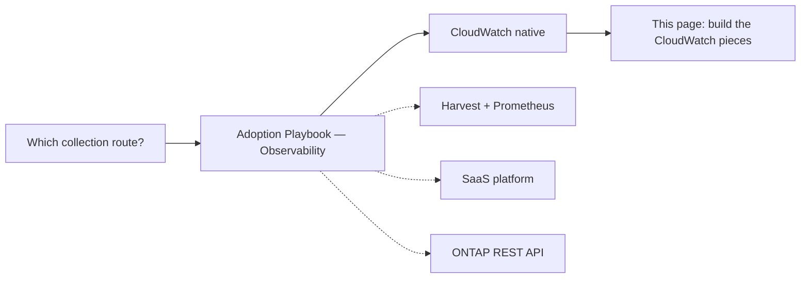

# Amazon FSx for NetApp ONTAP Monitoring Design

🌐 [日本語](../ja/monitoring-design.md) | **English** (this page)

> **Status / audience / evidence tiers**: Status — active (implementation-side index; route selection lives in the Hub). Audience — engineers who have already chosen the CloudWatch collection route and are building the CloudWatch-native pieces. Evidence tiers used on this page: `documented` (stated in cited AWS or NetApp sources), `code-inspected` (read from this repository's templates, not executed), `unverified` (no dated live run exists on this branch), `hypothesis` (inferred, not checked), and `open` (not answered by any source read). The two spokes, [sizing-and-headroom.md](sizing-and-headroom.md) and [capacity-automation.md](capacity-automation.md), label a claim with no dated run `open`; `unverified` on this page means the same thing. The metric catalog, alert design, and automation sections are design, not verified. Each claim below carries its tier inline; the qtree monitor on second-generation or multi-HA-pair file systems, its pagination beyond one page, and the Terraform phases after T1 are the parts you should read as not-yet-verified. `verified` (executed, with a dated record) appears only where such a record exists: the log-alarm E2E run, the 2026-10-05 run of the dashboard template and the Terraform T1 module on a first-generation, single-HA-pair file system, the 2026-10-06 re-run of the qtree monitor on a first-generation, single-HA-pair file system, which completed 4 polls and the alarm's OK → ALARM → OK path, and the 2026-10-06 real-data run that drove the file-system capacity alarm of the template and the T1 module from OK to ALARM and back to OK on a first-generation, single-HA-pair file system ([CloudWatch monitoring verification results](verification-results-cloudwatch-monitoring.md)).

## Executive summary

This page is the **implementation-side index** for monitoring Amazon FSx for NetApp ONTAP with Amazon CloudWatch. It does not decide which collection route you should use. That decision — CloudWatch native, NetApp Harvest with Prometheus, a SaaS observability platform, or the ONTAP REST API — is made in the [Adoption Playbook — Observability](https://github.com/Yoshiki0705/FSx-for-ONTAP-Adoption-Playbook/blob/main/docs/en/domains/observability/README.md). Come here once CloudWatch is the chosen route; this page covers how to build the CloudWatch-native pieces this repository ships, where their boundaries are, and what the Terraform direction looks like.

Concretely, three CloudFormation templates in `shared/templates/` cover the CloudWatch-native path: a performance and capacity dashboard, a per-qtree quota monitor, and a log-based alarm. The qtree monitor is an implemented, code-inspected path intended to publish qtree metrics to CloudWatch, and its threshold alarm now reads an SVM-level maximum series that the Lambda publishes (unit-tested against mocked ONTAP responses). On 2026-10-06, a live re-run on a first-generation, single-HA-pair file system completed 4 consecutive polls, each publishing all five series with values matching the ONTAP quota report, and drove the alarm from OK to ALARM and back to OK on real data ([record](verification-results-cloudwatch-monitoring.md#qtree-quota-monitor-re-run-on-2026-10-06)). An earlier run that day had stopped on an ONTAP HTTP 401 after one poll. Second-generation and multi-HA-pair file systems remain unverified. Each is documented below with when to reach for it, why it exists, and how its scope is bounded.

The page is also the index of four monitoring design layers: sizing, the metric catalog (native and custom), alert design, and monitoring-driven automation. Of the Terraform phases, T1 (dashboard and alarms) is implemented and verified on a first-generation, single-HA-pair file system. T2 (ONTAP REST custom-metrics poller for qtree and SnapMirror, `terraform/fsxn-ontap-custom-metrics/`) is implemented and offline-verified (unit tests, `make terraform`); live verification pending (`unverified`). T3 (log alarm, `terraform/fsxn-log-alarm/`) is implemented and offline-verified; because the pinned provider has no LogAlarm resource, it uses metric filter plus metric alarm. A sample run on 2026-10-09 on a first-generation, single-HA-pair file system verified the mechanism on real admin audit lines, found that the `privileged-operations` and `failed-access` default patterns did not fit those lines (both replaced after the run), and left the EMS `autosize-fail` recipe `unverified` on a real event ([record](verification-results-cloudwatch-monitoring.md#terraform-log-alarm-module-run-on-2026-10-09)). T4 (guarded SSD auto-increase sample) is planned. SSD auto-increase is designed as a guarded sample whose default mode only notifies; throughput capacity changes stay human-approved.

> **Scope note**: This is a routing-and-assembly index, not a route decision tree. If you have not yet chosen between CloudWatch, Harvest, SaaS, and ONTAP REST, start at the Hub observability README linked above, then return here.

## What this page decides vs what the Hub decides

**This page covers the CloudWatch-native implementation**: which template builds which view, what each one can and cannot reach, and where the Terraform modules for the dashboard (T1), the ONTAP REST custom-metrics poller (T2), the log alarm (T3), and the remaining planned Terraform equivalents fit. Every template referenced here exists in the repository today.

**It does not choose the collection route.** Whether metrics and logs should arrive via CloudWatch, Harvest with Prometheus, a SaaS platform, or the ONTAP REST API is a separate decision on a separate axis, and it is made in the [Adoption Playbook — Observability](https://github.com/Yoshiki0705/FSx-for-ONTAP-Adoption-Playbook/blob/main/docs/en/domains/observability/README.md). This mirrors how [decision-tree-management-monitoring.md](decision-tree-management-monitoring.md) separates the management-plane choice from the collection-route choice: reading only one of the two leaves half the architecture undecided.

> **Boundary note**: The management plane (how you reach the file system to administer it) and the collection route (how metrics and logs are gathered and stored) are easy to confuse because both get called "monitoring." This page sits downstream of both: it assumes CloudWatch has been chosen as the route, and documents the build.

## Selecting a route (deferred to the Hub)

Route selection lives in the Hub, not here. Use the pointer below rather than a second decision tree.



For the **management-plane** axis (System Manager via NetApp Console, a self-hosted console, or CLI and REST directly), see [decision-tree-management-monitoring.md](decision-tree-management-monitoring.md). That tree already defers the collection-route choice to the Hub, as this page does.

> **Routing note**: The solid path above (CloudWatch → this page) is the branch this page documents. This repository ships CloudFormation for more than CloudWatch — the SaaS vendor integrations and the qtree monitor are also CloudFormation — so CloudWatch is not the only CloudFormation branch; it is the one assembled here. The dotted branches are implemented elsewhere — Harvest in [management-console/](../../management-console/README.md), SaaS across the nine vendor integrations, ONTAP REST in the qtree monitor below.

## Monitoring design layers

A CloudWatch monitoring design for FSx for ONTAP answers four questions in order. Each layer feeds the next: sizing sets the limits, the catalog says which series show them, alert design turns the series into notifications, and automation decides what acts on a notification.

| Layer | Question it answers | Where | Status |
|---|---|---|---|
| Sizing and headroom | How much throughput and SSD capacity is needed, and how far below each limit should an alarm fire? | [sizing-and-headroom.md](sizing-and-headroom.md) | Design; numbers `documented` or `derived` |
| Metric catalog | Which series exist natively, which need a custom collector, and what each costs? | [Metric catalog](#metric-catalog) below | Native and qtree rows implemented; SnapMirror row implemented in Terraform (T2), live `unverified` |
| Alert design | Which severity, which missing-data policy, which aggregate series, how to know the poller runs? | [Alert design](#alert-design) below | Design; qtree pattern `verified` on first generation |
| Monitoring-driven automation | What acts on an alarm, and with which guards? | [capacity-automation.md](capacity-automation.md) | Design; T4 planned, not implemented |

Three common situations map onto these layers. A first-generation file system with one HA pair has one aggregate and cannot decrease SSD capacity, which shapes the sizing margins and rules out unattended increases without a ceiling. SnapMirror between two file systems needs a custom metric collected from the destination file system (metric catalog). A file system managed by Terraform needs `ignore_changes` before any capacity automation ([capacity-automation.md](capacity-automation.md#terraform-managed-file-systems)).

## Sizing and headroom

Throughput capacity is sized for read throughput plus twice the write throughput, and SSD utilization should stay at or below 80% on an ongoing basis ([managing-throughput-capacity](https://docs.aws.amazon.com/fsx/latest/ONTAPGuide/managing-throughput-capacity.html), [storage-capacity-and-IOPS](https://docs.aws.amazon.com/fsx/latest/ONTAPGuide/storage-capacity-and-IOPS.html), `documented`). At 90% SSD utilization capacity-pool reads stop being cached on SSD, and at 98% tiering stops ([managing-storage-capacity](https://docs.aws.amazon.com/fsx/latest/ONTAPGuide/managing-storage-capacity.html), `documented`). [sizing-and-headroom.md](sizing-and-headroom.md) turns these rules into a worked example, a headroom formula that accounts for the 6-hour cooldown, and a warning, critical and emergency threshold table.

## Metric catalog

| Namespace / metric family | Dimensions | Collection method | Network prerequisites | Cardinality / cost | CloudFormation | Terraform |
|---|---|---|---|---|---|---|
| `AWS/FSx` file system (first generation; also second-generation file-system level) | `FileSystemId`; detailed metrics add `StorageTier` + `DataType` | Native | None | Fixed per file system | Dashboard template ✅ | T1 ✅ |
| `AWS/FSx` second generation, file server and aggregate | `FileSystemId` + `FileServer`; `FileSystemId` + `Aggregate` (storage utilization per aggregate) | Native | None | One series per file server or aggregate | Not in the template | T1 opt-in via `file_server_names` (second generation `unverified`) |
| `AWS/FSx` volume | `FileSystemId` + `VolumeId` | Native | None | Per volume | Not in the template | T1 `volume_ids` ✅ (first generation `verified`) |
| `AWS/FSx` burst balance (`FileServerDiskThroughputBalance`, `FileServerDiskIopsBalance`) | `FileSystemId`; valid below 512 MBps throughput capacity | Native | None | Fixed per file system | Not implemented | Not implemented |
| `FSxONTAP/Qtree` | `SvmName` + `VolumeName` + `QtreeName`; `SvmName` for the max and truncation series. Terraform only: heartbeat `CollectorSucceeded` with `FileSystemId` + `Collector=qtree` | Custom: VPC Lambda polls ONTAP REST `/storage/quota/reports` | HTTPS 443 to the management endpoint, Secrets Manager, and a route to the CloudWatch monitoring API | 3 × N + 2 per SVM (N qtrees), + 1 heartbeat per file system (Terraform) | `qtree-quota-monitor.yaml` ✅ (`verified` on first generation) | T2 implemented (`terraform/fsxn-ontap-custom-metrics/`), live `unverified` |
| `FSxONTAP/SnapMirror` | Per relationship (up to `snapmirror_max_relationships`): `SnapMirrorRelationshipHealthy` (1/0) and `SnapMirrorLagSeconds` with `FileSystemId` + `SourcePath` + `DestinationPath`. Per file system: `SnapMirrorUnhealthyCount` and `SnapMirrorLagSecondsMax` (the alarms read these) and `SnapMirrorRelationshipsTruncated` (1 when any relationship read got no per-relationship series, from the cap or an empty path, or the page cap applied; the aggregates still cover every relationship read) with `FileSystemId`. Heartbeat `CollectorSucceeded` with `FileSystemId` + `Collector=snapmirror`, in this namespace | Custom: VPC Lambda calls `GET /api/snapmirror/relationships` on the destination file system | Same as qtree, for each destination file system | 2 × R + 3 + 1 heartbeat per destination file system (R relationships with series) | Not implemented (follow-up) | T2 implemented, live `unverified` |
| `FSxONTAP/Lakehouse` | Dimensionless alarm series | Pattern placeholder; no collector ships | Depends on the collector | Depends on the collector | `lakehouse-monitoring.yaml` (alarms only) | None |
| CloudWatch Logs (EMS and audit) | Log query | Syslog VPC endpoint path to CloudWatch Logs, then a log alarm | Syslog path ([syslog-vpce-setup-guide.md](syslog-vpce-setup-guide.md)) | Per metric filter, alarm, and ingested volume | `cloudwatch-log-alarm.yaml` ✅ (`verified` 2026-07-02) | T3 implemented (`terraform/fsxn-log-alarm/`), metric-filter + metric-alarm mechanism (the pinned provider has no LogAlarm resource). Mechanism live `verified` on 2026-10-09 on audit-log lines in one sample run ([record](verification-results-cloudwatch-monitoring.md#terraform-log-alarm-module-run-on-2026-10-09)); the `privileged-operations` and `failed-access` default patterns shipped then did not work on real lines and were replaced; EMS `autosize-fail` `unverified` |

Sources for the native rows: [file-system-metrics](https://docs.aws.amazon.com/fsx/latest/ONTAPGuide/file-system-metrics.html), [so-file-system-metrics](https://docs.aws.amazon.com/fsx/latest/ONTAPGuide/so-file-system-metrics.html), [volume-metrics](https://docs.aws.amazon.com/fsx/latest/ONTAPGuide/volume-metrics.html) (`documented`). The lakehouse placeholder is described in [lakehouse-monitoring-patterns.md](lakehouse-monitoring-patterns.md).

> **SnapMirror topology note**
>
> Poll the destination file system. The ONTAP REST reference describes `GET /api/snapmirror/relationships` as returning relationships whose destination endpoints are in the current cluster or SVM, and the source side can list its destinations with `list_destinations_only=true` ([ONTAP 9.18.1 reference](https://docs.netapp.com/us-en/ontap-restapi-9181/get-snapmirror-relationships.html), `documented`; the unversioned URL now serves a later release). Which health and lag fields that source-side listing returns is `open`, so polling only the source is not a substitute. Each destination file system needs its own poller, credential and network path. No native SnapMirror relationship metric appears on the four AWS metric pages read on 2026-10-07; SnapMirror traffic is counted inside the network and disk metrics. The [classmethod article](https://dev.classmethod.jp/articles/amazon-fsx-for-netapp-ontap-snapmirror-health-cloudwatch-metrics/) and the NetApp reference below build the same kind of metric from the same REST data; they are pattern references, and no code was copied.

> **Catalog rules note**
>
> The T2 collectors fix four behaviours the rows above leave open. A missing or non-boolean `healthy` counts as unhealthy (0), so the count fails toward alerting. A missing `lag_time` (for example on an `uninitialized` relationship) or one that does not parse gives no lag datum, and `SnapMirrorLagSecondsMax` is skipped when no lag parsed, as `QtreeQuotaUsedPercentMax` is. `SnapMirrorUnhealthyCount` = 0 also appears when the ONTAP user sees no relationship; the poller log records the relationship count. Qtree series carry no `FileSystemId` (kept for CloudFormation parity), so two file systems with the same SVM name in one account and Region share qtree series. Details: [module README](../../terraform/fsxn-ontap-custom-metrics/README.md#what-it-creates).

> **Cardinality note**
>
> Custom-metric cost scales with the number of series, not the number of alarms. For SnapMirror the per-relationship series grow with R; the per-file-system series and the heartbeat are fixed. No price is given here; take the per-metric rate from the current [CloudWatch pricing page](https://aws.amazon.com/cloudwatch/pricing/) for your Region and date.

> **Network note**
>
> Every custom collector in this catalog runs in a VPC with a path to the ONTAP management endpoint, and needs a NAT gateway or a `com.amazonaws.<region>.monitoring` interface endpoint to publish metrics. The qtree runs on 2026-10-06 needed that endpoint created by hand (record finding QF4).

## CloudWatch monitoring

The CloudWatch-native path puts ONTAP System Manager's performance and capacity views in CloudWatch, so day-to-day watching does not require opening ONTAP System Manager. For the quota view, the repository ships an implemented, code-inspected path that publishes qtree metrics to CloudWatch; on a first-generation file system on 2026-10-06, publication was observed across 4 poll cycles and the quota alarm went from OK to ALARM and back to OK (see the qtree section below). The feature-by-feature mapping (System Manager view → CloudWatch metric → template) is in [native-alternative-matrix.md](native-alternative-matrix.md); this section documents the three templates behind that mapping.

AWS primary sources for the metrics and alarms used below:

- [Monitoring FSx for ONTAP with Amazon CloudWatch](https://docs.aws.amazon.com/fsx/latest/ONTAPGuide/monitoring-cloudwatch.html)
- [Creating an alarm for low primary storage](https://docs.aws.amazon.com/fsx/latest/ONTAPGuide/alarm-low-primary-storage.html)
- [FSx for ONTAP file system metrics](https://docs.aws.amazon.com/fsx/latest/ONTAPGuide/file-system-metrics.html)

> **Scope note**: AWS documents FSx for ONTAP CloudWatch metrics as file-system metrics and detailed file-system metrics; the file-system metrics take the `FileSystemId` dimension, and the detailed metrics add `StorageTier` and `DataType` ([file-system-metrics.html](https://docs.aws.amazon.com/fsx/latest/ONTAPGuide/file-system-metrics.html), confidence: `documented`). The boundary that matters here is that the native metric set has no qtree or per-user dimension — not that nothing below the file system is measured. The qtree monitor below reaches qtree granularity through the ONTAP REST API, and per-user access needs audit logs (see [event-sources.md](event-sources.md)).

### Performance and capacity dashboard

**Template**: `shared/templates/fsxn-monitoring-dashboard.yaml`

**When**: You have chosen CloudWatch and want IOPS, throughput, network utilization, and storage capacity in one dashboard, plus an alarm before capacity runs out.

**Why**: It replaces the ONTAP System Manager performance and capacity views for the metrics AWS publishes to CloudWatch, so you do not need to open a management console for day-to-day capacity watching.

**How**: Deploy with four parameters — `FileSystemId`, `FileSystemName`, `CapacityThresholdPercent` (default 80), and an optional `NotificationEmail` that provisions an Amazon Simple Notification Service (Amazon SNS) topic and subscription. The dashboard draws IOPS (`DataReadOperations` + `DataWriteOperations`), throughput (`DataReadBytes` + `DataWriteBytes`), network utilization (`NetworkThroughputUtilization`), and capacity (`StorageUsed` + `StorageCapacityUtilization`). The stack always creates two alarms: `StorageCapacityAlarm` on `StorageCapacityUtilization` (selected with `FileSystemId` + `StorageTier=SSD` + `DataType=All`) at `CapacityThresholdPercent`, and `ThroughputUtilizationAlarm` on `NetworkThroughputUtilization` at a fixed 80%. When `NotificationEmail` is set, the SNS topic is attached to both alarms.

The **latency widget is not yet implemented** (confidence: `code-inspected`, `fsxn-monitoring-dashboard.yaml` renders no latency widget). The underlying metrics `DataReadOperationTime` and `DataWriteOperationTime` exist, and period-average latency can be derived as `OperationTime * 1000 / Operations` (confidence: `documented`, [file-system-metrics.html](https://docs.aws.amazon.com/fsx/latest/ONTAPGuide/file-system-metrics.html)), but the dashboard template does not yet render that widget. [native-alternative-matrix.md](native-alternative-matrix.md) records this as a partial row for the dashboard template.

> **Latency note**: The AWS metric pairs `DataReadOperationTime`/`DataWriteOperationTime` divided by the corresponding operation counts can derive period-average latency (summed over the period, so the result is an average, not p99); this template does not currently render that widget. For tail latency, source it from request-level telemetry rather than these aggregate metric pairs.

> **Capacity dimension note**: AWS documents file-system-level `StorageCapacityUtilization` only with `FileSystemId` + `StorageTier` + `DataType`, and on second-generation file systems optionally with `Aggregate` as well ([file-system-metrics.html](https://docs.aws.amazon.com/fsx/latest/ONTAPGuide/file-system-metrics.html), [so-file-system-metrics.html](https://docs.aws.amazon.com/fsx/latest/ONTAPGuide/so-file-system-metrics.html), retrieved 2026-10-05). Earlier versions of this template selected `FileSystemId` alone, a set AWS does not document for this metric, so the capacity alarm and widget could match no series and the alarm would never fire. The alarm and widget now select `FileSystemId` + `StorageTier=SSD` + `DataType=All`, the same set as the Terraform module (confidence: `code-inspected` and unit-tested by `shared/python/tests/test_monitoring_dashboard_dimensions.py`). On a first-generation `SINGLE_AZ_1` file system with one HA pair, that series returned data and the alarm left INSUFFICIENT_DATA and reached OK (confidence: `verified`, 2026-10-05, [record](verification-results-cloudwatch-monitoring.md)). That run could not make the alarm fire, because the lowest allowed `CapacityThresholdPercent` is 50 and utilization was about 3.5% (finding F1 in the record). A later run wrote about 472.5 GiB of real data to a test volume on a first-generation, single-HA-pair file system, raised SSD utilization to 58.6%, and observed this alarm and the Terraform `storage_capacity` alarm go from OK to ALARM and back to OK at a threshold of 50 (confidence: `verified`, 2026-10-06, [record](verification-results-cloudwatch-monitoring.md#capacity-alarm-real-data-run-on-2026-10-06)). On second-generation multi-HA-pair file systems, whether a series without `Aggregate` is emitted is `unverified`, because the AWS page says the metric is emitted per aggregate.

> **Live verification note**: On 2026-10-05 this template was deployed in `ap-northeast-1` against a first-generation `SINGLE_AZ_1` file system with one HA pair. The stack created the dashboard and both alarms; all 9 metric series behind the dashboard widgets returned datapoints over a 3-hour window; `StorageCapacityAlarm` and `ThroughputUtilizationAlarm` each left INSUFFICIENT_DATA and reached OK within about a minute (confidence: `verified`, [CloudWatch monitoring verification results](verification-results-cloudwatch-monitoring.md)). Not covered by that run: the capacity alarm's ALARM transition (F1), SNS delivery (no `NotificationEmail` was set), second-generation and multi-HA-pair file systems, and behavior under load. The file system was idle, so the run shows that the series exist and are evaluated, not how they behave under load. The ALARM transition was covered by the later real-data run on 2026-10-06 (see the capacity dimension note above); SNS delivery and the other file-system shapes remain `unverified`. On 2026-10-07 a screenshot of the deployed dashboard showed that, while the series returned data, four widgets (Network Throughput, IOPS, Network Sent/Received, Storage Used) drew their raw inputs on the same axis as the converted series, so the converted lines sat near zero. The template now hides those raw rows with `visible: false`; the alarms were not affected ([dashboard display note](verification-results-cloudwatch-monitoring.md#findings)).

> **Recovery-queue note**: Deleting a volume does not clear a capacity alarm right away. AWS documents that a deleted FSx for ONTAP volume is placed in ONTAP's recovery queue ([Recovering deleted FSx for ONTAP volumes](https://docs.aws.amazon.com/fsx/latest/ONTAPGuide/recovering-deleted-volumes.html)), and AWS re:Post states that by default it stays there for at least 12 hours before it is fully deleted ([How can I recover a deleted FSx for ONTAP volume?](https://repost.aws/knowledge-center/fsx-ontap-recover-deleted-volume)) (confidence: `documented`). In the 2026-10-06 real-data run, the deleted test volume kept counting toward SSD used space: the aggregate read 505.10 GiB used (58.6%) both before and after the deletion. Both capacity alarms returned to OK about 3.5 minutes after the queue entry was purged (confidence: `verified`, [record](verification-results-cloudwatch-monitoring.md#return-to-ok-and-the-volume-recovery-queue)). A purge is irreversible: the volume can no longer be recovered from the queue. Release after the retention period without a purge was not observed.

> **Cost note**: As of the [CloudWatch pricing page](https://aws.amazon.com/cloudwatch/pricing/) checked 2026-10-04 in us-east-1, a CloudWatch dashboard is $3/month per dashboard beyond the free allotment, and a standard-resolution metric alarm is approximately $0.10/month each (this stack creates two such alarms). Pricing changes over time and varies by Region — confirm against the current page. The SNS topic is only created when `NotificationEmail` is set.

### Per-qtree quota monitoring

**Template**: `shared/templates/qtree-quota-monitor.yaml`

**When**: You need quota usage per qtree, which the file-system-level CloudWatch metrics cannot express.

**Why**: It fills the gap that native CloudWatch metrics carry no qtree identity or quota-usage dimension (the file-system metrics take `FileSystemId`, and the detailed metrics add `StorageTier`/`DataType` — none of which name a qtree). A Lambda function is written to poll the ONTAP REST API `/storage/quota/reports` and publish `FSxONTAP/Qtree` custom metrics (`QtreeQuotaUsedPercent`, `QtreeQuotaUsedBytes`, `QtreeQuotaLimitBytes`) per qtree, plus two SVM-level metrics, `QtreeQuotaUsedPercentMax` and `QtreeQuotaReportTruncated` (confidence: `code-inspected`, unit-tested against mocked ONTAP responses; operational publication `verified` across 4 consecutive poll cycles on a first-generation, single-HA-pair file system on 2026-10-06 ([record](verification-results-cloudwatch-monitoring.md#qtree-quota-monitor-re-run-on-2026-10-06)); second-generation and multi-HA-pair file systems `unverified`). The template also declares a `QuotaThresholdPercent` (default 85) quota alarm on `QtreeQuotaUsedPercentMax` — see the alarm note below.

**How**: Deploy with the ONTAP management endpoint IP (`OntapMgmtIp`), a Secrets Manager ARN for ONTAP admin credentials, the `SvmName`, VPC placement parameters (`VpcId`, `SubnetIds`, `SecurityGroupId`), a `PollIntervalMinutes` (default 5), and `QuotaThresholdPercent`, plus the optional `CaCertPath`/`CaCertLayerArn` for TLS verification (see the security note). The Lambda is written to publish `QtreeQuotaUsedPercent`, `QtreeQuotaUsedBytes`, and `QtreeQuotaLimitBytes`, each with the full dimension set `SvmName` + `VolumeName` + `QtreeName`, so each qtree is a distinct CloudWatch metric — up to the per-poll ceiling of 10,000 records noted below. Once per run it also publishes `QtreeQuotaUsedPercentMax` and `QtreeQuotaReportTruncated` with the `SvmName` dimension only. The per-qtree custom-metric path, the SVM-level metrics, and the DLQ-depth alarm are the parts of this stack that are implemented, `code-inspected`, and unit-tested against mocked ONTAP responses (`shared/python/tests/test_qtree_quota_monitor.py`); two dated live runs exist, both on 2026-10-06 on a first-generation file system with one HA pair. The first ([record](verification-results-cloudwatch-monitoring.md#qtree-quota-monitor-run-on-2026-10-06)) published all five series in one poll, then stopped on an ONTAP HTTP 401; its failed invocations moved the DLQ-depth alarm to ALARM. The re-run ([record](verification-results-cloudwatch-monitoring.md#qtree-quota-monitor-re-run-on-2026-10-06)) completed 4 consecutive polls with the dimension sets described here and values matching the ONTAP quota report, and `QtreeQuotaAlarm` went from OK to ALARM at a threshold of 50 and back to OK at 85 (confidence: `verified` for that file-system shape). Second-generation and multi-HA-pair file systems, CA-verified TLS, SNS delivery, and pagination beyond one page are `unverified`.

> **Coverage note (per-poll 10,000-record ceiling)**: Each poll requests `/storage/quota/reports` with `max_records=200` per page and follows `_links.next.href` until ONTAP returns no further link, up to a hard cap of 50 pages, which is 10,000 tree quota records per SVM (confidence: `code-inspected`, unit-tested against mocked ONTAP responses; against a real SVM only the single-page case ran, in both 2026-10-06 runs, with 2 records and `QtreeQuotaReportTruncated=0`; following a next link and the truncation path were not exercised). When the cap stops the read while a next link is still present, the Lambda logs a warning and publishes `QtreeQuotaReportTruncated=1` (dimension `SvmName`); every other successful run publishes `0`. Records past the cap get no metrics that cycle, so alarm on `QtreeQuotaReportTruncated` > 0 if your SVM can approach 10,000 tree quotas; the template does not create that alarm.

> **Network note (CloudWatch API egress required)**: The Lambda runs in your VPC and calls `cloudwatch:PutMetricData`. The template creates an interface VPC endpoint for Secrets Manager only — not for CloudWatch — so a private subnet with no NAT gateway and no CloudWatch monitoring (`com.amazonaws.<region>.monitoring`) interface endpoint can read credentials and reach ONTAP yet be unable to publish metrics (confidence: `code-inspected`, the template declares one `AWS::EC2::VPCEndpoint`, for Secrets Manager). The `cw.put_metric_data` call is not wrapped in a try/except, so a network failure raises and fails the invocation rather than being swallowed — see the failure-semantics note. Provide a route to the CloudWatch monitoring API: a NAT gateway, or a `com.amazonaws.<region>.monitoring` interface endpoint in the Lambda's subnets. In both 2026-10-06 runs the Lambda subnet had no NAT gateway, and metrics were published through a `monitoring` interface endpoint created by hand for each run; `shared/scripts/preflight-check.sh` does not check for that endpoint (record finding QF4).

> **Failure-semantics note**: `QuotaPollSchedule` (an EventBridge rule) invokes the Lambda asynchronously, so a raised exception — a `put_metric_data` network failure, an ONTAP timeout — is retried twice by Lambda and then delivered to the DLQ (confidence: `code-inspected`, `qtree-quota-monitor.yaml`; observed once on 2026-10-06, where an ONTAP HTTP 401 was retried twice, reached the DLQ, and moved the DLQ-depth alarm to ALARM). The poller has no back-off on 401/403: in that run the 5-minute schedule plus the retries sent 6 failing basic-auth requests in about 8 minutes, which can keep an account locked under an ONTAP lockout policy (record finding QF2). The DLQ-depth alarm therefore fires on invocations that failed every retry, not on every way polling can stop: a disabled schedule rule, a removed invoke permission, or any no-invocation condition stops the metrics without producing a DLQ message, so a quiet DLQ is not proof that polling is healthy. All alarms in this stack attach their SNS action only under `HasNotificationEmail`; when `NotificationEmail` is left empty, the alarms still change state in CloudWatch but send no notification. The function timeout is 300 seconds, sized for 50 sequential report pages plus the batched `PutMetricData` calls; a run that exceeds it fails, is retried, and lands in the DLQ like any other failure. When a run finds no qtree with a usable hard limit, the Lambda publishes no `QtreeQuotaUsedPercentMax` datum rather than a misleading 0, and `QtreeQuotaAlarm` uses `TreatMissingData: missing`, so with no datapoints it moves to INSUFFICIENT_DATA rather than OK.

> **Alarm note**: `QtreeQuotaAlarm` reads `QtreeQuotaUsedPercentMax` with only the `SvmName` dimension. The Lambda publishes that series once per run as the maximum `QtreeQuotaUsedPercent` across the qtrees it read, so the alarm's metric name and dimension set match a series the Lambda emits. CloudWatch identifies a metric by its complete dimension set, which is why the earlier definition (`QtreeQuotaUsedPercent` with `SvmName` alone) matched nothing; a template-level unit test now asserts that the alarm's (metric, dimension set) pair is one the Lambda emits, and that the earlier definition is not (confidence: `code-inspected`, unit-tested against mocked ONTAP responses; in the 2026-10-06 re-run on a first-generation file system the alarm went from INSUFFICIENT_DATA to OK, to ALARM, and back to OK on real data, `verified`; second-generation and multi-HA-pair file systems `unverified`). The alarm tells you that some qtree on the SVM crossed the threshold, not which one; the [native-alternative-matrix.md](native-alternative-matrix.md) "Identifying the Offending Qtree" section enumerates the complete `SvmName`/`VolumeName`/`QtreeName` identities with `list-metrics` and queries each one to find it.

> **Security note**: ONTAP admin credentials come from AWS Secrets Manager by ARN, never from Lambda environment variables. The Lambda reaches the ONTAP management endpoint over HTTPS (443) from inside the VPC with a security group that allows egress to that IP. TLS certificate verification is opt-in: set `CaCertPath` to the CA certificate path (for example `/opt/certs/ontap-ca.pem`) and `CaCertLayerArn` to a Lambda layer that ships the PEM, and the Lambda connects with `cert_reqs="CERT_REQUIRED"`. With `CaCertPath` empty (the default) it keeps `cert_reqs="CERT_NONE"` and logs a warning that this is for PoC use only, so the transport is encrypted but the endpoint certificate is not authenticated (confidence: `code-inspected`, unit-tested against mocked ONTAP responses; verification against a real ONTAP certificate `unverified`; the 2026-10-06 run used the default and logged the PoC warning). The Lambda issues only `GET` requests to `/api/storage/quota/reports` (confidence: `code-inspected`), so the secret can hold a dedicated ONTAP account with a read-only role instead of `fsxadmin`; that was not tested. If `fsxadmin` is shared, update every client that stores its password before, or together with, a reset: in the first 2026-10-06 run the poller's credential was rejected with HTTP 401 shortly after a reset. The probable cause was another client still logging in with a previous password: in the re-run, that client was throttled before a new reset and 4 polls ran with no 401. An ONTAP-side lockout was not proven. [integrations/datadog/docs/en/production-checklist.md](../../integrations/datadog/docs/en/production-checklist.md) describes the same parameter pair for another stack.

> **IaC note**: This template is the clearest example of why a monitoring view can need the ONTAP management plane: the data does not exist in CloudWatch until this Lambda writes it there. The Terraform equivalent (T2, `terraform/fsxn-ontap-custom-metrics/`) carries the same VPC and Secrets Manager dependencies.

### Log-based alarms

**Template**: `shared/templates/cloudwatch-log-alarm.yaml` — documented in [cloudwatch-log-alarm.md](cloudwatch-log-alarm.md).

**When**: FSx for ONTAP admin audit logs are already flowing to CloudWatch Logs and you want an alarm directly from a Logs Insights query, without first building a metric filter.

**Why**: It uses the `AWS::CloudWatch::LogAlarm` resource to alarm straight off log content — bulk deletions, privileged operations, unauthorized access patterns. AWS announced alarms on log queries in its [July 2026 What's New entry](https://aws.amazon.com/about-aws/whats-new/2026/07/amazon-cloudwatch-log-alarms/), which lists CloudFormation among the supported interfaces, and documents the resource in the [`AWS::CloudWatch::LogAlarm` reference](https://docs.aws.amazon.com/AWSCloudFormation/latest/TemplateReference/aws-resource-cloudwatch-logalarm.html) and [Alarming on logs](https://docs.aws.amazon.com/AmazonCloudWatch/latest/monitoring/Alarm-On-Logs.html) (confidence: `documented`, pages read 2026-10-04).

**How**: See [cloudwatch-log-alarm.md](cloudwatch-log-alarm.md) for parameters, the detection types, and the deploy script. CloudFormation deployment and scheduled-query evaluation (INSUFFICIENT_DATA → OK) were exercised in `ap-northeast-1` on 2026-07-02 (confidence: `verified`, see [E2E Validation Results (2026-07-02)](cloudwatch-log-alarm.md#e2e-validation-results-2026-07-02)).

> **Lint note (dated observation)**: The 2026-07-02 E2E record notes that `cfn-lint` reported E3006 for `AWS::CloudWatch::LogAlarm`; that record does not state the cfn-lint version. On 2026-10-04, the repository's pinned `cfn-lint==1.56.3` (`requirements-dev.txt`) reported no findings on `cloudwatch-log-alarm.yaml`, while a control template with an unknown resource type did produce E3006 on the same install. The blocking lint tier still ignores E3006 (`CFN_LINT_IGNORE` in the `Makefile`). Treat E3006 on this resource as version-dependent, not as a standing condition.

> **Observability note**: Getting audit logs into CloudWatch Logs is a prerequisite handled by the syslog VPC Endpoint path ([syslog-vpce-setup-guide.md](syslog-vpce-setup-guide.md)), not by this template.

## Alert design

This section is design guidance. Only the qtree pattern and the T1 alarms have dated runs ([record](verification-results-cloudwatch-monitoring.md)); the T2 alarms have offline tests only.

Severity tiers follow the [threshold table](sizing-and-headroom.md#threshold-table): warning, critical and emergency. Route warning to a ticket or chat topic and critical and emergency to a paging topic. Today T1 and the dashboard template create one tier per signal, so a second tier is a second alarm.

| Alarm kind | `TreatMissingData` | Reason |
|---|---|---|
| Native file-system and volume alarms (dashboard template, T1) | `missing` | A native series that stops is an AWS-side or configuration issue; INSUFFICIENT_DATA is visible without paging on it |
| Custom aggregate-max series (`QtreeQuotaUsedPercentMax`, and in T2 `SnapMirrorUnhealthyCount` and `SnapMirrorLagSecondsMax`) | `missing` | The qtree Lambda publishes no max datum when no usable record exists, so the alarm moves to INSUFFICIENT_DATA rather than a misleading OK |
| DLQ depth | `notBreaching` | No messages means no failed invocations |
| Poller heartbeat (T2, `CollectorSucceeded`) | `breaching` | A poller that is not invoked publishes nothing; treating missing data as breaching turns that silence into an alarm |

The aggregate-max plus drill-down pattern keeps alarm count fixed: one alarm reads the per-SVM or per-file-system maximum, and the per-entity series answer "which one" after it fires. The qtree monitor uses it today (`verified` on first generation, [record](verification-results-cloudwatch-monitoring.md#qtree-quota-monitor-re-run-on-2026-10-06)); the T2 SnapMirror collector uses it (offline-tested, live `unverified`).

A DLQ-depth alarm sees invocations that failed every retry. It does not see a poller that is never invoked (a disabled schedule, a removed permission). The T2 heartbeat alarm covers that case; the CloudFormation qtree template has no heartbeat.

> **Notification note**
>
> CloudWatch invokes alarm actions only when the alarm changes state ([AlarmThatSendsEmail](https://docs.aws.amazon.com/AmazonCloudWatch/latest/monitoring/AlarmThatSendsEmail.html), `documented`). An alarm that stays in ALARM pages once. Automation that must act again while the condition persists needs its own re-evaluation, which is why T4 adds an hourly schedule. An SNS email subscription stays pending until confirmed; delivery of an ALARM email through SNS is still `unverified` in this repository, as the [T1 module README](../../terraform/fsxn-monitoring-dashboard/README.md) records.

## Monitoring-driven automation

Three choices exist for acting on an SSD capacity alarm: the AWS sample as published, the planned T4 guarded sample (ceiling, `notify_only` default, cooldown and `AdministrativeActions` checks, IAM scoped to one file system), or an alert with a manual runbook. Throughput capacity changes and volume autosize stay runbooks. The trade-offs, the irreversibility table and the verification plan are in [capacity-automation.md](capacity-automation.md); the T4 state machine, archive schema, IAM statements and test plan are in [capacity-automation-t4-design.md](capacity-automation-t4-design.md). T4 is planned and not implemented.

> **Irreversibility note**
>
> On a first-generation file system an SSD increase cannot be undone, and any SSD, IOPS or throughput change starts a 6-hour cooldown ([storage-capacity-and-IOPS](https://docs.aws.amazon.com/fsx/latest/ONTAPGuide/storage-capacity-and-IOPS.html), `documented`). Test automation with a notify-only or IAM-deny control run before a real increase.

## NetApp public reference

NetApp publishes a CloudWatch monitoring reference implementation in the [CloudWatch-Monitoring-FSx subtree](https://github.com/NetApp/FSx-ONTAP-monitoring/tree/main/CloudWatch-Monitoring-FSx) of [github.com/NetApp/FSx-ONTAP-monitoring](https://github.com/NetApp/FSx-ONTAP-monitoring) (confidence: `documented`, from the subtree README and `cloudformation-template.json`, read 2026-10-07). It deploys a single region-wide dashboard covering all FSx for ONTAP file systems, with a Lambda function, three EventBridge schedulers, IAM roles, and optional VPC endpoints, in Full Stack, Monitoring Only, or EMS Logs Only modes; its dashboard spans client operations, storage utilization, disk performance, latency, per-volume stats, LUN performance, and SnapMirror status, and it streams EMS messages to CloudWatch Logs. The Lambda function is a container image pulled from an ECR repository in a NetApp-owned account, and its source is not in the subtree. Anonymous usage reporting is optional and controlled by the `SendUsage` parameter, whose template default is `true`. The Lambda function creates, updates and deletes alarms hourly for every FSx for ONTAP file system in the Region; those alarms sit outside CloudFormation state, and the README asks operators to delete the `FSx-ONTAP` alarms by hand after deleting the stack. They would likewise sit outside Terraform state (derived). The same repository's [FSx_ONTAP_Alerting](https://github.com/NetApp/FSx-ONTAP-monitoring/tree/main/FSx_Alerting/FSx_ONTAP_Alerting) offers both CloudFormation and Terraform deployment. This repository splits a smaller, fixed single-file-system dashboard, qtree quota polling, and log-based alarms into separate CloudFormation templates, with the dashboard also available as Terraform (T1). The two suit different starting points, and neither is a replacement for the other.

Two other public sources inform the design here as pattern references; no code was copied. AWS publishes a CloudFormation sample that increases SSD capacity on an alarm ([Updating storage capacity dynamically](https://docs.aws.amazon.com/fsx/latest/ONTAPGuide/automate-storage-capacity-increase.html)) and the sizing rules used in [sizing-and-headroom.md](sizing-and-headroom.md) ([managing-storage-capacity](https://docs.aws.amazon.com/fsx/latest/ONTAPGuide/managing-storage-capacity.html)). A [classmethod article](https://dev.classmethod.jp/articles/amazon-fsx-for-netapp-ontap-snapmirror-health-cloudwatch-metrics/) (logs dated 2024-11) publishes SnapMirror relationship health as a custom CloudWatch metric from a scheduled Lambda function.

For the Harvest-plus-Prometheus path (the route the Hub may send you to instead of CloudWatch), the equivalent NetApp-published tooling is [NetApp Harvest](https://github.com/NetApp/harvest), implemented in this repository under [management-console/](../../management-console/README.md). Harvest suits teams that need the full ONTAP metric set (protocol, aggregate, and node level); CloudWatch suits teams that want metrics in the native AWS monitoring plane without running a collector.

> **Neutrality note**: The trade-off is symmetric. The NetApp reference repo covers more of ONTAP in one region-wide stack (volume, LUN, SnapMirror, EMS), adds alarms for new file systems without a redeploy, and leaves alarm cleanup to the operator per its own disclaimer; its Lambda source is not in the subtree. The templates here cover a narrower, fixed scope split across separate stacks, keep every alarm in IaC state, have a SnapMirror collector only in the T2 Terraform module (live `unverified`), not in CloudFormation, and the qtree alarm has been observed firing on real data only on a first-generation, single-HA-pair file system (see the alarm note above). The AWS sample automates SSD increases with a cooldown but no customer ceiling; the planned T4 adds guards but does not exist yet. Which fits depends on your metric breadth, how you prefer to manage stacks, and how much you want automation to do, not on one ranking above the other.

## Terraform direction

### IaC reference implementations

The sources below were read during this repository's IaC survey (investigation date 2026-10-04). Each is labeled by scope so the catalog is read correctly: **monitoring** builds the CloudWatch alarm set, **construction** builds the file system (SVM/volumes/backups) but no monitoring, and **building-block** is a provider or resource a monitoring module composes. All are cited as `documented` — the pages were read, not run — and the framing is right-tool-for-the-job: each entry fits a different starting point, and the trade-offs are stated symmetrically rather than ranked.

| Source | Scope | URL | Neutral one-line description |
|---|---|---|---|
| Community AWS CDK project `aws-cdk-fsxn-resources` | monitoring | [github.com/non-97/aws-cdk-fsxn-resources](https://github.com/non-97/aws-cdk-fsxn-resources) | AWS CDK (TypeScript) project whose monitoring construct creates an SNS topic plus the CloudWatch alarm set (file-system capacity / network-throughput / file-server-disk-throughput / disk-IOPS / CPU; per-volume capacity + inode; backup-jobs-failed). This is a CDK reference, not CloudFormation, and the repository shows no license — reference the pattern, do not copy the code. |
| NetApp `FSx-ONTAP-samples-scripts` (Terraform) | construction | [github.com/NetApp/FSx-ONTAP-samples-scripts/.../Terraform](https://github.com/NetApp/FSx-ONTAP-samples-scripts/tree/main/Infrastructure_as_Code/Terraform) | Apache-2.0 Terraform examples (File Share / SQL Server / file-system deployment / DR replication). Builds the file system, not CloudWatch monitoring. |
| Community Terraform module `terraform-aws-fsx-netapp-ontap` | construction | [github.com/JManzur/terraform-aws-fsx-netapp-ontap](https://github.com/JManzur/terraform-aws-fsx-netapp-ontap) | Terraform module for the file system, SVMs, volumes, a managed security group, and on-demand volume backups, with a create-or-lookup mode. No monitoring resources. |
| aws-samples `genai-bedrock-fsxontap` (terraform) | construction | [github.com/aws-samples/genai-bedrock-fsxontap/.../terraform](https://github.com/aws-samples/genai-bedrock-fsxontap/tree/main/terraform) | A Bedrock + FSx for ONTAP GenAI stack with `fsx.tf` among many `.tf` files. Construction for a GenAI workload, not a monitoring module. |
| Community Zenn article (Terraform) | construction | [zenn.dev/shikazuki/articles/5f925edb148c85](https://zenn.dev/shikazuki/articles/5f925edb148c85) | Builds FSx for ONTAP with Terraform and sets up SMB/NFS multiprotocol sharing. No CloudWatch monitoring. |
| AWS Storage Blog (Terraform) | construction | [aws.amazon.com/blogs/storage/deploying-amazon-fsx-for-netapp-ontap-hashicorp-terraform](https://aws.amazon.com/blogs/storage/deploying-amazon-fsx-for-netapp-ontap-hashicorp-terraform) | Walkthrough of deploying FSx for ONTAP with HashiCorp Terraform. Construction, not monitoring. |
| Yoshiki0705 `FSx-for-ONTAP-Agentic-Access-Aware-RAG` | construction | [github.com/Yoshiki0705/FSx-for-ONTAP-Agentic-Access-Aware-RAG](https://github.com/Yoshiki0705/FSx-for-ONTAP-Agentic-Access-Aware-RAG) | CDK reference that builds FSx for ONTAP as construction; its CloudWatch monitoring targets the RAG application (Lambda / CloudFront / DynamoDB), not FSx for ONTAP file-system metrics. |
| NetApp `terraform-provider-netapp-ontap` | building-block | [github.com/NetApp/terraform-provider-netapp-ontap](https://github.com/NetApp/terraform-provider-netapp-ontap) | Official NetApp ONTAP Terraform provider — the ONTAP-internal-plane building block for any metric the AWS plane does not expose. |
| AWS provider resources | building-block | [`aws_fsx_ontap_file_system`](https://registry.terraform.io/providers/hashicorp/aws/latest/docs/resources/fsx_ontap_file_system) · [`aws_cloudwatch_metric_alarm`](https://registry.terraform.io/providers/hashicorp/aws/latest/docs/resources/cloudwatch_metric_alarm) · [`aws_cloudwatch_dashboard`](https://registry.terraform.io/providers/hashicorp/aws/latest/docs/resources/cloudwatch_dashboard) · [`aws_sns_topic`](https://registry.terraform.io/providers/hashicorp/aws/latest/docs/resources/sns_topic) | The AWS-provider primitives a Terraform monitoring module composes. |

**The honest gap stands.** No turnkey public Terraform *monitoring* module for FSx for ONTAP was found in the sources checked (confidence: `unverified` that one exists). The construction references above are construction, not monitoring. The one direct monitoring precedent — the community `aws-cdk-fsxn-resources` project — is CDK, not Terraform, and carries no visible license, so it informs the alarm set to replicate but is not code to copy.

The direction that follows from this: keep the shipped AWS-native path on CloudFormation, and add Terraform `.tf` equivalents of the CloudWatch monitoring by porting the `aws-cdk-fsxn-resources` CDK alarm set — file-system capacity / network-throughput / file-server-disk-throughput / disk-IOPS / CPU; per-volume capacity + inode; backup-jobs-failed — onto `aws_cloudwatch_metric_alarm` + `aws_cloudwatch_dashboard` + `aws_sns_topic`, with the `aws_fsx_ontap_file_system` data source for an existing file system and the NetApp provider available for any ONTAP-internal metric the AWS plane does not expose. The skeleton and phased plan that follow carry this forward; it is tracked under Phase 4 in [ROADMAP.md](../../ROADMAP.md) and the Terraform priority item in [CONTRIBUTING.md](../../CONTRIBUTING.md). The first phase (T1) is now implemented at `terraform/fsxn-monitoring-dashboard/` and takes the file system ID as an input rather than looking it up with the data source (see [T1 module usage and scope](#t1-module-usage-and-scope)). Backup-jobs-failed (`AWS/Backup`) is outside T1.

> **Licensing note**: The `aws-cdk-fsxn-resources` repository shows no license in its About panel or top-level tree (confidence: `documented`, from the repository page read 2026-10-04). Absent a license, reuse defaults to all-rights-reserved; treat it as a design reference for which alarms to create, not as code to lift into this repository.

> **Scope note**: The classmethod inline-CloudFormation write-up ([deploy FSx for ONTAP resources with AWS CDK](https://dev.classmethod.jp/articles/deploy-amazon-fsx-for-netapp-ontap-resources-with-aws-cdk/)) is the CDK project's write-up and is the monitoring reference cited above; a separate classmethod inline-CloudFormation article builds the environment around FSx for ONTAP (networking/EC2) and ships no repository, so it is a construction how-to rather than a monitoring source. The log-forwarding (Syslog → CloudWatch Logs) material belongs to a different theme and is not an IaC reference.

### Current state (honest gap)

Three Terraform modules exist in this repository. `terraform/fsxn-monitoring-dashboard/`, the T1 equivalent of the dashboard template, passes offline checks and was applied twice, on 2026-10-05 and 2026-10-06, to a first-generation file system with one HA pair (see [Direction and skeleton](#direction-and-skeleton)). `terraform/fsxn-ontap-custom-metrics/` (T2) covers the qtree template and adds SnapMirror health and lag; it is implemented and offline-verified (unit tests, `make terraform`); live verification pending (`unverified`). `terraform/fsxn-log-alarm/` (T3) is the equivalent of the log-alarm template; because the pinned `hashicorp/aws` provider has no LogAlarm resource, it uses one metric filter plus one metric alarm per detection (data-driven `detections`, including the EMS `wafl.vol.autoSize.fail` recipe); it is implemented and offline-verified, and a 2026-10-09 sample run verified it on real admin audit lines, with two default patterns found unusable and replaced after the run, and the EMS recipe still `unverified` ([record](verification-results-cloudwatch-monitoring.md#terraform-log-alarm-module-run-on-2026-10-09)). The shipped AWS-native path stays on CloudFormation, SnapMirror has no CloudFormation implementation, and SSD capacity automation has no deployable implementation in this repository (planned as T4). The honest gap remains on the external side: no turnkey public monitoring module was found (below). The building blocks below are confirmed to exist from their documentation pages (confidence: `documented`; none has been run here):

- The AWS provider resource [`aws_fsx_ontap_file_system`](https://registry.terraform.io/providers/hashicorp/aws/latest/docs/resources/fsx_ontap_file_system) for the file system, with CloudWatch assembled from the generic [`aws_cloudwatch_metric_alarm`](https://registry.terraform.io/providers/hashicorp/aws/latest/docs/resources/cloudwatch_metric_alarm) and [`aws_cloudwatch_dashboard`](https://registry.terraform.io/providers/hashicorp/aws/latest/docs/resources/cloudwatch_dashboard) resources.
- The NetApp official ONTAP Terraform provider, [terraform-provider-netapp-ontap](https://github.com/NetApp/terraform-provider-netapp-ontap), for ONTAP-side configuration.
- A community example module (not monitoring-specific), [terraform-aws-fsx-netapp-ontap](https://github.com/JManzur/terraform-aws-fsx-netapp-ontap).

Searching the sources above (the HashiCorp AWS provider registry, the NetApp provider repository, and the community example) did not surface a dedicated public Terraform **module** that builds CloudWatch monitoring for FSx for ONTAP (confidence: `unverified` that a turnkey module exists). Within those sources, CloudWatch monitoring for FSx for ONTAP is composed from the generic `aws_cloudwatch_*` resources plus the `aws_fsx_ontap_file_system` resource.

> **Verification note**: The three AWS provider resources and the two repositories above were confirmed to exist. The claim marked `unverified` is specifically "a turnkey monitoring module exists" — the sources checked did not surface one, which is scoped to those sources and is not a claim that none exists anywhere in the ecosystem.

### Direction and skeleton

The repository is adding Terraform `.tf` equivalents of the CloudWatch monitoring templates, so the AWS-native path can be expressed in either IaC tool. The T1 module is in place with this layout:

```
terraform/
  fsxn-monitoring-dashboard/
    versions.tf          # Terraform >= 1.11.0, hashicorp/aws >= 6.67.0 (lower bound)
    variables.tf         # file_system_id, file_system_name, capacity_threshold_percent, notification_email, opt-in alarm inputs
    main.tf              # aws_cloudwatch_dashboard, aws_cloudwatch_metric_alarm, aws_sns_topic (+ subscription)
    outputs.tf           # dashboard_name/arn/url, alarm ARNs, sns_topic_arn
    README.md            # inputs, outputs, deliberate differences from the template
    README.ja.md         # Japanese version of README.md
    .terraform.lock.hcl  # provider hashes for linux/darwin, amd64/arm64
    tests/               # offline terraform test files (mock provider, command = plan)
    examples/basic/      # runnable root: exact pin = 6.67.0, lock file, terraform.tfvars.example
```

The variables mirror the dashboard template's parameters (`FileSystemId` → `file_system_id`, `FileSystemName` → `file_system_name`, `CapacityThresholdPercent` → `capacity_threshold_percent`, `NotificationEmail` → `notification_email`), and the resources are `aws_cloudwatch_dashboard`, `aws_cloudwatch_metric_alarm`, `aws_sns_topic`, and `aws_sns_topic_subscription`.

**The module is offline-verified, and environment-verified on a first-generation, single-HA-pair file system.** `make terraform` runs `terraform fmt -check`, `terraform init -lockfile=readonly`, `terraform validate`, and `terraform test` with a mock provider and `command = plan`, locally and in the CI job `terraform`. On 2026-10-05 the module was planned and applied in `ap-northeast-1` with the three opt-in file-server alarms enabled (`file_server_names` empty) and one entry in `volume_ids`: it created the dashboard and 7 alarms, every alarm left INSUFFICIENT_DATA and reached OK, and the per-volume capacity and inode alarms were driven to ALARM and back to OK (confidence: `verified`, [CloudWatch monitoring verification results](verification-results-cloudwatch-monitoring.md)). The real-environment criterion for T1 in the phase table below is met for that file-system shape. The file-system capacity alarm could not be driven to ALARM in that run, because its 50–95 threshold range sits above the 3.5% utilization observed. A second apply on 2026-10-06, with the default alarms only and `capacity_threshold_percent = 50`, observed `storage_capacity` go from OK to ALARM and back to OK after real data raised SSD utilization to 58.6% (confidence: `verified`, [record](verification-results-cloudwatch-monitoring.md#capacity-alarm-real-data-run-on-2026-10-06)). Still `unverified`: SNS delivery, second-generation file systems with `file_server_names`, and multi-HA-pair file systems. This direction is tracked as the "Terraform module equivalents" item under Phase 4 in [ROADMAP.md](../../ROADMAP.md) and the "Terraform equivalents of CloudFormation templates" priority item in [CONTRIBUTING.md](../../CONTRIBUTING.md).

> **IaC note**: The T1 module has been applied to a first-generation, single-HA-pair file system on 2026-10-05 on an idle file system, where every alarm left INSUFFICIENT_DATA, on 2026-10-06 while a test fill drove the capacity alarm to ALARM, and on 2026-10-07 by a role limited to the published IAM policy. These are sample runs, not a production estimate. On a different file-system shape, especially second generation or multi-HA-pair, run `terraform plan` in a non-production account first. It covers the first phase only. The qtree and SnapMirror poller is T2 (`terraform/fsxn-ontap-custom-metrics/`, offline-verified, live `unverified`); the log-alarm equivalent is phased below.

### T1 module usage and scope

Call the module from your own root configuration, which supplies the AWS provider and Region. How to fetch only the module, the prerequisites, the minimum IAM permissions verified on 2026-10-07 ([Required IAM permissions (verified)](../../terraform/fsxn-monitoring-dashboard/README.md#required-iam-permissions-verified), with the policy file `examples/basic/iam-policy.json`), and the deploy, check, and removal steps are in [Obtaining the module](../../terraform/fsxn-monitoring-dashboard/README.md#obtaining-the-module) and [Usage](../../terraform/fsxn-monitoring-dashboard/README.md#usage) of the module README. Pin `ref` to a release tag. A commit SHA also works, without `&depth=1`:

```hcl
module "fsx_ontap_monitoring" {
  source = "github.com/Yoshiki0705/FSx-for-ONTAP-Observability-integrations//terraform/fsxn-monitoring-dashboard?ref=terraform-fsxn-monitoring-dashboard-v0.1.1&depth=1"

  file_system_id             = "fs-0123456789abcdef0"
  file_system_name           = "fsx-for-ontap-prod"
  capacity_threshold_percent = 80
  notification_email         = "ops@example.com"

  # Opt-in alarms (all off by default)
  enable_cpu_utilization_alarm = true
  volume_ids                   = ["fsvol-0123456789abcdef0"]
}
```

By default the module creates the dashboard (the template's seven widgets) and the two alarms the template has: storage capacity utilization at `capacity_threshold_percent` (selected with `FileSystemId` + `StorageTier=SSD` + `DataType=All`, the same set as the template) and network throughput utilization at `throughput_threshold_percent` (default 80). The SNS topic and email subscription are created only when `notification_email` is not empty, and then both alarms notify on ALARM and on OK. Every alarm below is off until you enable it. All use namespace `AWS/FSx` and are taken from the AWS metric pages ([file system, first generation](https://docs.aws.amazon.com/fsx/latest/ONTAPGuide/file-system-metrics.html), [file system, second generation](https://docs.aws.amazon.com/fsx/latest/ONTAPGuide/so-file-system-metrics.html), [volume](https://docs.aws.amazon.com/fsx/latest/ONTAPGuide/volume-metrics.html); confidence: `documented`):

| Opt-in alarm | Enable with | Metric | Dimensions |
|---|---|---|---|
| CPU utilization | `enable_cpu_utilization_alarm` | `CPUUtilization` (Average) | `FileSystemId`; with `file_server_names`, `FileSystemId` + `FileServer`, one alarm per file server |
| Disk IOPS utilization | `enable_disk_iops_utilization_alarm` | `FileServerDiskIopsUtilization` (Average) | Same as CPU utilization |
| Disk throughput utilization | `enable_disk_throughput_utilization_alarm` | `FileServerDiskThroughputUtilization` (Average) | Same as CPU utilization |
| Volume capacity | `volume_ids` (one per volume) | `StorageCapacityUtilization` (Average) | `FileSystemId` + `VolumeId` |
| Volume inode utilization | `volume_ids` (one per volume) | Metric math `100 * FilesUsed / FilesCapacity` (`FilesUsed` Average, `FilesCapacity` Maximum); no `InodeUtilization` metric exists | `FileSystemId` + `VolumeId` |

Screenshots of the dashboard and alarm list from one deployment of this module (first-generation file system, `ap-northeast-1`, 2026-10-07, after the display fix) are in [Dashboard and Alarm Screenshots on 2026-10-07](verification-results-cloudwatch-monitoring.md#dashboard-and-alarm-screenshots-on-2026-10-07).

The module differs from `fsxn-monitoring-dashboard.yaml` in these deliberate ways:

- `throughput_threshold_percent` exposes the throughput threshold that the template hardcodes at 80. The default is the same.
- `ok_actions` is set alongside `alarm_actions`. The template sets only `AlarmActions`.
- `capacity_threshold_percent` keeps the template's 50–95 range. Every other threshold accepts 1–100.
- The default `file_system_name` is `fsx-for-ontap`. The SNS topic is unencrypted, as in the template.

> **Dimension note**: On second-generation file systems the file-server metrics are documented with `FileSystemId` + `FileServer`, and the AWS page also says the single-HA-pair metrics can be used for multi-HA-pair file systems. Whether the series these alarms read exist there is `unverified`: network throughput with `FileSystemId` only, capacity without the `Aggregate` dimension, and the opt-in file-server alarms when `file_server_names` is empty. Set `file_server_names` (for example `FsxId0123456789abcdef0-01`) on second-generation file systems so the opt-in alarms target a documented dimension set.

> **Cost note**: Per-alarm and per-dashboard rates are in the dashboard Cost note above. Each enabled file-server alarm adds one standard metric alarm, or one per file server when `file_server_names` is set, and each entry in `volume_ids` adds two alarms, one of which evaluates metric math over two metrics. Check how the pricing page counts metric-math alarms before estimating. No new dollar figure is given here.

> **Notification note**: An email subscription stays pending until the recipient confirms it from the message SNS sends. Until then, alarms change state in CloudWatch but no email arrives.

### Terraform implementation phases

The Terraform work is split into four phases: three port a CloudWatch template (T2 widened to cover SnapMirror as well), and T4 adds the guarded SSD auto-increase sample. Each phase has a static validation step and a completion criterion that requires a real environment. T1 is implemented, offline-verified, and met its real-environment criterion on a first-generation, single-HA-pair file system on 2026-10-05; on 2026-10-06 its file-system capacity alarm was also driven from OK to ALARM and back to OK on real data (confidence: `verified`, [record](verification-results-cloudwatch-monitoring.md)). T2 is implemented and offline-verified (unit tests, `make terraform`); live verification pending (`unverified`). T3 is implemented and offline-verified; it uses metric filter plus metric alarm because the pinned provider has no LogAlarm resource. On 2026-10-09 it met its real-environment criterion for audit-log detections on a first-generation, single-HA-pair file system ([record](verification-results-cloudwatch-monitoring.md#terraform-log-alarm-module-run-on-2026-10-09)); the EMS `autosize-fail` recipe remains `unverified`. T4 has not been started. T3 is `verified` only within the scope of that run, and T4 is not `verified`. The task list stays in [ROADMAP.md](../../ROADMAP.md) (Phase 4) and [CONTRIBUTING.md](../../CONTRIBUTING.md); this section gives only the order and the exit conditions.

| Phase | Scope | Validation | Done when |
|---|---|---|---|
| T1 — dashboard + alarms | Port `fsxn-monitoring-dashboard.yaml` (dashboard, `StorageCapacityAlarm`, `ThroughputUtilizationAlarm`, optional SNS) and add the `aws-cdk-fsxn-resources` CDK alarm set as a pattern reference, on `aws_cloudwatch_dashboard` + `aws_cloudwatch_metric_alarm` + `aws_sns_topic` | Done: offline `terraform fmt`/`validate`/`test` with a mock provider (`make terraform`, CI job `terraform`). Done 2026-10-05: `terraform plan` and `apply` against an account with a first-generation FSx for ONTAP file system ([record](verification-results-cloudwatch-monitoring.md)) | `terraform apply` creates the dashboard and every alarm, and each alarm leaves INSUFFICIENT_DATA and reaches OK against a real file system. Met on 2026-10-05 for a first-generation, single-HA-pair file system (dashboard, 2 parity alarms, 3 file-server alarms, 2 per-volume alarms). Beyond the criterion, the 2 per-volume alarms reached ALARM and returned to OK on 2026-10-05, and the file-system capacity alarm did the same on real data on 2026-10-06 ([record](verification-results-cloudwatch-monitoring.md#capacity-alarm-real-data-run-on-2026-10-06)). Open: second-generation and multi-HA-pair file systems |
| T2 — ONTAP REST custom-metrics poller (qtree + SnapMirror health/lag) | One VPC Lambda with two collectors. `qtree`: port `qtree-quota-monitor.yaml` (Secrets Manager for ONTAP credentials, a route for `cloudwatch:PutMetricData` through a NAT gateway or a `com.amazonaws.<region>.monitoring` interface endpoint, the EventBridge schedule, the DLQ, the 50-page pagination with its `QtreeQuotaReportTruncated` signal, and `QtreeQuotaAlarm` on `QtreeQuotaUsedPercentMax`). `snapmirror`: poll `GET /api/snapmirror/relationships` on the destination file system and publish the `FSxONTAP/SnapMirror` series in the [metric catalog](#metric-catalog). Each collector runs in its own try/except and publishes its own `CollectorSucceeded` heartbeat | Done: `make terraform` (fmt, validate, `terraform test` with a mock provider) and pytest for both collectors in `shared/lambda/ontap_metrics/tests/`; the qtree collector is the generated inline code of the template (`shared/scripts/sync-inline-lambda.py`). Live: not run (`unverified`). The CloudFormation template is covered by `make cfn-lint` and `make cfn-guard` (`CFN_TEMPLATES` in the `Makefile`), and its inline Lambda handler is unit-tested by `shared/python/tests/test_qtree_quota_monitor.py` against mocked ONTAP responses; the port keeps equivalent tests and adds tests for the SnapMirror collector | Both collectors' series and alarms are observed in CloudWatch from a real SVM: per-qtree `FSxONTAP/Qtree` series plus `QtreeQuotaUsedPercentMax` with `QtreeQuotaAlarm` changing state on real data, and a SnapMirror relationship on test volumes driven from healthy to unhealthy and back to healthy with `SnapMirrorUnhealthyCount` following |
| T3 — log-alarm equivalent + `wafl.vol.autoSize.fail` recipe | Implemented as `terraform/fsxn-log-alarm/`. The pinned provider has no LogAlarm resource, so it uses the documented metric-filter alternative (one `aws_cloudwatch_log_metric_filter` plus one `aws_cloudwatch_metric_alarm` per detection), with a data-driven `detections` map that ships the `wafl.vol.autoSize.fail` recipe | `terraform validate`, `terraform test` (offline, done). Done 2026-10-09: `terraform apply` against a log group fed by the syslog VPC endpoint path ([record](verification-results-cloudwatch-monitoring.md#terraform-log-alarm-module-run-on-2026-10-09)) | Against real admin audit logs in CloudWatch Logs, the alarm evaluates (INSUFFICIENT_DATA → OK) and reaches ALARM on a matching event. Met on 2026-10-09 on a first-generation, single-HA-pair file system: every alarm left INSUFFICIENT_DATA, and `bulk-delete` (default pattern), `privileged-operations` and a REST-403 detection (both with patterns from the run) went OK → ALARM → OK on real lines. Open: `autosize-fail` on a real EMS event (needs an EMS destination to the same log group); the new `bulk-delete` default on a live alarm. The `privileged-operations` and `failed-access` defaults that did not fit real lines were replaced with the patterns the run used |
| T4 — guarded SSD auto-increase sample | The module designed in [capacity-automation-t4-design.md](capacity-automation-t4-design.md): required ceiling validated against the documented per-file-system maximum by Terraform and at run time, `mode` with `notify_only` default, ceil rounding with the 10% minimum, `AdministrativeActions` and 6-hour cooldown checks, IOPS-mode handling, IAM scoped to one file system ARN, a trigger-alarm state check with `DescribeAlarms`, a per-file-system lock (`evaluating`, `calling`, `submitted`, `optimizing`, `indeterminate`, `manual_disposition_required`, `blocked`) that never sends a second request while acceptance of the first is unknown, latches deterministic errors and reports them once, and treats `UPDATED_OPTIMIZING` as not yet terminal, a decision log in CloudWatch Logs plus a decision archive of one object per event in an S3 bucket whose Object Lock default retention the function checks at run time (compliance mode required for `auto`), SNS before/after report on a notification topic separate from the trigger topic, hourly re-evaluation | `terraform validate` and `terraform test`; unit tests for the target computation, every guard and every lock-state transition, including a request that becomes visible late or never, a latched error and an action in `UPDATED_OPTIMIZING`; `terraform test` for the ceiling validation | `notify_only` and `approve` observed on a real file system; an `auto` run with an IAM deny on `fsx:UpdateFileSystem` shows `AccessDenied` in the function log; IAM policy simulation shows the scoped Allow matches only the configured file system ARN and trigger alarm ARN; a scheduled run while the alarm is OK makes no call; two concurrent invocations make at most one call; every evaluation's event sequence lands in the decision archive, and each object's lock mode and retain-until date match the configured retention. A real increase only with explicit approval or on a disposable file system |

> **Provider-support note**: The pinned `hashicorp/aws` 6.67.0 has no resource for `AWS::CloudWatch::LogAlarm` and no scheduled-query resource, confirmed against the [provider's v6.67.0 resource index](https://github.com/hashicorp/terraform-provider-aws/tree/v6.67.0/website/docs/r) (confidence: `verified-in-repo`). AWS documents a second way to alarm on logs, a metric filter plus a standard metric alarm ([Alarming on logs](https://docs.aws.amazon.com/AmazonCloudWatch/latest/monitoring/Alarm-On-Logs.html), confidence: `documented`). In Terraform that maps to [`aws_cloudwatch_log_metric_filter`](https://registry.terraform.io/providers/hashicorp/aws/latest/docs/resources/cloudwatch_log_metric_filter) + `aws_cloudwatch_metric_alarm`, which is what T3 uses. The two approaches differ in what they can express (Logs Insights aggregation compared with a filter pattern); the T3 module README records the trade-off. If a later provider release adds a native resource, swapping to it is a follow-up.

## Phased adoption

Once CloudWatch is the chosen route (decided in the Hub), build in this order:

1. Review sizing and choose thresholds with [sizing-and-headroom.md](sizing-and-headroom.md).
2. Deploy the performance and capacity dashboard (`fsxn-monitoring-dashboard.yaml`) for file-system-level IOPS, throughput, network, and capacity. The stack also creates the capacity and throughput-utilization alarms.
3. Set `NotificationEmail` on that stack (or add it) so both the capacity and throughput-utilization alarms reach an SNS topic.
4. Add the per-qtree quota monitor (`qtree-quota-monitor.yaml`) if you need quota granularity below the file-system level — this requires VPC reachability to the ONTAP management endpoint.
5. Add log-based alarms (`cloudwatch-log-alarm.yaml`) once audit logs are flowing to CloudWatch Logs.
6. Decide how alarms act, starting with notification only ([capacity-automation.md](capacity-automation.md)).
7. Revisit the route choice in the Hub if CloudWatch coverage proves insufficient (for example, if you need the full ONTAP metric set, which points to the Harvest route).

> **Cost note**: Steps 2 and 3 are the dashboard plus its two alarms — see the dashboard Cost note above for the dated per-unit figures. Step 4 adds Lambda invocations, any VPC endpoints the Lambda needs, and CloudWatch custom metrics. Confirm current rates against the AWS pricing pages before committing to a budget.

> **Custom-metric cost note**: The qtree Lambda writes three series per qtree (`QtreeQuotaUsedPercent`, `QtreeQuotaUsedBytes`, `QtreeQuotaLimitBytes`), each keyed by the full `SvmName`/`VolumeName`/`QtreeName` identity, plus two SVM-level series per SVM, `QtreeQuotaUsedPercentMax` and `QtreeQuotaReportTruncated` (confidence: `code-inspected`, `qtree-quota-monitor.yaml`). So custom-metric cost scales with qtree count: metrics = 3 × N + 2 per SVM, where N is the number of qtrees reported per poll (at most 10,000 per SVM because of the page cap; in a run with no usable record the max series is skipped, so that run writes only 1 SVM-level datum). Monthly custom-metric cost ≈ (3 × N + 2) × the per-metric monthly rate for your Region and tier. `PutMetricData` requests add ⌈(3 × N + 2) / 20⌉ calls per poll (the Lambda sends batches of 20) × polls per month (8,640 at the default 5-minute `PollIntervalMinutes`, assuming a 30-day month). No dollar figure is given here. Take the per-metric and per-request rates from the current [CloudWatch pricing page](https://aws.amazon.com/cloudwatch/pricing/) for your Region, and record the date, Region, and N alongside any estimate.

## FAQ and common misconceptions

**Q: Does this page tell me whether to use CloudWatch or Harvest?**
A: No. The route choice (CloudWatch vs Harvest + Prometheus vs SaaS vs ONTAP REST) is made in the [Adoption Playbook — Observability](https://github.com/Yoshiki0705/FSx-for-ONTAP-Adoption-Playbook/blob/main/docs/en/domains/observability/README.md). This page is for building the CloudWatch pieces once that route is chosen.

**Q: Can I get p99 latency from these CloudWatch metrics?**
A: Not from this dashboard, which does not render a latency widget (confidence: `code-inspected`). The AWS metric pairs `DataReadOperationTime`/`DataWriteOperationTime` divided by their operation counts can derive period-average latency, but that is a period average, not p99, and this template does not compute it. For tail latency, use request-level telemetry.

**Q: Is there a Terraform module I can `terraform apply` today?**
A: Yes, the T1 module in this repository, `terraform/fsxn-monitoring-dashboard/` (see [T1 module usage and scope](#t1-module-usage-and-scope)). Its offline checks (fmt, validate, and `terraform test` with a mock provider) pass, and on 2026-10-05 an `apply` against a first-generation, single-HA-pair file system created the dashboard and 7 alarms, all of which reached OK (confidence: `verified`, [record](verification-results-cloudwatch-monitoring.md)). On 2026-10-06 its file-system capacity alarm also went from OK to ALARM and back to OK on real data on the same file-system shape. Second-generation and multi-HA-pair file systems are `unverified`. Outside this repository, the sources checked (the HashiCorp AWS provider registry, the NetApp provider repository, and the community example) still did not surface a turnkey monitoring module (confidence: `unverified` that one exists). The custom-metrics poller (T2, `terraform/fsxn-ontap-custom-metrics/`) and the log alarm (T3, `terraform/fsxn-log-alarm/`) are implemented and offline-verified (unit tests, `make terraform`); live verification pending (`unverified`); the SSD auto-increase phase (T4) is not started.

**Q: Why does CloudWatch not show per-qtree quota usage directly?**
A: The native FSx for ONTAP CloudWatch metrics carry only the `FileSystemId` dimension (plus `StorageTier`/`DataType` for the detailed metrics); there is no native qtree or per-user dimension. Per-qtree quota usage is reached by polling the ONTAP REST API and publishing a custom metric — that is what `qtree-quota-monitor.yaml` does. Its threshold alarm reads the SVM-level `QtreeQuotaUsedPercentMax` series (unit-tested against mocked ONTAP responses; live OK → ALARM → OK verified on a first-generation file system on 2026-10-06, see the alarm note in the qtree section). The alarm says that some qtree crossed the threshold; use the per-qtree metrics to find which one.

**Q: `cfn-lint` reports E3006 on the log-alarm template — is that a problem?**
A: Not for deployment. The E2E record of 2026-07-02 saw E3006 because that cfn-lint build did not yet know `AWS::CloudWatch::LogAlarm`, and the template still deployed. Whether you see it depends on your cfn-lint version: on 2026-10-04 the pinned `cfn-lint==1.56.3` reported no E3006 on this template (see the lint note in the log-based alarms section). E3006 remains excluded from the blocking lint tier.

**Q: Can I auto-increase SSD capacity?**
A: Yes, through the AWS sample ([Updating storage capacity dynamically](https://docs.aws.amazon.com/fsx/latest/ONTAPGuide/automate-storage-capacity-increase.html)) today, or the planned T4 guarded sample, which adds a ceiling, a `notify_only` default and IAM scoped to one file system. On first generation each increase is permanent, and every change starts a 6-hour cooldown. Compare the options in [capacity-automation.md](capacity-automation.md) before enabling either.

**Q: How do I monitor SnapMirror health with CloudWatch?**
A: With a custom metric. No native SnapMirror relationship metric appears on the AWS metric pages read on 2026-10-07. A collector polls `GET /api/snapmirror/relationships` on the destination file system and publishes health and lag; the T2 module [`terraform/fsxn-ontap-custom-metrics/`](../../terraform/fsxn-ontap-custom-metrics/README.md) does this and is implemented and offline-verified (unit tests, `make terraform`); live verification pending (`unverified`); its metric names are in the [metric catalog](#metric-catalog). The SnapMirror alarm in `lakehouse-monitoring.yaml` is a pattern placeholder with no collector, not a working path.

## Related Documents

- [Management & Monitoring Decision Tree](decision-tree-management-monitoring.md) — the management-plane axis (System Manager, self-hosted console, CLI/REST); also defers the collection-route choice to the Hub.
- [AWS-Native Alternative Matrix](native-alternative-matrix.md) — the System Manager view → CloudWatch metric → template mapping behind this page.
- [System Manager GUI Guide](system-manager-gui-guide.md) — the GUI path and its own smaller decision flowchart.
- [CloudWatch Log Alarm](cloudwatch-log-alarm.md) — the `cloudwatch-log-alarm.yaml` template in detail.
- [Terraform module: fsxn-monitoring-dashboard](../../terraform/fsxn-monitoring-dashboard/README.md#usage) — usage steps (fetching, IAM, deploy, checks, removal), inputs, outputs, and verification status of the T1 module.
- [Terraform module: fsxn-ontap-custom-metrics](../../terraform/fsxn-ontap-custom-metrics/README.md#usage) — the T2 qtree and SnapMirror poller: ONTAP user, network options, estimated IAM, deploy, checks, removal, and verification status.
- [Self-hosted Management Console](../../management-console/README.md) — the NetApp Harvest implementation for the Harvest route.
- [Adoption Playbook — Observability](https://github.com/Yoshiki0705/FSx-for-ONTAP-Adoption-Playbook/blob/main/docs/en/domains/observability/README.md) — where the collection-route decision is made.
- [Sizing and Headroom](sizing-and-headroom.md) — AWS sizing rules, a worked example, the headroom formula, and the threshold table.
- [Monitoring-Driven Capacity Automation](capacity-automation.md) — SSD auto-increase options, the planned T4 guards, volume autosize and throughput runbooks.
- [T4 Guarded SSD Auto-Increase: Implementation Design](capacity-automation-t4-design.md) — state machine, lock lifecycle, archive schema, IAM and test plan for T4 (planned, not implemented).
- [Lakehouse Monitoring Patterns](lakehouse-monitoring-patterns.md) — the `FSxONTAP/Lakehouse` pattern placeholder and its alarm contract.
