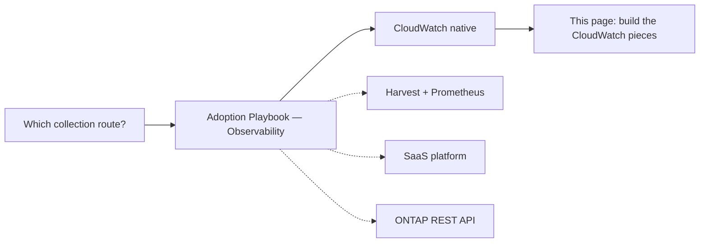

# FSx for ONTAP Monitoring Design

🌐 [日本語](../ja/monitoring-design.md) | **English** (this page)

> **Status / audience / evidence tiers**: Status — active (implementation-side index; route selection lives in the Hub). Audience — engineers who have already chosen the CloudWatch collection route and are building the CloudWatch-native pieces. Evidence tiers used on this page: `documented` (stated in cited AWS or NetApp sources), `code-inspected` (read from this repository's templates, not executed), and `unverified` (no dated live run exists on this branch). Each claim below carries its tier inline; qtree metric publication, the shipped qtree threshold alarm, and the Terraform direction are the parts you should read as not-yet-verified. `verified` (executed, with a dated record) appears only where such a record exists, such as the log-alarm E2E run.

## Executive summary

This page is the **implementation-side index** for monitoring Amazon FSx for NetApp ONTAP with Amazon CloudWatch. It does not decide which collection route you should use. That decision — CloudWatch native, NetApp Harvest with Prometheus, a SaaS observability platform, or the ONTAP REST API — is made in the [Adoption Playbook — Observability](https://github.com/Yoshiki0705/FSx-for-ONTAP-Adoption-Playbook/blob/main/docs/en/domains/observability/README.md). Come here once CloudWatch is the chosen route; this page covers how to build the CloudWatch-native pieces this repository ships, where their boundaries are, and what the Terraform direction looks like.

Concretely, three CloudFormation templates in `shared/templates/` cover the CloudWatch-native path: a performance and capacity dashboard, a per-qtree quota monitor, and a log-based alarm. The qtree monitor is an implemented, code-inspected path intended to publish qtree metrics to CloudWatch; its operational publication is unverified, and its shipped threshold alarm is not usable as shipped. Each is documented below with when to reach for it, why it exists, and how its scope is bounded.

> **Scope note**: This is a routing-and-assembly index, not a route decision tree. If you have not yet chosen between CloudWatch, Harvest, SaaS, and ONTAP REST, start at the Hub observability README linked above, then return here.

## What this page decides vs what the Hub decides

**This page covers the CloudWatch-native implementation**: which template builds which view, what each one can and cannot reach, and how to add Terraform equivalents later. Every template referenced here exists in the repository today.

**It does not choose the collection route.** Whether metrics and logs should arrive via CloudWatch, Harvest with Prometheus, a SaaS platform, or the ONTAP REST API is a separate decision on a separate axis, and it is made in the [Adoption Playbook — Observability](https://github.com/Yoshiki0705/FSx-for-ONTAP-Adoption-Playbook/blob/main/docs/en/domains/observability/README.md). This mirrors how [decision-tree-management-monitoring.md](decision-tree-management-monitoring.md) separates the management-plane choice from the collection-route choice: reading only one of the two leaves half the architecture undecided.

> **Boundary note**: The management plane (how you reach the file system to administer it) and the collection route (how metrics and logs are gathered and stored) are easy to confuse because both get called "monitoring." This page sits downstream of both: it assumes CloudWatch has been chosen as the route, and documents the build.

## Selecting a route (deferred to the Hub)

Route selection lives in the Hub, not here. Use the pointer below rather than a second decision tree.



For the **management-plane** axis (System Manager via NetApp Console, a self-hosted console, or CLI and REST directly), see [decision-tree-management-monitoring.md](decision-tree-management-monitoring.md). That tree already defers the collection-route choice to the Hub, as this page does.

> **Routing note**: The solid path above (CloudWatch → this page) is the branch this page documents. This repository ships CloudFormation for more than CloudWatch — the SaaS vendor integrations and the qtree monitor are also CloudFormation — so CloudWatch is not the only CloudFormation branch; it is the one assembled here. The dotted branches are implemented elsewhere — Harvest in [management-console/](../../management-console/README.md), SaaS across the nine vendor integrations, ONTAP REST in the qtree monitor below.

## CloudWatch monitoring

The CloudWatch-native path puts ONTAP System Manager's performance and capacity views in CloudWatch, so day-to-day watching does not require opening ONTAP System Manager. For the quota view, the repository ships an implemented, code-inspected path intended to publish qtree metrics to CloudWatch; operational publication is unverified (see the qtree section below). The feature-by-feature mapping (System Manager view → CloudWatch metric → template) is in [native-alternative-matrix.md](native-alternative-matrix.md); this section documents the three templates behind that mapping.

AWS primary sources for the metrics and alarms used below:

- [Monitoring FSx for ONTAP with Amazon CloudWatch](https://docs.aws.amazon.com/fsx/latest/ONTAPGuide/monitoring-cloudwatch.html)
- [Creating an alarm for low primary storage](https://docs.aws.amazon.com/fsx/latest/ONTAPGuide/alarm-low-primary-storage.html)
- [FSx for ONTAP file system metrics](https://docs.aws.amazon.com/fsx/latest/ONTAPGuide/file-system-metrics.html)

> **Scope note**: AWS documents FSx for ONTAP CloudWatch metrics as file-system metrics and detailed file-system metrics; the file-system metrics take the `FileSystemId` dimension, and the detailed metrics add `StorageTier` and `DataType` ([file-system-metrics.html](https://docs.aws.amazon.com/fsx/latest/ONTAPGuide/file-system-metrics.html), confidence: `documented`). The boundary that matters here is that the native metric set has no qtree or per-user dimension — not that nothing below the file system is measured. The qtree monitor below reaches qtree granularity through the ONTAP REST API, and per-user access needs audit logs (see [event-sources.md](event-sources.md)).

### Performance and capacity dashboard

**Template**: `shared/templates/fsxn-monitoring-dashboard.yaml`

**When**: You have chosen CloudWatch and want IOPS, throughput, network utilization, and storage capacity in one dashboard, plus an alarm before capacity runs out.

**Why**: It replaces the ONTAP System Manager performance and capacity views for the metrics AWS publishes to CloudWatch, so you do not need to open a management console for day-to-day capacity watching.

**How**: Deploy with four parameters — `FileSystemId`, `FileSystemName`, `CapacityThresholdPercent` (default 80), and an optional `NotificationEmail` that provisions an Amazon Simple Notification Service (Amazon SNS) topic and subscription. The dashboard draws IOPS (`DataReadOperations` + `DataWriteOperations`), throughput (`DataReadBytes` + `DataWriteBytes`), network utilization (`NetworkThroughputUtilization`), and capacity (`StorageUsed` + `StorageCapacityUtilization`). The stack always creates two alarms: `StorageCapacityAlarm` on `StorageCapacityUtilization` at `CapacityThresholdPercent`, and `ThroughputUtilizationAlarm` on `NetworkThroughputUtilization` at a fixed 80%. When `NotificationEmail` is set, the SNS topic is attached to both alarms.

The **latency widget is not yet implemented** (confidence: `code-inspected`, `fsxn-monitoring-dashboard.yaml` renders no latency widget). The underlying metrics `DataReadOperationTime` and `DataWriteOperationTime` exist, and period-average latency can be derived as `OperationTime * 1000 / Operations` (confidence: `documented`, [file-system-metrics.html](https://docs.aws.amazon.com/fsx/latest/ONTAPGuide/file-system-metrics.html)), but the dashboard template does not yet render that widget. This is the one explicit gap recorded in [native-alternative-matrix.md](native-alternative-matrix.md).

> **Latency note**: The AWS metric pairs `DataReadOperationTime`/`DataWriteOperationTime` divided by the corresponding operation counts can derive period-average latency (summed over the period, so the result is an average, not p99); this template does not currently render that widget. For tail latency, source it from request-level telemetry rather than these aggregate metric pairs.

> **Cost note**: As of the [CloudWatch pricing page](https://aws.amazon.com/cloudwatch/pricing/) checked 2026-10-04 in us-east-1, a CloudWatch dashboard is $3/month per dashboard beyond the free allotment, and a standard-resolution metric alarm is approximately $0.10/month each (this stack creates two such alarms). Pricing changes over time and varies by Region — confirm against the current page. The SNS topic is only created when `NotificationEmail` is set.

### Per-qtree quota monitoring

**Template**: `shared/templates/qtree-quota-monitor.yaml`

**When**: You need quota usage per qtree, which the file-system-level CloudWatch metrics cannot express.

**Why**: It fills the gap that native CloudWatch metrics carry no qtree identity or quota-usage dimension (the file-system metrics take `FileSystemId`, and the detailed metrics add `StorageTier`/`DataType` — none of which name a qtree). A Lambda function is written to poll the ONTAP REST API `/storage/quota/reports` and publish `FSxONTAP/Qtree` custom metrics (`QtreeQuotaUsedPercent`, `QtreeQuotaUsedBytes`, `QtreeQuotaLimitBytes`) per qtree (confidence: `code-inspected`; operational publication `unverified`). The template also declares a `QuotaThresholdPercent` (default 85) quota alarm, but that alarm is unverified as shipped — see the alarm note below.

**How**: Deploy with the ONTAP management endpoint IP (`OntapMgmtIp`), a Secrets Manager ARN for ONTAP admin credentials, the `SvmName`, VPC placement parameters (`VpcId`, `SubnetIds`, `SecurityGroupId`), a `PollIntervalMinutes` (default 5), and `QuotaThresholdPercent`. The Lambda is written to publish `QtreeQuotaUsedPercent`, `QtreeQuotaUsedBytes`, and `QtreeQuotaLimitBytes`, each with the full dimension set `SvmName` + `VolumeName` + `QtreeName`, so each qtree is a distinct CloudWatch metric — up to the per-poll ceiling noted below. The per-qtree custom-metric path and the DLQ-depth alarm are the parts of this stack that are implemented and `code-inspected`; no dated live run exists on this branch, so their operational behavior (whether metrics actually publish, whether the alarm actually fires) is `unverified`.

> **Coverage note (per-poll 200-record ceiling)**: Each poll requests `/storage/quota/reports` with `max_records=200` and the Lambda consumes only the first page (`data["records"]`), with no pagination (confidence: `code-inspected`, `qtree-quota-monitor.yaml`). An SVM with more than 200 tree quota reports leaves the records past the first 200 without metrics on each cycle, so coverage of "every qtree" holds only up to 200 tree quotas per SVM; above that, treat the inventory as partially covered until pagination is added and verified.

> **Network note (CloudWatch API egress required)**: The Lambda runs in your VPC and calls `cloudwatch:PutMetricData`. The template creates an interface VPC endpoint for Secrets Manager only — not for CloudWatch — so a private subnet with no NAT gateway and no CloudWatch monitoring (`com.amazonaws.<region>.monitoring`) interface endpoint can read credentials and reach ONTAP yet be unable to publish metrics (confidence: `code-inspected`, the template declares one `AWS::EC2::VPCEndpoint`, for Secrets Manager). The `cw.put_metric_data` call is not wrapped in a try/except, so a network failure raises and fails the invocation rather than being swallowed — see the failure-semantics note. Provide a route to the CloudWatch monitoring API: a NAT gateway, or a `com.amazonaws.<region>.monitoring` interface endpoint in the Lambda's subnets.

> **Failure-semantics note**: `QuotaPollSchedule` (an EventBridge rule) invokes the Lambda asynchronously, so a raised exception — a `put_metric_data` network failure, an ONTAP timeout — is retried twice by Lambda and then delivered to the DLQ (confidence: `code-inspected`, `qtree-quota-monitor.yaml`). The DLQ-depth alarm therefore fires on invocations that failed every retry, not on every way polling can stop: a disabled schedule rule, a removed invoke permission, or any no-invocation condition stops the metrics without producing a DLQ message, so a quiet DLQ is not proof that polling is healthy. All alarms in this stack attach their SNS action only under `HasNotificationEmail`; when `NotificationEmail` is left empty, the alarms still change state in CloudWatch but send no notification.

> **Alarm note (unverified / do not rely on `QtreeQuotaAlarm` as shipped)**: The template's `QtreeQuotaAlarm` selects only the `SvmName` dimension with no `Metrics` array or metric-math expression. CloudWatch identifies a metric by its complete dimension set, so an alarm scoped to `SvmName` alone matches none of the three-dimension series the Lambda emits, and `Statistic: Maximum` does not aggregate across the separately-dimensioned per-qtree metrics (confidence: `unverified` that this alarm fires on real data). Until the template is corrected to use metric math over the per-qtree series or per-qtree alarms, treat threshold alerting as not working and read the `FSxONTAP/Qtree` metrics directly; the [native-alternative-matrix.md](native-alternative-matrix.md) "Identifying the Offending Qtree" section enumerates the complete `SvmName`/`VolumeName`/`QtreeName` identities with `list-metrics` and queries each one, which is the inspection that returns real values here (a query scoped to `SvmName` alone matches none of the emitted series, for the same dimension-identity reason).

> **Security note**: ONTAP admin credentials come from AWS Secrets Manager by ARN, never from Lambda environment variables. The Lambda reaches the ONTAP management endpoint over HTTPS (443) from inside the VPC with a security group that allows egress to that IP. The shipped Lambda initializes urllib3 with `cert_reqs="CERT_NONE"`, so the transport is encrypted but the endpoint certificate is not authenticated (confidence: `code-inspected`, `qtree-quota-monitor.yaml`) — the required containment is the VPC-internal path to a known management IP, and certificate validation is deferred work (not yet carried as a tracked ROADMAP or CONTRIBUTING item).

> **IaC note**: This template is the clearest example of why a monitoring view can need the ONTAP management plane: the data does not exist in CloudWatch until this Lambda writes it there. A Terraform equivalent would carry the same VPC and Secrets Manager dependencies.

### Log-based alarms

**Template**: `shared/templates/cloudwatch-log-alarm.yaml` — documented in [cloudwatch-log-alarm.md](cloudwatch-log-alarm.md).

**When**: FSx for ONTAP admin audit logs are already flowing to CloudWatch Logs and you want an alarm directly from a Logs Insights query, without first building a metric filter.

**Why**: It uses the `AWS::CloudWatch::LogAlarm` resource to alarm straight off log content — bulk deletions, privileged operations, unauthorized access patterns. AWS announced alarms on log queries in its [July 2026 What's New entry](https://aws.amazon.com/about-aws/whats-new/2026/07/amazon-cloudwatch-log-alarms/), which lists CloudFormation among the supported interfaces, and documents the resource in the [`AWS::CloudWatch::LogAlarm` reference](https://docs.aws.amazon.com/AWSCloudFormation/latest/TemplateReference/aws-resource-cloudwatch-logalarm.html) and [Alarming on logs](https://docs.aws.amazon.com/AmazonCloudWatch/latest/monitoring/Alarm-On-Logs.html) (confidence: `documented`, pages read 2026-10-04).

**How**: See [cloudwatch-log-alarm.md](cloudwatch-log-alarm.md) for parameters, the detection types, and the deploy script. CloudFormation deployment and scheduled-query evaluation (INSUFFICIENT_DATA → OK) were exercised in `ap-northeast-1` on 2026-07-02 (confidence: `verified`, see [E2E Validation Results (2026-07-02)](cloudwatch-log-alarm.md#e2e-validation-results-2026-07-02)).

> **Lint note (dated observation)**: The 2026-07-02 E2E record notes that `cfn-lint` reported E3006 for `AWS::CloudWatch::LogAlarm`; that record does not state the cfn-lint version. On 2026-10-04, the repository's pinned `cfn-lint==1.56.3` (`requirements-dev.txt`) reported no findings on `cloudwatch-log-alarm.yaml`, while a control template with an unknown resource type did produce E3006 on the same install. The blocking lint tier still ignores E3006 (`CFN_LINT_IGNORE` in the `Makefile`). Treat E3006 on this resource as version-dependent, not as a standing condition.

> **Observability note**: Getting audit logs into CloudWatch Logs is a prerequisite handled by the syslog VPC Endpoint path ([syslog-vpce-setup-guide.md](syslog-vpce-setup-guide.md)), not by this template.

## NetApp public reference

NetApp publishes a CloudWatch monitoring reference implementation in the [CloudWatch-Monitoring-FSx subtree](https://github.com/NetApp/FSx-ONTAP-monitoring/tree/main/CloudWatch-Monitoring-FSx) of [github.com/NetApp/FSx-ONTAP-monitoring](https://github.com/NetApp/FSx-ONTAP-monitoring). Both it and this repository are CloudFormation-based serverless solutions; the distinction is documented scope, not deploy-ready versus scripts (confidence: `documented`, from the NetApp subtree README). The NetApp reference deploys a single region-wide dashboard covering all FSx for ONTAP file systems, with Lambda, three EventBridge schedulers, lifecycle-managed alarms, IAM roles, and optional VPC endpoints, in Full Stack, Monitoring Only, or EMS Logs Only modes; its dashboard spans client operations, storage utilization, disk performance, latency, per-volume stats, LUN performance, and SnapMirror status, and it streams EMS messages to CloudWatch Logs. This repository splits a smaller, fixed single-file-system dashboard, qtree quota polling, and log-based alarms into separate CloudFormation templates. The two suit different starting points, and neither is a replacement for the other.

For the Harvest-plus-Prometheus path (the route the Hub may send you to instead of CloudWatch), the equivalent NetApp-published tooling is [NetApp Harvest](https://github.com/NetApp/harvest), implemented in this repository under [management-console/](../../management-console/README.md). Harvest suits teams that need the full ONTAP metric set (protocol, aggregate, and node level); CloudWatch suits teams that want metrics in the native AWS monitoring plane without running a collector.

> **Neutrality note**: The trade-off is symmetric. The NetApp reference repo covers more of ONTAP in one region-wide stack (volume, LUN, SnapMirror, EMS) and leaves alarm cleanup to the operator per its own disclaimer; the templates here cover a narrower, fixed scope split across separate stacks, and the qtree alarm as shipped is unverified (see the alarm note above). Which fits depends on your metric breadth and how you prefer to manage stacks, not on one ranking above the other.

## Terraform direction

### IaC reference implementations

The sources below were read during this repository's IaC survey (investigation date 2026-10-04). Each is labeled by scope so the catalog is read correctly: **monitoring** builds the CloudWatch alarm set, **construction** builds the file system (SVM/volumes/backups) but no monitoring, and **building-block** is a provider or resource a monitoring module composes. All are cited as `documented` — the pages were read, not run — and the framing is right-tool-for-the-job: each entry fits a different starting point, and the trade-offs are stated symmetrically rather than ranked.

| Source | Scope | URL | Neutral one-line description |
|---|---|---|---|
| のんピ (non-97) `aws-cdk-fsxn-resources` | monitoring | [github.com/non-97/aws-cdk-fsxn-resources](https://github.com/non-97/aws-cdk-fsxn-resources) | AWS CDK (TypeScript) project whose monitoring construct creates an SNS topic plus the CloudWatch alarm set (file-system capacity / network-throughput / file-server-disk-throughput / disk-IOPS / CPU; per-volume capacity + inode; backup-jobs-failed). This is a CDK reference, not CloudFormation, and the repository shows no license — reference the pattern, do not copy the code. |
| NetApp `FSx-ONTAP-samples-scripts` (Terraform) | construction | [github.com/NetApp/FSx-ONTAP-samples-scripts/.../Terraform](https://github.com/NetApp/FSx-ONTAP-samples-scripts/tree/main/Infrastructure_as_Code/Terraform) | Apache-2.0 Terraform examples (File Share / SQL Server / file-system deployment / DR replication). Builds the file system, not CloudWatch monitoring. |
| JManzur `terraform-aws-fsx-netapp-ontap` | construction | [github.com/JManzur/terraform-aws-fsx-netapp-ontap](https://github.com/JManzur/terraform-aws-fsx-netapp-ontap) | Terraform module for the file system, SVMs, volumes, a managed security group, and on-demand volume backups, with a create-or-lookup mode. No monitoring resources. |
| aws-samples `genai-bedrock-fsxontap` (terraform) | construction | [github.com/aws-samples/genai-bedrock-fsxontap/.../terraform](https://github.com/aws-samples/genai-bedrock-fsxontap/tree/main/terraform) | A Bedrock + FSx for ONTAP GenAI stack with `fsx.tf` among many `.tf` files. Construction for a GenAI workload, not a monitoring module. |
| shikazuki Zenn article | construction | [zenn.dev/shikazuki/articles/5f925edb148c85](https://zenn.dev/shikazuki/articles/5f925edb148c85) | Builds FSx for ONTAP with Terraform and sets up SMB/NFS multiprotocol sharing. No CloudWatch monitoring. |
| AWS Storage Blog (Terraform) | construction | [aws.amazon.com/blogs/storage/deploying-amazon-fsx-for-netapp-ontap-hashicorp-terraform](https://aws.amazon.com/blogs/storage/deploying-amazon-fsx-for-netapp-ontap-hashicorp-terraform) | Walkthrough of deploying FSx for ONTAP with HashiCorp Terraform. Construction, not monitoring. |
| Yoshiki0705 `FSx-for-ONTAP-Agentic-Access-Aware-RAG` | construction | [github.com/Yoshiki0705/FSx-for-ONTAP-Agentic-Access-Aware-RAG](https://github.com/Yoshiki0705/FSx-for-ONTAP-Agentic-Access-Aware-RAG) | CDK reference that builds FSx for ONTAP as construction; its CloudWatch monitoring targets the RAG application (Lambda / CloudFront / DynamoDB), not FSx for ONTAP file-system metrics. |
| NetApp `terraform-provider-netapp-ontap` | building-block | [github.com/NetApp/terraform-provider-netapp-ontap](https://github.com/NetApp/terraform-provider-netapp-ontap) | Official NetApp ONTAP Terraform provider — the ONTAP-internal-plane building block for any metric the AWS plane does not expose. |
| AWS provider resources | building-block | [`aws_fsx_ontap_file_system`](https://registry.terraform.io/providers/hashicorp/aws/latest/docs/resources/fsx_ontap_file_system) · [`aws_cloudwatch_metric_alarm`](https://registry.terraform.io/providers/hashicorp/aws/latest/docs/resources/cloudwatch_metric_alarm) · [`aws_cloudwatch_dashboard`](https://registry.terraform.io/providers/hashicorp/aws/latest/docs/resources/cloudwatch_dashboard) · [`aws_sns_topic`](https://registry.terraform.io/providers/hashicorp/aws/latest/docs/resources/sns_topic) | The AWS-provider primitives a Terraform monitoring module composes. |

**The honest gap stands.** No turnkey public Terraform *monitoring* module for FSx for ONTAP was found in the sources checked (confidence: `unverified` that one exists). The construction references above are construction, not monitoring. The one direct monitoring precedent — のんピ's `aws-cdk-fsxn-resources` — is CDK, not Terraform, and carries no visible license, so it informs the alarm set to replicate but is not code to copy.

The direction that follows from this: keep the shipped AWS-native path on CloudFormation, and add Terraform `.tf` equivalents of the CloudWatch monitoring by porting のんピ's CDK alarm set — file-system capacity / network-throughput / file-server-disk-throughput / disk-IOPS / CPU; per-volume capacity + inode; backup-jobs-failed — onto `aws_cloudwatch_metric_alarm` + `aws_cloudwatch_dashboard` + `aws_sns_topic`, with the `aws_fsx_ontap_file_system` data source for an existing file system and the NetApp provider available for any ONTAP-internal metric the AWS plane does not expose. The skeleton and phased plan that follow carry this forward; it is tracked under Phase 4 in [ROADMAP.md](../../ROADMAP.md) and the Terraform priority item in [CONTRIBUTING.md](../../CONTRIBUTING.md).

> **Licensing note**: のんピ's `aws-cdk-fsxn-resources` repository shows no license in its About panel or top-level tree (confidence: `documented`, from the repository page read 2026-10-04). Absent a license, reuse defaults to all-rights-reserved; treat it as a design reference for which alarms to create, not as code to lift into this repository.

> **Scope note**: The classmethod inline-CloudFormation write-up by のんピ ([deploy FSx for ONTAP resources with AWS CDK](https://dev.classmethod.jp/articles/deploy-amazon-fsx-for-netapp-ontap-resources-with-aws-cdk/)) is the CDK project's write-up and is the monitoring reference cited above; a separate classmethod inline-CloudFormation article builds the environment around FSx for ONTAP (networking/EC2) and ships no repository, so it is a construction how-to rather than a monitoring source. The log-forwarding (Syslog → CloudWatch Logs) material belongs to a different theme and is not an IaC reference.

### Current state (honest gap)

No `.tf` files exist in this repository today. The AWS-native path is standardized on CloudFormation. For Terraform users, the verified building blocks are:

- The AWS provider resource [`aws_fsx_ontap_file_system`](https://registry.terraform.io/providers/hashicorp/aws/latest/docs/resources/fsx_ontap_file_system) for the file system, with CloudWatch assembled from the generic [`aws_cloudwatch_metric_alarm`](https://registry.terraform.io/providers/hashicorp/aws/latest/docs/resources/cloudwatch_metric_alarm) and [`aws_cloudwatch_dashboard`](https://registry.terraform.io/providers/hashicorp/aws/latest/docs/resources/cloudwatch_dashboard) resources.
- The NetApp official ONTAP Terraform provider, [terraform-provider-netapp-ontap](https://github.com/NetApp/terraform-provider-netapp-ontap), for ONTAP-side configuration.
- A community example module (not monitoring-specific), [terraform-aws-fsx-netapp-ontap](https://github.com/JManzur/terraform-aws-fsx-netapp-ontap).

Searching the sources above (the HashiCorp AWS provider registry, the NetApp provider repository, and the community example) did not surface a dedicated public Terraform **module** that builds CloudWatch monitoring for FSx for ONTAP (confidence: `unverified` that a turnkey module exists). Within those sources, CloudWatch monitoring for FSx for ONTAP is composed from the generic `aws_cloudwatch_*` resources plus the `aws_fsx_ontap_file_system` resource.

> **Verification note**: The three AWS provider resources and the two repositories above were confirmed to exist. The claim marked `unverified` is specifically "a turnkey monitoring module exists" — the sources checked did not surface one, which is scoped to those sources and is not a claim that none exists anywhere in the ecosystem.

### Direction and skeleton

The repository intends to add Terraform `.tf` equivalents of the CloudWatch monitoring templates, so the AWS-native path can be expressed in either IaC tool. The planned layout mirrors the CloudFormation parameters one-to-one:

```
terraform/
  fsxn-monitoring-dashboard/
    main.tf        # aws_cloudwatch_dashboard, aws_cloudwatch_metric_alarm, aws_sns_topic
    variables.tf   # file_system_id, file_system_name, capacity_threshold_percent, notification_email
    outputs.tf     # dashboard_arn, alarm_arn, sns_topic_arn
```

The variables mirror the dashboard template's parameters (`FileSystemId` → `file_system_id`, `FileSystemName` → `file_system_name`, `CapacityThresholdPercent` → `capacity_threshold_percent`, `NotificationEmail` → `notification_email`), and the resources are `aws_cloudwatch_dashboard`, `aws_cloudwatch_metric_alarm`, and `aws_sns_topic`.

**No `.tf` files are created now.** Shipping unverified infrastructure code would violate this repository's evidence discipline. The actual `.tf` files are a later, separately-verified phase: authored, `terraform validate`/`plan` run against a real file system, and reviewed before they land. This direction is tracked as the "Terraform module equivalents" item under Phase 4 in [ROADMAP.md](../../ROADMAP.md) and the "Terraform equivalents of CloudFormation templates" priority item in [CONTRIBUTING.md](../../CONTRIBUTING.md).

> **IaC note**: The skeleton above is a target shape, not working code. Treat it as the contract a future contribution should satisfy, not as something you can `terraform apply`. It covers the first phase only; the qtree and log-alarm equivalents are phased below.

### Terraform implementation phases

The Terraform work is split into three phases, one per CloudWatch template. Each phase has a static validation step and a completion criterion that requires a real environment. None of the phases has been started, so nothing here is `verified`. The task list stays in [ROADMAP.md](../../ROADMAP.md) (Phase 4) and [CONTRIBUTING.md](../../CONTRIBUTING.md); this section gives only the order and the exit conditions.

| Phase | Scope | Validation | Done when |
|---|---|---|---|
| T1 — dashboard + alarms | Port `fsxn-monitoring-dashboard.yaml` (dashboard, `StorageCapacityAlarm`, `ThroughputUtilizationAlarm`, optional SNS) and add のんピ's CDK alarm set as a pattern reference, on `aws_cloudwatch_dashboard` + `aws_cloudwatch_metric_alarm` + `aws_sns_topic` | `terraform validate` and `terraform plan` against an account that has an FSx for ONTAP file system | `terraform apply` creates the dashboard and every alarm, and each alarm leaves INSUFFICIENT_DATA and reaches OK against a real file system |
| T2 — qtree polling | Port `qtree-quota-monitor.yaml`: Lambda in the VPC, Secrets Manager for ONTAP credentials, a route for `cloudwatch:PutMetricData` (NAT gateway or a `com.amazonaws.<region>.monitoring` interface endpoint), the EventBridge schedule, and the DLQ. Either add pagination past the 200-record first page or carry that ceiling forward as a documented limit. Replace the `SvmName`-only alarm with per-qtree alarms or metric math | `terraform validate` and `terraform plan`. The CloudFormation template is covered today only by `make cfn-lint` and `make cfn-guard` (`CFN_TEMPLATES` in the `Makefile`); the inline Lambda handler has no unit tests, so adding them is part of this port | Per-qtree `FSxONTAP/Qtree` series (all three metric names, full `SvmName`/`VolumeName`/`QtreeName` identity) are observed in CloudWatch from a real SVM, and the replacement alarm changes state on real data |
| T3 — log-alarm equivalent | An equivalent of `cloudwatch-log-alarm.yaml`. Gated: start only after AWS-provider support for log alarms is confirmed, or use the documented metric-filter alternative | `terraform validate` and `terraform plan` | Against real admin audit logs in CloudWatch Logs, the alarm evaluates (INSUFFICIENT_DATA → OK) and reaches ALARM on a matching event |

> **Provider-support note**: Whether the HashiCorp AWS provider has a resource for `AWS::CloudWatch::LogAlarm` is `unverified`. A 2026-10-04 lookup did not find one, and that is not evidence that none exists. AWS documents a second way to alarm on logs, a metric filter plus a standard metric alarm ([Alarming on logs](https://docs.aws.amazon.com/AmazonCloudWatch/latest/monitoring/Alarm-On-Logs.html), confidence: `documented`). In Terraform that maps to [`aws_cloudwatch_log_metric_filter`](https://registry.terraform.io/providers/hashicorp/aws/latest/docs/resources/cloudwatch_log_metric_filter) + `aws_cloudwatch_metric_alarm`. The two approaches differ in what they can express (Logs Insights aggregation compared with a filter pattern), so T3 has to pick one and record the reason.

## Phased adoption

Once CloudWatch is the chosen route (decided in the Hub), build in this order:

1. Deploy the performance and capacity dashboard (`fsxn-monitoring-dashboard.yaml`) for file-system-level IOPS, throughput, network, and capacity. The stack also creates the capacity and throughput-utilization alarms.
2. Set `NotificationEmail` on that stack (or add it) so both the capacity and throughput-utilization alarms reach an SNS topic.
3. Add the per-qtree quota monitor (`qtree-quota-monitor.yaml`) if you need quota granularity below the file-system level — this requires VPC reachability to the ONTAP management endpoint.
4. Add log-based alarms (`cloudwatch-log-alarm.yaml`) once audit logs are flowing to CloudWatch Logs.
5. Revisit the route choice in the Hub if CloudWatch coverage proves insufficient (for example, if you need the full ONTAP metric set, which points to the Harvest route).

> **Cost note**: Steps 1 and 2 are the dashboard plus its two alarms — see the dashboard Cost note above for the dated per-unit figures. Step 3 adds Lambda invocations, any VPC endpoints the Lambda needs, and CloudWatch custom metrics. Confirm current rates against the AWS pricing pages before committing to a budget.

> **Custom-metric cost note**: The qtree Lambda writes three series per qtree (`QtreeQuotaUsedPercent`, `QtreeQuotaUsedBytes`, `QtreeQuotaLimitBytes`), each keyed by the full `SvmName`/`VolumeName`/`QtreeName` identity (confidence: `code-inspected`, `qtree-quota-monitor.yaml`). So custom-metric cost scales with qtree count: metrics = 3 × N, where N is the number of qtrees reported per poll (at most 200 per SVM because of the first-page ceiling). Monthly custom-metric cost ≈ 3 × N × the per-metric monthly rate for your Region and tier. `PutMetricData` requests add ⌈3 × N / 20⌉ calls per poll (the Lambda sends batches of 20) × polls per month (8,640 at the default 5-minute `PollIntervalMinutes`, assuming a 30-day month). No dollar figure is given here. Take the per-metric and per-request rates from the current [CloudWatch pricing page](https://aws.amazon.com/cloudwatch/pricing/) for your Region, and record the date, Region, and N alongside any estimate.

## FAQ and common misconceptions

**Q: Does this page tell me whether to use CloudWatch or Harvest?**
A: No. The route choice (CloudWatch vs Harvest + Prometheus vs SaaS vs ONTAP REST) is made in the [Adoption Playbook — Observability](https://github.com/Yoshiki0705/FSx-for-ONTAP-Adoption-Playbook/blob/main/docs/en/domains/observability/README.md). This page is for building the CloudWatch pieces once that route is chosen.

**Q: Can I get p99 latency from these CloudWatch metrics?**
A: Not from this dashboard, which does not render a latency widget (confidence: `code-inspected`). The AWS metric pairs `DataReadOperationTime`/`DataWriteOperationTime` divided by their operation counts can derive period-average latency, but that is a period average, not p99, and this template does not compute it. For tail latency, use request-level telemetry.

**Q: Is there a Terraform module I can `terraform apply` today?**
A: The sources checked (the HashiCorp AWS provider registry, the NetApp provider repository, and the community example) did not surface a turnkey module (confidence: `unverified` that one exists). Within those sources, Terraform CloudWatch monitoring for FSx for ONTAP is composed from the generic `aws_cloudwatch_*` resources plus the `aws_fsx_ontap_file_system` resource. The repository's direction is to add `.tf` equivalents of the CloudWatch templates in a later, separately-verified phase.

**Q: Why does CloudWatch not show per-qtree quota usage directly?**
A: The native FSx for ONTAP CloudWatch metrics carry only the `FileSystemId` dimension (plus `StorageTier`/`DataType` for the detailed metrics); there is no native qtree or per-user dimension. Per-qtree quota usage is reached by polling the ONTAP REST API and publishing a custom metric — that is what `qtree-quota-monitor.yaml` does. Note that the quota threshold alarm shipped in that template is unverified as shipped (see the alarm note in the qtree section); read the `FSxONTAP/Qtree` metrics directly until it is corrected.

**Q: `cfn-lint` reports E3006 on the log-alarm template — is that a problem?**
A: Not for deployment. The E2E record of 2026-07-02 saw E3006 because that cfn-lint build did not yet know `AWS::CloudWatch::LogAlarm`, and the template still deployed. Whether you see it depends on your cfn-lint version: on 2026-10-04 the pinned `cfn-lint==1.56.3` reported no E3006 on this template (see the lint note in the log-based alarms section). E3006 remains excluded from the blocking lint tier.

## Related Documents

- [Management & Monitoring Decision Tree](decision-tree-management-monitoring.md) — the management-plane axis (System Manager, self-hosted console, CLI/REST); also defers the collection-route choice to the Hub.
- [AWS-Native Alternative Matrix](native-alternative-matrix.md) — the System Manager view → CloudWatch metric → template mapping behind this page.
- [System Manager GUI Guide](system-manager-gui-guide.md) — the GUI path and its own smaller decision flowchart.
- [CloudWatch Log Alarm](cloudwatch-log-alarm.md) — the `cloudwatch-log-alarm.yaml` template in detail.
- [Self-hosted Management Console](../../management-console/README.md) — the NetApp Harvest implementation for the Harvest route.
- [Adoption Playbook — Observability](https://github.com/Yoshiki0705/FSx-for-ONTAP-Adoption-Playbook/blob/main/docs/en/domains/observability/README.md) — where the collection-route decision is made.
