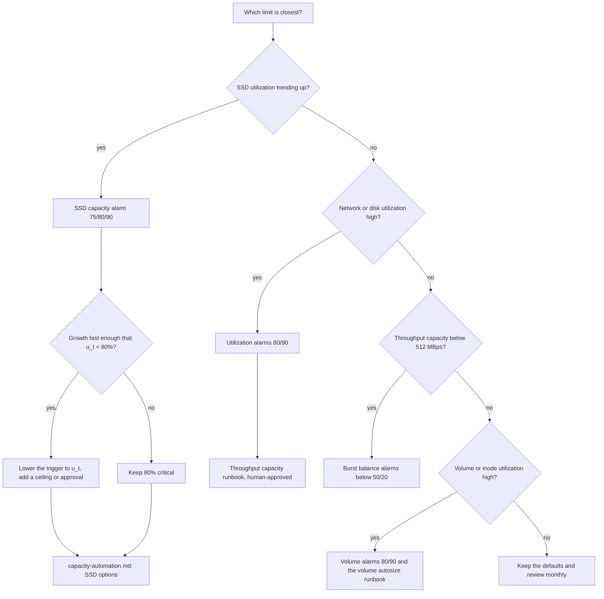

# Sizing and Headroom for Amazon FSx for NetApp ONTAP Monitoring

🌐 [日本語](../ja/sizing-and-headroom.md) | **English** (this page)

> **Status / audience / evidence tiers**
>
> Status: design guidance; nothing on this page was measured. Audience: engineers who build CloudWatch alarms for Amazon FSx for NetApp ONTAP and need thresholds they can defend. Evidence tiers: `documented` (stated on the cited AWS page, re-read 2026-10-07), `verified-in-repo` (a dated record exists in [CloudWatch monitoring verification results](verification-results-cloudwatch-monitoring.md)), `derived` (computed on this page from documented rules; not measured), `hypothesis` (inferred, not checked), `open` (not answered by any source read). Every worked number uses placeholders (`fs-0123456789abcdef0`, invented round figures) and is not a recommendation for any specific file system.

## Executive summary

Size throughput capacity for read throughput plus twice the write throughput, keep SSD utilization at or below 80% on an ongoing basis (on second-generation file systems, for each aggregate as well), and treat 90% and 98% as the two behavioural lines: at 90% FSx for ONTAP stops caching capacity-pool reads on SSD, and at 98% tiering stops and writes to the tiers fail. Set the critical capacity alarm at 80% and the emergency alarm at 90%. Then check that the headroom between the trigger threshold and 90% can absorb growth for the 6-hour cooldown plus the re-evaluation, alarm, availability and approval delays; at high growth rates that headroom, not the 80% recommendation, decides the threshold. The formula and the warning value of 75% are `derived` on this page.

> **Scope note**
>
> This page turns AWS rules into thresholds. It does not choose an automation option; that is in [capacity-automation.md](capacity-automation.md). The metric names and where they come from are in the [metric catalog](monitoring-design.md#metric-catalog).

## AWS sizing rules

| Rule | Value | Source | Tier |
|---|---|---|---|
| Throughput capacity to provision | read throughput + 2 × write throughput | [managing-throughput-capacity](https://docs.aws.amazon.com/fsx/latest/ONTAPGuide/managing-throughput-capacity.html) | `documented` |
| Why writes count twice | a write is replicated to the secondary file server, so it uses twice the network bandwidth of a read | [performance](https://docs.aws.amazon.com/fsx/latest/ONTAPGuide/performance.html) | `documented` |
| Ongoing SSD utilization | do not exceed 80%; on second generation, also for each aggregate | [storage-capacity-and-IOPS](https://docs.aws.amazon.com/fsx/latest/ONTAPGuide/storage-capacity-and-IOPS.html), [managing-storage-capacity](https://docs.aws.amazon.com/fsx/latest/ONTAPGuide/managing-storage-capacity.html) | `documented` |
| SSD read caching stops | at 90%, capacity-pool reads are no longer cached on SSD | [managing-storage-capacity](https://docs.aws.amazon.com/fsx/latest/ONTAPGuide/managing-storage-capacity.html), [volume-storage-capacity](https://docs.aws.amazon.com/fsx/latest/ONTAPGuide/volume-storage-capacity.html) | `documented` |
| Tiering stops | at or above 98%, all tiering stops; reads continue, writes to the tiers fail | [volume-storage-capacity](https://docs.aws.amazon.com/fsx/latest/ONTAPGuide/volume-storage-capacity.html) | `documented` |
| ONTAP overhead on SSD | up to 16%: 11% software (6% above 30 TiB of SSD) plus 5% aggregate snapshots | [managing-storage-capacity](https://docs.aws.amazon.com/fsx/latest/ONTAPGuide/managing-storage-capacity.html) | `documented` |
| File metadata | 3-7% of file data; 4 KB average file → 7%, 8 KB → 3.5%, 32 KB or larger → 1-3% | [managing-storage-capacity](https://docs.aws.amazon.com/fsx/latest/ONTAPGuide/managing-storage-capacity.html) | `documented` |
| Metadata for capacity-pool data | plan 1 GiB of SSD per 10 GiB stored in the capacity pool (AWS calls this conservative) | [managing-storage-capacity](https://docs.aws.amazon.com/fsx/latest/ONTAPGuide/managing-storage-capacity.html) | `documented` |
| Disk performance per TiB of SSD | 768 MBps and 3,072 IOPS by default; the file system gets the lower of this and the limit set by throughput capacity | [performance](https://docs.aws.amazon.com/fsx/latest/ONTAPGuide/performance.html) | `documented` |
| Automatic SSD IOPS | 3 IOPS per GiB, up to 160,000 per file system | [storage-capacity-and-IOPS](https://docs.aws.amazon.com/fsx/latest/ONTAPGuide/storage-capacity-and-IOPS.html) | `documented` |
| Burst credit metrics | `FileServerDiskThroughputBalance` and `FileServerDiskIopsBalance` are valid for throughput capacity less than 512 MBps | [file-system-metrics](https://docs.aws.amazon.com/fsx/latest/ONTAPGuide/file-system-metrics.html) | `documented` |
| SSD increase | at least 10% of current SSD capacity; first generation cannot decrease | [storage-capacity-and-IOPS](https://docs.aws.amazon.com/fsx/latest/ONTAPGuide/storage-capacity-and-IOPS.html) | `documented` |
| Cooldown | after changing SSD capacity, provisioned IOPS or throughput capacity, wait at least 6 hours before changing any of them again | [storage-capacity-and-IOPS](https://docs.aws.amazon.com/fsx/latest/ONTAPGuide/storage-capacity-and-IOPS.html) | `documented` |
| Before a second-generation decrease | keep CPU, disk throughput and SSD IOPS at or below 50% | [storage-capacity-and-IOPS](https://docs.aws.amazon.com/fsx/latest/ONTAPGuide/storage-capacity-and-IOPS.html) | `documented` |

> **Network note**
>
> Because each write is replicated, a workload of 100 MBps reads and 100 MBps writes needs at least 300 MBps of throughput capacity, not 200. Client-side throughput graphs alone understate the requirement. The same doubling shows up in `NetworkThroughputUtilization`.

> **Safety note**
>
> 98% is the line where writes to the tiers fail. No threshold on this page sits above 90%, so that an alarm, a person and, if chosen, automation all have room to act before 98%.

## Generation and HA-pair differences

First-generation file systems (Single-AZ and Multi-AZ) and second-generation Multi-AZ file systems run on one HA pair; second-generation Single-AZ file systems run on up to 12 ([performance](https://docs.aws.amazon.com/fsx/latest/ONTAPGuide/performance.html), `documented`). On second generation, network and file-server metrics take `FileSystemId` + `FileServer`, and disk I/O and storage-utilization metrics take `FileSystemId` + `Aggregate` ([so-file-system-metrics](https://docs.aws.amazon.com/fsx/latest/ONTAPGuide/so-file-system-metrics.html), `documented`). A capacity alarm on a multi-HA-pair file system therefore needs the per-aggregate series as well; whether the series without `Aggregate` is emitted there is `open`, as [monitoring-design.md](monitoring-design.md) already states. The burst-balance metrics appear on the first-generation metrics page; whether second generation emits them is `open`.

Valid throughput values per HA pair ([UpdateFileSystemOntapConfiguration](https://docs.aws.amazon.com/fsx/latest/APIReference/API_UpdateFileSystemOntapConfiguration.html), `documented`):

| Deployment type | Valid `ThroughputCapacityPerHAPair` (MBps) |
|---|---|
| `SINGLE_AZ_1`, `MULTI_AZ_1` | 128, 256, 512, 1024, 2048, 4096 |
| `SINGLE_AZ_2` | 1536, 3072, 6144 |
| `MULTI_AZ_2` | 384, 768, 1536, 3072, 6144 |

> **Generation note**
>
> A first-generation file system with one HA pair has a single aggregate, so the file-system series and the aggregate are the same capacity. It also cannot decrease SSD capacity: every increase, manual or automatic, stays until the file system is deleted ([storage-capacity-and-IOPS](https://docs.aws.amazon.com/fsx/latest/ONTAPGuide/storage-capacity-and-IOPS.html), `documented`). Size with that in mind before choosing an automation option.

> **Cardinality note**
>
> On a second-generation Single-AZ file system with N HA pairs, a per-aggregate capacity alarm set is N alarms per threshold tier, and a per-file-server CPU or disk alarm set is 2N (two file servers per HA pair). Count them before estimating cost.

## Worked example

Placeholder workload, not measured and not a recommendation: a first-generation `SINGLE_AZ_1` file system `fs-0123456789abcdef0` with 200 MBps reads and 100 MBps writes at peak, 40 TiB of logical data of which 25% is active, and an assumed 50% storage-efficiency saving on the active data.

```text
Throughput capacity
  required  = read + 2 x write = 200 + 2 x 100 = 400 MBps
  choose    = 512 MBps   (smallest SINGLE_AZ_1 value >= 400)
  note      : at 512 MBps the burst-balance metrics do not apply (valid below 512)

SSD capacity
  active file data          = 40 TiB x 25%          = 10 TiB logical
  after 50% efficiency      = 10 TiB x 0.5          = 5 TiB   = 5,120 GiB
  capacity-pool data        = 40 TiB - 10 TiB       = 30 TiB logical
  pool metadata on SSD      = 30 TiB / 10           = 3 TiB   = 3,072 GiB   (derived, see note)
  SSD data                  = 5,120 + 3,072         = 8,192 GiB
  at 80% utilization        = 8,192 / 0.80          = 10,240 GiB
  plus 16% ONTAP overhead   = 10,240 / (1 - 0.16)   = 12,190.5 -> 12,191 GiB provisioned
                              (16% applies because 12,191 GiB is below 30 TiB)

Disk performance check
  from SSD                  = 12,191 GiB = 11.9 TiB
                              x 768 MBps/TiB   = about 9,143 MBps
                              x 3,072 IOPS/TiB = about 36,573 IOPS
  automatic SSD IOPS        = 3 x 12,191       = 36,573 IOPS
  binding limit             : throughput capacity (512 MBps) is far below the SSD-derived
                              disk throughput, so throughput capacity binds
```

> **Evidence note**
>
> The AWS sizing example on [managing-storage-capacity](https://docs.aws.amazon.com/fsx/latest/ONTAPGuide/managing-storage-capacity.html) (100 TiB, 80% cold, 8.75 TiB / 0.84 = 10.42 TiB) does not add the 1 GiB-per-10 GiB allowance for capacity-pool metadata. This example adds it and applies it to the logical size, which is the conservative reading; both steps are `derived`. The AWS example also adds no separate 3-7% for metadata of SSD-resident files. With a small average file size (4 KB → 7%), add that term as well.

> **Cost note**
>
> No price was looked up for this page. SSD capacity, capacity-pool storage and throughput capacity are billed separately; use the current [FSx for ONTAP pricing page](https://aws.amazon.com/fsx/netapp-ontap/pricing/) for your Region and date before turning the example into a budget.

## Headroom formula

The capacity alarm has to fire early enough that growth cannot reach 90% before new capacity is usable. In the worst case a change is blocked by the cooldown for up to 6 hours. The formula below is `derived` from documented timings and is not measured.

```text
H  >= g x (T_cooldown + T_recheck + T_alarm + T_avail + T_human)
u_t <= 90% - 100 x H / C        (rounded down to 0.1)

  H           headroom in GiB between the trigger and 90%
  g           peak SSD growth in GiB per hour (observed, not average)
  T_cooldown  6 h; a previous SSD, IOPS or throughput change blocks the next one
  T_recheck   gap between cooldown expiry and the next evaluation that can act;
              at most the re-evaluation interval: 1 h for T4's default hourly
              schedule, 5 min for the AWS sample's RetryDelayMinutes default
  T_alarm     alarm evaluation window; 5 min in the AWS sample
  T_avail     time until new capacity is usable; AWS says typically within minutes
              (0.5 h used as a placeholder)
  T_human     approval delay; 0 for unattended automation
  C           current SSD capacity in GiB
  u_t         highest safe trigger threshold in percent

Example, C = 12,191 GiB, T4 schedule (T_recheck = 1 h)
  g = 20 GiB/h,  T_human = 0    -> H = 20 x 7.58   = about 152 GiB   = 1.24 points  -> u_t <= 88.7%
  g = 20 GiB/h,  T_human = 4 h  -> H = 20 x 11.58  = about 232 GiB   = 1.90 points  -> u_t <= 88.0%
  g = 200 GiB/h, T_human = 0    -> H = 200 x 7.58  = about 1,517 GiB = 12.44 points -> u_t <= 77.5%
  g = 200 GiB/h, T_human = 4 h  -> H = 200 x 11.58 = about 2,317 GiB = 19.00 points -> u_t <= 70.9%
```

At 20 GiB/h the 80% recommendation is the tighter bound. At 200 GiB/h the headroom bound falls below 80%, so the trigger has to move down to 77% or 70%. Every row uses `T_recheck = 1 h` because T4 re-evaluates hourly by default, also in `approve` mode, where the approval email goes out on the evaluation after the cooldown. With the AWS sample's 5-minute retry, `T_recheck` shrinks to about 0.08 h; a shorter T4 `reevaluation_schedule` shrinks it the same way.

The 6 hours count in full because the worst case is common: an increase has just landed and growth continues past the new threshold, an operator changed throughput capacity or provisioned IOPS earlier that day, or a 10% step was too small for the growth. Sources: cooldown and 10% minimum on [storage-capacity-and-IOPS](https://docs.aws.amazon.com/fsx/latest/ONTAPGuide/storage-capacity-and-IOPS.html), alarm window on [automate-storage-capacity-increase](https://docs.aws.amazon.com/fsx/latest/ONTAPGuide/automate-storage-capacity-increase.html) (all `documented`).

> **Notification note**
>
> CloudWatch invokes alarm actions only when the alarm changes state ([AlarmThatSendsEmail](https://docs.aws.amazon.com/AmazonCloudWatch/latest/monitoring/AlarmThatSendsEmail.html), `documented`). If one increase leaves utilization above the trigger, the alarm stays in ALARM and does not notify or act again. Plan a second, higher tier, or a periodic re-evaluation, for that case.

> **Irreversibility note**
>
> A trigger lowered to absorb fast growth fires more often. On a first-generation file system each resulting increase is permanent, so a low trigger combined with unattended automation can add capacity that stays billed until the file system is deleted. Pair a low trigger with a ceiling or with approval.

## Threshold table

| Signal | Warning | Critical | Emergency | Rationale | Tier |
|---|---|---|---|---|---|
| SSD `StorageCapacityUtilization` (`StorageTier=SSD`, `DataType=All`; second generation also per `Aggregate`) | 75 | 80 | 90 | 75 leaves a margin before the ongoing recommendation; 80 is the AWS recommendation; 90 is where SSD read caching stops. 98 is the line never to reach | 75 `derived`; 80, 90, 98 `documented` |
| Volume `StorageCapacityUtilization` (`FileSystemId` + `VolumeId`) | 80 | 90 | none | Volume-level margin. With volume autosize, an alarm above the grow threshold signals that autosize is exhausted | `derived`; autosize interplay `hypothesis` |
| Volume inode utilization (metric math `100 * FilesUsed / FilesCapacity`, as in T1) | 80 | 90 | none | A volume that exhausts its inodes accepts no more data ([volume-storage-capacity](https://docs.aws.amazon.com/fsx/latest/ONTAPGuide/volume-storage-capacity.html)) | thresholds `derived`; behaviour `documented` |
| `NetworkThroughputUtilization`, `FileServerDiskThroughputUtilization`, `FileServerDiskIopsUtilization`, `CPUUtilization` | 80 | 90 | none | T1 defaults to 80. The NetApp reference defaults to 90 for its performance alarms ([CloudWatch-Monitoring-FSx README](https://github.com/NetApp/FSx-ONTAP-monitoring/tree/main/CloudWatch-Monitoring-FSx)); this is another reference's default, not an AWS rule | `derived` |
| `FileServerDiskThroughputBalance`, `FileServerDiskIopsBalance` (throughput capacity < 512 MBps only) | < 50 | < 20 | none | Credits that run out drop disk performance to the baseline. AWS publishes no threshold | `derived`; `open` |
| SnapMirror lag (T2 alarm `snapmirror_lag` on `SnapMirrorLagSecondsMax`; critical tier = `snapmirror_lag_threshold_seconds`, default 10800 for a 1-hour schedule) | > 1.5 × transfer schedule interval | > 3 × interval | none | One missed transfer is a warning; two or more is critical | `derived` |
| SnapMirror unhealthy count (T2 alarm `snapmirror_unhealthy` on `SnapMirrorUnhealthyCount`, threshold fixed at 0) | none | > 0 | none | Same default as the NetApp reference | `documented` (that reference's README) |
| Poller heartbeat (T2 alarm `heartbeat` per collector on `CollectorSucceeded`; period follows `poll_interval_minutes`) | none | missing for 2 periods | none | `TreatMissingData: breaching`, so a poller that is not invoked raises the alarm | `derived` |

> **Volume note**
>
> Volumes are thin-provisioned. When SSD storage is full you cannot add data even if a volume shows free space ([low-volume-capacity](https://docs.aws.amazon.com/fsx/latest/ONTAPGuide/low-volume-capacity.html), `documented`). A volume alarm never replaces the SSD alarm.

> **Burst note**
>
> Below 512 MBps, a sustained workload can drain disk burst credits while utilization percentages still look moderate. The balance alarms catch that case. At 512 MBps and above they do not apply, so the example above has no burst alarm.

## How to choose thresholds



## Staged adoption

1. Collect 7-14 days of `StorageUsed`, `StorageCapacityUtilization`, network and disk utilization, and IOPS for the file system. The T1 module dashboard shows these series ([T1 module usage and scope](monitoring-design.md#t1-module-usage-and-scope)).
2. Fill in the worked example with your own read/write split, active share, efficiency and file size.
3. Set warning and critical alarms with the T1 inputs (`capacity_threshold_percent`, `throughput_threshold_percent`, the opt-in file-server and volume alarms). T1 creates one tier per signal; a second tier is a second module call or alarm today.
4. Compute `g` from the observed peak growth and check `u_t`. If `u_t` is below 80%, lower the trigger.
5. Decide whether and how to automate the SSD response in [capacity-automation.md](capacity-automation.md).

> **Terraform note**
>
> The T1 module's `capacity_threshold_percent` accepts 50-95, so every SSD threshold in the table above fits. A trigger below 50 would need a separate alarm.

## FAQ and common misconceptions

**Q: Is 80% a hard limit**?
A: No. AWS recommends not exceeding 80% on an ongoing basis. The behavioural lines are 90% (SSD read caching stops) and 98% (tiering stops and tier writes fail) ([managing-storage-capacity](https://docs.aws.amazon.com/fsx/latest/ONTAPGuide/managing-storage-capacity.html), `documented`).

**Q: Does free space in a volume mean free SSD space**?
A: No. Volumes are thin-provisioned, and a full SSD tier blocks writes even when the volume shows free space ([low-volume-capacity](https://docs.aws.amazon.com/fsx/latest/ONTAPGuide/low-volume-capacity.html), `documented`).

**Q: Can I size throughput capacity from read throughput alone**?
A: No. Provision read throughput plus twice the write throughput, because writes are replicated to the secondary file server ([managing-throughput-capacity](https://docs.aws.amazon.com/fsx/latest/ONTAPGuide/managing-throughput-capacity.html), `documented`).

**Q: Does an SSD increase take effect immediately**?
A: New capacity is typically usable within minutes; the background storage optimization usually takes a few hours ([storage-capacity-and-IOPS](https://docs.aws.amazon.com/fsx/latest/ONTAPGuide/storage-capacity-and-IOPS.html), `documented`). The 6-hour cooldown starts with the change.

**Q: Where do the 75% warning and the headroom formula come from**?
A: They are `derived` on this page from the documented rules. Neither was measured. Replace them with values from your own growth data.

## Related Documents

- [Amazon FSx for NetApp ONTAP Monitoring Design](monitoring-design.md): the four-layer index that links back here.
- [Monitoring-Driven Capacity Automation](capacity-automation.md): SSD auto-increase options, volume autosize and throughput runbooks.
- [AWS-Native Alternative Matrix](native-alternative-matrix.md): System Manager views mapped to CloudWatch metrics and templates.
- [CloudWatch monitoring verification results](verification-results-cloudwatch-monitoring.md): dated runs of the capacity alarm on a first-generation, single-HA-pair file system.
- [Terraform module: fsxn-monitoring-dashboard](../../terraform/fsxn-monitoring-dashboard/README.md): inputs for the thresholds above.
