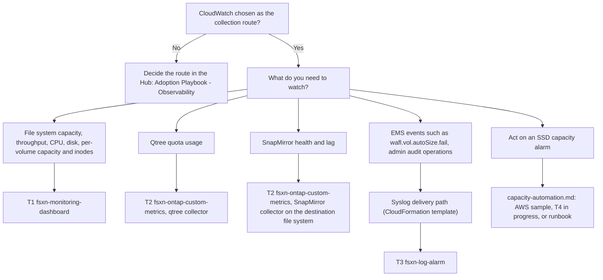

# CloudWatch Monitoring for Amazon FSx for NetApp ONTAP with Terraform: Three Modules Applied in Order

🌐 [日本語](../ja/terraform-monitoring-guide.md) | **English** (this page)

## Executive summary

To deploy the CloudWatch monitoring design for Amazon FSx for NetApp ONTAP with Terraform, apply three modules from `terraform/` in this order. T1 `fsxn-monitoring-dashboard` creates a dashboard and alarms on the native `AWS/FSx` metrics and calls AWS APIs only. T2 `fsxn-ontap-custom-metrics` publishes qtree quota usage and SnapMirror health and lag, which CloudWatch does not publish natively; it needs a subnet that reaches the file system's management endpoint on TCP 443, an ONTAP user with the `fsxadmin-readonly` role whose credentials are in a Secrets Manager secret, and a path to CloudWatch and Secrets Manager through a NAT gateway or interface endpoints. T3 `fsxn-log-alarm` raises alarms on EMS and audit events; it needs a CloudWatch Logs log group that already receives those events through the syslog VPC endpoint path, which this repository provides as a CloudFormation template. Pick your thresholds before T1. T4 (guarded SSD auto-increase) is in progress and optional. T1 and T2 have dated live runs, and T3 was live-verified on 2026-10-09 with its record being added, all on one first-generation file system with one HA pair; the [module map](#module-map) is the one place that lists them.

The same three pieces also exist as CloudFormation templates in `shared/templates/`. Which one to use depends on how your environment already manages infrastructure, not on the monitoring itself; see [Relation to the CloudFormation templates](#faq-and-common-misconceptions) in the FAQ.

> **Scope note**
>
> This page routes and orders. Inputs, IAM permissions, and the deploy, verify and remove commands are in each module README, linked from the module map. Whether CloudWatch is the right collection route at all (compared with Harvest + Prometheus, a SaaS platform, or the ONTAP REST API) is decided in the Hub: [Adoption Playbook — Observability](https://github.com/Yoshiki0705/FSx-for-ONTAP-Adoption-Playbook/blob/main/docs/en/domains/observability/README.md).

## Audience and scope

This page is for FSx for ONTAP users who have chosen CloudWatch as the collection route and manage infrastructure with Terraform. It covers which module produces which signal, the order to apply them, the prerequisite that most often blocks each step, per-module verification status, and a minimal root module.

It does not cover building the file system itself, choosing the collection route, the full input reference of each module, the Harvest and SaaS vendor paths, or CloudFormation deployment steps (those are in the [Deployment Guide](deployment-guide.md)).

## Design layers and where each is decided

The modules implement decisions made elsewhere. Make those decisions first; the layers are defined in [Monitoring design layers](monitoring-design.md#monitoring-design-layers).

| Layer | Document | What you decide there |
|---|---|---|
| Sizing and headroom | [sizing-and-headroom.md](sizing-and-headroom.md#threshold-table) | Throughput sizing, the warning, critical and emergency SSD thresholds, and the value for `capacity_threshold_percent` |
| Metric catalog | [monitoring-design.md](monitoring-design.md#metric-catalog) | Which series are native (T1), custom through the ONTAP REST API (T2), or log-based (T3) |
| Alert design | [monitoring-design.md](monitoring-design.md#alert-design) | Severity routing, missing-data policy, aggregate maximum plus drill-down, heartbeat alarms |
| Monitoring-driven automation | [capacity-automation.md](capacity-automation.md) and [capacity-automation-t4-design.md](capacity-automation-t4-design.md) | Whether anything acts on an SSD capacity alarm: the AWS sample, T4, or a runbook |

## Module map

This table is the only place on this page with per-module status. Other sections link here.

| Phase | Purpose | Module path | What it creates | Prerequisites | Live verification | How to pin |
|---|---|---|---|---|---|---|
| T1 | Dashboard and alarms on native metrics | [`terraform/fsxn-monitoring-dashboard`](../../terraform/fsxn-monitoring-dashboard/README.md) | Dashboard (7 widgets), file system capacity and network-throughput-utilization alarms, opt-in CPU, disk and per-volume alarms, optional SNS topic | AWS APIs only; the file system ID | `verified`: [2026-10-05](verification-results-cloudwatch-monitoring.md#test-results-summary), [2026-10-06 to 07](verification-results-cloudwatch-monitoring.md#capacity-alarm-real-data-run-on-2026-10-06) (capacity alarm on real data), [2026-10-07](verification-results-cloudwatch-monitoring.md#dashboard-and-alarm-screenshots-on-2026-10-07) (minimum IAM policy); first generation, one HA pair | Tag `terraform-fsxn-monitoring-dashboard-v0.1.1` (`v0.1.0` has a dashboard display defect); [Obtaining the module](../../terraform/fsxn-monitoring-dashboard/README.md#obtaining-the-module) |
| T2 | Qtree quota and SnapMirror health and lag | [`terraform/fsxn-ontap-custom-metrics`](../../terraform/fsxn-ontap-custom-metrics/README.md) | VPC Lambda, schedule, dead-letter queue, log group, IAM role, Lambda security group, optional interface endpoints, up to 7 alarms | Subnet reaching the management endpoint on TCP 443; ingress rule on the file system security group; `fsxadmin-readonly` user and Secrets Manager secret; NAT gateway or `monitoring` and `secretsmanager` endpoints | `verified`: [2026-10-08](verification-results-cloudwatch-monitoring.md#terraform-custom-metrics-module-run-on-2026-10-08), SnapMirror between two volumes in one SVM | Commit SHA until a release tag is published; [Obtaining the module](../../terraform/fsxn-ontap-custom-metrics/README.md#obtaining-the-module) |
| T3 | Alarms on EMS and audit events | [`terraform/fsxn-log-alarm`](../../terraform/fsxn-log-alarm/README.md) | One metric filter and one metric alarm per detection (5 default recipes), optional SNS topic | An existing log group fed by the syslog VPC endpoint path | `verified` on 2026-10-09; the record is being added | Commit SHA until a release tag is published; [Obtaining the module](../../terraform/fsxn-log-alarm/README.md#obtaining-the-module) |
| T4 | Guarded SSD auto-increase (optional) | In progress, not on `main` | — | — | In progress | — ; design in [capacity-automation-t4-design.md](capacity-automation-t4-design.md) |

> **Record note**
>
> Pages written before these runs, including the module READMEs and the monitoring design, may still say that live verification is pending. The dated records linked in this table are the reference.

> **Verification scope note**
>
> Each run is a sample run on one file system in one Region, not a production estimate. On a different shape (second generation, more than one HA pair, another Region), apply in a non-production account first.

## Recommended deployment order

1. Read the sizing page and pick thresholds: [How to choose thresholds](sizing-and-headroom.md#how-to-choose-thresholds). Most common blocker: `capacity_threshold_percent` in T1 accepts 50 to 95 only.
2. Apply T1 ([`fsxn-monitoring-dashboard`](../../terraform/fsxn-monitoring-dashboard/README.md#prerequisites)). Most common blocker: provider constraints intersect, so a root that pins `hashicorp/aws` below 6.67.0 (for example `~> 6.60.0`) fails `terraform init` with "no available releases match the given constraints".
3. Apply T2 ([`fsxn-ontap-custom-metrics`](../../terraform/fsxn-ontap-custom-metrics/README.md#prerequisites)). Most common blocker: TCP 443 from the Lambda subnets to the management endpoint. The ingress rule on the file system security group is added outside Terraform after apply.
4. Build the T3 delivery path with the [syslog VPC endpoint setup guide](syslog-vpce-setup-guide.md) and the CloudFormation template `shared/templates/syslog-vpce-cloudwatch.yaml`. Most common blocker: ONTAP log forwarding must point at the syslog endpoint before any event arrives ([Step 3](syslog-vpce-setup-guide.md#step-3-configure-ontap-log-forwarding)).
5. Apply T3 ([`fsxn-log-alarm`](../../terraform/fsxn-log-alarm/README.md#prerequisites)). Most common blocker: `log_group_name` must equal the log group the delivery path writes to (template default `/syslog/fsxn-admin-audit`).
6. Optionally, add T4 once it is released, starting in `notify_only`. Most common blocker: a Terraform-managed file system needs `ignore_changes` on its storage capacity first ([Terraform-managed file systems](capacity-automation.md#terraform-managed-file-systems)).

> **Provider version note**
>
> Each module declares only a lower bound (`hashicorp/aws >= 6.67.0`, plus `hashicorp/archive >= 2.8.1` for T2) and was tested with 6.67.0. Pin exact versions in your root and keep its own `.terraform.lock.hcl` under version control; Terraform does not read a module's lock file on behalf of the caller.

> **Network note**
>
> The T2 ingress rule on the file system security group lives outside Terraform state. Revoke it before `terraform destroy`, or deleting the Lambda security group fails with `DependencyViolation` ([Removing](../../terraform/fsxn-ontap-custom-metrics/README.md#removing)). In the 2026-10-08 run, destroy waited 22 minutes on the Lambda security group (observed once).

> **VPC endpoint conflict note**
>
> Two interface endpoints for the same service cannot coexist in one VPC with private DNS. If the VPC already has a `monitoring` or `secretsmanager` interface endpoint, leave `create_monitoring_endpoint` and `create_secretsmanager_endpoint` at `false` and set `aws_api_egress_cidr_blocks` to the VPC CIDR instead ([Network options](../../terraform/fsxn-ontap-custom-metrics/README.md#network-options)).

> **Delivery path note**
>
> This repository has no Terraform module for the syslog delivery path. Deploy the CloudFormation template, or build an equivalent in your own Terraform code. The template's log group has `DeletionPolicy: Retain`, so it remains when the stack is deleted.

> **Irreversibility note**
>
> On a first-generation file system an SSD capacity increase cannot be undone, and any SSD, IOPS or throughput change starts a 6-hour cooldown before the next one. Read [capacity-automation.md](capacity-automation.md) before enabling anything that changes capacity.

## Selection flowchart



## Minimal root module

All values below are placeholders; replace them before use. The T2 network defaults assume a NAT gateway.

```hcl
terraform {
  required_version = ">= 1.11.0"
  required_providers {
    aws = {
      source  = "hashicorp/aws"
      version = "= 6.67.0"
    }
    archive = {
      source  = "hashicorp/archive"
      version = "= 2.8.1"
    }
  }
}

provider "aws" {
  region = "ap-northeast-1"
}

# T1: dashboard and alarms on native AWS/FSx metrics (AWS APIs only)
module "fsx_ontap_dashboard" {
  source = "github.com/Yoshiki0705/FSx-for-ONTAP-Observability-integrations//terraform/fsxn-monitoring-dashboard?ref=terraform-fsxn-monitoring-dashboard-v0.1.1&depth=1"

  file_system_id             = "fs-0123456789abcdef0"
  file_system_name           = "fsx-for-ontap-prod"
  capacity_threshold_percent = 80
  notification_email         = "ops@example.com"
  volume_ids                 = ["fsvol-0123456789abcdef0"]
}

# T2: qtree quota and SnapMirror metrics from the ONTAP REST API (VPC Lambda)
# Defaults assume a NAT gateway; see "Network options" in the module README.
module "fsx_ontap_custom_metrics" {
  source = "github.com/Yoshiki0705/FSx-for-ONTAP-Observability-integrations//terraform/fsxn-ontap-custom-metrics?ref=<commit-sha>"

  file_system_id               = "fs-0123456789abcdef0"
  ontap_management_ip          = "198.51.100.10"
  ontap_credentials_secret_arn = "arn:aws:secretsmanager:ap-northeast-1:123456789012:secret:ontap-monitor-XXXXXX"
  vpc_id                       = "vpc-0123456789abcdef0"
  subnet_ids                   = ["subnet-0123456789abcdef0"]
  qtree_svm_name               = "svm-prod-01"
  notification_email           = "ops@example.com"
}

# T3: alarms on the log group that the syslog VPC endpoint path writes to
module "fsx_ontap_log_alarm" {
  source = "github.com/Yoshiki0705/FSx-for-ONTAP-Observability-integrations//terraform/fsxn-log-alarm?ref=<commit-sha>"

  log_group_name     = "/syslog/fsxn-admin-audit"
  notification_email = "ops@example.com"
}
```

The ingress rule on the file system security group for T2 (source: the `lambda_security_group_id` output) is added outside this configuration, as the [T2 prerequisites](../../terraform/fsxn-ontap-custom-metrics/README.md#prerequisites) describe.

> **Module source note**
>
> Each module accepts a git source, an archive URL, or a relative local path. An absolute local path for T2 failed in the 2026-10-08 run, because its Lambda source (`shared/lambda/ontap_metrics/`) sits outside the module directory. A sparse checkout for T2 must include `shared/lambda/ontap_metrics`.

> **Notification note**
>
> This example creates three SNS topics and sends three email confirmations. T3 accepts a topic you already own through `alarm_sns_topic_arn`; T1 and T2 have no such input. The T2 heartbeat alarms go to ALARM right after apply and to OK after the first poll (observed on 2026-10-08).

> **Naming note**
>
> The default `name_prefix` differs per module, so one root does not collide. For several file systems, give each module instance its own `name_prefix`. Qtree series carry `SvmName` but no `FileSystemId`, so two file systems with the same SVM name in one account and Region share those series ([cross-file-system SnapMirror](../../terraform/fsxn-ontap-custom-metrics/README.md#cross-file-system-snapmirror)).

> **Cost note**
>
> This page gives no dollar total. Interface endpoints are billed per endpoint, per Availability Zone, per hour; T2 adds Lambda invocations and custom metric series. The formulas are in the [T2 cost section](../../terraform/fsxn-ontap-custom-metrics/README.md#cost).

## Verified and not verified

Verified, on a first-generation `SINGLE_AZ_1` file system with one HA pair in `ap-northeast-1` (dates in the [module map](#module-map)):

- T1 dashboard and alarms, including per-volume alarms and the capacity alarm on real data
- T2 qtree and SnapMirror series against real ONTAP responses, the heartbeat alarms (ALARM before the first poll, OK after it), and the SnapMirror unhealthy and lag alarms going OK → ALARM → OK
- T3 log alarms

Not verified:

- Second-generation file systems, for any module
- File systems with more than one HA pair
- SnapMirror between two SVMs or between two file systems
- A minimum IAM policy for T2 and T3 (verified for T1 only; the T2 and T3 policies are estimates)
- SNS email delivery
- The T2 qtree quota alarm going to ALARM, and the T2 ingress-rule and revoke-before-destroy steps (the test file system security group already allowed the traffic)
- CA-verified TLS for T2, and T2 at the default 5-minute poll
- The root module on this page: validated with `terraform validate` against local copies of the modules, not applied
- T4, which is not released

> **SnapMirror coverage note**
>
> In the 2026-10-08 run, an uninitialized SnapMirror relationship reported `healthy: true` and raised no alarm (observed once); see the [record](verification-results-cloudwatch-monitoring.md#terraform-custom-metrics-module-run-on-2026-10-08).

## FAQ and common misconceptions

**Q: Is this one module or several?**
A: Three independent modules. You can call them from one root, as in the example above, or from separate roots with separate state. T1 alone is a valid start. T3 depends on the syslog delivery path, not on T1 or T2.

**Q: How do these modules relate to the CloudFormation templates?**
A: T1 corresponds to `shared/templates/fsxn-monitoring-dashboard.yaml`, the T2 qtree collector to `shared/templates/qtree-quota-monitor.yaml` (the SnapMirror collector exists only in T2), and T3 to `shared/templates/cloudwatch-log-alarm.yaml`. The CloudFormation log-alarm template uses the native `AWS::CloudWatch::LogAlarm` with a Logs Insights query; T3 uses a metric filter pattern plus a metric alarm ([deliberate differences](../../terraform/fsxn-log-alarm/README.md#deliberate-differences-from-the-cloudformation-template)). Terraform suits teams that already review and hold state in Terraform; it needs a state backend and provider pinning. CloudFormation suits teams that already deploy with stacks or StackSets; it needs one stack per template. The syslog delivery path is a CloudFormation template in both cases.

> **Choice note**
>
> Choose by where your infrastructure state already lives. Neither option replaces the other. Mixing them works too: for example, the syslog delivery path as a CloudFormation stack and T1 to T3 in Terraform, which is the order on this page.

**Q: Does this work on a second-generation file system?**
A: It has not been tested. On T1, set `file_server_names` so the opt-in alarms use the documented dimension set ([second-generation file systems](../../terraform/fsxn-monitoring-dashboard/README.md#second-generation-file-systems)). Apply in a non-production account first.

**Q: Which file system does the SnapMirror collector poll?**
A: The destination. Use one T2 instance per destination file system, each with its own management IP, credential, network path and `name_prefix`. The module never calls the source file system. A relationship across two file systems is untested ([cross-file-system SnapMirror](../../terraform/fsxn-ontap-custom-metrics/README.md#cross-file-system-snapmirror)).

**Q: Is SSD auto-increase recommended?**
A: Not as a default. T4 is in progress and starts in `notify_only`. An alarm plus a runbook remains a valid option. Compare the options in [capacity-automation.md](capacity-automation.md).

**Q: My file system itself is managed by Terraform. Does that change anything?**
A: The monitoring modules take the file system ID as an input and do not manage the file system. If any automation changes `storage_capacity`, add `ignore_changes` in the code that builds the file system ([Terraform-managed file systems](capacity-automation.md#terraform-managed-file-systems)).

**Q: Where do I ask a question this page does not answer?**
A: In [GitHub Discussions, Q&A category](https://github.com/Yoshiki0705/FSx-for-ONTAP-Observability-integrations/discussions/categories/q-a). Answered threads stay searchable for the next person with the same question. Report defects in a module or document as Issues.

## Related Documents

- [Monitoring design](monitoring-design.md): metric catalog, alert design, and the [Terraform implementation phases](monitoring-design.md#terraform-implementation-phases)
- [Sizing and headroom](sizing-and-headroom.md): sizing rules and the threshold table
- [Capacity automation](capacity-automation.md): options for acting on SSD capacity alarms
- [T4 design](capacity-automation-t4-design.md): the guarded SSD auto-increase module in progress
- [CloudWatch monitoring verification results](verification-results-cloudwatch-monitoring.md): the dated runs behind the module map
- [Syslog VPC endpoint setup guide](syslog-vpce-setup-guide.md): the delivery path that feeds T3
- [CloudWatch Log Alarm](cloudwatch-log-alarm.md): the CloudFormation counterpart of T3
- [T1 module README](../../terraform/fsxn-monitoring-dashboard/README.md): inputs, IAM, deploy, verify, remove
- [T2 module README](../../terraform/fsxn-ontap-custom-metrics/README.md): inputs, network options, IAM, deploy, verify, remove
- [T3 module README](../../terraform/fsxn-log-alarm/README.md): inputs, detection recipes, deploy, verify, remove
- [Deployment Guide](deployment-guide.md): CloudFormation deployment of the vendor integrations
- [Adoption Playbook — Observability](https://github.com/Yoshiki0705/FSx-for-ONTAP-Adoption-Playbook/blob/main/docs/en/domains/observability/README.md): choosing the collection route
- [GitHub Discussions, Q&A](https://github.com/Yoshiki0705/FSx-for-ONTAP-Observability-integrations/discussions/categories/q-a): questions this page does not answer
