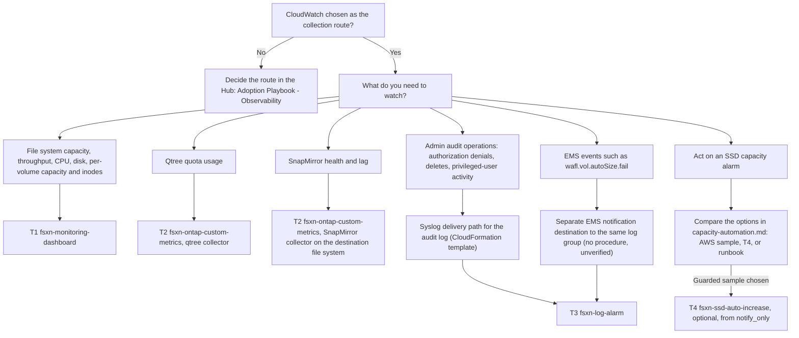

# CloudWatch Monitoring for Amazon FSx for NetApp ONTAP with Terraform: Three Modules Applied in Order, Plus an Optional Fourth for SSD Auto-Increase

🌐 [日本語](../ja/terraform-monitoring-guide.md) | **English** (this page)

## Executive summary

To deploy the CloudWatch monitoring design for Amazon FSx for NetApp ONTAP with Terraform, apply the three monitoring modules from `terraform/` in this order. T1 `fsxn-monitoring-dashboard` creates a dashboard and alarms on the native `AWS/FSx` metrics and calls AWS APIs only. T2 `fsxn-ontap-custom-metrics` publishes qtree quota usage and SnapMirror health and lag, which CloudWatch does not publish natively; it needs a subnet that reaches the file system's management endpoint on TCP 443, an ONTAP user with the `fsxadmin-readonly` role whose credentials are in a Secrets Manager secret, and a path to CloudWatch and Secrets Manager through a NAT gateway or interface endpoints. T3 `fsxn-log-alarm` raises alarms on admin audit events; it needs a CloudWatch Logs log group that receives the audit log through the syslog VPC endpoint path, which this repository provides as a CloudFormation template. That path carries the audit log only. EMS events such as `wafl.vol.autoSize.fail` reach the same log group only through a separately configured EMS notification destination, which is neither documented nor tested here (`unverified`). Pick your thresholds before T1. The fourth module, T4 `fsxn-ssd-auto-increase`, is a guarded sample that raises SSD capacity in response to an SSD capacity alarm; monitoring does not need it. If you use it, add it after the capacity alarms, in the default `notify_only` mode. On a first-generation file system an SSD increase cannot be undone, and each change starts a 6-hour cooldown. T1 and T2 have dated live runs; the [2026-10-09 record](verification-results-cloudwatch-monitoring.md#terraform-log-alarm-module-run-on-2026-10-09) verified three T3 audit detections with test settings. T4 is implemented and offline-verified, and `unverified` live. Every live result comes from one first-generation file system with one HA pair; the [module map](#module-map) links each dated record.

CloudFormation templates in `shared/templates/` exist for T1 (`fsxn-monitoring-dashboard.yaml`), the qtree part of T2 (`qtree-quota-monitor.yaml`), and T3 (`cloudwatch-log-alarm.yaml`). The T3 template's detection queries were not updated with the patterns T3 replaced after the 2026-10-09 run ([record judgment](verification-results-cloudwatch-monitoring.md#judgment-t3-run)). The SnapMirror collector and T4 exist only in Terraform. Which one to use depends on how your environment already manages infrastructure, not on the monitoring itself; see [Relation to the CloudFormation templates](#faq-and-common-misconceptions) in the FAQ.

> **Scope note**
>
> This page routes and orders. Inputs, IAM permissions, and the deploy, verify and remove commands are in each module README, linked from the module map. Whether CloudWatch is the right collection route at all (compared with Harvest + Prometheus, a SaaS platform, or the ONTAP REST API) is decided in the Hub: [Adoption Playbook — Observability](https://github.com/Yoshiki0705/FSx-for-ONTAP-Adoption-Playbook/blob/main/docs/en/domains/observability/README.md).

## Audience and scope

This page is for FSx for ONTAP users who have chosen CloudWatch as the collection route and manage infrastructure with Terraform. It covers which module produces which signal, the order to apply them, the prerequisite that most often blocks each step, per-module verification status, and a minimal root module.

It does not cover building the file system itself, choosing the collection route, the full input reference of each module, the Harvest and SaaS vendor paths, or CloudFormation deployment steps (those are in the [Deployment Guide](deployment-guide.md)).

## Design layers and where each is decided

The modules implement decisions made elsewhere. Make those decisions first; the layers are defined in [Monitoring design layers](monitoring-design.md#monitoring-design-layers).

| Layer | Document | What you decide there |
|---|---|---|
| Sizing and headroom | [sizing-and-headroom.md](sizing-and-headroom.md#threshold-table) | Throughput sizing, the warning, critical and emergency SSD thresholds, and the value for `capacity_threshold_percent` |
| Metric catalog | [monitoring-design.md](monitoring-design.md#metric-catalog) | Which series are native (T1), custom through the ONTAP REST API (T2), or log-based (T3) |
| Alert design | [monitoring-design.md](monitoring-design.md#alert-design) | Severity routing, missing-data policy, aggregate maximum plus drill-down, heartbeat alarms |
| Monitoring-driven automation | [capacity-automation.md](capacity-automation.md) and [capacity-automation-t4-design.md](capacity-automation-t4-design.md) | Whether anything acts on an SSD capacity alarm: the AWS sample, T4, or a runbook |

## Module map

The dated records behind each module's status are linked from this table.

| Phase | Purpose | Module path | What it creates | Prerequisites | Live verification | How to pin |
|---|---|---|---|---|---|---|
| T1 | Dashboard and alarms on native metrics | [`terraform/fsxn-monitoring-dashboard`](../../terraform/fsxn-monitoring-dashboard/README.md) | Dashboard (7 widgets), file system capacity and network-throughput-utilization alarms, opt-in CPU, disk and per-volume alarms, optional SNS topic | AWS APIs only; the file system ID | `verified`: [2026-10-05](verification-results-cloudwatch-monitoring.md#test-results-summary), [2026-10-06 to 07](verification-results-cloudwatch-monitoring.md#capacity-alarm-real-data-run-on-2026-10-06) (capacity alarm on real data), [2026-10-07](verification-results-cloudwatch-monitoring.md#dashboard-and-alarm-screenshots-on-2026-10-07) (minimum IAM policy); first generation, one HA pair | Tag `terraform-fsxn-monitoring-dashboard-v0.1.1` (`v0.1.0` has a dashboard display defect); [Obtaining the module](../../terraform/fsxn-monitoring-dashboard/README.md#obtaining-the-module) |
| T2 | Qtree quota and SnapMirror health and lag | [`terraform/fsxn-ontap-custom-metrics`](../../terraform/fsxn-ontap-custom-metrics/README.md) | VPC Lambda, schedule, dead-letter queue, log group, IAM role, Lambda security group, optional interface endpoints, up to 7 alarms | Subnet reaching the management endpoint on TCP 443; ingress rule on the file system security group; `fsxadmin-readonly` user and Secrets Manager secret; NAT gateway or `monitoring` and `secretsmanager` endpoints | `verified`: [2026-10-08](verification-results-cloudwatch-monitoring.md#terraform-custom-metrics-module-run-on-2026-10-08), SnapMirror between two volumes in one SVM | Tag `terraform-fsxn-ontap-custom-metrics-v0.1.0`; [Obtaining the module](../../terraform/fsxn-ontap-custom-metrics/README.md#obtaining-the-module) |
| T3 | Alarms on admin audit events (EMS events need a separate forwarding setup) | [`terraform/fsxn-log-alarm`](../../terraform/fsxn-log-alarm/README.md) | One metric filter and one metric alarm per detection (5 default recipes), optional SNS topic | An existing log group that the syslog VPC endpoint path writes the audit log to; `autosize-fail` also needs a separate EMS notification destination to the same log group (`unverified`) | Three audit detections `verified`: [2026-10-09](verification-results-cloudwatch-monitoring.md#terraform-log-alarm-module-run-on-2026-10-09); with a 60-second test period and test thresholds, `bulk-delete`, `privileged-operations` and a failed-access detection counting REST 403s went OK → ALARM → OK. The default 300-second period, `autosize-fail` and `unauthorized-access` are `unverified` ([Verified and not verified](#verified-and-not-verified)) | Tag `terraform-fsxn-log-alarm-v0.1.0`; [Obtaining the module](../../terraform/fsxn-log-alarm/README.md#obtaining-the-module) |
| T4 | Guarded SSD auto-increase (optional; not needed for monitoring) | [`terraform/fsxn-ssd-auto-increase`](../../terraform/fsxn-ssd-auto-increase/README.md) | Lambda outside any VPC, SSD utilization trigger alarm (plus one per `aggregate_names` entry on second generation), trigger and notification SNS topics, hourly re-evaluation schedule, dead-letter queue, DynamoDB lock table, decision and function log groups, IAM role | An S3 Object Lock bucket administered outside the module (compliance mode for `auto`); the required absolute ceiling `max_storage_capacity_gib`; `ignore_changes` on `storage_capacity` for a Terraform-managed file system. On first generation an increase cannot be undone, and each change starts a 6-hour cooldown | Implemented and offline-verified (unit tests, `make terraform`, `terraform test`); live `unverified` | Tag `terraform-fsxn-ssd-auto-increase-v0.1.0`; [Obtaining the module](../../terraform/fsxn-ssd-auto-increase/README.md#obtaining-the-module); design in [capacity-automation-t4-design.md](capacity-automation-t4-design.md) |

> **Record note**
>
> If another page states a different status for a module, the dated records linked in this table are the reference.

> **Verification scope note**
>
> Each run is a sample run on one file system in one Region, not a production estimate. On a different shape (second generation, more than one HA pair, another Region), apply in a non-production account first.

## Recommended deployment order

1. Read the sizing page and pick thresholds: [How to choose thresholds](sizing-and-headroom.md#how-to-choose-thresholds). Most common blocker: `capacity_threshold_percent` in T1 accepts 50 to 95 only.
2. Apply T1 ([`fsxn-monitoring-dashboard`](../../terraform/fsxn-monitoring-dashboard/README.md#prerequisites)). Most common blocker: provider constraints intersect, so a root that pins `hashicorp/aws` below 6.67.0 (for example `~> 6.60.0`) fails `terraform init` with "no available releases match the given constraints".
3. Apply T2 ([`fsxn-ontap-custom-metrics`](../../terraform/fsxn-ontap-custom-metrics/README.md#prerequisites)). Most common blocker: TCP 443 from the Lambda subnets to the management endpoint. The ingress rule on the file system security group is added outside Terraform after apply.
4. Build the path that delivers the audit log to T3 with the [syslog VPC endpoint setup guide](syslog-vpce-setup-guide.md) and the CloudFormation template `shared/templates/syslog-vpce-cloudwatch.yaml`. Use the current template: it writes the security group description as `GroupDescription: >-`. A copy taken before that fix writes `GroupDescription: >`, a folded scalar that keeps a trailing newline; EC2 rejects it with "Invalid security group description" and the stack ends in `ROLLBACK_COMPLETE` (observed on 2026-10-09). If you deploy such a copy, change that one line to `>-` first. The note in [Step 1](syslog-vpce-setup-guide.md#step-1-deploy-cloudformation-stack) also covers deleting the log group a failed stack leaves behind. Once the stack exists, no event arrives until ONTAP audit forwarding points at the syslog endpoint ([Step 3](syslog-vpce-setup-guide.md#step-3-configure-ontap-log-forwarding)). These steps deliver the audit log only, not EMS events.
5. Apply T3 ([`fsxn-log-alarm`](../../terraform/fsxn-log-alarm/README.md#prerequisites)). Most common blocker: `log_group_name` must equal the log group the delivery path writes to (template default `/syslog/fsxn-admin-audit`). Before apply, check the user that `privileged-operations` watches; the default `"fsxadmin:fsxadmin" -"Pending"` counts completed `fsxadmin` operations (see the [detection note](#minimal-root-module)).
6. Optionally, add T4 after you have operated the T1 capacity alarms ([`fsxn-ssd-auto-increase`](../../terraform/fsxn-ssd-auto-increase/README.md#prerequisites)). Monitoring does not need it. The default `notify_only` reports decisions and does not change the file system. Most common blockers: two prerequisites, an S3 Object Lock bucket prepared outside the module, and `ignore_changes` on storage capacity first for a Terraform-managed file system ([Terraform-managed file systems](capacity-automation.md#terraform-managed-file-systems)).

> **Provider version note**
>
> Each module declares only a lower bound (`hashicorp/aws >= 6.67.0`, plus `hashicorp/archive >= 2.8.1` for T2) and was tested with 6.67.0. Pin exact versions in your root and keep its own `.terraform.lock.hcl` under version control; Terraform does not read a module's lock file on behalf of the caller.

> **Network note**
>
> The T2 ingress rule on the file system security group lives outside Terraform state. Revoke it before `terraform destroy`, or deleting the Lambda security group fails with `DependencyViolation` ([Removing](../../terraform/fsxn-ontap-custom-metrics/README.md#removing)). In the 2026-10-08 run, destroy waited 22 minutes on the Lambda security group (observed once).

> **VPC endpoint conflict note**
>
> Two interface endpoints for the same service cannot coexist in one VPC with private DNS. If the VPC already has a `monitoring` or `secretsmanager` interface endpoint, leave `create_monitoring_endpoint` and `create_secretsmanager_endpoint` at `false` and set `aws_api_egress_cidr_blocks` to the VPC CIDR instead ([Network options](../../terraform/fsxn-ontap-custom-metrics/README.md#network-options)).

> **Delivery path note**
>
> This repository has no Terraform module for the syslog delivery path. Deploy the CloudFormation template (a copy taken before the fix needs the `GroupDescription` change in step 4), or build an equivalent in your own Terraform code. The template's log group has `DeletionPolicy: Retain`, so it remains when the stack is deleted. In the 2026-10-09 run, the first operation after a node's connection had been idle for about 4–5 minutes was lost three times; a detection that depends on a single line can miss that operation ([First operation lost after an idle connection](syslog-vpce-setup-guide.md#first-operation-lost-after-an-idle-connection)).

> **EMS event note**
>
> The `autosize-fail` recipe matches lines of the EMS event `wafl.vol.autoSize.fail`, which the audit destination does not carry. Getting EMS lines into the same log group needs a separate ONTAP EMS notification destination that sends to the same syslog endpoint. This repository has no procedure for it, and the 2026-10-09 run did not create one. The `autosize-fail` pattern was checked only with `aws logs test-metric-filter` against a line built from the NetApp EMS reference (`unverified`).

> **Irreversibility note**
>
> On a first-generation file system an SSD capacity increase cannot be undone, and any SSD, IOPS or throughput change starts a 6-hour cooldown before the next one. Read [capacity-automation.md](capacity-automation.md) before switching T4 to `approve` or `auto`, or before enabling anything else that changes capacity.

## Selection flowchart



## Minimal root module

All values below are placeholders; replace them before use. The example calls the monitoring modules T1 to T3 only and leaves out the optional T4 (how to call T4 is in the [T4 README](../../terraform/fsxn-ssd-auto-increase/README.md#deploying-from-examplesbasic)). The T2 network defaults assume a NAT gateway. As written, the example is for a PoC: T2 does not verify the management endpoint's TLS certificate, and the three SNS topics are not encrypted. The TLS note and the notification note after the block list what to change for production.

```hcl
terraform {
  required_version = ">= 1.11.0"
  required_providers {
    aws = {
      source  = "hashicorp/aws"
      version = "= 6.67.0"
    }
    archive = {
      source  = "hashicorp/archive"
      version = "= 2.8.1"
    }
  }
}

provider "aws" {
  region = "ap-northeast-1"
}

# T1: dashboard and alarms on native AWS/FSx metrics (AWS APIs only)
module "fsx_ontap_dashboard" {
  source = "github.com/Yoshiki0705/FSx-for-ONTAP-Observability-integrations//terraform/fsxn-monitoring-dashboard?ref=terraform-fsxn-monitoring-dashboard-v0.1.1&depth=1"

  file_system_id             = "fs-0123456789abcdef0"
  file_system_name           = "fsx-for-ontap-prod"
  capacity_threshold_percent = 80
  notification_email         = "ops@example.com"
  volume_ids                 = ["fsvol-0123456789abcdef0"]
}

# T2: qtree quota and SnapMirror metrics from the ONTAP REST API (VPC Lambda)
# Defaults assume a NAT gateway; see "Network options" in the module README.
module "fsx_ontap_custom_metrics" {
  source = "github.com/Yoshiki0705/FSx-for-ONTAP-Observability-integrations//terraform/fsxn-ontap-custom-metrics?ref=terraform-fsxn-ontap-custom-metrics-v0.1.0&depth=1"

  file_system_id               = "fs-0123456789abcdef0"
  ontap_management_ip          = "198.51.100.10"
  ontap_credentials_secret_arn = "arn:aws:secretsmanager:ap-northeast-1:123456789012:secret:ontap-monitor-XXXXXX"
  vpc_id                       = "vpc-0123456789abcdef0"
  subnet_ids                   = ["subnet-0123456789abcdef0"]
  qtree_svm_name               = "svm-prod-01"
  notification_email           = "ops@example.com"

  # PoC only: with these two empty, the poller does not verify the TLS
  # certificate (CERT_NONE). For production, set both.
  # ca_cert_path      = "/opt/certs/ontap-ca.pem"
  # ca_cert_layer_arn = "arn:aws:lambda:ap-northeast-1:123456789012:layer:ontap-ca:1"
}

# T3: alarms on the admin audit log that the syslog VPC endpoint path writes
module "fsx_ontap_log_alarm" {
  source = "github.com/Yoshiki0705/FSx-for-ONTAP-Observability-integrations//terraform/fsxn-log-alarm?ref=terraform-fsxn-log-alarm-v0.1.0&depth=1"

  log_group_name     = "/syslog/fsxn-admin-audit"
  notification_email = "ops@example.com"

  # No detections block: the five shipped recipes apply. On a log group that
  # receives only the admin audit log, autosize-fail (EMS) and
  # unauthorized-access (file access) see no matching lines.
}
```

The ingress rule on the file system security group for T2 (source: the `lambda_security_group_id` output) is added outside this configuration, as the [T2 prerequisites](../../terraform/fsxn-ontap-custom-metrics/README.md#prerequisites) describe.

> **Module source note**
>
> Each module accepts a git source, an archive URL, or a relative local path. An absolute local path for T2 failed in the 2026-10-08 run, because its Lambda source (`shared/lambda/ontap_metrics/`) sits outside the module directory. A sparse checkout for T2 must include `shared/lambda/ontap_metrics`.

> **TLS note**
>
> With `ca_cert_path` and `ca_cert_layer_arn` empty, as in the example, the T2 poller does not verify the management endpoint's TLS certificate and logs a warning. That is acceptable for a PoC only. For production, put the CA certificate that signs the management endpoint's certificate in a Lambda layer and set both inputs (the commented lines in the example; [TLS and topic encryption note](../../terraform/fsxn-ontap-custom-metrics/README.md#prerequisites) in the T2 README).

> **Notification note**
>
> This example creates three SNS topics and sends three email confirmations. None of the three topics is encrypted at rest. T1 and T2 accept neither a KMS key nor an existing topic ARN; where every topic must be encrypted, leave `notification_email` empty on T1 and T2 and route the alarm state changes to an encrypted topic from your own configuration, as the T2 README describes. T3 encrypts the topic it creates when `sns_kms_master_key_id` is set, or takes a topic you own through `alarm_sns_topic_arn` and creates none. A CloudWatch alarm cannot publish to a topic encrypted with the AWS managed key `alias/aws/sns`; use a customer managed key whose key policy allows CloudWatch to use it ([AWS re:Post Knowledge Center](https://repost.aws/knowledge-center/cloudwatch-configure-alarm-sns)). The T2 heartbeat alarms go to ALARM right after apply and to OK after the first poll (observed on 2026-10-08).

> **Detection note**
>
> The example omits `detections`, so the five default recipes apply. The three audit defaults were replaced after the 2026-10-09 run. `failed-access` is `"Error: not authorized"`; it counts requests that ONTAP rejected at authorization, not failed logins. `privileged-operations` is `"fsxadmin:fsxadmin" -"Pending"`; it counts one line per completed `fsxadmin` operation. To watch another user, replace `fsxadmin:fsxadmin` with that user's `<user>:<role>` token. `bulk-delete` is a regular expression that counts its three terms on the result line only (`:: Success` or `:: Error`). The first two patterns drove live alarms on 2026-10-09; the new `bulk-delete` pattern was checked with `aws logs test-metric-filter` only and has not run on a live alarm. For all three, the thresholds and evaluation windows are the values from before the replacement and have not been run. On a log group that receives only the admin audit log, no EMS lines reach `autosize-fail` and no file-access lines reach `unauthorized-access`, so those two alarms do not fire. Setting `detections` replaces all five, so copy the values of the recipes you keep from [Detection recipes](../../terraform/fsxn-log-alarm/README.md#detection-recipes).

> **Naming note**
>
> The default `name_prefix` differs per module, so calling all four from one root does not collide. For several file systems, give each module instance its own `name_prefix`. Qtree series carry `SvmName` but no `FileSystemId`, so two file systems with the same SVM name in one account and Region share those series ([cross-file-system SnapMirror](../../terraform/fsxn-ontap-custom-metrics/README.md#cross-file-system-snapmirror)).

> **Cost note**
>
> This page gives no dollar total. Interface endpoints are billed per endpoint, per Availability Zone, per hour; T2 adds Lambda invocations and custom metric series. The formulas are in the [T2 cost section](../../terraform/fsxn-ontap-custom-metrics/README.md#cost).

## Verified and not verified

Verified, on a first-generation `SINGLE_AZ_1` file system with one HA pair in `ap-northeast-1` (dates in the [module map](#module-map)):

- T1 dashboard and alarms, including per-volume alarms and the capacity alarm on real data
- T2 qtree and SnapMirror series against real ONTAP responses, the heartbeat alarms (ALARM before the first poll, OK after it), and the SnapMirror unhealthy and lag alarms going OK → ALARM → OK
- T3 deployment, every alarm leaving INSUFFICIENT_DATA, and OK → ALARM → OK on real audit lines for `bulk-delete`, `privileged-operations` and a failed-access detection counting REST 403s, with a 60-second test period and test thresholds ([2026-10-09 record](verification-results-cloudwatch-monitoring.md#terraform-log-alarm-module-run-on-2026-10-09)). The `privileged-operations` and failed-access patterns used are the current defaults; the `bulk-delete` pattern used is the one from before the replacement

Not verified:

- Second-generation file systems, for any module
- File systems with more than one HA pair
- SnapMirror between two SVMs or between two file systems
- A minimum IAM policy for T2 to T4 (verified for T1 only; the T2 to T4 policies are estimates)
- SNS email delivery
- The T2 qtree quota alarm going to ALARM, and the T2 ingress-rule and revoke-before-destroy steps (the test file system security group already allowed the traffic)
- CA-verified TLS for T2, and T2 at the default 5-minute poll
- The T3 default 300-second period, and the default thresholds and evaluation windows
- The new T3 `bulk-delete` default pattern on a live alarm
- T3 `unauthorized-access`
- T3 `autosize-fail` firing on a real EMS event, and EMS delivery from an EMS notification destination to the same log group
- The root module on this page: validated with `terraform validate` against local copies of the modules, not applied
- T4 on a live file system (alarm transitions, the deployer IAM policy, the Object Lock retention proof, and the one real increase)

> **SnapMirror coverage note**
>
> In the 2026-10-08 run, an uninitialized SnapMirror relationship reported `healthy: true` and raised no alarm (observed once); see the [record](verification-results-cloudwatch-monitoring.md#terraform-custom-metrics-module-run-on-2026-10-08).

## FAQ and common misconceptions

**Q** Is this one module or several?

**A** Four independent modules, of which monitoring uses three, T1 to T3. You can call them from one root, as in the example above, or from separate roots with separate state. T1 alone is a valid start. T3 depends on the syslog delivery path, not on T1 or T2. T4 creates its own trigger alarm and does not depend on T1, but the recommended order adds it only after the capacity alarms have been in operation.

**Q** How do these modules relate to the CloudFormation templates?

**A** T1 corresponds to `shared/templates/fsxn-monitoring-dashboard.yaml`, the T2 qtree collector to `shared/templates/qtree-quota-monitor.yaml` (the SnapMirror collector exists only in T2), and T3 to `shared/templates/cloudwatch-log-alarm.yaml`. T4 has no template counterpart either. The CloudFormation log-alarm template uses the native `AWS::CloudWatch::LogAlarm` with a Logs Insights query; T3 uses a metric filter pattern plus a metric alarm ([deliberate differences](../../terraform/fsxn-log-alarm/README.md#deliberate-differences-from-the-cloudformation-template)). The template's failed-access query still uses the terms T3 replaced (`Failure`, `denied`, `DENIED`). Terraform suits teams that already review and hold state in Terraform; it needs a state backend and provider pinning. CloudFormation suits teams that already deploy with stacks or StackSets; it needs one stack per template. The syslog delivery path is a CloudFormation template in both cases.

> **Choice note**
>
> Choose by where your infrastructure state already lives. Neither option replaces the other. Mixing them works too: for example, the syslog delivery path as a CloudFormation stack and T1 to T3 in Terraform, which is the order on this page.

**Q** Does this work on a second-generation file system?

**A** It has not been tested. On T1, set `file_server_names` so the opt-in alarms use the documented dimension set ([second-generation file systems](../../terraform/fsxn-monitoring-dashboard/README.md#second-generation-file-systems)). Apply in a non-production account first.

**Q** Which file system does the SnapMirror collector poll?

**A** The destination. Use one T2 instance per destination file system, each with its own management IP, credential, network path and `name_prefix`. The module never calls the source file system. A relationship across two file systems is untested ([cross-file-system SnapMirror](../../terraform/fsxn-ontap-custom-metrics/README.md#cross-file-system-snapmirror)).

**Q** Is SSD auto-increase recommended?

**A** Not as a default. T4 is implemented and offline-verified, and `unverified` live. Start in the default `notify_only`, observe its decisions, then move to `approve` and `auto`. An alarm plus a runbook remains a valid option. Compare the options in [capacity-automation.md](capacity-automation.md).

**Q** My file system itself is managed by Terraform. Does that change anything?

**A** The monitoring modules take the file system ID as an input and do not manage the file system. If any automation changes `storage_capacity`, add `ignore_changes` in the code that builds the file system ([Terraform-managed file systems](capacity-automation.md#terraform-managed-file-systems)).

**Q** Where do I ask a question this page does not answer?

**A** In [GitHub Discussions, Q&A category](https://github.com/Yoshiki0705/FSx-for-ONTAP-Observability-integrations/discussions/categories/q-a). Answered threads stay searchable for the next person with the same question. Report defects in a module or document as Issues.

## Related Documents

- [Monitoring design](monitoring-design.md): metric catalog, alert design, and the [Terraform implementation phases](monitoring-design.md#terraform-implementation-phases)
- [Sizing and headroom](sizing-and-headroom.md): sizing rules and the threshold table
- [Capacity automation](capacity-automation.md): options for acting on SSD capacity alarms
- [T4 design](capacity-automation-t4-design.md): state machine, archive, IAM and test plan of the guarded SSD auto-increase module
- [CloudWatch monitoring verification results](verification-results-cloudwatch-monitoring.md): the dated runs behind the module map
- [Syslog VPC endpoint setup guide](syslog-vpce-setup-guide.md): the delivery path that brings the audit log to T3
- [CloudWatch Log Alarm](cloudwatch-log-alarm.md): the CloudFormation counterpart of T3
- [T1 module README](../../terraform/fsxn-monitoring-dashboard/README.md): inputs, IAM, deploy, verify, remove
- [T2 module README](../../terraform/fsxn-ontap-custom-metrics/README.md): inputs, network options, IAM, deploy, verify, remove
- [T3 module README](../../terraform/fsxn-log-alarm/README.md): inputs, detection recipes, deploy, verify, remove
- [T4 module README](../../terraform/fsxn-ssd-auto-increase/README.md): guards, inputs, IAM, deploy, remove
- [Deployment Guide](deployment-guide.md): CloudFormation deployment of the vendor integrations
- [Adoption Playbook — Observability](https://github.com/Yoshiki0705/FSx-for-ONTAP-Adoption-Playbook/blob/main/docs/en/domains/observability/README.md): choosing the collection route
- [GitHub Discussions, Q&A](https://github.com/Yoshiki0705/FSx-for-ONTAP-Observability-integrations/discussions/categories/q-a): questions this page does not answer
