# CloudWatch Monitoring Verification Results (Dashboard Template, Terraform Module, and Qtree Quota Monitor)

🌐 [日本語](../ja/verification-results-cloudwatch-monitoring.md) | **English** (this page)

## Overview

This page records seven runs. The 2026-10-05 run of the dashboard template and the Terraform module is described first. The first 2026-10-06 run of the qtree quota monitor stopped after one successful poll and is kept as history in [Qtree Quota Monitor Run on 2026-10-06](#qtree-quota-monitor-run-on-2026-10-06). The re-run later that day completed 4 polls and drove `QtreeQuotaAlarm` from OK to ALARM and back to OK: [Qtree Quota Monitor Re-run on 2026-10-06](#qtree-quota-monitor-re-run-on-2026-10-06). A run starting late on 2026-10-06 wrote real data to a test volume and drove the file-system capacity alarm of both the template and the module from OK to ALARM and back to OK, which closes the ALARM-path gap left by F1: [Capacity Alarm Real-Data Run on 2026-10-06](#capacity-alarm-real-data-run-on-2026-10-06). Screenshots of the module's dashboard and alarm list from a deployment on 2026-10-07, after the dashboard display fix, are in [Dashboard and Alarm Screenshots on 2026-10-07](#dashboard-and-alarm-screenshots-on-2026-10-07). On 2026-10-08 the Terraform custom-metrics module (phase T2, qtree and SnapMirror) was applied and its SnapMirror alarms were driven on a relationship inside one SVM: [Terraform Custom-Metrics Module Run on 2026-10-08](#terraform-custom-metrics-module-run-on-2026-10-08). On 2026-10-09 the Terraform log-alarm module (phase T3) was applied to a log group fed by the syslog VPC endpoint path, and its alarms were driven with real ONTAP audit lines: [Terraform Log-Alarm Module Run on 2026-10-09](#terraform-log-alarm-module-run-on-2026-10-09). Later on 2026-10-09 the Terraform SSD auto-increase module (phase T4) was applied in `notify_only`, `approve` and `auto`, with `auto` kept behind an explicit IAM deny so that no storage capacity changed: [Terraform SSD Auto-Increase Module Run on 2026-10-09](#terraform-ssd-auto-increase-module-run-on-2026-10-09).

On 2026-10-05 (UTC), the CloudFormation dashboard template `shared/templates/fsxn-monitoring-dashboard.yaml` and the Terraform module `terraform/fsxn-monitoring-dashboard/` were deployed against one real Amazon FSx for NetApp ONTAP file system: first generation, `SINGLE_AZ_1`, one HA pair. Every dashboard series returned data and every alarm left INSUFFICIENT_DATA and reached OK. The two Terraform per-volume alarms were also driven to ALARM and back to OK. The file-system capacity alarm (CloudFormation and Terraform) could not be driven to ALARM, because its lowest allowed threshold (50%) is above the file system's observed utilization (about 3.5%); see [F1](#findings). No defect was found in the template or the module in this run. A dashboard display defect found on 2026-10-07 is described in the note under [Findings](#findings).

| Item | Value |
|------|-------|
| Verification date | 2026-10-05T16:03Z to 2026-10-06T00:06Z (UTC), including a pause of about 7.5 hours (see Environment Information) |
| Verification environment | Test environment (`ap-northeast-1`), sample run on an idle file system |
| Scope | AWS-side CloudWatch metrics, alarms, and dashboards only. No ONTAP REST call was made in this run |
| Result | Deploy, series, and OK evaluation: pass. Per-volume ALARM path: pass. File-system capacity ALARM path: not achievable (F1) |

The values below show that the series exist and that the alarms evaluate them on this file system. They say nothing about behavior under load, on second-generation file systems, or on file systems with more than one HA pair.

---

## Environment Information

| Item | Value |
|------|-------|
| AWS Region | `ap-northeast-1` |
| File system | `fs-0123456789abcdef0` (placeholder), AVAILABLE |
| Deployment type / HA pairs | `SINGLE_AZ_1` (first generation) / 1 |
| Throughput capacity / SSD capacity | 128 MBps / 1024 GiB |
| Target volume | `fsvol-0123456789abcdef0` (placeholder), non-root, Lifecycle `CREATED`, on `svm-0123456789abcdef0` (placeholder) |
| Source revision | `1a2414b` (main, after #105). Tracked files were not modified |
| Terraform / provider | Terraform v1.15.8 (darwin_arm64), `hashicorp/aws` v6.67.0 from the lock file (`terraform init -lockfile=readonly`) |
| Other tools | AWS CLI, boto3 1.43.93 (read-only CloudWatch calls) |
| Authentication | AWS IAM Identity Center (SSO) session |
| ONTAP version | Not recorded. No ONTAP REST call was made in this run |
| Pre-existing names | Before deployment: no stack `fsxn-verify-monitoring-dashboard`, 0 alarms and 0 dashboards with prefix `fsxn-verify` |

The SSO session expired at about 2026-10-05T16:11Z, during the first alarm-history read. The run paused without any workaround and resumed at 2026-10-05T23:47:34Z after a new sign-in. Only the CloudFormation stack existed during the pause.

`list-metrics` returned 760 series for the file system. The sets the two artifacts use all exist: `CPUUtilization`, `FileServerDiskIopsUtilization`, `FileServerDiskThroughputUtilization`, `NetworkThroughputUtilization`, `DataReadBytes`/`DataWriteBytes`, `DataReadOperations`/`DataWriteOperations`, `NetworkSentBytes`/`NetworkReceivedBytes`, and `StorageUsed` with `FileSystemId` only, and `StorageCapacityUtilization` with `FileSystemId` + `StorageTier=SSD` + `DataType=All`. No `StorageCapacityUtilization` series exists with `FileSystemId` alone. At volume level, `StorageCapacityUtilization` exists as `FileSystemId` + `VolumeId` (and with `StorageTier=SSD` + `DataType=All` added), and `FilesUsed` and `FilesCapacity` exist as `FileSystemId` + `VolumeId`.

> **Dimension note**: The absence of a `FileSystemId`-only `StorageCapacityUtilization` series on this file system is consistent with the dimension correction in #105. Before that change, the capacity alarm and widget selected `FileSystemId` alone and would have matched no series here.

---

## What Was Deployed

Both artifacts targeted the same file system and were deployed one after the other. Neither set a notification email, so neither created an SNS topic.

### CloudFormation dashboard stack

Stack `fsxn-verify-monitoring-dashboard` from `shared/templates/fsxn-monitoring-dashboard.yaml`, with `CapacityThresholdPercent=80`, `FileSystemName=verify-fs`, and no `NotificationEmail`. It created one dashboard (`fsxn-verify-monitoring-dashboard-verify-fs`) and the two alarms the template always creates, `StorageCapacityAlarm` and `ThroughputUtilizationAlarm`. No SNS topic was created.

```bash
aws cloudformation deploy \
  --template-file shared/templates/fsxn-monitoring-dashboard.yaml \
  --stack-name fsxn-verify-monitoring-dashboard \
  --parameter-overrides \
    FileSystemId=fs-0123456789abcdef0 \
    FileSystemName=verify-fs \
    CapacityThresholdPercent=80 \
  --region ap-northeast-1
```

### Terraform module

The module was applied from a local root configuration with `name_prefix = "fsxn-verify-tf"`. All three opt-in file-server alarms were enabled with `file_server_names` empty, so they select `FileSystemId` only, which is the first-generation form. One volume was listed in `volume_ids`. No `notification_email` was set, so no SNS topic was created.

```hcl
file_system_id                           = "fs-0123456789abcdef0"
file_system_name                         = "verify-fs"
name_prefix                              = "fsxn-verify-tf"
enable_cpu_utilization_alarm             = true
enable_disk_iops_utilization_alarm       = true
enable_disk_throughput_utilization_alarm = true
file_server_names                        = []
volume_ids                               = ["fsvol-0123456789abcdef0"]
```

`terraform plan` reported 8 to add. `terraform apply` created 1 dashboard (`fsxn-verify-tf-verify-fs`) and 7 alarms:

| Alarm (resource) | Source | Exercised |
|------------------|--------|-----------|
| `storage_capacity` | Parity with the template | OK evaluation |
| `network_throughput` | Parity with the template | OK evaluation |
| `file_server["cpu_utilization"]` | Opt-in | OK evaluation |
| `file_server["disk_iops_utilization"]` | Opt-in | OK evaluation |
| `file_server["disk_throughput_utilization"]` | Opt-in | OK evaluation |
| `volume_capacity["fsvol-0123456789abcdef0"]` | Opt-in, `volume_ids` | OK, ALARM, and back to OK |
| `volume_inode["fsvol-0123456789abcdef0"]` | Opt-in, `volume_ids` (metric math `100 * FilesUsed / FilesCapacity`) | OK, ALARM, and back to OK |

---

## Test Results Summary

| # | Check | Result | Time (UTC) |
|---|-------|--------|------------|
| P4-1 | CloudFormation stack deploy | ✅ PASS. 1 dashboard, 2 alarms, no SNS | 2026-10-05T16:03:06Z → 16:03:43Z |
| P4-2 | Every dashboard widget series returns datapoints (3 h window) | ✅ PASS. 9 of 9 series non-zero | 16:10:56Z, again 23:55:05Z |
| P4-3 | `StorageCapacityAlarm` INSUFFICIENT_DATA → OK | ✅ PASS | 16:04:09Z |
| P4-4 | `ThroughputUtilizationAlarm` INSUFFICIENT_DATA → OK | ✅ PASS | 16:04:26Z |
| P4-5 | Update `CapacityThresholdPercent=1` | ⛔ Rejected by the template (`MinValue` 50). Stack unchanged at 80 | 23:47:43Z |
| P4-6 | Update to 50 (lowest allowed); `StorageCapacityAlarm` → ALARM | ⚠️ Not achievable. Threshold 50.0 applied, alarm stayed OK at 3.45–3.51% (F1) | 23:47:54Z → 23:48:30Z, re-read after 90 s |
| P4-7 | Restore 80; both alarms OK | ✅ PASS | 23:54:25Z → 23:55:02Z |
| P5-1 | `terraform init -lockfile=readonly` | ✅ PASS (`hashicorp/aws` v6.67.0) | 23:55:37Z |
| P5-2 | `terraform plan` | ✅ PASS. 8 to add, 0 to change, 0 to destroy | 23:55:37Z |
| P5-3 | `terraform apply` | ✅ PASS. 8 added (1 dashboard, 7 alarms) | 23:55:54Z → 23:55:57Z |
| P5-4 | All 7 alarms INSUFFICIENT_DATA → OK | ✅ PASS (all OK by 23:57:16Z) | See [Alarm State Transitions](#alarm-state-transitions) |
| P5-5 | Dashboard widgets return data (3 h window) | ✅ PASS. 9 of 9 series non-zero | 2026-10-06T00:00:26Z |
| P5-6 | `capacity_threshold_percent=1` | ⛔ Rejected by module validation (range 50–95), `plan` exit 1 | 00:00:34Z |
| P5-7 | Lowest allowed thresholds: capacity 50, volume capacity 1, volume inode 1 → ALARM | ⚠️ Partial. Both per-volume alarms reached ALARM. The file-system capacity alarm took threshold 50 and stayed OK at 3.45% (F1) | apply 00:00:42Z → 00:00:46Z |
| P5-8 | Restore defaults; all alarms OK | ✅ PASS. All 7 OK at 00:03:56Z; follow-up `plan -detailed-exitcode` exit 0, no changes | apply 00:02:09Z → 00:02:17Z |
| P6 | Cleanup, with re-read about 65 s later | ✅ PASS for every resource | 00:04:08Z → 00:06:10Z |

---

## Alarm State Transitions

From `describe-alarm-history` (`StateUpdate`), UTC. Volume IDs in alarm names are replaced with the placeholder.

| Alarm | Transition | Time | Values in the state reason |
|-------|-----------|------|----------------------------|
| `fsxn-verify-monitoring-dashboard-capacity-high` | INSUFFICIENT_DATA → OK | 2026-10-05T16:04:09Z | 3.49, 3.49, 3.49, not > 80 |
| `fsxn-verify-monitoring-dashboard-throughput-high` | INSUFFICIENT_DATA → OK | 2026-10-05T16:04:26Z | 0.337, 0.273, 0.271, not > 80 |
| `fsxn-verify-tf-capacity-high` | INSUFFICIENT_DATA → OK | 2026-10-05T23:56:34Z | 3.45 ×3, not > 80 |
| `fsxn-verify-tf-fsvol-0123456789abcdef0-capacity-high` | INSUFFICIENT_DATA → OK | 2026-10-05T23:56:42Z | 20.23 ×3, not > 80 |
| `fsxn-verify-tf-cpu-high` | INSUFFICIENT_DATA → OK | 2026-10-05T23:56:51Z | 13.64, 12.81, 13.25, not > 80 |
| `fsxn-verify-tf-throughput-high` | INSUFFICIENT_DATA → OK | 2026-10-05T23:56:55Z | 0.280, 0.282, 0.315, not > 80 |
| `fsxn-verify-tf-disk-iops-high` | INSUFFICIENT_DATA → OK | 2026-10-05T23:57:03Z | 0.367, 0.318, 0.414, not > 80 |
| `fsxn-verify-tf-fsvol-0123456789abcdef0-inode-high` | INSUFFICIENT_DATA → OK | 2026-10-05T23:57:11Z | 34.908 ×3, not > 80 |
| `fsxn-verify-tf-disk-throughput-high` | INSUFFICIENT_DATA → OK | 2026-10-05T23:57:16Z | 0.367, 0.337, 0.393, not > 80 |
| `fsxn-verify-tf-fsvol-0123456789abcdef0-inode-high` | OK → ALARM | 2026-10-06T00:01:45Z | 34.908 ×3, > 1 |
| `fsxn-verify-tf-fsvol-0123456789abcdef0-capacity-high` | OK → ALARM | 2026-10-06T00:01:46Z | 20.23 ×3, > 1 |
| `fsxn-verify-tf-fsvol-0123456789abcdef0-inode-high` | ALARM → OK | 2026-10-06T00:03:20Z | 34.908 ×3, not > 80 |
| `fsxn-verify-tf-fsvol-0123456789abcdef0-capacity-high` | ALARM → OK | 2026-10-06T00:03:47Z | 20.23 ×3, not > 80 |

Every alarm reached OK within about 1.5 minutes of creation, because CloudWatch evaluated the three 300-second periods from existing metric history. No alarm stayed in INSUFFICIENT_DATA. The CloudFormation capacity alarm and the Terraform file-system capacity alarm have no ALARM entry (F1).

---

## Dashboard Widget Datapoints

`get-metric-data` over the last 3 hours, for the 9 metric series that both dashboards draw. Expression rows (MB/s and IOPS conversions) are computed from these series and are not counted separately. Status was `Complete` for every query.

| Widget | Metric (stat / period) | Dimensions | CFN 13:10–16:10Z | CFN 20:55–23:55Z | TF 21:00–00:00Z | Range seen |
|--------|------------------------|------------|:---:|:---:|:---:|------------|
| Network Throughput (MB/s) | `DataReadBytes` Sum / 60 | `FileSystemId` | 180 | 180 | 180 | 0–3098 bytes/min |
| Network Throughput (MB/s) | `DataWriteBytes` Sum / 60 | `FileSystemId` | 180 | 180 | 180 | 0–1128 bytes/min |
| IOPS (Operations/s) | `DataReadOperations` Sum / 60 | `FileSystemId` | 180 | 180 | 180 | 0–6 /min |
| IOPS (Operations/s) | `DataWriteOperations` Sum / 60 | `FileSystemId` | 180 | 180 | 180 | 0–1 /min |
| Network Throughput Utilization (%) | `NetworkThroughputUtilization` Average / 60 | `FileSystemId` | 180 | 179 | 179 | 0.217–0.540% |
| Storage Capacity Utilization (%) | `StorageCapacityUtilization` Average / 300 | `FileSystemId`, `StorageTier=SSD`, `DataType=All` | 36 | 36 | 36 | 3.45–3.51% |
| Network Sent/Received (MB/s) | `NetworkSentBytes` Sum / 60 | `FileSystemId` | 180 | 179 | 179 | 1.95e7–4.86e7 bytes/min |
| Network Sent/Received (MB/s) | `NetworkReceivedBytes` Sum / 60 | `FileSystemId` | 180 | 179 | 179 | 1.53e7–3.81e7 bytes/min |
| Storage Used (GB) | `StorageUsed` Average / 300 | `FileSystemId` | 36 | 36 | 36 | 3.58e9–3.79e9 bytes |

179 instead of 180 is the most recent 1-minute bucket, not yet published at query time. No series returned zero datapoints.

> **Load note**: The file system was idle and no load was generated. These counts show that the series exist and are drawn; they are not performance figures.

---

## Findings

| # | Finding | Kind | Effect on this record |
|---|---------|------|-----------------------|
| F1 | The capacity threshold range blocks an ALARM-path test on a lightly used file system. `CapacityThresholdPercent` (CloudFormation, `MinValue` 50 / `MaxValue` 95) and `capacity_threshold_percent` (Terraform, the same 50–95 validation) both rejected 1. At 50, the lowest allowed value, utilization of 3.45–3.51% cannot cross the threshold | Verification limit, not a code defect | OK → ALARM → OK is **not verified in this run** for `StorageCapacityAlarm` and Terraform `storage_capacity`. It was verified later on a first-generation file system by writing real data: [Capacity Alarm Real-Data Run on 2026-10-06](#capacity-alarm-real-data-run-on-2026-10-06). What is verified for them: the dimension set returns data, and the alarm evaluates it to OK. The ALARM path was verified on the two per-volume alarms, whose thresholds accept 1–100. `set-alarm-state` was not used, because it exercises notification wiring, not metric evaluation |
| F2 | After a threshold-only change that does not cross state (CloudFormation at 50), CloudWatch adds no history entry, and the alarm's `StateReason` keeps the text of the last transition ("threshold (80.0)"). The `Threshold` field reads 50.0 | CloudWatch behavior, not a code defect | Evaluation at 50 is inferred from the absence of ALARM, not observed directly |

Defects in the dashboard template or the Terraform module: none found in this run. All 9 dashboard series and all 9 alarm metric sets (2 CloudFormation, 7 Terraform) matched existing series and returned data on this file system.

> **Dashboard display note**
>
> On 2026-10-07, when the deployed dashboard was screenshotted and its body read back with `aws cloudwatch get-dashboard`, four widgets (Network Throughput, IOPS, Network Sent/Received, Storage Used) drew their raw input metrics on the same axis as the converted series. The axis showed raw per-minute bytes or operations, or raw bytes (the Network Throughput axis reached about 1.9G under an MB/s label), and the converted MB/s, IOPS and GB lines sat near zero. The two utilization widgets (Network Throughput Utilization, Storage Capacity Utilization) and all alarms were not affected. The `get-metric-data` counts above remain valid, because they read the series, not the rendered graph. The fix sets `visible: false` on the 7 raw input rows in both the template and the module. Tag `terraform-fsxn-monitoring-dashboard-v0.1.0` predates the fix, and tag `terraform-fsxn-monitoring-dashboard-v0.1.1` contains it. The dashboard after the fix is shown in [Dashboard and Alarm Screenshots on 2026-10-07](#dashboard-and-alarm-screenshots-on-2026-10-07).

---

## What Remains Unverified

| Item | Status | Reason |
|------|--------|--------|
| `shared/templates/qtree-quota-monitor.yaml` | Not run in this run | Out of scope for the 2026-10-05 run; no qtree resource was deployed. It was run separately on 2026-10-06: the first run stopped after one successful poll ([Qtree Quota Monitor Run on 2026-10-06](#qtree-quota-monitor-run-on-2026-10-06)), and the re-run completed ([Qtree Quota Monitor Re-run on 2026-10-06](#qtree-quota-monitor-re-run-on-2026-10-06)) |
| ALARM path of the file-system capacity alarm (CloudFormation and Terraform) | Not verified in this run | F1. Verified later on a first-generation file system: [Capacity Alarm Real-Data Run on 2026-10-06](#capacity-alarm-real-data-run-on-2026-10-06) |
| Second-generation file systems (`file_server_names`, `FileServer` and `Aggregate` dimensions) | Not run | The test file system is first generation |
| File systems with more than one HA pair | Not run | The test file system has one HA pair |
| SNS notification delivery | Not exercised | No `NotificationEmail` / `notification_email` was set, so no topic, subscription, or alarm/OK action existed |
| Latency widget | Not applicable | The dashboard does not implement a latency widget |
| Behavior under load | Not run | Idle file system, no load generated |

---

## Cleanup

| Step | Result | Time (UTC) |
|------|--------|------------|
| `terraform plan -detailed-exitcode` before destroy | Exit 0, no changes | 2026-10-06T00:04Z |
| `terraform destroy -auto-approve` | Exit 0, 8 destroyed; `terraform state list` empty | 00:04:08Z → 00:04:13Z |
| `aws cloudformation delete-stack` + `wait stack-delete-complete` | Both exit 0; `list-stacks` shows DELETE_COMPLETE | 00:04:20Z → 00:04:51Z |
| Re-read of every resource | Stack does not exist; both dashboards `ResourceNotFound`; 0 dashboards and 0 alarms (metric and composite) with either prefix; each of the 9 alarm names returns 0; 0 SNS topics | 00:06:10Z (about 65 s after stack deletion finished) |
| Local Terraform working directory (state, plan files, tfvars) | Removed | After the re-read |

No custom metrics were emitted: every metric reference in both artifacts uses namespace `AWS/FSx`, neither artifact contains a Lambda function or `PutMetricData`, and the run created only CloudWatch alarms and dashboards. No VPC endpoint, security group, IAM, volume, or Lambda resource was created or changed. The CloudFormation stack existed for about 8 hours including the SSO pause; the Terraform resources existed for about 8 minutes.

---

## Overall Judgment

| Item | Value |
|------|-------|
| Judgment | ✅ Deployment, series selection, and OK evaluation verified for both artifacts on a first-generation, single-HA-pair file system. Per-volume ALARM path verified (Terraform). File-system capacity ALARM path not verified in this run (F1); verified later in the [real-data run](#capacity-alarm-real-data-run-on-2026-10-06) |
| Passing checks | 12 of 16 (P4-1–P4-4, P4-7, P5-1–P5-5, P5-8, P6) |
| Partial or not achievable | 2 of 16 (P4-6, P5-7), both from F1 |
| Rejected as designed | 2 of 16 (P4-5, P5-6): out-of-range threshold requests refused by the template and the module |
| Defects found | None in this run. A dashboard display defect was found on 2026-10-07; see [Findings](#findings) |

---

## Qtree Quota Monitor Run on 2026-10-06

On 2026-10-06 (UTC), `shared/templates/qtree-quota-monitor.yaml` was deployed against a first-generation `SINGLE_AZ_1` FSx for ONTAP file system with one HA pair. The run stopped at 02:16:26Z, when ONTAP began answering the poller with HTTP 401; a 401 or 403 from ONTAP was one of the run's stop conditions. Before the stop, one scheduled poll succeeded. It published 5 datapoints to `FSxONTAP/Qtree`, each value matched the ONTAP quota report, and `QtreeQuotaAlarm` left INSUFFICIENT_DATA and reached OK on that datapoint. The planned threshold change that would drive `QtreeQuotaAlarm` to ALARM was not run. The failing polls that followed exercised the DLQ path end to end. Two template-level issues were found (no back-off on 401/403, and a stack-deletion order that leaves an orphan log group); see [Findings (Qtree Run)](#findings-qtree-run).

| Item | Value |
|------|-------|
| Verification date | 2026-10-06T01:56Z to 03:03Z (UTC) |
| Verification environment | Test environment (`ap-northeast-1`), sample run with one SVM, one test volume, and one qtree with a tree quota |
| Scope | Stack deployment, per-qtree and SVM-level metric publication, initial alarm evaluation, and cleanup. ONTAP REST calls were made from a bastion host to prepare the qtree and read the quota report |
| Result | Stopped. 1 of the 2 planned successful poll cycles completed before ONTAP returned HTTP 401. `QtreeQuotaAlarm` ALARM path not run |

The values below come from one poll on one qtree. They show that the series are published with the dimension sets the template documents and that the alarm evaluates the SVM-level series. They do not show behavior across cycles, at scale, or on second-generation or multi-HA-pair file systems.

### Environment and Deployment (Qtree Run)

| Item | Value |
|------|-------|
| AWS Region | `ap-northeast-1` |
| File system | `fs-0123456789abcdef0` (placeholder), `SINGLE_AZ_1` (first generation), 1 HA pair, 128 MBps |
| ONTAP version | NetApp Release 9.18.1P6 (`GET /api/cluster`) |
| SVM | `<svm-name>` (placeholder), NFS enabled |
| Template revision | `qtree-quota-monitor.yaml` from main at `54e4c5d` (#104), identical to the working tree |
| Test volume | `zz_mon_verify_qtree`, 1024 MiB, UNIX security style, snapshot policy none, tiering policy NONE. Created through the Amazon FSx for NetApp ONTAP management API (`aws fsx create-volume`) for this run and deleted afterward |
| Qtree and quota | Qtree `qt_mon_verify` with a tree quota rule, hard limit 104857600 bytes (100 MiB); quotas enabled on the volume |
| Data written | 60 MiB over a temporary NFSv3 mount from the bastion host, then unmounted. ONTAP quota report afterward: used 63168512 bytes, hard limit 104857600, `hard_limit_percent` 60. The mount worked without a policy change because the volume was assigned the SVM's `default` export policy, whose rule allows clients `0.0.0.0/0` with read/write and superuser access (test-environment configuration, see the security note below) |
| Lambda placement | The file system's subnet. Its route table sends `0.0.0.0/0` to an internet gateway and has no NAT gateway |
| CloudWatch route | A `com.amazonaws.ap-northeast-1.monitoring` interface endpoint (private DNS on), created for this run in the Lambda subnet |
| Secrets Manager route | An existing interface endpoint in the VPC, so `CreateSecretsManagerEndpoint=false` |
| Security group | The file system's existing security group for both the Lambda and the new endpoint. Its inbound rules allow all protocols from `0.0.0.0/0` and its egress allows all traffic (test-environment configuration, see the security note below), so 443 was already allowed; no security group or IAM change was made |
| ONTAP credential | The `fsxadmin` credential stored in Secrets Manager |
| Authentication | AWS IAM Identity Center (SSO) session |

> **Security note**: The security group and export policy above are the pre-existing configuration of a test environment, not recommended settings. Because both were permissive, this run shows that the monitor works when the network and NFS paths are open. It does not validate a least-privilege configuration. A least-privilege setup would allow only 443 from the Lambda's security group to the management interface and to the two interface endpoints, and an export policy limited to the clients that need to mount. That setup was not tested in this run.

`shared/scripts/preflight-check.sh --profile automated-response` exited 0 with one warning, for the existing Secrets Manager endpoint. The script has no profile for this template and does not check for the `monitoring` endpoint (QF4).

```bash
aws cloudformation create-stack \
  --stack-name fsxn-verify-qtree-quota \
  --template-body file://shared/templates/qtree-quota-monitor.yaml \
  --capabilities CAPABILITY_NAMED_IAM \
  --parameters \
    ParameterKey=OntapMgmtIp,ParameterValue=<management-ip> \
    ParameterKey=OntapCredentialsSecretArn,ParameterValue=arn:aws:secretsmanager:ap-northeast-1:123456789012:secret:<secret-name>-XXXXXX \
    ParameterKey=SvmName,ParameterValue=<svm-name> \
    ParameterKey=VpcId,ParameterValue=vpc-0123456789abcdef0 \
    ParameterKey=SubnetIds,ParameterValue=subnet-0123456789abcdef0 \
    ParameterKey=SecurityGroupId,ParameterValue=sg-0123456789abcdef0 \
    ParameterKey=PollIntervalMinutes,ParameterValue=5 \
    ParameterKey=QuotaThresholdPercent,ParameterValue=85 \
    ParameterKey=NotificationEmail,ParameterValue='' \
    ParameterKey=CreateSecretsManagerEndpoint,ParameterValue=false \
    ParameterKey=CaCertPath,ParameterValue='' \
    ParameterKey=CaCertLayerArn,ParameterValue='' \
  --region ap-northeast-1
```

The stack created the IAM role, the Lambda function, its log group (retention 30 days), the DLQ, the EventBridge schedule rule, and two alarms: `fsxn-verify-qtree-quota-quota-high` (`QtreeQuotaAlarm`) and `fsxn-verify-qtree-quota-dlq-depth`. `NotificationEmail` was empty, so no SNS topic was created.

### Check Results (Qtree Run)

| # | Check | Result | Time (UTC) |
|---|-------|--------|------------|
| Q0 | Preflight: endpoints, routes, security group, ONTAP read-only (cluster, SVM, quota reports and rules, volumes) | ✅ PASS. No tree quota existed on the SVM, so Q1 was needed | 01:56:09Z → 01:59:22Z |
| Q1 | Qtree preparation: volume, qtree, 100 MiB tree quota rule, quotas on, 60 MiB written | ✅ PASS | 02:00:04Z → 02:02:28Z |
| Q2-1 | `monitoring` interface endpoint | ✅ PASS. Available | 02:03:11Z → 02:04:26Z |
| Q2-2 | Stack creation | ✅ PASS. CREATE_COMPLETE | 02:04:00Z → 02:06:48Z |
| Q2-3 | Poll cycle 1: series published, values match the ONTAP report | ✅ PASS. 5 datapoints, all matching | 02:11:22Z |
| Q2-4 | Poll cycle 2 (the second required successful cycle) | ❌ FAIL. ONTAP HTTP 401 (stop condition) | 02:16:22Z |
| Q3 | `QuotaThresholdPercent` 85 → 50 to drive `QtreeQuotaAlarm` to ALARM at 60.24%, then restore | ⏹️ Not run (stopped before it) | — |
| Q4 | Cleanup, with re-read | ✅ PASS for every AWS resource. ONTAP-side read-back not possible (401) | 02:24:36Z → 03:03:54Z |

### Observed Metrics and Dimension Sets

Poll cycle 1 (02:11:22Z) was a cold start. The function logged `Found 2 qtree quota reports for SVM <svm-name> in 1 page(s)` and `Published 5 metric data points`, with a duration of 629.89 ms and a maximum memory of 95 MB. At initialization it logged the warning that TLS certificate verification is disabled (`cert_reqs=CERT_NONE`) and acceptable for a PoC only, because `CaCertPath` was empty.

`list-metrics` on `FSxONTAP/Qtree` then returned these dimension sets:

| Metric | Dimensions |
|--------|------------|
| `QtreeQuotaUsedPercent`, `QtreeQuotaUsedBytes`, `QtreeQuotaLimitBytes` | `SvmName`, `VolumeName=zz_mon_verify_qtree`, `QtreeName=qt_mon_verify` |
| `QtreeQuotaUsedPercentMax`, `QtreeQuotaReportTruncated` | `SvmName` only |

No series was published for the volume's default qtree (empty name, no hard limit), which ONTAP also returns as a tree quota report record.

| Metric | Published (one datapoint each) | ONTAP quota report (02:02:28Z) | Match |
|--------|-------------------------------|--------------------------------|-------|
| `QtreeQuotaUsedBytes` | 63168512 Bytes | used 63168512 | Yes |
| `QtreeQuotaLimitBytes` | 104857600 Bytes | hard limit 104857600 | Yes |
| `QtreeQuotaUsedPercent` | 60.2421875 Percent | 63168512 / 104857600 × 100 = 60.2421875 (ONTAP's `hard_limit_percent` shows 60) | Yes |
| `QtreeQuotaUsedPercentMax` | 60.2421875 Percent | Maximum over 1 qtree | Yes |
| `QtreeQuotaReportTruncated` | 0 Count | 1 page, no next link | Yes |

> **Pagination note**: This was the single-page case: 2 records, one page, no next link, so `QtreeQuotaReportTruncated` was 0. Following a next link, the 50-page cap, and the truncation value 1 were not exercised.

### Alarm State Transitions (Qtree Stack)

From `describe-alarm-history` (`StateUpdate`) and `describe-alarms`, UTC.

| Alarm | Transition | Time | Values in the state reason |
|-------|-----------|------|----------------------------|
| `fsxn-verify-qtree-quota-dlq-depth` | INSUFFICIENT_DATA → OK | 02:05:51Z | Initial evaluation |
| `fsxn-verify-qtree-quota-quota-high` | INSUFFICIENT_DATA → OK | 02:12:50Z | 1 datapoint, 60.2421875, not > 85 |
| `fsxn-verify-qtree-quota-dlq-depth` | OK → ALARM | 02:22:51Z | 1 datapoint, 1.0, > 0 |

`QtreeQuotaAlarm` reached OK on a single datapoint although `EvaluationPeriods` is 2 (QF8). It has no ALARM entry, because Q3 was not run.

The DLQ path was verified end to end as a side effect of the stop: the failed invocation at 02:16:22Z was retried twice asynchronously (02:17:19Z, 02:19:12Z), a message reached the DLQ at 02:19:16Z with the error text as its attribute, and the DLQ-depth alarm moved to ALARM at 02:22:51Z. There was no SNS action, because `NotificationEmail` was empty.

### Poller Stop on ONTAP HTTP 401

| Time (UTC) | Invocation | Result |
|------------|-----------|--------|
| 02:11:22Z | Cycle 1, cold start | Success (0.63 s for the ONTAP call) |
| 02:16:22Z | Cycle 2, same warm container and cached credential as cycle 1 | HTTP 401 |
| 02:17:19Z, 02:19:12Z | Asynchronous retries of cycle 2 | HTTP 401; DLQ message at 02:19:16Z |
| 02:21:22Z | Cycle 3, warm container | HTTP 401 |
| 02:22:24Z | Retry in a new container that read the secret again | HTTP 401 |
| 02:24:42Z | Retry | HTTP 401 |

Each 401 response took about 4.1–4.5 seconds. The log lines carry only the request path and the status; no password or secret value was logged.

Read-only diagnosis, without further ONTAP login attempts after the stop:

- The secret's value was last changed before the run (01:48:18Z) and did not change during it.
- The last `fsxadmin` password reset through the FSx for ONTAP management API (`UpdateFileSystem`) was requested at 01:41:33Z and completed. CloudTrail shows no other `UpdateFileSystem` call between 01:00Z and 03:00Z.
- So the credential that worked from the bastion host (01:58Z to 02:02Z) and from the poller (02:11:23Z) was rejected from 02:16:26Z, with no reset through the FSx for ONTAP management API and no secret change in between.
- Besides this run's principals, one further principal read the same secret at 02:22:30Z. What it connects to was not determined.

The cause of the 401 was not determined. Two hypotheses remain, neither confirmed from the ONTAP side:

- Account lockout by another client. Another function in the same VPC was invoked at about 02:02Z, twice at about 02:06Z, and at about 02:12Z: after the 01:41Z password reset and before the first 401 at 02:16:22Z. Its 02:06Z invocations each took about 4 seconds, the same duration as the poller's 401 responses. This is consistent with that function authenticating with the pre-reset password and `fsxadmin` being locked by repeated failed logins.
- A password change made inside ONTAP, outside the FSx for ONTAP management API.

Confirming either needs an ONTAP-side read (login and lockout state, or EMS events) or a new password reset through the FSx for ONTAP management API. Neither was done in this run. A re-run later the same day throttled that other function, then reset the password, and completed 4 polls with no 401; see [Credential Handling Before the Re-run](#credential-handling-before-the-re-run).

> **Credential-sharing note**: Any client that stores the `fsxadmin` password must be updated before, or together with, a password reset. A client still holding the old password can keep failing to log in, and if ONTAP locks the account, every client sharing it fails, this poller included. The poller makes only `GET` requests to `/api/storage/quota/reports` (confidence: `code-inspected`), so a dedicated ONTAP account with a read-only role avoids sharing `fsxadmin` with other clients. A read-only account was not tested in this run.

### Findings (Qtree Run)

| # | Finding | Kind | Effect on this record |
|---|---------|------|-----------------------|
| QF1 | The `fsxadmin` credential was rejected (HTTP 401) from 02:16:26Z, about 5 minutes after it worked, with no reset through the FSx for ONTAP management API and no secret change in between | Environment, cause undetermined | Blocked the second poll cycle and Q3. ONTAP access must be restored and the cause identified before a rerun |
| QF2 | The poller has no back-off on 401/403. The 5-minute schedule plus 2 asynchronous retries per invocation sent 6 failing basic-auth requests in about 8 minutes (02:16:26Z to 02:24:46Z). Under an ONTAP lockout policy, this would keep the account locked | Template design trade-off | Not raising on 401 would avoid the retries but would also keep the failure out of the DLQ. No fix is proposed in this record |
| QF3 | Stack deletion removed the log group (02:24:40Z) before the function (02:25:18Z), and the role still allowed `logs:CreateLogGroup` until 02:25:33Z. An in-flight retry recreated the log group without retention at 02:24:51Z | Template defect (deletion order) | A user who deletes the stack can be left with an orphan log group that never expires. Possible fixes, untested: `DependsOn` on the function so it is deleted first, or removing `logs:CreateLogGroup` from the role |
| QF4 | `preflight-check.sh` has no profile for this template and does not check for `com.amazonaws.<region>.monitoring`. The template does not create that endpoint | Tooling and documentation gap | In a subnet without NAT, as here, the endpoint had to be created by hand before the Lambda could call `PutMetricData` |
| QF5 | `OntapMgmtIp` accepts only an IPv4 literal; the management DNS name fails the `AllowedPattern` | Parameter constraint | Worked here with one management IP. Whether the DNS name is the safer input when the IP can change was not evaluated |
| QF6 | The log line `Found 2 qtree quota reports` and the return field `qtrees_monitored` (2) count the default-qtree record that is then skipped; 1 qtree was published | Wording of a count | The counts are report records, not monitored qtrees |
| QF7 | The published percent (60.2421875) is computed from bytes; ONTAP's `hard_limit_percent` rounds to 60 | Behavior note | Alarm thresholds compare against the unrounded value |
| QF8 | `QtreeQuotaAlarm` went from INSUFFICIENT_DATA to OK on one datapoint with `EvaluationPeriods` 2 | CloudWatch behavior, observed once | Consistent with CloudWatch evaluating partial data. Not reproduced |

### Cleanup (Qtree Run)

| Step | Result | Time (UTC) |
|------|--------|------------|
| `aws cloudformation delete-stack` | DELETE_COMPLETE | 02:24:37Z → 02:26:35Z |
| Delete the `monitoring` interface endpoint | Accepted (no unsuccessful items) | 02:25:02Z |
| ONTAP REST: delete the quota rule, disable quotas, delete the qtree | Not attempted. ONTAP was answering 401, and more failed logins could extend a lockout | — |
| `aws fsx delete-volume` with `SkipFinalBackup=true` | The volume read back as not found | 02:56:00Z → 02:57:18Z |
| Delete the orphan log group recreated by a retry (QF3) | Deleted. Its only stream, the 02:24:42Z retry, was saved first | 02:59:35Z |
| Re-read of every AWS resource | Stack does not exist (DELETE_COMPLETE by stack ID); endpoint, volume, alarms, function, IAM role, DLQ, schedule rule, Lambda network interfaces, and log group all return nothing; the bastion host has no remaining mount | 02:58:59Z → 03:03:54Z |

Two items remain open:

- Whether ONTAP removed the tree quota rule from the SVM's quota policy when the volume was deleted is unverified. Re-check with `GET /api/storage/quota/rules?svm.name=<svm-name>` once ONTAP access works. The re-run closed this item: at 05:29:25Z that call listed only the 2 rules the re-run had just created, so the rule from this run was no longer on the SVM.
- The 5 custom metric series in `FSxONTAP/Qtree` cannot be deleted and were still listed at 02:59:04Z. CloudWatch stops listing a metric after about two weeks without new data and keeps its data for 15 months ([CloudWatch concepts](https://docs.aws.amazon.com/AmazonCloudWatch/latest/monitoring/cloudwatch_concepts.html), [re:Post](https://repost.aws/knowledge-center/cloudwatch-delete-metric)).

### What Remains Unverified (Qtree Run)

| Item | Status | Reason |
|------|--------|--------|
| Second and later successful poll cycles, and consistency across cycles | Not verified | Only cycle 1 succeeded (QF1) |
| `QtreeQuotaAlarm` ALARM transition and return to OK | Not run | Q3 was not run |
| Behavior at 0% usage | Not run | Data was written before the first poll |
| Cause of the 401, and the ONTAP-side read-back of the quota rule and qtree | Not verified | ONTAP access was not restored during the run |
| Second-generation file systems and more than one HA pair | Not run | The test file system was first generation with one HA pair |
| TLS with a CA certificate (`CaCertPath`, `CaCertLayerArn`) | Not run | Only `CERT_NONE` ran |
| SNS notification delivery | Not exercised | `NotificationEmail` was empty, so no topic was created |
| Pagination beyond one page, the truncation path (`QtreeQuotaReportTruncated=1`), and SVMs with more than 200 qtrees | Not run | The SVM returned 2 records on one page |
| A dedicated read-only ONTAP account for the poller | Not tested | The run used `fsxadmin` |
| Least-privilege security group and export policy | Not tested | The run reused a security group open to `0.0.0.0/0` and the `default` export policy, which allows `0.0.0.0/0` read/write and superuser access |
| Fixes for QF2 and QF3 | Not tested | Proposals only |

### Judgment (Qtree Run)

| Item | Value |
|------|-------|
| Judgment | ⚠️ Partial. Per-qtree and SVM-level metric publication verified for one poll cycle on a first-generation, single-HA-pair file system, with values matching the ONTAP quota report. `QtreeQuotaAlarm` OK evaluation observed on real data; its ALARM path not verified. DLQ path verified end to end. The run stopped on an ONTAP HTTP 401 with the cause undetermined |
| Passing checks | 6 of 8 (Q0, Q1, Q2-1, Q2-2, Q2-3, Q4) |
| Failed | 1 of 8 (Q2-4, the second poll cycle) |
| Not run | 1 of 8 (Q3) |
| Template-level issues found | 2 (QF2 design trade-off, QF3 deletion order) |

---

## Qtree Quota Monitor Re-run on 2026-10-06

Later on 2026-10-06 (UTC), the same template was deployed again on the same file system. Before the re-run, the other function named in the first run's lockout hypothesis was throttled, and the `fsxadmin` password was then reset. The re-run completed every planned phase. ONTAP answered every call with no 401 or 403. Four consecutive scheduled polls succeeded, each publishing 5 datapoints whose values matched the ONTAP quota report. `QtreeQuotaAlarm` left INSUFFICIENT_DATA and reached OK, moved to ALARM when the threshold was lowered to 50, and returned to OK when it was restored to 85. Cleanup removed every resource on the AWS side and the ONTAP side.

| Item | Value |
|------|-------|
| Verification date | 2026-10-06T05:25Z to 06:02Z (UTC) |
| Verification environment | Test environment (`ap-northeast-1`), sample run with one SVM, one test volume, and one qtree with a tree quota |
| Scope | Stack deployment, 4 poll cycles, per-qtree and SVM-level metric publication, the `QtreeQuotaAlarm` OK → ALARM → OK path, and cleanup with re-read on AWS and ONTAP |
| Result | Pass. 12 of 12 checks passed |

These values come from 4 polls on one qtree on a first-generation, single-HA-pair file system. They do not show behavior at scale, with more than one page of quota records, or on second-generation or multi-HA-pair file systems.

### Environment and Deployment (Re-run)

The file system, ONTAP version (9.18.1P6), SVM, subnet, security group, Secrets Manager endpoint, stack name, and parameters were the same as in [the first run](#qtree-quota-monitor-run-on-2026-10-06), with `QuotaThresholdPercent=85`, `PollIntervalMinutes=5`, and `NotificationEmail`, `CaCertPath`, and `CaCertLayerArn` empty. The permissive security group and `default` export policy described in the first run's security note were reused unchanged. Differences:

| Item | Value |
|------|-------|
| Template revision | `qtree-quota-monitor.yaml` from main at `76f643f` (#110). The file is unchanged since `54e4c5d`, the revision of the first run |
| ONTAP credential | `fsxadmin`, after a password reset through the FSx for ONTAP management API (`UpdateFileSystem` at 05:18:26Z). The secret was updated at 05:20:41Z |
| Test volume | `zz_mon_verify_qtree`, created again (`aws fsx create-volume` at 05:27:31Z, `CREATED` at 05:28:31Z) with the same settings as the first run |
| Data written | 60 MiB over a temporary NFSv4.1 mount from the bastion host, then unmounted and the mount point removed. ONTAP quota report afterward: used 63168512 bytes, hard limit 104857600 |
| CloudWatch route | A new `com.amazonaws.ap-northeast-1.monitoring` interface endpoint (private DNS on), created for the re-run. The VPC had no such endpoint beforehand |

### Credential Handling Before the Re-run

The first run's leading hypothesis was a lockout caused by another function in the same VPC that still used a previous `fsxadmin` password. Before the re-run:

- That function's reserved concurrency was set to 0. Its last invocation was at about 04:59Z, and from then on its trigger was throttled (3 throttles per 10-minute window, 0 invocations, 0 errors through the end of the re-run). The setting was left at 0 and read back as 0 at about 06:01Z.
- The password was then reset through the FSx for ONTAP management API at 05:18:26Z, and the secret was updated at 05:20:41Z.
- From the first ONTAP call (05:25:31Z) through the last cleanup read (06:01:49Z), no call from the bastion host or the poller received 401 or 403.

The probable cause of the first run's 401 is therefore that other client still logging in with a previous password. Throttling it before the reset was followed by 4 polls with no 401 (observed). This is consistent with the lockout hypothesis, but it does not prove an ONTAP-side lockout: the ONTAP login and lockout state and the EMS events were not read in either run, and a password change made inside ONTAP was not ruled out from the ONTAP side.

> **Password-reset note**: Before resetting a shared `fsxadmin` password, find every client that stores it and stop or update each one first. In this environment, throttling the one known client before the reset was enough for the re-run. A dedicated read-only ONTAP account for the poller, which avoids sharing `fsxadmin`, was still not tested.

### Check Results (Re-run)

| # | Check | Result | Time (UTC) |
|---|-------|--------|------------|
| R0-1 | ONTAP read-only preflight: `GET /api/cluster` from the bastion host | ✅ PASS. HTTP 200, 9.18.1P6 | 05:25:31Z |
| R0-2 | `preflight-check.sh --profile automated-response`, and a check for an existing `monitoring` endpoint | ✅ PASS. Exit 0; the existing Secrets Manager endpoint gives `CreateSecretsManagerEndpoint=false`; no `monitoring` endpoint existed | About 05:26Z |
| R0-3 | The other client that stores the `fsxadmin` password stays throttled | ✅ PASS. 0 invocations during the run, reserved concurrency 0 at the end | 05:20Z → 06:01Z |
| R1 | Qtree preparation: volume, qtree, 100 MiB tree quota rule, quotas on, 60 MiB written | ✅ PASS. ONTAP also created a default tree rule (RF1) | 05:27:31Z → 05:31Z |
| R2-1 | `monitoring` interface endpoint | ✅ PASS. Available | 05:31:02Z → 05:32:03Z |
| R2-2 | Stack creation | ✅ PASS. CREATE_COMPLETE | 05:32:11Z → 05:35:19Z |
| R2-3 | Poll cycles 1–4: no error, 5 datapoints each, values match the ONTAP report | ✅ PASS. 4 of 4 | 05:39:27Z, 05:44:27Z, 05:49:27Z, 05:54:27Z |
| R2-4 | Lambda `Errors` and `Throttles`, DLQ depth | ✅ PASS. 0, 0, and 0 messages | 05:37Z → 05:54Z |
| R3-1 | `QtreeQuotaAlarm` INSUFFICIENT_DATA → OK | ✅ PASS | 05:40:27Z |
| R3-2 | `QuotaThresholdPercent` 85 → 50 (`update-stack`); `QtreeQuotaAlarm` OK → ALARM at 60.24% | ✅ PASS | Update 05:51:52Z → 05:52:24Z; ALARM 05:52:31Z |
| R3-3 | `QuotaThresholdPercent` 50 → 85; `QtreeQuotaAlarm` ALARM → OK | ✅ PASS | Update 05:52:52Z → 05:53:24Z; OK 05:54:45Z |
| R4 | Cleanup, with re-read on AWS and ONTAP | ✅ PASS for every resource | 05:55:13Z → 06:01:49Z |

### Observed Metrics (Re-run)

Each poll logged `Found 2 qtree quota reports for SVM <svm-name> in 1 page(s)` and `Published 5 metric data points`. Poll 1 was a cold start (618 ms); polls 2–4 took 322–334 ms. At cold start the function logged the PoC-only warning for `cert_reqs=CERT_NONE` once, together with urllib3's `InsecureRequestWarning`.

| Metric | Dimensions | Datapoints | Value at each poll | ONTAP quota report | Match |
|--------|------------|:---:|--------------------|--------------------|-------|
| `QtreeQuotaUsedPercent` | `SvmName`, `VolumeName`, `QtreeName` | 4 | 60.2421875 | 63168512 / 104857600 × 100 | Yes |
| `QtreeQuotaUsedBytes` | `SvmName`, `VolumeName`, `QtreeName` | 4 | 63168512 | used 63168512 | Yes |
| `QtreeQuotaLimitBytes` | `SvmName`, `VolumeName`, `QtreeName` | 4 | 104857600 | hard limit 104857600 | Yes |
| `QtreeQuotaUsedPercentMax` | `SvmName` | 4 | 60.2421875 | Maximum over 1 qtree | Yes |
| `QtreeQuotaReportTruncated` | `SvmName` | 4 | 0 | 1 page, no next link | Yes |

An ONTAP re-read of the quota report at about 05:51Z returned the same used and limit values, so the values did not change across the 4 polls.

### Alarm State Transitions (Re-run)

From `describe-alarm-history` (`StateUpdate`), UTC. `EvaluationPeriods` is 2 and the statistic is `Maximum` over 300 seconds.

| Alarm | Transition | Time | Values in the state reason |
|-------|-----------|------|----------------------------|
| `fsxn-verify-qtree-quota-dlq-depth` | INSUFFICIENT_DATA → OK | 05:33:02Z | No datapoints, `notBreaching`. Stayed OK for the whole run |
| `fsxn-verify-qtree-quota-quota-high` | INSUFFICIENT_DATA → OK | 05:40:27Z | 1 datapoint, not > 85 |
| `fsxn-verify-qtree-quota-quota-high` | OK → ALARM | 05:52:31Z | 2 datapoints, 60.2421875 (05:47:00Z) and 60.2421875 (05:42:00Z), > 50 |
| `fsxn-verify-qtree-quota-quota-high` | ALARM → OK | 05:54:45Z | 2 datapoints, 60.2421875 (05:49:00Z) and 60.2421875 (05:44:00Z), not > 85 |

The return to OK came about 81 seconds after the stack update to 85 completed. `describe-alarm-history` for the same alarm name also returns the first run's 02:12:50Z entry, because history is keyed by alarm name and both runs used the same stack name. No SNS action ran, because `NotificationEmail` was empty.

### Findings (Re-run)

| # | Finding | Kind | Effect on this record |
|---|---------|------|-----------------------|
| RF1 | Creating the first explicit tree quota rule on the volume made ONTAP add a default tree rule (empty qtree name, no limit). The poller reports it (`Found 2 qtree quota reports`) and skips it, so it publishes 5 datapoints, not 8. Cleanup must delete both rules. Deleting the default rule returned HTTP 409 with a message that the delete succeeded but the rule was still enforced until quotas were turned off and on; the rule list then read 0 | ONTAP behavior, observed once | Cleanup procedures need a step for the default rule. The 409 does not mean the delete failed; re-read the rule list instead |
| RF2 | Disabling the schedule rule before deleting the stack left no orphan log group: after deletion, no `/aws/lambda/` log group for the stack remained | Workaround for QF3, observed once | QF3 is not fixed in the template. This order avoids it in this run only |
| RF3 | `QtreeQuotaAlarm` again reached OK from INSUFFICIENT_DATA on 1 datapoint; ALARM and the return to OK each cited 2 datapoints | CloudWatch behavior, second observation of QF8 | The first OK evaluation can come one period earlier than `EvaluationPeriods` suggests |
| RF4 | The security group allows all inbound traffic from `0.0.0.0/0`, and the export policy allows `0.0.0.0/0` read/write and superuser access (both pre-existing in this test VPC) | Test-environment configuration | Connectivity in this run does not show that a least-privilege configuration works. A least-privilege configuration needs 443 from the Lambda's security group to the management interface and to the `monitoring` and Secrets Manager endpoints |
| RF5 | `CaCertPath` was empty, so the poller ran with `CERT_NONE` | Scope limit | CA certificate verification was not exercised |

### Cleanup (Re-run)

| Step | Result | Time (UTC) |
|------|--------|------------|
| Disable the EventBridge schedule rule | DISABLED | 05:55:13Z |
| `aws cloudformation delete-stack` | Complete | 05:55:14Z → 05:57:16Z |
| Delete the `monitoring` interface endpoint | Accepted (no unsuccessful items) | 05:57:21Z |
| ONTAP REST: delete the explicit tree quota rule | HTTP 200 (job) | 05:57:32Z |
| ONTAP REST: delete the default tree rule (RF1) | HTTP 409, rule list then 0 | 05:57:58Z |
| ONTAP REST: disable quotas on the volume | Quota state off | 05:58:18Z |
| ONTAP REST: delete the qtree | HTTP 200 (job); only the volume's implicit qtree remained | 05:58:44Z |
| `aws fsx delete-volume` with `SkipFinalBackup=true` | The volume read back as not found | 05:59:14Z → 06:00:07Z |
| Re-read on AWS | The stack, endpoint, volume, both alarms, function, log group, schedule rule, DLQ, IAM role, and network interfaces for the stack or the endpoint all return nothing | 06:01:22Z → 06:01:41Z |
| Re-read on ONTAP | 0 quota rules on the SVM; no `qt_mon_verify` qtree; volume `zz_mon_verify_qtree` not found | 06:01:41Z → 06:01:49Z |

The 5 custom metric series in `FSxONTAP/Qtree` cannot be deleted and are left to expire under CloudWatch retention, as in the first run. Their listing after the re-run was not re-checked.

### What Remains Unverified (Re-run)

| Item | Status | Reason |
|------|--------|--------|
| Second-generation file systems and more than one HA pair | Not run | The test file system was first generation with one HA pair |
| TLS with a CA certificate (`CaCertPath`, `CaCertLayerArn`) | Not run | Only `CERT_NONE` ran (RF5) |
| SNS notification delivery | Not exercised | `NotificationEmail` was empty, so the alarms had no actions |
| Pagination beyond one page, the truncation path (`QtreeQuotaReportTruncated=1`), and SVMs with more than 200 qtrees | Not run | The SVM returned 2 records on one page |
| Least-privilege security group and export policy | Not tested | The run reused the permissive test configuration (RF4) |
| A dedicated read-only ONTAP account for the poller | Not tested | The run used `fsxadmin` |
| ONTAP-side proof of the first run's lockout | Not verified | ONTAP login and lockout state and EMS events were not read |
| Behavior at 0% usage, and under changing usage | Not run | Data was written before the first poll and did not change during the run |
| Fixes for QF2 and QF3 in the template | Not tested | Proposals only. RF2 is an operating-order workaround |

### Judgment (Re-run)

| Item | Value |
|------|-------|
| Judgment | ✅ On a first-generation, single-HA-pair file system: per-qtree and SVM-level metric publication verified across 4 consecutive poll cycles with values matching the ONTAP quota report, and the `QtreeQuotaAlarm` OK → ALARM → OK path verified on real data. No 401 or 403 occurred |
| Passing checks | 12 of 12 |
| Failed or not run | 0 |
| Template-level issues found | None new. QF2 and QF3 from the first run remain in the template |

---

## Capacity Alarm Real-Data Run on 2026-10-06

From 2026-10-06T18:17Z to 2026-10-07T00:56Z (UTC), the file-system capacity alarm was driven from OK to ALARM and back to OK on real data, for both the CloudFormation template (`StorageCapacityAlarm`) and the Terraform module (`storage_capacity`). This closes the ALARM-path gap that [F1](#findings) left in the 2026-10-05 run. About 472.5 GiB of random data was written to a thin-provisioned test volume, which raised SSD utilization from 3.48% to a peak of 58.6%, above the threshold of 50%. Both alarms moved to ALARM at 22:27Z and returned to OK at 00:41Z. The return to OK was observed by utilization falling after the test volume was deleted and its entry was purged from the ONTAP volume recovery queue. The threshold was not raised. Deleting the volume alone did not lower utilization; see [Return to OK and the Volume Recovery Queue](#return-to-ok-and-the-volume-recovery-queue).

| Item | Value |
|------|-------|
| Verification date | 2026-10-06T18:17Z to 2026-10-07T00:56Z (UTC), including a pause of about 9 minutes for an SSO sign-in |
| Verification environment | Test environment (`ap-northeast-1`), sample run with one SVM, one test volume, and a single write stream |
| Scope | The ALARM transition and the return to OK of the file-system capacity alarm in both artifacts, on real data. ONTAP REST calls were made from a bastion host to read the aggregate and the volume recovery queue, and to purge recovery-queue entries |
| Result | Pass. Both alarms went INSUFFICIENT_DATA → OK → ALARM → OK. 8 of 8 checks passed |

These values come from one run on a first-generation, single-HA-pair file system. They show that the alarm fires and clears on the series it selects. They are not throughput figures for the file system, and they say nothing about second-generation or multi-HA-pair file systems.

### Method and Environment (Capacity Run)

The method writes real data because the first attempt, earlier on 2026-10-06, could not raise utilization by reserving space. That attempt created a thick-provisioned volume (space guarantee `volume`), and ONTAP rejected it with error code 787011: "Aggregates with attached object stores cannot contain volumes with a guarantee other than none". The test file system's aggregate has an attached object store (it reports `cloud_storage` usage), so on this file system SSD usage rises only when data is written. This run therefore wrote data, and set the threshold to 50, the lowest allowed value, to keep the fill as small as possible. A second attempt that also wrote data stopped mid-fill for a reason unrelated to AWS and is not part of this record.

| Item | Value |
|------|-------|
| File system | `fs-0123456789abcdef0` (placeholder), `SINGLE_AZ_1` (first generation), 1 HA pair, 128 MBps, SSD IOPS 3072 (automatic) |
| ONTAP version | 9.18.1P6 (`GET /api/cluster`) |
| Aggregate | `aggr1`, 861.76 GiB. CloudWatch `StorageCapacity` for `StorageTier=SSD`, `DataType=All` reported the same size |
| Source revision | `fc9e80f` (main) for both `shared/templates/fsxn-monitoring-dashboard.yaml` and `terraform/fsxn-monitoring-dashboard/` |
| Terraform provider | `hashicorp/aws` v6.67.0 from the committed lock file, local state |
| Alarm settings (both artifacts) | Threshold 50 (`CapacityThresholdPercent=50`, `capacity_threshold_percent=50`). `StorageCapacityUtilization` with `FileSystemId` + `StorageTier=SSD` + `DataType=All`, Average, 300 seconds × 3, `GreaterThanThreshold`. No notification email, so no SNS topic |
| Terraform resources | `name_prefix = "fsxn-verify-tf"`, no opt-in alarms: 3 added (the dashboard and the 2 parity alarms) |
| Test volume | Thin-provisioned (space guarantee none), 520,000 MB, UNIX security style, snapshot policy none, tiering policy `NONE`, storage efficiency disabled. Created with `aws fsx create-volume` and deleted with `SkipFinalBackup=true` |
| Writer | One `dd if=/dev/urandom bs=1M oflag=direct` loop writing 1 GiB files over an NFS 4.2 mount from a bastion host |
| Fill size | Computed from live aggregate usage to reach 58% of 861.76 GiB, below a 65% stop limit. 472.5 GiB (483,818 MiB) was on the volume when the writer finished |
| Authentication | AWS IAM Identity Center (SSO) session. ONTAP: `fsxadmin` |

At the start of the run the aggregate read 230.09 GiB used (26.7%), not the idle baseline. Three test volumes deleted during earlier attempts were still in the ONTAP volume recovery queue. Purging those three entries released about 200 GiB within about 4 minutes, to 30.00 GiB (CloudWatch 3.48%), before the fill began.

The writer was stopped once, at 18:31:11Z after 10.41 GiB, by a cleanup command for an earlier attempt that reached the bastion host late. That command was cancelled, and the writer was restarted at 18:44:17Z with the remaining size recomputed from live aggregate usage.

> **Write-rate note**: After the restart, the single write stream ran at about 96 MiB/s for the first 5 minutes, then at about 30 MiB/s steady: 31.3 MiB/s on average over the 460 GiB written after the restart, which took 4 hours 11 minutes. The cause of the drop was not determined. This was one run, and no burst-credit or IOPS metric was checked, so these numbers are not a throughput measurement of the file system. Allow several hours for a fill of this size with one stream.

### Check Results (Capacity Run)

| # | Check | Result | Time (UTC) |
|---|-------|--------|------------|
| C0 | Preflight: ONTAP `GET /api/cluster`, aggregate, recovery queue, CloudWatch, file system state | ✅ PASS. HTTP 200. Aggregate 230.09 GiB used (26.7%), held by 3 recovery-queue entries from earlier attempts | 18:17Z |
| C1 | Purge the 3 stale recovery-queue entries | ✅ PASS. HTTP 202 for each; queue at 0 records by 18:18:52Z; aggregate at 30.00 GiB by 18:21:43Z | 18:17:32Z → 18:21:43Z |
| C2 | Create the test volume, mount it, write data | ✅ PASS. 472.5 GiB on the volume. Interrupted once and restarted (see above) | 18:27:37Z → 22:55:28Z |
| C3 | Deploy the CloudFormation stack and apply the Terraform module, both at threshold 50 | ✅ PASS. CREATE_COMPLETE; 3 resources added | 18:30:30Z → 18:31:30Z |
| C4 | Both capacity alarms INSUFFICIENT_DATA → OK | ✅ PASS | 18:32:26Z, 18:32:28Z |
| C5 | Both capacity alarms OK → ALARM | ✅ PASS | 22:27:26Z, 22:27:28Z |
| C6 | Unmount, delete the volume, purge its recovery-queue entry; both alarms ALARM → OK | ✅ PASS | 22:58:52Z → 00:41:28Z |
| C7 | Cleanup, with re-read | ✅ PASS for every resource | 00:54:58Z → 00:56:41Z |

### Utilization and Alarm State Transitions (Capacity Run)

From `describe-alarm-history` (`StateUpdate`), UTC. The same alarm names also return entries from the 2026-10-05 run, which used the same names; only the entries below belong to this run.

| Alarm | Transition | Time | Values in the state reason |
|-------|-----------|------|----------------------------|
| `fsxn-verify-tf-capacity-high` (Terraform) | INSUFFICIENT_DATA → OK | 2026-10-06T18:32:26Z | Initial evaluation, utilization about 3.5–5% |
| `fsxn-verify-monitoring-dashboard-capacity-high` (CloudFormation) | INSUFFICIENT_DATA → OK | 2026-10-06T18:32:28Z | Initial evaluation, utilization about 3.5–5% |
| `fsxn-verify-tf-capacity-high` (Terraform) | OK → ALARM | 2026-10-06T22:27:26Z | 3 datapoints, 50.176 (22:12), 51.21 (22:17), 52.242 (22:22), > 50 |
| `fsxn-verify-monitoring-dashboard-capacity-high` (CloudFormation) | OK → ALARM | 2026-10-06T22:27:28Z | Same 3 datapoints, > 50 |
| `fsxn-verify-tf-capacity-high` (Terraform) | ALARM → OK | 2026-10-07T00:41:26Z | 1 datapoint, 48.21 (00:36), not > 50 |
| `fsxn-verify-monitoring-dashboard-capacity-high` (CloudFormation) | ALARM → OK | 2026-10-07T00:41:28Z | Same datapoint, not > 50 |

The first 300-second period above 50% started at 22:12Z, and both alarms reached ALARM 15 minutes later, when three consecutive periods had breached. Aggregate used space held between 504.96 and 505.10 GiB (58.6%; CloudWatch peak 58.61%) from the end of writing (22:55Z) until the purge (00:37:59Z). CloudWatch utilization stayed above 50% for about 2 hours 25 minutes (from the 22:12Z period to 00:38Z), and the alarms were in ALARM for about 2 hours 14 minutes. The 65% stop limit was never approached.

### Return to OK and the Volume Recovery Queue

| Time (UTC) | Step | Aggregate used (ONTAP) | CloudWatch utilization (60-second Average) |
|------------|------|------------------------|--------------------------------------------|
| 22:58:29Z | Aggregate read after the fill (writing finished at 22:55:28Z) | 504.96 GiB (58.6%) | |
| 22:58:52Z | Plain `umount` succeeded (no lazy unmount); mount point removed | | |
| 00:36:36Z | `aws fsx delete-volume` (`SkipFinalBackup=true`); the volume was gone from `describe-volumes` at 00:37:38Z | | |
| 00:37:44Z | After deletion: 1 recovery-queue entry for the deleted volume | 505.10 GiB (58.6%), unchanged | 58.61% (00:37Z) |
| 00:37:59Z | Purge of that entry: HTTP 202 (job queued) | | |
| 00:39:02Z | Read | 414.39 GiB (48.1%) | 40.86% (00:39Z) |
| 00:40:06Z | Read | 337.68 GiB (39.2%) | |
| 00:41:10Z | Read | 244.58 GiB (28.4%) | 21.8% (00:41Z) |
| 00:41:26Z, 00:41:28Z | Both alarms ALARM → OK | | |
| 00:42:14Z | Read; queue at 0 records | 155.13 GiB (18.0%) | 3.92% (00:43Z) |
| 00:54:35Z | Read | 29.36 GiB (3.4%), the baseline | 3.41% (from 00:45Z on) |

Empty cells were not read at that step.

The return to OK was observed by utilization falling after the purge, not by raising the threshold. The aggregate was below 50% at the first read after the purge (63 seconds), the 1-minute CloudWatch datapoint was below 50% at 00:39Z, and both alarms were OK about 3.5 minutes after the purge. One non-breaching datapoint was enough: the 300-second period starting 00:36Z averaged 48.21%. CloudWatch utilization fell faster than the aggregate's used space as read from ONTAP; the two come from different sources, and the difference was not investigated.

Deleting the volume through the FSx for ONTAP management API (`aws fsx delete-volume`) did not free its space. AWS documents that a deleted FSx for ONTAP volume is placed in ONTAP's recovery queue ([Recovering deleted FSx for ONTAP volumes](https://docs.aws.amazon.com/fsx/latest/ONTAPGuide/recovering-deleted-volumes.html)), and AWS re:Post states that by default deleted volumes are kept in that queue for at least 12 hours before they are fully deleted ([How can I recover a deleted FSx for ONTAP volume?](https://repost.aws/knowledge-center/fsx-ontap-recover-deleted-volume)) (confidence: `documented`). In this run, a deleted volume kept counting toward SSD used space until it was purged: the aggregate read 505.10 GiB before and after the deletion, and at the start of the run three volumes deleted during earlier attempts still held about 200 GiB, which CloudWatch reported as 26.7% utilization (observed). Release without a purge, after the retention period, was not observed.

> **Capacity-alarm operations note**: A capacity alarm does not clear right after you delete a volume. Until the recovery-queue entry expires (at least 12 hours by default, per the re:Post article above) or is purged, the deleted volume's data still counts toward SSD used space and toward `StorageCapacityUtilization`. Deleting volumes is therefore not an immediate way to relieve capacity pressure. Purging gives the space back within minutes, as here, but it is irreversible: the purged volume can no longer be recovered from the queue. In this test environment `fsxadmin` purged entries through the ONTAP REST private CLI passthrough, `POST /api/private/cli/volume/recovery-queue/purge` with the SVM and the queued volume name in the body, which returned HTTP 202 with a job.

### Findings (Capacity Run)

| # | Finding | Kind | Effect on this record |
|---|---------|------|-----------------------|
| CF1 | ONTAP rejected a thick-provisioned volume (guarantee `volume`) with error code 787011, because the aggregate has an attached object store | ONTAP constraint, observed on this file system | Utilization cannot be raised by reserving space here. A capacity-alarm test needs real data |
| CF2 | A volume deleted through the FSx for ONTAP management API (`aws fsx delete-volume`) stays in the ONTAP recovery queue and keeps counting toward SSD used space until it is purged or its retention elapses (at least 12 hours by default, documented; expiry not observed) | ONTAP behavior, documented retention and observed usage | A capacity alarm does not clear right after a volume is deleted. Here the return to OK followed the purge |
| CF3 | Purging released space within minutes: 3 entries, about 200 GiB, within about 4 minutes; 1 entry, from 505.10 GiB to below 50% within 63 seconds and to the 29.36 GiB baseline by 00:54:35Z | ONTAP behavior, observed twice in this run | The purge is irreversible. It is a test-environment procedure, not a recommended production step |
| CF4 | ALARM came 15 minutes after the first breaching period started (3 of 3 periods). OK came about 3.5 minutes after the purge, on one non-breaching datapoint | CloudWatch evaluation, observed once | Expect the ALARM delay to be about 3 periods and the OK delay to be about 1 period with this alarm configuration |
| CF5 | The single write stream dropped from about 96 MiB/s to about 30 MiB/s after about 5 minutes | Observation, cause not determined | Not a throughput measurement. A fill of this size took about 4 hours |

No defect was found in the dashboard template or the Terraform module in this run. A dashboard display defect was found later, on 2026-10-07; see [Findings](#findings).

### Cleanup (Capacity Run)

| Step | Result | Time (UTC) |
|------|--------|------------|
| Confirm no writer, unmount, remove the mount point | No process under the mount; plain `umount` succeeded | 22:58:52Z → 22:58:55Z |
| `aws fsx delete-volume` and purge of its recovery-queue entry | Volume gone from `describe-volumes`; queue at 0 records | 00:36:36Z → 00:42Z |
| `terraform destroy` | Exit 0, 3 destroyed | 00:54:58Z |
| `aws cloudformation delete-stack` + wait | Deleted | 00:55Z → 00:55:33Z |
| Local and bastion temporary files | Removed | Before the re-read |
| Re-read | No test volume; recovery queue 0 records; the stack does not exist; 0 alarms with prefix `fsxn-verify-`; 0 dashboards with prefix `fsxn-verify`; no test mount, directory, or writer process on the bastion host; aggregate 29.36 GiB used (baseline) with `cloud_storage` usage unchanged at 2.68 GiB; CloudWatch utilization 3.41% | 00:56:41Z |

No security group, IAM, or export policy was changed. No other volume or recovery-queue entry was touched.

### What Remains Unverified (Capacity Run)

| Item | Status | Reason |
|------|--------|--------|
| Second-generation file systems (capacity with the `Aggregate` dimension) and more than one HA pair | Not run | The test file system was first generation with one HA pair |
| SNS notification delivery | Not exercised | No notification email was set, so the alarms had no actions |
| ALARM at thresholds other than 50, including the default 80 | Not run | Only 50 was used, to keep the fill small |
| Space release when a recovery-queue entry expires without a purge | Not observed | Entries were purged |
| Cause of the write-rate drop | Not determined | No burst-credit or IOPS metric was checked |

### Judgment (Capacity Run)

| Item | Value |
|------|-------|
| Judgment | ✅ On a first-generation, single-HA-pair file system, the file-system capacity alarm's OK → ALARM → OK path verified on real data for both the CloudFormation template and the Terraform module, at threshold 50. The return to OK was observed by utilization falling after the purge |
| Passing checks | 8 of 8 |
| Failed or not run | 0 |
| Defects found | None in this run. A dashboard display defect was found on 2026-10-07; see [Findings](#findings) |

---

## Dashboard and Alarm Screenshots on 2026-10-07

On 2026-10-07 (UTC), the Terraform module was applied in `ap-northeast-1` to a first-generation `SINGLE_AZ_1` file system with one HA pair, and the CloudWatch console was captured. This is a sample from one environment, not a verification run with checks: the images record what the console displayed at capture time. The deployment was destroyed afterwards. In both images the console navigation bar and footer are cropped out, and the file system ID and the volume ID are masked.

| Item | Value |
|------|-------|
| Region | Asia Pacific (Tokyo), `ap-northeast-1` |
| File system | `fs-0123456789abcdef0` (placeholder), `SINGLE_AZ_1` (first generation), 1 HA pair |
| Module | `terraform/fsxn-monitoring-dashboard/`, applied from a local path. First apply before the raw-series display fix, second apply after it. `hashicorp/aws` v6.67.0 |
| Inputs | `file_system_name = "fsx-for-ontap-demo"`, default `name_prefix` (`fsxn-monitoring`), the three opt-in file-server alarms enabled with `file_server_names` empty, one entry in `volume_ids`, no `notification_email`, so no SNS topic |
| Resources | First apply completed about 06:45Z: 8 added (1 dashboard, 7 alarms). Second apply about 08:27Z: 1 changed, the dashboard only. Destroy about 08:30Z: 8 destroyed |
| Console | Japanese UI, time zone UTC |
| Dashboard capture | About 08:28Z, 12-hour range, after the fix |
| Alarm list capture | About 07:03Z, filtered by `fsxn-monitoring`, before the second apply. The fix changed only the dashboard body, so the alarms are the same in both applies |


The 12-hour range (about 20:28Z on 2026-10-06 to 08:28Z on 2026-10-07) overlaps the end of the [capacity alarm real-data run](#capacity-alarm-real-data-run-on-2026-10-06) on the same file system. CloudWatch keeps metric history, so a dashboard created on 2026-10-07 also draws the earlier hours. Until shortly before 23:00Z, the throughput, IOPS and network graphs show that run's single write stream, which finished at 22:55:28Z. Storage Capacity Utilization rises to about 58% (that run's CloudWatch peak was 58.61%), stays there, and falls back to the baseline after the test volume's recovery-queue entry was purged at 00:37:59Z (see [Return to OK and the Volume Recovery Queue](#return-to-ok-and-the-volume-recovery-queue)). The dashed lines at 80 are this dashboard's threshold annotations. That run's alarms used threshold 50 and belonged to separate deployments that are not on this dashboard. After about 01:00Z the graphs show only small spikes; no load was generated for this capture.

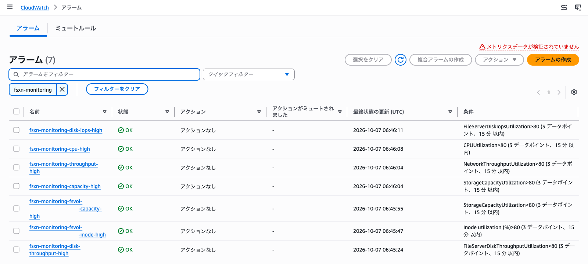

The 7 alarms are the 2 parity alarms (`capacity-high`, `throughput-high`), the 3 opt-in file-server alarms (`cpu-high`, `disk-iops-high`, `disk-throughput-high`) and the 2 per-volume alarms (`fsvol-…-capacity-high`, `fsvol-…-inode-high`). The Actions column reads "no actions" (アクションなし), because no `notification_email` was set. The condition column shows greater than 80 for 3 datapoints within 15 minutes. The last-state-update column shows every alarm reaching OK between 06:45:24Z and 06:46:11Z, shortly after the first apply. The console notice at the top right of the list (メトリクスデータが検証されていません, "metric data not verified") was not investigated.

> **Display fix note**
>
> The first capture of this dashboard, before the fix, showed four widgets drawing their raw input metrics on the same axis as the converted series. That is the defect described in the dashboard display note under [Findings](#findings). The dashboard image above was captured after the fix was applied to the same deployment.

The images do not show SNS notification (no email was set), an ALARM state on this deployment, or second-generation and multi-HA-pair file systems.

---

## Terraform Custom-Metrics Module Run on 2026-10-08

On 2026-10-08 (UTC), the Terraform module `terraform/fsxn-ontap-custom-metrics/` (phase T2) was applied to a first-generation `SINGLE_AZ_1` FSx for ONTAP file system with one HA pair, with both collectors on and a 1-minute poll. This is a sample run on one file system. The SnapMirror relationship ran between two test volumes in the same SVM on that file system, because the file system already had the documented maximum number of SVMs and a destination SVM could not be created (see [Environment and Deployment (T2 Run)](#environment-and-deployment-t2-run)). SnapMirror between two SVMs and between two file systems (cluster peering, polling the destination file system across clusters) remains unverified.

Both collectors published every series listed in the module README, and the values matched what ONTAP returned. The SnapMirror unhealthy alarm went OK → ALARM → OK when a failed manual transfer made ONTAP report the relationship as unhealthy and a later transfer made it healthy again. The lag alarm went OK → ALARM → OK as lag grew past the 300-second test threshold and an update transfer reset it. Both heartbeat alarms went to ALARM before the first poll and to OK after it. One planned expectation did not hold: an uninitialized relationship was expected to count as unhealthy, but ONTAP 9.18.1P6 reported it as `healthy: true`, and the collector published that value (F1). No defect was found in the module code, and no code was changed.

| Item | Value |
|------|-------|
| Verification date | 2026-10-08T01:00Z to 03:11Z (UTC), including a pause of about 30 minutes for an SSO sign-in (01:11Z to 01:42Z) |
| Verification environment | Test environment (`ap-northeast-1`), sample run with one SVM, two test volumes, one qtree with a tree quota, and one SnapMirror relationship inside that SVM |
| Scope | Module deployment, both collectors, the heartbeat, Lambda-errors and DLQ alarms, qtree series against the ONTAP quota report, the SnapMirror unhealthy and lag alarm transitions, and cleanup. ONTAP REST calls were made from a bastion host to prepare the test objects, drive the relationship, and read state back |
| Result | 12 of 15 checks passed. 1 expectation not met (S1, F1), 1 step rejected by a service limit (M1), and cleanup done with 2 volume recovery-queue entries left in place (M6) |

These values come from one run on one first-generation, single-HA-pair file system, at a 1-minute poll interval and a 300-second lag threshold chosen for the test. They show that the collectors read real ONTAP responses and that the alarms evaluate the published series. They do not show behavior between two file systems, at the default 5-minute interval, at scale, or on second-generation or multi-HA-pair file systems.

### Environment and Deployment (T2 Run)

| Item | Value |
|------|-------|
| AWS Region | `ap-northeast-1` |
| File system | `fs-0123456789abcdef0` (placeholder), `SINGLE_AZ_1` (first generation), 1 HA pair, 128 MBps, 1024 GiB SSD |
| ONTAP version | NetApp Release 9.18.1P6 |
| SVM | `<svm-name>` (placeholder, `svm-0123456789abcdef0`), one of the 6 SVMs on the file system |
| Source revision | `5b9b4ce` on the module's feature branch, before merge. No code was changed for or after the run |
| Terraform / providers | Terraform v1.15.8, `hashicorp/aws` 6.67.0 and `hashicorp/archive` 2.8.1 from the lock file of `examples/basic/` |
| Test volumes | `t2_sm_src`: RW, 1024 MiB, UNIX security style, snapshot policy none, tiering policy `NONE`. `t2_sm_dst`: DP, 1024 MiB, tiering policy `NONE`. Both created with `aws fsx create-volume` and deleted with `SkipFinalBackup=true` |
| Qtree and quota | Qtree `t2_qt` in `t2_sm_src` with a tree quota rule, hard limit 104857600 bytes (100 MiB); quotas on |
| SnapMirror relationship | `<svm-name>:t2_sm_src` → `<svm-name>:t2_sm_dst`, policy `MirrorAllSnapshots` (async), no transfer schedule. Source and destination in the same SVM; no SVM peer was created |
| ONTAP user for the poller | `t2-metrics-ro`, application `http`, role `fsxadmin-readonly`, cluster scope, created with `POST /api/security/accounts`. Its credentials in a Secrets Manager secret as `{"username": ..., "password": ...}`, encrypted with the default key `aws/secretsmanager` |
| Lambda placement and routes | The file system's subnet, which has no NAT gateway. Configured routes, inferred rather than traced (see the network path note below): `PutMetricData` through the module's `monitoring` interface endpoint, Secrets Manager through an existing interface endpoint in the VPC |
| Deployer | AWS IAM Identity Center (SSO) session with administrator access |

The original procedure first attempted to create a destination SVM. At 01:02:26Z `aws fsx create-storage-virtual-machine` returned `ServiceLimitExceeded`: the file system already had 6 SVMs, which the [SVM limit table](https://docs.aws.amazon.com/fsx/latest/ONTAPGuide/managing-svms.html) lists as the maximum for one HA pair at 128 MBps. Nothing was created. With approval, the destination DP volume was placed in the same SVM as the source, with no destination SVM and no SVM peer.

The module was called from a scratch root configuration with a relative local `source` (see F2) and these inputs. `notification_email` was not set, so no SNS topic was created.

```hcl
name_prefix                      = "fsxn-t2check"
file_system_id                   = "fs-0123456789abcdef0"
ontap_management_ip              = "<management-ip>"
ontap_credentials_secret_arn     = "arn:aws:secretsmanager:ap-northeast-1:123456789012:secret:fsxn-t2-ontap-readonly-XXXXXX"
vpc_id                           = "vpc-0123456789abcdef0"
subnet_ids                       = ["subnet-0123456789abcdef0"]
create_monitoring_endpoint       = true
create_secretsmanager_endpoint   = false
aws_api_egress_cidr_blocks       = ["<vpc-cidr>"]
qtree_svm_name                   = "<svm-name>"
poll_interval_minutes            = 1
snapmirror_lag_threshold_seconds = 300
log_retention_days               = 1
tags                             = { Purpose = "t2-live-verification" }
```

`terraform plan` reported 23 to add, including the `monitoring` endpoint, the endpoint security group, the egress rule for the VPC CIDR, and 7 alarms; no Secrets Manager endpoint and no SNS topic. `terraform apply` added 23 resources. The longest were the Lambda function (2 minutes 20 seconds, for the VPC attachment), the DLQ (1 minute 32 seconds), and the `monitoring` endpoint (45 seconds). Reserved concurrency 1 was accepted; the account had enough unreserved concurrency.

> **Security note**
>
> The file system's security group is a pre-existing test-environment setting that allows all inbound traffic from `0.0.0.0/0`, and the existing Secrets Manager endpoint uses the same group. No ingress rule was therefore added for the Lambda security group, and the README's ingress-rule step and revoke-before-destroy step were not exercised. The SVM's `default` export policy allows `0.0.0.0/0` read/write, and the qtree data write used it without a change. Neither is a recommended setting. The module's own Lambda security group allowed egress only to the management IP (`/32`) and the VPC CIDR.

### Check Results (T2 Run)

| # | Check | Result | Time (UTC) |
|---|-------|--------|------------|
| M0 | Pre-checks: identity, file system, SVMs, VPC endpoints, security groups, ONTAP read-only baseline | ✅ PASS. The default `GET /api/snapmirror/relationships` view (what the collector reads) returned 0 records; the source-side view (`list_destinations_only=true`) held 3 pre-existing FSxN_OnPre relationships, left untouched. 0 volume recovery-queue entries, no `t2*` account or volume | From 01:00:04Z, before M1 |
| M1 | Create a destination SVM | ⛔ `ServiceLimitExceeded` (6 SVMs, the documented maximum at 128 MBps). Nothing created; the relationship moved into one SVM | 01:02:26Z |
| M2 | Test volumes, qtree, 100 MiB tree quota, read-only ONTAP user, secret | ✅ PASS. One DP-volume request was rejected (`BadRequest`: junction path, storage efficiency, snapshot policy and security style cannot be set on a DP volume) and retried without those parameters. As `t2-metrics-ro`, the cluster, SnapMirror and quota-report `GET`s returned 200 | 01:07:34Z → 01:09:32Z |
| M3 | `terraform init -lockfile=readonly`, `validate`, `plan` | ✅ PASS. 23 to add, after two retries: an absolute-path `source` (F2) and an expired SSO token | 01:42:21Z |
| M4 | `terraform apply` | ✅ PASS. 23 added | 01:42:45Z → 01:46:50Z |
| M5 | Heartbeat alarms: ALARM before the first poll, OK after it | ✅ PASS | 01:44:37Z, 01:45:46Z → 01:47:37Z, 01:47:46Z |
| S1 | Uninitialized relationship → `SnapMirrorUnhealthyCount` 1, `snapmirror-unhealthy` ALARM | ❌ Expectation not met. ONTAP reported `healthy: true`; the collector published healthy 1 and count 0, and the alarm stayed OK (F1) | 01:48:40Z → 01:50:55Z |
| S2 | Initialize → healthy 1, count 0, lag series appear | ✅ PASS. First lag datum 22 s | 01:52:31Z → 01:53:52Z |
| S3 | Lag past 300 s without a schedule → `snapmirror-lag-high` ALARM | ✅ PASS | 01:58:52Z |
| S4 | Update transfer → lag drops, lag alarm OK | ✅ PASS. 682 → 23 s; OK at 02:09:52Z, ALARM again at 02:10:52Z because nothing schedules transfers | 02:04:30Z → 02:10:52Z |
| S1b | Substitute for S1: failed manual transfer → unhealthy; recovering transfer → healthy; unhealthy alarm OK → ALARM → OK | ✅ PASS | 02:12:56Z → 02:27:52Z |
| S5-1 | Qtree series against the ONTAP quota report | ✅ PASS. 40.1641% (42115072 / 104857600) | From 02:03Z |
| S5-2 | Published series and dimension names against the README tables and cost formulas | ✅ PASS. 6 series in each namespace | 02:29Z → 02:30Z |
| S5-3 | Lambda errors and throttles, ONTAP authentication errors, DLQ | ✅ PASS. Errors 0, Throttles 0 over 43 invocations, no HTTP 401 or 403, DLQ 0 | 02:29Z → 02:30Z |
| M6 | Cleanup, with re-read | ⚠️ Done with exceptions. All 23 Terraform-managed resources, the test SnapMirror relationship, both test volumes, the qtree, the quota rule, and the ONTAP user were removed. Three classes of artifacts remain (see [Cleanup](#cleanup-t2-run)): 2 volume recovery-queue entries, left in place because a purge is irreversible and was not approved; the secret, scheduled for deletion after a 7-day recovery window; and the 12 custom metric series, under CloudWatch retention | 02:32:26Z → 03:10:54Z |

At the deployed commit, the offline checks also passed: `pytest` on `shared/lambda/ontap_metrics/tests` (45 passed) and `make terraform` (exit 0; `terraform test` 15 passed and 43 passed for the two modules).

### Alarm State Transitions (T2 Run)

From the alarm history (`StateUpdate`) and alarm state reads, UTC. Every alarm name starts with `fsxn-t2check-`. The time in brackets in a state reason is the start of the 300-second window CloudWatch evaluated.

| Alarm | Transition | Time | Values in the state reason |
|-------|-----------|------|----------------------------|
| `snapmirror-heartbeat` | First evaluation → ALARM | 01:44:37Z | No datapoints for 2 periods, missing data treated as breaching |
| `qtree-heartbeat` | First evaluation → ALARM | 01:45:46Z | Same as above |
| `dlq-depth` | First evaluation → OK | 01:45:52Z | Missing data treated as not breaching |
| `snapmirror-heartbeat` | ALARM → OK | 01:47:37Z | After the first poll |
| `qtree-heartbeat` | ALARM → OK | 01:47:46Z | 1 datapoint [1.0], not less than 1.0 |
| `qtree-quota-high` | INSUFFICIENT_DATA → OK | 01:47:47Z | 0.0 |
| `lambda-errors` | INSUFFICIENT_DATA → OK | 01:47:50Z | 0.0 |
| `snapmirror-unhealthy` | INSUFFICIENT_DATA → OK | 01:47:52Z | 0.0, no relationship yet |
| `snapmirror-lag-high` | INSUFFICIENT_DATA → OK | 01:53:52Z | 22.0 (01:48), not > 300 |
| `snapmirror-lag-high` | OK → ALARM | 01:58:52Z | 322.0 (01:53), > 300 |
| `snapmirror-lag-high` | ALARM → OK | 02:09:52Z | 263.0 (02:04), not > 300 |
| `snapmirror-lag-high` | OK → ALARM | 02:10:52Z | 323.0 (02:05), > 300 |
| `snapmirror-unhealthy` | OK → ALARM | 02:19:52Z | 2 datapoints, 1.0 (02:14) and 1.0 (02:09), > 0 |
| `snapmirror-unhealthy` | ALARM → OK | 02:27:52Z | 0.0 (02:22), not > 0 |
| `snapmirror-lag-high` | ALARM → OK | 02:27:52Z | 275.0, not > 300 |
| `snapmirror-lag-high` | OK → ALARM | 02:28:52Z | 335.0, > 300 |

The alarm history shows each alarm evaluated every minute over the last 300 seconds, not on 5-minute boundaries. The lag alarm reached ALARM 57 seconds after the first datum above the threshold was published (322 s at 01:57:55Z). It returned to OK 5 minutes 7 seconds after the update transfer ended, because the 300-second window had to stop containing the pre-update maximum (682 s at 02:03) before the Maximum dropped. The unhealthy alarm reached ALARM 5 minutes 58 seconds after the first unhealthy datum (02:13:54Z), as expected for 2 evaluation periods of 300 seconds, and returned to OK 5 minutes 38 seconds after the recovering transfer. With no transfer schedule, the lag alarm fired again each time lag passed 300 seconds after a transfer.

### Observed Metrics (T2 Run)

SnapMirror series by the minute of the datum. Per-relationship series carry `FileSystemId`, `SourcePath=<svm-name>:t2_sm_src` and `DestinationPath=<svm-name>:t2_sm_dst`. In the values read, the per-relationship `SnapMirrorLagSeconds` matched `SnapMirrorLagSecondsMax`.

| Time (UTC) | Relationship state read from ONTAP | `SnapMirrorRelationshipHealthy` | `SnapMirrorUnhealthyCount` | `SnapMirrorLagSecondsMax` (s) |
|------------|------------------------------------|:---:|:---:|-------------------------------|
| 01:46–01:47 | No relationship | No series | 0 | Not published |
| 01:48–01:50 | `uninitialized`, `healthy: true`, no `lag_time` | 1 | 0 | Not published |
| 01:52 | `snapmirrored` after the initialize at 01:52:31Z, `lag_time` PT10S | 1 | 0 | 22 |
| 01:53–02:03 | No transfer | 1 | 0 | 82, 142, … 322 (01:57) … 682 (02:03), +60 per poll |
| 02:04 | Update transfer, 43074608 bytes in 13 seconds | 1 | 0 | 23 |
| 02:05–02:12 | No transfer | 1 | 0 | 83 … 263 (02:08), 323 (02:09) … |
| 02:13–02:21 | Failed transfer: `transfer.state: failed`, `healthy: false`, 2 `unhealthy_reason` codes | 0 | 1 | Kept growing, 1043 at 02:21 |
| 02:22 on | Recovering transfer at 02:22:14Z, `healthy: true` | 1 | 0 | 35 at 02:22 |

`SnapMirrorRelationshipsTruncated` was 0 on every poll. The failed transfer was a manual transfer request naming a source snapshot that does not exist; ONTAP returned the reason codes 6619937 (failed to create the snapshot) and 6619987 (the source volume does not have that snapshot). While the relationship was unhealthy, every poll logged a warning with the relationship UUID, `state=snapmirrored`, both paths and both reason codes, the log format the module README describes.

Qtree series for `t2_qt` (`SvmName`, `VolumeName=t2_sm_src`, `QtreeName=t2_qt`): `QtreeQuotaLimitBytes` was 104857600 on every poll. `QtreeQuotaUsedBytes` was 0 until 02:02 and 42115072 from 02:03, after a 40 MiB file was written over a temporary NFSv3 mount from the bastion host at 02:03:41Z. ONTAP's quota report 20 seconds later showed the same 42115072 bytes used. `QtreeQuotaUsedPercent` went from 0 to 40.1641 (42115072 / 104857600 × 100), and `QtreeQuotaUsedPercentMax` matched it, because only one qtree had a hard limit. The volume's default tree record (empty qtree name, no hard limit) got no series, as documented. `QtreeQuotaReportTruncated` was 0.

`list-metrics` returned 6 series in each namespace. `FSxONTAP/SnapMirror`: `CollectorSucceeded`, `SnapMirrorLagSeconds`, `SnapMirrorLagSecondsMax`, `SnapMirrorRelationshipHealthy`, `SnapMirrorRelationshipsTruncated`, `SnapMirrorUnhealthyCount`. `FSxONTAP/Qtree`: `CollectorSucceeded`, `QtreeQuotaLimitBytes`, `QtreeQuotaReportTruncated`, `QtreeQuotaUsedBytes`, `QtreeQuotaUsedPercent`, `QtreeQuotaUsedPercentMax`. That matches the README cost formulas (SnapMirror 2 × 1 + 3 + 1 = 6, qtree 3 × 1 + 2 + 1 = 6), and the dimension names match the README tables. `CollectorSucceeded` was 1 for both collectors on every poll.

The function ran 43 times. Every run logged a qtree success line and a SnapMirror summary line; there were 0 `[ERROR]` lines, 0 HTTP 401 or 403, 0 tracebacks and 0 timeouts. Durations were 327–568 ms, and the maximum memory used was 96 MB of 256 MB. The read-only user `t2-metrics-ro` served every request the collectors make. Each run also logged two urllib3 `InsecureRequestWarning` lines, and the cold start logged the module's TLS warning, because `ca_cert_path` was empty, as documented. The log line `Found credentials in environment variables.` is boto3 reading the Lambda role's credentials, not ONTAP credentials.

> **Network path note**
>
> The Secrets Manager call went through the existing endpoint and `PutMetricData` through the module's `monitoring` endpoint. This is inferred, not traced: the subnet has no NAT gateway, the Lambda security group allowed egress only to the VPC CIDR and the management IP, and the datapoints arrived.

### Findings (T2 Run)

| # | Finding | Kind | Effect on this record |
|---|---------|------|-----------------------|
| F1 | On ONTAP 9.18.1P6 an uninitialized relationship reported `healthy: true` with no `lag_time`. The module therefore published healthy 1, count 0, and no lag datum: `snapmirror-unhealthy` stayed OK and `snapmirror-lag-high` stayed INSUFFICIENT_DATA | ONTAP behavior, observed once; a monitoring gap, not a module code defect | A relationship that is created but never initialized raises neither SnapMirror alarm. Closing that gap needs a new signal, for example a count of `uninitialized` relationships or treating a missing `lag_time` as breaching. That changes the metric catalog and is a design decision, so it is recorded and not implemented. S1b replaced S1 as the unhealthy test |
| F2 | With `source` given as an absolute local path, `terraform init` installed the module as a `file://` source and a symlink under `.terraform/modules/`, and `archive_file` then resolved `${path.module}/../../shared` against the symlink and failed (`lstat .terraform/shared/lambda/ontap_metrics/__pycache__: no such file or directory`). A relative local path worked | Terraform behavior with this module's path to `shared/`, observed once | Use a relative local path, the git source, or the archive URL. The sources the README documents were not affected |
| F3 | `terraform destroy` spent 22 minutes 3 seconds on `aws_security_group.lambda`, waiting for the Lambda network interface to be released after the function was deleted | Observed once | Allow for a destroy of this length. The README had said the duration was not measured |
| F4 | At a 1-minute poll and a 300-second period: unhealthy alarm ALARM 5 minutes 58 seconds after the first unhealthy datum and OK 5 minutes 38 seconds after the recovering transfer; lag alarm ALARM 57 seconds after the first datum above the threshold and OK 5 minutes 7 seconds after the update | CloudWatch evaluation, observed once | Inferred: after a transfer, the lag alarm returns to OK within up to one alarm period plus up to one minute. Without a transfer schedule it fires again one threshold later |
| F5 | Both heartbeat alarms went to ALARM about 1.5–2.5 minutes after creation, before the first poll, and to OK within about 1 minute of the first poll | Documented behavior, now observed | An ALARM right after `apply` is expected. Inferred, not exercised: with `notification_email` set, it would send an ALARM and then an OK notification |
| F6 | The first-generation 128 MBps file system already had 6 SVMs, the documented maximum, so no destination SVM could be created | Service limit, documented | The relationship ran inside one SVM. SVM peering and SnapMirror between two file systems remain unverified |

No defect was found in the module code, and no code was changed.

### Cleanup (T2 Run)

| Step | Result | Time (UTC) |
|------|--------|------------|
| Check for rules outside Terraform that reference the Lambda security group | Only the module's own endpoint security group referenced it; nothing to revoke | Before 02:32:26Z |
| First `terraform destroy -auto-approve` | Exit 1: SSO `GetRoleCredentials` timed out on the network. Nothing was destroyed and the state still held every resource | 02:32:26Z → 02:34:02Z |
| Second `terraform destroy -auto-approve` | Exit 0, 23 destroyed. `aws_security_group.lambda` took 22 minutes 3 seconds (F3), the `monitoring` endpoint 2 minutes 51 seconds, the DLQ 51 seconds | 02:43:57Z → 03:06:28Z |
| Delete the SnapMirror relationship (with release on the source) | HTTP 200. Destination view 0 records; the source-side list shows only the 3 relationships of another SVM that existed before the run; 0 snapshots left on `t2_sm_src` | 03:06:49Z |
| Delete the secret | `delete-secret --recovery-window-in-days 7`; deletion date 2026-10-15T03:07:27Z | 03:07:27Z |
| Delete both test volumes (`SkipFinalBackup=true`) | Both `VolumeNotFound` by 03:10:03Z | 03:09:08Z → 03:10:03Z |
| Delete the ONTAP user `t2-metrics-ro` | HTTP 200; 0 `t2*` accounts | 03:09:24Z |
| Local and bastion temporary files | `terraform.tfvars`, state and plan files removed; the password scratch files and the bastion's one-time key and mount point removed earlier | After the second destroy |
| Re-read | AWS: 0 state entries. No alarm, log group, function, rule, queue, IAM role or security group with prefix `fsxn-t2check`; no network interface with either former module security group; no `monitoring` endpoint; the 5 pre-existing VPC endpoints available; both test volumes `VolumeNotFound`; 6 SVMs. ONTAP: the default `GET /api/snapmirror/relationships` view returned 0 records (the t2 relationship gone); the source-side view (`list_destinations_only=true`) held the 3 pre-existing FSxN_OnPre relationships only, the 2 pre-existing SVM peers only, 0 `t2*` volumes, qtrees and accounts, 0 quota rules in `<svm-name>`; the bastion paths are gone | 03:10:49Z → 03:10:54Z |

Three items remain by design:

- 2 volume recovery-queue entries, for `t2_sm_dst` and `t2_sm_src`, were not purged, because a purge is irreversible and was not approved. The aggregate had 282951680 bytes (about 270 MiB) less available than at the baseline. Inferred, not verified: that space is held by the two entries until ONTAP expires them. The default retention was not checked in this run; see [Return to OK and the Volume Recovery Queue](#return-to-ok-and-the-volume-recovery-queue) for the documented behavior.
- The secret is scheduled for deletion on 2026-10-15T03:07:27Z (7-day recovery window).
- The 12 custom metric series (6 per namespace) hold datapoints from 01:46Z to about 02:44Z. Custom metrics cannot be deleted; the data ages out under CloudWatch retention, which was not re-checked in this run.

No export policy, IAM outside the module, or security group outside the module was changed. The other NFS mounts on the bastion host and the pre-existing SnapMirror relationships and SVM peers were not touched.

### What Remains Unverified (T2 Run)

| Item | Status | Reason |
|------|--------|--------|
| SnapMirror between two SVMs (SVM peering) and between two file systems (cluster peering, polling the destination file system across clusters) | Not run | F6: the relationship ran inside one SVM |
| An alarm for a relationship that was never initialized | Not covered by the module | F1 |
| Second-generation file systems and file systems with more than one HA pair | Not run | The test file system is first generation with one HA pair |
| Deployer IAM policy `examples/basic/iam-policy.json` | Not verified | The deployer had administrator access |
| README ingress-rule step and revoke-before-destroy step (the `DependencyViolation` path) | Not exercised | The file system's security group already allowed all inbound traffic |
| `qtree-quota-high` ALARM transition | Not driven | Usage reached 40.16%, below the threshold of 85 |
| Heartbeat failure path (`CollectorSucceeded` = 0) | Not driven | Both collectors succeeded on every poll |
| SVM-scoped ONTAP user | Not tested | The user was cluster-scoped `fsxadmin-readonly` |
| `security login create` over SSH from the README prerequisites | Not run | The user was created with `POST /api/security/accounts` |
| SNS notification delivery | Not exercised | `notification_email` was not set |
| TLS verification with a CA certificate (`ca_cert_path`, `ca_cert_layer_arn`) | Not run | Both were empty |
| Default 5-minute poll and default 10800-second lag threshold | Not run | 1 minute and 300 seconds were used to shorten the test |
| More than one page, the `snapmirror_max_relationships` cap, a truncation value of 1 | Not exercised | 1 relationship and 2 quota records; truncation 0 |
| Throttling under reserved concurrency 1 | Not observed | Throttles 0 |
| Release of the 2 recovery-queue entries when they expire | Not observed | The entries were left in place |

### Judgment (T2 Run)

| Item | Value |
|------|-------|
| Judgment | ✅ Within the scope of this sample run, on one first-generation, single-HA-pair file system with a SnapMirror relationship inside one SVM: deployment, both collectors' series against real ONTAP responses, the heartbeat ALARM before the first poll and OK after it, the SnapMirror unhealthy alarm OK → ALARM → OK, and the lag alarm OK → ALARM → OK are verified. An uninitialized relationship raises no alarm (F1). SnapMirror between two SVMs and between two file systems, and the `qtree-quota-high` ALARM path, are unverified |
| Passing checks | 12 of 15 (M0, M2–M5, S2, S3, S4, S1b, S5-1–S5-3) |
| Expectation not met | 1 of 15 (S1), from F1 |
| Rejected by a service limit | 1 of 15 (M1), from F6 |
| Done with remaining items | 1 of 15 (M6): 2 recovery-queue entries, the scheduled secret deletion, and the custom metric data |
| Module code defects | None found. No code was changed |

---

## Terraform Log-Alarm Module Run on 2026-10-09

On 2026-10-09 (UTC), the Terraform module `terraform/fsxn-log-alarm/` (phase T3) was applied to a CloudWatch Logs log group that received the admin audit log of one first-generation `SINGLE_AZ_1` FSx for ONTAP file system with one HA pair, through the syslog VPC endpoint path of [syslog-vpce-setup-guide.md](syslog-vpce-setup-guide.md). This is a sample run on one file system. Audit lines were produced by REST calls from a bastion host against a test volume and a test ONTAP user.

The mechanism works: every alarm left INSUFFICIENT_DATA, and `bulk-delete`, `privileged-operations` and `failed-access-rest403` went OK → ALARM → OK when matching lines arrived. Each OK → ALARM transition came 13 to 74 seconds after the first matching operation, depending on where in the 60-second period the line fell; the return to OK followed in a later minute without a match (per-alarm values under [Alarm State Transitions](#alarm-state-transitions-t3-run)). Two default patterns shipped at `50f1f18` did not fit real ONTAP audit lines. The `privileged-operations` default `"admin"` matched 5,150 of 5,156 lines and its alarm stayed in ALARM on the file system's own management traffic, written by the user `fsx-control-plane` (F3). The `failed-access` default `?"Failure" ?"denied" ?"DENIED"` matched none of the 5 real authorization failures (F4). The `autosize-fail` recipe was not fired by a real `wafl.vol.autoSize.fail` event: it was checked only with `aws logs test-metric-filter` against a line built from the NetApp EMS reference, and the audit destination does not carry EMS events at all (F8). On the delivery side, port 6514 with TLS delivered nothing (F6), the shared syslog template on `main` failed to create its stack (F1), and the first operation after an idle period of about 4–5 minutes was lost three times (F9). The run used the module at `50f1f18` unchanged. After the run, the `failed-access`, `privileged-operations` and `bulk-delete` defaults were replaced with patterns checked against the captured lines (F3–F5).

| Item | Value |
|------|-------|
| Verification date | 2026-10-09, before 03:55Z to 05:31Z (UTC), including a pause for screenshots after 04:48:55Z |
| Verification environment | Test environment (`ap-northeast-1`), sample run with one test volume, one test ONTAP user, and one syslog VPC endpoint |
| Scope | Syslog delivery path (template, syslog configuration, ONTAP audit destination), audit-line shapes, `test-metric-filter` on the real lines, module deployment, alarm transitions for 6 detections, and cleanup. EMS delivery to syslog was not in scope |
| Result | 10 of 18 checks passed and 1 passed after a workaround (M1, F1). 4 expectations not met (M3, A5, A6, D1), 1 check with mixed results (M7), 1 not run (A7), and cleanup done with 2 items left in place (M9) |

These results come from one run on one first-generation, single-HA-pair file system, with a 60-second period and thresholds chosen for the test. They show that the module's metric filters and alarms evaluate real audit lines delivered through the syslog VPC endpoint. They do not show EMS delivery, behavior at the module's default 300-second period, behavior under load, or behavior on second-generation or multi-HA-pair file systems.

### Environment and Deployment (T3 Run)

| Item | Value |
|------|-------|
| AWS Region | `ap-northeast-1` |
| File system | `fs-0123456789abcdef0` (placeholder), `SINGLE_AZ_1` (first generation), 1 HA pair |
| ONTAP version | NetApp Release 9.18.1P6 |
| SVM | `<svm-name>` (placeholder), an existing SVM on the file system |
| Source revision | `50f1f18` on `main` (after #123). The module was not changed for the run; three default patterns were replaced after it (F3–F5) |
| Terraform / provider | Terraform v1.15.8, `hashicorp/aws` 6.67.0 |
| Syslog path | Stack `fsxn-t3check-syslog` from a scratch copy of `shared/templates/syslog-vpce-cloudwatch.yaml` whose only change was the security group description (F1). `LogRetentionDays=1`, log group `/syslog/fsxn-t3check-audit`, one interface endpoint in the file system's subnet. No `syslog-logs` endpoint existed in the VPC before the run, so there was no private DNS conflict |
| Syslog configuration | `shared/scripts/create-syslog-configuration.py` (HTTP 200) |
| ONTAP audit destination | Endpoint IP, port 1514, `tcp_unencrypted`, facility `local7`. A second destination on port 6514 with `tcp_encrypted` delivered nothing (M3) |
| Audit settings | `GET /api/security/audit` returned `cli: false`, `http: false`, `ontapi: false`, so GET requests were not audited. Left unchanged |
| Test volume | `t3_audit_vol`, 1024 MiB, junction path `/t3_audit_vol`, storage efficiency off, snapshot policy none, tiering policy `NONE`. Created with `aws fsx create-volume` (the call needs `JunctionPath`; the first call without it returned `BadRequest`) |
| ONTAP users | `fsxadmin` for change operations. `t3-alarm-ro`, application `http`, password authentication, role `fsxadmin-readonly`, to produce authorization failures. Its password in a Secrets Manager secret, with a resource policy on that secret only that let the bastion host's role read it |
| Deployer | AWS IAM Identity Center (SSO) session with administrator access |

The module was called from a scratch root configuration with `source` set to the absolute local path of the module at `50f1f18`, with these detections. Every detection used a 60-second period, 1 of 1 evaluation periods, and threshold 0 unless noted. `notification_email` and `alarm_sns_topic_arn` were not set, so no SNS topic was created and no alarm had actions.

```hcl
log_group_name = "/syslog/fsxn-t3check-audit"
name_prefix    = "fsxn-t3check"
detections = {
  autosize-fail            = { pattern = "\"wafl.vol.autoSize.fail\"", threshold = 0, period_seconds = 60 }
  failed-access            = { pattern = "?\"Failure\" ?\"denied\" ?\"DENIED\"", threshold = 0, period_seconds = 60 }
  failed-access-rest403    = { pattern = "\"Error: not authorized\"", threshold = 0, period_seconds = 60 }
  bulk-delete              = { pattern = "?\"DELETE\" ?\"delete\" ?\"remove\"", threshold = 2, period_seconds = 60 }
  privileged-operations    = { pattern = "\"fsxadmin:fsxadmin\" -\"Pending\"", threshold = 0, period_seconds = 60 }
  privileged-default-admin = { pattern = "\"admin\"", threshold = 0, period_seconds = 60 }
}
tags = { Purpose = "t3-live-verification" }
```

`autosize-fail`, `failed-access` and `bulk-delete` keep the patterns shipped at `50f1f18`. `failed-access-rest403` and `privileged-operations` use the patterns proposed from the `test-metric-filter` results (M7); they are now the `failed-access` and `privileged-operations` defaults. `privileged-default-admin` keeps the shipped `privileged-operations` pattern `"admin"` to observe F3 on a live alarm. `unauthorized-access` was left out because its shipped pattern is a placeholder path.

### Check Results (T3 Run)

| # | Check | Result | Time (UTC) |
|---|-------|--------|------------|
| M0 | Pre-checks: identity, file system, VPC endpoints, ONTAP audit destinations and audit settings | ✅ PASS. No `syslog-logs` endpoint in the VPC. ONTAP held 2 stale audit destinations (ports 1514 and 6514) pointing at the IP of an endpoint that no longer existed; recorded and, with approval, deleted at cleanup. Why they were left behind was not determined | Before 03:55:03Z |
| M1 | Deploy `shared/templates/syslog-vpce-cloudwatch.yaml` as shipped | ⚠️ Passed after a workaround. The stack failed (`ROLLBACK_COMPLETE`): EC2 rejected the security group description (F1). The rollback left the log group behind because it is retained; it was deleted before the retry. The scratch copy with the one-line fix created the stack in about 1 minute 40 seconds | 03:55:03Z; 03:59:43Z → 04:01:21Z |
| M2 | Create the syslog configuration | ✅ PASS. HTTP 200. `aws logs list-syslog-configurations` listed it (F2) | 04:02:30Z |
| M3 | ONTAP destination on port 6514, `tcp_encrypted`, addressed by the endpoint IP | ❌ Not met. `POST` returned 201 (ONTAP set `verify_server: true`), but the log group had 0 streams after about 4 minutes and no EMS event reported an error. The hostname form was rejected because the cluster cannot resolve it (F6) | 04:03:40Z → 04:07:36Z |
| M4 | ONTAP destination on port 1514, `tcp_unencrypted` | ✅ PASS. The first line, the `Pending` line of this very `POST`, arrived about 3 seconds later | 04:07:33Z → 04:07:36Z |
| M5 | Test volume, test ONTAP user, secret | ✅ PASS with a deviation. `fsxadmin` could not assign the role `readonly` (403, "not authorized for that command"); the cluster's roles were `autosupport`, `backup`, `fsxadmin`, `fsxadmin-readonly`, `none`, `snaplock`. The user was created with `fsxadmin-readonly` | 04:05:54Z → 04:14:09Z |
| M6 | Audit-line shapes for a change operation, a GET, a 403, and a 401 | ✅ PASS (observed). Each change operation wrote 2 lines, `:: Pending` and then `:: Success:` or `:: Error: not authorized for that command`. A GET wrote no line. A 401 from a wrong password wrote no line within 40 seconds. The account-create line showed the password as `***` | 04:09:36Z → 04:18:07Z |
| M7 | `aws logs test-metric-filter` with the shipped patterns on the real lines | ⚠️ Mixed. `bulk-delete` matched the REST deletes (2 lines each); `privileged-operations` `"admin"` matched almost every line (F3); `failed-access` matched no real failure (F4); `autosize-fail` matched no real line, as expected without EMS; `unauthorized-access` matched nothing, as expected for its placeholder path. Details in [Filter-Pattern Matches on Real Lines](#filter-pattern-matches-on-real-lines-t3-run) | 04:17Z, 04:20Z, and before 05:24:40Z |
| M8 | `terraform apply` | ✅ PASS. 12 added (6 metric filters, 6 alarms) in about 3 seconds; all alarms INSUFFICIENT_DATA at 04:23:18Z | 04:23:15Z |
| A1 | Every alarm leaves INSUFFICIENT_DATA | ✅ PASS. 5 to OK, `privileged-default-admin` to ALARM | 04:24:09Z → 04:25:05Z |
| A2 | `privileged-operations` (`"fsxadmin:fsxadmin" -"Pending"`): OK → ALARM on an `fsxadmin` change operation, then OK | ✅ PASS, three times | 04:37:19Z, 04:40:19Z, 04:48:19Z |
| A3 | `bulk-delete` (shipped pattern, threshold 2): OK → ALARM → OK on 4 REST qtree deletes | ✅ PASS. 4 matching lines in the 04:39 minute and 4 in the 04:40 minute | 04:40:05Z → 04:42:05Z |
| A4 | `failed-access-rest403` (`"Error: not authorized"`): OK → ALARM → OK on 3 rejected requests | ✅ PASS. 3 lines in the 04:41 minute | 04:42:09Z → 04:44:09Z |
| A5 | `failed-access` (shipped pattern) reaches ALARM on the same 3 rejected requests | ❌ Not met. The metric was 0 in every minute that had a datapoint (F4) | 04:41Z on |
| A6 | `privileged-default-admin` (shipped `"admin"`) stays OK while no operator acts | ❌ Not met. ALARM from 04:24:53Z, on the `fsx-control-plane` management traffic, and still ALARM at the screenshot (F3) | 04:24:53Z on |
| A7 | `autosize-fail` reaches ALARM on a real `wafl.vol.autoSize.fail` event | ⏭️ Not run. No real event was produced, and the audit destination carries no EMS events (F8). The alarm stayed OK | — |
| D1 | Every change operation reaches the log group | ❌ Not met. The first operation after the endpoint closed an idle connection was lost, three times (F9) | 04:26:37Z, 04:35:39Z, 04:47:21Z |
| M9 | Cleanup, with re-read | ⚠️ Done with 2 items left in place (see [Cleanup (T3 Run)](#cleanup-t3-run)) | 05:24:40Z → 05:31Z |

### Delivery Path Observations (T3 Run)

Port 6514 with `tcp_encrypted` delivered nothing while it was the only destination pointing at the new endpoint (04:03:40Z to 04:07:33Z), and it contributed nothing afterwards: while both destinations existed, the 780 events of 04:07–04:17 had 780 distinct ONTAP sequence numbers, so no line arrived twice. ONTAP set `verify_server: true` on that destination and wrote no EMS event about a failed session. Inferred, not confirmed: ONTAP's server-certificate check cannot match an IP address against the endpoint certificate's name, and the hostname form is not available because the cluster cannot resolve `syslog-logs.<region>.amazonaws.com`. Port 1514 with `tcp_unencrypted` delivered within about 3 seconds.

The log group received about 80 lines per minute of management activity that no operator started (user `fsx-control-plane`, role `admin`), for example `set -privilege diagnostic`, `security login unlock -username diag`, `POST /api/private/cli` and `Logging out`. That traffic is what the shipped `"admin"` pattern matches (F3).

Three operations never reached the log group. Each returned HTTP 201. For the first, ONTAP's own `GET /api/security/audit/messages` listed the operation on node `-02` (its `Pending` and success entries, at 04:26:37Z); that listing was not read for the other two. Each was the first operation after a `SyslogConnectionsClosed` datapoint, and node `-02`'s forwarded lines stopped before each one:

| Operation | Lost (UTC) | `SyslogConnectionsClosed` before it | Next operation, delivered |
|-----------|-----------|--------------------------------------|---------------------------|
| `fsxadmin` POST qtree `t3_qt1` | 04:26:37Z | 04:22 (node `-02`'s last line 04:17:53Z) | Not driven; node `-02` reconnected at 04:27 on its next line |
| `fsxadmin` POST qtree `t3_qt2` | 04:35:39Z | 04:32 (node `-02`'s last line 04:27:56Z) | POST `t3_qt3`, 20 seconds later, delivered at 04:36:05Z |
| `fsxadmin` POST qtree `t3_qt6` | 04:47:21Z | 04:46 (node `-02`'s last line 04:41:13Z) | POST `t3_qt7`, 18 seconds later, delivered |

`SyslogConnectionsEstablished` and `SyslogConnectionsClosed` in `AWS/Logs` have no dimension; `SyslogMessagesReceived` is per log group and had no datapoint for 04:26. The account had no `SyslogMessagesDropped` series, so no AWS metric counted the losses. Inferred from the metric timing, not confirmed: the endpoint closes a connection that has been idle for about 4–5 minutes, ONTAP notices only on its next write, and the line written into the closed connection is lost. That each closed connection was node `-02`'s is part of the same inference, drawn from the dimensionless `SyslogConnectionsClosed` times falling 4–5 minutes after node `-02`'s last line. Node `-01` did not show this in the run; `fsx-control-plane` activity reached it every 5–6 minutes.

### Alarm State Transitions (T3 Run)

From the alarm history (`StateUpdate`), UTC. Every alarm name starts with `fsxn-t3check-`.

| Alarm | Transition | Time | Cause |
|-------|-----------|------|-------|
| `failed-access-rest403` | INSUFFICIENT_DATA → OK | 04:24:09Z | First evaluation, no match |
| `privileged-operations` | INSUFFICIENT_DATA → OK | 04:24:19Z | Same |
| `failed-access` | INSUFFICIENT_DATA → OK | 04:24:39Z | Same |
| `autosize-fail` | INSUFFICIENT_DATA → OK | 04:24:50Z | Same |
| `privileged-default-admin` | INSUFFICIENT_DATA → ALARM | 04:24:53Z | `fsx-control-plane` lines; no operator activity |
| `bulk-delete` | INSUFFICIENT_DATA → OK | 04:25:05Z | First evaluation, no match |
| `privileged-operations` | OK → ALARM | 04:37:19Z | `Success:` line of POST `t3_qt3`, ingested 04:36:05Z |
| `privileged-operations` | ALARM → OK | 04:38:19Z | No match in the next minute |
| `bulk-delete` | OK → ALARM | 04:40:05Z | 4 lines in the 04:39 minute, > 2 |
| `privileged-operations` | OK → ALARM | 04:40:19Z | Qtree creates and deletes |
| `bulk-delete` | ALARM → OK | 04:42:05Z | 0 lines |
| `failed-access-rest403` | OK → ALARM | 04:42:09Z | 3 lines in the 04:41 minute |
| `privileged-operations` | ALARM → OK | 04:42:19Z | 0 lines |
| `failed-access-rest403` | ALARM → OK | 04:44:09Z | 0 lines |
| `privileged-operations` | OK → ALARM | 04:48:19Z | `Success:` line of POST `t3_qt7` |

`failed-access` and `autosize-fail` stayed OK. `privileged-default-admin` did not leave ALARM.

Time from the first matching operation to the state change, per OK → ALARM transition. The ingestion time was read only for the `t3_qt3` line; the other rows are measured from the time of the REST call, which is a few seconds earlier than ingestion.

| Alarm | Operation (UTC) | OK → ALARM (UTC) | Elapsed |
|-------|-----------------|------------------|---------|
| `privileged-operations` | `t3_qt3` `Success:` line ingested 04:36:05Z | 04:37:19Z | 74 s |
| `privileged-operations` | POST `t3_qt4` and `t3_qt5` at 04:39:17Z | 04:40:19Z | about 62 s |
| `bulk-delete` | First qtree DELETE at 04:39:52Z | 04:40:05Z | about 13 s |
| `failed-access-rest403` | Rejected POSTs from 04:41:04Z to 04:41:13Z | 04:42:09Z | about 56–65 s |
| `privileged-operations` | POST `t3_qt7` at 04:47:39Z | 04:48:19Z | about 40 s |

Each alarm's state changes fell on the same second of the minute throughout the run (`bulk-delete` at :05, `failed-access-rest403` at :09, `privileged-operations` at :19), so the elapsed time depends on how close to that second the line arrived.

Sum per 60 seconds in `FSxONTAP/LogAlarm`, minutes with a datapoint (`get-metric-data`, read before 04:47Z):

| Metric | Values |
|--------|--------|
| `fsxn-t3check-failed-access-rest403` | 04:41 = 3, else 0 |
| `fsxn-t3check-bulk-delete` | 04:39 = 4, 04:40 = 4, else 0 |
| `fsxn-t3check-privileged-operations` | 04:36 = 1, 04:39 = 4, 04:40 = 2, else 0 |
| `fsxn-t3check-privileged-default-admin` | 04:23 = 5, 04:27 = 387, 04:28 = 5, 04:33 = 376, 04:36 = 2, 04:37 = 16, 04:38 = 16, 04:39 = 368, 04:40 = 4, 04:41 = 87, 04:43 = 5, 04:44 = 373 |
| `fsxn-t3check-failed-access`, `fsxn-t3check-autosize-fail` | 0 in every minute with a datapoint |

A minute in which no line arrived at all has no datapoint: `default_value = "0"` is emitted only when lines arrive and none matches. `privileged-default-admin` stayed in ALARM across gaps of 1–4 minutes. Inferred, not checked: CloudWatch reused the last breaching datapoint over the sparse data, so `treat_missing_data = "notBreaching"` did not bring it back to OK.


The alarm list was captured during the pause, after `privileged-operations` returned to OK at 04:49:19Z. `privileged-default-admin` shows ALARM with its last state update at 04:24:53Z.


The four graphs below were rendered with CloudWatch `GetMetricWidgetImage` for 04:20Z to 04:52Z. Minutes without a datapoint are left blank, and lines join only consecutive minutes that have datapoints, so a datapoint between two gaps shows as an isolated dot.

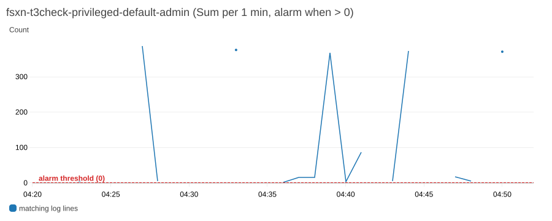

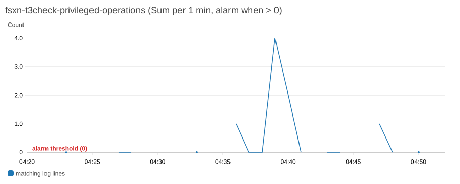

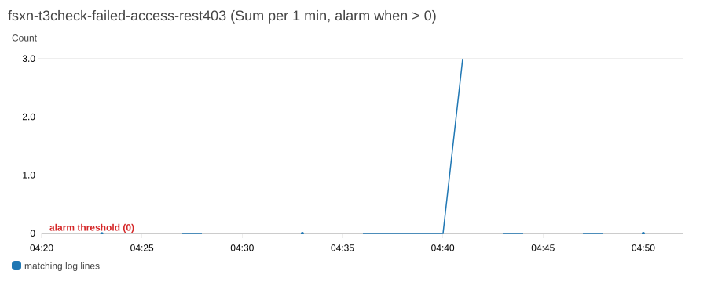

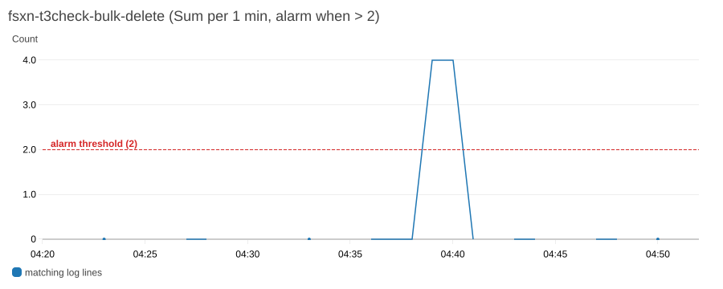

The privileged-operations graph shows 1 at 04:47, from the delivered POST `t3_qt7`; the `get-metric-data` read above was taken before that minute.

### Filter-Pattern Matches on Real Lines (T3 Run)

`aws logs test-metric-filter` was run on the captured lines: 780 events from 04:07Z to 04:17Z first, then all 5,156 events from 04:07Z to 05:24Z. Matching is by substring, so `"admin"` also matches inside `fsxadmin` and `fsxadmin-readonly`.

| Pattern | Role | Matches in 5,156 real lines | What matched |
|---------|------|----------------------------|--------------|
| `"admin"` | Shipped `privileged-operations` | 5,150 | Every line except 6 `autosupport` console lines |
| `?"Failure" ?"denied" ?"DENIED"` | Shipped `failed-access` | 0 | None, including the 5 real 403 lines |
| `?"DELETE" ?"delete" ?"remove"` | Shipped `bulk-delete` | 10 | 5 REST qtree deletes × 2 lines (`Pending`, `Success:`) |
| `"wafl.vol.autoSize.fail"` | Shipped `autosize-fail` | 0 | No real EMS line exists in this log group (F8) |
| `"/vol/data/confidential"` | Shipped `unauthorized-access` (placeholder path) | 0 | — |
| `"fsxadmin:fsxadmin" -"Pending"` | Candidate for `privileged-operations`; now its default | 13 | 1 line per completed `fsxadmin` change operation, success or error |
| `"Error: not authorized"` | Candidate for `failed-access`; now its default | 5 | All 5 real 403 lines, 1 per rejected request |
| `"DELETE /api/" -"Pending"` | Candidate for `bulk-delete` | 5 | 1 line per completed REST delete. ONTAP CLI deletes were not exercised |
| `%DELETE.*::\sSuccess\|DELETE.*::\sError\|delete.*::\sSuccess\|delete.*::\sError\|remove.*::\sSuccess\|remove.*::\sError%` | Candidate for `bulk-delete`; now its default | 5 | 1 line per completed REST delete, from the same three terms as the shipped pattern on the result line only |
| `?"DELETE" ?"delete" ?"remove" -"Pending"` | Tried for `bulk-delete` | 2,945 | Not usable: the exclusion acted as one more OR alternative |

The last two rows were added after the run, between 07:15Z and 07:22Z on 2026-10-09, with `aws logs test-metric-filter` in batches of up to 50 events; the three shipped `failed-access`, `bulk-delete` and `privileged-operations` patterns and the other three candidates were re-run then and gave the same counts. At 07:59Z the five defaults as now shipped were run once more on the same inputs: `autosize-fail` and `unauthorized-access` matched 0 of the 5,156 lines, and the other three gave the counts in the table. The inputs were the 5,156 captured lines and 13 masked sample lines kept with the raw evidence: 4 `fsxadmin` qtree lines, 1 rejected `fsxadmin` account create, 2 `t3-alarm-ro` lines (`Pending` and the rejection), 4 `fsx-control-plane` lines, and the 2 constructed EMS lines. On the 13 masked lines, `"Error: not authorized"` matched the 2 rejections; `"fsxadmin:fsxadmin" -"Pending"` matched the 3 `fsxadmin` result lines (qtree create, qtree delete, rejected account create); the regular-expression pattern matched only the qtree delete's `Success:` line; the shipped `?"Failure" ?"denied" ?"DENIED"` matched none, and `"admin"` matched 11. A form of the regular expression with parentheses and spaces was rejected by the API (`InvalidParameterException`, "Invalid character(s) in term"); the [filter pattern syntax](https://docs.aws.amazon.com/AmazonCloudWatch/latest/logs/FilterAndPatternSyntax.html) supports neither. On constructed lines, not captured ones, the regular expression also matched an ONTAP CLI-style `volume delete ... :: Success` line and a rejected `DELETE`, and did not match `:: Pending` lines or a completed `POST`.

`?"Error:" ?"Failure" ?"denied" ?"DENIED"` was also tried on the first 780 lines. It matched the 2 real 403 lines in that window but 72 lines in total: 68 `fsx-control-plane` lines ending `Error: Failed to convert Windows name to SID ...` and 2 ending `Error: entry doesn't exist`. `"Error:"` alone is therefore too broad on this file system.

For `autosize-fail`, two lines were built from the `Unable to grow volume ...` message text in the [ONTAP 9.18.1 EMS reference](https://docs.netapp.com/us-en/ontap-ems-9181/wafl-vol-events.html). The pattern matched the line whose header carries the event name in brackets, by analogy with the captured `[kern_audit:info:...]` header, and did not match the line with the message text only. The header layout is an assumption; no real EMS line was captured.


![Log events of the syslog stream filtered with ?"DELETE /api/storage/qtrees" ?"Error: not authorized": each REST qtree delete by fsxadmin appears twice, ending ":: Pending" and ":: Success:", and the two rejected requests, POST /api/security/accounts by fsxadmin and POST /api/storage/qtrees by t3-alarm-ro with role fsxadmin-readonly, end with ":: Error: not authorized for that command". File system IDs, source IP addresses and ports, volume UUIDs, the SVM name and the stream name are masked in gray](../screenshots/cloudwatch-log-alarm/04-log-events-error-and-delete.png)

The log events image shows the two facts behind F4 and F5: a rejected request ends `:: Error: not authorized for that command` and contains none of `Failure`, `denied` or `DENIED`, and every change operation appears twice.

### Findings (T3 Run)

| # | Finding | Kind | Effect on this record |
|---|---------|------|-----------------------|
| F1 | `shared/templates/syslog-vpce-cloudwatch.yaml` on `main` cannot create its stack. `GroupDescription` uses the YAML folded scalar `>`, which keeps a trailing newline (confirmed by loading the template with PyYAML), and EC2 rejects the newline ("Invalid security group description"). Changing `>` to `>-` fixes it | Template defect, observed once; not in the T3 module | The run used a scratch copy with that change. The template on `main` was not changed in this run (`shared/` needs approval); the fix is a follow-up. The setup guide now states the workaround. Fixed afterwards: the template uses `>-`, guarded by `scripts/tests/test_cfn_security_group_description.py` |
| F2 | The guide and `create-syslog-configuration.py` say the AWS CLI and boto3 have no syslog-configuration commands (June 2026). AWS CLI 2.36.5 ran `list-syslog-configurations` and `delete-syslog-configuration` during the run. `put-syslog-configuration` was not run against AWS. Called locally without arguments at 07:14Z, after the cleanup, the same CLI asked for `--log-group-identifier`, while a made-up subcommand name returned "Found invalid choice" and suggested `put-syslog-configuration`, so the command exists in 2.36.5. The Python SDK model in botocore 1.43.36 defines all three operations. The script also sends `allowAllSyslogSources`, which that model does not define; the call still returned 200 | Documentation out of date | The setup guide now names the CLI commands. The script was not changed |
| F3 | The shipped `privileged-operations` pattern `"admin"` matched 5,150 of 5,156 real lines: every `fsx-control-plane` line carries role `admin`, and every `fsxadmin` line contains `admin`. With threshold 0 its alarm was in ALARM from the first evaluation without any operator activity | Module default-pattern defect, observed | The default shipped at `50f1f18` is not a usable detection on an FSx for ONTAP audit log group. Fixed after the run: the default is now `"fsxadmin:fsxadmin" -"Pending"` (replace with the `<user>:<role>` token to watch), which gave 1 line per completed operation and drove A2 |
| F4 | The shipped `failed-access` pattern matched none of the 5 real authorization failures, which end `:: Error: not authorized for that command`. One wrong-password REST request (HTTP 401) wrote no audit line within 40 seconds | Module default-pattern defect, observed | The default shipped at `50f1f18` cannot fire on REST authorization failures. Fixed after the run: the default is now `"Error: not authorized"`, which caught all 5 and drove A4. It counts authorization denials only. No failed login was seen in this log, so neither pattern is known to detect password guessing |
| F5 | Each change operation is logged twice, `:: Pending` and then the result. Thresholds therefore count lines, not operations: `bulk-delete`'s threshold of 50 corresponds to about 25 REST deletes. `"delete"` and `"remove"` also match any command text that contains them | Log format, observed | Changed after the run: the `bulk-delete` default now matches the same three terms on the result line only, a regular-expression pattern that gave 1 line per completed REST delete in `test-metric-filter`. It has not run on a live alarm, CLI deletes were not captured, and it counts toward the CloudWatch Logs limit of 5 regular-expression filter patterns per log group |
| F6 | Port 6514 with `tcp_encrypted`, addressed by the endpoint IP, delivered nothing in about 4 minutes; ONTAP reported no error. The hostname form was rejected with "Cannot resolve the destination host" | Delivery path, observed once | The guide presented 6514 as the production setting without a caveat; it now says what happened here. Cause (TLS name check against an IP) is inferred |
| F7 | The ONTAP 9.18.1 EMS reference lists `wafl.vol.autoSize.fail` with severity NOTICE. `docs/en/ems-detection-capabilities.md`, the module README and the module comment say `error` | Documentation, from the reference; not observed on a real event | Not changed in this run; a follow-up across those files |
| F8 | The audit destination carries only the command history (`kern_audit`). EMS events such as `wafl.vol.autoSize.fail` reach syslog only through a separate EMS notification destination, which neither the setup guide nor the module README sets up | Scope gap in the docs | The `autosize-fail` recipe matches only if EMS is routed into the same log group. No EMS destination was created (not in the approved plan), so this is unverified |
| F9 | After a node's connection had been idle for about 4–5 minutes, the first operation on that node was lost; ONTAP reconnected for the next one. Observed 3 times. No EMS event and no `AWS/Logs` drop metric recorded the loss | Delivery path, observed 3 times; mechanism inferred from metric timing | A single privileged operation on a quiet node can go undetected. The setup guide now describes this. A mitigation was not tested |

No defect was found in resource creation or alarm wiring: the filters, alarms, metric names and namespaces worked as written. Two shipped default patterns were defects (F3, F4), and `bulk-delete` counted about 2 lines per operation (F5). All three defaults were replaced after the run in `terraform/fsxn-log-alarm/variables.tf`, with offline tests that assert them. The CloudFormation template `shared/templates/cloudwatch-log-alarm.yaml` ships the same `failed-access-attempts` query (`/Failure/`, `/denied/`, `/DENIED/`) and the same `bulk-delete-operations` terms, and its `specific-user-activity` example user is `admin`. It was not changed in this run. Changed afterwards: its three queries were translated from the patterns above into Logs Insights filters, which have not been run as LogAlarm queries (`unverified`); see [Built-in Detection Queries](cloudwatch-log-alarm.md#built-in-detection-queries).

### Cleanup (T3 Run)

| Step | Result | Time (UTC) |
|------|--------|------------|
| `terraform destroy` | 12 destroyed (6 alarms, 6 metric filters). Re-read: 0 alarms and 0 metric filters with prefix `fsxn-t3check` | 05:24:40Z |
| Delete the ONTAP audit destinations | The run's 6514 and 1514 destinations and the 2 stale ones from M0, each HTTP 200. Re-read: 0 records | 05:24:56Z |
| Delete the test qtrees | ONTAP had reused qtree IDs after the earlier deletes; 3 deletes returned 200 after 2 returned 404 for IDs that did not exist. Re-read: only the volume's default qtree (ID 0) | After 05:24:56Z |
| Delete the ONTAP user `t3-alarm-ro` | HTTP 200; re-read 0 records | After 05:24:56Z |
| Delete the test volume (`SkipFinalBackup=true`) | `VolumeNotFound` at the 05:31Z re-read | 05:26:33Z |
| Delete the secret | `delete-secret` with a 7-day recovery window; deletion date 2026-10-16T05:26:35Z. Its resource policy goes with it | 05:26:35Z |
| Delete the syslog configuration | `aws logs delete-syslog-configuration`, exit 0. The listing then showed only an older configuration for an endpoint that no longer exists, which existed before the run and was not touched | Before 05:27:37Z |
| Delete the stack `fsxn-t3check-syslog` | `DELETE_COMPLETE` in about 3.5 minutes. Re-read: the stack, the endpoint and the security group return not found | 05:27:37Z → 05:31:08Z |
| Delete the log group `/syslog/fsxn-t3check-audit` | Exit 0; it is retained by the stack, so it was deleted by hand | 05:31Z |
| Local files | State, plan and `.terraform/` removed; no `terraform.tfvars` was used | After the destroy |

Two items remain:

- The secret is scheduled for deletion on 2026-10-16T05:26:35Z.
- The volume recovery-queue entry for `t3_audit_vol` was listed and not purged, because a purge is irreversible and was not approved. ONTAP removes it when its retention expires; the retention was not checked in this run.

An older log group and its syslog configuration, both from before this run, were not touched. The custom metrics in `FSxONTAP/LogAlarm` cannot be deleted and age out under CloudWatch retention.

### What Remains Unverified (T3 Run)

| Item | Status | Reason |
|------|--------|--------|
| `autosize-fail` on a real `wafl.vol.autoSize.fail` event | Not run | No EMS destination to syslog was created (F8); the pattern was checked only on a constructed line |
| EMS notification destination to the syslog endpoint, and the real EMS line format | Not run | Not in the approved plan (F8) |
| Port 6514 with TLS | Not delivered | F6; a CA or hostname setup that would let ONTAP verify the endpoint was not tried |
| Shipped default period of 300 seconds and the shipped thresholds and N/M values | Not run | 60 seconds and 1 of 1 were used to shorten the test |
| `unauthorized-access` (file-path pattern) | Not run | Its shipped pattern is a placeholder, and file access is not in the admin audit log |
| ONTAP CLI (SSH) change and delete operations | Not exercised | Only REST calls were made. The new `bulk-delete` default matched a constructed CLI-style line, not a captured one |
| New `bulk-delete` default on a live alarm | Not run | Chosen after the run; checked with `test-metric-filter` only |
| SNS notification on ALARM and OK | Not exercised | No topic was configured |
| Deployer IAM policy `examples/basic/iam-policy.json` | Not verified | The deployer had administrator access |
| Mitigation for F9, for example a periodic write that keeps each node's connection active | Not tested | — |
| Why ONTAP held 2 stale destinations before the run | Not determined | They were recorded and deleted |
| Second-generation and multi-HA-pair file systems | Not run | The test file system is first generation with one HA pair |

### Judgment (T3 Run)

| Item | Value |
|------|-------|
| Judgment | ⚠️ Within the scope of this sample run, on one first-generation, single-HA-pair file system with delivery on port 1514: deployment, every alarm leaving INSUFFICIENT_DATA, and OK → ALARM → OK on real audit lines for `bulk-delete`, `privileged-operations` and `failed-access-rest403` are verified. Two default patterns shipped at `50f1f18` did not work on real lines (F3, F4) and were replaced after the run. `autosize-fail` on a real EMS event, EMS delivery, and TLS delivery are unverified |
| Passing checks | 10 of 18 (M0, M2, M4, M5, M6, M8, A1–A4) |
| Passed after a workaround | 1 of 18 (M1), from F1 |
| Expectation not met | 4 of 18 (M3 from F6, A5 from F4, A6 from F3, D1 from F9) |
| Mixed results | 1 of 18 (M7) |
| Not run | 1 of 18 (A7), from F8 |
| Done with remaining items | 1 of 18 (M9): the scheduled secret deletion and 1 recovery-queue entry |
| Module defects | Resource creation and alarm wiring: none found. Default patterns: 2 defects (F3, F4), fixed after the run; `bulk-delete` changed to count 1 line per operation (F5). The CloudFormation template's equivalent queries were not changed in this run; they were translated afterwards and are `unverified` |

---

## Terraform SSD Auto-Increase Module Run on 2026-10-09

On 2026-10-09 (UTC), the Terraform module `terraform/fsxn-ssd-auto-increase/` (phase T4) was applied to one first-generation `SINGLE_AZ_1` FSx for ONTAP file system with one HA pair and 1,024 GiB of SSD storage. This is a sample run on one file system. The run covered the reversible rows of the [T4 test plan](capacity-automation-t4-design.md#test-plan): `notify_only` on a real OK → ALARM transition, `approve`, the alarm-OK branch, and `auto` behind an explicit IAM deny on `fsx:UpdateFileSystem`, with the lock, fail-closed and archive checks around it. The one real +10% increase was not run.

The guards behaved as designed. The function made 4 `UpdateFileSystem` calls in the whole run, all from `auto` behind the deny, all `AccessDenied`, and at most one per evaluation that reached the call. The file system stayed at 1,024 GiB with the same 4 administrative actions as before the run. Every archive object read back was in compliance mode with a retain-until date of its creation time plus 1 day, and a delete with the bypass header by an administrator was refused. No module code defect was found and no code was changed. Three behaviours differ from the design's wording: a report on every evaluation that makes no call (F1), `lock_state` `calling` in an `archive_retention_unproven` report (F2), and no decision-log line or archive object for a run stopped by the `blocked` latch (F3).

| Item | Value |
|------|-------|
| Verification date | 2026-10-09, 11:55:59Z to 12:57:03Z (UTC), including a pause for screenshots from 12:40Z to 12:55Z |
| Verification environment | Test environment (`ap-northeast-1`), sample run on one file system, with a disposable compliance-mode archive bucket with a 1-day default retention |
| Scope | Deployment, IAM policy simulation of the execution role, `notify_only`, `approve`, the alarm-OK branch, `auto` behind an explicit IAM deny (the `blocked` latch, an operator clear, two concurrent invocations, lease contention and expiry), deploy-time and run-time fail-closed checks, archive retention, and cleanup. The real increase, test plan row (e), was not in scope |
| Result | 18 of 20 checks passed. 1 passed with a deviation in how it was reached (L3). Cleanup (M1) is done with the archive bucket left in place until its retention passes |

These results come from one run on one first-generation, single-HA-pair file system at 3.5% SSD utilization, with a ceiling set to the minimum valid increase (1,127 GiB) and a trigger threshold lowered to 3% for the test. They show that the guards stop or allow a call as designed on that file system. They do not show a real increase, the cooldown after one, second-generation or multi-HA-pair behaviour, or behaviour over weeks of hourly re-evaluation.

### Environment and Deployment (T4 Run)

| Item | Value |
|------|-------|
| AWS Region | `ap-northeast-1` |
| File system | `fs-0123456789abcdef0` (placeholder), `SINGLE_AZ_1` (first generation), 1 HA pair, `StorageCapacity` 1,024 GiB, throughput 128 MBps, SSD IOPS `AUTOMATIC` (3,072) |
| ONTAP version | 9.18.1. T4 calls AWS APIs only, so no ONTAP API was used |
| Baseline | SSD `StorageCapacityUtilization` 3.50–3.51% over the hour before the run. 4 `FILE_SYSTEM_UPDATE` administrative actions, all `COMPLETED`, the latest at 2026-10-06T05:18:26Z, more than 6 hours before the run, so no cooldown applied |
| Source revision | The module as merged in `9aa4224` (#124), unchanged during the run |
| Terraform / providers | Terraform v1.15.8, `hashicorp/aws` 6.67.0, `hashicorp/archive` 2.8.1 |
| Archive bucket | Created by the account owner before the run, outside Terraform, as the module expects: Object Lock enabled, default retention `COMPLIANCE` 1 day, versioning enabled, all four public access block settings on, SSE-S3 |
| Report reader | A scratch SQS queue (SQS-managed encryption) subscribed with raw delivery to the module's notification topic, so reports could be read without an email subscription |
| Deployer | AWS IAM Identity Center (SSO) session with administrator access |

Ceiling arithmetic: `ceil(1024 × 1.10)` = 1,127 GiB, and `increase_percent = 10` gives the same value, so with the ceiling at 1,127 GiB the only target the function can compute is the minimum valid increase. The module was called from a scratch root configuration:

```hcl
module "ssd_auto_increase" {
  source = "<local path to terraform/fsxn-ssd-auto-increase>"

  name_prefix                         = "fsxn-t4-verify"
  file_system_id                      = "fs-0123456789abcdef0"
  max_storage_capacity_gib            = 1127
  mode                                = var.mode                      # notify_only, approve, auto
  trigger_threshold_percent           = var.trigger_threshold_percent # 80, lowered to 3 for the test
  increase_percent                    = 10
  log_retention_days                  = 1
  decision_archive_bucket             = "<archive-bucket-name>"
  decision_archive_required_mode      = var.required_mode                       # COMPLIANCE
  decision_archive_min_retention_days = var.decision_archive_min_retention_days # 1, set to 2 in V2
  tags = { Purpose = "t4-live-verification" }
}
```

The first `terraform plan` proposed 18 resources: the module's 15 and the 3 for the report queue. It created and changed no `aws_fsx_*` resource; the file system was only read through the data source. Each later plan changed only the trigger alarm or the function's environment, as listed in [Check Results](#check-results-t4-run).

The explicit deny, attached out of band as an inline policy on the execution role before any `auto` apply, and removed at cleanup after `mode` was back to `notify_only`:

```json
{"Version":"2012-10-17","Statement":[{"Sid":"T4VerifyDenyUpdateFileSystem","Effect":"Deny","Action":"fsx:UpdateFileSystem","Resource":"*"}]}
```

Terraform plans did not touch this policy, because the module's role defines no inline policy of that name.

### Check Results (T4 Run)

| # | Check | Result | Time (UTC) |
|---|-------|--------|------------|
| E1 | `terraform plan` and `apply`, `notify_only`, threshold 80 | ✅ PASS. 18 added, no `aws_fsx_*` change. The trigger alarm reached OK at 12:00:50Z | 11:59Z → 12:00:50Z |
| S1 | `aws iam simulate-principal-policy` on the deployed execution role | ✅ PASS. `fsx:UpdateFileSystem` `allowed` on the configured file system, `implicitDeny` on a fabricated file-system ARN and on another real file system in the account. `cloudwatch:DescribeAlarms` `allowed` on the trigger alarm, `implicitDeny` on another alarm. `s3:PutObject` `allowed` on the prefix, `implicitDeny` outside it. `s3:GetObjectRetention` and `s3:GetBucketObjectLockConfiguration` `allowed`. `s3:DeleteObject`, `s3:DeleteObjectVersion`, `s3:PutObjectRetention` and `s3:BypassGovernanceRetention` `implicitDeny`. `sns:Publish` `allowed` on the notification topic and `implicitDeny` on the trigger topic. `cloudwatch:GetMetricData` and `fsx:DescribeFileSystems` `allowed` on `*`. Identity policy only; no SCP or resource-policy context was passed | After E1 |
| N1 | Scheduled-event invocation with the alarm OK, before the bucket existed | ✅ PASS (fail-open as designed). Decision `alarm_not_in_alarm`; decision log `archive_result=write_failed`; the report named the `NoSuchBucket` gap; lock released; no `fsx:DescribeFileSystems` and no `UpdateFileSystem` by the function in CloudTrail | 12:02:11Z |
| N2 | Scheduled-event invocation with the alarm OK and the real bucket | ✅ PASS. Decision `alarm_not_in_alarm`, one decision log line and one archive object, no lock item left, no `UpdateFileSystem`. One report was sent (F1) | 12:10:54Z |
| N3 | `notify_only` end to end on a real OK → ALARM transition (threshold lowered to 3%, plan 0 added, 1 changed) | ✅ PASS. The alarm went to ALARM on real data 50 seconds after the update, with no `set-alarm-state`, and invoked the function once through the trigger topic. Decision `increase`, `mode=notify_only`, current 1,024, target 1,127, ceiling 1,127, cooldown clear, one archive object and one report. Lambda `Invocations` was 1 in that minute, so the report did not invoke the function again | 12:12:45Z → 12:13:37Z |
| N4 | `approve` (plan: only the function's `MODE` and fingerprint changed) | ✅ PASS. The report carried the computed `aws fsx update-file-system ... --storage-capacity 1127 --client-request-token <correlation-id>` command. It was not run. Lock released | 12:16:06Z |
| D0 | Explicit IAM deny in place before any `auto` apply | ✅ PASS. The simulation returned `explicitDeny` from the inline policy at 12:16:55Z and again 86 seconds later | 12:16:55Z → 12:18:21Z |
| V1 | Deploy-time fail-closed: `mode = auto` with `decision_archive_required_mode = GOVERNANCE` | ✅ PASS. `terraform plan` exited 1 with the precondition message `mode = auto requires decision_archive_required_mode = COMPLIANCE.`; nothing applied | 12:17:51Z |
| V2 | Run-time fail-closed: `auto` with `decision_archive_min_retention_days = 2` against the 1-day bucket | ✅ PASS. Decision `archive_retention_unproven`, "default retention is 1 day(s), required at least 2"; one decision log line, no archive object, one report, lock released, no call (F2) | 12:19:02Z |
| L1 | `auto` behind the deny, retention minimum back to 1 | ✅ PASS. One `UpdateFileSystem`, `AccessDenied` (explicit deny) in CloudTrail at 12:21:07Z. Archive: `1-decision.json` (intent) and `2-rejected.json` (`deterministic_rejection`, `AccessDeniedException`) under one correlation ID. 2 reports: the pre-call report and the `blocked` report. Lock item `blocked` with the error code and the fingerprint, `report_sent` true. `StorageCapacity` still 1,024 | 12:21:03Z |
| L2 | Next run while latched | ✅ PASS. `{"decision": "blocked"}`; no call, no report, lock item unchanged. Only the function's own log recorded the run (F3) | 12:22:00Z |
| L3 | Operator clear of the latch, then two concurrent asynchronous invocations | ⚠️ PASS with a deviation. The clear (`disposition = cleared` with evidence text, conditional on `state = blocked`) was applied by the first invocation, archived as `3-reconciled.json` under the original correlation ID, and followed by a re-evaluation that made one denied call and latched again. The second invocation hit the new latch and made no call. Lambda recorded `Throttles` 2 for that minute: reserved concurrency 1 serialized the pair, so the DynamoDB lock was not contended. At most one call came from the two invocations, as the test plan requires, but the "evaluation already running" path was reached in L4 instead | 12:23:26Z → 12:23:30Z |
| L4 | Valid lease held by another owner (a fake `evaluating` item, lease 600 s) | ✅ PASS. `{"decision": "evaluation_already_running"}`, item unchanged, no call | 12:28:11Z |
| L5 | Expired lease (`expires_at` set 60 s in the past) | ✅ PASS. The new evaluation took over, named the superseded owner in its pre-call report, ran every guard, made one denied call and latched `blocked` | 12:28:13Z |
| V3 | Run-time fail-closed: intent `PutObject` denied by a second inline deny on the archive bucket | ✅ PASS. Decision `archive_retention_unproven`, "intent write failed"; no archive object, lock released, one report, no call. The second deny was removed at 12:31:45Z | 12:29:27Z → 12:31:45Z |
| R1 | Retention of the archived versions | ✅ PASS for each version read (the alarm-OK, `notify_only` and L1 objects): `COMPLIANCE`, retain-until = creation time + 1 day. 12 versions and 0 delete markers at the end of the run | 12:10Z → 12:55Z |
| R2 | Delete of an archived version by the administrator, with `--bypass-governance-retention` | ✅ PASS (negative half only). Exit 254, "Access Denied because object protected by object lock"; `head-object` still showed the version in `COMPLIANCE` | Between V3 and L6 |
| L6 | Re-latch for the screenshots | ✅ PASS. One denied call, `blocked` | 12:32:58Z |
| X1 | `UpdateFileSystem` tally and file-system state | ✅ PASS. 4 CloudTrail events since 11:50Z, at 12:21:07Z (L1), 12:23:28Z (L3), 12:28:14Z (L5) and 12:33:00Z (L6), all `AccessDenied` from the function role with `requestParameters` null. None for N1–N4, V1–V3, L2, L4 or the second invocation of L3. `StorageCapacity` 1,024 GiB, `AVAILABLE`, the same 4 administrative actions | 12:35:03Z, re-checked at cleanup |
| M1 | Cleanup, with re-read | ✅ Done, with the archive bucket left in place (see [Cleanup](#cleanup-t4-run)) | 12:55Z → 12:57:03Z |

### Alarm State Transitions (T4 Run)

From the alarm history of `fsxn-t4-verify-ssd-utilization`, UTC.

| Time | Type | Detail |
|------|------|--------|
| 12:00:22Z | ConfigurationUpdate | Created, threshold 80% |
| 12:00:50Z | StateUpdate | INSUFFICIENT_DATA → OK |
| 12:12:45Z | ConfigurationUpdate | Threshold 3% |
| 12:13:35Z | StateUpdate | OK → ALARM, on real data at 3.51% |
| 12:13:36Z | Action | Published to the trigger topic |

The alarm stayed in ALARM for the rest of the run. Its return to OK was not observed: the threshold went back to 80% at 12:55Z and the alarm was destroyed at 12:57Z. Every later evaluation was started with `aws lambda invoke` and a scheduled-event payload; an invocation by the EventBridge schedule rule itself is not part of this record.

### Console Records (T4 Run)

The screenshots below were taken in the Japanese-language console during the pause. The console navigation bar and footer are cropped. File-system IDs, the AWS account ID, the archive bucket's name suffix, a CloudTrail access key ID, role IDs and the source IP address are masked in gray.


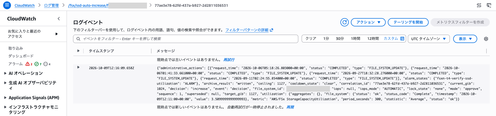


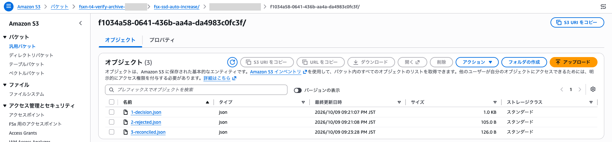

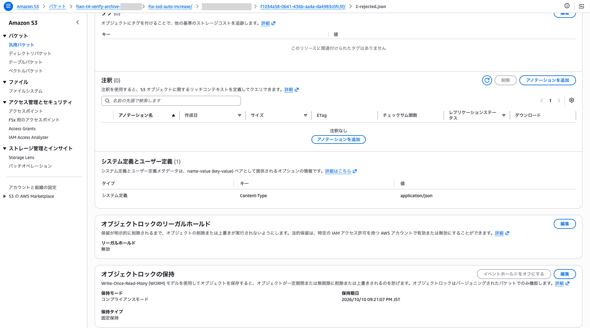

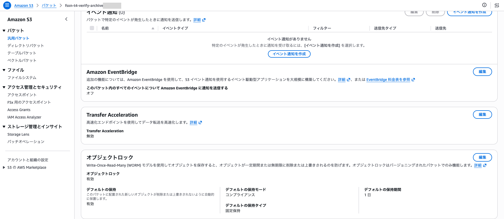

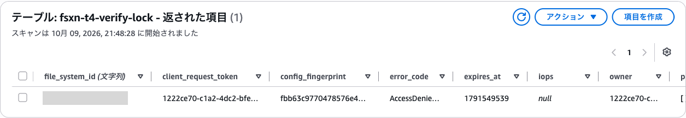


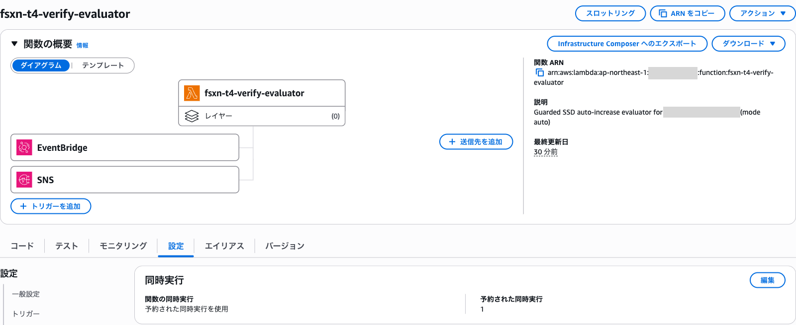

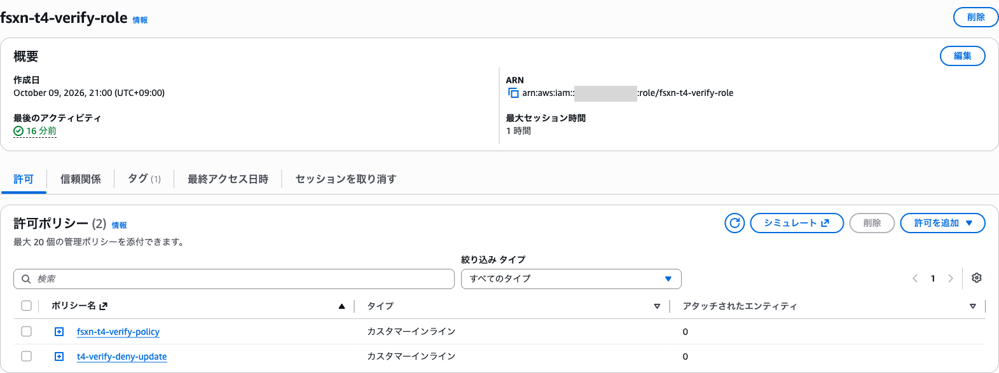

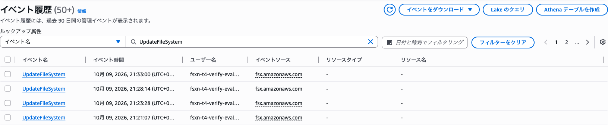


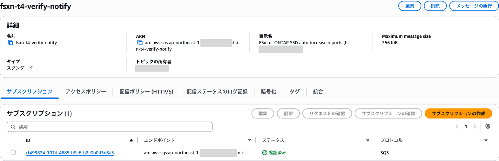

### Findings (T4 Run)

| # | Finding | Kind | Effect on this record |
|---|---------|------|-----------------------|
| F1 | Every evaluation that makes no call and ends through the common release path sends one SNS report: observed for `alarm_not_in_alarm` in N1 and N2, and by reading the handler also for `administrative_action_in_progress`, `cooldown_active` and `ceiling_reached`. With the default `rate(1 hour)` that is up to 24 reports a day while nothing happens. The design's report guard says "before the call and at each later state change" | Behaviour differs from the design wording; observed for the alarm-OK branch, `code-inspected` for the others. Noise only; no call is made | Not changed: reporting only on a state change would change what operators receive, which is a decision for the module owner. The module README now describes the hourly report |
| F2 | The `archive_retention_unproven` decision log line and report carry `"lock_state": "calling"` (V2, V3). The item never left `evaluating` and was released. The value is prefilled for `auto` before the archive check runs | Report content, observed twice | Not changed. The README says to read the decision, not `lock_state`, for this outcome |
| F3 | A run stopped by the `blocked` latch writes no decision log line and no archive object, only a line in the function's own log (L2, L3 second invocation). The design's lock-state table says it "logs `blocked`", and the decision-archive row expects every evaluation, including `blocked` decisions, to have its event sequence | Behaviour differs from the design wording, observed | The `blocked` decision itself is archived under the original correlation ID. Later latched runs are not, so this part of the decision-archive row is not met. The README now says where a latched run is recorded |
| F4 | CloudTrail records a call denied at authorization with `requestParameters` null, so the `ClientRequestToken` cannot be read from a denied event | AWS behaviour, observed 4 times | Whether CloudTrail shows the token for an accepted call stays `open` |
| F5 | CloudTrail shows the error code `AccessDenied`; the SDK raises `AccessDeniedException`. The function classifies the SDK code, so it latched as `deterministic_rejection` | Naming difference, observed | None. Read the function log or the archive, not only CloudTrail, to see the classification |
| F6 | Two asynchronous invocations started together were serialized by reserved concurrency 1: Lambda throttled the overlap and its asynchronous queue retried it | Lambda behaviour, observed once | The DynamoDB lock was exercised separately in L4 and L5 |

No defect was found in the module code or in its IAM policy for the paths run. The scoped Allow was shown by simulation only; the deny run shows that the call reached authorization, not that the Allow works, and the live positive control for it is the real increase. After the run, `scripts/tests/test_terraform_iam_policy.py` gained an offline check that a statement not registered as a no-resource-type action cannot put a scopable action on `Resource: "*"`.

### Cleanup (T4 Run)

| Step | Result | Time (UTC) |
|------|--------|------------|
| Apply the default variables | 0 added, 2 changed: alarm threshold 3% → 80%, `MODE` `auto` → `notify_only`. `MODE` read back as `notify_only` | 12:55Z |
| Remove the inline deny | `delete-role-policy`, after `MODE` was confirmed `notify_only`; only the module's policy remained. The S3 deny had been removed at 12:31:45Z | 12:55:32Z |
| `terraform destroy` | `plan -destroy` 18 to destroy, no `aws_fsx_*`; 18 destroyed; `terraform state list` empty | → 12:57:03Z |
| Re-read | Function, role, table, alarm, both topics, both queues, schedule rule and both log groups not found. The module retains none of its log groups | After 12:57:03Z |
| File system | `StorageCapacity` 1,024 GiB, `AVAILABLE`, the same 4 administrative actions as the baseline | After 12:57:03Z |
| CloudTrail | Still exactly the 4 `AccessDenied` `UpdateFileSystem` events of the run | After 12:57:03Z |

One item remains: the archive bucket, with 12 object versions and 0 delete markers. The latest retain-until date across the versions is 2026-10-10T12:33:00.194Z. Until then no version can be deleted, and so the bucket cannot be deleted. After it, the account owner deletes each version with `delete-object --version-id` and then the bucket with `delete-bucket`.

### What Remains Unverified (T4 Run)

| Item | Status | Reason |
|------|--------|--------|
| Real increase, test plan row (e): `accepted`, `capacity_available`, `terminal`, the request ID matched to CloudTrail, the lock released only after `terminal` | Not run | Irreversible on first generation; outside the approved scope. It is also the live positive control for the scoped Allow |
| Cooldown after a change | Unit tests only | No change was made, and the baseline's last change was more than 6 hours old |
| Second generation, `aggregate_names` alarms, more than one HA pair | Not run | The test file system is first generation with one HA pair |
| Email delivery of reports and the `approve` command | Not run | No email subscription; reports were read through SQS |
| Minimum IAM policy for the deploying identity (`examples/basic/iam-policy.json`) | Not verified | The deployer had administrator access |
| Archive control identity A (positive control on a bucket without Object Lock) and the positive half of identity B (bypass delete on a governance-mode bucket) | Not run | Only one disposable bucket was approved |
| `archive_retention_unproven` for a governance-mode bucket or a bucket without default retention at run time in `auto` | Not run | The deploy-time precondition (V1) and the shorter-period case (V2) were run instead |
| Clearing the latch by a configuration-fingerprint change | Unit tests only | The latch was cleared by an operator disposition (L3). Before V3 the item was deleted instead |
| Two invocations contending for the DynamoDB lock at the same time | Not observed | Reserved concurrency serialized them (F6); the lease paths were run one at a time (L4, L5) |
| Invocation by the EventBridge schedule rule, and the alarm's return to OK | Not observed | See [Alarm State Transitions](#alarm-state-transitions-t4-run) |
| `USER_PROVISIONED` IOPS, `ceiling_exceeds_service_maximum`, `iops_exceeds_maximum` | Unit tests only | The file system uses `AUTOMATIC` IOPS |

### Judgment (T4 Run)

| Item | Value |
|------|-------|
| Judgment | ✅ Within the scope of this sample run, on one first-generation, single-HA-pair file system: `notify_only` on a real alarm transition, `approve`, the alarm-OK branch, `auto` behind an explicit IAM deny with the `blocked` latch and an operator clear, at most one call per evaluation, lease contention and take-over, deploy-time and run-time fail-closed checks, and compliance-mode retention of the archived versions read are verified. No storage capacity changed. The real increase is unverified |
| Passing checks | 18 of 20 (E1, S1, N1–N4, D0, V1–V3, L1, L2, L4–L6, R1, R2, X1) |
| Passed with a deviation | 1 of 20 (L3), from F6 |
| Done with remaining items | 1 of 20 (M1): the archive bucket stays until 2026-10-10T12:33:00.194Z |
| T4 completion criteria | Not all met. The `notify_only`, `approve`, IAM-deny, policy-simulation, alarm-OK, concurrency and deploy-time validation rows pass. The decision-archive row is open: the positive controls for identities A and B were not run, and latched runs are not archived (F3) |
| Module code defects | None found. No code was changed. F1–F3 are differences from the design wording, recorded in the module README |

---

## Related Documents

- [Monitoring Design](monitoring-design.md): the dashboard template, the Terraform T1 module, and the qtree quota monitor, with confidence tiers that cite this record
- [AWS-Native Alternative Matrix](native-alternative-matrix.md): System Manager view → CloudWatch metric → template mapping
- [Terraform module: fsxn-monitoring-dashboard](../../terraform/fsxn-monitoring-dashboard/README.md): inputs, outputs, and verification status
- [Terraform module: fsxn-ontap-custom-metrics](../../terraform/fsxn-ontap-custom-metrics/README.md): the T2 qtree and SnapMirror poller, with its verification status
- [Terraform module: fsxn-log-alarm](../../terraform/fsxn-log-alarm/README.md): the T3 log-alarm module, with its verification status
- [Terraform module: fsxn-ssd-auto-increase](../../terraform/fsxn-ssd-auto-increase/README.md): the T4 guarded SSD auto-increase sample, with its verification status and operating procedures
- [T4 Guarded SSD Auto-Increase: Implementation Design](capacity-automation-t4-design.md#test-plan): the test plan and completion criteria the T4 run was checked against
- [Syslog VPC Endpoint Setup Guide](syslog-vpce-setup-guide.md): the delivery path the T3 run used
- [CloudWatch Log Alarm](cloudwatch-log-alarm.md): the separate log-alarm template and its 2026-07-02 E2E record
