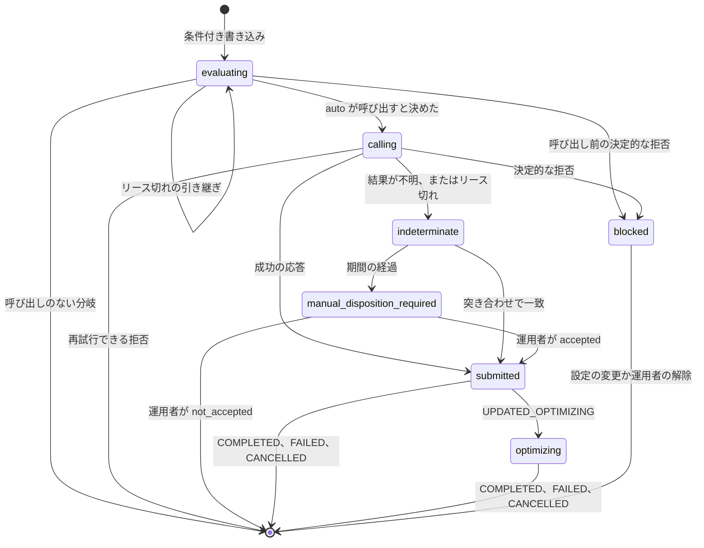

# Amazon FSx for NetApp ONTAP の T4 ガード付き SSD 自動拡張の実装設計

🌐 **日本語**（本ページ）| [English](../en/capacity-automation-t4-design.md)

> **ステータス / 対象読者 / 証拠の階層**
>
> ステータスは、`terraform/fsxn-ssd-auto-increase/` に実装済みでオフライン検証済み（`terraform test`、`make terraform`、pytest）です。2026-10-09 に、元に戻せる経路を第 1 世代のファイルシステム 1 つで実行し、容量は変わっていません（[記録](verification-results-cloudwatch-monitoring.md#2026-10-09-の-terraform-ssd-自動拡張モジュールの実行)）。実際の拡張は実行していません。対象読者は、Amazon FSx for NetApp ONTAP の T4 モジュールを作る、レビューする、テストするエンジニアです。そもそも自動化するかを決める読者は、T4 を AWS のサンプルや手動の手順と比べている [監視を起点にした容量自動化](capacity-automation.md) から読んでください。証拠の階層は次の 4 つです。`文書化済み`（引用した AWS、HashiCorp、NetApp のページに記載。2026-10-07 か 2026-10-08 に読んだ）、`コード確認済み`（AWS サンプルのコードを読んだもので、実行していない）、`仮説`（推論で、確認していない）、`未解決`（読んだどの資料にも答えがない）。値はプレースホルダー（`fs-0123456789abcdef0`、`123456789012`、`ap-northeast-1`）です。

## エグゼクティブサマリ

T4 が SSD 容量を拡張するのは、必須の絶対上限値の範囲内で、本ページのすべてのガードを通ったときだけです。上限値は、デプロイタイプと HA ペア数ごとに文書化されたファイルシステムあたりの最大値と 2 回照合します。デプロイ前に Terraform が、要求のたびに関数が照合します。要求は、その内容を先に保存したロックの状態からしか出ません。要求が受け付けられたかわからない間は、2 回目の要求を出しません。サービス上限を超える上限値や `BadRequest` のような決定的なエラーは `blocked` の状態に固定して 1 回だけ報告し、1 時間ごとのスケジュールは同じ要求を繰り返しません。進捗は `AdministrativeActions` から追います。`UPDATED_OPTIMIZING` は、新しい容量が使えるがストレージ最適化はまだ実行中であることを表すので、`capacity_available` として記録し、アクションが `COMPLETED`・`FAILED`・`CANCELLED` のいずれかになるまで追い続けます。監査の記録は S3 Object Lock のアーカイブです。`auto` モードはコンプライアンスモードの保持を必須とし、ガバナンスモードは `notify_only` と `approve` でだけ受け付けます。`s3:BypassGovernanceRetention` を持つプリンシパルは、ガバナンスモードで保護されたバージョンを削除したり保持期間を短くしたりできるためです。

> **範囲に関する補足**
>
> 本ページは挙動を定めるもので、コードではありません。選択肢の比較、不可逆性の事実、Terraform の `ignore_changes`、ボリューム autosize とスループット変更の手順、導入の順序は [capacity-automation.md](capacity-automation.md) にあります。閾値とヘッドルームの式は [sizing-and-headroom.md](sizing-and-headroom.md) にあります。

## AWS サンプルの詳細な確認結果

T4 のガードは、公開されている AWS のサンプル（[Updating storage capacity dynamically](https://docs.aws.amazon.com/fsx/latest/ONTAPGuide/automate-storage-capacity-increase.html) とダウンロードできる 2 つのアーカイブ。2026-10-07 に読んだ）と比べて書いています。読者向けのガイドには選択肢を選ぶうえで関係する点だけを載せており、ここに確認結果の全体を置きます。

- パラメータと既定値（`文書化済み`）は `FileSystemId`、`LowFreeDataStorageCapacityThreshold`（既定値なし）、`EmailAddress`、`LambdaS3Bucket`、`LambdaS3Key`、`PercentIncrease` 20（10-100）、`EnableIntelligentScaling` true、`MaxIncrementPercent` 100（10-500）、`GrowthThresholds`、`MinHoursBetweenScaling` 6（1-24）、`MaxRetryAttempts` 12（1-50）、`RetryDelayMinutes` 5（1-60）、`RetryBufferMinutes` 5（0-60）、`ScheduleCleanupAgeDays` 7（1-30）です。アラームは閾値を 5 分間続けて超えると発火します。
- 顧客が決める絶対上限値も、承認やドライランのモードもありません（`コード確認済み`）。上限はデプロイタイプごとのサービス上限で、コードに定数として持っています。
- IAM は `fsx:UpdateFileSystem` と `fsx:DescribeFileSystems` を `Resource: "*"` に許可しています（`コード確認済み`）。
- インテリジェントな経路と履歴が足りない場合の経路は `int(current * (1 + pct / 100))` で計算し、切り捨てます。固定の経路は `math.ceil` を使います（`コード確認済み`）。`pct` が 10 に丸められると、1,024 GiB のファイルシステムは 1,126.4 ではなく 1,126 GiB になり、文書化された 10% の最小幅を下回るので、`UpdateFileSystem` はおそらく拒否します（`仮説`）。
- 上限で丸めた目標値が上限と等しいと、現在の容量が上限未満でも、ハンドラーは "Already at or near maximum capacity" で止まり API を呼びません（`コード確認済み`）。
- 成功メッセージは "5-10 minutes" で完了するとしていますが、AWS はその後のストレージ最適化に通常数時間かかると説明しています（[storage-capacity-and-IOPS](https://docs.aws.amazon.com/fsx/latest/ONTAPGuide/storage-capacity-and-IOPS.html)）。
- CloudWatch がアラームアクションを呼ぶのは状態が変わったときだけです（[AlarmThatSendsEmail](https://docs.aws.amazon.com/AmazonCloudWatch/latest/monitoring/AlarmThatSendsEmail.html)、`文書化済み`）。1 回の拡張の後も使用率が閾値を上回ると、アラームは ALARM のままで 2 回目の拡張は起きません。サンプルの再試行はクールダウンで止められた場合だけを扱います（サンプルについては `仮説`、実行していない）。
- アラームは `Aggregate` なしで `StorageTier` と `DataType` を指定しています（`コード確認済み`）。そのため第 2 世代・複数 HA ペアのファイルシステムでアグリゲート単位の使用率は監視されません（`仮説`）。

> **ライセンスに関する補足**
>
> 2 つのアーカイブはどちらも、Amazon の著作権表示に続いて MIT No Attribution 形式の条項を持っています（`コード確認済み`）。本プロジェクトは設計を参照し、T4 のコードは独自に書きます。サンプルをリポジトリに取り込みません。

## 処理の流れと構成要素

`StorageCapacityUtilization`（`StorageTier=SSD`、`DataType=All`。第 2 世代は `Aggregate` ごとのアラームも追加）に対する CloudWatch アラームがトリガー用の SNS トピックに発行し、そのトピックが、VPC の外で AWS API だけを呼ぶ Lambda 関数を呼び出します。アラームアクションは状態の変化でしか動かないので（[AlarmThatSendsEmail](https://docs.aws.amazon.com/AmazonCloudWatch/latest/monitoring/AlarmThatSendsEmail.html)、`文書化済み`）、EventBridge Scheduler のスケジュールも 1 時間ごとに関数を呼び出します。どの呼び出しも `cloudwatch:DescribeAlarms` でトリガーのアラームの状態を読み、アラームが ALARM の間だけ動きます。判断はアラーム自身の評価（アラームに必要なデータポイント数、欠落データの扱い）に任せ、関数はそれを計算し直しません。レポートと `approve` のメールは、Lambda のサブスクリプションを持たない 2 つ目の通知用 SNS トピックに送るので、レポートが関数を再び呼び出すことはありません。関数はトリガー用トピックには発行しません。

運用の対象は、関数、スケジュール、2 つの SNS トピック、DynamoDB のロックテーブル、判断ログ用の CloudWatch Logs のロググループ、判断アーカイブ用の Object Lock を有効にした S3 バケットです。バケットはモジュールの外で管理します。

> **ネットワークに関する補足**
>
> T4 は AWS API だけを呼ぶので、Lambda 関数は VPC の外で動きます。ONTAP の管理エンドポイントへの VPC 内の経路が必要な T2 の Qtree と SnapMirror のコレクターとは、ここが異なります。

## ガード

| ガード | 動作 | 理由 |
|---|---|---|
| `max_storage_capacity_gib` | 必須の絶対上限値で、既定値はない。目標値はこれを超えない。デプロイ時と実行時に、ファイルシステムの構成ごとに文書化された最大値と照合する（次の節） | サービス上限は予算ではない。サービスが受け付けられない上限値は、要求を出す前に 1 回だけ失敗させる |
| `mode` | `notify_only`（既定）は計算して報告するだけで、API を呼ばない。`approve` は、計算した `aws fsx update-file-system` のコマンドを SNS のメールで送り、人が実行する。`auto` は API を呼ぶ | 操作を任せる前に判断の内容を観察できる。メールの代わりに Systems Manager Automation の承認を使えるかは `未解決` |
| アラームの状態 | SNS からでもスケジュールからでも、呼び出しのたびにトリガーのアラーム名を指定して `DescribeAlarms` を呼び、少なくとも 1 つが `ALARM` のときだけ先に進む。そうでなければ `alarm_not_in_alarm` を記録してロックを解放する | アラームの M-of-N と `TreatMissingData` の挙動を作り直さずに使う。アラームが OK のときのスケジュール実行は何もしない |
| 目標値の計算 | `target = min(ceiling, max(ceil(current × 1.10), ceil(current × (1 + increase_percent / 100))))`。`target < ceil(current × 1.10)` または `target ≤ current` のときは呼ばず、上限値に達したと報告する | 切り上げにより、どの要求も 10% の最小幅以上になる（[storage-capacity-and-IOPS](https://docs.aws.amazon.com/fsx/latest/ONTAPGuide/storage-capacity-and-IOPS.html)、`文書化済み`） |
| 管理アクション | `FILE_SYSTEM_UPDATE` のアクションが `PENDING`・`IN_PROGRESS`・`UPDATED_OPTIMIZING`・`OPTIMIZING`・`PAUSED` のいずれかの間と、`COMPLETED` でない `STORAGE_OPTIMIZATION` のアクションがある間は呼ばない。評価の開始時に 1 回読み、ロックを取った後、`UpdateFileSystem` の直前にもう一度読む | 第 1 世代はキューに入れられるが、第 2 世代はできない（[managing-throughput-capacity](https://docs.aws.amazon.com/fsx/latest/ONTAPGuide/managing-throughput-capacity.html)、`文書化済み`）。ストレージ最適化の実行中に新しい要求が受け付けられるかは `未解決` なので、ガードはそれを試さない |
| 同時実行 | 関数の予約済み同時実行数を 1 にし、さらにファイルシステム単位のロックを使う。ロックはファイルシステム ID をキーにした DynamoDB の条件付き書き込みで、項目がないか、項目が `evaluating` で `expires_at` が過去であり、書き残しのアーカイブイベントがないときだけ成功する。ロックを取れなかった呼び出しは、ロックの状態の表のとおり、見つけた状態に応じて動く。そのどれも `UpdateFileSystem` を呼ばない | アグリゲートごとのアラーム、1 時間ごとのスケジュール、再試行は同時に動きうる。読んでから書くだけの確認では、2 つの呼び出しがどちらも更新なしと判断して両方とも要求を出せる。条件は `expires_at` 自体を比べる。ロックテーブルに DynamoDB の TTL は設定しない。`expires_at` はリース比較用の値にすぎず、持続する状態（`submitted`・`optimizing`・`indeterminate`・`manual_disposition_required`・`blocked`）が設計上の解放より前にサービス側で削除されることはない。削除されれば固定・同一トークンの防壁・単一要求の連鎖のいずれかを失う |
| クールダウン | 最後の SSD・IOPS・スループットの変更の `RequestTime` を `AdministrativeActions` から読む。6 時間未満なら延期し、次に実行できる時刻を報告する | クールダウンは 3 つの設定で共有される（[storage-capacity-and-IOPS](https://docs.aws.amazon.com/fsx/latest/ONTAPGuide/storage-capacity-and-IOPS.html)、`文書化済み`） |
| IOPS モード | `AUTOMATIC` は IOPS の引数を付けない。`USER_PROVISIONED` は `Iops = max(current, 3 × target)` とし、デプロイタイプとリージョンごとの SSD IOPS の最大値を超える場合は `iops_exceeds_maximum` で `blocked` に固定し、1 回だけ通知する | ユーザープロビジョンドの IOPS は要求する GiB あたり 3 以上（[increase-storage-capacity](https://docs.aws.amazon.com/fsx/latest/ONTAPGuide/increase-storage-capacity.html)）。クォータのページには、第 1 世代は米国東部（オハイオ）・米国東部（バージニア北部）・米国西部（オレゴン）・欧州（アイルランド）で 160,000、その他のリージョンで 80,000、第 2 世代は Single-AZ で HA ペアあたり 200,000（最大 12 ペア）、Multi-AZ で合計 200,000 とある（[クォータ](https://docs.aws.amazon.com/fsx/latest/ONTAPGuide/limits.html)、`文書化済み`） |
| IAM | `arn:aws:fsx:ap-northeast-1:123456789012:file-system/fs-0123456789abcdef0` に対する `fsx:UpdateFileSystem` だけ | 影響範囲を 1 つのファイルシステムに限る。Service Authorization Reference は、`fsx:UpdateFileSystem` の必須のリソースタイプとして `file-system*` を挙げている（[list_fsx](https://docs.aws.amazon.com/service-authorization/latest/reference/list_fsx.html)、`文書化済み`）。このモジュールのポリシーで絞った Allow が効くことはまだ確かめておらず、テスト計画のポリシーシミュレーションで確かめる |
| レポート | 呼び出しの前と、その後の状態の変化のたびに、通知用トピックに SNS メッセージを送る（相関 ID、現在の GiB、目標の GiB、モード、理由、クールダウンの状態、`AdministrativeActions` の状態） | 運用者に何が起きたかを伝える。SNS の配信は一過性で、メールサブスクリプションは確認されないまま残ることがあるので、レポートは記録にはならない |
| 判断ログ（運用の履歴） | アーカイブのイベント 1 つにつき CloudWatch Logs に構造化した JSON のログを 1 行書く（相関 ID、入力（アラームの状態、使用率、現在の GiB、上限値、モード、クールダウンの状態、`AdministrativeActions`、ロックの状態）、判断、理由、API を呼んだ場合は `UpdateFileSystem` のリクエスト ID）。ロググループの保持期間はモジュールの入力（既定値は 365 日） | 運用者が検索できる履歴。監査の記録ではない。保持期間を過ぎたイベントは消え、必要な権限を持つ ID はロググループを削除できる |
| 判断アーカイブ（監査の記録） | 評価の相関 ID の下にイベント 1 つにつき 1 オブジェクトを、Object Lock の既定の保持を設定し、関数のロールとは別のところで管理する S3 バケットに書く。`auto` では `UpdateFileSystem` の前に意図のイベントを書いてその保持を確かめ、どちらかが失敗したら呼ばない。`auto` はコンプライアンスモードを必須とする | CloudTrail が記録するのは API の呼び出しだけで、`notify_only`・延期・ロックの競合・拒否の判断は残らない。保持のモードとその限界は判断アーカイブの節にある |

## 上限値の検証

サービス上限はデプロイの構成によって変わります。クォータのページは、ファイルシステムあたりの SSD ストレージ容量の最大値を、第 1 世代で 192 TiB、第 2 世代の Multi-AZ で 512 TiB、第 2 世代の Single-AZ で HA ペアあたり 512 TiB（最大 1 PiB）としています（[クォータ](https://docs.aws.amazon.com/fsx/latest/ONTAPGuide/limits.html)、`文書化済み`、2026-10-08 に読んだ）。AWS のサンプルも同じ値を定数として持っています（196,608 GiB、HA ペアあたり 524,288 GiB で上限 1,048,576 GiB。`コード確認済み`）。

| デプロイタイプ | ファイルシステムあたりの SSD 容量の最大値 |
|---|---|
| `SINGLE_AZ_1`、`MULTI_AZ_1`（第 1 世代） | 196,608 GiB |
| `MULTI_AZ_2` | 524,288 GiB |
| `SINGLE_AZ_2` | min(524,288 × HA ペア数, 1,048,576) GiB |

同じページには、アカウント内のすべての FSx for ONTAP ファイルシステムにまたがる、リージョンごとの SSD 容量のクォータ 524,288 GiB もあり、引き上げを申請できます。そのため、ファイルシステムあたりの最大値の範囲内の上限値でも `ServiceLimitExceeded` で拒否されることがあります。この場合は失敗の分類の節の固定で扱います。

デプロイ時には、何かを作る前に 2 つの確認で plan を失敗させます。変数の検証は、1,024 から 1,048,576 GiB（文書化された最も広い範囲）の整数でない上限値を拒否します。リソースの事前条件は、`deployment_type`・`ha_pairs`・`storage_capacity` を公開する `aws_fsx_ontap_file_system` のデータソース（[データソース](https://registry.terraform.io/providers/hashicorp/aws/latest/docs/data-sources/fsx_ontap_file_system)、`文書化済み`）でファイルシステムを読み、構成ごとの最大値を超える上限値を拒否します。Terraform は変数の検証を plan の生成前に実行し、事前条件を plan の後、リソースを作る前に評価します（[validate](https://developer.hashicorp.com/terraform/language/validate)、`文書化済み`）。上限値が 10% の拡張 1 回分の余地も残さない場合は、`check` ブロックが止めずに警告します。

```hcl
# Implemented in terraform/fsxn-ssd-auto-increase/variables.tf and main.tf.
variable "max_storage_capacity_gib" {
  type        = number
  description = "Required absolute SSD ceiling in GiB. No default."

  validation {
    condition = (
      var.max_storage_capacity_gib == floor(var.max_storage_capacity_gib) &&
      var.max_storage_capacity_gib >= 1024 &&
      var.max_storage_capacity_gib <= 1048576
    )
    error_message = "max_storage_capacity_gib must be a whole number from 1024 to 1048576 GiB."
  }
}

data "aws_fsx_ontap_file_system" "target" {
  id = var.file_system_id
}

locals {
  # Per-file-system SSD maximum by deployment shape (FSx for ONTAP quotas page).
  shape_max_gib = {
    SINGLE_AZ_1 = 196608
    MULTI_AZ_1  = 196608
    MULTI_AZ_2  = 524288
    SINGLE_AZ_2 = min(524288 * data.aws_fsx_ontap_file_system.target.ha_pairs, 1048576)
  }[data.aws_fsx_ontap_file_system.target.deployment_type]

  # Passed to the function; a blocked latch clears when this value changes.
  config_fingerprint = sha256(jsonencode({
    ceiling          = var.max_storage_capacity_gib
    increase_percent = var.increase_percent
    mode             = var.mode
    archive_mode     = var.decision_archive_required_mode
  }))
}

resource "aws_lambda_function" "evaluator" {
  # ... function arguments ...

  lifecycle {
    precondition {
      condition     = var.max_storage_capacity_gib <= local.shape_max_gib
      error_message = "max_storage_capacity_gib exceeds the SSD maximum for this deployment type and HA-pair count."
    }
    precondition {
      condition     = var.mode != "auto" || var.decision_archive_required_mode == "COMPLIANCE"
      error_message = "mode = auto requires decision_archive_required_mode = COMPLIANCE."
    }
  }
}

check "ceiling_leaves_room" {
  assert {
    condition     = var.max_storage_capacity_gib >= ceil(data.aws_fsx_ontap_file_system.target.storage_capacity * 1.1)
    error_message = "The ceiling is below current capacity plus the 10% minimum increase; T4 can never act."
  }
}
```

実行時には、目標値を計算する前に、関数が `DescribeFileSystems` から `DeploymentType`・`HAPairs`・`StorageCapacity` を読み、同じ表を当てはめます。上限値が最大値を超えていれば `ceiling_exceeds_service_maximum` を記録し、呼ばずに `blocked` に固定して 1 回だけ通知します。実行時の確認は、デプロイ後に構成が変わったファイルシステムと、事前条件なしで実行された plan を補います。

> **上限値に関する補足**
>
> 未知の `deployment_type` で表を引くと plan が失敗します。これは意図した動作で、この設計に載っていないデプロイタイプでは、既定の最大値に頼らずモジュールを止めます。すべてのデプロイタイプでプロバイダーが plan の時点で `ha_pairs` を読めるかはテストしていません（`未解決`）。

## ロックの状態

ロックの項目のキーはファイルシステム ID です。ロックを解放するか状態を変える条件付き書き込みでは、所有者が呼び出し自身の相関 ID であることと、想定する現在の状態であることも条件にします。



| 状態 | 書かれるとき | 後の呼び出しがこれを見つけたとき | 解放または変更されるとき |
|---|---|---|---|
| `evaluating`、リースが有効 | すべての評価の開始時の条件付き書き込み。所有者の相関 ID、開始時刻、`expires_at`（開始時刻 + 関数のタイムアウト + 1 分）。要求の内容は持たない | 「評価がすでに実行中」と報告して止まる | 呼び出しをしないすべての分岐の終わりに所有者が削除する。`notify_only`、`approve`、アラームが ALARM でない、上限値に達した、クールダウンで延期した、管理アクションが実行中、アーカイブの保持を確認できない、意図のイベントの書き込み失敗が該当する。呼び出し前の決定的な拒否（`ceiling_exceeds_service_maximum`、`iops_exceeds_maximum`）では `blocked` に変える。`auto` が呼び出すと決めたときは `calling` に変える |
| `evaluating`、リースが期限切れ | 所有者が要求の内容を保存する前に止まった。クラッシュかタイムアウト | 新しい相関 ID で新しい `evaluating` としてロックを取り、すべてのガードをやり直す。その `decision` のイベントには引き継いだ前の相関 ID を書く。呼び出しは `calling` からしか出ないので、要求は送られていない | 引き継ぎの書き込みが成功したとき |
| `calling` | 意図のイベントをアーカイブしてその保持を確かめた後、`UpdateFileSystem` の直前に所有者が条件付きで更新する。`ClientRequestToken`（相関 ID）、目標の GiB、IOPS の引数、要求時刻、新しい `expires_at`。この更新が失敗したら呼ばない | リースが有効なら「評価がすでに実行中」と報告して止まる。リースが期限切れなら `ambiguous` をアーカイブし、要求の内容をすべて残したまま項目を `indeterminate` に変える | 所有者がエラーの分類（失敗の分類の節）に従って変える。成功の応答の後は `submitted` に。決定的な拒否の後は、`rejected` をアーカイブして失敗を報告してから `blocked` に。再試行できる拒否の後は、`rejected` をアーカイブしてから削除する。結果が不明な場合（5xx のエラー、タイムアウト、応答なし、表にないエラーコード）は、`ambiguous` をアーカイブしてから `indeterminate` に |
| `indeterminate` | 要求は送られたが、受け付けか拒否かを確定させる応答がなかった。元の相関 ID、`ClientRequestToken`、目標値、要求時刻を残し、`reconcile_until`（要求時刻 + `indeterminate_reconcile_hours`）を設定する | `UpdateFileSystem` を決して呼ばず、新しいトークンも発行しない。`AdministrativeActions` から、`RequestTime` が記録した要求時刻以降で、`TargetFileSystemValues.StorageCapacity` が記録した目標値と等しい `FILE_SYSTEM_UPDATE` を探す。見つかれば `reconciled` をアーカイブして項目を `submitted` に変える。`reconcile_until` より前に見つからなければ `reconcile_pending` をログに残して止まる | 一致すれば `submitted` に。一致がないまま `reconcile_until` を過ぎたら、通知用トピックにレポートを送って `manual_disposition_required` に |
| `manual_disposition_required` | 突き合わせの期間内に一致が見つからなかった | `UpdateFileSystem` を呼ばない。もう一度だけ一致を探し、項目と未決の要求を示すレポートを繰り返し送る | 運用者が、判断に使った証拠とともに項目の `disposition` を `accepted` か `not_accepted` に設定する。次の呼び出しがその証拠を含む `reconciled` をアーカイブし、`accepted` なら項目を `submitted` に変え、`not_accepted` なら削除する。新しい相関 ID とトークンで新しい評価を始められるのは、その後だけ |
| `submitted` | 成功の応答の後（リクエスト ID、`report_sent`）か、突き合わせの後（一致したアクション）の条件付き更新。要求の内容を残す | `report_sent` が false ならレポートを送る。`UpdateFileSystem` は決して呼ばない。対応するアクションの状態を読む | アクションが `UPDATED_OPTIMIZING` になったら、`capacity_available` をアーカイブしてそのレポートを送った後に `optimizing` に。`COMPLETED`・`FAILED`・`CANCELLED` のいずれかになったら、`terminal` をアーカイブして最終のレポートを送った後に削除する |
| `optimizing` | 対応する `FILE_SYSTEM_UPDATE` が `UPDATED_OPTIMIZING` になった。新しい容量は使えるが、ストレージ最適化は実行中 | `UpdateFileSystem` を呼ばない。状態と `STORAGE_OPTIMIZATION` の `ProgressPercent` を判断ログに書く。`OPTIMIZING`・`PAUSED`・`UPDATED_OPTIMIZING` の間は状態を保つ | アクションが `COMPLETED`・`FAILED`・`CANCELLED` のいずれかになったら、`terminal` をアーカイブして最終のレポートを送った後に削除する |
| `blocked` | 決定的な拒否。呼び出し前の `ceiling_exceeds_service_maximum` か `iops_exceeds_maximum`、または呼び出し後の決定的な拒否。理由、エラーコード（ある場合）、関数がデプロイされたときの `config_fingerprint` を保存する | `UpdateFileSystem` を呼ばず、レポートもそれ以上送らない。保存した理由とともに `blocked` をログに残す。デプロイされている `config_fingerprint` が保存したものと異なれば、`reconciled`（出どころは `configuration_change`）をアーカイブし、項目を削除して評価をやり直す | 設定が変わったとき（新しいフィンガープリント）か、運用者が行った是正（フィンガープリントに含まれない IAM の修正やクォータの引き上げなど）とともに `disposition` を `cleared` に設定したとき |

ロックはアクションが終端の状態になるまで保持するので、1 つの項目が 1 つの要求を最後まで追います。`UPDATED_OPTIMIZING` で解放しても、それだけで 2 回目の要求が出るわけではありません。管理アクションのガードは `UPDATED_OPTIMIZING` を実行中として扱い、クールダウンのガードは別に履歴を読むためです。それでも設計では項目を残し、アーカイブの `terminal` のイベントと最終のレポートが、常に要求を出した評価に属するようにします。

> **最適化に関する補足**
>
> AWS は `UPDATED_OPTIMIZING` を、ファイルシステムが新しいストレージ容量を持ち、Amazon FSx がストレージ最適化を実行している状態と説明しています（[AdministrativeAction](https://docs.aws.amazon.com/fsx/latest/APIReference/API_AdministrativeAction.html)、`文書化済み`）。SSD の拡張では `FILE_SYSTEM_UPDATE` と `STORAGE_OPTIMIZATION` の 2 つのアクションが作られ、最適化が完了すると `FILE_SYSTEM_UPDATE` が `COMPLETED` になり、`STORAGE_OPTIMIZATION` のアクションは表示されなくなります（[monitoring storage capacity increases](https://docs.aws.amazon.com/fsx/latest/ONTAPGuide/monitoring-storage-capacity-increase.html)、`文書化済み`）。文書化された `Status` の値は `FAILED`、`IN_PROGRESS`、`PENDING`、`COMPLETED`、`UPDATED_OPTIMIZING`、`OPTIMIZING`、`PAUSED`、`CANCELLED` です。T4 が終端として扱うのは `COMPLETED`、`FAILED`、`CANCELLED` だけです。

## 要求の受け付けと突き合わせ

> **冪等性に関する補足**
>
> どの要求も相関 ID を `ClientRequestToken` として付けます。Amazon FSx はこのトークンを冪等な更新に使い、同じトークンでパラメータが異なる 2 回目の要求には `IncompatibleParameterError` を返します（[UpdateFileSystem](https://docs.aws.amazon.com/fsx/latest/APIReference/API_UpdateFileSystem.html)、`文書化済み`）。トークンがどれだけの期間有効かは書かれておらず（`未解決`）、受け付けられた要求がすぐに `AdministrativeActions` に現れるかは `仮説` です。そのためロックは、受け付けの有無がわからない間は再送もトークンの置き換えもしません。`indeterminate` の項目は、一致が見つかるか運用者の判断で要求が決着するまでトークンを持ち続けます。ロックの状態のテストは、表示が遅れる場合をモックでしか扱いません。

`indeterminate_reconcile_hours` の既定値は 6 です。最初の要求が受け付けられていた場合、文書化されたクールダウンにより、SSD・IOPS・スループットの変更はどのみち少なくとも 6 時間できません（[storage-capacity-and-IOPS](https://docs.aws.amazon.com/fsx/latest/ONTAPGuide/storage-capacity-and-IOPS.html)、`文書化済み`）。そのため、その間待ってから人に判断を回しても、2 回目の拡張が遅れる長さは受け付けられていた場合と変わりません。ヘッドルームの式はこの分を `T_cooldown` としてすでに見込んでおり、人の判断は `T_human` を加えます（[sizing-and-headroom.md](sizing-and-headroom.md#ヘッドルームの式)）。この期間は、自動化が一致を探す長さの上限です。受け付けられた要求が 6 時間以内に見えるようになるという主張ではありません。

人による判断。`not_accepted` には、期間が過ぎた後の 2 つの確認が必要です。`AdministrativeActions` に一致する `FILE_SYSTEM_UPDATE` がないことと、記録した要求時刻以降の CloudTrail に、このファイルシステムに対する `errorCode` のない `UpdateFileSystem` のイベントがないことです。CloudTrail はイベントを遅れて届けることがあり、その場合は `DELIVERY_DELAY` の addendum を付けます（[CloudTrail record contents](https://docs.aws.amazon.com/awscloudtrail/latest/userguide/cloudtrail-event-reference-record-contents.html)、`文書化済み`）。そのためこの確認は証明ではなく判断であり、人が行う理由もそこにあります。CloudTrail のイベントのリクエストパラメータに `ClientRequestToken` が出るかは `仮説` です。`accepted` は、どちらかの確認で要求が見つかれば足ります。ロックテーブルに書くのは運用者のロールで、関数のロールは変わりません。

## 失敗の分類

`UpdateFileSystem` は、`BadRequest`、`FileSystemNotFound`、`IncompatibleParameterError`、`InvalidNetworkSettings`、`MissingFileSystemConfiguration`、`ServiceLimitExceeded`、`UnsupportedOperation` を HTTP 400 のエラー、`InternalServerError` を HTTP 500 のエラーとして挙げています（[UpdateFileSystem](https://docs.aws.amazon.com/fsx/latest/APIReference/API_UpdateFileSystem.html)、`文書化済み`、2026-10-08 に読んだ）。Amazon FSx のすべてのアクションに共通のエラーには、`AccessDeniedException`（403）、`ValidationError`（400）、`ThrottlingException`（400。AWS SDK が自動で再試行する）、`ExpiredTokenException`（403）、`RequestTimeoutException`（408）、`RequestAbortedException`（400）、`InternalFailure`（500）、`ServiceUnavailable`（503）があります（[Common Error Types](https://docs.aws.amazon.com/fsx/latest/APIReference/CommonErrors.html)、`文書化済み`、2026-10-08 に読んだ）。ステータスコードだけでは分類は決まりません。400 にはスロットリングも中断された要求も含まれます。

| 分類 | エラー | 扱い | 理由 |
|---|---|---|---|
| 呼び出し前の決定的な拒否 | `ceiling_exceeds_service_maximum`、`iops_exceeds_maximum` | 呼ばない。理由を含む `decision` をアーカイブし、`blocked` に固定して 1 回だけ通知する | 同じ設定では毎回同じ拒否になる |
| 決定的な拒否 | `BadRequest`、`FileSystemNotFound`、`IncompatibleParameterError`、`InvalidNetworkSettings`、`MissingFileSystemConfiguration`、`ServiceLimitExceeded`、`UnsupportedOperation`、`ValidationError`、`AccessDeniedException` | `rejected` をアーカイブし、`blocked` に固定して 1 回だけ通知する。1 時間ごとのスケジュールは再送しない | 設定・権限・クォータのどれかが変わるまで、同じ要求は同じように失敗する。1 時間ごとに再送すると、再試行できない要求とその失敗のレポートを繰り返すことになる |
| 再試行できる拒否 | SDK 自身の再試行でも解消しなかった `ThrottlingException`、`ExpiredTokenException` | コードを含む `rejected` をアーカイブし、項目を削除する。次のスケジュール実行で評価し直してよい | どちらも要求ではなく、負荷か認証情報に依存する |
| 結果が不明 | `InternalServerError`、`InternalFailure`、`ServiceUnavailable`、`RequestTimeoutException`、`RequestAbortedException`、クライアント側のタイムアウト、応答なし、この表にないすべてのエラーコード | `ambiguous` をアーカイブし、`indeterminate` に移して突き合わせる | 要求が受け付けられた可能性がある。未知のコードを受け付けられた可能性があるものとして扱うのは、第 1 世代では取り消せない拡張に対して安全側に倒す読み方である |

> **失敗の扱いに関する補足**
>
> `blocked` の固定は、1 回だけ安全側に倒します。1 回報告した後は、設定が変わるか運用者が解除するまで関数は何も送りません。固定が続く間、この設計の他の部分も通知を繰り返しません。トリガーのアラームは評価を続けて ALARM のままなので、状態は CloudWatch のコンソールと `DescribeAlarms` で確認できます。ただし、アラームがアクションを呼び出すのは ALARM に変わったときだけで、ALARM にとどまっている間は再び呼び出しません。繰り返すのは Auto Scaling のアクションだけです（[AlarmThatSendsEmail](https://docs.aws.amazon.com/AmazonCloudWatch/latest/monitoring/AlarmThatSendsEmail.html)、`文書化済み`）。そのため、オンコールの担当者に届くのは、アラームにメールのアクションがあればその状態変化の通知と、1 回だけの `blocked` のレポートまでで、再通知は届きません。繰り返し知らせるには別の仕組みが要ります。たとえば、ロックテーブルを読み直し、運用者が確認するまで通知を繰り返すスケジュールです。T4 にはこの仕組みを含めていません。

## 判断アーカイブ

判断アーカイブは、関数がいつ、どの根拠で `UpdateFileSystem` を呼んだか、呼ばなかったかという T4 自身の記録で、ファイルシステムのデータは入っていません（[SnapLock のボリュームではなく S3 Object Lock に置く理由](#faq)）。

イベントはそれぞれ `<prefix><file-system-id>/<correlation-id>/<sequence>-<event>.json` の別々のオブジェクトで、再試行でイベントが置き換わらないよう `If-None-Match: *` を付けて書きます（[PutObject](https://docs.aws.amazon.com/AmazonS3/latest/API/API_PutObject.html)、`文書化済み`。この条件が Object Lock のバケットでどう動くかはテストしていません）。判断ログにはイベントごとに同じ項目で 1 行を書きます。

| イベント | 書くとき | 内容 | 書き込みに失敗したとき |
|---|---|---|---|
| `decision` | 評価 1 回につき 1 つ。`auto` で呼び出す場合は `UpdateFileSystem` の前に意図として、それ以外は評価の終わりに書く | 入力、判断、理由。意図ではさらに `ClientRequestToken`、目標の GiB、IOPS の引数。引き継ぎでは引き継いだ前の相関 ID | 意図なら呼ばない。項目を削除して失敗を報告する（安全側に倒す）。それ以外の判断では止めるものがなく、ログの行とレポートに欠けたオブジェクトを書く |
| `accepted` | 成功の応答の後 | `UpdateFileSystem` のリクエスト ID、応答時刻、返された管理アクション | 呼び出しの後なので、本文をロックの項目の `pending_events` に入れる |
| `rejected` | 決定的な拒否か再試行できる拒否の後 | エラーコード、リクエスト ID、エラーの分類 | 呼び出しの後。`accepted` と同じ |
| `ambiguous` | 結果が不明なときか、後の呼び出しがリースの切れた `calling` の項目を見つけたとき | 観測した内容と時刻、要求の内容 | 呼び出しの後。`accepted` と同じ |
| `reconciled` | 突き合わせで一致するアクションが見つかったとき、次の呼び出しが運用者の判断を反映するとき、`config_fingerprint` の変化で `blocked` を解除するとき | 出どころ（`administrative_action`、`operator`、`configuration_change`）、一致したアクションか証拠、その結果の状態 | 呼び出しの後。`accepted` と同じ |
| `capacity_available` | 対応するアクションが `UPDATED_OPTIMIZING` になったとき | 現在表示される `StorageCapacity`、`STORAGE_OPTIMIZATION` の状態と `ProgressPercent` | 呼び出しの後。`accepted` と同じ |
| `terminal` | 対応するアクションが `COMPLETED`・`FAILED`・`CANCELLED` のいずれかになったとき | 最終の状態、アクション後の `StorageCapacity`、失敗の詳細 | 呼び出しの後。`accepted` と同じ |

呼び出しの後の書き込み失敗は呼び出しを取り消せないので、呼び出しを止めるのではなく、復旧できる保留の状態を残します。`pending_events` が空でない間は、項目を削除も引き継ぎもしません。次の呼び出しが最初に保留のイベントを書き、その後で所有者が記録した解放を行います。ロックテーブルへの書き込みも失敗した場合、項目は `calling` のまま残り、リースが切れて突き合わせが引き継ぎます。そのときアーカイブにはリクエスト ID がなく、`reconciled` のイベントにそのことを書きます。

保持の取り決め。アーカイブはバケットの既定の保持に頼ります。関数は保持のヘッダーを送らず、`s3:PutObjectRetention` も持ちません。既定の保持はバケットに置かれるすべてのオブジェクトのバージョンを保護し、保持期限はバージョンの作成時刻から計算されます（[object-lock](https://docs.aws.amazon.com/AmazonS3/latest/userguide/object-lock.html)、`文書化済み`）。バケットが満たすべき条件は 2 つの入力、`decision_archive_required_mode` と `decision_archive_min_retention_days` で示し、関数が実行時に確かめます。プロバイダーが plan の時点でバケットの Object Lock の設定を読めるかは確かめていません（`未解決`）。

1. 評価の最初のイベントの前に、`GetBucketObjectLockConfiguration` で Object Lock が有効であり、既定の保持が指定のモードで最小期間以上であることを確かめます。
2. 書き込みのたびに、返されたバージョン ID に対する `GetObjectRetention` で、そのモードと、書き込み前の時刻 + 最小期間以降の保持期限を確かめます（[GetObjectRetention](https://docs.aws.amazon.com/AmazonS3/latest/API/API_GetObjectRetention.html)、`文書化済み`）。
3. 保持を設定したバケットへのアップロードには `Content-MD5` か `x-amz-sdk-checksum-algorithm` のヘッダーが必要なので（[PutObject](https://docs.aws.amazon.com/AmazonS3/latest/API/API_PutObject.html)、`文書化済み`）、どの書き込みにもチェックサムのアルゴリズムを指定します。

`auto` では、手順 1 が失敗するか意図のイベントで手順 2 が失敗すると `archive_retention_unproven` を記録し、呼ばずに失敗を報告します。`notify_only` と `approve` では評価を続け、レポートに欠けている点を書きます。呼び出しの後のイベントでの失敗は報告し、呼び出しは取り消しません。バケットの所有者は、バケットポリシーの `s3:object-lock-remaining-retention-days` 条件キーで保持期間に上下限を設けることもできます（[object-lock](https://docs.aws.amazon.com/AmazonS3/latest/userguide/object-lock.html)、`文書化済み`）。

T4 のモードごとの保持のモード。Object Lock の 2 つのモードは、守る相手が異なります（[object-lock](https://docs.aws.amazon.com/AmazonS3/latest/userguide/object-lock.html)、`文書化済み`、2026-10-08 に再読）。

| T4 のモード | 受け付けるアーカイブのモード | 記録が耐えられる操作 |
|---|---|---|
| `notify_only`、`approve` | `GOVERNANCE` か `COMPLIANCE` | ガバナンスモードは改ざんに強いものの、変更できないわけではない。関数のロールと `s3:BypassGovernanceRetention` を持たない ID は、バージョンを削除することも保持期間を短くすることもできない。その権限を持つプリンシパルは `x-amz-bypass-governance-retention:true` を送ればできる。Amazon S3 コンソールは既定でこのヘッダーを送る |
| `auto` | `COMPLIANCE` だけ。デプロイ時の事前条件と、手順 1 の実行時の確認で強制する | ルートユーザーを含むどのユーザーも、ロックされたバージョンを上書きも削除もできず、保持期間も短くできない。保持期限の前に削除する方法は AWS アカウントの削除だけ |

> **監査に関する補足**
>
> コンプライアンスモードの保持期間は短縮できないので、本番のコンプライアンスモードのバケットは長く続く約束になります。`notify_only` の経路は、使い捨てのバケットでガバナンスモードと短い保持期間を使って試してください。`auto` の経路（IAM で拒否する対照実行、同時実行）は、既定の保持を 1 日にしたコンプライアンスモードの使い捨てのバケットで試してください。その日が過ぎるまではオブジェクトを削除できず、したがってバケットも削除できません。本番の保持期間は別の判断として意図して選んでください。アーカイブのストレージの価格は調べていません。

## モジュールのインターフェース

以下の値はプレースホルダーで、実装された入力は `terraform/fsxn-ssd-auto-increase/variables.tf` にあります。

```hcl
# Implemented module at terraform/fsxn-ssd-auto-increase/.
module "ssd_auto_increase" {
  source = "github.com/Yoshiki0705/FSx-for-ONTAP-Observability-integrations//terraform/fsxn-ssd-auto-increase?ref=<planned>"

  file_system_id                = "fs-0123456789abcdef0"
  max_storage_capacity_gib      = 2048          # required absolute ceiling, validated against the shape maximum
  mode                          = "notify_only" # notify_only (default) | approve | auto
  trigger_threshold_percent     = 80
  increase_percent              = 10             # never below the 10% service minimum
  reevaluation_schedule         = "rate(1 hour)" # bounds T_recheck in the headroom formula
  log_retention_days            = 365            # decision log, operational history (CloudWatch Logs)
  indeterminate_reconcile_hours = 6              # then manual disposition; no new token before it

  # Decision archive (audit record): an existing S3 bucket with Object Lock default
  # retention, administered outside this module. The function gets s3:PutObject on the
  # prefix plus read-only retention checks; it never sets or changes retention.
  decision_archive_bucket             = "<object-lock-bucket-name>" # required
  decision_archive_prefix             = "fsx-ssd-auto-increase/"
  decision_archive_required_mode      = "COMPLIANCE" # default; GOVERNANCE only with notify_only or approve
  decision_archive_min_retention_days = 365          # checked on the bucket and on each object

  # The module creates two SNS topics:
  #   trigger topic      : alarm -> Lambda (the only Lambda subscription)
  #   notification topic : reports and approve emails -> notification_email
  # The function never publishes to the trigger topic.
  notification_email = "ops@example.com"
}
```

`mode` の既定値は `notify_only` なので、モジュールをデプロイしてもファイルシステムは何も変わりません。導入の順序は [capacity-automation.md](capacity-automation.md#段階的な導入) にあります。

> **通知に関する補足**
>
> SNS のメールサブスクリプションは、受信者が確認するまで保留のままです。`approve` モードで通知用トピックのサブスクリプションが確認されていないと、誰もコマンドを受け取らず、アラームは ALARM のままになります。このモードに頼る前にサブスクリプションを確認してください。どちらの場合も、判断ログとアーカイブには評価ごとの記録が残ります。

## IAM 権限

> **セキュリティに関する補足**
>
> 関数には `fsx:UpdateFileSystem` のほかに、`fsx:DescribeFileSystems`、トリガーのアラームに対する `cloudwatch:DescribeAlarms`、レポートの値を取る `cloudwatch:GetMetricData`、通知用トピックへの `sns:Publish`、ロックテーブルの項目の読み書き、アーカイブのプレフィックスへの `s3:PutObject` と読み取りだけの `s3:GetObjectRetention`、アーカイブのバケットへの読み取りだけの `s3:GetBucketObjectLockConfiguration`、ログの書き込みが必要です。`s3:DeleteObject`、`s3:PutObjectRetention`、`s3:BypassGovernanceRetention` は与えません。Service Authorization Reference は `fsx:DescribeFileSystems` にリソースタイプを挙げていないので、このアクションには `"*"` が必要です。`fsx:UpdateFileSystem` は `file-system*` を挙げています（[list_fsx](https://docs.aws.amazon.com/service-authorization/latest/reference/list_fsx.html)）。`cloudwatch:DescribeAlarms` は `alarm*` を挙げているので、`arn:aws:cloudwatch:ap-northeast-1:123456789012:alarm:<trigger-alarm-name>` に絞れます（[list_cloudwatch](https://docs.aws.amazon.com/service-authorization/latest/reference/list_cloudwatch.html)）（いずれも `文書化済み`、2026-10-07 に確認）。リソースタイプが文書化されていることは、ポリシーを試したことにはなりません。T4 を完了とするのは、ポリシーシミュレーションが通った後です。

ロックの項目に `disposition` を書き、アーカイブのバケットを管理するのは、関数のロールではなく運用者のロールです。

## テスト計画

オフラインの項目（デプロイ時の上限値の検証、目標計算とガード、ロック状態の遷移、アーカイブの書き込み）は実行済みです。`terraform test` と `shared/lambda/ssd_auto_increase/tests/` 配下の pytest が通ります。実環境の項目は、2026-10-09 に第 1 世代・HA ペア 1 つのファイルシステム 1 つで実行しました（[記録](verification-results-cloudwatch-monitoring.md#2026-10-09-の-terraform-ssd-自動拡張モジュールの実行)）。`notify_only`・`approve`・IAM 拒否・ポリシーシミュレーション・アラームが OK のとき・同時実行の各行は合格です。同時実行の行では予約済み同時実行数が 2 回の呼び出しを順番に並べたので、ロックのリースの経路は別に実行しました。判断アーカイブの行は未完了です。コンプライアンスモードの保持と、バイパスによる削除の拒否は示しましたが、主体 A と B の陽性対照は実行しておらず、`blocked` のラッチで止まった実行はアーカイブのオブジェクトを書きません。実増設の行は実行していません。この実行では、以下の記述との違いがほかに 2 つ見つかりました。呼び出しをしない評価のたびにレポートが出ることと、`archive_retention_unproven` のレポートの `lock_state` が `calling` であることです。

| テスト | 元に戻せるか | 期待する証拠 | 費用 / リスク |
|---|---|---|---|
| `notify_only`。`aws cloudwatch set-alarm-state` か、現在の使用率より低い閾値でアラームを鳴らす | 可能 | 通知用トピックに届く、現在値・目標値・理由を含む SNS レポート。同じ相関 ID を持つ判断ログ 1 行と、保持の確認を通った `decision` のアーカイブのオブジェクト 1 つ。関数の呼び出しは 1 回で、自分のレポートで再び呼ばれていない。CloudTrail に `UpdateFileSystem` がない | ほぼゼロ。`set-alarm-state` は次の評価まで有効（[AlarmThatSendsEmail](https://docs.aws.amazon.com/AmazonCloudWatch/latest/monitoring/AlarmThatSendsEmail.html)） |
| `approve` | 可能 | 計算したコマンドを含むメール。API の呼び出しなし | ほぼゼロ |
| `fsx:UpdateFileSystem` を IAM で明示的に拒否した状態での `auto`（対照実行）。アーカイブはコンプライアンスモードの使い捨てのもの | 1 日の保持が過ぎれば可能 | 関数のログに `AccessDenied` が出れば、呼び出しが認可の判定まで届いたことを示す。ARN で絞った Allow が効くことは示さない。アーカイブには 1 つの相関 ID の下に `decision`（意図）と `rejected` がある。ロックの項目はエラーとフィンガープリントを持つ `blocked` になっている。失敗のレポートは通知用トピックにちょうど 1 回届いている。アラームが ALARM の間の次のスケジュール実行は、呼び出しもレポートの送信もしない。フィンガープリントの変更（たとえば `increase_percent`）か、運用者の `cleared` の判断で固定が外れる | ほぼゼロ。アーカイブのバケットは 1 日削除できない |
| 絞った Allow のポリシーシミュレーション（モジュールのポリシーで `aws iam simulate-custom-policy`） | 可能（読み取りだけの API） | `arn:aws:fsx:ap-northeast-1:123456789012:file-system/fs-0123456789abcdef0` に対する `fsx:UpdateFileSystem` が `allowed`、別のファイルシステムの ARN では `implicitDeny`。`cloudwatch:DescribeAlarms` はトリガーのアラームの ARN で `allowed`、別のアラームの ARN で `implicitDeny`。アーカイブに対する `s3:DeleteObject`、`s3:PutObjectRetention`、`s3:BypassGovernanceRetention` は `implicitDeny`。プレフィックスに対する `s3:GetObjectRetention` とバケットに対する `s3:GetBucketObjectLockConfiguration` は `allowed` | なし |
| トリガーのアラームが OK のときのスケジュール実行 | 可能 | ログとアーカイブに `alarm_not_in_alarm` の判断がある。CloudTrail に `UpdateFileSystem` がない。ロックの項目が残っていない | ほぼゼロ |
| 固定を外した後に、IAM で拒否した状態で行う `auto` の 2 つの同時呼び出し | 可能 | 一方がロックを取って `AccessDenied` をログに残し、もう一方は「評価がすでに実行中」と報告して呼び出しをしない | ほぼゼロ |
| デプロイ時の上限値の検証（モックのデータソースを使った `terraform plan` と `terraform test`） | 可能 | 1,023 GiB、1,048,577 GiB、小数の上限値は変数の検証で失敗する。`SINGLE_AZ_1` の構成では 196,609 GiB が事前条件で失敗し、196,608 は通る。`SINGLE_AZ_2` で HA ペアが 1 つなら 524,289 が失敗して 524,288 が通り、HA ペアが 2 つなら 1,048,576 が通る。`mode = "auto"` と `GOVERNANCE` の組み合わせは事前条件で失敗する。`ceil(current × 1.1)` を下回る上限値は、失敗させずに `check` の警告を出す | なし |
| 目標値の計算とガード（単体テスト） | 可能 | 10% の切り上げ、上限値、クールダウン、ロックの前後での `AdministrativeActions` の読み取り、実行中の `UPDATED_OPTIMIZING` か `STORAGE_OPTIMIZATION` による呼び出しの抑止、アラームの状態（`ALARM`、`OK`、`INSUFFICIENT_DATA`）、ロックの競合と期限切れ、IOPS モードとリージョンごとの IOPS の最大値。実行時の上限値の確認では、最大値が上限値より小さいモックの構成で `ceiling_exceeds_service_maximum` を記録し、数回のスケジュール実行を通して呼び出しはゼロ、`blocked` に固定し、レポートは 1 回だけ。フィンガープリントが変われば固定が外れる | なし |
| ロックの状態の遷移（単体テスト） | 可能 | `evaluating` でのクラッシュ（リースが切れ、新しいトークンで引き継ぎ、引き継いだ前の ID を記録し、すべてのガードをやり直す）。呼び出しの前か後の `calling` でのクラッシュ（同じトークンのまま項目が `indeterminate` になる）。表示の遅れ（タイムアウトの後、数回の実行ではモックの `AdministrativeActions` に一致がなく、その後に現れる。追加では呼ばず、その後 `submitted` になる）。最後まで見えない場合（期間が過ぎて `manual_disposition_required` になり、追加の呼び出しはゼロ。新しいトークンは `not_accepted` の後だけ）。決定的な拒否（`BadRequest`、`ServiceLimitExceeded`、`AccessDeniedException`。`rejected` をアーカイブし、`blocked` に固定し、レポートは 1 回、以後の実行で呼び出しはゼロ）。再試行できる拒否（`ThrottlingException`。項目を削除し、次の実行で評価し直す）。表にないエラーコード（結果が不明として扱い、`indeterminate` になり再送しない）。受け付け後のレポート失敗（`report_sent` が false の `submitted`。次の実行はレポートだけを送り、呼ばない）。`UPDATED_OPTIMIZING`（`capacity_available` をアーカイブし、状態は `optimizing`、`terminal` のイベントもロックの解放もない）、その後の `COMPLETED`（`terminal` をアーカイブし、最終のレポートを送り、項目を削除する）。`submitted` と `optimizing` の両方からの `FAILED` と `CANCELLED`。`notify_only`・`approve`・上限値到達・クールダウンでの延期・アラームが OK の各分岐での解放 | なし |
| アーカイブへの書き込み（単体テスト） | 可能 | `auto` で意図の書き込みが失敗するか保持の確認が失敗したら呼ばず、`notify_only` では同じ失敗でも評価を止めない。呼び出しの後の書き込み失敗ではイベントが `pending_events` に残り、次の実行が最初に書き、それまで項目を解放しない。呼び出しの後にアーカイブとロックテーブルの両方の書き込みが失敗した場合は突き合わせで終わる。`auto` で `GOVERNANCE` のバケットを指定すると `archive_retention_unproven` を記録して呼ばない | なし |
| 判断アーカイブの保持 | ガバナンスモードのバケットは短い保持期間なら可能。コンプライアンスモードのバケットは保持期限（このテストでは 1 日）まで不可 | どの評価にも 1 つの相関 ID の下にイベントの列がある（`notify_only`、延期、`blocked` の判断も含む）。アーカイブしたバージョンごとに、`GetObjectRetention` が設定したモードと、作成時刻 + 設定した期間以降の保持期限を返す。対照の ID A は、アーカイブと、Object Lock のない 2 つ目の使い捨てのバケットの両方に対して `s3:DeleteObject` と `s3:DeleteObjectVersion` を許可されており、2 つ目のバケットではバージョンを削除でき（陽性の対照）、アーカイブのバージョンの削除では `AccessDenied` になる。対照の ID B はさらに `s3:BypassGovernanceRetention` を持ち、バイパスのヘッダーを送る。ガバナンスモードの使い捨てのバケットではバージョンを削除でき（バイパスの陽性の対照）、コンプライアンスモードのアーカイブのバージョンの削除では `AccessDenied` になる。バージョンを指定しない削除は削除マーカーを加えるだけで、`ListObjectVersions` にはロックされたバージョンが残る（[object-lock](https://docs.aws.amazon.com/AmazonS3/latest/userguide/object-lock.html)）。既定の保持がないバケット、期間が短いバケット、`auto` でのガバナンスモードのバケットを指定すると、関数は `archive_retention_unproven` を記録して呼ばない。`PutObject` を拒否した場合も同じ | 価格は調べていない。保持期間の分のストレージ。コンプライアンスモードのバケットは 1 日残る |
| 実際の拡張 | 第 1 世代では不可。少なくとも 10% がファイルシステムの削除まで残り、6 時間のクールダウンが始まる | `AdministrativeActions` で `FILE_SYSTEM_UPDATE` が `UPDATED_OPTIMIZING` を経て `COMPLETED` になり、新しい `StorageCapacity` になる。アーカイブには 1 つの相関 ID の下に `decision`、`accepted`、`capacity_available`、`terminal` があり、`accepted` のリクエスト ID が CloudTrail の `UpdateFileSystem` イベントの `requestID` と一致する。ロックの項目は `terminal` の後にだけ解放される。絞った Allow を実環境で確かめる対照もこの行が兼ねる | 価格は調べていない。明示的な承認がある場合か、使い捨てのファイルシステムでのみ |

T4 を完了とするのは、`notify_only`、`approve`、IAM で拒否する対照実行、ポリシーシミュレーション、アラームが OK のとき、同時呼び出し、デプロイ時の上限値の検証、判断アーカイブの各行が通り、単体テストがすべてのガードとロックの状態のすべての遷移（表示が遅れる場合、最後まで見えない場合、固定された場合、最適化中の場合を含む）を扱ったときです。監査の記録が変更できないという主張が成り立つのは、対照の ID B で確かめたコンプライアンスモードのアーカイブだけで、ガバナンスモードは改ざんに強いものとして記録します。CloudWatch Logs の判断ログだけでは監査証跡の要件を満たしません。拒否の対照実行だけでは、リソースの絞り込みの問いは閉じません。実際の拡張は完了条件に含めず、その行の承認の範囲でのみ実行します。

## FAQ

**Q: 判断アーカイブを SnapLock のボリュームではなく S3 Object Lock に置くのはなぜですか**？
A: 判断アーカイブは、関数がいつ、どの根拠で `UpdateFileSystem` を呼んだか、呼ばなかったかという T4 自身の記録で、ファイルシステムのデータは入っておらず、監視（T1〜T3）は使わず、書き込むのは任意の T4 モジュールだけです。ボリューム上のデータを WORM として保護するのは SnapLock の役割です（[SnapLock](https://docs.aws.amazon.com/fsx/latest/ONTAPGuide/snaplock.html)、`文書化済み`、2026-10-10 に読んだ。このリポジトリでは [パターン C](observability-storage-patterns/README.md#パターン-c-snapshot--snaplock-によるフォレンジック保護)）。T4 が記録を S3 に置く理由は次の 3 つです。

1. 障害の範囲。関数が動くのはファイルシステムの SSD 使用率のアラームが ALARM の間だけで、`auto` では意図の書き込みに失敗すると呼びません（[判断アーカイブ](#判断アーカイブ)）。同じファイルシステム上の SnapLock のボリュームは、T4 を起動するきっかけになる不足と同じ SSD 容量を使うので、記録が必要なときほど書き込みに失敗しやすく、そのときガードが拡張を止めることになります（`仮説`、テストしていない）。
2. ネットワークの経路。関数は VPC の外で動き、AWS API だけを呼びます（[ネットワークに関する補足](#処理の流れと構成要素)）。ボリュームに書くには、VPC に接続した関数、ファイルシステムへのネットワークの経路、NFS か SMB のクライアントが要ります。FSx for ONTAP S3 Access Points で SnapLock のボリュームに書けるかは確かめていません（`未解決`）。
3. 動く前の証明。関数は最初のイベントの前に `GetBucketObjectLockConfiguration` を、書き込みのたびに `GetObjectRetention` を読み、`auto` はコンプライアンスモードの保持を証明できたときだけ `UpdateFileSystem` を呼びます（[判断アーカイブ](#判断アーカイブ)）。

2 つは目的が異なります。SnapLock は、ボリューム上の監査ログのファイルのように、ファイルシステムに置くデータの WORM 保護に向きます。S3 Object Lock は、そのファイルシステムについての自動化の判断を、ファイルシステムの外に記録する用途に向きます。

**Q: 容量はもう使えるのに、`UPDATED_OPTIMIZING` でロックを解放しないのはなぜですか**？
A: 要求の重複を防ぐだけなら解放しても安全です。管理アクションとクールダウンのガードが 2 回目の要求を止めるためです。保持しておくと、1 つの要求につき項目・アーカイブのイベントの列・最終のレポートが 1 つずつになり、ストレージ最適化の実行中にアーカイブが操作の完了を記録することもなくなります。

**Q: `BadRequest` を再試行せずに固定するのはなぜですか**？
A: 関数は同じ設定に対して毎回同じ要求を送ります。そのため再試行できないエラーは、同じ失敗のレポートとともに 1 時間ごとに繰り返されます。固定すれば 1 回だけ報告し、設定の変更か運用者を待ちます。

**Q: ガバナンスモードのアーカイブで監査に足りますか**？
A: 関数と、`s3:BypassGovernanceRetention` を持たない ID からは記録を守ります。`notify_only` と `approve` が受け付けるのはこの水準です。特定の監査要件を満たすかどうかは、その要件を持つチームが判断することで、この設計の性質ではありません。`auto` では、T4 はコンプライアンスモードを必須にします。

**Q: 上限値をアカウントのクォータと照合できますか**？
A: 目標値だけからはできません。リージョンごとのアカウントのクォータはアカウント内のすべての FSx for ONTAP ファイルシステムにまたがり、引き上げを申請できます（[クォータ](https://docs.aws.amazon.com/fsx/latest/ONTAPGuide/limits.html)）。これを超える要求は `ServiceLimitExceeded` で失敗し、`blocked` に固定されます。

## 関連ドキュメント

- [監視を起点にした容量自動化](capacity-automation.md): 読者向けのガイド。選択肢、制約、手順、ここにあるガードの要約。
- [サイジングとヘッドルーム](sizing-and-headroom.md): `T_recheck`、`T_cooldown`、`T_human` の根拠になるヘッドルームの式。
- [Amazon FSx for NetApp ONTAP の監視設計](monitoring-design.md#terraform-実装のフェーズ): T4 のフェーズの行とその完了条件。
- [Updating storage capacity dynamically](https://docs.aws.amazon.com/fsx/latest/ONTAPGuide/automate-storage-capacity-increase.html): T4 と比べている AWS のサンプル。
- [Monitoring storage capacity increases](https://docs.aws.amazon.com/fsx/latest/ONTAPGuide/monitoring-storage-capacity-increase.html): SSD の拡張での `AdministrativeActions` の流れ。
