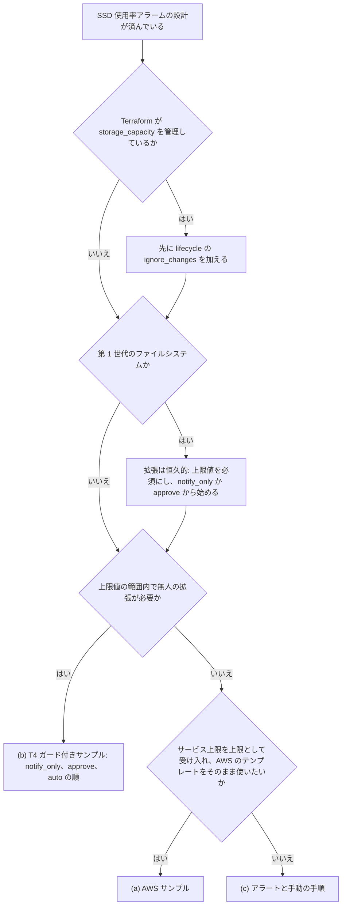

# Amazon FSx for NetApp ONTAP の監視を起点にした容量自動化

🌐 **日本語**（本ページ）| [English](../en/capacity-automation.md)

> **ステータス / 対象読者 / 証拠の階層**
>
> ステータスは設計です。ガード付き SSD 自動拡張サンプル（T4）は `terraform/fsxn-ssd-auto-increase/` に実装済みでオフライン検証済みです。元に戻せる経路は 2026-10-09 に第 1 世代のファイルシステム 1 つで実行しました（[記録](verification-results-cloudwatch-monitoring.md#2026-10-09-の-terraform-ssd-自動拡張モジュールの実行)）。実際の拡張と、本ページのほかの選択肢は、ファイルシステムに対して実行していません。対象読者は、Amazon FSx for NetApp ONTAP の監視を自動で動かすかどうか、どこまで動かすかを決める AWS ユーザーです。T4 の状態遷移、アーカイブのスキーマ、IAM のステートメント、テスト計画は別ページの [T4 の実装設計](capacity-automation-t4-design.md) にあります。証拠の階層は次の 5 つです。`文書化済み`（引用した AWS または NetApp のページに記載。2026-10-07 に再読）、`コード確認済み`（2026-10-07 にダウンロードした AWS サンプルのコードを読んだもので、実行していない）、`検証済み`（[CloudWatch 監視の動作確認結果](verification-results-cloudwatch-monitoring.md) に日付付きの記録がある）、`仮説`（推論で、確認していない）、`未解決`（読んだどの資料にも答えがない）。値はプレースホルダー（`fs-0123456789abcdef0`、`123456789012`、`ap-northeast-1`）です。

## エグゼクティブサマリ

SSD 容量のアラームを受けて動かす方法は 3 つあります。(a) AWS の動的スケーリングのサンプルをそのまま使う、(b) 本リポジトリの T4 ガード付きサンプル（実装済み・オフライン検証済み、元に戻せる経路は 2026-10-09 に実環境で検証済み）を使う、(c) アラートと手動の手順にする、のいずれかです。主な違いは、上限を誰が決め、変更を誰が承認するかです。第 1 世代のファイルシステムでは拡張のたびに恒久的に残り、SSD 容量・IOPS・スループットのどれを変えても共有の 6 時間のクールダウンが始まるので、反応の速さより上限と承認の段階の方が重要になります。T4 は必須の上限値、既定の `notify_only`、1 つのファイルシステムに絞った IAM を加えます。自動化を選ぶチームのためのもので、既定で有効にするものではありません。スループットキャパシティの変更は、変更のたびにファイルサーバーがフェイルオーバーするので、アラートと人が承認する手順のままにします。ボリュームの autosize は ONTAP で設定し、EMS のログアラームで監視します。AWS のボリューム API には autosize のフィールドがありません（[UpdateOntapVolumeConfiguration](https://docs.aws.amazon.com/fsx/latest/APIReference/API_UpdateOntapVolumeConfiguration.html)、`文書化済み`）。

> **範囲に関する補足**
>
> いつ発火させるかを決める閾値とヘッドルームの式は [sizing-and-headroom.md](sizing-and-headroom.md) にあります。本ページはアラームを受けて何が動くかを扱います。セキュリティ対応（ユーザーや IP の遮断）は別の話題で、[automated-response-guide.md](automated-response-guide.md) にあります。

## 自動化の対象と対象外

| 層 | API | 元に戻せるか | 本プロジェクトの選択 |
|---|---|---|---|
| SSD ストレージ容量 | `UpdateFileSystem` の `StorageCapacity` | 第 1 世代は不可。第 2 世代は可能だが、縮小は数時間から数週間かかり、その間は両方のサイズで課金される | ガード付きサンプル T4（実装済み。元に戻せる経路は実環境で検証済み、実際の拡張は未実行） |
| プロビジョンド SSD IOPS | `UpdateFileSystem` の `OntapConfiguration.DiskIopsConfiguration` | 変更は 6 時間のクールダウンを共有する | SSD の拡張に必要な範囲でのみ T4 の中で扱う |
| スループットキャパシティ | `UpdateFileSystem` の `ThroughputCapacity` または `ThroughputCapacityPerHAPair` | クールダウン後に再度変更すれば可能。変更のたびにファイルサーバーがフェイルオーバーする | アラートと人が承認する手順 |
| ボリュームサイズ | `UpdateVolume` の `SizeInMegabytes` | 可能 | 手動または Terraform |
| ボリュームの autosize | ONTAP CLI の `volume autosize` または REST の `PATCH /api/storage/volumes/{uuid}`。AWS API にはない | 無効化は `-mode off` で可能。以後の自動変更が止まり、現在のサイズはそのまま残る。すでに行われた拡張を戻すには、別途ボリュームのサイズ変更（`UpdateVolume` の `SizeInMegabytes` または ONTAP の `volume size`）が必要で、ボリュームが保持するデータ量より小さくはできない | ONTAP の手順と EMS のログアラーム |

出典は [storage-capacity-and-IOPS](https://docs.aws.amazon.com/fsx/latest/ONTAPGuide/storage-capacity-and-IOPS.html)、[managing-throughput-capacity](https://docs.aws.amazon.com/fsx/latest/ONTAPGuide/managing-throughput-capacity.html)、[enable-volume-autosizing](https://docs.aws.amazon.com/fsx/latest/ONTAPGuide/enable-volume-autosizing.html) です（いずれも `文書化済み`）。

## 不可逆性とクールダウン

| 事実 | 自動化への影響 | 出典 |
|---|---|---|
| 第 1 世代のファイルシステムは SSD 容量を拡張しかできない | 自動で拡張した分は、ファイルシステムを削除するまで残る | [storage-capacity-and-IOPS](https://docs.aws.amazon.com/fsx/latest/ONTAPGuide/storage-capacity-and-IOPS.html) |
| 第 2 世代の縮小は数時間から数週間かかり、既存と要求したサイズの両方で課金される（10 TiB → 5 TiB の間は 15 TiB で課金）。1 回の縮小は 9% 以上、縮小後の使用率は 80% 以下、HA ペアあたり最小 1,024 GiB、ボリュームごとに最大 60 秒の I/O 停止、SnapLock・FlexClone・オフラインのボリューム・スナップショットのない DP ボリュームがあると不可 | 自動拡張を戻すのは課金を伴う長い操作で、取り消しではない | [storage-capacity-and-IOPS](https://docs.aws.amazon.com/fsx/latest/ONTAPGuide/storage-capacity-and-IOPS.html) |
| SSD 容量・プロビジョンド IOPS・スループットキャパシティのいずれかを変えたら、どれかを再び変えるまで 6 時間以上待つ | SSD の自動拡張はスループットの変更を 6 時間止め、その逆も起きる | [storage-capacity-and-IOPS](https://docs.aws.amazon.com/fsx/latest/ONTAPGuide/storage-capacity-and-IOPS.html)、[managing-throughput-capacity](https://docs.aws.amazon.com/fsx/latest/ONTAPGuide/managing-throughput-capacity.html) |
| 第 1 世代はスループットと SSD/IOPS の要求を互いにキューに入れる。第 2 世代は同時実行もキュー投入もできない | API を呼ぶ前に `AdministrativeActions` を読む | [managing-throughput-capacity](https://docs.aws.amazon.com/fsx/latest/ONTAPGuide/managing-throughput-capacity.html) |
| SSD の拡張は 1 回につき現在の容量の 10% 以上で、ファイルシステムの構成ごとの最大値まで（第 1 世代は 192 TiB） | 切り上げる。切り捨てた目標値は最小幅を下回ることがあり、最大値を超える上限値は拒否される | [storage-capacity-and-IOPS](https://docs.aws.amazon.com/fsx/latest/ONTAPGuide/storage-capacity-and-IOPS.html)、[クォータ](https://docs.aws.amazon.com/fsx/latest/ONTAPGuide/limits.html) |
| 新しい容量は通常数分以内に使えるようになり、バックグラウンドのストレージ最適化は通常数時間かかる。その間、更新は `UPDATED_OPTIMIZING` と表示される | 完了は、API の応答や新しい容量の値ではなく、`AdministrativeActions` が `COMPLETED` になったことから報告する | [storage-capacity-and-IOPS](https://docs.aws.amazon.com/fsx/latest/ONTAPGuide/storage-capacity-and-IOPS.html)、[monitoring storage capacity increases](https://docs.aws.amazon.com/fsx/latest/ONTAPGuide/monitoring-storage-capacity-increase.html) |

> **不可逆性に関する補足**
>
> HA ペア 1 つの第 1 世代ファイルシステムで 1,024 GiB を 10% 自動拡張すると、少なくとも 103 GiB が加わり、ファイルシステムを削除するまで課金が続きます。まず `notify_only` か IAM で拒否する対照実行で経路を確かめてください（検証計画を参照）。

> **コストに関する補足**
>
> 本ページのために価格は調べていません。第 2 世代の縮小は完了まで両方のサイズで課金されるので、意図しない拡張は戻す方が拡張より高くつきます。リージョンと日付を決めて最新の [FSx for ONTAP の料金ページ](https://aws.amazon.com/fsx/netapp-ontap/pricing/) を参照してください。

## 自動化の選択肢

| 観点 | (a) AWS サンプルをそのまま使う | (b) T4 ガード付きサンプル（実装済み、元に戻せる経路は実環境で検証済み） | (c) アラートと手動の手順 |
|---|---|---|---|
| 準備 | CloudFormation テンプレートをデプロイし、Lambda の zip を自分のバケットにアップロード | Terraform モジュール `terraform/fsxn-ssd-auto-increase/` | T1 またはダッシュボードテンプレートのアラームと手順書 |
| IaC の形 | CloudFormation | Terraform。CloudFormation 版は計画なし | 任意 |
| 上限 | デプロイタイプごとのサービス上限（`コード確認済み`） | 必須の絶対上限値（GiB、既定値なし）。デプロイ時と実行時にサービス上限と照合する | 運用者が毎回決める |
| 承認 | なし。アラームで動く | `notify_only`（既定）、`approve`、`auto` | 常に人 |
| クールダウンで止められている間 | EventBridge Scheduler で再試行（`MaxRetryAttempts` 12、`RetryDelayMinutes` 5） | 延期して次に実行できる時刻を報告。アラームが ALARM の間は 1 時間ごとに再評価し、クールダウン明けから最大 1 時間の遅れが加わる（[ヘッドルームの式](sizing-and-headroom.md#ヘッドルームの式) の `T_recheck`） | 運用者が待つ |
| IAM の範囲 | `fsx:UpdateFileSystem` と `fsx:DescribeFileSystems` を `"*"` に対して（`コード確認済み`） | 1 つのファイルシステム ARN に対する `fsx:UpdateFileSystem`（このアクションのリソースタイプは `file-system`、`文書化済み`。ポリシーシミュレーションは計画中） | 運用者自身のロール |
| Terraform のドリフト | 扱わない（CloudFormation のサンプル） | ファイルシステムのリソースに `ignore_changes` が必要 | 変更と一緒に運用者が Terraform の値を更新する |
| 拡張幅 | 増加率に応じて 10% から `MaxIncrementPercent`（既定 100%）まで | 固定の割合を切り上げ。10% を下回らない | 運用者が決める |
| 状態 / 根拠 | AWS が公開。本ページでは `コード確認済み` として確認し、実行はしていない | `terraform/fsxn-ssd-auto-increase/` に実装済み。オフライン検証済み（`terraform test` と Lambda の単体テスト一式）。元に戻せる経路は 2026-10-09 に第 1 世代のファイルシステム 1 つで実環境で検証済みで、容量は変わっていない（[記録](verification-results-cloudwatch-monitoring.md#2026-10-09-の-terraform-ssd-自動拡張モジュールの実行)）。実際の拡張は未実行 | 本ページの手順。ここでは実行していない |

各選択肢の制約を並べます。(a) は、サービス上限を上限として受け入れ、AWS が公開するテンプレートを使いたいチームに向きます。顧客が決める上限値や承認モードはなく、CloudWatch アラームは状態の変化でしか動きません。(b) は、上限値と承認の段階が必要なチームや、ファイルシステムを Terraform で管理するチームに向きます。`terraform/fsxn-ssd-auto-increase/` に実装済みでオフライン検証済み、元に戻せる経路は実環境で検証済みで、実際の拡張はまだ実行していません。運用対象として Lambda 関数・スケジューラー・2 つの SNS トピック（トリガー用と通知用）・DynamoDB のロックテーブル・2 つのロググループ・T4 自身の判断の記録を置く既存の Object Lock のバケット（ファイルシステムのデータではない。[SnapLock ではなく S3 Object Lock を使う理由](capacity-automation-t4-design.md#faq)）が増えます。(c) はオンコール体制があり増加が遅いチームに向きます。[sizing-and-headroom.md](sizing-and-headroom.md#ヘッドルームの式) で計算したヘッドルームの範囲内で誰かが対応できることが前提です。

> **根拠に関する補足**
>
> 以下の (a) の確認は、AWS が公開するテンプレートと Lambda のコードを読んだものです。デプロイはしていません。実行時の挙動に関する記述は、AWS のページ自体に書かれているもの以外は `仮説` です。

## 選択フローチャート



## AWS サンプルの確認結果

対象は [Updating storage capacity dynamically](https://docs.aws.amazon.com/fsx/latest/ONTAPGuide/automate-storage-capacity-increase.html) とダウンロードできる 2 つのアーカイブで、2026-10-07 に読みました。選択肢を選ぶうえで関係する点は次のとおりです。

- 顧客が決める絶対上限値も、承認やドライランのモードもありません。上限はデプロイタイプごとのサービス上限で、コードに定数として持っています（`コード確認済み`）。
- IAM は `fsx:UpdateFileSystem` と `fsx:DescribeFileSystems` を `Resource: "*"` に許可しています（`コード確認済み`）。
- 3 つの拡張幅の経路のうち 2 つは `int()` で目標値を切り捨てます。割合が 10 に丸められると、1,024 GiB のファイルシステムは 1,126 GiB になり、文書化された 10% の最小幅を下回ります（`コード確認済み`）。API がこれを拒否するかは `仮説` です。
- CloudWatch がアラームアクションを呼ぶのは状態が変わったときだけです（[AlarmThatSendsEmail](https://docs.aws.amazon.com/AmazonCloudWatch/latest/monitoring/AlarmThatSendsEmail.html)、`文書化済み`）。そのため 1 回の拡張の後もアラームが ALARM のままだと、2 回目の拡張は起きません（サンプルについては `仮説`、実行していない）。
- アラームに `Aggregate` のディメンションがないので、第 2 世代・複数 HA ペアのファイルシステムでアグリゲート単位の使用率は監視されません（`コード確認済み`、影響は `仮説`）。

既定値付きのパラメータの一覧と残りの確認結果は [T4 の実装設計](capacity-automation-t4-design.md#aws-サンプルの詳細な確認結果) にあります。

## T4（ガード付き SSD 自動拡張サンプル）

状態は、`terraform/fsxn-ssd-auto-increase/` に実装済みでオフライン検証済みです。2026-10-09 に、`notify_only`、`approve`、明示的な IAM の拒否の後ろでの `auto` を実環境で検証し、容量は変わっていません（[記録](verification-results-cloudwatch-monitoring.md#2026-10-09-の-terraform-ssd-自動拡張モジュールの実行)）。実際の拡張は実行していません。`StorageCapacityUtilization`（SSD。第 2 世代は `Aggregate` ごとにも 1 つ）の CloudWatch アラームがトリガー用の SNS トピックを通して Lambda 関数を呼び出し、アラームが ALARM の間は 1 時間ごとのスケジュールで再評価します。関数は AWS API だけを呼び、VPC の外で動きます。ガードの要点は次のとおりです。

- 上限値: 既定値のない必須の絶対上限値（GiB）。デプロイ時に Terraform の変数の検証と事前条件で、実行時に要求のたびに関数が、デプロイタイプと HA ペア数ごとに文書化されたファイルシステムあたりの最大値と照合する。
- モード: `notify_only`（既定）は計算して報告するだけ。`approve` は計算したコマンドをメールで送り、人が実行する。`auto` は API を呼ぶ。
- 拡張幅: `ceil` で切り上げ、10% の最小幅を下回らず、上限値を超えない。
- 管理アクションとクールダウン: 更新やストレージ最適化が保留中か実行中（`UPDATED_OPTIMIZING` を含む）の間と、最後の SSD・IOPS・スループットの変更から 6 時間以内は要求しない。
- 範囲: `fsx:UpdateFileSystem` は 1 つのファイルシステム ARN にだけ許可する。
- 単一の実行: ファイルシステム単位の DynamoDB のロック。前の要求が受け付けられたかわからない間は 2 回目の要求を出さない。決定的なエラー（サービス上限を超える上限値、`BadRequest`、`ServiceLimitExceeded`、アクセス拒否）は `blocked` の状態に固定し、1 回だけ報告して、1 時間ごとに再試行しない。
- 進捗: `AdministrativeActions` から追う。`UPDATED_OPTIMIZING` は「容量は使用可能、最適化は実行中」として報告し、最終のレポートは `COMPLETED`・`FAILED`・`CANCELLED` まで待つ。
- 監査の記録: CloudWatch Logs の判断ログと、イベントごとに 1 つの S3 Object Lock のオブジェクト。`auto` はコンプライアンスモードの保持を必須とし、ガバナンスモードは `notify_only` と `approve` でだけ受け付ける。
- 通知: SNS のレポートはトリガー用とは別の通知用トピックに送るので、レポートが関数を呼び出すことはない。

> **安全性に関する補足**
>
> 既定を `notify_only` にしているので、モジュールをデプロイしてもファイルシステムは何も変わりません。レポートの内容が運用者の判断と一致することを確かめてから、`approve`、`auto` の順に進めてください。

> **監査に関する補足**
>
> Object Lock のガバナンスモードは改ざんに強いものの、変更できないわけではありません。`s3:BypassGovernanceRetention` を持つプリンシパルは、バイパスのヘッダーを送ればガバナンスモードで保護されたバージョンを削除したり、保持期間を短くしたりできます。コンプライアンスモードは、保持期限までルートユーザーを含むすべてのユーザーを止めます（[object-lock](https://docs.aws.amazon.com/AmazonS3/latest/userguide/object-lock.html)、`文書化済み`）。保持の取り決めと、2 つのモードを見分けるテストは [T4 の実装設計](capacity-automation-t4-design.md#判断アーカイブ) にあります。

## Terraform で管理するファイルシステムの扱い

自動化が Terraform の外で `storage_capacity` を変えると、次の `terraform plan` は元に戻す変更を提案します。`lifecycle { ignore_changes = [...] }` を使うと、Terraform は属性を外部のプロセスと共有できます。更新の計画ではその属性を無視し、作成時には使います（[lifecycle meta-argument](https://developer.hashicorp.com/terraform/language/meta-arguments/lifecycle)、`文書化済み`）。以下の属性は AWS プロバイダーのリソースに存在します（[aws_fsx_ontap_file_system](https://registry.terraform.io/providers/hashicorp/aws/latest/docs/resources/fsx_ontap_file_system)、[aws_fsx_ontap_volume](https://registry.terraform.io/providers/hashicorp/aws/latest/docs/resources/fsx_ontap_volume)、`文書化済み`）。ボリュームのリソースはサイズを `size_in_megabytes` か `size_in_bytes` のどちらかで指定するので、自分のリソースが指定している方を無視します。両方の形を示します。この設定は実環境ではまだテストしていません。

```hcl
resource "aws_fsx_ontap_file_system" "this" {
  # ... existing arguments ...

  lifecycle {
    # Automation (T4 or the AWS sample) may raise SSD capacity.
    # disk_iops_configuration is needed only when T4 may raise user-provisioned IOPS.
    ignore_changes = [storage_capacity, disk_iops_configuration]
  }
}

resource "aws_fsx_ontap_volume" "data" {
  # ... existing arguments ...

  lifecycle {
    # ONTAP volume autosize changes the size outside Terraform.
    # Variant for a volume that sets size_in_megabytes.
    ignore_changes = [size_in_megabytes]
  }
}

resource "aws_fsx_ontap_volume" "data_in_bytes" {
  # ... existing arguments ...

  lifecycle {
    # Variant for a volume that sets size_in_bytes instead.
    ignore_changes = [size_in_bytes]
  }
}
```

これがないと、第 1 世代のファイルシステムでは次の apply がサービスの許さない縮小を要求し、第 2 世代では数時間から数週間かかり両方のサイズで課金される縮小を始めます（[storage-capacity-and-IOPS](https://docs.aws.amazon.com/fsx/latest/ONTAPGuide/storage-capacity-and-IOPS.html)）。その変更をプロバイダーがどう計画し適用するかはテストしていません（`未解決`）。

> **Terraform に関する補足**
>
> この行は、ファイルシステムを構築する設定に入ります。多くの場合それは監視モジュールではなく、運用者自身の構築コードです。そのコードを持つチームと変更を計画してください。`ignore_changes` を加えた後は Terraform の値が実際の容量を表さなくなるので、現在の値は `aws fsx describe-file-systems` かデータソースから読んでください。

## ボリューム autosize の手順

1. 最初に SSD のヘッドルームを確認します。autosize が大きくするのはボリュームで、SSD 階層ではありません。SSD が満杯だと、ボリュームに空きがあっても書き込みは失敗します（[low-volume-capacity](https://docs.aws.amazon.com/fsx/latest/ONTAPGuide/low-volume-capacity.html)）。
2. ONTAP CLI で autosize を有効にします（[enable-volume-autosizing](https://docs.aws.amazon.com/fsx/latest/ONTAPGuide/enable-volume-autosizing.html)）。対象は FlexVol ボリュームだけで、最大サイズは 300 TB、既定の最大はボリュームサイズの 120% です。
3. または ONTAP REST API の `PATCH /api/storage/volumes/{uuid}` で同じフィールドを設定します（[ONTAP REST のリファレンス](https://docs.netapp.com/us-en/ontap-restapi/patch-storage-volumes-.html)）。`autosize.maximum` はバイト単位で、現在のボリュームサイズより小さくできません。
4. `volume autosize -vserver svm_name -volume vol_name` で設定を確認します。
5. EMS イベント `wafl.vol.autoSize.fail` にアラームを設定し、容量の傾向を見るために `wafl.vol.autoSize.done` も監視します（[ems-detection-capabilities.md](ems-detection-capabilities.md)）。EMS が CloudWatch Logs に届いていれば、`cloudwatch-log-alarm.yaml` でクエリを組めます。このイベント用のレシピは T3 で用意する予定です。
6. ボリューム容量アラームの閾値を grow 閾値と照らし合わせて見直します（下の補足を参照）。
7. autosize を止めるには `-mode off` を設定します。以後の自動変更が止まり、ボリュームは現在のサイズのまま残ります。以前のサイズに戻すには、別の手順としてボリュームのサイズを変更します（`UpdateVolume` の `SizeInMegabytes` または ONTAP の `volume size`）。新しいサイズは、ボリュームにすでにあるデータを収められる大きさが必要です。

```text
::> volume autosize -vserver svm_name -volume vol_name -mode grow_shrink -grow-threshold-percent 90 -maximum-size 1200GB -shrink-threshold-percent 50 -minimum-size 1000GB
::> volume autosize -vserver svm_name -volume vol_name
```

```json
{
  "autosize": {
    "mode": "grow_shrink",
    "grow_threshold": 90,
    "shrink_threshold": 50,
    "maximum": 1288490188800,
    "minimum": 1073741824000
  }
}
```

> **相互作用に関する補足**
>
> autosize でボリュームが大きくなると、ボリュームの `StorageCapacity` は増え、`StorageCapacityUtilization` は下がるはずです。そのため grow 閾値より上に設定したボリュームのアラームは、autosize が最大に達したか失敗したときにしか鳴りません。早期の警告ではなく「autosize を使い切った」というシグナルになります（`仮説`、観測していない）。早期のシグナルには EMS の失敗アラームを残してください。

## スループットキャパシティ変更の手順

トリガーは、持続するネットワークまたはディスクの使用率アラームです（閾値は [sizing-and-headroom.md](sizing-and-headroom.md#閾値の表)）。自動化は計画していません。変更のたびにファイルサーバーがフェイルオーバーし、ブロックプロトコルではクライアントのマルチパスに依存し、後の SSD 拡張を止めるクールダウンが始まるためです。

1. `AdministrativeActions` に `PENDING` や `IN_PROGRESS` のものがなく、最後の SSD・IOPS・スループットの変更から 6 時間以上たっていることを確認します。
2. メンテナンスウィンドウを確認します。メンテナンス中は変更が遅れることがあります（[managing-throughput-capacity](https://docs.aws.amazon.com/fsx/latest/ONTAPGuide/managing-throughput-capacity.html)）。
3. iSCSI と NVMe/TCP のクライアントでは、クライアント側のマルチパスを確認します。NFS と SMB のクライアントはフェイルオーバー中も同じエンドポイント IP を使い続けます。
4. デプロイタイプに有効な値を選び（[UpdateFileSystemOntapConfiguration](https://docs.aws.amazon.com/fsx/latest/APIReference/API_UpdateFileSystemOntapConfiguration.html)。表は [sizing-and-headroom.md](sizing-and-headroom.md#世代と-ha-ペア構成による違い)）、承認を得ます。
5. 変更を実行します。数分間の自動フェイルオーバーとフェイルバックが起きる前提で進めます。
6. 更新が完了するまで `AdministrativeActions` で進捗を追います。

```bash
# Example: SINGLE_AZ_1 from 128 to 256 MBps. Use a valid value for your deployment type.
aws fsx update-file-system \
  --file-system-id fs-0123456789abcdef0 \
  --ontap-configuration ThroughputCapacityPerHAPair=256 \
  --region ap-northeast-1

aws fsx describe-file-systems \
  --file-system-ids fs-0123456789abcdef0 \
  --query 'FileSystems[0].AdministrativeActions' \
  --region ap-northeast-1
```

> **世代に関する補足**
>
> 第 2 世代では、SSD や IOPS の変更中にスループットの変更を実行することもキューに入れることもできず、どちらの間も HA ペアを追加できません。第 1 世代では、要求は文書化された順序でキューに入ります（[managing-throughput-capacity](https://docs.aws.amazon.com/fsx/latest/ONTAPGuide/managing-throughput-capacity.html)）。

## 検証計画

下の表のうちデプロイ時の上限値検証の行は実行済みです（`terraform test`）。T4 の元に戻せる行は、2026-10-09 に第 1 世代・HA ペア 1 つのファイルシステム 1 つで実行しました（[記録](verification-results-cloudwatch-monitoring.md#2026-10-09-の-terraform-ssd-自動拡張モジュールの実行)）。ガバナンスモードのアーカイブの行、アーカイブの陽性対照、実際の拡張、`ignore_changes` は実行していません。T4 の各行で期待する証拠と完了条件は [T4 のテスト計画](capacity-automation-t4-design.md#テスト計画) にあります。

| テスト | 元に戻せるか | 示すこと | 2026-10-09 の結果 |
|---|---|---|---|
| T4 の `notify_only` と `approve`。`aws cloudwatch set-alarm-state` でアラームを鳴らす | 可能 | `UpdateFileSystem` を一度も呼ばずに、レポートと判断の記録が残る | ✅ 両方のモードで、呼び出しなし。アラームは `set-alarm-state` ではなく、閾値を現在の利用率より下げて鳴らした |
| `fsx:UpdateFileSystem` を IAM で明示的に拒否した状態での T4 の `auto` | アーカイブの 1 日の保持が過ぎれば可能 | 呼び出しが認可の判定まで届く。エラーは `blocked` に固定されて 1 回だけ報告され、次のスケジュール実行は呼び出しをしない | ✅ 拒否される呼び出し 1 回、`blocked` のレポート 1 通、次の実行では呼び出しもレポートもなし。オペレーターによる解除で評価し直し、再びラッチが掛かった |
| 絞った Allow の IAM ポリシーシミュレーション | 可能（読み取りだけの API） | Allow が設定したファイルシステムとトリガーのアラームにだけ一致する | ✅ デプロイした実行ロールに対して（`simulate-principal-policy`） |
| アラームが OK のときのスケジュール実行と、2 つの同時実行 | 可能 | OK の間は呼ばない。2 つの呼び出しからの API の呼び出しは多くても 1 回 | ✅ 予約済み同時実行数が 2 回の呼び出しを順番に並べた。リースの経路は別に実行した |
| デプロイ時の上限値の検証（`terraform test`）— 実行済み | 可能 | 文書化された最大値を外れる上限値で plan が失敗する | ✅ オフライン。`auto` と `GOVERNANCE` の組み合わせも実環境の plan で失敗した |
| ガバナンスモードの判断アーカイブ | 使い捨てのバケットで短い保持期間なら可能 | 記録が関数のロールとバイパスの権限を持たない ID から守られる | 未実施。使ったのはコンプライアンスモードのバケット 1 つだけ |
| コンプライアンスモードの判断アーカイブ | 保持期限（テストでは 1 日）まで不可 | `s3:BypassGovernanceRetention` を持つ ID でも記録を削除できない | ⚠️ 管理者がバイパスのヘッダーを付けた削除は拒否された。陽性対照は未実施 |
| 実際の拡張 | 第 1 世代では不可。少なくとも 10% がファイルシステムの削除まで残り、6 時間のクールダウンが始まる | `UPDATED_OPTIMIZING` を経て `COMPLETED` までの一連の流れ。明示的な承認がある場合か使い捨てのファイルシステムでのみ実行し、完了条件には含めない | 未実施 |
| 外部で変更した後の Terraform の `ignore_changes` | 使い捨てのファイルシステムでは可能 | `terraform plan` に `storage_capacity` の変更が出ない。lifecycle ブロックのない plan は縮小を提案するので、使い捨てのファイルシステムでのみ実行する | 未実施 |

## 段階的な導入

1. [sizing-and-headroom.md](sizing-and-headroom.md) でサイジングと閾値を見直します。
2. SNS 通知付きの段階的なアラームをデプロイし、サブスクリプションを確認します。
3. スループットとボリューム autosize の手順、`wafl.vol.autoSize.fail` の EMS アラームを取り入れます。
4. T4 を `notify_only` でデプロイし、数週間、そのレポートと運用者の判断を比べます。
5. `approve` に切り替えます。
6. 上限値の検証が通り、コンプライアンスモードの判断アーカイブへの書き込みが動いてその保持の確認が通り、人による判断と `blocked` の解除を担う運用者を決め、Terraform で管理するファイルシステムに `ignore_changes` を入れた後でのみ `auto` に切り替えます。切り替える前に、明示的な IAM の拒否の後ろで `auto` を試せます。その手順、ラッチの解除、アーカイブの保持の読み方は[モジュールの README](../../terraform/fsxn-ssd-auto-increase/README.ja.md#デプロイのテストと運用) にあります。

> **通知に関する補足**
>
> `approve` モードの (b) と (c) はどちらも、人が SNS のメールを受け取ることが前提です。メールサブスクリプションは受信者が確認するまで保留のままです。どちらかの選択肢に頼る前に、手順 2 ですべてのサブスクリプションを確認してください。

## FAQ とよくある誤解

**Q: 自動拡張は取り消せますか**？
A: 第 1 世代ではできません。第 2 世代では縮小で戻せますが、数時間から数週間かかり、その間は両方のサイズで課金されます（[storage-capacity-and-IOPS](https://docs.aws.amazon.com/fsx/latest/ONTAPGuide/storage-capacity-and-IOPS.html)、`文書化済み`）。

**Q: ボリュームの autosize で SSD 階層が満杯になるのを防げますか**？
A: いいえ。autosize が大きくするのはボリュームの論理サイズです。SSD の容量はファイルシステムの資源で、SSD 階層が満杯ならボリュームの空きに関係なく書き込めません。

**Q: `-mode off` にすると、autosize で大きくなったボリュームは元のサイズに戻りますか**？
A: いいえ。以後の自動変更が止まり、現在のサイズが残ります。以前のサイズに戻すのは別のボリュームのサイズ変更で、新しいサイズはボリュームにすでにあるデータを収められる大きさが必要です（正確な下限はここではテストしていません）。

**Q: スループットキャパシティを自動化しないのはなぜですか**？
A: 変更のたびにファイルサーバーがフェイルオーバーし、ブロックプロトコルでの透過性はクライアントのマルチパスに依存し、SSD 拡張を止める 6 時間のクールダウンが始まるためです（[managing-throughput-capacity](https://docs.aws.amazon.com/fsx/latest/ONTAPGuide/managing-throughput-capacity.html)、`文書化済み`）。

**Q: Terraform は自動拡張を元に戻しますか**？
A: `ignore_changes` が `storage_capacity` を含まなければ、次の plan が元に戻す変更を提案します。その plan でのプロバイダーの挙動はテストしていません（`未解決`）。

**Q: 新しい容量が表示されたら拡張は終わりですか**？
A: 容量は使えますが、AWS の説明では、ストレージ最適化が実行されている間は更新が `UPDATED_OPTIMIZING` のままで、その後に `COMPLETED` になります（[monitoring storage capacity increases](https://docs.aws.amazon.com/fsx/latest/ONTAPGuide/monitoring-storage-capacity-increase.html)、`文書化済み`）。操作が終わったと報告するのは `COMPLETED` になってからです。

**Q: AWS のサンプルは安全ではないのですか**？
A: サービス上限を上限として受け入れ、アラームを起点にした拡張を望むチームに向いています。選択肢の違いはガードの内容です。サンプルは再試行付きのクールダウンと増加率に応じた拡張幅を持ちます。T4 は上限値・承認の段階・1 つのファイルシステムに絞った IAM を加えます。実装済みでオフライン検証済み、元に戻せる経路は実環境で検証済みで、実際の拡張はまだ実行していません。

## 関連ドキュメント

- [T4 ガード付き SSD 自動拡張の実装設計](capacity-automation-t4-design.md): 選択肢 (b) の状態遷移、ロックのライフサイクル、アーカイブのスキーマ、IAM、テスト計画。
- [サイジングとヘッドルーム](sizing-and-headroom.md): 選択肢がいつ動くかを決める閾値とヘッドルームの式。
- [Amazon FSx for NetApp ONTAP の監視設計](monitoring-design.md): 4 層のインデックスで、本ページへのリンクがあります。
- [EMS イベント検知機能](ems-detection-capabilities.md): `wafl.vol.autoSize.done` と `wafl.vol.autoSize.fail`。
- [CloudWatch Log Alarm](cloudwatch-log-alarm.md): EMS ログに対するアラームのテンプレート。
- [ONTAP 監査設定ガイド](ontap-audit-setup.md): 監査ボリュームでの `volume autosize` の既存の例。
- [Updating storage capacity dynamically](https://docs.aws.amazon.com/fsx/latest/ONTAPGuide/automate-storage-capacity-increase.html): 上で確認した AWS サンプル。
- [Terraform モジュール: fsxn-monitoring-dashboard](../../terraform/fsxn-monitoring-dashboard/README.ja.md): これらの選択肢に信号を送る T1 のアラーム。
