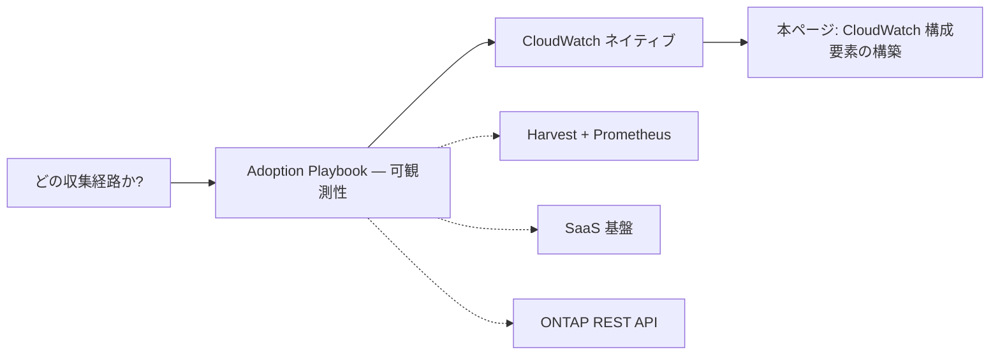

# FSx for ONTAP の監視設計

🌐 **日本語**（本ページ）| [English](../en/monitoring-design.md)

## エグゼクティブサマリ

本ページは、Amazon FSx for NetApp ONTAP を Amazon CloudWatch で監視するための**実装側インデックス**です。どの収集経路を使うべきかはここでは決めません。その選択 — CloudWatch ネイティブ、NetApp Harvest + Prometheus、SaaS オブザーバビリティ基盤、ONTAP REST API のいずれか — は [Adoption Playbook — 可観測性](https://github.com/Yoshiki0705/FSx-for-ONTAP-Adoption-Playbook/blob/main/docs/en/domains/observability/README.md)（ハブ）で行います。CloudWatch を経路として選んだ後に本ページへ来てください。本ページは、本リポジトリが提供する CloudWatch ネイティブの構成要素の作り方、その境界、そして Terraform の方針を扱います。

具体的には、`shared/templates/` 配下の 3 つの CloudFormation テンプレートが CloudWatch ネイティブ経路をカバーします。性能・容量ダッシュボード、Qtree 単位のクォータ監視、ログベースアラームです。それぞれについて、いつ使うか・なぜ存在するか・どう使うか・範囲の境界を以下に記載します。

> **範囲に関する補足**: これは経路選択の決定木ではなく、導線と組み立てのインデックスです。CloudWatch・Harvest・SaaS・ONTAP REST をまだ選んでいない場合は、上記のハブ可観測性 README から始め、その後に本ページへ戻ってください。

## このページが決めることとハブが決めることの境界

**本ページが扱うのは CloudWatch ネイティブの実装**です。どのテンプレートがどのビューを作るか、各テンプレートが到達できる範囲とできない範囲、後から Terraform 同等物をどう足すか。本ページで参照するテンプレートはすべて現時点でリポジトリに存在します。

**収集経路の選択は行いません。** メトリクスとログを CloudWatch・Harvest + Prometheus・SaaS 基盤・ONTAP REST API のどれで届けるかは、別の軸の別の決定であり、[Adoption Playbook — 可観測性](https://github.com/Yoshiki0705/FSx-for-ONTAP-Adoption-Playbook/blob/main/docs/en/domains/observability/README.md) で行います。これは [decision-tree-management-monitoring.md](decision-tree-management-monitoring.md) が管理プレーンの選択と収集経路の選択を分けているのと同じ構図です。片方だけを読むと、アーキテクチャの半分が未決定のまま残ります。

> **境界に関する補足**: 管理プレーン（ファイルシステムを管理するためにどう到達するか）と収集経路（メトリクスとログをどう集めて保存するか）は、どちらも「監視」と呼ばれるため混同しやすい概念です。本ページは両者の下流に位置します。CloudWatch を経路として選んだ前提で、その構築を扱います。

## 収集経路の選択（ハブへ委譲）

経路選択はここではなくハブにあります。2 つ目の決定木を置く代わりに、以下のポインタを使ってください。



**管理プレーン**の軸（NetApp Console 経由の System Manager、セルフホスト型コンソール、あるいは CLI と REST 直接）については [decision-tree-management-monitoring.md](decision-tree-management-monitoring.md) を参照してください。その決定木も、本ページと同様に収集経路の選択をハブへ委譲しています。

> **導線に関する補足**: 上図の実線経路（CloudWatch → 本ページ）は、本リポジトリが CloudFormation として実装している唯一の分岐です。破線の分岐は他所で実装されています — Harvest は [management-console/](../../management-console/README.md)、SaaS は 9 ベンダー統合、ONTAP REST は下記の Qtree 監視です。

## CloudWatch による監視

CloudWatch ネイティブ経路は、専有コンソールなしで ONTAP System Manager の性能・容量・クォータの各ビューに対応します。機能単位のマッピング（System Manager ビュー → CloudWatch メトリクス → テンプレート）は [native-alternative-matrix.md](native-alternative-matrix.md) にあります。本節では、そのマッピングの背後にある 3 つのテンプレートを記載します。

以下で使うメトリクスとアラームの AWS 一次情報:

- [Monitoring FSx for ONTAP with Amazon CloudWatch](https://docs.aws.amazon.com/fsx/latest/ONTAPGuide/monitoring-cloudwatch.html)
- [Creating an alarm for low primary storage](https://docs.aws.amazon.com/fsx/latest/ONTAPGuide/alarm-low-primary-storage.html)
- [FSx for ONTAP file system metrics](https://docs.aws.amazon.com/fsx/latest/ONTAPGuide/file-system-metrics.html)

> **範囲に関する補足**: AWS は FSx for ONTAP の CloudWatch メトリクスをファイルシステムメトリクスと詳細ファイルシステムメトリクスに分類しています。ファイルシステムメトリクスは `FileSystemId` ディメンションを取り、詳細メトリクスはさらに `StorageTier` と `DataType` を取ります（[file-system-metrics.html](https://docs.aws.amazon.com/fsx/latest/ONTAPGuide/file-system-metrics.html)、確信度: `文書化済み`）。ここで重要な境界は、ネイティブメトリクスに Qtree 単位・ユーザー単位のディメンションが無いことであって、ファイルシステムより下が一切測れないということではありません。下記の Qtree 監視は ONTAP REST API 経由で Qtree 粒度に到達し、ユーザー単位のアクセスには監査ログが必要です（[event-sources.md](event-sources.md) を参照）。

### 性能・容量ダッシュボード

**テンプレート**: `shared/templates/fsxn-monitoring-dashboard.yaml`

**いつ**: CloudWatch を選択済みで、IOPS・スループット・ネットワーク利用率・ストレージ容量を 1 つのダッシュボードにまとめ、容量が尽きる前にアラームを上げたいとき。

**なぜ**: AWS が CloudWatch に公開するメトリクスの範囲で、ONTAP System Manager の性能・容量ビューを代替します。日常の容量監視のために管理コンソールを開く必要がなくなります。

**どう**: 4 つのパラメータでデプロイします — `FileSystemId`、`FileSystemName`、`CapacityThresholdPercent`（既定 80）、および任意の `NotificationEmail`（指定すると Amazon Simple Notification Service（Amazon SNS）トピックとサブスクリプションを作成）。ダッシュボードは IOPS（`DataReadOperations` + `DataWriteOperations`）、スループット（`DataReadBytes` + `DataWriteBytes`）、ネットワーク利用率（`NetworkThroughputUtilization`）、容量（`StorageUsed` + `StorageCapacityUtilization`）を描画します。スタックは常に 2 つのアラームを作成します — `StorageCapacityAlarm`（`StorageCapacityUtilization` に `CapacityThresholdPercent` の閾値）と `ThroughputUtilizationAlarm`（`NetworkThroughputUtilization` に固定 80% の閾値）です。`NotificationEmail` を設定すると、SNS トピックは両方のアラームに付きます。

**レイテンシウィジェットは未実装**です（確信度: `文書化済み`）。基礎メトリクス `DataReadOperationTime` と `DataWriteOperationTime` は利用可能で、算出レイテンシは `OperationTime * 1000 / Operations` で計算できますが、ダッシュボードテンプレートはまだそのウィジェットを描画しません。これは [native-alternative-matrix.md](native-alternative-matrix.md) に記録されている唯一の明示的なギャップです。

> **レイテンシに関する補足**: AWS のメトリクスペア `DataReadOperationTime`/`DataWriteOperationTime` を対応する operation count で割ると期間平均レイテンシを算出できます（期間内で合計されるため p99 ではなく平均）。本テンプレートは現時点でそのウィジェットを描画しません。テールレイテンシが必要な場合は、これらの集約メトリクスのペアではなくリクエスト単位のテレメトリから取得してください。

> **コストに関する補足**: [CloudWatch 料金ページ](https://aws.amazon.com/cloudwatch/pricing/) を 2026-10-04 に us-east-1 で確認した時点で、CloudWatch ダッシュボードは無料枠を超えると 1 つあたり月額 $3、標準解像度のメトリクスアラームは 1 つあたり月額 約 $0.10 です（本スタックはそのアラームを 2 つ作成します）。価格は時期とリージョンで変動するため、最新のページで確認してください。SNS トピックは `NotificationEmail` を設定したときのみ作成されます。

### Qtree 単位のクォータ監視

**テンプレート**: `shared/templates/qtree-quota-monitor.yaml`

**いつ**: Qtree 単位のクォータ使用量が必要で、ファイルシステム単位の CloudWatch メトリクスでは表現できないとき。

**なぜ**: ネイティブの CloudWatch メトリクスがファイルシステムより下に到達できないギャップを埋めます。Lambda 関数が ONTAP REST API `/storage/quota/reports` をポーリングし、Qtree ごとに `FSxONTAP/Qtree` カスタムメトリクス（`QtreeQuotaUsedPercent`）を公開します。テンプレートは `QuotaThresholdPercent`（既定 85）のクォータアラームも宣言しますが、そのアラームは出荷状態では未確認です — 下記のアラームに関する補足を参照してください。

**どう**: ONTAP 管理エンドポイント IP（`OntapMgmtIp`）、ONTAP 管理者認証情報の Secrets Manager ARN、`SvmName`、VPC 配置パラメータ（`VpcId`、`SubnetIds`、`SecurityGroupId`）、`PollIntervalMinutes`（既定 5）、`QuotaThresholdPercent` でデプロイします。Lambda は `QtreeQuotaUsedPercent` を完全なディメンション集合 `SvmName` + `VolumeName` + `QtreeName` で公開するため、各 Qtree は別々の CloudWatch メトリクスになります — ただし下記の 1 回あたりの上限まで。この Qtree 単位のカスタムメトリクス経路と、ポーラー停止を検知する DLQ 深度アラームが、テンプレートを読んだ範囲で利用可能な部分です（確信度: `コード確認済み`。本ブランチに日付付きの実行記録は無いため、公開挙動は `未確認`）。

> **カバレッジに関する補足（1 回あたり 200 レコードの上限）**: 各ポーリングは `/storage/quota/reports` を `max_records=200` で要求し、Lambda は最初のページ（`data["records"]`）のみを消費して、ページングを行いません（確信度: `コード確認済み`、`qtree-quota-monitor.yaml`）。tree クォータレポートが 200 を超える SVM では、各サイクルで先頭 200 件より後のレコードにメトリクスが付かないため、「すべての Qtree」のカバレッジは SVM あたり tree クォータ 200 件までで成立します。それを超える場合は、ページングを追加・検証するまで、インベントリは部分的にしかカバーされていないものとして扱ってください。

> **ネットワークに関する補足（CloudWatch API への egress が必要）**: Lambda は VPC 内で動作し、`cloudwatch:PutMetricData` を呼びます。テンプレートが作成する interface VPC エンドポイントは Secrets Manager 用のみで、CloudWatch 用はありません。そのため、NAT ゲートウェイも CloudWatch monitoring（`com.amazonaws.<region>.monitoring`）interface エンドポイントも無いプライベートサブネットでは、認証情報の取得と ONTAP への到達はできても、メトリクスの公開が無言で失敗します（確信度: `コード確認済み`。テンプレートが宣言する `AWS::EC2::VPCEndpoint` は Secrets Manager 用の 1 つ）。CloudWatch monitoring API への経路を用意してください — NAT ゲートウェイ、または Lambda のサブネットに `com.amazonaws.<region>.monitoring` interface エンドポイント。

> **アラームに関する補足（未確認 / 現状の `QtreeQuotaAlarm` に依拠しない）**: テンプレートの `QtreeQuotaAlarm` は `Metrics` 配列もメトリクス算術式も持たず、`SvmName` ディメンションのみを選択しています。CloudWatch はメトリクスを完全なディメンション集合で識別するため、`SvmName` だけに絞ったアラームは Lambda が出す 3 ディメンションのどの系列にも一致せず、`Statistic: Maximum` は別々のディメンションを持つ Qtree 単位メトリクスを横断して集約しません（確信度: このアラームが実データで発火することは `未確認`）。テンプレートが Qtree 単位系列に対するメトリクス算術式、または Qtree 単位アラームに修正されるまで、閾値アラートは機能しないものとして扱い、`FSxONTAP/Qtree` メトリクスを直接読んでください。[native-alternative-matrix.md](native-alternative-matrix.md) の「問題の Qtree を特定する方法」は、完全な `SvmName`/`VolumeName`/`QtreeName` 識別子を `list-metrics` で列挙し、各識別子を照会します。ここで実際の値が返るのはこの照会であり（`SvmName` だけに絞った照会は、同じディメンション識別の理由で、出力されるどの系列にも一致しません）。

> **セキュリティに関する補足**: ONTAP 管理者認証情報は Lambda 環境変数ではなく AWS Secrets Manager から ARN 経由で取得します。Lambda は VPC 内から ONTAP 管理エンドポイントへ HTTPS（443）で到達し、その IP への egress を許可するセキュリティグループを付けます。出荷されている Lambda は urllib3 を `cert_reqs="CERT_NONE"` で初期化しているため、通信は暗号化されますがエンドポイント証明書は認証されません（確信度: `コード確認済み`、`qtree-quota-monitor.yaml`）。求められる封じ込めは既知の管理 IP への VPC 内経路であり、証明書検証は残作業です（ROADMAP や CONTRIBUTING の追跡項目にはまだ載っていません）。

> **IaC に関する補足**: このテンプレートは、監視ビューが ONTAP 管理プレーンを必要とする最も明確な例です。この Lambda が書き込むまで、そのデータは CloudWatch に存在しません。Terraform 同等物も同じ VPC と Secrets Manager の依存を持ちます。

### ログベースアラーム

**テンプレート**: `shared/templates/cloudwatch-log-alarm.yaml` — [cloudwatch-log-alarm.md](cloudwatch-log-alarm.md) に記載。

**いつ**: FSx for ONTAP の管理監査ログが既に CloudWatch Logs へ流れていて、メトリクスフィルターを先に作らずに Logs Insights クエリから直接アラームを上げたいとき。

**なぜ**: `AWS::CloudWatch::LogAlarm` リソース（2026 年 7 月提供）を使い、ログ内容から直接アラームを上げます — 大量削除、特権操作、不正アクセスのパターンなど。

**どう**: パラメータ・検知タイプ・デプロイスクリプトは [cloudwatch-log-alarm.md](cloudwatch-log-alarm.md) を参照してください。このリソースはリソース仕様が追いつくまで `cfn-lint` が E3006 を報告しますが、これはエラーではなく想定内です。

> **可観測性に関する補足**: 監査ログを CloudWatch Logs に入れる前提は、このテンプレートではなく syslog VPC Endpoint 経路（[syslog-vpce-setup-guide.md](syslog-vpce-setup-guide.md)）が担います。

## NetApp 公開リファレンス

NetApp は [github.com/NetApp/FSx-ONTAP-monitoring](https://github.com/NetApp/FSx-ONTAP-monitoring)（`CloudWatch-Monitoring-FSx` サブツリー）で CloudWatch 監視のリファレンス実装を公開しています。これも本リポジトリも CloudFormation ベースの serverless ソリューションであり、違いは文書化された範囲であって、デプロイ可能か対適応が要るスクリプトか、ではありません（確信度: `文書化済み`、NetApp サブツリーの README より）。NetApp リファレンスは、リージョン内の全 FSx for ONTAP ファイルシステムをカバーする単一のダッシュボードを、Lambda・3 つの EventBridge スケジューラ・ライフサイクル管理されるアラーム・IAM ロール・任意の VPC エンドポイントとともにデプロイし、Full Stack / Monitoring Only / EMS Logs Only の 3 モードを持ちます。そのダッシュボードはクライアント操作・ストレージ利用・ディスク性能・レイテンシ・ボリューム単位の統計・LUN 性能・SnapMirror ステータスにわたり、EMS メッセージを CloudWatch Logs にストリームします。本リポジトリは、より小さく範囲が固定された単一ファイルシステムのダッシュボード・Qtree クォータのポーリング・ログベースアラームを、別々の CloudFormation テンプレートに分割しています。両者は異なる起点に適し、どちらも他方の置き換えではありません。

Harvest + Prometheus 経路（ハブが CloudWatch の代わりに案内することがある経路）については、同等の NetApp 公開ツールは [NetApp Harvest](https://github.com/NetApp/harvest) で、本リポジトリでは [management-console/](../../management-console/README.md) に実装されています。Harvest は ONTAP の全メトリクス集合（プロトコル・アグリゲート・ノードの各レベル）が必要なチームに適し、CloudWatch はコレクターを運用せず AWS ネイティブの監視プレーンでメトリクスが欲しいチームに適します。

> **中立性に関する補足**: トレードオフは対称です。NetApp リファレンスリポジトリは、リージョン単位の 1 スタックで ONTAP をより広くカバーし（ボリューム・LUN・SnapMirror・EMS）、README の免責どおりアラームの後片付けは運用者に委ねます。ここのテンプレートは範囲が狭く固定で複数スタックに分割され、Qtree アラームは出荷状態では未確認です（上記のアラームに関する補足を参照）。どちらが適するかは、必要なメトリクスの広さとスタックの管理方法の好みで決まるものであり、優劣の問題ではありません。

## Terraform の方針

### 現状（正直なギャップ）

本リポジトリには現時点で `.tf` ファイルは存在しません。AWS ネイティブ経路は CloudFormation に標準化しています。Terraform 利用者向けの検証済みの構成要素は次のとおりです。

- ファイルシステム用の AWS プロバイダーリソース [`aws_fsx_ontap_file_system`](https://registry.terraform.io/providers/hashicorp/aws/latest/docs/resources/fsx_ontap_file_system)。CloudWatch は汎用の [`aws_cloudwatch_metric_alarm`](https://registry.terraform.io/providers/hashicorp/aws/latest/docs/resources/cloudwatch_metric_alarm) と [`aws_cloudwatch_dashboard`](https://registry.terraform.io/providers/hashicorp/aws/latest/docs/resources/cloudwatch_dashboard) リソースから組み立てます。
- ONTAP 側設定用の NetApp 公式 ONTAP Terraform プロバイダー [terraform-provider-netapp-ontap](https://github.com/NetApp/terraform-provider-netapp-ontap)。
- コミュニティのサンプルモジュール（監視専用ではない）[terraform-aws-fsx-netapp-ontap](https://github.com/JManzur/terraform-aws-fsx-netapp-ontap)。

上記のソース（HashiCorp AWS プロバイダーレジストリ、NetApp プロバイダーのリポジトリ、コミュニティのサンプル）を調べた範囲では、FSx for ONTAP の CloudWatch 監視を構築する専用の公開 Terraform **モジュール**は見つかりませんでした（確信度: ターンキーのモジュールが存在することは `未確認`）。これらのソースの範囲では、FSx for ONTAP の CloudWatch 監視は汎用の `aws_cloudwatch_*` リソースと FSx リソースから組み立てます。

> **検証に関する補足**: 上記 3 つの AWS プロバイダーリソースと 2 つのリポジトリは実在を確認しました。`未確認` と記しているのは具体的に「ターンキーの監視モジュールが存在する」という主張です — 調べたソースの範囲で見つからなかったという意味であり、エコシステムのどこにも存在しないという主張ではありません。

### 方針とスケルトン

本リポジトリは、AWS ネイティブ経路をどちらの IaC ツールでも表現できるよう、CloudWatch 監視テンプレートの Terraform `.tf` 同等物を追加する方針です。計画中のレイアウトは CloudFormation パラメータに 1 対 1 で対応します。

```
terraform/
  fsxn-monitoring-dashboard/
    main.tf        # aws_cloudwatch_dashboard, aws_cloudwatch_metric_alarm, aws_sns_topic
    variables.tf   # file_system_id, file_system_name, capacity_threshold_percent, notification_email
    outputs.tf     # dashboard_arn, alarm_arn, sns_topic_arn
```

variables はダッシュボードテンプレートのパラメータに対応し（`FileSystemId` → `file_system_id`、`FileSystemName` → `file_system_name`、`CapacityThresholdPercent` → `capacity_threshold_percent`、`NotificationEmail` → `notification_email`）、resources は `aws_cloudwatch_dashboard`・`aws_cloudwatch_metric_alarm`・`aws_sns_topic` です。

**`.tf` ファイルは今は作成しません。** 未検証のインフラコードを出荷することは本リポジトリの証拠規律に反します。実際の `.tf` ファイルは後の、別途検証するフェーズで扱います。記述し、実ファイルシステムに対して `terraform validate`/`plan` を実行し、レビューを経てから取り込みます。この方針は [ROADMAP.md](../../ROADMAP.md) の Phase 4「Terraform module equivalents」項目と、[CONTRIBUTING.md](../../CONTRIBUTING.md) の「Terraform equivalents of CloudFormation templates」優先項目として追跡しています。

> **IaC に関する補足**: 上記スケルトンは目標の形であって、動作するコードではありません。`terraform apply` できるものではなく、将来の貢献が満たすべき契約として扱ってください。

## 段階的な導入

CloudWatch を経路として選んだ後（ハブで決定）、次の順序で構築します。

1. 性能・容量ダッシュボード（`fsxn-monitoring-dashboard.yaml`）をデプロイし、ファイルシステム単位の IOPS・スループット・ネットワーク・容量を得る。スタックは容量アラームとスループット利用率アラームも作成する。
2. そのスタックに `NotificationEmail` を設定（または追加）し、容量アラームとスループット利用率アラームの両方が SNS トピックに届くようにする。
3. ファイルシステム単位より細かいクォータ粒度が必要なら、Qtree 単位のクォータ監視（`qtree-quota-monitor.yaml`）を追加する — これは ONTAP 管理エンドポイントへの VPC 到達性を要します。
4. 監査ログが CloudWatch Logs へ流れたら、ログベースアラーム（`cloudwatch-log-alarm.yaml`）を追加する。
5. CloudWatch のカバレッジが不十分と判明したら、ハブで経路選択を見直す（たとえば ONTAP の全メトリクス集合が必要な場合は Harvest 経路を指します）。

> **コストに関する補足**: 手順 1 と 2 はダッシュボードとその 2 つのアラームです — 単価は上記ダッシュボードのコストに関する補足（確認日付き）を参照してください。手順 3 は Lambda 呼び出しと、Lambda が必要とする VPC エンドポイントの分が加わります。予算を決める前に AWS 料金ページで最新のレートを確認してください。

## FAQ とよくある誤解

**Q: このページは CloudWatch と Harvest のどちらを使うべきか教えてくれますか?**
A: いいえ。経路選択（CloudWatch か Harvest + Prometheus か SaaS か ONTAP REST か）は [Adoption Playbook — 可観測性](https://github.com/Yoshiki0705/FSx-for-ONTAP-Adoption-Playbook/blob/main/docs/en/domains/observability/README.md) で行います。本ページは、その経路を選んだ後に CloudWatch の構成要素を作るためのものです。

**Q: これらの CloudWatch メトリクスから p99 レイテンシを取れますか?**
A: このダッシュボードからは取れません。レイテンシウィジェットを描画していないためです（確信度: `文書化済み`）。AWS のメトリクスペア `DataReadOperationTime`/`DataWriteOperationTime` をそれぞれの operation count で割れば期間平均レイテンシを算出できますが、それは p99 ではなく期間平均であり、本テンプレートはそれを計算しません。テールレイテンシにはリクエスト単位のテレメトリを使ってください。

**Q: 今すぐ `terraform apply` できる Terraform モジュールはありますか?**
A: 調べたソース（HashiCorp AWS プロバイダーレジストリ、NetApp プロバイダーのリポジトリ、コミュニティのサンプル）ではターンキーのモジュールは見つかりませんでした（確信度: 存在することは `未確認`）。これらのソースの範囲では、FSx for ONTAP の Terraform による CloudWatch 監視は、汎用の `aws_cloudwatch_*` リソースと FSx リソースから組み立てます。本リポジトリの方針は、後の別途検証するフェーズで CloudWatch テンプレートの `.tf` 同等物を追加することです。

**Q: なぜ CloudWatch は Qtree 単位のクォータ使用量を直接表示しないのですか?**
A: FSx for ONTAP のネイティブ CloudWatch メトリクスは `FileSystemId` ディメンションのみ（詳細メトリクスは `StorageTier`/`DataType` を追加）を持ち、Qtree 単位・ユーザー単位のディメンションはありません。Qtree 単位のクォータ使用量は、ONTAP REST API をポーリングしてカスタムメトリクスを公開することで到達します — それが `qtree-quota-monitor.yaml` の役割です。ただし、そのテンプレートに同梱されるクォータ閾値アラームは出荷状態では未確認です（Qtree 節のアラームに関する補足を参照）。修正されるまでは `FSxONTAP/Qtree` メトリクスを直接読んでください。

**Q: `cfn-lint` がログアラームテンプレートで E3006 を報告します — 問題ですか?**
A: いいえ。`AWS::CloudWatch::LogAlarm` は現行のリソース仕様より新しいため、そのテンプレートで E3006 が出るのは想定内であり、ブロッキングの lint 階層からは除外されています。

## 関連ドキュメント

- [管理・監視の決定木](decision-tree-management-monitoring.md) — 管理プレーンの軸（System Manager、セルフホスト型コンソール、CLI/REST）。収集経路の選択はハブへ委譲します。
- [AWS ネイティブ代替マトリクス](native-alternative-matrix.md) — 本ページの背後にある System Manager ビュー → CloudWatch メトリクス → テンプレートのマッピング。
- [System Manager GUI ガイド](system-manager-gui-guide.md) — GUI 経路と、それ自身の小さな決定フローチャート。
- [CloudWatch ログアラーム](cloudwatch-log-alarm.md) — `cloudwatch-log-alarm.yaml` テンプレートの詳細。
- [セルフホスト型管理コンソール](../../management-console/README.md) — Harvest 経路向けの NetApp Harvest 実装。
- [Adoption Playbook — 可観測性](https://github.com/Yoshiki0705/FSx-for-ONTAP-Adoption-Playbook/blob/main/docs/en/domains/observability/README.md) — 収集経路の決定を行う場所。
