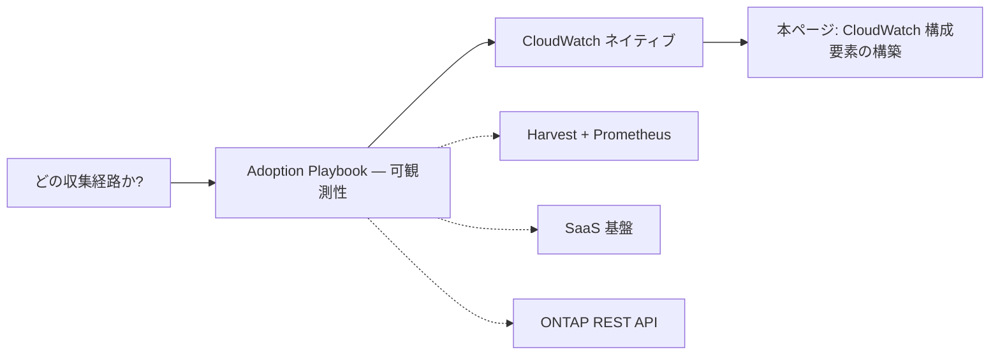

# Amazon FSx for NetApp ONTAP の監視設計

🌐 **日本語**（本ページ）| [English](../en/monitoring-design.md)

> **ステータス / 対象読者 / 証拠の階層**: ステータス — active（実装側インデックス。経路選択はハブにあります）。対象読者 — CloudWatch 収集経路を既に選び、CloudWatch ネイティブの構成要素を構築するエンジニア。本ページで用いる証拠の階層: `文書化済み`（引用した AWS または NetApp のソースに記載）、`コード確認済み`（本リポジトリのテンプレートを読んだもので、実行はしていない）、`未確認`（本ブランチに日付付きの実行記録が無い）、`仮説`（推論で、確認していない）、`未解決`（読んだどの資料にも答えがない）。2 つのスポーク、[sizing-and-headroom.md](sizing-and-headroom.md) と [capacity-automation.md](capacity-automation.md) は、日付付きの実行記録がない主張を `未解決` と書きます。本ページの `未確認` は同じ意味です。メトリクスカタログ・アラート設計・自動化の節は設計であり、検証していません。以下の各主張は階層をインラインで併記します。第 2 世代や複数 HA ペアのファイルシステムでの Qtree 監視、1 ページを超えるページング、T1 より後の Terraform のフェーズは、未検証として読むべき部分です。`検証済み`（実行し、日付付きの記録がある）は、その記録が存在する箇所にだけ使います。ログアラームの E2E 実行、第 1 世代・HA ペア 1 つのファイルシステムでダッシュボードテンプレートと Terraform T1 モジュールを実行した 2026-10-05 の記録、第 1 世代・HA ペア 1 つのファイルシステムで Qtree 監視を再実行し、4 回のポーリングとアラームの OK → ALARM → OK の経路を完了した 2026-10-06 の記録、第 1 世代・HA ペア 1 つのファイルシステムで実データを使い、テンプレートと T1 モジュールのファイルシステム容量アラームを OK から ALARM へ遷移させて OK に戻した 2026-10-06 の記録（[CloudWatch 監視の動作確認結果](verification-results-cloudwatch-monitoring.md)）です。

## エグゼクティブサマリ

本ページは、Amazon FSx for NetApp ONTAP を Amazon CloudWatch で監視するための**実装側インデックス**です。どの収集経路を使うべきかはここでは決めません。その選択 — CloudWatch ネイティブ、NetApp Harvest + Prometheus、SaaS オブザーバビリティ基盤、ONTAP REST API のいずれか — は [Adoption Playbook — 可観測性](https://github.com/Yoshiki0705/FSx-for-ONTAP-Adoption-Playbook/blob/main/docs/en/domains/observability/README.md)（ハブ）で行います。CloudWatch を経路として選んだ後に本ページへ来てください。本ページは、本リポジトリが提供する CloudWatch ネイティブの構成要素の作り方、その境界、そして Terraform の方針を扱います。

具体的には、`shared/templates/` 配下の 3 つの CloudFormation テンプレートが CloudWatch ネイティブ経路をカバーします。性能・容量ダッシュボード、Qtree 単位のクォータ監視、ログベースアラームです。Qtree 監視は、Qtree メトリクスを CloudWatch に公開することを意図した、実装済みでコード確認済みの経路です。閾値アラームは Lambda が公開する SVM 単位の最大値系列を読むようになりました（モック化した ONTAP 応答に対する単体テスト済み）。2026-10-06 に、第 1 世代・HA ペア 1 つのファイルシステムでの実環境の再実行が、連続 4 回のポーリングでそれぞれ 5 系列すべてを公開し、値は ONTAP のクォータレポートと一致しました。アラームは実データで OK から ALARM へ遷移し、OK に戻っています（[記録](verification-results-cloudwatch-monitoring.md#2026-10-06-の-qtree-クォータ監視の再実行)）。同じ日のそれより前の実行は、1 回のポーリングの後に ONTAP の HTTP 401 で停止していました。第 2 世代と複数 HA ペアのファイルシステムは未確認のままです。それぞれについて、いつ使うか・なぜ存在するか・どう使うか・範囲の境界を以下に記載します。

本ページは、監視設計の 4 つの層（サイジング、メトリクスカタログ（ネイティブとカスタム）、アラート設計、監視を起点にした自動化）のインデックスでもあります。Terraform のフェーズのうち、T1（ダッシュボードとアラーム）は実装済みで、第 1 世代・HA ペア 1 つのファイルシステムで検証済みです。T2（Qtree と SnapMirror の ONTAP REST カスタムメトリクスポーラー）、T3（ログアラーム）、T4（ガード付き SSD 自動拡張サンプル）は計画中です。SSD の自動拡張は、既定のモードが通知だけを行うガード付きサンプルとして設計し、スループットキャパシティの変更は人の承認を必要とするままにします。

> **範囲に関する補足**: これは経路選択の決定木ではなく、導線と組み立てのインデックスです。CloudWatch・Harvest・SaaS・ONTAP REST をまだ選んでいない場合は、上記のハブ可観測性 README から始め、その後に本ページへ戻ってください。

## このページが決めることとハブが決めることの境界

**本ページが扱うのは CloudWatch ネイティブの実装**です。どのテンプレートがどのビューを作るか、各テンプレートが到達できる範囲とできない範囲、ダッシュボード用 Terraform モジュール（T1）と残りの計画中の Terraform 同等物の位置付け。本ページで参照するテンプレートはすべて現時点でリポジトリに存在します。

**収集経路の選択は行いません。** メトリクスとログを CloudWatch・Harvest + Prometheus・SaaS 基盤・ONTAP REST API のどれで届けるかは、別の軸の別の決定であり、[Adoption Playbook — 可観測性](https://github.com/Yoshiki0705/FSx-for-ONTAP-Adoption-Playbook/blob/main/docs/en/domains/observability/README.md) で行います。これは [decision-tree-management-monitoring.md](decision-tree-management-monitoring.md) が管理プレーンの選択と収集経路の選択を分けているのと同じ構図です。片方だけを読むと、アーキテクチャの半分が未決定のまま残ります。

> **境界に関する補足**: 管理プレーン（ファイルシステムを管理するためにどう到達するか）と収集経路（メトリクスとログをどう集めて保存するか）は、どちらも「監視」と呼ばれるため混同しやすい概念です。本ページは両者の下流に位置します。CloudWatch を経路として選んだ前提で、その構築を扱います。

## 収集経路の選択（ハブへ委譲）

経路選択はここではなくハブにあります。2 つ目の決定木を置く代わりに、以下のポインタを使ってください。



**管理プレーン**の軸（NetApp Console 経由の System Manager、セルフホスト型コンソール、あるいは CLI と REST 直接）については [decision-tree-management-monitoring.md](decision-tree-management-monitoring.md) を参照してください。その決定木も、本ページと同様に収集経路の選択をハブへ委譲しています。

> **導線に関する補足**: 上図の実線経路（CloudWatch → 本ページ）は、本ページが扱う分岐です。本リポジトリは CloudWatch 以外にも CloudFormation を提供しており — SaaS ベンダー統合と Qtree 監視も CloudFormation です — CloudWatch は唯一の CloudFormation 分岐ではなく、ここで組み立てる分岐です。破線の分岐は他所で実装されています — Harvest は [management-console/](../../management-console/README.md)、SaaS は 9 ベンダー統合、ONTAP REST は下記の Qtree 監視です。

## 監視設計の 4 層

FSx for ONTAP の CloudWatch 監視設計は、4 つの問いに順に答えます。各層は次の層の入力になります。サイジングが上限を決め、カタログがその上限を示す系列を挙げ、アラート設計が系列を通知に変え、自動化が通知を受けて何が動くかを決めます。

| 層 | 答える問い | 場所 | 状態 |
|---|---|---|---|
| サイジングとヘッドルーム | スループットと SSD 容量はどれだけ必要か。各上限のどれだけ手前でアラームを鳴らすか | [sizing-and-headroom.md](sizing-and-headroom.md) | 設計。数値は `文書化済み` か導出 |
| メトリクスカタログ | どの系列がネイティブにあり、どれがカスタムのコレクターを必要とし、それぞれの費用はどうか | 下の [メトリクスカタログ](#メトリクスカタログ) | ネイティブと Qtree の行は実装済み。SnapMirror の行は計画中 |
| アラート設計 | どの重大度、どの欠損データの扱い、どの集約系列を使い、ポーラーが動いていることをどう知るか | 下の [アラート設計](#アラート設計) | 設計。Qtree のパターンは第 1 世代で `検証済み` |
| 監視を起点にした自動化 | アラームを受けて何が、どのガードの下で動くか | [capacity-automation.md](capacity-automation.md) | 設計。T4 は計画中で未実装 |

よくある 3 つの状況はこれらの層に対応します。HA ペア 1 つの第 1 世代ファイルシステムはアグリゲートが 1 つで SSD 容量を縮小できないため、サイジングの余裕に影響し、上限値なしの無人の拡張は選べません。2 つのファイルシステム間の SnapMirror には、転送先のファイルシステムから集めるカスタムメトリクスが必要です（メトリクスカタログ）。Terraform で管理するファイルシステムでは、容量の自動化の前に `ignore_changes` が必要です（[capacity-automation.md](capacity-automation.md#terraform-で管理するファイルシステムの扱い)）。

## サイジングとヘッドルーム

スループットキャパシティは読み取りスループットと書き込みスループットの 2 倍の合計でサイジングし、SSD 使用率は継続的に 80% 以下に保ちます（[managing-throughput-capacity](https://docs.aws.amazon.com/fsx/latest/ONTAPGuide/managing-throughput-capacity.html)、[storage-capacity-and-IOPS](https://docs.aws.amazon.com/fsx/latest/ONTAPGuide/storage-capacity-and-IOPS.html)、`文書化済み`）。SSD 使用率 90% でキャパシティプールからの読み取りが SSD にキャッシュされなくなり、98% で階層化が止まります（[managing-storage-capacity](https://docs.aws.amazon.com/fsx/latest/ONTAPGuide/managing-storage-capacity.html)、`文書化済み`）。[sizing-and-headroom.md](sizing-and-headroom.md) はこれらの規則を、計算例、6 時間のクールダウンを織り込んだヘッドルームの式、警告・重大・緊急の閾値の表に置き換えます。

## メトリクスカタログ

| 名前空間 / メトリクス群 | ディメンション | 収集方法 | ネットワークの前提 | カーディナリティ / 費用 | CloudFormation | Terraform |
|---|---|---|---|---|---|---|
| `AWS/FSx` のファイルシステム（第 1 世代。第 2 世代のファイルシステム単位も） | `FileSystemId`。詳細メトリクスは `StorageTier` + `DataType` を追加 | ネイティブ | なし | ファイルシステムごとに固定 | ダッシュボードテンプレート ✅ | T1 ✅ |
| `AWS/FSx` の第 2 世代のファイルサーバーとアグリゲート | `FileSystemId` + `FileServer`、`FileSystemId` + `Aggregate`（アグリゲート単位のストレージ使用率） | ネイティブ | なし | ファイルサーバーまたはアグリゲートごとに 1 系列 | テンプレートにはない | T1 の `file_server_names` でオプトイン（第 2 世代は `未確認`） |
| `AWS/FSx` のボリューム | `FileSystemId` + `VolumeId` | ネイティブ | なし | ボリュームごと | テンプレートにはない | T1 の `volume_ids` ✅（第 1 世代で `検証済み`） |
| `AWS/FSx` のバーストバランス（`FileServerDiskThroughputBalance`、`FileServerDiskIopsBalance`） | `FileSystemId`。スループットキャパシティ 512 MBps 未満で有効 | ネイティブ | なし | ファイルシステムごとに固定 | 未実装 | 未実装 |
| `FSxONTAP/Qtree` | `SvmName` + `VolumeName` + `QtreeName`。最大値と切り詰めの系列は `SvmName` | カスタム。VPC 内の Lambda が ONTAP REST の `/storage/quota/reports` をポーリング | 管理エンドポイントへの HTTPS 443、Secrets Manager、CloudWatch monitoring API への経路 | SVM ごとに 3 × N + 2（N は Qtree 数） | `qtree-quota-monitor.yaml` ✅（第 1 世代で `検証済み`） | T2 で計画中 |
| `FSxONTAP/SnapMirror`（計画中。T2 で名前が変わる可能性あり） | 関係ごとに `SnapMirrorRelationshipHealthy`（1/0）と `SnapMirrorLagSeconds`（`FileSystemId` + `SourcePath` + `DestinationPath`）。ファイルシステムごとに `SnapMirrorUnhealthyCount` と `SnapMirrorLagSecondsMax`（`FileSystemId`。アラームはこれを読む）。ハートビート `CollectorSucceeded`（`FileSystemId` + `Collector`） | カスタム。VPC 内の Lambda が転送先ファイルシステムで `GET /api/snapmirror/relationships` を呼ぶ | Qtree と同じ。転送先ファイルシステムごとに必要 | 転送先ファイルシステムごとに 2 × R + 2 + ハートビート 1（R は関係の数） | 計画中 | T2 で計画中 |
| `FSxONTAP/Lakehouse` | ディメンションなしのアラーム系列 | パターンのプレースホルダー。コレクターは同梱しない | コレクター次第 | コレクター次第 | `lakehouse-monitoring.yaml`（アラームのみ） | なし |
| CloudWatch Logs（EMS と監査） | ログクエリ | syslog VPC エンドポイント経路で CloudWatch Logs へ送り、ログアラーム | syslog 経路（[syslog-vpce-setup-guide.md](syslog-vpce-setup-guide.md)） | ログアラームと取り込み量ごと | `cloudwatch-log-alarm.yaml` ✅（2026-07-02 に `検証済み`） | T3 で計画中 |

ネイティブの行の出典は [file-system-metrics](https://docs.aws.amazon.com/fsx/latest/ONTAPGuide/file-system-metrics.html)、[so-file-system-metrics](https://docs.aws.amazon.com/fsx/latest/ONTAPGuide/so-file-system-metrics.html)、[volume-metrics](https://docs.aws.amazon.com/fsx/latest/ONTAPGuide/volume-metrics.html) です（`文書化済み`）。レイクハウスのプレースホルダーは [lakehouse-monitoring-patterns.md](lakehouse-monitoring-patterns.md) にあります。

> **SnapMirror の構成に関する補足**
>
> 転送先のファイルシステムをポーリングします。ONTAP REST のリファレンスは、`GET /api/snapmirror/relationships` が返すのは転送先エンドポイントが現在のクラスターまたは SVM にある関係だと説明しており、転送元は `list_destinations_only=true` で転送先の一覧を得られます（[リファレンス](https://docs.netapp.com/us-en/ontap-restapi/get-snapmirror-relationships.html)、`文書化済み`）。転送元の一覧がどの健全性・遅延のフィールドを返すかは `未解決` なので、転送元だけのポーリングは代わりになりません。転送先のファイルシステムごとに、ポーラー・認証情報・ネットワーク経路が必要です。2026-10-07 に読んだ 4 つの AWS メトリクスのページには、ネイティブの SnapMirror 関係のメトリクスはありません。SnapMirror の通信はネットワークとディスクのメトリクスに含めて数えられます。[classmethod の記事](https://dev.classmethod.jp/articles/amazon-fsx-for-netapp-ontap-snapmirror-health-cloudwatch-metrics/) と下記の NetApp のリファレンスは、同じ REST のデータから同種のメトリクスを作っています。どちらもパターンの参照で、コードは複製していません。

> **カーディナリティに関する補足**
>
> カスタムメトリクスの費用はアラームの数ではなく系列の数に比例します。SnapMirror では関係ごとの系列が R とともに増え、ファイルシステムごとの系列とハートビートは固定です。ここでは価格を示しません。リージョンと日付を決めて、最新の [CloudWatch の料金ページ](https://aws.amazon.com/cloudwatch/pricing/) からメトリクスあたりの単価を取ってください。

> **ネットワークに関する補足**
>
> このカタログのカスタムコレクターはどれも、ONTAP の管理エンドポイントへの経路を持つ VPC で動き、メトリクスを公開するには NAT ゲートウェイか `com.amazonaws.<region>.monitoring` のインターフェースエンドポイントが必要です。2026-10-06 の Qtree の実行では、このエンドポイントを手で作る必要がありました（記録の所見 QF4）。

## CloudWatch による監視

CloudWatch ネイティブ経路は、ONTAP System Manager の性能・容量の各ビューを CloudWatch に置くため、日常の監視で ONTAP System Manager を開く必要がなくなります。クォータのビューについては、Qtree メトリクスを CloudWatch に公開する、実装済みでコード確認済みの経路を本リポジトリが提供しています。2026-10-06 に第 1 世代のファイルシステムで、4 回のポーリングサイクルにわたる公開を観測し、クォータアラームが OK から ALARM へ遷移して OK に戻ることを確認しました（下記の Qtree 節を参照）。機能単位のマッピング（System Manager ビュー → CloudWatch メトリクス → テンプレート）は [native-alternative-matrix.md](native-alternative-matrix.md) にあります。本節では、そのマッピングの背後にある 3 つのテンプレートを記載します。

以下で使うメトリクスとアラームの AWS 一次情報:

- [Monitoring FSx for ONTAP with Amazon CloudWatch](https://docs.aws.amazon.com/fsx/latest/ONTAPGuide/monitoring-cloudwatch.html)
- [Creating an alarm for low primary storage](https://docs.aws.amazon.com/fsx/latest/ONTAPGuide/alarm-low-primary-storage.html)
- [FSx for ONTAP file system metrics](https://docs.aws.amazon.com/fsx/latest/ONTAPGuide/file-system-metrics.html)

> **範囲に関する補足**: AWS は FSx for ONTAP の CloudWatch メトリクスをファイルシステムメトリクスと詳細ファイルシステムメトリクスに分類しています。ファイルシステムメトリクスは `FileSystemId` ディメンションを取り、詳細メトリクスはさらに `StorageTier` と `DataType` を取ります（[file-system-metrics.html](https://docs.aws.amazon.com/fsx/latest/ONTAPGuide/file-system-metrics.html)、確信度: `文書化済み`）。ここで重要な境界は、ネイティブメトリクスに Qtree 単位・ユーザー単位のディメンションが無いことであって、ファイルシステムより下が一切測れないということではありません。下記の Qtree 監視は ONTAP REST API 経由で Qtree 粒度に到達し、ユーザー単位のアクセスには監査ログが必要です（[event-sources.md](event-sources.md) を参照）。

### 性能・容量ダッシュボード

**テンプレート**: `shared/templates/fsxn-monitoring-dashboard.yaml`

**いつ**: CloudWatch を選択済みで、IOPS・スループット・ネットワーク利用率・ストレージ容量を 1 つのダッシュボードにまとめ、容量が尽きる前にアラームを上げたいとき。

**なぜ**: AWS が CloudWatch に公開するメトリクスの範囲で、ONTAP System Manager の性能・容量ビューを代替します。日常の容量監視のために管理コンソールを開く必要がなくなります。

**どう**: 4 つのパラメータでデプロイします — `FileSystemId`、`FileSystemName`、`CapacityThresholdPercent`（既定 80）、および任意の `NotificationEmail`（指定すると Amazon Simple Notification Service（Amazon SNS）トピックとサブスクリプションを作成）。ダッシュボードは IOPS（`DataReadOperations` + `DataWriteOperations`）、スループット（`DataReadBytes` + `DataWriteBytes`）、ネットワーク利用率（`NetworkThroughputUtilization`）、容量（`StorageUsed` + `StorageCapacityUtilization`）を描画します。スタックは常に 2 つのアラームを作成します — `StorageCapacityAlarm`（`StorageCapacityUtilization` を `FileSystemId` + `StorageTier=SSD` + `DataType=All` で参照し、`CapacityThresholdPercent` の閾値）と `ThroughputUtilizationAlarm`（`NetworkThroughputUtilization` に固定 80% の閾値）です。`NotificationEmail` を設定すると、SNS トピックは両方のアラームに付きます。

**レイテンシウィジェットは未実装**です（確信度: `コード確認済み`。`fsxn-monitoring-dashboard.yaml` はレイテンシウィジェットを描画しない）。基礎メトリクス `DataReadOperationTime` と `DataWriteOperationTime` は存在し、期間平均レイテンシは `OperationTime * 1000 / Operations` で算出できます（確信度: `文書化済み`、[file-system-metrics.html](https://docs.aws.amazon.com/fsx/latest/ONTAPGuide/file-system-metrics.html)）が、ダッシュボードテンプレートはまだそのウィジェットを描画しません。[native-alternative-matrix.md](native-alternative-matrix.md) は、これをダッシュボードテンプレートの部分対応の行として記録しています。

> **レイテンシに関する補足**: AWS のメトリクスペア `DataReadOperationTime`/`DataWriteOperationTime` を対応する operation count で割ると期間平均レイテンシを算出できます（期間内で合計されるため p99 ではなく平均）。本テンプレートは現時点でそのウィジェットを描画しません。テールレイテンシが必要な場合は、これらの集約メトリクスのペアではなくリクエスト単位のテレメトリから取得してください。

> **容量ディメンションに関する補足**: AWS はファイルシステムレベルの `StorageCapacityUtilization` を `FileSystemId` + `StorageTier` + `DataType` でのみ文書化しており、第 2 世代のファイルシステムでは任意で `Aggregate` が加わります（[file-system-metrics.html](https://docs.aws.amazon.com/fsx/latest/ONTAPGuide/file-system-metrics.html)、[so-file-system-metrics.html](https://docs.aws.amazon.com/fsx/latest/ONTAPGuide/so-file-system-metrics.html)、2026-10-05 取得）。このテンプレートの以前の版は `FileSystemId` だけを指定していました。これは AWS がこのメトリクスに文書化していない組なので、容量アラームとウィジェットがどの系列にも一致せず、アラームが発報しない可能性がありました。現在のアラームとウィジェットは `FileSystemId` + `StorageTier=SSD` + `DataType=All` を指定しており、Terraform モジュールと同じ組です（確信度: `コード確認済み`、`shared/python/tests/test_monitoring_dashboard_dimensions.py` による単体テスト済み）。HA ペア 1 つの第 1 世代 `SINGLE_AZ_1` ファイルシステムでは、この系列がデータを返し、アラームは INSUFFICIENT_DATA を抜けて OK に達しました（確信度: `検証済み`、2026-10-05、[記録](verification-results-cloudwatch-monitoring.md)）。その実行ではアラームを発報させられませんでした。`CapacityThresholdPercent` の下限は 50 で、利用率は約 3.5% だったためです（記録の所見 F1）。後の実行では、第 1 世代・HA ペア 1 つのファイルシステムでテスト用ボリュームに約 472.5 GiB の実データを書き込んで SSD の利用率を 58.6% まで上げ、このアラームと Terraform の `storage_capacity` アラームが閾値 50 で OK から ALARM へ遷移して OK に戻ることを観測しました（確信度: `検証済み`、2026-10-06、[記録](verification-results-cloudwatch-monitoring.md#2026-10-06-の容量アラームの実データによる実行)）。第 2 世代の複数 HA ペアのファイルシステムで `Aggregate` なしの系列が出力されるかは `未確認` です。AWS のページは、このメトリクスがアグリゲートごとに出力されると説明しています。

> **実環境での検証に関する補足**: 2026-10-05 に、このテンプレートを `ap-northeast-1` で、HA ペア 1 つの第 1 世代 `SINGLE_AZ_1` ファイルシステムに対してデプロイしました。スタックはダッシュボードと両アラームを作成し、ダッシュボードのウィジェットの背後にある 9 つのメトリクス系列はすべて 3 時間の窓でデータポイントを返し、`StorageCapacityAlarm` と `ThroughputUtilizationAlarm` はそれぞれ約 1 分以内に INSUFFICIENT_DATA を抜けて OK に達しました（確信度: `検証済み`、[CloudWatch 監視の動作確認結果](verification-results-cloudwatch-monitoring.md)）。その実行が扱っていないのは、容量アラームの ALARM への遷移（F1）、SNS の配信（`NotificationEmail` は未指定）、第 2 世代と複数 HA ペアのファイルシステム、負荷時の挙動です。ファイルシステムはアイドル状態だったため、この実行が示すのは系列が存在して評価されることで、負荷時の挙動ではありません。ALARM への遷移は、2026-10-06 の後の実データによる実行で確認しました（上記の容量ディメンションに関する補足を参照）。SNS の配信と、他の形のファイルシステムは `未確認` のままです。2026-10-07 にデプロイしたダッシュボードのスクリーンショットで、系列はデータを返していたものの、4 つのウィジェット（Network Throughput、IOPS、Network Sent/Received、Storage Used）が生の入力を換算後の系列と同じ軸に描画し、換算後の線が 0 付近にあることがわかりました。テンプレートは現在、それらの生の行を `visible: false` で非表示にしています。アラームは影響を受けていません（[ダッシュボード表示に関する補足](verification-results-cloudwatch-monitoring.md#所見)）。

> **recovery queue に関する補足**: ボリュームを削除しても、容量アラームはすぐには解除されません。AWS は、削除した FSx for ONTAP ボリュームが ONTAP の recovery queue に置かれることを文書化しており（[Recovering deleted FSx for ONTAP volumes](https://docs.aws.amazon.com/fsx/latest/ONTAPGuide/recovering-deleted-volumes.html)）、AWS re:Post は、既定で少なくとも 12 時間そこに保持されてから完全に削除されると説明しています（[How can I recover a deleted FSx for ONTAP volume?](https://repost.aws/knowledge-center/fsx-ontap-recover-deleted-volume)）（確信度: `文書化済み`）。2026-10-06 の実データによる実行では、削除したテスト用ボリュームは SSD の使用量に数えられ続けました。アグリゲートの使用量は削除の前後とも 505.10 GiB（58.6%）です。両方の容量アラームは、queue のエントリを purge した約 3.5 分後に OK に戻りました（確信度: `検証済み`、[記録](verification-results-cloudwatch-monitoring.md#ok-への復帰と-volume-recovery-queue)）。purge は元に戻せません。purge したボリュームは queue から復旧できなくなります。purge せずに保持期間が過ぎた後の解放は観測していません。

> **コストに関する補足**: [CloudWatch 料金ページ](https://aws.amazon.com/cloudwatch/pricing/) を 2026-10-04 に us-east-1 で確認した時点で、CloudWatch ダッシュボードは無料枠を超えると 1 つあたり月額 $3、標準解像度のメトリクスアラームは 1 つあたり月額 約 $0.10 です（本スタックはそのアラームを 2 つ作成します）。価格は時期とリージョンで変動するため、最新のページで確認してください。SNS トピックは `NotificationEmail` を設定したときのみ作成されます。

### Qtree 単位のクォータ監視

**テンプレート**: `shared/templates/qtree-quota-monitor.yaml`

**いつ**: Qtree 単位のクォータ使用量が必要で、ファイルシステム単位の CloudWatch メトリクスでは表現できないとき。

**なぜ**: ネイティブの CloudWatch メトリクスが Qtree の識別子もクォータ使用量のディメンションも持たないギャップを埋めます（ファイルシステムメトリクスは `FileSystemId` を取り、詳細メトリクスは `StorageTier`/`DataType` を追加しますが、いずれも Qtree を名指しできません）。Lambda 関数は ONTAP REST API `/storage/quota/reports` をポーリングし、Qtree ごとに `FSxONTAP/Qtree` カスタムメトリクス（`QtreeQuotaUsedPercent`、`QtreeQuotaUsedBytes`、`QtreeQuotaLimitBytes`）を公開し、加えて SVM 単位の 2 つのメトリクス `QtreeQuotaUsedPercentMax` と `QtreeQuotaReportTruncated` を公開するよう書かれています（確信度: `コード確認済み`、モック化した ONTAP 応答に対する単体テスト済み。運用上の公開は、2026-10-06 に第 1 世代・HA ペア 1 つのファイルシステムで連続 4 回のポーリングサイクルについて `検証済み`（[記録](verification-results-cloudwatch-monitoring.md#2026-10-06-の-qtree-クォータ監視の再実行)）。第 2 世代と複数 HA ペアのファイルシステムは `未確認`）。テンプレートは `QtreeQuotaUsedPercentMax` に対する `QuotaThresholdPercent`（既定 85）のクォータアラームも宣言します — 下記のアラームに関する補足を参照してください。

**どう**: ONTAP 管理エンドポイント IP（`OntapMgmtIp`）、ONTAP 管理者認証情報の Secrets Manager ARN、`SvmName`、VPC 配置パラメータ（`VpcId`、`SubnetIds`、`SecurityGroupId`）、`PollIntervalMinutes`（既定 5）、`QuotaThresholdPercent`、および TLS 検証用の任意パラメータ `CaCertPath`/`CaCertLayerArn`（セキュリティに関する補足を参照）でデプロイします。Lambda は `QtreeQuotaUsedPercent`、`QtreeQuotaUsedBytes`、`QtreeQuotaLimitBytes` をそれぞれ完全なディメンション集合 `SvmName` + `VolumeName` + `QtreeName` で公開するよう書かれているため、各 Qtree は別々の CloudWatch メトリクスになります — ただし下記の 1 回あたり 10,000 レコードの上限まで。実行ごとに 1 回、`QtreeQuotaUsedPercentMax` と `QtreeQuotaReportTruncated` も `SvmName` ディメンションのみで公開します。この Qtree 単位のカスタムメトリクス経路、SVM 単位のメトリクス、DLQ 深度アラームは、このスタックのうち実装済みで `コード確認済み`、かつモック化した ONTAP 応答に対する単体テスト済み（`shared/python/tests/test_qtree_quota_monitor.py`）の部分です。日付付きの実行記録が 2 つあり、どちらも 2026-10-06 に HA ペア 1 つの第 1 世代ファイルシステムで実行したものです。最初の実行（[記録](verification-results-cloudwatch-monitoring.md#2026-10-06-の-qtree-クォータ監視の実行)）は 1 回のポーリングで 5 系列すべてを公開した後、ONTAP の HTTP 401 で停止しました。その失敗した呼び出しにより DLQ 深度アラームが ALARM に遷移しています。再実行（[記録](verification-results-cloudwatch-monitoring.md#2026-10-06-の-qtree-クォータ監視の再実行)）は、ここに記載したディメンションの組で連続 4 回のポーリングを完了し、値は ONTAP のクォータレポートと一致しました。`QtreeQuotaAlarm` は閾値 50 で OK から ALARM へ遷移し、85 で OK に戻りました（確信度: そのファイルシステムの形について `検証済み`）。第 2 世代と複数 HA ペアのファイルシステム、CA 証明書で検証する TLS、SNS の配信、1 ページを超えるページングは `未確認` です。

> **カバレッジに関する補足（1 回あたり 10,000 レコードの上限）**: 各ポーリングは `/storage/quota/reports` を 1 ページあたり `max_records=200` で要求し、ONTAP が次のリンクを返さなくなるまで `_links.next.href` をたどります。上限は 50 ページで、SVM あたり tree クォータ 10,000 レコードです（確信度: `コード確認済み`、モック化した ONTAP 応答に対する単体テスト済み。実 SVM で実行したのは 2026-10-06 の 2 回の実行とも 1 ページの場合だけで、レコード 2 件、`QtreeQuotaReportTruncated=0`。次のリンクをたどる動作と打ち切りの経路は未実行）。次のリンクが残ったまま上限で読み取りを打ち切った場合、Lambda は警告をログに出し、`QtreeQuotaReportTruncated=1`（ディメンション `SvmName`）を公開します。それ以外の成功した実行では `0` を公開します。上限を超えたレコードにはそのサイクルのメトリクスが付かないため、SVM の tree クォータが 10,000 件に近づきうる場合は `QtreeQuotaReportTruncated` > 0 でアラームを設定してください。テンプレートはこのアラームを作成しません。

> **ネットワークに関する補足（CloudWatch API への egress が必要）**: Lambda は VPC 内で動作し、`cloudwatch:PutMetricData` を呼びます。テンプレートが作成する interface VPC エンドポイントは Secrets Manager 用のみで、CloudWatch 用はありません。そのため、NAT ゲートウェイも CloudWatch monitoring（`com.amazonaws.<region>.monitoring`）interface エンドポイントも無いプライベートサブネットでは、認証情報の取得と ONTAP への到達はできても、メトリクスを公開できません（確信度: `コード確認済み`。テンプレートが宣言する `AWS::EC2::VPCEndpoint` は Secrets Manager 用の 1 つ）。`cw.put_metric_data` の呼び出しは try/except で囲まれていないため、ネットワーク障害は握り潰されず例外として送出され、呼び出しが失敗します — 下記の失敗セマンティクスに関する補足を参照してください。CloudWatch monitoring API への経路を用意してください — NAT ゲートウェイ、または Lambda のサブネットに `com.amazonaws.<region>.monitoring` interface エンドポイント。2026-10-06 の 2 回の実行とも Lambda のサブネットに NAT ゲートウェイが無く、実行ごとに手作業で作成した `monitoring` interface エンドポイント経由でメトリクスを公開しました。`shared/scripts/preflight-check.sh` はこのエンドポイントの有無を確認しません（記録の所見 QF4）。

> **失敗セマンティクスに関する補足**: `QuotaPollSchedule`（EventBridge ルール）は Lambda を非同期で呼び出すため、送出された例外（`put_metric_data` のネットワーク障害、ONTAP のタイムアウトなど）は Lambda により 2 回リトライされた後に DLQ へ配信されます（確信度: `コード確認済み`、`qtree-quota-monitor.yaml`。2026-10-06 に 1 回観測。ONTAP の HTTP 401 が 2 回リトライされ、DLQ に届き、DLQ 深度アラームが ALARM に遷移した）。ポーラーには 401/403 に対するバックオフがありません。その実行では、5 分間隔のスケジュールとリトライにより約 8 分間に失敗する Basic 認証のリクエストを 6 回送っており、ONTAP のロックアウトポリシーの下ではアカウントのロックが続きえます（記録の所見 QF2）。したがって DLQ 深度アラームは、すべてのリトライに失敗した呼び出しに対して発火するものであり、ポーリングが止まるあらゆる経路を検知するものではありません。スケジュールルールの無効化、invoke 権限の削除、その他の呼び出しが発生しない状況では、DLQ メッセージを生成せずにメトリクスが止まるため、DLQ が静かであることはポーリングが健全である証拠にはなりません。このスタックのすべてのアラームは `HasNotificationEmail` の条件下でのみ SNS アクションを付けます。`NotificationEmail` を空のままにすると、アラームは CloudWatch 上で状態遷移はしますが通知は送られません。関数のタイムアウトは 300 秒で、50 ページの逐次読み取りとバッチ化した `PutMetricData` 呼び出しに合わせています。これを超えた実行は失敗し、リトライされ、他の失敗と同じく DLQ に入ります。使用可能なハードリミットを持つ Qtree が 1 つも見つからない実行では、誤解を招く 0 ではなく `QtreeQuotaUsedPercentMax` のデータポイントを公開しません。`QtreeQuotaAlarm` は `TreatMissingData: missing` を使うため、データポイントが無いときは OK ではなく INSUFFICIENT_DATA に遷移します。

> **アラームに関する補足**: `QtreeQuotaAlarm` は `SvmName` ディメンションのみを持つ `QtreeQuotaUsedPercentMax` を読みます。Lambda はこの系列を、読み取った Qtree 全体での `QtreeQuotaUsedPercent` の最大値として実行ごとに 1 回公開するため、アラームのメトリクス名とディメンション集合は Lambda が出す系列と一致します。CloudWatch はメトリクスを完全なディメンション集合で識別するため、以前の定義（`SvmName` だけを持つ `QtreeQuotaUsedPercent`）はどの系列にも一致しませんでした。現在はテンプレート単位の単体テストが、アラームの（メトリクス, ディメンション集合）の組が Lambda の出す系列であること、以前の定義はそうでないことを検査します（確信度: `コード確認済み`、モック化した ONTAP 応答に対する単体テスト済み。2026-10-06 の第 1 世代ファイルシステムでの再実行で、アラームは実データで INSUFFICIENT_DATA から OK、ALARM、そして OK へ遷移し `検証済み`。第 2 世代と複数 HA ペアのファイルシステムは `未確認`）。このアラームが伝えるのは SVM 上のいずれかの Qtree が閾値を超えたことで、どの Qtree かは伝えません。特定には、[native-alternative-matrix.md](native-alternative-matrix.md) の「問題の Qtree を特定する方法」が完全な `SvmName`/`VolumeName`/`QtreeName` 識別子を `list-metrics` で列挙し、各識別子を照会します。

> **セキュリティに関する補足**: ONTAP 管理者認証情報は Lambda 環境変数ではなく AWS Secrets Manager から ARN 経由で取得します。Lambda は VPC 内から ONTAP 管理エンドポイントへ HTTPS（443）で到達し、その IP への egress を許可するセキュリティグループを付けます。TLS 証明書検証はオプトインです。`CaCertPath` に CA 証明書のパス（例: `/opt/certs/ontap-ca.pem`）を、`CaCertLayerArn` に PEM を含む Lambda レイヤーを設定すると、Lambda は `cert_reqs="CERT_REQUIRED"` で接続します。`CaCertPath` が空（既定）の場合は `cert_reqs="CERT_NONE"` のままで、PoC 用途に限る旨の警告をログに出すため、通信は暗号化されますがエンドポイント証明書は認証されません（確信度: `コード確認済み`、モック化した ONTAP 応答に対する単体テスト済み。実際の ONTAP 証明書での検証は `未確認`。2026-10-06 の実行は既定値を使い、PoC 用途の警告をログに出した）。Lambda が送るのは `/api/storage/quota/reports` への `GET` リクエストだけなので（確信度: `コード確認済み`）、シークレットには `fsxadmin` ではなく、読み取り専用ロールを持つ専用の ONTAP アカウントを保存できます。これは試していません。`fsxadmin` を共有する場合は、パスワードを保存しているすべてのクライアントを、リセットより前に、またはリセットと同時に更新してください。2026-10-06 の最初の実行では、リセットの少し後にポーラーの認証情報が HTTP 401 で拒否されました。可能性の高い原因は、別のクライアントが以前のパスワードでログインし続けていたことです。再実行では、そのクライアントを新たなリセットの前にスロットリングし、401 なしで 4 回のポーリングが動きました。ONTAP 側でのロックは証明していません。同じパラメータの組を別のスタックについて説明したものが [integrations/datadog/docs/ja/production-checklist.md](../../integrations/datadog/docs/ja/production-checklist.md) にあります。

> **IaC に関する補足**: このテンプレートは、監視ビューが ONTAP 管理プレーンを必要とする最も明確な例です。この Lambda が書き込むまで、そのデータは CloudWatch に存在しません。Terraform 同等物も同じ VPC と Secrets Manager の依存を持ちます。

### ログベースアラーム

**テンプレート**: `shared/templates/cloudwatch-log-alarm.yaml` — [cloudwatch-log-alarm.md](cloudwatch-log-alarm.md) に記載。

**いつ**: FSx for ONTAP の管理監査ログが既に CloudWatch Logs へ流れていて、メトリクスフィルターを先に作らずに Logs Insights クエリから直接アラームを上げたいとき。

**なぜ**: `AWS::CloudWatch::LogAlarm` リソースを使い、ログ内容から直接アラームを上げます — 大量削除、特権操作、不正アクセスのパターンなど。AWS はログクエリに対するアラームを [2026 年 7 月の What's New](https://aws.amazon.com/about-aws/whats-new/2026/07/amazon-cloudwatch-log-alarms/) で発表し、対応インターフェースに CloudFormation を挙げています。リソースは [`AWS::CloudWatch::LogAlarm` リファレンス](https://docs.aws.amazon.com/AWSCloudFormation/latest/TemplateReference/aws-resource-cloudwatch-logalarm.html) と [Alarming on logs](https://docs.aws.amazon.com/AmazonCloudWatch/latest/monitoring/Alarm-On-Logs.html) に記載されています（確信度: `文書化済み`、2026-10-04 にページを確認）。

**どう**: パラメータ・検知タイプ・デプロイスクリプトは [cloudwatch-log-alarm.md](cloudwatch-log-alarm.md) を参照してください。CloudFormation によるデプロイとスケジュールクエリの評価（INSUFFICIENT_DATA → OK）は 2026-07-02 に `ap-northeast-1` で実行済みです（確信度: `検証済み`、[E2E 検証結果（2026-07-02）](cloudwatch-log-alarm.md#e2e-検証結果2026-07-02) を参照）。

> **lint に関する補足（日付付きの観測）**: 2026-07-02 の E2E 記録には、`cfn-lint` が `AWS::CloudWatch::LogAlarm` に E3006 を報告したとありますが、その cfn-lint のバージョンは書かれていません。2026-10-04 に、本リポジトリが固定している `cfn-lint==1.56.3`（`requirements-dev.txt`）を `cloudwatch-log-alarm.yaml` に実行したところ指摘は 0 件でした。同じ環境で、存在しないリソースタイプを持つ対照テンプレートには E3006 が出ています。ブロッキングの lint 階層は引き続き E3006 を無視しています（`Makefile` の `CFN_LINT_IGNORE`）。このリソースの E3006 は、恒常的な条件ではなく cfn-lint のバージョンに依存するものとして扱ってください。

> **可観測性に関する補足**: 監査ログを CloudWatch Logs に入れる前提は、このテンプレートではなく syslog VPC Endpoint 経路（[syslog-vpce-setup-guide.md](syslog-vpce-setup-guide.md)）が担います。

## アラート設計

この節は設計の指針です。日付付きの実行記録があるのは Qtree のパターンと T1 のアラームだけです（[記録](verification-results-cloudwatch-monitoring.md)）。

重大度の段は [閾値の表](sizing-and-headroom.md#閾値の表) に従い、警告・重大・緊急の 3 つです。警告はチケットやチャットのトピックへ、重大と緊急は呼び出し用のトピックへ送ります。現時点で T1 とダッシュボードテンプレートはシグナルごとに 1 段のアラームを作るので、2 段目は別のアラームになります。

| アラームの種類 | `TreatMissingData` | 理由 |
|---|---|---|
| ネイティブのファイルシステムとボリュームのアラーム（ダッシュボードテンプレート、T1） | `missing` | ネイティブの系列が止まるのは AWS 側か設定の問題で、呼び出しをせずに INSUFFICIENT_DATA として見える |
| カスタムの集約最大値の系列（`QtreeQuotaUsedPercentMax`、計画中の `SnapMirrorUnhealthyCount` と `SnapMirrorLagSecondsMax`） | `missing` | Qtree の Lambda は使える記録がないと最大値のデータを公開しないので、アラームは誤解を招く OK ではなく INSUFFICIENT_DATA になる |
| DLQ の深さ | `notBreaching` | メッセージがないのは失敗した呼び出しがないこと |
| ポーラーのハートビート（計画中の T2、`CollectorSucceeded`） | `breaching` | 呼び出されないポーラーは何も公開しない。欠損を閾値超過として扱うことで、その沈黙をアラームに変える |

集約最大値とドリルダウンのパターンでは、アラームの数が固定されます。1 つのアラームが SVM またはファイルシステム単位の最大値を読み、発火した後はエンティティごとの系列で「どれか」を特定します。Qtree 監視はこのパターンを使っています（第 1 世代で `検証済み`、[記録](verification-results-cloudwatch-monitoring.md#2026-10-06-の-qtree-クォータ監視の再実行)）。SnapMirror のコレクターもこれを使う計画です。

DLQ の深さのアラームが捉えるのは、すべての再試行に失敗した呼び出しです。一度も呼び出されないポーラー（スケジュールの無効化、権限の削除）は捉えません。計画中のハートビートがその場合を扱います。

> **通知に関する補足**
>
> CloudWatch がアラームアクションを呼ぶのは、アラームの状態が変わったときだけです（[AlarmThatSendsEmail](https://docs.aws.amazon.com/AmazonCloudWatch/latest/monitoring/AlarmThatSendsEmail.html)、`文書化済み`）。ALARM のままのアラームが呼び出しを行うのは 1 回です。条件が続く間に再び動く必要がある自動化には独自の再評価が必要で、T4 が 1 時間ごとのスケジュールを加えるのはそのためです。SNS のメールサブスクリプションは確認されるまで保留のままです。SNS 経由の ALARM メールの配信は、[T1 モジュールの README](../../terraform/fsxn-monitoring-dashboard/README.ja.md) に記録されているとおり、本リポジトリではまだ `未確認` です。

## 監視を起点にした自動化

SSD 容量のアラームを受けて動かす方法は 3 つあります。AWS のサンプルをそのまま使う、計画中の T4 ガード付きサンプル（上限値、既定の `notify_only`、クールダウンと `AdministrativeActions` の確認、1 つのファイルシステムに絞った IAM）を使う、アラートと手動の手順にする、のいずれかです。スループットキャパシティの変更とボリュームの autosize は手順のままにします。トレードオフ、不可逆性の表、検証計画は [capacity-automation.md](capacity-automation.md) にあり、T4 の状態遷移、アーカイブのスキーマ、IAM のステートメント、テスト計画は [capacity-automation-t4-design.md](capacity-automation-t4-design.md) にあります。T4 は計画中で未実装です。

> **不可逆性に関する補足**
>
> 第 1 世代のファイルシステムでは SSD の拡張を取り消せず、SSD・IOPS・スループットのどの変更でも 6 時間のクールダウンが始まります（[storage-capacity-and-IOPS](https://docs.aws.amazon.com/fsx/latest/ONTAPGuide/storage-capacity-and-IOPS.html)、`文書化済み`）。実際の拡張の前に、通知だけの実行か IAM で拒否する対照実行で自動化を確かめてください。

## NetApp 公開リファレンス

NetApp は [github.com/NetApp/FSx-ONTAP-monitoring](https://github.com/NetApp/FSx-ONTAP-monitoring) の [CloudWatch-Monitoring-FSx サブツリー](https://github.com/NetApp/FSx-ONTAP-monitoring/tree/main/CloudWatch-Monitoring-FSx) で CloudWatch 監視のリファレンス実装を公開しています（確信度: `文書化済み`、2026-10-07 に読んだサブツリーの README と `cloudformation-template.json` より）。リージョン内の全 FSx for ONTAP ファイルシステムをカバーする単一のダッシュボードを、Lambda 関数・3 つの EventBridge スケジューラ・IAM ロール・任意の VPC エンドポイントとともにデプロイし、Full Stack / Monitoring Only / EMS Logs Only の 3 モードを持ちます。そのダッシュボードはクライアント操作・ストレージ利用・ディスク性能・レイテンシ・ボリューム単位の統計・LUN 性能・SnapMirror ステータスにわたり、EMS メッセージを CloudWatch Logs にストリームします。Lambda 関数は NetApp が所有するアカウントの ECR リポジトリから取得するコンテナイメージで、ソースはサブツリーにありません。匿名の利用状況の送信は任意で、`SendUsage` パラメータで制御し、テンプレートの既定値は `true` です。Lambda 関数はリージョン内のすべての FSx for ONTAP ファイルシステムについて 1 時間ごとにアラームを作成・更新・削除します。それらのアラームは CloudFormation の状態の外にあり、README はスタック削除後に `FSx-ONTAP` のアラームを手で削除するよう求めています。同様に Terraform の状態の外にも置かれることになります（導出）。同じリポジトリの [FSx_ONTAP_Alerting](https://github.com/NetApp/FSx-ONTAP-monitoring/tree/main/FSx_Alerting/FSx_ONTAP_Alerting) は CloudFormation と Terraform の両方でのデプロイを提供しています。本リポジトリは、より小さく範囲が固定された単一ファイルシステムのダッシュボード・Qtree クォータのポーリング・ログベースアラームを別々の CloudFormation テンプレートに分割しており、ダッシュボードは Terraform（T1）でも使えます。両者は異なる起点に適し、どちらも他方の置き換えではありません。

ほかに 2 つの公開資料を、パターンの参照として本設計に使っています。コードは複製していません。AWS は、アラームを受けて SSD 容量を拡張する CloudFormation のサンプル（[Updating storage capacity dynamically](https://docs.aws.amazon.com/fsx/latest/ONTAPGuide/automate-storage-capacity-increase.html)）と、[sizing-and-headroom.md](sizing-and-headroom.md) で使うサイジングの規則（[managing-storage-capacity](https://docs.aws.amazon.com/fsx/latest/ONTAPGuide/managing-storage-capacity.html)）を公開しています。[classmethod の記事](https://dev.classmethod.jp/articles/amazon-fsx-for-netapp-ontap-snapmirror-health-cloudwatch-metrics/)（ログの日付は 2024-11）は、スケジュール実行の Lambda 関数から SnapMirror 関係の健全性をカスタムの CloudWatch メトリクスとして公開しています。

Harvest + Prometheus 経路（ハブが CloudWatch の代わりに案内することがある経路）については、同等の NetApp 公開ツールは [NetApp Harvest](https://github.com/NetApp/harvest) で、本リポジトリでは [management-console/](../../management-console/README.md) に実装されています。Harvest は ONTAP の全メトリクス集合（プロトコル・アグリゲート・ノードの各レベル）が必要なチームに適し、CloudWatch はコレクターを運用せず AWS ネイティブの監視プレーンでメトリクスが欲しいチームに適します。

> **中立性に関する補足**: トレードオフは対称です。NetApp リファレンスリポジトリは、リージョン単位の 1 スタックで ONTAP をより広くカバーし（ボリューム・LUN・SnapMirror・EMS）、再デプロイなしで新しいファイルシステムにアラームを加え、README の免責どおりアラームの後片付けは運用者に委ねます。Lambda のソースはサブツリーにありません。ここのテンプレートは範囲が狭く固定で複数スタックに分割され、すべてのアラームを IaC の状態に置き、SnapMirror のコレクターはまだなく（T2 で計画中）、Qtree アラームが実データで発火することを観測したのは、第 1 世代・HA ペア 1 つのファイルシステムだけです（上記のアラームに関する補足を参照）。AWS のサンプルはクールダウン付きで SSD の拡張を自動化しますが、顧客が決める上限値はありません。計画中の T4 はガードを加えますが、まだ存在しません。どれが適するかは、必要なメトリクスの広さ、スタックの管理方法の好み、自動化にどこまで任せたいかで決まるものであり、どれかが上位という話ではありません。

## Terraform の方針

### IaC 参考実装

以下のソースは、本リポジトリの IaC 調査（調査日 2026-10-04）で読んだものです。カタログを正しく読めるよう、それぞれに範囲ラベルを付けています。**monitoring** は CloudWatch アラーム集合を構築するもの、**construction** はファイルシステム（SVM/ボリューム/バックアップ）を構築するが監視は含まないもの、**building-block** は監視モジュールが組み立てるプロバイダーまたはリソースです。すべて `文書化済み` として引用します — ページを読んだものであり、実行はしていません。フレーミングは right-tool-for-the-job です。各項目は異なる起点に適し、トレードオフは順位付けではなく対称に記載します。

| ソース | 範囲 | URL | 中立な一行説明 |
|---|---|---|---|
| コミュニティの AWS CDK プロジェクト `aws-cdk-fsxn-resources` | monitoring | [github.com/non-97/aws-cdk-fsxn-resources](https://github.com/non-97/aws-cdk-fsxn-resources) | AWS CDK（TypeScript）プロジェクト。monitoring construct が SNS トピックと CloudWatch アラーム集合（ファイルシステム容量 / ネットワークスループット / ファイルサーバーディスクスループット / ディスク IOPS / CPU、ボリューム単位の容量 + inode、バックアップジョブ失敗）を作成します。CloudFormation ではなく CDK のリファレンスで、リポジトリにライセンス表示がありません — パターンを参照し、コードは複製しないでください。 |
| NetApp `FSx-ONTAP-samples-scripts`（Terraform） | construction | [github.com/NetApp/FSx-ONTAP-samples-scripts/.../Terraform](https://github.com/NetApp/FSx-ONTAP-samples-scripts/tree/main/Infrastructure_as_Code/Terraform) | Apache-2.0 の Terraform 例（File Share / SQL Server / ファイルシステムデプロイ / DR レプリケーション）。ファイルシステムを構築するもので、CloudWatch 監視ではありません。 |
| コミュニティの Terraform モジュール `terraform-aws-fsx-netapp-ontap` | construction | [github.com/JManzur/terraform-aws-fsx-netapp-ontap](https://github.com/JManzur/terraform-aws-fsx-netapp-ontap) | ファイルシステム・SVM・ボリューム・管理されたセキュリティグループ・オンデマンドボリュームバックアップ用の Terraform モジュール。create-or-lookup モードを持ちます。監視リソースはありません。 |
| aws-samples `genai-bedrock-fsxontap`（terraform） | construction | [github.com/aws-samples/genai-bedrock-fsxontap/.../terraform](https://github.com/aws-samples/genai-bedrock-fsxontap/tree/main/terraform) | 多数の `.tf` ファイルのなかに `fsx.tf` を含む Bedrock + FSx for ONTAP の GenAI スタック。GenAI ワークロードの構築であり、監視モジュールではありません。 |
| コミュニティの Zenn 記事（Terraform） | construction | [zenn.dev/shikazuki/articles/5f925edb148c85](https://zenn.dev/shikazuki/articles/5f925edb148c85) | FSx for ONTAP を Terraform で構築し、SMB/NFS のマルチプロトコル共有を設定します。CloudWatch 監視はありません。 |
| AWS Storage Blog（Terraform） | construction | [aws.amazon.com/blogs/storage/deploying-amazon-fsx-for-netapp-ontap-hashicorp-terraform](https://aws.amazon.com/blogs/storage/deploying-amazon-fsx-for-netapp-ontap-hashicorp-terraform) | HashiCorp Terraform で FSx for ONTAP をデプロイするウォークスルー。構築であり、監視ではありません。 |
| Yoshiki0705 `FSx-for-ONTAP-Agentic-Access-Aware-RAG` | construction | [github.com/Yoshiki0705/FSx-for-ONTAP-Agentic-Access-Aware-RAG](https://github.com/Yoshiki0705/FSx-for-ONTAP-Agentic-Access-Aware-RAG) | FSx for ONTAP を構築する CDK リファレンス。その CloudWatch 監視は RAG アプリケーション（Lambda / CloudFront / DynamoDB）を対象としており、FSx for ONTAP のファイルシステムメトリクスではありません。 |
| NetApp `terraform-provider-netapp-ontap` | building-block | [github.com/NetApp/terraform-provider-netapp-ontap](https://github.com/NetApp/terraform-provider-netapp-ontap) | NetApp 公式の ONTAP Terraform プロバイダー — AWS プレーンが公開しないメトリクス向けの、ONTAP 内部プレーンの構成要素です。 |
| AWS プロバイダーリソース | building-block | [`aws_fsx_ontap_file_system`](https://registry.terraform.io/providers/hashicorp/aws/latest/docs/resources/fsx_ontap_file_system) · [`aws_cloudwatch_metric_alarm`](https://registry.terraform.io/providers/hashicorp/aws/latest/docs/resources/cloudwatch_metric_alarm) · [`aws_cloudwatch_dashboard`](https://registry.terraform.io/providers/hashicorp/aws/latest/docs/resources/cloudwatch_dashboard) · [`aws_sns_topic`](https://registry.terraform.io/providers/hashicorp/aws/latest/docs/resources/sns_topic) | Terraform 監視モジュールが組み立てる AWS プロバイダーのプリミティブ。 |

**正直なギャップは残ります。** 調べたソースの範囲では、FSx for ONTAP 向けのターンキーな公開 Terraform *監視* モジュールは見つかりませんでした（確信度: 存在することは `未確認`）。上記の construction リファレンスは構築であって監視ではありません。唯一の直接的な監視の先例 — コミュニティの `aws-cdk-fsxn-resources` プロジェクト — は Terraform ではなく CDK で、ライセンス表示が無いため、複製すべきアラーム集合を示す参考であって、複製するコードではありません。

ここから導かれる方針: 出荷済みの AWS ネイティブ経路は CloudFormation のままとし、`aws-cdk-fsxn-resources` の CDK アラーム集合 — ファイルシステム容量 / ネットワークスループット / ファイルサーバーディスクスループット / ディスク IOPS / CPU、ボリューム単位の容量 + inode、バックアップジョブ失敗 — を `aws_cloudwatch_metric_alarm` + `aws_cloudwatch_dashboard` + `aws_sns_topic` に移植した Terraform `.tf` 同等物を、CloudWatch 監視について追加します。既存ファイルシステムには `aws_fsx_ontap_file_system` データソースを使い、AWS プレーンが公開しない ONTAP 内部メトリクスには NetApp プロバイダーを構成要素として利用できます。後続のスケルトンと段階的計画がこれを引き継ぎます。これは [ROADMAP.md](../../ROADMAP.md) の Phase 4 と [CONTRIBUTING.md](../../CONTRIBUTING.md) の Terraform 優先項目として追跡しています。最初のフェーズ（T1）は `terraform/fsxn-monitoring-dashboard/` に実装済みで、ファイルシステム ID はデータソースで引かずに入力として受け取ります（[T1 モジュールの使い方と範囲](#t1-モジュールの使い方と範囲)を参照）。バックアップジョブ失敗（`AWS/Backup`）は T1 の範囲外です。

> **ライセンスに関する補足**: `aws-cdk-fsxn-resources` リポジトリは、About パネルにもトップレベルのツリーにもライセンス表示がありません（確信度: `文書化済み`、2026-10-04 に読んだリポジトリページより）。ライセンスが無い場合、再利用は既定で all-rights-reserved になります。どのアラームを作成するかの設計参考として扱い、本リポジトリに取り込むコードとしては扱わないでください。

> **範囲に関する補足**: classmethod のインライン CloudFormation 記事（[AWS CDK で FSx for ONTAP リソースをデプロイする](https://dev.classmethod.jp/articles/deploy-amazon-fsx-for-netapp-ontap-resources-with-aws-cdk/)）は、上記で引用した CDK プロジェクトの解説記事であり、監視リファレンスです。別の classmethod インライン CloudFormation 記事は FSx for ONTAP 周辺の環境（ネットワーク/EC2）を構築し、リポジトリを提供しないため、監視ソースではなく構築の how-to です。ログ転送（Syslog → CloudWatch Logs）の資料は別のテーマに属し、IaC リファレンスではありません。

### 現状（正直なギャップ）

本リポジトリにある Terraform モジュールは 1 つで、ダッシュボードテンプレートの T1 同等物 `terraform/fsxn-monitoring-dashboard/` です。オフラインの検査を通過しており、2026-10-05 と 2026-10-06 に HA ペア 1 つの第 1 世代ファイルシステムへ 2 回適用しました（[方針とスケルトン](#方針とスケルトン)を参照）。出荷済みの AWS ネイティブ経路は CloudFormation のままで、Qtree とログアラームのテンプレートにはまだ Terraform 同等物がありません。SnapMirror の健全性の監視と SSD 容量の自動化は、本リポジトリに Terraform の実装もデプロイできる実装もありません（T2 と T4 で計画中）。正直なギャップは外部側に残ります。ターンキーな公開監視モジュールは見つかっていません（後述）。構成要素は次のとおりで、いずれもドキュメントページで実在を確認したものです（確信度: `文書化済み`。ここでは実行していません）。

- ファイルシステム用の AWS プロバイダーリソース [`aws_fsx_ontap_file_system`](https://registry.terraform.io/providers/hashicorp/aws/latest/docs/resources/fsx_ontap_file_system)。CloudWatch は汎用の [`aws_cloudwatch_metric_alarm`](https://registry.terraform.io/providers/hashicorp/aws/latest/docs/resources/cloudwatch_metric_alarm) と [`aws_cloudwatch_dashboard`](https://registry.terraform.io/providers/hashicorp/aws/latest/docs/resources/cloudwatch_dashboard) リソースから組み立てます。
- ONTAP 側設定用の NetApp 公式 ONTAP Terraform プロバイダー [terraform-provider-netapp-ontap](https://github.com/NetApp/terraform-provider-netapp-ontap)。
- コミュニティのサンプルモジュール（監視専用ではない）[terraform-aws-fsx-netapp-ontap](https://github.com/JManzur/terraform-aws-fsx-netapp-ontap)。

上記のソース（HashiCorp AWS プロバイダーレジストリ、NetApp プロバイダーのリポジトリ、コミュニティのサンプル）を調べた範囲では、FSx for ONTAP の CloudWatch 監視を構築する専用の公開 Terraform **モジュール**は見つかりませんでした（確信度: ターンキーのモジュールが存在することは `未確認`）。これらのソースの範囲では、FSx for ONTAP の CloudWatch 監視は汎用の `aws_cloudwatch_*` リソースと `aws_fsx_ontap_file_system` リソースから組み立てます。

> **検証に関する補足**: 上記 3 つの AWS プロバイダーリソースと 2 つのリポジトリは実在を確認しました。`未確認` と記しているのは具体的に「ターンキーの監視モジュールが存在する」という主張です — 調べたソースの範囲で見つからなかったという意味であり、エコシステムのどこにも存在しないという主張ではありません。

### 方針とスケルトン

本リポジトリは、AWS ネイティブ経路をどちらの IaC ツールでも表現できるよう、CloudWatch 監視テンプレートの Terraform `.tf` 同等物を追加しています。T1 モジュールは次のレイアウトで実装済みです。

```
terraform/
  fsxn-monitoring-dashboard/
    versions.tf          # Terraform >= 1.11.0, hashicorp/aws >= 6.67.0 (lower bound)
    variables.tf         # file_system_id, file_system_name, capacity_threshold_percent, notification_email, opt-in alarm inputs
    main.tf              # aws_cloudwatch_dashboard, aws_cloudwatch_metric_alarm, aws_sns_topic (+ subscription)
    outputs.tf           # dashboard_name/arn/url, alarm ARNs, sns_topic_arn
    README.md            # inputs, outputs, deliberate differences from the template
    README.ja.md         # Japanese version of README.md
    .terraform.lock.hcl  # provider hashes for linux/darwin, amd64/arm64
    tests/               # offline terraform test files (mock provider, command = plan)
    examples/basic/      # runnable root: exact pin = 6.67.0, lock file, terraform.tfvars.example
```

variables はダッシュボードテンプレートのパラメータに対応し（`FileSystemId` → `file_system_id`、`FileSystemName` → `file_system_name`、`CapacityThresholdPercent` → `capacity_threshold_percent`、`NotificationEmail` → `notification_email`）、resources は `aws_cloudwatch_dashboard`・`aws_cloudwatch_metric_alarm`・`aws_sns_topic`・`aws_sns_topic_subscription` です。

**このモジュールはオフラインで検証済みで、第 1 世代・HA ペア 1 つのファイルシステムでは実環境でも検証済みです。** `make terraform` は `terraform fmt -check`、`terraform init -lockfile=readonly`、`terraform validate`、そしてモックプロバイダーと `command = plan` による `terraform test` を、ローカルと CI ジョブ `terraform` で実行します。2026-10-05 に、オプトインのファイルサーバーアラーム 3 つを有効にし（`file_server_names` は空）、`volume_ids` に 1 つを指定して、`ap-northeast-1` で plan と apply を実行しました。ダッシュボードとアラーム 7 つが作成され、すべてのアラームが INSUFFICIENT_DATA を抜けて OK に達し、ボリューム単位の容量アラームと inode アラームは ALARM に遷移させてから OK に戻りました（確信度: `検証済み`、[CloudWatch 監視の動作確認結果](verification-results-cloudwatch-monitoring.md)）。下記フェーズ表の T1 の実環境完了条件は、このファイルシステムの形については達成しています。その実行では、ファイルシステム容量アラームを ALARM に遷移させられませんでした。閾値の範囲 50–95 が、観測した利用率 3.5% を上回るためです。2026-10-06 の 2 回目の apply（既定のアラームのみ、`capacity_threshold_percent = 50`）では、実データで SSD の利用率を 58.6% まで上げ、`storage_capacity` が OK から ALARM へ遷移して OK に戻ることを観測しました（確信度: `検証済み`、[記録](verification-results-cloudwatch-monitoring.md#2026-10-06-の容量アラームの実データによる実行)）。引き続き `未確認` なのは、SNS の配信、`file_server_names` を指定した第 2 世代のファイルシステム、複数 HA ペアのファイルシステムです。この方針は [ROADMAP.md](../../ROADMAP.md) の Phase 4「Terraform module equivalents」項目と、[CONTRIBUTING.md](../../CONTRIBUTING.md) の「Terraform equivalents of CloudFormation templates」優先項目として追跡しています。

> **IaC に関する補足**: T1 モジュールは第 1 世代・HA ペア 1 つのファイルシステムに適用されています。2026-10-05 はアイドル状態のファイルシステムで、すべてのアラームが INSUFFICIENT_DATA を抜けました。2026-10-06 はテスト用の書き込みで容量アラームを ALARM に遷移させました。2026-10-07 は、公開した IAM ポリシーだけを持つロールで適用しました。いずれもサンプル実行で、本番での見積りではありません。形の異なるファイルシステム、特に第 2 世代や複数 HA ペアでは、まず本番以外のアカウントで `terraform plan` を実行してください。扱うのは最初のフェーズだけで、Qtree とログアラームの同等物は下記のフェーズで扱います。

### T1 モジュールの使い方と範囲

AWS プロバイダーとリージョンを与える自分のルート構成からモジュールを呼び出します。モジュールだけを取得する方法、前提条件、2026-10-07 に確認した最小の IAM 権限（[必要な IAM 権限（確認済み）](../../terraform/fsxn-monitoring-dashboard/README.ja.md#必要な-iam-権限確認済み)、ポリシーファイルは `examples/basic/iam-policy.json`）、デプロイ・確認・削除の手順は、モジュールの README の[モジュールの取得方法](../../terraform/fsxn-monitoring-dashboard/README.ja.md#モジュールの取得方法)と[使い方](../../terraform/fsxn-monitoring-dashboard/README.ja.md#使い方)にあります。`ref` はリリースのタグに固定してください。コミット SHA も使えますが、その場合は `&depth=1` を付けません。

```hcl
module "fsx_ontap_monitoring" {
  source = "github.com/Yoshiki0705/FSx-for-ONTAP-Observability-integrations//terraform/fsxn-monitoring-dashboard?ref=terraform-fsxn-monitoring-dashboard-v0.1.1&depth=1"

  file_system_id             = "fs-0123456789abcdef0"
  file_system_name           = "fsx-for-ontap-prod"
  capacity_threshold_percent = 80
  notification_email         = "ops@example.com"

  # Opt-in alarms (all off by default)
  enable_cpu_utilization_alarm = true
  volume_ids                   = ["fsvol-0123456789abcdef0"]
}
```

既定では、ダッシュボード（テンプレートと同じ 7 つのウィジェット）と、テンプレートにある 2 つのアラームを作成します。`capacity_threshold_percent` によるストレージ容量利用率アラーム（テンプレートと同じ `FileSystemId` + `StorageTier=SSD` + `DataType=All` で参照）と、`throughput_threshold_percent`（既定 80）によるネットワークスループット利用率アラームです。SNS トピックとメール購読は `notification_email` が空でないときだけ作成し、その場合は両アラームが ALARM と OK の両方で通知します。下表のアラームは有効にするまで作成しません。いずれも名前空間 `AWS/FSx` で、AWS のメトリクスページ（[ファイルシステム・第 1 世代](https://docs.aws.amazon.com/fsx/latest/ONTAPGuide/file-system-metrics.html)、[ファイルシステム・第 2 世代](https://docs.aws.amazon.com/fsx/latest/ONTAPGuide/so-file-system-metrics.html)、[ボリューム](https://docs.aws.amazon.com/fsx/latest/ONTAPGuide/volume-metrics.html)。確信度: `文書化済み`）から取っています。

| オプトインのアラーム | 有効化 | メトリクス | ディメンション |
|---|---|---|---|
| CPU 利用率 | `enable_cpu_utilization_alarm` | `CPUUtilization`（Average） | `FileSystemId`。`file_server_names` を指定すると `FileSystemId` + `FileServer` で、ファイルサーバーごとに 1 つ |
| ディスク IOPS 利用率 | `enable_disk_iops_utilization_alarm` | `FileServerDiskIopsUtilization`（Average） | CPU 利用率と同じ |
| ディスクスループット利用率 | `enable_disk_throughput_utilization_alarm` | `FileServerDiskThroughputUtilization`（Average） | CPU 利用率と同じ |
| ボリューム容量 | `volume_ids`（ボリュームごとに 1 つ） | `StorageCapacityUtilization`（Average） | `FileSystemId` + `VolumeId` |
| ボリュームの inode 利用率 | `volume_ids`（ボリュームごとに 1 つ） | メトリクス算術式 `100 * FilesUsed / FilesCapacity`（`FilesUsed` は Average、`FilesCapacity` は Maximum）。`InodeUtilization` というメトリクスは存在しない | `FileSystemId` + `VolumeId` |

このモジュールを 1 回デプロイしたときのダッシュボードとアラーム一覧の画面（第 1 世代のファイルシステム、`ap-northeast-1`、2026-10-07、表示の修正後）は、[2026-10-07 のダッシュボードとアラームの画面](verification-results-cloudwatch-monitoring.md#2026-10-07-のダッシュボードとアラームの画面)にあります。

`fsxn-monitoring-dashboard.yaml` とは、次の点を意図して変えています。

- `throughput_threshold_percent` は、テンプレートが 80 に固定しているスループットの閾値を変数にしたものです。既定値は同じです。
- `alarm_actions` に加えて `ok_actions` も設定します。テンプレートが設定するのは `AlarmActions` だけです。
- `capacity_threshold_percent` はテンプレートの 50–95 の範囲を引き継ぎます。それ以外の閾値は 1–100 を受け付けます。
- `file_system_name` の既定値は `fsx-for-ontap` です。SNS トピックはテンプレートと同じく暗号化しません。

> **ディメンションに関する補足**: 第 2 世代のファイルシステムでは、ファイルサーバーのメトリクスは `FileSystemId` + `FileServer` で文書化されており、AWS のページは複数 HA ペアのファイルシステムでも単一 HA ペア向けのメトリクスを使えるとも述べています。次のアラームが読む系列がそこに存在するかは `未確認` です。`FileSystemId` だけのネットワークスループット、`Aggregate` ディメンションを付けない容量、そして `file_server_names` が空のときのオプトインのファイルサーバーアラームです。第 2 世代では `file_server_names`（例: `FsxId0123456789abcdef0-01`）を指定し、オプトインのアラームが文書化されたディメンションの組を対象にするようにしてください。

> **コストに関する補足**: アラームとダッシュボードの単価は、上記ダッシュボードのコストに関する補足にあります。有効にしたファイルサーバーアラームは 1 つにつき標準メトリクスアラームを 1 つ（`file_server_names` 指定時はファイルサーバーごとに 1 つ）追加し、`volume_ids` の各要素は 2 つのアラームを追加します。うち 1 つは 2 つのメトリクスに対するメトリクス算術式を評価します。見積りの前に、料金ページがメトリクス算術式のアラームをどう数えるかを確認してください。ここでは新しい金額を示しません。

> **通知に関する補足**: メール購読は、SNS が送るメッセージから受信者が確認するまで保留のままです。それまでの間、アラームは CloudWatch 上で状態遷移しますが、メールは届きません。

### Terraform 実装のフェーズ

Terraform の作業は 4 フェーズに分けます。3 つは CloudWatch テンプレートの移植（T2 は SnapMirror も扱うよう範囲を広げる）で、T4 はガード付き SSD 自動拡張サンプルを加えます。各フェーズには静的な検証手順と、実環境を必要とする完了条件があります。T1 は実装済み・オフライン検証済みで、2026-10-05 に第 1 世代・HA ペア 1 つのファイルシステムで実環境の完了条件を達成しました。2026-10-06 には、ファイルシステム容量アラームも実データで OK から ALARM へ遷移させて OK に戻しています（確信度: `検証済み`、[記録](verification-results-cloudwatch-monitoring.md)）。T2、T3、T4 は未着手で、`検証済み` ではありません。タスク一覧は [ROADMAP.md](../../ROADMAP.md)（Phase 4）と [CONTRIBUTING.md](../../CONTRIBUTING.md) に置き、本節は順序と完了条件だけを示します。

| フェーズ | 範囲 | 検証 | 完了条件 |
|---|---|---|---|
| T1 — ダッシュボード + アラーム | `fsxn-monitoring-dashboard.yaml`（ダッシュボード、`StorageCapacityAlarm`、`ThroughputUtilizationAlarm`、任意の SNS）を移植し、`aws-cdk-fsxn-resources` の CDK アラーム集合をパターン参照として追加する。`aws_cloudwatch_dashboard` + `aws_cloudwatch_metric_alarm` + `aws_sns_topic` を使う | 完了: モックプロバイダーによるオフラインの `terraform fmt`/`validate`/`test`（`make terraform`、CI ジョブ `terraform`）。2026-10-05 完了: 第 1 世代の FSx for ONTAP ファイルシステムがあるアカウントに対する `terraform plan` と `apply`（[記録](verification-results-cloudwatch-monitoring.md)） | `terraform apply` でダッシュボードとすべてのアラームが作成され、実ファイルシステムに対して各アラームが INSUFFICIENT_DATA を抜けて OK に達する。2026-10-05 に第 1 世代・HA ペア 1 つのファイルシステムで達成（ダッシュボード、テンプレート同等のアラーム 2、ファイルサーバーアラーム 3、ボリューム単位のアラーム 2）。完了条件を超える範囲として、2026-10-05 にボリューム単位の 2 アラームが ALARM に達して OK に戻り、2026-10-06 にファイルシステム容量アラームも実データで同じ経路をたどった（[記録](verification-results-cloudwatch-monitoring.md#2026-10-06-の容量アラームの実データによる実行)）。未達: 第 2 世代と複数 HA ペアのファイルシステム |
| T2 — ONTAP REST カスタムメトリクスポーラー（Qtree + SnapMirror の健全性と遅延） | 2 つのコレクターを持つ VPC 内の Lambda 1 つ。`qtree` は `qtree-quota-monitor.yaml` を移植する（ONTAP 認証情報の Secrets Manager、NAT ゲートウェイまたは `com.amazonaws.<region>.monitoring` interface エンドポイントによる `cloudwatch:PutMetricData` への経路、EventBridge スケジュール、DLQ、50 ページのページングとその `QtreeQuotaReportTruncated` シグナル、`QtreeQuotaUsedPercentMax` に対する `QtreeQuotaAlarm`）。`snapmirror` は転送先ファイルシステムで `GET /api/snapmirror/relationships` をポーリングし、[メトリクスカタログ](#メトリクスカタログ) にある計画中の `FSxONTAP/SnapMirror` 系列を公開する。各コレクターは独自の try/except で動き、それぞれの `CollectorSucceeded` ハートビートを公開する | `terraform validate` と `terraform plan`。CloudFormation テンプレートは `make cfn-lint` と `make cfn-guard`（`Makefile` の `CFN_TEMPLATES`）で検査され、インラインの Lambda ハンドラは `shared/python/tests/test_qtree_quota_monitor.py` でモック化した ONTAP 応答に対して単体テストされている。移植でも同等のテストを維持し、SnapMirror のコレクターのテストを加える | 実 SVM から両方のコレクターの系列とアラームが CloudWatch で観測される。Qtree 単位の `FSxONTAP/Qtree` 系列と `QtreeQuotaUsedPercentMax` が出て `QtreeQuotaAlarm` が実データで状態遷移し、テスト用ボリュームの SnapMirror 関係を健全 → 異常 → 健全と動かしたときに `SnapMirrorUnhealthyCount` が追従する |
| T3 — ログアラームの同等物 + `wafl.vol.autoSize.fail` のレシピ | `cloudwatch-log-alarm.yaml` の同等物と、EMS イベント `wafl.vol.autoSize.fail` にアラームを付けるレシピ。前提条件付き: ログアラームに対する AWS プロバイダーの対応を確認してから着手するか、文書化されたメトリクスフィルター方式を使う | `terraform validate` と `terraform plan` | CloudWatch Logs 上の実際の管理監査ログに対し、アラームが評価され（INSUFFICIENT_DATA → OK）、一致するイベントで ALARM に達する |
| T4 — ガード付き SSD 自動拡張サンプル | [capacity-automation-t4-design.md](capacity-automation-t4-design.md) で設計したモジュール。Terraform と実行時に、文書化されたファイルシステムあたりの最大値と照合する必須の上限値、既定が `notify_only` の `mode`、10% の最小幅を守る切り上げ、`AdministrativeActions` と 6 時間のクールダウンの確認、IOPS モードの扱い、1 つのファイルシステム ARN に絞った IAM、`DescribeAlarms` によるトリガーのアラームの状態の確認、前の要求が受け付けられたかわからない間は 2 回目の要求を出さず、決定的なエラーを固定して 1 回だけ報告し、`UPDATED_OPTIMIZING` をまだ終端として扱わないファイルシステム単位のロック（`evaluating`、`calling`、`submitted`、`optimizing`、`indeterminate`、`manual_disposition_required`、`blocked`）、CloudWatch Logs の判断ログと、関数が実行時に Object Lock の既定の保持を確かめる S3 バケットへのイベントごとに 1 オブジェクトの判断アーカイブ（`auto` ではコンプライアンスモードが必須）、トリガー用とは別の通知用トピックで送る変更前後の SNS レポート、1 時間ごとの再評価 | `terraform validate` と `terraform test`。目標値の計算、すべてのガード、ロックの状態のすべての遷移（要求が遅れて見える場合、最後まで見えない場合、エラーが固定された場合、アクションが `UPDATED_OPTIMIZING` の場合を含む）の単体テスト。上限値の検証の `terraform test` | 実ファイルシステムで `notify_only` と `approve` を観測する。`fsx:UpdateFileSystem` を IAM で拒否した `auto` の実行で関数のログに `AccessDenied` が出る。IAM のポリシーシミュレーションで、絞った Allow が設定したファイルシステムの ARN とトリガーのアラームの ARN にだけ一致する。アラームが OK のときのスケジュール実行は API を呼ばない。2 つの同時呼び出しで API の呼び出しは多くても 1 回。どの評価のイベントの列も判断アーカイブに残り、オブジェクトごとのロックのモードと保持期限が設定した保持と一致する。実際の拡張は明示的な承認がある場合か、使い捨てのファイルシステムでのみ |

> **プロバイダー対応に関する補足**: HashiCorp AWS プロバイダーに `AWS::CloudWatch::LogAlarm` に相当するリソースがあるかは `未確認` です。2026-10-04 の調査では見つかりませんでしたが、存在しないことの証拠ではありません。AWS はログにアラームを付ける 2 つ目の方法として、メトリクスフィルターと標準のメトリクスアラームの組み合わせを文書化しています（[Alarming on logs](https://docs.aws.amazon.com/AmazonCloudWatch/latest/monitoring/Alarm-On-Logs.html)、確信度: `文書化済み`）。Terraform では [`aws_cloudwatch_log_metric_filter`](https://registry.terraform.io/providers/hashicorp/aws/latest/docs/resources/cloudwatch_log_metric_filter) + `aws_cloudwatch_metric_alarm` に対応します。2 つの方式は表現できる内容が異なる（Logs Insights の集約とフィルターパターン）ため、T3 ではどちらかを選び、その理由を記録します。

## 段階的な導入

CloudWatch を経路として選んだ後（ハブで決定）、次の順序で構築します。

1. [sizing-and-headroom.md](sizing-and-headroom.md) でサイジングを見直し、閾値を決める。
2. 性能・容量ダッシュボード（`fsxn-monitoring-dashboard.yaml`）をデプロイし、ファイルシステム単位の IOPS・スループット・ネットワーク・容量を得る。スタックは容量アラームとスループット利用率アラームも作成する。
3. そのスタックに `NotificationEmail` を設定（または追加）し、容量アラームとスループット利用率アラームの両方が SNS トピックに届くようにする。
4. ファイルシステム単位より細かいクォータ粒度が必要なら、Qtree 単位のクォータ監視（`qtree-quota-monitor.yaml`）を追加する — これは ONTAP 管理エンドポイントへの VPC 到達性を要します。
5. 監査ログが CloudWatch Logs へ流れたら、ログベースアラーム（`cloudwatch-log-alarm.yaml`）を追加する。
6. アラームを受けて何を動かすかを、通知だけから始めて決める（[capacity-automation.md](capacity-automation.md)）。
7. CloudWatch のカバレッジが不十分と判明したら、ハブで経路選択を見直す（たとえば ONTAP の全メトリクス集合が必要な場合は Harvest 経路を指します）。

> **コストに関する補足**: 手順 2 と 3 はダッシュボードとその 2 つのアラームです — 単価は上記ダッシュボードのコストに関する補足（確認日付き）を参照してください。手順 4 は Lambda 呼び出し、Lambda が必要とする VPC エンドポイント、CloudWatch カスタムメトリクスの分が加わります。予算を決める前に AWS 料金ページで最新のレートを確認してください。

> **カスタムメトリクスのコストに関する補足**: Qtree 監視の Lambda は Qtree ごとに 3 つの系列（`QtreeQuotaUsedPercent`、`QtreeQuotaUsedBytes`、`QtreeQuotaLimitBytes`）を書き込み、それぞれが完全な `SvmName`/`VolumeName`/`QtreeName` 識別子を持ちます。加えて SVM ごとに SVM 単位の 2 系列 `QtreeQuotaUsedPercentMax` と `QtreeQuotaReportTruncated` を書き込みます（確信度: `コード確認済み`、`qtree-quota-monitor.yaml`）。したがってカスタムメトリクスのコストは Qtree 数に比例します。メトリクス数 = SVM あたり 3 × N + 2 で、N は 1 回のポーリングで報告される Qtree 数です（ページ上限により SVM あたり最大 10,000。使用可能なレコードが無い実行では最大値系列を省くため、その実行が書く SVM 単位のデータポイントは 1 つだけ）。月額のカスタムメトリクス費用 ≈ (3 × N + 2) × リージョンと階層に応じたメトリクス 1 つあたりの月額単価。`PutMetricData` のリクエストは、ポーリング 1 回あたり ⌈(3 × N + 2) / 20⌉ 回（Lambda は 20 件ずつ送信）× 月間ポーリング回数（既定の `PollIntervalMinutes` 5 分で 8,640 回、30 日の月を仮定）が加わります。ここでは金額を示しません。メトリクス単価とリクエスト単価は、利用するリージョンの最新の [CloudWatch 料金ページ](https://aws.amazon.com/cloudwatch/pricing/) から取り、見積りには日付・リージョン・N を併記してください。

## FAQ とよくある誤解

**Q: このページは CloudWatch と Harvest のどちらを使うべきか教えてくれますか?**
A: いいえ。経路選択（CloudWatch か Harvest + Prometheus か SaaS か ONTAP REST か）は [Adoption Playbook — 可観測性](https://github.com/Yoshiki0705/FSx-for-ONTAP-Adoption-Playbook/blob/main/docs/en/domains/observability/README.md) で行います。本ページは、その経路を選んだ後に CloudWatch の構成要素を作るためのものです。

**Q: これらの CloudWatch メトリクスから p99 レイテンシを取れますか?**
A: このダッシュボードからは取れません。レイテンシウィジェットを描画していないためです（確信度: `コード確認済み`）。AWS のメトリクスペア `DataReadOperationTime`/`DataWriteOperationTime` をそれぞれの operation count で割れば期間平均レイテンシを算出できますが、それは p99 ではなく期間平均であり、本テンプレートはそれを計算しません。テールレイテンシにはリクエスト単位のテレメトリを使ってください。

**Q: 今すぐ `terraform apply` できる Terraform モジュールはありますか?**
A: はい。本リポジトリの T1 モジュール `terraform/fsxn-monitoring-dashboard/` です（[T1 モジュールの使い方と範囲](#t1-モジュールの使い方と範囲)を参照）。オフラインの検査（fmt・validate・モックプロバイダーによる `terraform test`）は通過しており、2026-10-05 には第 1 世代・HA ペア 1 つのファイルシステムに対する `apply` でダッシュボードとアラーム 7 つが作成され、すべて OK に達しました（確信度: `検証済み`、[記録](verification-results-cloudwatch-monitoring.md)）。2026-10-06 には、同じ形のファイルシステムでファイルシステム容量アラームも実データで OK から ALARM へ遷移して OK に戻りました。第 2 世代と複数 HA ペアのファイルシステムは `未確認` です。本リポジトリの外では、調べたソース（HashiCorp AWS プロバイダーレジストリ、NetApp プロバイダーのリポジトリ、コミュニティのサンプル）で、ターンキーの監視モジュールは引き続き見つかっていません（確信度: 存在することは `未確認`）。カスタムメトリクスポーラー・ログアラーム・SSD 自動拡張のフェーズ（T2、T3、T4）は未着手です。

**Q: なぜ CloudWatch は Qtree 単位のクォータ使用量を直接表示しないのですか?**
A: FSx for ONTAP のネイティブ CloudWatch メトリクスは `FileSystemId` ディメンションのみ（詳細メトリクスは `StorageTier`/`DataType` を追加）を持ち、Qtree 単位・ユーザー単位のディメンションはありません。Qtree 単位のクォータ使用量は、ONTAP REST API をポーリングしてカスタムメトリクスを公開することで到達します — それが `qtree-quota-monitor.yaml` の役割です。その閾値アラームは SVM 単位の `QtreeQuotaUsedPercentMax` 系列を読みます（モック化した ONTAP 応答に対する単体テスト済み。実環境での OK → ALARM → OK は 2026-10-06 に第 1 世代ファイルシステムで検証済み。Qtree 節のアラームに関する補足を参照）。アラームが伝えるのはいずれかの Qtree が閾値を超えたことなので、どの Qtree かは Qtree 単位のメトリクスで特定してください。

**Q: `cfn-lint` がログアラームテンプレートで E3006 を報告します — 問題ですか?**
A: デプロイ上の問題ではありません。2026-07-02 の E2E 記録で E3006 が出たのは、当時の cfn-lint が `AWS::CloudWatch::LogAlarm` を認識していなかったためで、テンプレートはデプロイできていました。E3006 が出るかどうかは cfn-lint のバージョンによります。2026-10-04 には、固定している `cfn-lint==1.56.3` がこのテンプレートに E3006 を報告しませんでした（ログベースアラーム節の lint に関する補足を参照）。E3006 は引き続きブロッキングの lint 階層から除外されています。

**Q: SSD 容量を自動拡張できますか?**
A: はい。現時点では AWS のサンプル（[Updating storage capacity dynamically](https://docs.aws.amazon.com/fsx/latest/ONTAPGuide/automate-storage-capacity-increase.html)）で、また計画中の T4 ガード付きサンプルでも可能になる予定です。T4 は上限値、既定の `notify_only`、1 つのファイルシステムに絞った IAM を加えます。第 1 世代では拡張のたびに恒久的に残り、どの変更でも 6 時間のクールダウンが始まります。どちらかを有効にする前に、[capacity-automation.md](capacity-automation.md) で選択肢を比べてください。

**Q: CloudWatch で SnapMirror の健全性を監視するには?**
A: カスタムメトリクスを使います。2026-10-07 に読んだ AWS のメトリクスのページには、ネイティブの SnapMirror 関係のメトリクスはありません。コレクターが転送先ファイルシステムで `GET /api/snapmirror/relationships` をポーリングし、健全性と遅延を公開します。計画中の T2 ポーラーとメトリクス名は [メトリクスカタログ](#メトリクスカタログ) にあります。`lakehouse-monitoring.yaml` の SnapMirror アラームはコレクターのないパターンのプレースホルダーで、動作する経路ではありません。

## 関連ドキュメント

- [管理・監視の決定木](decision-tree-management-monitoring.md) — 管理プレーンの軸（System Manager、セルフホスト型コンソール、CLI/REST）。収集経路の選択はハブへ委譲します。
- [AWS ネイティブ代替マトリクス](native-alternative-matrix.md) — 本ページの背後にある System Manager ビュー → CloudWatch メトリクス → テンプレートのマッピング。
- [System Manager GUI ガイド](system-manager-gui-guide.md) — GUI 経路と、それ自身の小さな決定フローチャート。
- [CloudWatch ログアラーム](cloudwatch-log-alarm.md) — `cloudwatch-log-alarm.yaml` テンプレートの詳細。
- [Terraform モジュール: fsxn-monitoring-dashboard](../../terraform/fsxn-monitoring-dashboard/README.ja.md#使い方) — T1 モジュールの使い方（取得・IAM・デプロイ・確認・削除）、入力・出力・検証状況。
- [セルフホスト型管理コンソール](../../management-console/README.md) — Harvest 経路向けの NetApp Harvest 実装。
- [Adoption Playbook — 可観測性](https://github.com/Yoshiki0705/FSx-for-ONTAP-Adoption-Playbook/blob/main/docs/en/domains/observability/README.md) — 収集経路の決定を行う場所。
- [サイジングとヘッドルーム](sizing-and-headroom.md): AWS のサイジング規則、計算例、ヘッドルームの式、閾値の表。
- [監視を起点にした容量自動化](capacity-automation.md): SSD 自動拡張の選択肢、計画中の T4 のガード、ボリューム autosize とスループット変更の手順。
- [T4 ガード付き SSD 自動拡張の実装設計](capacity-automation-t4-design.md): T4 の状態遷移、ロックのライフサイクル、アーカイブのスキーマ、IAM、テスト計画（計画中で未実装）。
- [レイクハウス監視パターン](lakehouse-monitoring-patterns.md): `FSxONTAP/Lakehouse` のパターンのプレースホルダーと、そのアラームの契約。
