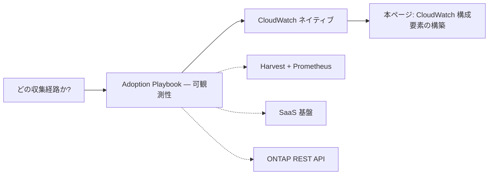

# Amazon FSx for NetApp ONTAP の監視設計

🌐 **日本語**（本ページ）| [English](../en/monitoring-design.md)

> **ステータス / 対象読者 / 証拠の階層**: ステータス — active（実装側インデックス。経路選択はハブにあります）。対象読者 — CloudWatch 収集経路を既に選び、CloudWatch ネイティブの構成要素を構築するエンジニア。本ページで用いる証拠の階層: `文書化済み`（引用した AWS または NetApp のソースに記載）、`コード確認済み`（本リポジトリのテンプレートを読んだもので、実行はしていない）、`未確認`（本ブランチに日付付きの実行記録が無い）。以下の各主張は階層をインラインで併記します。Qtree メトリクスの公開、出荷されている Qtree 閾値アラーム、Terraform の方針は、未検証として読むべき部分です。`検証済み`（実行し、日付付きの記録がある）は、ログアラームの E2E 実行のようにその記録が存在する箇所にだけ使います。

## エグゼクティブサマリ

本ページは、Amazon FSx for NetApp ONTAP を Amazon CloudWatch で監視するための**実装側インデックス**です。どの収集経路を使うべきかはここでは決めません。その選択 — CloudWatch ネイティブ、NetApp Harvest + Prometheus、SaaS オブザーバビリティ基盤、ONTAP REST API のいずれか — は [Adoption Playbook — 可観測性](https://github.com/Yoshiki0705/FSx-for-ONTAP-Adoption-Playbook/blob/main/docs/en/domains/observability/README.md)（ハブ）で行います。CloudWatch を経路として選んだ後に本ページへ来てください。本ページは、本リポジトリが提供する CloudWatch ネイティブの構成要素の作り方、その境界、そして Terraform の方針を扱います。

具体的には、`shared/templates/` 配下の 3 つの CloudFormation テンプレートが CloudWatch ネイティブ経路をカバーします。性能・容量ダッシュボード、Qtree 単位のクォータ監視、ログベースアラームです。Qtree 監視は、Qtree メトリクスを CloudWatch に公開することを意図した、実装済みでコード確認済みの経路です。運用上の公開は未確認で、同梱の閾値アラームは出荷状態のままでは使えません。それぞれについて、いつ使うか・なぜ存在するか・どう使うか・範囲の境界を以下に記載します。

> **範囲に関する補足**: これは経路選択の決定木ではなく、導線と組み立てのインデックスです。CloudWatch・Harvest・SaaS・ONTAP REST をまだ選んでいない場合は、上記のハブ可観測性 README から始め、その後に本ページへ戻ってください。

## このページが決めることとハブが決めることの境界

**本ページが扱うのは CloudWatch ネイティブの実装**です。どのテンプレートがどのビューを作るか、各テンプレートが到達できる範囲とできない範囲、後から Terraform 同等物をどう足すか。本ページで参照するテンプレートはすべて現時点でリポジトリに存在します。

**収集経路の選択は行いません。** メトリクスとログを CloudWatch・Harvest + Prometheus・SaaS 基盤・ONTAP REST API のどれで届けるかは、別の軸の別の決定であり、[Adoption Playbook — 可観測性](https://github.com/Yoshiki0705/FSx-for-ONTAP-Adoption-Playbook/blob/main/docs/en/domains/observability/README.md) で行います。これは [decision-tree-management-monitoring.md](decision-tree-management-monitoring.md) が管理プレーンの選択と収集経路の選択を分けているのと同じ構図です。片方だけを読むと、アーキテクチャの半分が未決定のまま残ります。

> **境界に関する補足**: 管理プレーン（ファイルシステムを管理するためにどう到達するか）と収集経路（メトリクスとログをどう集めて保存するか）は、どちらも「監視」と呼ばれるため混同しやすい概念です。本ページは両者の下流に位置します。CloudWatch を経路として選んだ前提で、その構築を扱います。

## 収集経路の選択（ハブへ委譲）

経路選択はここではなくハブにあります。2 つ目の決定木を置く代わりに、以下のポインタを使ってください。



**管理プレーン**の軸（NetApp Console 経由の System Manager、セルフホスト型コンソール、あるいは CLI と REST 直接）については [decision-tree-management-monitoring.md](decision-tree-management-monitoring.md) を参照してください。その決定木も、本ページと同様に収集経路の選択をハブへ委譲しています。

> **導線に関する補足**: 上図の実線経路（CloudWatch → 本ページ）は、本ページが扱う分岐です。本リポジトリは CloudWatch 以外にも CloudFormation を提供しており — SaaS ベンダー統合と Qtree 監視も CloudFormation です — CloudWatch は唯一の CloudFormation 分岐ではなく、ここで組み立てる分岐です。破線の分岐は他所で実装されています — Harvest は [management-console/](../../management-console/README.md)、SaaS は 9 ベンダー統合、ONTAP REST は下記の Qtree 監視です。

## CloudWatch による監視

CloudWatch ネイティブ経路は、ONTAP System Manager の性能・容量の各ビューを CloudWatch に置くため、日常の監視で ONTAP System Manager を開く必要がなくなります。クォータのビューについては、Qtree メトリクスを CloudWatch に公開することを意図した、実装済みでコード確認済みの経路を本リポジトリが提供しています。運用上の公開は未確認です（下記の Qtree 節を参照）。機能単位のマッピング（System Manager ビュー → CloudWatch メトリクス → テンプレート）は [native-alternative-matrix.md](native-alternative-matrix.md) にあります。本節では、そのマッピングの背後にある 3 つのテンプレートを記載します。

以下で使うメトリクスとアラームの AWS 一次情報:

- [Monitoring FSx for ONTAP with Amazon CloudWatch](https://docs.aws.amazon.com/fsx/latest/ONTAPGuide/monitoring-cloudwatch.html)
- [Creating an alarm for low primary storage](https://docs.aws.amazon.com/fsx/latest/ONTAPGuide/alarm-low-primary-storage.html)
- [FSx for ONTAP file system metrics](https://docs.aws.amazon.com/fsx/latest/ONTAPGuide/file-system-metrics.html)

> **範囲に関する補足**: AWS は FSx for ONTAP の CloudWatch メトリクスをファイルシステムメトリクスと詳細ファイルシステムメトリクスに分類しています。ファイルシステムメトリクスは `FileSystemId` ディメンションを取り、詳細メトリクスはさらに `StorageTier` と `DataType` を取ります（[file-system-metrics.html](https://docs.aws.amazon.com/fsx/latest/ONTAPGuide/file-system-metrics.html)、確信度: `文書化済み`）。ここで重要な境界は、ネイティブメトリクスに Qtree 単位・ユーザー単位のディメンションが無いことであって、ファイルシステムより下が一切測れないということではありません。下記の Qtree 監視は ONTAP REST API 経由で Qtree 粒度に到達し、ユーザー単位のアクセスには監査ログが必要です（[event-sources.md](event-sources.md) を参照）。

### 性能・容量ダッシュボード

**テンプレート**: `shared/templates/fsxn-monitoring-dashboard.yaml`

**いつ**: CloudWatch を選択済みで、IOPS・スループット・ネットワーク利用率・ストレージ容量を 1 つのダッシュボードにまとめ、容量が尽きる前にアラームを上げたいとき。

**なぜ**: AWS が CloudWatch に公開するメトリクスの範囲で、ONTAP System Manager の性能・容量ビューを代替します。日常の容量監視のために管理コンソールを開く必要がなくなります。

**どう**: 4 つのパラメータでデプロイします — `FileSystemId`、`FileSystemName`、`CapacityThresholdPercent`（既定 80）、および任意の `NotificationEmail`（指定すると Amazon Simple Notification Service（Amazon SNS）トピックとサブスクリプションを作成）。ダッシュボードは IOPS（`DataReadOperations` + `DataWriteOperations`）、スループット（`DataReadBytes` + `DataWriteBytes`）、ネットワーク利用率（`NetworkThroughputUtilization`）、容量（`StorageUsed` + `StorageCapacityUtilization`）を描画します。スタックは常に 2 つのアラームを作成します — `StorageCapacityAlarm`（`StorageCapacityUtilization` に `CapacityThresholdPercent` の閾値）と `ThroughputUtilizationAlarm`（`NetworkThroughputUtilization` に固定 80% の閾値）です。`NotificationEmail` を設定すると、SNS トピックは両方のアラームに付きます。

**レイテンシウィジェットは未実装**です（確信度: `コード確認済み`。`fsxn-monitoring-dashboard.yaml` はレイテンシウィジェットを描画しない）。基礎メトリクス `DataReadOperationTime` と `DataWriteOperationTime` は存在し、期間平均レイテンシは `OperationTime * 1000 / Operations` で算出できます（確信度: `文書化済み`、[file-system-metrics.html](https://docs.aws.amazon.com/fsx/latest/ONTAPGuide/file-system-metrics.html)）が、ダッシュボードテンプレートはまだそのウィジェットを描画しません。[native-alternative-matrix.md](native-alternative-matrix.md) は、これをダッシュボードテンプレートの部分対応の行として記録しています。

> **レイテンシに関する補足**: AWS のメトリクスペア `DataReadOperationTime`/`DataWriteOperationTime` を対応する operation count で割ると期間平均レイテンシを算出できます（期間内で合計されるため p99 ではなく平均）。本テンプレートは現時点でそのウィジェットを描画しません。テールレイテンシが必要な場合は、これらの集約メトリクスのペアではなくリクエスト単位のテレメトリから取得してください。

> **コストに関する補足**: [CloudWatch 料金ページ](https://aws.amazon.com/cloudwatch/pricing/) を 2026-10-04 に us-east-1 で確認した時点で、CloudWatch ダッシュボードは無料枠を超えると 1 つあたり月額 $3、標準解像度のメトリクスアラームは 1 つあたり月額 約 $0.10 です（本スタックはそのアラームを 2 つ作成します）。価格は時期とリージョンで変動するため、最新のページで確認してください。SNS トピックは `NotificationEmail` を設定したときのみ作成されます。

### Qtree 単位のクォータ監視

**テンプレート**: `shared/templates/qtree-quota-monitor.yaml`

**いつ**: Qtree 単位のクォータ使用量が必要で、ファイルシステム単位の CloudWatch メトリクスでは表現できないとき。

**なぜ**: ネイティブの CloudWatch メトリクスが Qtree の識別子もクォータ使用量のディメンションも持たないギャップを埋めます（ファイルシステムメトリクスは `FileSystemId` を取り、詳細メトリクスは `StorageTier`/`DataType` を追加しますが、いずれも Qtree を名指しできません）。Lambda 関数は ONTAP REST API `/storage/quota/reports` をポーリングし、Qtree ごとに `FSxONTAP/Qtree` カスタムメトリクス（`QtreeQuotaUsedPercent`、`QtreeQuotaUsedBytes`、`QtreeQuotaLimitBytes`）を公開するよう書かれています（確信度: `コード確認済み`。運用上の公開は `未確認`）。テンプレートは `QuotaThresholdPercent`（既定 85）のクォータアラームも宣言しますが、そのアラームは出荷状態では未確認です — 下記のアラームに関する補足を参照してください。

**どう**: ONTAP 管理エンドポイント IP（`OntapMgmtIp`）、ONTAP 管理者認証情報の Secrets Manager ARN、`SvmName`、VPC 配置パラメータ（`VpcId`、`SubnetIds`、`SecurityGroupId`）、`PollIntervalMinutes`（既定 5）、`QuotaThresholdPercent` でデプロイします。Lambda は `QtreeQuotaUsedPercent`、`QtreeQuotaUsedBytes`、`QtreeQuotaLimitBytes` をそれぞれ完全なディメンション集合 `SvmName` + `VolumeName` + `QtreeName` で公開するよう書かれているため、各 Qtree は別々の CloudWatch メトリクスになります — ただし下記の 1 回あたりの上限まで。この Qtree 単位のカスタムメトリクス経路と DLQ 深度アラームは、このスタックのうち実装済みで `コード確認済み` の部分です。本ブランチに日付付きの実行記録は無いため、実際にメトリクスが公開されるか・アラームが発火するかという運用上の挙動は `未確認` です。

> **カバレッジに関する補足（1 回あたり 200 レコードの上限）**: 各ポーリングは `/storage/quota/reports` を `max_records=200` で要求し、Lambda は最初のページ（`data["records"]`）のみを消費して、ページングを行いません（確信度: `コード確認済み`、`qtree-quota-monitor.yaml`）。tree クォータレポートが 200 を超える SVM では、各サイクルで先頭 200 件より後のレコードにメトリクスが付かないため、「すべての Qtree」のカバレッジは SVM あたり tree クォータ 200 件までで成立します。それを超える場合は、ページングを追加・検証するまで、インベントリは部分的にしかカバーされていないものとして扱ってください。

> **ネットワークに関する補足（CloudWatch API への egress が必要）**: Lambda は VPC 内で動作し、`cloudwatch:PutMetricData` を呼びます。テンプレートが作成する interface VPC エンドポイントは Secrets Manager 用のみで、CloudWatch 用はありません。そのため、NAT ゲートウェイも CloudWatch monitoring（`com.amazonaws.<region>.monitoring`）interface エンドポイントも無いプライベートサブネットでは、認証情報の取得と ONTAP への到達はできても、メトリクスを公開できません（確信度: `コード確認済み`。テンプレートが宣言する `AWS::EC2::VPCEndpoint` は Secrets Manager 用の 1 つ）。`cw.put_metric_data` の呼び出しは try/except で囲まれていないため、ネットワーク障害は握り潰されず例外として送出され、呼び出しが失敗します — 下記の失敗セマンティクスに関する補足を参照してください。CloudWatch monitoring API への経路を用意してください — NAT ゲートウェイ、または Lambda のサブネットに `com.amazonaws.<region>.monitoring` interface エンドポイント。

> **失敗セマンティクスに関する補足**: `QuotaPollSchedule`（EventBridge ルール）は Lambda を非同期で呼び出すため、送出された例外（`put_metric_data` のネットワーク障害、ONTAP のタイムアウトなど）は Lambda により 2 回リトライされた後に DLQ へ配信されます（確信度: `コード確認済み`、`qtree-quota-monitor.yaml`）。したがって DLQ 深度アラームは、すべてのリトライに失敗した呼び出しに対して発火するものであり、ポーリングが止まるあらゆる経路を検知するものではありません。スケジュールルールの無効化、invoke 権限の削除、その他の呼び出しが発生しない状況では、DLQ メッセージを生成せずにメトリクスが止まるため、DLQ が静かであることはポーリングが健全である証拠にはなりません。このスタックのすべてのアラームは `HasNotificationEmail` の条件下でのみ SNS アクションを付けます。`NotificationEmail` を空のままにすると、アラームは CloudWatch 上で状態遷移はしますが通知は送られません。

> **アラームに関する補足（未確認 / 現状の `QtreeQuotaAlarm` に依拠しない）**: テンプレートの `QtreeQuotaAlarm` は `Metrics` 配列もメトリクス算術式も持たず、`SvmName` ディメンションのみを選択しています。CloudWatch はメトリクスを完全なディメンション集合で識別するため、`SvmName` だけに絞ったアラームは Lambda が出す 3 ディメンションのどの系列にも一致せず、`Statistic: Maximum` は別々のディメンションを持つ Qtree 単位メトリクスを横断して集約しません（確信度: このアラームが実データで発火することは `未確認`）。テンプレートが Qtree 単位系列に対するメトリクス算術式、または Qtree 単位アラームに修正されるまで、閾値アラートは機能しないものとして扱い、`FSxONTAP/Qtree` メトリクスを直接読んでください。[native-alternative-matrix.md](native-alternative-matrix.md) の「問題の Qtree を特定する方法」は、完全な `SvmName`/`VolumeName`/`QtreeName` 識別子を `list-metrics` で列挙し、各識別子を照会します。実際の値が返るのはこの照会です（`SvmName` だけに絞った照会は、同じディメンション識別の理由で、出力されるどの系列にも一致しません）。

> **セキュリティに関する補足**: ONTAP 管理者認証情報は Lambda 環境変数ではなく AWS Secrets Manager から ARN 経由で取得します。Lambda は VPC 内から ONTAP 管理エンドポイントへ HTTPS（443）で到達し、その IP への egress を許可するセキュリティグループを付けます。出荷されている Lambda は urllib3 を `cert_reqs="CERT_NONE"` で初期化しているため、通信は暗号化されますがエンドポイント証明書は認証されません（確信度: `コード確認済み`、`qtree-quota-monitor.yaml`）。求められる封じ込めは既知の管理 IP への VPC 内経路であり、証明書検証は残作業です（ROADMAP や CONTRIBUTING の追跡項目にはまだ載っていません）。

> **IaC に関する補足**: このテンプレートは、監視ビューが ONTAP 管理プレーンを必要とする最も明確な例です。この Lambda が書き込むまで、そのデータは CloudWatch に存在しません。Terraform 同等物も同じ VPC と Secrets Manager の依存を持ちます。

### ログベースアラーム

**テンプレート**: `shared/templates/cloudwatch-log-alarm.yaml` — [cloudwatch-log-alarm.md](cloudwatch-log-alarm.md) に記載。

**いつ**: FSx for ONTAP の管理監査ログが既に CloudWatch Logs へ流れていて、メトリクスフィルターを先に作らずに Logs Insights クエリから直接アラームを上げたいとき。

**なぜ**: `AWS::CloudWatch::LogAlarm` リソースを使い、ログ内容から直接アラームを上げます — 大量削除、特権操作、不正アクセスのパターンなど。AWS はログクエリに対するアラームを [2026 年 7 月の What's New](https://aws.amazon.com/about-aws/whats-new/2026/07/amazon-cloudwatch-log-alarms/) で発表し、対応インターフェースに CloudFormation を挙げています。リソースは [`AWS::CloudWatch::LogAlarm` リファレンス](https://docs.aws.amazon.com/AWSCloudFormation/latest/TemplateReference/aws-resource-cloudwatch-logalarm.html) と [Alarming on logs](https://docs.aws.amazon.com/AmazonCloudWatch/latest/monitoring/Alarm-On-Logs.html) に記載されています（確信度: `文書化済み`、2026-10-04 にページを確認）。

**どう**: パラメータ・検知タイプ・デプロイスクリプトは [cloudwatch-log-alarm.md](cloudwatch-log-alarm.md) を参照してください。CloudFormation によるデプロイとスケジュールクエリの評価（INSUFFICIENT_DATA → OK）は 2026-07-02 に `ap-northeast-1` で実行済みです（確信度: `検証済み`、[E2E 検証結果（2026-07-02）](cloudwatch-log-alarm.md#e2e-検証結果2026-07-02) を参照）。

> **lint に関する補足（日付付きの観測）**: 2026-07-02 の E2E 記録には、`cfn-lint` が `AWS::CloudWatch::LogAlarm` に E3006 を報告したとありますが、その cfn-lint のバージョンは書かれていません。2026-10-04 に、本リポジトリが固定している `cfn-lint==1.56.3`（`requirements-dev.txt`）を `cloudwatch-log-alarm.yaml` に実行したところ指摘は 0 件でした。同じ環境で、存在しないリソースタイプを持つ対照テンプレートには E3006 が出ています。ブロッキングの lint 階層は引き続き E3006 を無視しています（`Makefile` の `CFN_LINT_IGNORE`）。このリソースの E3006 は、恒常的な条件ではなく cfn-lint のバージョンに依存するものとして扱ってください。

> **可観測性に関する補足**: 監査ログを CloudWatch Logs に入れる前提は、このテンプレートではなく syslog VPC Endpoint 経路（[syslog-vpce-setup-guide.md](syslog-vpce-setup-guide.md)）が担います。

## NetApp 公開リファレンス

NetApp は [github.com/NetApp/FSx-ONTAP-monitoring](https://github.com/NetApp/FSx-ONTAP-monitoring) の [CloudWatch-Monitoring-FSx サブツリー](https://github.com/NetApp/FSx-ONTAP-monitoring/tree/main/CloudWatch-Monitoring-FSx) で CloudWatch 監視のリファレンス実装を公開しています。これも本リポジトリも CloudFormation ベースの serverless ソリューションであり、違いは文書化された範囲にあり、「そのままデプロイできるものか、スクリプト集か」という違いではありません（確信度: `文書化済み`、NetApp サブツリーの README より）。NetApp リファレンスは、リージョン内の全 FSx for ONTAP ファイルシステムをカバーする単一のダッシュボードを、Lambda・3 つの EventBridge スケジューラ・ライフサイクル管理されるアラーム・IAM ロール・任意の VPC エンドポイントとともにデプロイし、Full Stack / Monitoring Only / EMS Logs Only の 3 モードを持ちます。そのダッシュボードはクライアント操作・ストレージ利用・ディスク性能・レイテンシ・ボリューム単位の統計・LUN 性能・SnapMirror ステータスにわたり、EMS メッセージを CloudWatch Logs にストリームします。本リポジトリは、より小さく範囲が固定された単一ファイルシステムのダッシュボード・Qtree クォータのポーリング・ログベースアラームを、別々の CloudFormation テンプレートに分割しています。両者は異なる起点に適し、どちらも他方の置き換えではありません。

Harvest + Prometheus 経路（ハブが CloudWatch の代わりに案内することがある経路）については、同等の NetApp 公開ツールは [NetApp Harvest](https://github.com/NetApp/harvest) で、本リポジトリでは [management-console/](../../management-console/README.md) に実装されています。Harvest は ONTAP の全メトリクス集合（プロトコル・アグリゲート・ノードの各レベル）が必要なチームに適し、CloudWatch はコレクターを運用せず AWS ネイティブの監視プレーンでメトリクスが欲しいチームに適します。

> **中立性に関する補足**: トレードオフは対称です。NetApp リファレンスリポジトリは、リージョン単位の 1 スタックで ONTAP をより広くカバーし（ボリューム・LUN・SnapMirror・EMS）、README の免責どおりアラームの後片付けは運用者に委ねます。ここのテンプレートは範囲が狭く固定で複数スタックに分割され、Qtree アラームは出荷状態では未確認です（上記のアラームに関する補足を参照）。どちらが適するかは、必要なメトリクスの広さとスタックの管理方法の好みで決まるものであり、どちらかが上位という話ではありません。

## Terraform の方針

### IaC 参考実装

以下のソースは、本リポジトリの IaC 調査（調査日 2026-10-04）で読んだものです。カタログを正しく読めるよう、それぞれに範囲ラベルを付けています。**monitoring** は CloudWatch アラーム集合を構築するもの、**construction** はファイルシステム（SVM/ボリューム/バックアップ）を構築するが監視は含まないもの、**building-block** は監視モジュールが組み立てるプロバイダーまたはリソースです。すべて `文書化済み` として引用します — ページを読んだものであり、実行はしていません。フレーミングは right-tool-for-the-job です。各項目は異なる起点に適し、トレードオフは順位付けではなく対称に記載します。

| ソース | 範囲 | URL | 中立な一行説明 |
|---|---|---|---|
| のんピ (non-97) `aws-cdk-fsxn-resources` | monitoring | [github.com/non-97/aws-cdk-fsxn-resources](https://github.com/non-97/aws-cdk-fsxn-resources) | AWS CDK（TypeScript）プロジェクト。monitoring construct が SNS トピックと CloudWatch アラーム集合（ファイルシステム容量 / ネットワークスループット / ファイルサーバーディスクスループット / ディスク IOPS / CPU、ボリューム単位の容量 + inode、バックアップジョブ失敗）を作成します。CloudFormation ではなく CDK のリファレンスで、リポジトリにライセンス表示がありません — パターンを参照し、コードは複製しないでください。 |
| NetApp `FSx-ONTAP-samples-scripts`（Terraform） | construction | [github.com/NetApp/FSx-ONTAP-samples-scripts/.../Terraform](https://github.com/NetApp/FSx-ONTAP-samples-scripts/tree/main/Infrastructure_as_Code/Terraform) | Apache-2.0 の Terraform 例（File Share / SQL Server / ファイルシステムデプロイ / DR レプリケーション）。ファイルシステムを構築するもので、CloudWatch 監視ではありません。 |
| JManzur `terraform-aws-fsx-netapp-ontap` | construction | [github.com/JManzur/terraform-aws-fsx-netapp-ontap](https://github.com/JManzur/terraform-aws-fsx-netapp-ontap) | ファイルシステム・SVM・ボリューム・管理されたセキュリティグループ・オンデマンドボリュームバックアップ用の Terraform モジュール。create-or-lookup モードを持ちます。監視リソースはありません。 |
| aws-samples `genai-bedrock-fsxontap`（terraform） | construction | [github.com/aws-samples/genai-bedrock-fsxontap/.../terraform](https://github.com/aws-samples/genai-bedrock-fsxontap/tree/main/terraform) | 多数の `.tf` ファイルのなかに `fsx.tf` を含む Bedrock + FSx for ONTAP の GenAI スタック。GenAI ワークロードの構築であり、監視モジュールではありません。 |
| shikazuki Zenn 記事 | construction | [zenn.dev/shikazuki/articles/5f925edb148c85](https://zenn.dev/shikazuki/articles/5f925edb148c85) | FSx for ONTAP を Terraform で構築し、SMB/NFS のマルチプロトコル共有を設定します。CloudWatch 監視はありません。 |
| AWS Storage Blog（Terraform） | construction | [aws.amazon.com/blogs/storage/deploying-amazon-fsx-for-netapp-ontap-hashicorp-terraform](https://aws.amazon.com/blogs/storage/deploying-amazon-fsx-for-netapp-ontap-hashicorp-terraform) | HashiCorp Terraform で FSx for ONTAP をデプロイするウォークスルー。構築であり、監視ではありません。 |
| Yoshiki0705 `FSx-for-ONTAP-Agentic-Access-Aware-RAG` | construction | [github.com/Yoshiki0705/FSx-for-ONTAP-Agentic-Access-Aware-RAG](https://github.com/Yoshiki0705/FSx-for-ONTAP-Agentic-Access-Aware-RAG) | FSx for ONTAP を構築する CDK リファレンス。その CloudWatch 監視は RAG アプリケーション（Lambda / CloudFront / DynamoDB）を対象としており、FSx for ONTAP のファイルシステムメトリクスではありません。 |
| NetApp `terraform-provider-netapp-ontap` | building-block | [github.com/NetApp/terraform-provider-netapp-ontap](https://github.com/NetApp/terraform-provider-netapp-ontap) | NetApp 公式の ONTAP Terraform プロバイダー — AWS プレーンが公開しないメトリクス向けの、ONTAP 内部プレーンの構成要素です。 |
| AWS プロバイダーリソース | building-block | [`aws_fsx_ontap_file_system`](https://registry.terraform.io/providers/hashicorp/aws/latest/docs/resources/fsx_ontap_file_system) · [`aws_cloudwatch_metric_alarm`](https://registry.terraform.io/providers/hashicorp/aws/latest/docs/resources/cloudwatch_metric_alarm) · [`aws_cloudwatch_dashboard`](https://registry.terraform.io/providers/hashicorp/aws/latest/docs/resources/cloudwatch_dashboard) · [`aws_sns_topic`](https://registry.terraform.io/providers/hashicorp/aws/latest/docs/resources/sns_topic) | Terraform 監視モジュールが組み立てる AWS プロバイダーのプリミティブ。 |

**正直なギャップは残ります。** 調べたソースの範囲では、FSx for ONTAP 向けのターンキーな公開 Terraform *監視* モジュールは見つかりませんでした（確信度: 存在することは `未確認`）。上記の construction リファレンスは構築であって監視ではありません。唯一の直接的な監視の先例 — のんピの `aws-cdk-fsxn-resources` — は Terraform ではなく CDK で、ライセンス表示が無いため、複製すべきアラーム集合を示す参考であって、複製するコードではありません。

ここから導かれる方針: 出荷済みの AWS ネイティブ経路は CloudFormation のままとし、のんピの CDK アラーム集合 — ファイルシステム容量 / ネットワークスループット / ファイルサーバーディスクスループット / ディスク IOPS / CPU、ボリューム単位の容量 + inode、バックアップジョブ失敗 — を `aws_cloudwatch_metric_alarm` + `aws_cloudwatch_dashboard` + `aws_sns_topic` に移植した Terraform `.tf` 同等物を、CloudWatch 監視について追加します。既存ファイルシステムには `aws_fsx_ontap_file_system` データソースを使い、AWS プレーンが公開しない ONTAP 内部メトリクスには NetApp プロバイダーを構成要素として利用できます。後続のスケルトンと段階的計画がこれを引き継ぎます。これは [ROADMAP.md](../../ROADMAP.md) の Phase 4 と [CONTRIBUTING.md](../../CONTRIBUTING.md) の Terraform 優先項目として追跡しています。

> **ライセンスに関する補足**: のんピの `aws-cdk-fsxn-resources` リポジトリは、About パネルにもトップレベルのツリーにもライセンス表示がありません（確信度: `文書化済み`、2026-10-04 に読んだリポジトリページより）。ライセンスが無い場合、再利用は既定で all-rights-reserved になります。どのアラームを作成するかの設計参考として扱い、本リポジトリに取り込むコードとしては扱わないでください。

> **範囲に関する補足**: のんピによる classmethod のインライン CloudFormation 記事（[AWS CDK で FSx for ONTAP リソースをデプロイする](https://dev.classmethod.jp/articles/deploy-amazon-fsx-for-netapp-ontap-resources-with-aws-cdk/)）は、上記で引用した CDK プロジェクトの解説記事であり、監視リファレンスです。別の classmethod インライン CloudFormation 記事は FSx for ONTAP 周辺の環境（ネットワーク/EC2）を構築し、リポジトリを提供しないため、監視ソースではなく構築の how-to です。ログ転送（Syslog → CloudWatch Logs）の資料は別のテーマに属し、IaC リファレンスではありません。

### 現状（正直なギャップ）

本リポジトリには現時点で `.tf` ファイルは存在しません。AWS ネイティブ経路は CloudFormation に標準化しています。Terraform 利用者向けの構成要素は次のとおりで、いずれもドキュメントページで実在を確認したものです（確信度: `文書化済み`。ここでは実行していません）。

- ファイルシステム用の AWS プロバイダーリソース [`aws_fsx_ontap_file_system`](https://registry.terraform.io/providers/hashicorp/aws/latest/docs/resources/fsx_ontap_file_system)。CloudWatch は汎用の [`aws_cloudwatch_metric_alarm`](https://registry.terraform.io/providers/hashicorp/aws/latest/docs/resources/cloudwatch_metric_alarm) と [`aws_cloudwatch_dashboard`](https://registry.terraform.io/providers/hashicorp/aws/latest/docs/resources/cloudwatch_dashboard) リソースから組み立てます。
- ONTAP 側設定用の NetApp 公式 ONTAP Terraform プロバイダー [terraform-provider-netapp-ontap](https://github.com/NetApp/terraform-provider-netapp-ontap)。
- コミュニティのサンプルモジュール（監視専用ではない）[terraform-aws-fsx-netapp-ontap](https://github.com/JManzur/terraform-aws-fsx-netapp-ontap)。

上記のソース（HashiCorp AWS プロバイダーレジストリ、NetApp プロバイダーのリポジトリ、コミュニティのサンプル）を調べた範囲では、FSx for ONTAP の CloudWatch 監視を構築する専用の公開 Terraform **モジュール**は見つかりませんでした（確信度: ターンキーのモジュールが存在することは `未確認`）。これらのソースの範囲では、FSx for ONTAP の CloudWatch 監視は汎用の `aws_cloudwatch_*` リソースと `aws_fsx_ontap_file_system` リソースから組み立てます。

> **検証に関する補足**: 上記 3 つの AWS プロバイダーリソースと 2 つのリポジトリは実在を確認しました。`未確認` と記しているのは具体的に「ターンキーの監視モジュールが存在する」という主張です — 調べたソースの範囲で見つからなかったという意味であり、エコシステムのどこにも存在しないという主張ではありません。

### 方針とスケルトン

本リポジトリは、AWS ネイティブ経路をどちらの IaC ツールでも表現できるよう、CloudWatch 監視テンプレートの Terraform `.tf` 同等物を追加する方針です。計画中のレイアウトは CloudFormation パラメータに 1 対 1 で対応します。

```
terraform/
  fsxn-monitoring-dashboard/
    main.tf        # aws_cloudwatch_dashboard, aws_cloudwatch_metric_alarm, aws_sns_topic
    variables.tf   # file_system_id, file_system_name, capacity_threshold_percent, notification_email
    outputs.tf     # dashboard_arn, alarm_arn, sns_topic_arn
```

variables はダッシュボードテンプレートのパラメータに対応し（`FileSystemId` → `file_system_id`、`FileSystemName` → `file_system_name`、`CapacityThresholdPercent` → `capacity_threshold_percent`、`NotificationEmail` → `notification_email`）、resources は `aws_cloudwatch_dashboard`・`aws_cloudwatch_metric_alarm`・`aws_sns_topic` です。

**`.tf` ファイルは今は作成しません。** 未検証のインフラコードを出荷することは本リポジトリの証拠規律に反します。実際の `.tf` ファイルは後の、別途検証するフェーズで扱います。記述し、実ファイルシステムに対して `terraform validate`/`plan` を実行し、レビューを経てから取り込みます。この方針は [ROADMAP.md](../../ROADMAP.md) の Phase 4「Terraform module equivalents」項目と、[CONTRIBUTING.md](../../CONTRIBUTING.md) の「Terraform equivalents of CloudFormation templates」優先項目として追跡しています。

> **IaC に関する補足**: 上記スケルトンは目標の形であって、動作するコードではありません。`terraform apply` できるものではなく、将来の貢献が満たすべき契約として扱ってください。スケルトンが扱うのは最初のフェーズだけで、Qtree とログアラームの同等物は下記のフェーズで扱います。

### Terraform 実装のフェーズ

Terraform の作業は、CloudWatch テンプレート 1 つにつき 1 フェーズ、計 3 フェーズに分けます。各フェーズには静的な検証手順と、実環境を必要とする完了条件があります。どのフェーズもまだ着手していないため、ここに `検証済み` のものはありません。タスク一覧は [ROADMAP.md](../../ROADMAP.md)（Phase 4）と [CONTRIBUTING.md](../../CONTRIBUTING.md) に置き、本節は順序と完了条件だけを示します。

| フェーズ | 範囲 | 検証 | 完了条件 |
|---|---|---|---|
| T1 — ダッシュボード + アラーム | `fsxn-monitoring-dashboard.yaml`（ダッシュボード、`StorageCapacityAlarm`、`ThroughputUtilizationAlarm`、任意の SNS）を移植し、のんピの CDK アラーム集合をパターン参照として追加する。`aws_cloudwatch_dashboard` + `aws_cloudwatch_metric_alarm` + `aws_sns_topic` を使う | FSx for ONTAP ファイルシステムがあるアカウントに対する `terraform validate` と `terraform plan` | `terraform apply` でダッシュボードとすべてのアラームが作成され、実ファイルシステムに対して各アラームが INSUFFICIENT_DATA を抜けて OK に達する |
| T2 — Qtree ポーリング | `qtree-quota-monitor.yaml` を移植する: VPC 内の Lambda、ONTAP 認証情報の Secrets Manager、`cloudwatch:PutMetricData` への経路（NAT ゲートウェイまたは `com.amazonaws.<region>.monitoring` interface エンドポイント）、EventBridge スケジュール、DLQ。先頭ページ 200 レコードを超えるページングを追加するか、その上限を文書化した制約として引き継ぐ。`SvmName` だけのアラームは Qtree 単位アラームかメトリクス算術式に置き換える | `terraform validate` と `terraform plan`。現状 CloudFormation テンプレートを検査しているのは `make cfn-lint` と `make cfn-guard`（`Makefile` の `CFN_TEMPLATES`）だけで、インラインの Lambda ハンドラには単体テストが無いため、その追加もこの移植に含める | 実 SVM から、Qtree 単位の `FSxONTAP/Qtree` 系列（3 つのメトリクス名すべて、完全な `SvmName`/`VolumeName`/`QtreeName` 識別子）が CloudWatch で観測され、置き換えたアラームが実データで状態遷移する |
| T3 — ログアラームの同等物 | `cloudwatch-log-alarm.yaml` の同等物。前提条件付き: ログアラームに対する AWS プロバイダーの対応を確認してから着手するか、文書化されたメトリクスフィルター方式を使う | `terraform validate` と `terraform plan` | CloudWatch Logs 上の実際の管理監査ログに対し、アラームが評価され（INSUFFICIENT_DATA → OK）、一致するイベントで ALARM に達する |

> **プロバイダー対応に関する補足**: HashiCorp AWS プロバイダーに `AWS::CloudWatch::LogAlarm` に相当するリソースがあるかは `未確認` です。2026-10-04 の調査では見つかりませんでしたが、存在しないことの証拠ではありません。AWS はログにアラームを付ける 2 つ目の方法として、メトリクスフィルターと標準のメトリクスアラームの組み合わせを文書化しています（[Alarming on logs](https://docs.aws.amazon.com/AmazonCloudWatch/latest/monitoring/Alarm-On-Logs.html)、確信度: `文書化済み`）。Terraform では [`aws_cloudwatch_log_metric_filter`](https://registry.terraform.io/providers/hashicorp/aws/latest/docs/resources/cloudwatch_log_metric_filter) + `aws_cloudwatch_metric_alarm` に対応します。2 つの方式は表現できる内容が異なる（Logs Insights の集約とフィルターパターン）ため、T3 ではどちらかを選び、その理由を記録します。

## 段階的な導入

CloudWatch を経路として選んだ後（ハブで決定）、次の順序で構築します。

1. 性能・容量ダッシュボード（`fsxn-monitoring-dashboard.yaml`）をデプロイし、ファイルシステム単位の IOPS・スループット・ネットワーク・容量を得る。スタックは容量アラームとスループット利用率アラームも作成する。
2. そのスタックに `NotificationEmail` を設定（または追加）し、容量アラームとスループット利用率アラームの両方が SNS トピックに届くようにする。
3. ファイルシステム単位より細かいクォータ粒度が必要なら、Qtree 単位のクォータ監視（`qtree-quota-monitor.yaml`）を追加する — これは ONTAP 管理エンドポイントへの VPC 到達性を要します。
4. 監査ログが CloudWatch Logs へ流れたら、ログベースアラーム（`cloudwatch-log-alarm.yaml`）を追加する。
5. CloudWatch のカバレッジが不十分と判明したら、ハブで経路選択を見直す（たとえば ONTAP の全メトリクス集合が必要な場合は Harvest 経路を指します）。

> **コストに関する補足**: 手順 1 と 2 はダッシュボードとその 2 つのアラームです — 単価は上記ダッシュボードのコストに関する補足（確認日付き）を参照してください。手順 3 は Lambda 呼び出し、Lambda が必要とする VPC エンドポイント、CloudWatch カスタムメトリクスの分が加わります。予算を決める前に AWS 料金ページで最新のレートを確認してください。

> **カスタムメトリクスのコストに関する補足**: Qtree 監視の Lambda は Qtree ごとに 3 つの系列（`QtreeQuotaUsedPercent`、`QtreeQuotaUsedBytes`、`QtreeQuotaLimitBytes`）を書き込み、それぞれが完全な `SvmName`/`VolumeName`/`QtreeName` 識別子を持ちます（確信度: `コード確認済み`、`qtree-quota-monitor.yaml`）。したがってカスタムメトリクスのコストは Qtree 数に比例します。メトリクス数 = 3 × N で、N は 1 回のポーリングで報告される Qtree 数です（先頭ページの上限により SVM あたり最大 200）。月額のカスタムメトリクス費用 ≈ 3 × N × リージョンと階層に応じたメトリクス 1 つあたりの月額単価。`PutMetricData` のリクエストは、ポーリング 1 回あたり ⌈3 × N / 20⌉ 回（Lambda は 20 件ずつ送信）× 月間ポーリング回数（既定の `PollIntervalMinutes` 5 分で 8,640 回、30 日の月を仮定）が加わります。ここでは金額を示しません。メトリクス単価とリクエスト単価は、利用するリージョンの最新の [CloudWatch 料金ページ](https://aws.amazon.com/cloudwatch/pricing/) から取り、見積りには日付・リージョン・N を併記してください。

## FAQ とよくある誤解

**Q: このページは CloudWatch と Harvest のどちらを使うべきか教えてくれますか?**
A: いいえ。経路選択（CloudWatch か Harvest + Prometheus か SaaS か ONTAP REST か）は [Adoption Playbook — 可観測性](https://github.com/Yoshiki0705/FSx-for-ONTAP-Adoption-Playbook/blob/main/docs/en/domains/observability/README.md) で行います。本ページは、その経路を選んだ後に CloudWatch の構成要素を作るためのものです。

**Q: これらの CloudWatch メトリクスから p99 レイテンシを取れますか?**
A: このダッシュボードからは取れません。レイテンシウィジェットを描画していないためです（確信度: `コード確認済み`）。AWS のメトリクスペア `DataReadOperationTime`/`DataWriteOperationTime` をそれぞれの operation count で割れば期間平均レイテンシを算出できますが、それは p99 ではなく期間平均であり、本テンプレートはそれを計算しません。テールレイテンシにはリクエスト単位のテレメトリを使ってください。

**Q: 今すぐ `terraform apply` できる Terraform モジュールはありますか?**
A: 調べたソース（HashiCorp AWS プロバイダーレジストリ、NetApp プロバイダーのリポジトリ、コミュニティのサンプル）ではターンキーのモジュールは見つかりませんでした（確信度: 存在することは `未確認`）。これらのソースの範囲では、FSx for ONTAP の Terraform による CloudWatch 監視は、汎用の `aws_cloudwatch_*` リソースと `aws_fsx_ontap_file_system` リソースから組み立てます。本リポジトリの方針は、後の別途検証するフェーズで CloudWatch テンプレートの `.tf` 同等物を追加することです。

**Q: なぜ CloudWatch は Qtree 単位のクォータ使用量を直接表示しないのですか?**
A: FSx for ONTAP のネイティブ CloudWatch メトリクスは `FileSystemId` ディメンションのみ（詳細メトリクスは `StorageTier`/`DataType` を追加）を持ち、Qtree 単位・ユーザー単位のディメンションはありません。Qtree 単位のクォータ使用量は、ONTAP REST API をポーリングしてカスタムメトリクスを公開することで到達します — それが `qtree-quota-monitor.yaml` の役割です。ただし、そのテンプレートに同梱されるクォータ閾値アラームは出荷状態では未確認です（Qtree 節のアラームに関する補足を参照）。修正されるまでは `FSxONTAP/Qtree` メトリクスを直接読んでください。

**Q: `cfn-lint` がログアラームテンプレートで E3006 を報告します — 問題ですか?**
A: デプロイ上の問題ではありません。2026-07-02 の E2E 記録で E3006 が出たのは、当時の cfn-lint が `AWS::CloudWatch::LogAlarm` を認識していなかったためで、テンプレートはデプロイできていました。E3006 が出るかどうかは cfn-lint のバージョンによります。2026-10-04 には、固定している `cfn-lint==1.56.3` がこのテンプレートに E3006 を報告しませんでした（ログベースアラーム節の lint に関する補足を参照）。E3006 は引き続きブロッキングの lint 階層から除外されています。

## 関連ドキュメント

- [管理・監視の決定木](decision-tree-management-monitoring.md) — 管理プレーンの軸（System Manager、セルフホスト型コンソール、CLI/REST）。収集経路の選択はハブへ委譲します。
- [AWS ネイティブ代替マトリクス](native-alternative-matrix.md) — 本ページの背後にある System Manager ビュー → CloudWatch メトリクス → テンプレートのマッピング。
- [System Manager GUI ガイド](system-manager-gui-guide.md) — GUI 経路と、それ自身の小さな決定フローチャート。
- [CloudWatch ログアラーム](cloudwatch-log-alarm.md) — `cloudwatch-log-alarm.yaml` テンプレートの詳細。
- [セルフホスト型管理コンソール](../../management-console/README.md) — Harvest 経路向けの NetApp Harvest 実装。
- [Adoption Playbook — 可観測性](https://github.com/Yoshiki0705/FSx-for-ONTAP-Adoption-Playbook/blob/main/docs/en/domains/observability/README.md) — 収集経路の決定を行う場所。
