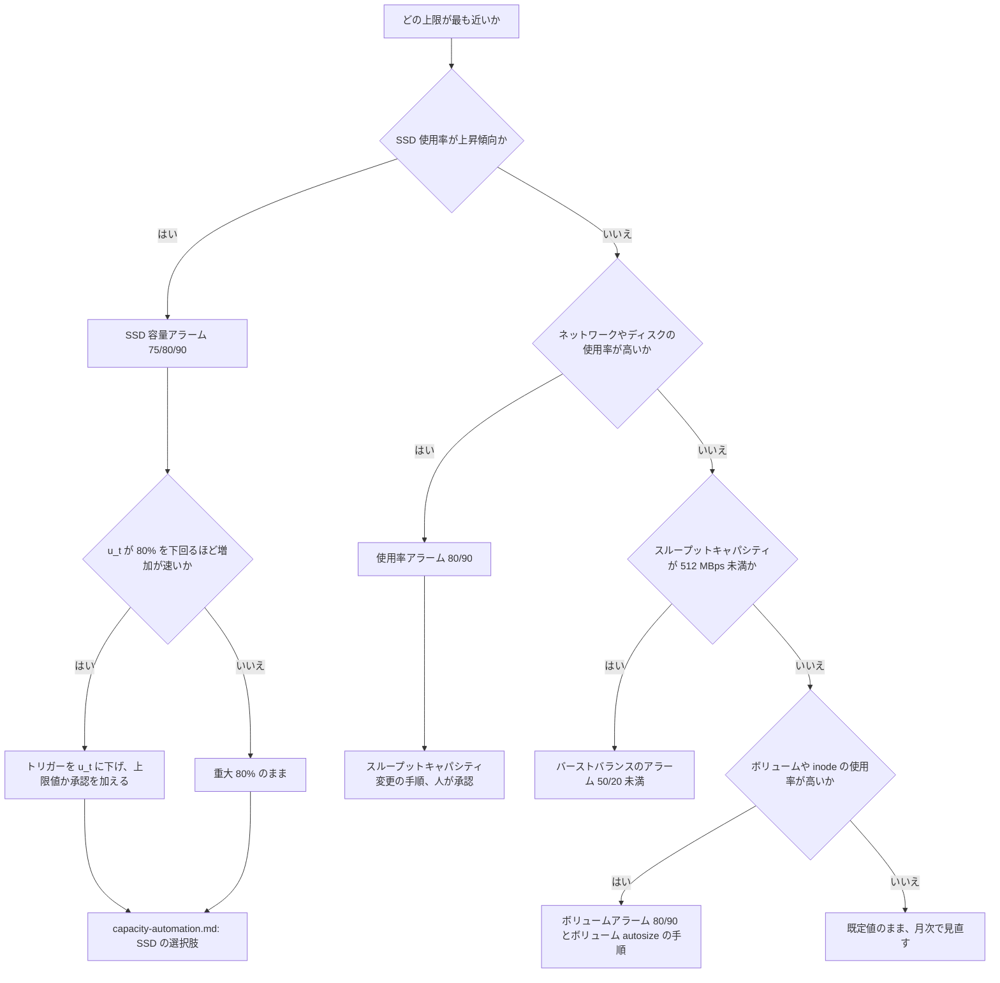

# Amazon FSx for NetApp ONTAP の監視のためのサイジングとヘッドルーム

🌐 **日本語**（本ページ）| [English](../en/sizing-and-headroom.md)

> **ステータス / 対象読者 / 証拠の階層**
>
> ステータスは設計指針で、本ページの値はどれも測定していません。対象読者は、Amazon FSx for NetApp ONTAP の CloudWatch アラームを作り、根拠を説明できる閾値を必要とするエンジニアです。証拠の階層は次の 5 つです。`文書化済み`（引用した AWS のページに記載。2026-10-07 に再読）、`検証済み`（[CloudWatch 監視の動作確認結果](verification-results-cloudwatch-monitoring.md) に日付付きの記録がある）、`導出`（文書化された規則から本ページで計算したもので、測定していない）、`仮説`（推論で、確認していない）、`未解決`（読んだどの資料にも答えがない）。計算例の数値はすべてプレースホルダー（`fs-0123456789abcdef0`、作った切りのよい数値）で、特定のファイルシステムへの推奨値ではありません。

## エグゼクティブサマリ

スループットキャパシティは読み取りスループットと書き込みスループットの 2 倍の合計でサイジングし、SSD 使用率は継続的に 80% 以下に保ちます（第 2 世代では各アグリゲートも同様）。そのうえで 90% と 98% を動作が変わる 2 つの線として扱います。90% で FSx for ONTAP はキャパシティプールからの読み取りを SSD にキャッシュしなくなり、98% で階層化が止まり、階層への書き込みが失敗します。容量アラームは重大を 80%、緊急を 90% に置きます。次に、トリガー閾値と 90% の間のヘッドルームが、6 時間のクールダウンと再評価・アラーム・利用可能になるまで・承認の遅れの間の増加を吸収できるかを確かめます。増加が速い場合は、80% の推奨値ではなくこのヘッドルームが閾値を決めます。式と警告値 75% は本ページで `導出` したものです。

> **範囲に関する補足**
>
> 本ページは AWS の規則を閾値に置き換えます。自動化の選択肢は扱わず、それは [capacity-automation.md](capacity-automation.md) にあります。メトリクス名と取得元は [メトリクスカタログ](monitoring-design.md#メトリクスカタログ) にあります。

## AWS のサイジング規則

| 規則 | 値 | 出典 | 階層 |
|---|---|---|---|
| プロビジョニングするスループットキャパシティ | 読み取りスループット + 2 × 書き込みスループット | [managing-throughput-capacity](https://docs.aws.amazon.com/fsx/latest/ONTAPGuide/managing-throughput-capacity.html) | `文書化済み` |
| 書き込みを 2 倍に数える理由 | 書き込みはセカンダリのファイルサーバーに複製されるため、読み取りの 2 倍のネットワーク帯域を使う | [performance](https://docs.aws.amazon.com/fsx/latest/ONTAPGuide/performance.html) | `文書化済み` |
| 継続的な SSD 使用率 | 80% を超えない。第 2 世代では各アグリゲートも同様 | [storage-capacity-and-IOPS](https://docs.aws.amazon.com/fsx/latest/ONTAPGuide/storage-capacity-and-IOPS.html)、[managing-storage-capacity](https://docs.aws.amazon.com/fsx/latest/ONTAPGuide/managing-storage-capacity.html) | `文書化済み` |
| SSD の読み取りキャッシュの停止 | 90% でキャパシティプールからの読み取りが SSD にキャッシュされなくなる | [managing-storage-capacity](https://docs.aws.amazon.com/fsx/latest/ONTAPGuide/managing-storage-capacity.html)、[volume-storage-capacity](https://docs.aws.amazon.com/fsx/latest/ONTAPGuide/volume-storage-capacity.html) | `文書化済み` |
| 階層化の停止 | 98% 以上ですべての階層化が止まる。読み取りは続き、階層への書き込みは失敗する | [volume-storage-capacity](https://docs.aws.amazon.com/fsx/latest/ONTAPGuide/volume-storage-capacity.html) | `文書化済み` |
| SSD 上の ONTAP オーバーヘッド | 最大 16%。ソフトウェア 11%（SSD が 30 TiB を超える場合は 6%）とアグリゲートスナップショット 5% | [managing-storage-capacity](https://docs.aws.amazon.com/fsx/latest/ONTAPGuide/managing-storage-capacity.html) | `文書化済み` |
| ファイルのメタデータ | ファイルデータの 3-7%。平均ファイルサイズ 4 KB → 7%、8 KB → 3.5%、32 KB 以上 → 1-3% | [managing-storage-capacity](https://docs.aws.amazon.com/fsx/latest/ONTAPGuide/managing-storage-capacity.html) | `文書化済み` |
| キャパシティプールのデータのメタデータ | キャパシティプールに置く 10 GiB ごとに SSD を 1 GiB 見込む（AWS は保守的な比率と説明） | [managing-storage-capacity](https://docs.aws.amazon.com/fsx/latest/ONTAPGuide/managing-storage-capacity.html) | `文書化済み` |
| SSD 1 TiB あたりのディスク性能 | 既定で 768 MBps と 3,072 IOPS。ファイルシステムが得るのは、これとスループットキャパシティで決まる上限の低い方 | [performance](https://docs.aws.amazon.com/fsx/latest/ONTAPGuide/performance.html) | `文書化済み` |
| 自動の SSD IOPS | 1 GiB あたり 3 IOPS、ファイルシステムあたり最大 160,000 | [storage-capacity-and-IOPS](https://docs.aws.amazon.com/fsx/latest/ONTAPGuide/storage-capacity-and-IOPS.html) | `文書化済み` |
| バーストクレジットのメトリクス | `FileServerDiskThroughputBalance` と `FileServerDiskIopsBalance` はスループットキャパシティが 512 MBps 未満のときに有効 | [file-system-metrics](https://docs.aws.amazon.com/fsx/latest/ONTAPGuide/file-system-metrics.html) | `文書化済み` |
| SSD の拡張 | 現在の SSD 容量の 10% 以上。第 1 世代は縮小できない | [storage-capacity-and-IOPS](https://docs.aws.amazon.com/fsx/latest/ONTAPGuide/storage-capacity-and-IOPS.html) | `文書化済み` |
| クールダウン | SSD 容量・プロビジョンド IOPS・スループットキャパシティのいずれかを変えたら、どれかを再び変えるまで 6 時間以上待つ | [storage-capacity-and-IOPS](https://docs.aws.amazon.com/fsx/latest/ONTAPGuide/storage-capacity-and-IOPS.html) | `文書化済み` |
| 第 2 世代で縮小する前 | CPU・ディスクスループット・SSD IOPS を 50% 以下に保つ | [storage-capacity-and-IOPS](https://docs.aws.amazon.com/fsx/latest/ONTAPGuide/storage-capacity-and-IOPS.html) | `文書化済み` |

> **ネットワークに関する補足**
>
> 書き込みは複製されるので、読み取り 100 MBps と書き込み 100 MBps のワークロードには、200 ではなく 300 MBps 以上のスループットキャパシティが要ります。クライアント側のスループットのグラフだけを見ると必要量を少なく見積もります。同じ 2 倍は `NetworkThroughputUtilization` にも現れます。

> **安全性に関する補足**
>
> 98% は階層への書き込みが失敗する線です。本ページの閾値はどれも 90% を超えないようにしてあり、98% に達する前にアラーム・人・（選んだ場合は）自動化が動く余地を残します。

## 世代と HA ペア構成による違い

第 1 世代のファイルシステム（Single-AZ と Multi-AZ）と第 2 世代の Multi-AZ は HA ペア 1 つで動き、第 2 世代の Single-AZ は最大 12 の HA ペアで動きます（[performance](https://docs.aws.amazon.com/fsx/latest/ONTAPGuide/performance.html)、`文書化済み`）。第 2 世代では、ネットワークとファイルサーバーのメトリクスは `FileSystemId` + `FileServer`、ディスク I/O とストレージ使用率のメトリクスは `FileSystemId` + `Aggregate` を取ります（[so-file-system-metrics](https://docs.aws.amazon.com/fsx/latest/ONTAPGuide/so-file-system-metrics.html)、`文書化済み`）。そのため複数 HA ペアのファイルシステムの容量アラームにはアグリゲート単位の系列も必要です。そこで `Aggregate` なしの系列が出るかは、[monitoring-design.md](monitoring-design.md) に書いたとおり `未解決` です。バーストバランスのメトリクスは第 1 世代のメトリクスのページに載っており、第 2 世代で出るかは `未解決` です。

HA ペアあたりの有効なスループット値は次のとおりです（[UpdateFileSystemOntapConfiguration](https://docs.aws.amazon.com/fsx/latest/APIReference/API_UpdateFileSystemOntapConfiguration.html)、`文書化済み`）。

| デプロイタイプ | 有効な `ThroughputCapacityPerHAPair`（MBps） |
|---|---|
| `SINGLE_AZ_1`、`MULTI_AZ_1` | 128, 256, 512, 1024, 2048, 4096 |
| `SINGLE_AZ_2` | 1536, 3072, 6144 |
| `MULTI_AZ_2` | 384, 768, 1536, 3072, 6144 |

> **世代に関する補足**
>
> HA ペア 1 つの第 1 世代ファイルシステムはアグリゲートが 1 つなので、ファイルシステムの系列とアグリゲートは同じ容量を指します。また SSD 容量を縮小できません。手動でも自動でも、拡張した分はファイルシステムを削除するまで残ります（[storage-capacity-and-IOPS](https://docs.aws.amazon.com/fsx/latest/ONTAPGuide/storage-capacity-and-IOPS.html)、`文書化済み`）。自動化の選択肢を決める前に、これを前提にサイジングしてください。

> **カーディナリティに関する補足**
>
> HA ペアが N の第 2 世代 Single-AZ ファイルシステムでは、アグリゲート単位の容量アラームは閾値の段ごとに N 個、ファイルサーバー単位の CPU やディスクのアラームは 2N 個（HA ペアあたりファイルサーバー 2 台）になります。費用を見積もる前に数を数えてください。

## 計算例

測定値でも推奨値でもないプレースホルダーのワークロードです。第 1 世代の `SINGLE_AZ_1` ファイルシステム `fs-0123456789abcdef0` で、ピーク時に読み取り 200 MBps と書き込み 100 MBps、論理データ 40 TiB のうち 25% がアクティブ、アクティブなデータのストレージ効率による削減を 50% と仮定します。

```text
スループットキャパシティ
  必要量    = 読み取り + 2 x 書き込み = 200 + 2 x 100 = 400 MBps
  選択      = 512 MBps   (400 以上で最小の SINGLE_AZ_1 の値)
  注        : 512 MBps ではバーストバランスのメトリクスは対象外 (512 未満で有効)

SSD 容量
  アクティブなファイルデータ   = 40 TiB x 25%          = 論理 10 TiB
  効率 50% の適用後           = 10 TiB x 0.5          = 5 TiB   = 5,120 GiB
  キャパシティプールのデータ   = 40 TiB - 10 TiB       = 論理 30 TiB
  プール分のメタデータ (SSD)   = 30 TiB / 10           = 3 TiB   = 3,072 GiB   (導出、補足を参照)
  SSD 上のデータ              = 5,120 + 3,072         = 8,192 GiB
  使用率 80% にする           = 8,192 / 0.80          = 10,240 GiB
  ONTAP オーバーヘッド 16%    = 10,240 / (1 - 0.16)   = 12,190.5 -> 12,191 GiB をプロビジョニング
                                (12,191 GiB は 30 TiB 未満なので 16% を適用)

ディスク性能の確認
  SSD から                   = 12,191 GiB = 11.9 TiB
                               x 768 MBps/TiB   = 約 9,143 MBps
                               x 3,072 IOPS/TiB = 約 36,573 IOPS
  自動の SSD IOPS             = 3 x 12,191       = 36,573 IOPS
  上限になるもの              : スループットキャパシティ (512 MBps) が SSD 由来のディスク
                               スループットより十分低いので、スループットキャパシティが上限になる
```

> **根拠に関する補足**
>
> [managing-storage-capacity](https://docs.aws.amazon.com/fsx/latest/ONTAPGuide/managing-storage-capacity.html) にある AWS のサイジング例（100 TiB、80% がコールド、8.75 TiB / 0.84 = 10.42 TiB）は、キャパシティプールのメタデータとして 10 GiB あたり 1 GiB を足していません。この例ではそれを足し、論理サイズに対して適用しています。保守的な読み方で、どちらの手順も `導出` です。AWS の例は、SSD 上のファイルのメタデータ 3-7% も別に足していません。平均ファイルサイズが小さい場合（4 KB → 7%）は、その項も足してください。

> **コストに関する補足**
>
> 本ページのために価格は調べていません。SSD 容量、キャパシティプールのストレージ、スループットキャパシティは別々に課金されます。計算例を予算にする前に、リージョンと日付を決めて最新の [FSx for ONTAP の料金ページ](https://aws.amazon.com/fsx/netapp-ontap/pricing/) を参照してください。

## ヘッドルームの式

容量アラームは、新しい容量が使えるようになる前に増加が 90% に届かないよう、十分早く鳴る必要があります。最悪の場合、変更はクールダウンで最大 6 時間止められます。以下の式は文書化されたタイミングから `導出` したもので、測定していません。

```text
H  >= g x (T_cooldown + T_recheck + T_alarm + T_avail + T_human)
u_t <= 90% - 100 x H / C        (0.1 単位で切り捨て)

  H           トリガーと 90% の間のヘッドルーム (GiB)
  g           SSD のピーク増加量 (GiB/時、平均ではなく観測したピーク)
  T_cooldown  6 時間。直前の SSD・IOPS・スループットの変更が次の変更を止める
  T_recheck   クールダウンが明けてから、動ける次の評価までの間隔。
              最大で再評価の間隔。計画中の T4 の 1 時間ごとのスケジュールなら 1 時間、
              AWS のサンプルの RetryDelayMinutes の既定値なら 5 分
  T_alarm     アラームの評価期間。AWS のサンプルでは 5 分
  T_avail     新しい容量が使えるまでの時間。AWS は通常数分以内と説明
              (プレースホルダーとして 0.5 時間)
  T_human     承認の遅れ。無人の自動化では 0
  C           現在の SSD 容量 (GiB)
  u_t         安全なトリガー閾値の上限 (%)

例: C = 12,191 GiB、T4 のスケジュール (T_recheck = 1 時間)
  g = 20 GiB/時、 T_human = 0      -> H = 20 x 7.58   = 約 152 GiB   = 1.24 ポイント  -> u_t <= 88.7%
  g = 20 GiB/時、 T_human = 4 時間 -> H = 20 x 11.58  = 約 232 GiB   = 1.90 ポイント  -> u_t <= 88.0%
  g = 200 GiB/時、T_human = 0      -> H = 200 x 7.58  = 約 1,517 GiB = 12.44 ポイント -> u_t <= 77.5%
  g = 200 GiB/時、T_human = 4 時間 -> H = 200 x 11.58 = 約 2,317 GiB = 19.00 ポイント -> u_t <= 70.9%
```

20 GiB/時では 80% の推奨値の方が厳しい条件です。200 GiB/時ではヘッドルームによる上限が 80% を下回るので、トリガーを 77% や 70% に下げる必要があります。どの行も `T_recheck = 1 時間` としているのは、計画中の T4 が 1 時間ごとに再評価するためです。`approve` モードでも同じで、承認のメールはクールダウン明けの評価で送られます。AWS のサンプルの 5 分ごとの再試行なら `T_recheck` は約 0.08 時間に縮み、T4 の `reevaluation_schedule` を短くした場合も同じように縮みます。

6 時間をそのまま数えるのは、最悪の場合がよく起きるからです。拡張が終わった直後に増加が新しい閾値を超えて続く、同じ日にスループットキャパシティやプロビジョンド IOPS を変更していた、10% の拡張幅が増加に対して小さすぎた、のいずれでも起きます。出典は、クールダウンと 10% の最小幅が [storage-capacity-and-IOPS](https://docs.aws.amazon.com/fsx/latest/ONTAPGuide/storage-capacity-and-IOPS.html)、アラームの評価期間が [automate-storage-capacity-increase](https://docs.aws.amazon.com/fsx/latest/ONTAPGuide/automate-storage-capacity-increase.html) です（いずれも `文書化済み`）。

> **通知に関する補足**
>
> CloudWatch がアラームアクションを呼ぶのは、アラームの状態が変わったときだけです（[AlarmThatSendsEmail](https://docs.aws.amazon.com/AmazonCloudWatch/latest/monitoring/AlarmThatSendsEmail.html)、`文書化済み`）。1 回の拡張の後も使用率がトリガーを上回っていると、アラームは ALARM のまま、再び通知もアクションもしません。その場合に備えて、より高い 2 段目の閾値か定期的な再評価を用意してください。

> **不可逆性に関する補足**
>
> 速い増加に合わせてトリガーを下げると、アラームが鳴る回数が増えます。第 1 世代のファイルシステムでは、そのたびの拡張が恒久的に残ります。低いトリガーと無人の自動化を組み合わせると、ファイルシステムを削除するまで課金される容量が増えていきます。低いトリガーには上限値か承認を組み合わせてください。

## 閾値の表

| シグナル | 警告 | 重大 | 緊急 | 根拠 | 階層 |
|---|---|---|---|---|---|
| SSD の `StorageCapacityUtilization`（`StorageTier=SSD`、`DataType=All`。第 2 世代は `Aggregate` 単位も） | 75 | 80 | 90 | 75 は継続的な推奨値の手前の余裕。80 は AWS の推奨値。90 は SSD の読み取りキャッシュが止まる点。98 は到達させない線 | 75 は `導出`、80・90・98 は `文書化済み` |
| ボリュームの `StorageCapacityUtilization`（`FileSystemId` + `VolumeId`） | 80 | 90 | なし | ボリューム単位の余裕。ボリュームの autosize を使う場合、grow 閾値より上のアラームは autosize を使い切ったことを示す | `導出`。autosize との関係は `仮説` |
| ボリュームの inode 使用率（T1 と同じメトリクス演算 `100 * FilesUsed / FilesCapacity`） | 80 | 90 | なし | inode を使い切ったボリュームにはデータを追加できない（[volume-storage-capacity](https://docs.aws.amazon.com/fsx/latest/ONTAPGuide/volume-storage-capacity.html)） | 閾値は `導出`、動作は `文書化済み` |
| `NetworkThroughputUtilization`、`FileServerDiskThroughputUtilization`、`FileServerDiskIopsUtilization`、`CPUUtilization` | 80 | 90 | なし | T1 の既定は 80。NetApp のリファレンスは性能アラームの既定を 90 にしている（[CloudWatch-Monitoring-FSx の README](https://github.com/NetApp/FSx-ONTAP-monitoring/tree/main/CloudWatch-Monitoring-FSx)）。これは別のリファレンスの既定値で、AWS の規則ではない | `導出` |
| `FileServerDiskThroughputBalance`、`FileServerDiskIopsBalance`（スループットキャパシティ 512 MBps 未満のみ） | < 50 | < 20 | なし | クレジットが尽きるとディスク性能はベースラインに下がる。AWS は閾値を示していない | `導出`、`未解決` |
| SnapMirror の遅延（T2 のアラーム `snapmirror_lag`、`SnapMirrorLagSecondsMax` を読む。重大の段は `snapmirror_lag_threshold_seconds` で、既定値 10800 は 1 時間のスケジュール向け） | > 転送スケジュール間隔の 1.5 倍 | > 間隔の 3 倍 | なし | 転送 1 回の遅れは警告、2 回以上は重大 | `導出` |
| SnapMirror の異常な関係の数（T2 のアラーム `snapmirror_unhealthy`、`SnapMirrorUnhealthyCount` を読む。閾値は 0 に固定） | なし | > 0 | なし | NetApp のリファレンスと同じ既定値 | `文書化済み`（そのリファレンスの README） |
| ポーラーのハートビート（T2 のコレクターごとのアラーム `heartbeat`、`CollectorSucceeded` を読む。期間は `poll_interval_minutes` に従う） | なし | 2 期間欠落 | なし | `TreatMissingData: breaching` にすることで、呼び出されなくなったポーラーでもアラームが鳴る | `導出` |

> **ボリュームに関する補足**
>
> ボリュームはシンプロビジョニングです。SSD ストレージが満杯になると、ボリュームに空きがあるように見えてもデータを追加できません（[low-volume-capacity](https://docs.aws.amazon.com/fsx/latest/ONTAPGuide/low-volume-capacity.html)、`文書化済み`）。ボリュームのアラームは SSD のアラームの代わりになりません。

> **バーストに関する補足**
>
> 512 MBps 未満では、使用率の割合がまだ中程度に見えても、持続的なワークロードがディスクのバーストクレジットを使い切ることがあります。バランスのアラームはその場合を捉えます。512 MBps 以上では対象外なので、上の計算例にはバーストのアラームがありません。

## 閾値の決め方



## 段階的な導入

1. ファイルシステムの `StorageUsed`、`StorageCapacityUtilization`、ネットワークとディスクの使用率、IOPS を 7-14 日分集めます。T1 モジュールのダッシュボードがこれらの系列を表示します（[T1 モジュールの使い方と範囲](monitoring-design.md#t1-モジュールの使い方と範囲)）。
2. 計算例に、自分の読み取りと書き込みの比率、アクティブな割合、効率、ファイルサイズを当てはめます。
3. T1 の入力（`capacity_threshold_percent`、`throughput_threshold_percent`、オプトインのファイルサーバーとボリュームのアラーム）で警告と重大のアラームを設定します。T1 はシグナルごとに 1 段のアラームを作るので、現時点で 2 段目はモジュールをもう一度呼ぶか、アラームを別に作ります。
4. 観測したピークの増加量から `g` を計算し、`u_t` を確かめます。`u_t` が 80% を下回るならトリガーを下げます。
5. SSD への対応を自動化するか、どう自動化するかを [capacity-automation.md](capacity-automation.md) で決めます。

> **Terraform に関する補足**
>
> T1 モジュールの `capacity_threshold_percent` は 50-95 を受け付けるので、上の表の SSD の閾値はすべて収まります。50 未満のトリガーには別のアラームが必要です。

## FAQ とよくある誤解

**Q: 80% は絶対の上限ですか**？
A: いいえ。AWS は継続的に 80% を超えないことを推奨しています。動作が変わる線は 90%（SSD の読み取りキャッシュが止まる）と 98%（階層化が止まり、階層への書き込みが失敗する）です（[managing-storage-capacity](https://docs.aws.amazon.com/fsx/latest/ONTAPGuide/managing-storage-capacity.html)、`文書化済み`）。

**Q: ボリュームの空き容量は SSD の空き容量を意味しますか**？
A: いいえ。ボリュームはシンプロビジョニングで、SSD 階層が満杯だとボリュームに空きがあるように見えても書き込めません（[low-volume-capacity](https://docs.aws.amazon.com/fsx/latest/ONTAPGuide/low-volume-capacity.html)、`文書化済み`）。

**Q: スループットキャパシティは読み取りスループットだけでサイジングできますか**？
A: いいえ。書き込みはセカンダリのファイルサーバーに複製されるため、読み取りスループットと書き込みスループットの 2 倍の合計をプロビジョニングします（[managing-throughput-capacity](https://docs.aws.amazon.com/fsx/latest/ONTAPGuide/managing-throughput-capacity.html)、`文書化済み`）。

**Q: SSD の拡張はすぐに効きますか**？
A: 新しい容量は通常数分以内に使えるようになり、バックグラウンドのストレージ最適化は通常数時間かかります（[storage-capacity-and-IOPS](https://docs.aws.amazon.com/fsx/latest/ONTAPGuide/storage-capacity-and-IOPS.html)、`文書化済み`）。6 時間のクールダウンは変更と同時に始まります。

**Q: 警告 75% とヘッドルームの式はどこから来ていますか**？
A: 文書化された規則から本ページで `導出` したものです。どちらも測定していません。自分の増加データから求めた値に置き換えてください。

## 関連ドキュメント

- [Amazon FSx for NetApp ONTAP の監視設計](monitoring-design.md): 4 層のインデックスで、本ページへのリンクがあります。
- [監視を起点にした容量自動化](capacity-automation.md): SSD 自動拡張の選択肢、ボリューム autosize とスループット変更の手順。
- [AWS ネイティブ代替マトリクス](native-alternative-matrix.md): System Manager の画面と CloudWatch メトリクス・テンプレートの対応。
- [CloudWatch 監視の動作確認結果](verification-results-cloudwatch-monitoring.md): 第 1 世代・HA ペア 1 つのファイルシステムで容量アラームを動かした日付付きの記録。
- [Terraform モジュール: fsxn-monitoring-dashboard](../../terraform/fsxn-monitoring-dashboard/README.ja.md): 上の閾値に使う入力。
