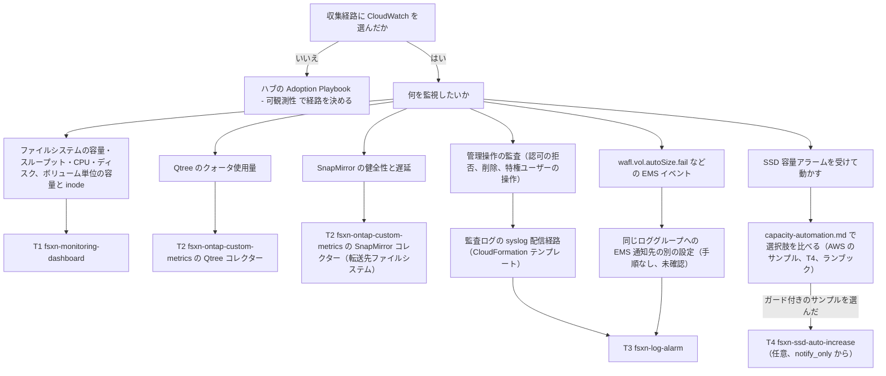

# Terraform による Amazon FSx for NetApp ONTAP の CloudWatch 監視は 3 つのモジュールを順に適用して構成し、SSD 自動拡張は任意の 4 つ目として加える

🌐 **日本語**（本ページ）| [English](../en/terraform-monitoring-guide.md)

## エグゼクティブサマリ

Amazon FSx for NetApp ONTAP の CloudWatch 監視設計を Terraform で展開するには、`terraform/` にある監視用の 3 つのモジュールを次の順に適用します。T1 の `fsxn-monitoring-dashboard` は、ネイティブの `AWS/FSx` メトリクスに対するダッシュボードとアラームを作り、呼び出すのは AWS API だけです。T2 の `fsxn-ontap-custom-metrics` は、CloudWatch がネイティブでは公開しない Qtree のクォータ使用量と SnapMirror の健全性・遅延を公開します。T2 には、ファイルシステムの管理エンドポイントへ TCP 443 で届くサブネット、`fsxadmin-readonly` ロールを持つ ONTAP ユーザーとその認証情報を収めた Secrets Manager のシークレット、NAT ゲートウェイかインターフェイスエンドポイント経由で CloudWatch と Secrets Manager へ出る経路が要ります。T3 の `fsxn-log-alarm` は管理操作の監査イベントにアラームを掛けます。前提は、syslog VPC エンドポイント経路で監査ログを受け取っている CloudWatch Logs のロググループで、この経路は本リポジトリでは CloudFormation テンプレートとして提供しています。この経路が運ぶのは監査ログだけです。`wafl.vol.autoSize.fail` などの EMS イベントを同じロググループに届けるには EMS 通知先を別に設定する必要があり、その手順は文書化も検証もしていません（`未確認`）。閾値は T1 より前に決めます。4 つ目の T4 `fsxn-ssd-auto-increase` は、SSD 容量アラームを受けて容量を上げるガード付きのサンプルで、監視には要りません。使う場合は容量アラームの後に、既定の `notify_only` で追加します。第 1 世代のファイルシステムでは SSD 容量の拡張を元に戻せず、変更のたびに 6 時間のクールダウンが始まります。T1 と T2 には日付付きの実環境での実行記録があり、T3 は [2026-10-09 の記録](verification-results-cloudwatch-monitoring.md#2026-10-09-の-terraform-ログアラームモジュールの実行) で監査の検出 3 つを試験用の設定で確認しました。T4 は実装済みでオフラインの検証まで済んでおり、実環境では `未確認` です。実環境の結果はいずれも第 1 世代・HA ペア 1 つのファイルシステム 1 台でのもので、一覧は [モジュールの一覧](#モジュールの一覧) にだけ載せています。

`shared/templates/` に CloudFormation テンプレートがあるのは、T1（`fsxn-monitoring-dashboard.yaml`）、T2 の Qtree の部分（`qtree-quota-monitor.yaml`）、T3（`cloudwatch-log-alarm.yaml`）です。T3 のテンプレートの検出クエリは、2026-10-09 の実行の後に T3 で置き換えたパターンに合わせておらず、置き換え前のままです（[記録の判定](verification-results-cloudwatch-monitoring.md#判定t3-の実行)）。SnapMirror のコレクターと T4 は Terraform にしかありません。どちらを使うかは監視の内容ではなく、その環境がインフラをどう管理しているかで決まります。FAQ の「CloudFormation テンプレートとの関係」（[FAQ とよくある誤解](#faq-とよくある誤解)）を参照してください。

> **範囲に関する補足**
>
> 本ページは、どのモジュールをどの順に使うかを案内するページです。入力変数、IAM 権限、デプロイ・確認・削除のコマンドは各モジュールの README にあり、モジュールの一覧からリンクしています。そもそも CloudWatch を収集経路にするか（Harvest + Prometheus、SaaS、ONTAP REST API と比べて）は、ハブの [Adoption Playbook — 可観測性](https://github.com/Yoshiki0705/FSx-for-ONTAP-Adoption-Playbook/blob/main/docs/en/domains/observability/README.md) で判断します。

## 対象読者と扱う範囲

対象は、収集経路に CloudWatch を選び、インフラを Terraform で管理している FSx for ONTAP の利用者です。どのモジュールがどのシグナルを出すか、適用の順序、各手順で止まりやすい前提条件、モジュールごとの検証状況、最小のルートモジュールを扱います。

ファイルシステム自体の構築、収集経路の選択、各モジュールの入力変数の網羅的な説明、Harvest や SaaS ベンダーの経路、CloudFormation でのデプロイ手順は扱いません（CloudFormation の手順は [デプロイガイド](deployment-guide.md) にあります）。

## 設計の 4 層と判断の場所

モジュールは、別の場所で決めた判断を実装するものです。先にその判断を済ませてください。4 つの層の定義は [監視設計の 4 層](monitoring-design.md#監視設計の-4-層) にあります。

| 層 | ドキュメント | そこで決めること |
|---|---|---|
| サイジングと余裕 | [sizing-and-headroom.md](sizing-and-headroom.md#閾値の表) | スループットのサイジング、SSD の警告・重大・緊急の閾値、`capacity_threshold_percent` に入れる値 |
| メトリクスカタログ | [monitoring-design.md](monitoring-design.md#メトリクスカタログ) | どの系列がネイティブ（T1）か、ONTAP REST API 経由のカスタム（T2）か、ログ由来（T3）か |
| アラート設計 | [monitoring-design.md](monitoring-design.md#アラート設計) | 重大度ごとの通知先、欠損データの扱い、集約した最大値とドリルダウン、ハートビートアラーム |
| 監視を起点にした自動化 | [capacity-automation.md](capacity-automation.md) と [capacity-automation-t4-design.md](capacity-automation-t4-design.md) | SSD 容量アラームを受けて何かを動かすか（AWS のサンプル、T4、ランブック） |

## モジュールの一覧

モジュールごとの検証状況を載せるのは、本ページではこの表だけです。他の節はここを参照します。

| フェーズ | 目的 | モジュールのパス | 作るもの | 前提条件 | 実環境での検証 | 固定の方法 |
|---|---|---|---|---|---|---|
| T1 | ネイティブメトリクスのダッシュボードとアラーム | [`terraform/fsxn-monitoring-dashboard`](../../terraform/fsxn-monitoring-dashboard/README.ja.md) | ダッシュボード（ウィジェット 7 つ）、ファイルシステム容量とネットワークスループット使用率のアラーム、任意で有効にする CPU・ディスク・ボリューム単位のアラーム、任意の SNS トピック | AWS API のみ。ファイルシステム ID | `検証済み`。[2026-10-05](verification-results-cloudwatch-monitoring.md#テスト結果サマリー)、[2026-10-06〜07](verification-results-cloudwatch-monitoring.md#2026-10-06-の容量アラームの実データによる実行)（実データでの容量アラーム）、[2026-10-07](verification-results-cloudwatch-monitoring.md#2026-10-07-のダッシュボードとアラームの画面)（最小の IAM ポリシー）。第 1 世代、HA ペア 1 つ | タグ `terraform-fsxn-monitoring-dashboard-v0.1.1`（`v0.1.0` にはダッシュボード表示の不具合あり）。[モジュールの取得方法](../../terraform/fsxn-monitoring-dashboard/README.ja.md#モジュールの取得方法) |
| T2 | Qtree のクォータと SnapMirror の健全性・遅延 | [`terraform/fsxn-ontap-custom-metrics`](../../terraform/fsxn-ontap-custom-metrics/README.ja.md) | VPC Lambda、スケジュール、デッドレターキュー、ロググループ、IAM ロール、Lambda のセキュリティグループ、任意のインターフェイスエンドポイント、最大 7 つのアラーム | 管理エンドポイントへ TCP 443 で届くサブネット。ファイルシステムのセキュリティグループへのインバウンドルール。`fsxadmin-readonly` のユーザーと Secrets Manager のシークレット。NAT ゲートウェイ、または `monitoring` と `secretsmanager` のエンドポイント | `検証済み`。[2026-10-08](verification-results-cloudwatch-monitoring.md#2026-10-08-の-terraform-カスタムメトリクスモジュールの実行)。1 つの SVM 内の 2 ボリューム間の SnapMirror | リリースタグが公開されるまではコミット SHA。[モジュールの取得方法](../../terraform/fsxn-ontap-custom-metrics/README.ja.md#モジュールの取得方法) |
| T3 | 管理操作の監査イベントのアラーム（EMS イベントには別の転送の設定が要る） | [`terraform/fsxn-log-alarm`](../../terraform/fsxn-log-alarm/README.ja.md) | 検出ごとにメトリクスフィルター 1 つとメトリクスアラーム 1 つ（既定のレシピは 5 つ）、任意の SNS トピック | syslog VPC エンドポイント経路から監査ログが書き込まれる既存のロググループ。`autosize-fail` には、同じロググループへの EMS 通知先が別に要る（`未確認`） | 監査の検出 3 つを `検証済み`。[2026-10-09](verification-results-cloudwatch-monitoring.md#2026-10-09-の-terraform-ログアラームモジュールの実行)。60 秒の試験用の期間と試験用の閾値で、`bulk-delete`、`privileged-operations`、REST の 403 を数える失敗アクセスの検出が OK → ALARM → OK。既定の 300 秒の期間、`autosize-fail`、`unauthorized-access` は `未確認`（[確認済みの範囲と未確認の範囲](#確認済みの範囲と未確認の範囲)） | リリースタグが公開されるまではコミット SHA。[モジュールの取得方法](../../terraform/fsxn-log-alarm/README.ja.md#モジュールの取得方法) |
| T4 | ガード付き SSD 自動拡張（任意。監視には不要） | [`terraform/fsxn-ssd-auto-increase`](../../terraform/fsxn-ssd-auto-increase/README.ja.md) | VPC の外の Lambda、SSD 使用率のトリガーアラーム、トリガー用と通知用の SNS トピック、1 時間ごとの再評価スケジュール、デッドレターキュー、DynamoDB のロックテーブル、判断ログと関数のロググループ、IAM ロール | モジュールの外で管理する S3 Object Lock のバケット（`auto` にはコンプライアンスモード）。必須の絶対上限 `max_storage_capacity_gib`。Terraform で管理するファイルシステムでは `storage_capacity` の `ignore_changes`。第 1 世代では拡張を元に戻せず、変更のたびに 6 時間のクールダウンが始まる | 実装済みで、オフラインの検証（ユニットテスト、`make terraform`、`terraform test`）まで。実環境は `未確認` | リリースタグが公開されるまではコミット SHA。[モジュールの入手](../../terraform/fsxn-ssd-auto-increase/README.ja.md#モジュールの入手)。設計は [capacity-automation-t4-design.md](capacity-automation-t4-design.md) |

> **記録に関する補足**
>
> これらの実行より前に書かれたページ（モジュールの README や監視設計など）には、実環境での検証がこれからだと書かれたままの箇所があります。基準にするのは、この表からリンクしている日付付きの記録です。

> **検証範囲に関する補足**
>
> どの実行も、1 つのリージョンのファイルシステム 1 台でのサンプル実行で、本番環境の見積りではありません。形の違うファイルシステム（第 2 世代、HA ペアが 2 つ以上、別のリージョン）では、まず本番ではないアカウントで適用してください。

## 推奨する展開の順序

1. サイジングのページの [閾値の決め方](sizing-and-headroom.md#閾値の決め方) を読み、閾値を決めます。ここで止まりやすいのは、T1 の `capacity_threshold_percent` が 50〜95 しか受け付けない点です。
2. T1 を適用します（[`fsxn-monitoring-dashboard`](../../terraform/fsxn-monitoring-dashboard/README.ja.md#前提条件)）。ここで止まりやすいのはプロバイダーの版です。制約はモジュール側と呼び出し側で重なり合う範囲になるため、ルートで `hashicorp/aws` を 6.67.0 より下（たとえば `~> 6.60.0`）に固定していると、`terraform init` が "no available releases match the given constraints" で失敗します。
3. T2 を適用します（[`fsxn-ontap-custom-metrics`](../../terraform/fsxn-ontap-custom-metrics/README.ja.md#前提条件)）。ここで止まりやすいのは、Lambda のサブネットから管理エンドポイントへの TCP 443 の到達性です。ファイルシステムのセキュリティグループへのインバウンドルールは、適用後に Terraform の外で追加します。
4. [syslog VPC エンドポイントのセットアップガイド](syslog-vpce-setup-guide.md) と CloudFormation テンプレート `shared/templates/syslog-vpce-cloudwatch.yaml` で、T3 に監査ログを届ける経路を作ります。ここで止まりやすいのはテンプレートのセキュリティグループの説明です。修正後のテンプレートは `GroupDescription: >-` と書いています。修正前に取ったコピーは `GroupDescription: >` のままで、この折り畳みスカラーが末尾に改行を残すため、EC2 が "Invalid security group description" で拒否し、スタックが `ROLLBACK_COMPLETE` になります（2026-10-09 に観測）。そのようなコピーでは、デプロイの前にこの 1 行を `GroupDescription: >-` に変えます。失敗したスタックが残すロググループの削除は、[Step 1](syslog-vpce-setup-guide.md#step-1-cloudformation-スタックのデプロイ) の補足にあります。スタックができた後は、ONTAP の監査ログの転送先を syslog エンドポイントに向けるまでイベントは届きません（[Step 3](syslog-vpce-setup-guide.md#step-3-ontap-log-forwarding-の設定)）。この手順で届くのは監査ログだけで、EMS イベントは届きません。
5. T3 を適用します（[`fsxn-log-alarm`](../../terraform/fsxn-log-alarm/README.ja.md#前提条件)）。ここで止まりやすいのはロググループ名で、`log_group_name` を配信経路が書き込むロググループと同じ名前にする必要があります（テンプレートの既定値は `/syslog/fsxn-admin-audit`）。適用の前に、`privileged-operations` が監視するユーザーを確かめます。既定値 `"fsxadmin:fsxadmin" -"Pending"` は `fsxadmin` の完了した操作を数えます（[検出に関する補足](#最小のルートモジュールの例)）。
6. 任意で、T1 の容量アラームを運用した後に T4 を追加します（[`fsxn-ssd-auto-increase`](../../terraform/fsxn-ssd-auto-increase/README.ja.md#前提)）。監視には要りません。既定の `notify_only` は判断を報告するだけで、ファイルシステムを変更しません。ここで止まりやすいのは 2 つの前提で、モジュールの外で S3 Object Lock のバケットを用意しておくことと、Terraform で管理しているファイルシステムでは先にストレージ容量へ `ignore_changes` を入れておくことです（[Terraform で管理するファイルシステムの扱い](capacity-automation.md#terraform-で管理するファイルシステムの扱い)）。

> **プロバイダーの版に関する補足**
>
> 各モジュールが宣言するのは下限だけです（`hashicorp/aws >= 6.67.0`、T2 はこれに加えて `hashicorp/archive >= 2.8.1`）。テストは 6.67.0 で行っています。ルート側で版を厳密に固定し、ルートの `.terraform.lock.hcl` をバージョン管理に入れてください。Terraform は、モジュールのロックファイルを呼び出し側の代わりに読むことはありません。

> **ネットワークに関する補足**
>
> T2 のためにファイルシステムのセキュリティグループへ入れるインバウンドルールは、Terraform の state の外にあります。`terraform destroy` の前に取り消してください。取り消さないと、Lambda のセキュリティグループの削除が `DependencyViolation` で失敗します（[削除手順](../../terraform/fsxn-ontap-custom-metrics/README.ja.md#削除手順)）。2026-10-08 の実行では、destroy が Lambda のセキュリティグループで 22 分待ちました（1 回観測）。

> **VPC エンドポイントの競合に関する補足**
>
> プライベート DNS を有効にした同じサービスのインターフェイスエンドポイントは、1 つの VPC に 2 つ置けません。VPC に `monitoring` か `secretsmanager` のインターフェイスエンドポイントが既にあるなら、`create_monitoring_endpoint` と `create_secretsmanager_endpoint` は `false` のままにし、`aws_api_egress_cidr_blocks` に VPC の CIDR を設定します（[ネットワークの選択肢](../../terraform/fsxn-ontap-custom-metrics/README.ja.md#ネットワークの選択肢)）。

> **配信経路に関する補足**
>
> syslog の配信経路を作る Terraform モジュールは本リポジトリにありません。CloudFormation テンプレート（手順 4 のとおり `GroupDescription` を確かめたもの）をデプロイするか、同等の構成を自分の Terraform コードで作ります。テンプレートのロググループは `DeletionPolicy: Retain` なので、スタックを削除しても残ります。2026-10-09 の実行では、ノードの接続が約 4〜5 分無通信だった後の最初の操作が 3 回失われました。1 行に依存する検出はその操作を取りこぼすことがあります（[無通信の接続の後の最初の操作の欠落](syslog-vpce-setup-guide.md#無通信の接続の後の最初の操作の欠落)）。

> **EMS イベントに関する補足**
>
> `autosize-fail` のレシピが一致するのは EMS イベント `wafl.vol.autoSize.fail` の行で、監査ログの転送先はこれを運びません。EMS の行を同じロググループに届けるには、同じ syslog エンドポイントへ送る ONTAP の EMS 通知先を別に作る必要があります。本リポジトリにはその手順がなく、2026-10-09 の実行でも作っていません。`autosize-fail` のパターンは、NetApp の EMS リファレンスから組み立てた行に対して `aws logs test-metric-filter` で一致を確かめただけです（`未確認`）。

> **不可逆性に関する補足**
>
> 第 1 世代のファイルシステムでは SSD 容量の拡張を元に戻せません。また、SSD・IOPS・スループットのどれを変更しても、次の変更までに 6 時間のクールダウンが始まります。T4 を `approve` か `auto` に切り替える前、またはほかの容量を変える仕組みを有効にする前に [capacity-automation.md](capacity-automation.md) を読んでください。

## 選択フローチャート



## 最小のルートモジュールの例

値はすべてプレースホルダーです。使う前に置き換えてください。監視用の T1〜T3 だけを呼び、任意の T4 は含めません（T4 の呼び出し方は [T4 の README](../../terraform/fsxn-ssd-auto-increase/README.ja.md#examplesbasic-からのデプロイ) にあります）。T2 のネットワークの既定値は NAT ゲートウェイがある前提です。この例は PoC 向けの構成です。このままでは T2 が管理エンドポイントの TLS 証明書を検証せず、3 つの SNS トピックも暗号化されません。本番環境で変える箇所は、例の後の TLS に関する補足と通知に関する補足にあります。

```hcl
terraform {
  required_version = ">= 1.11.0"
  required_providers {
    aws = {
      source  = "hashicorp/aws"
      version = "= 6.67.0"
    }
    archive = {
      source  = "hashicorp/archive"
      version = "= 2.8.1"
    }
  }
}

provider "aws" {
  region = "ap-northeast-1"
}

# T1: dashboard and alarms on native AWS/FSx metrics (AWS APIs only)
module "fsx_ontap_dashboard" {
  source = "github.com/Yoshiki0705/FSx-for-ONTAP-Observability-integrations//terraform/fsxn-monitoring-dashboard?ref=terraform-fsxn-monitoring-dashboard-v0.1.1&depth=1"

  file_system_id             = "fs-0123456789abcdef0"
  file_system_name           = "fsx-for-ontap-prod"
  capacity_threshold_percent = 80
  notification_email         = "ops@example.com"
  volume_ids                 = ["fsvol-0123456789abcdef0"]
}

# T2: qtree quota and SnapMirror metrics from the ONTAP REST API (VPC Lambda)
# Defaults assume a NAT gateway; see "Network options" in the module README.
module "fsx_ontap_custom_metrics" {
  source = "github.com/Yoshiki0705/FSx-for-ONTAP-Observability-integrations//terraform/fsxn-ontap-custom-metrics?ref=<commit-sha>"

  file_system_id               = "fs-0123456789abcdef0"
  ontap_management_ip          = "198.51.100.10"
  ontap_credentials_secret_arn = "arn:aws:secretsmanager:ap-northeast-1:123456789012:secret:ontap-monitor-XXXXXX"
  vpc_id                       = "vpc-0123456789abcdef0"
  subnet_ids                   = ["subnet-0123456789abcdef0"]
  qtree_svm_name               = "svm-prod-01"
  notification_email           = "ops@example.com"

  # PoC only: with these two empty, the poller does not verify the TLS
  # certificate (CERT_NONE). For production, set both.
  # ca_cert_path      = "/opt/certs/ontap-ca.pem"
  # ca_cert_layer_arn = "arn:aws:lambda:ap-northeast-1:123456789012:layer:ontap-ca:1"
}

# T3: alarms on the admin audit log that the syslog VPC endpoint path writes
module "fsx_ontap_log_alarm" {
  source = "github.com/Yoshiki0705/FSx-for-ONTAP-Observability-integrations//terraform/fsxn-log-alarm?ref=<commit-sha>"

  log_group_name     = "/syslog/fsxn-admin-audit"
  notification_email = "ops@example.com"

  # No detections block: the five shipped recipes apply. On a log group that
  # receives only the admin audit log, autosize-fail (EMS) and
  # unauthorized-access (file access) see no matching lines.
}
```

T2 のためのファイルシステムのセキュリティグループへのインバウンドルール（送信元は出力 `lambda_security_group_id`）は、この構成の外で追加します。手順は [T2 の前提条件](../../terraform/fsxn-ontap-custom-metrics/README.ja.md#前提条件) にあります。

> **モジュールのソース指定に関する補足**
>
> どのモジュールも、git のソース、アーカイブの URL、相対パスのローカルパスで指定できます。2026-10-08 の実行では、T2 を絶対パスのローカルパスで指定すると失敗しました。T2 の Lambda のソース（`shared/lambda/ontap_metrics/`）がモジュールのディレクトリの外にあるためです。T2 をスパースチェックアウトで取得するときは、`shared/lambda/ontap_metrics` も含めてください。

> **TLS に関する補足**
>
> 例のように `ca_cert_path` と `ca_cert_layer_arn` を空にすると、T2 のポーラーは管理エンドポイントの TLS 証明書を検証せず、ログに警告を出します。これが許されるのは PoC だけです。本番環境では、管理エンドポイントの証明書に署名した CA 証明書を Lambda レイヤーに入れ、2 つの入力を両方とも設定してください（例のコメント行。T2 の README の [TLS とトピックの暗号化に関する補足](../../terraform/fsxn-ontap-custom-metrics/README.ja.md#前提条件)）。

> **通知に関する補足**
>
> この例では SNS トピックが 3 つ作られ、確認メールが 3 通届きます。3 つとも保存時に暗号化されません。T1 と T2 は KMS キーも既存トピックの ARN も受け取りません。すべてのトピックの暗号化が求められる環境では、T1 と T2 の `notification_email` を空にし、アラームの状態の変化を自分の構成で暗号化したトピックへ送ります（T2 の README の記載と同じ方法）。T3 は、`sns_kms_master_key_id` を設定すると自分で作るトピックを暗号化し、`alarm_sns_topic_arn` を設定すると手持ちのトピックを使ってトピックを作りません。AWS マネージドキー `alias/aws/sns` で暗号化したトピックには CloudWatch アラームから発行できないため、CloudWatch による利用をキーポリシーで許可したカスタマーマネージドキーを使います（[AWS re:Post ナレッジセンター](https://repost.aws/ja/knowledge-center/cloudwatch-configure-alarm-sns)）。T2 のハートビートアラームは、適用直後に ALARM になり、最初のポーリングの後に OK に戻ります（2026-10-08 に観測）。

> **検出に関する補足**
>
> 例は `detections` を省いているので、既定の 5 つのレシピが使われます。監査の 3 つの既定のパターンは 2026-10-09 の実行の後に置き換わりました。`failed-access` は `"Error: not authorized"` で、ONTAP が認可で拒否した要求を数え、ログインの失敗は数えません。`privileged-operations` は `"fsxadmin:fsxadmin" -"Pending"` で、`fsxadmin` の完了した操作を 1 件につき 1 行ずつ数えます。別のユーザーを監視するなら、`fsxadmin:fsxadmin` をそのユーザーの `<user>:<role>` に置き換えます。`bulk-delete` は、3 つの語を結果の行（`:: Success` か `:: Error`）だけで数える正規表現です。前の 2 つのパターンは 2026-10-09 に実環境のアラームを動かしました。`bulk-delete` の新しいパターンは `aws logs test-metric-filter` で確かめただけで、実環境のアラームでは動かしていません。3 つとも閾値と評価期間は置き換え前の値のままで、その値では実行していません。監査ログだけが届くロググループでは、`autosize-fail` には EMS の行が、`unauthorized-access` にはファイルアクセスの行が届かないので、この 2 つのアラームは上がりません。`detections` を設定すると 5 つは丸ごと置き換わるので、残すレシピの値は [検知のレシピ](../../terraform/fsxn-log-alarm/README.ja.md#検知のレシピ) から写します。

> **命名に関する補足**
>
> `name_prefix` の既定値はモジュールごとに違うので、1 つのルートで 4 つを呼んでも名前は衝突しません。ファイルシステムが複数あるときは、モジュールのインスタンスごとに別の `name_prefix` を付けます。Qtree の系列には `SvmName` があって `FileSystemId` がないため、同じアカウント・同じリージョンに同じ SVM 名のファイルシステムが 2 つあると、その系列を共有してしまいます（[ファイルシステム間の SnapMirror](../../terraform/fsxn-ontap-custom-metrics/README.ja.md#ファイルシステム間の-snapmirror)）。

> **コストに関する補足**
>
> 本ページでは金額の合計を示しません。インターフェイスエンドポイントは、エンドポイントごと・アベイラビリティーゾーンごと・時間単位で課金されます。T2 では、これに Lambda の呼び出しとカスタムメトリクスの系列が加わります。計算式は [T2 のコストの節](../../terraform/fsxn-ontap-custom-metrics/README.ja.md#コスト) にあります。

## 確認済みの範囲と未確認の範囲

次の項目は、第 1 世代 `SINGLE_AZ_1`、HA ペア 1 つ、`ap-northeast-1` のファイルシステムで `検証済み` です。日付は [モジュールの一覧](#モジュールの一覧) にあります。

- T1 のダッシュボードとアラーム。ボリューム単位のアラームと、実データでの容量アラームを含む
- T2 の Qtree と SnapMirror の系列が実際の ONTAP の応答と一致すること、ハートビートアラーム（最初のポーリング前に ALARM、後に OK）、SnapMirror の unhealthy と lag のアラームの OK → ALARM → OK
- T3 のデプロイ、すべてのアラームが INSUFFICIENT_DATA を抜けること、60 秒の試験用の期間と試験用の閾値で `bulk-delete`、`privileged-operations`、REST の 403 を数える失敗アクセスの検出が実際の監査ログの行で OK → ALARM → OK になること（[2026-10-09 の記録](verification-results-cloudwatch-monitoring.md#2026-10-09-の-terraform-ログアラームモジュールの実行)）。このとき `privileged-operations` と失敗アクセスの検出に使ったのは現在の既定のパターンで、`bulk-delete` に使ったのは置き換え前のパターン

次の項目は `未確認` です。

- 第 2 世代のファイルシステム（どのモジュールも）
- HA ペアが 2 つ以上のファイルシステム
- 2 つの SVM 間、または 2 つのファイルシステム間の SnapMirror
- T2〜T4 の最小の IAM ポリシー（検証したのは T1 だけで、T2〜T4 のポリシーは見積り）
- SNS のメール配信
- T2 の Qtree クォータアラームの ALARM への遷移と、T2 のインバウンドルールの追加・destroy 前の取り消しの手順（試験環境のセキュリティグループが既に通信を許可していたため）
- T2 の CA 証明書による TLS 検証と、既定の 5 分間隔でのポーリング
- T3 の既定の 300 秒の期間と、既定の閾値・評価期間
- T3 の `bulk-delete` の新しい既定のパターンでの実環境のアラーム
- T3 の `unauthorized-access`
- T3 の `autosize-fail` の実際の EMS イベントでの発火と、EMS 通知先から同じロググループへの配信
- 本ページのルートモジュール（モジュールのローカルコピーに対して `terraform validate` で確認しただけで、適用はしていない）
- T4 の実環境での動作（アラームの遷移、デプロイ用の IAM ポリシー、Object Lock の保持の確認、実際の 1 回の拡張）

> **SnapMirror の監視範囲に関する補足**
>
> 2026-10-08 の実行では、初期化していない SnapMirror 関係が `healthy: true` を返し、アラームは上がりませんでした（1 回観測）。詳しくは [記録](verification-results-cloudwatch-monitoring.md#2026-10-08-の-terraform-カスタムメトリクスモジュールの実行) を参照してください。

## FAQ とよくある誤解

**Q** モジュールは 1 つですか、複数ですか?

**A** 互いに独立した 4 つのモジュールで、監視に使うのは T1〜T3 の 3 つです。上の例のように 1 つのルートから呼んでも、ルートと state を分けても構いません。T1 だけで始めることもできます。T3 が依存するのは syslog の配信経路で、T1 や T2 ではありません。T4 は自分でトリガーのアラームを作るので T1 には依存しませんが、容量アラームの運用を経てから追加する順序を勧めます。

**Q** CloudFormation テンプレートとの関係は?

**A** T1 は `shared/templates/fsxn-monitoring-dashboard.yaml` に、T2 の Qtree コレクターは `shared/templates/qtree-quota-monitor.yaml` に、T3 は `shared/templates/cloudwatch-log-alarm.yaml` に対応します。SnapMirror のコレクターは T2 にしかなく、T4 にも対応するテンプレートはありません。CloudFormation のログアラームテンプレートはネイティブの `AWS::CloudWatch::LogAlarm` と Logs Insights のクエリを使い、T3 はメトリクスフィルターのパターンとメトリクスアラームを使います（[CloudFormation テンプレートとの意図的な差](../../terraform/fsxn-log-alarm/README.ja.md#cloudformation-テンプレートとの意図的な差)）。テンプレートの失敗アクセスのクエリは、T3 で置き換える前と同じ語（`Failure`、`denied`、`DENIED`）のままです。Terraform は、既に Terraform でレビューし state を持っているチームに向き、state のバックエンドとプロバイダーの版の固定が要ります。CloudFormation は、既にスタックや StackSets でデプロイしているチームに向き、テンプレートごとにスタックが 1 つ要ります。syslog の配信経路は、どちらを選んでも CloudFormation テンプレートです。

> **選び方に関する補足**
>
> インフラの state が既にどちらにあるかで選びます。どちらかがもう一方を置き換えるものではありません。組み合わせることもでき、syslog の配信経路を CloudFormation のスタックにし、T1〜T3 を Terraform にする本ページの順序がその例です。

**Q** 第 2 世代のファイルシステムでも使えますか?

**A** 試していません。T1 では `file_server_names` を設定すると、任意で有効にするアラームが文書化されたディメンションの組を使います（[第 2 世代ファイルシステムでの注意点](../../terraform/fsxn-monitoring-dashboard/README.ja.md#第-2-世代ファイルシステムでの注意点)）。まず本番ではないアカウントで適用してください。

**Q** SnapMirror のコレクターはどのファイルシステムをポーリングしますか?

**A** 転送先です。転送先のファイルシステムごとに T2 のインスタンスを 1 つ置き、それぞれに管理 IP、認証情報、ネットワーク経路、`name_prefix` を持たせます。モジュールが転送元のファイルシステムを呼ぶことはありません。2 つのファイルシステムにまたがる関係は試していません（[ファイルシステム間の SnapMirror](../../terraform/fsxn-ontap-custom-metrics/README.ja.md#ファイルシステム間の-snapmirror)）。

**Q** SSD の自動拡張は推奨ですか?

**A** 既定としては推奨しません。T4 は実装済みでオフラインの検証まで済んでいますが、実環境では `未確認` です。既定の `notify_only` から始め、判断を観察してから `approve`、`auto` に進めます。アラームとランブックの組み合わせも引き続き選択肢です。選択肢の比較は [capacity-automation.md](capacity-automation.md) にあります。

**Q** ファイルシステム自体を Terraform で管理しています。何か変わりますか?

**A** 監視のモジュールはファイルシステム ID を入力として受け取るだけで、ファイルシステムを管理しません。何らかの自動化が `storage_capacity` を変えるなら、ファイルシステムを作るコードの側に `ignore_changes` を入れてください（[Terraform で管理するファイルシステムの扱い](capacity-automation.md#terraform-で管理するファイルシステムの扱い)）。

**Q** 本ページで答えが見つからない質問はどこで聞けますか?

**A** [GitHub Discussions の Q&A カテゴリ](https://github.com/Yoshiki0705/FSx-for-ONTAP-Observability-integrations/discussions/categories/q-a) で聞いてください。回答済みのスレッドは検索できるので、同じ疑問を持った次の人の役にも立ちます。モジュールやドキュメントの不具合は Issues に報告してください。

## 関連ドキュメント

- [監視設計](monitoring-design.md)（メトリクスカタログ、アラート設計、[Terraform 実装のフェーズ](monitoring-design.md#terraform-実装のフェーズ)）
- [サイジングと余裕](sizing-and-headroom.md)（サイジングの規則と閾値の表）
- [容量の自動化](capacity-automation.md)（SSD 容量アラームを受けて動かす選択肢）
- [T4 の設計](capacity-automation-t4-design.md)（ガード付き SSD 自動拡張モジュールの状態遷移、アーカイブ、IAM、テスト計画）
- [CloudWatch 監視の動作確認結果](verification-results-cloudwatch-monitoring.md)（モジュールの一覧が参照する日付付きの実行記録）
- [syslog VPC エンドポイントのセットアップガイド](syslog-vpce-setup-guide.md)（T3 に監査ログを届ける配信経路）
- [CloudWatch Log Alarm](cloudwatch-log-alarm.md)（T3 に対応する CloudFormation 側の構成）
- [T1 モジュールの README](../../terraform/fsxn-monitoring-dashboard/README.ja.md)（入力変数、IAM、デプロイ、確認、削除）
- [T2 モジュールの README](../../terraform/fsxn-ontap-custom-metrics/README.ja.md)（入力変数、ネットワークの選択肢、IAM、デプロイ、確認、削除）
- [T3 モジュールの README](../../terraform/fsxn-log-alarm/README.ja.md)（入力変数、検出レシピ、デプロイ、確認、削除）
- [T4 モジュールの README](../../terraform/fsxn-ssd-auto-increase/README.ja.md)（ガード、入力変数、IAM、デプロイ、削除）
- [デプロイガイド](deployment-guide.md)（ベンダー連携の CloudFormation でのデプロイ）
- [Adoption Playbook — 可観測性](https://github.com/Yoshiki0705/FSx-for-ONTAP-Adoption-Playbook/blob/main/docs/en/domains/observability/README.md)（収集経路の選択）
- [GitHub Discussions の Q&A](https://github.com/Yoshiki0705/FSx-for-ONTAP-Observability-integrations/discussions/categories/q-a)（本ページで答えが見つからない質問）
