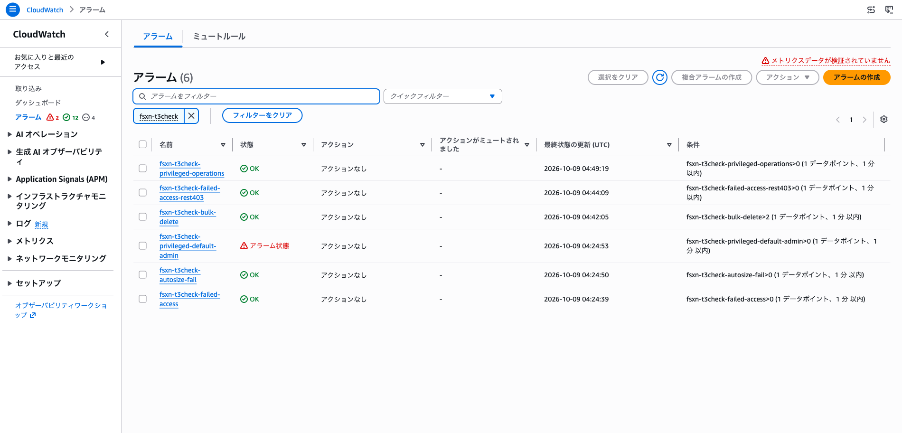
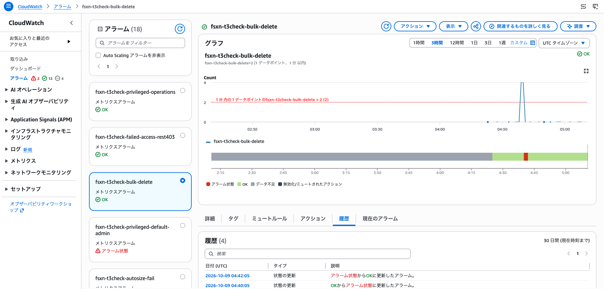
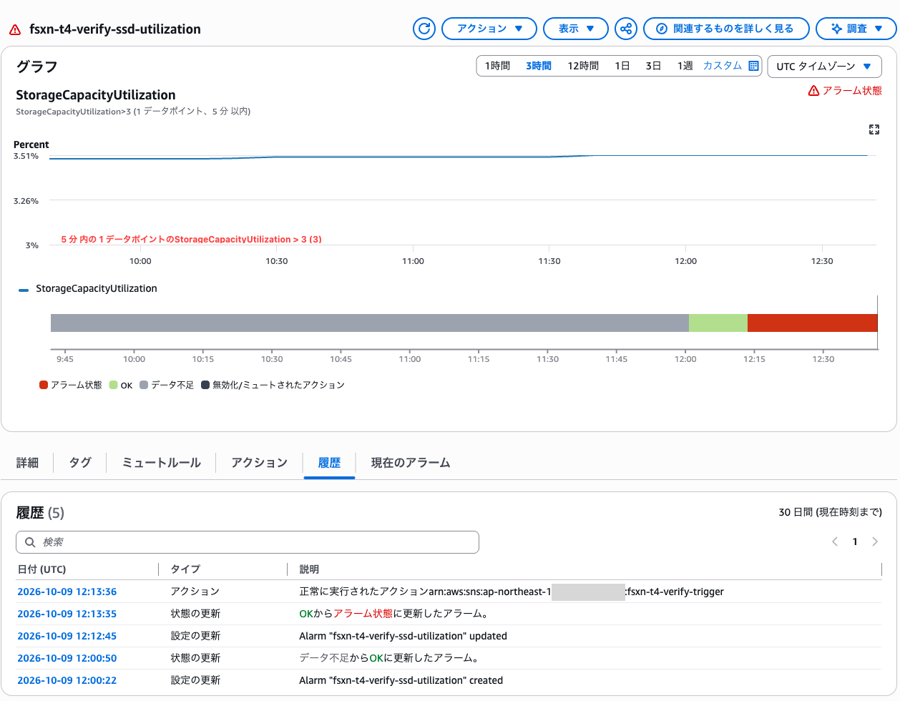
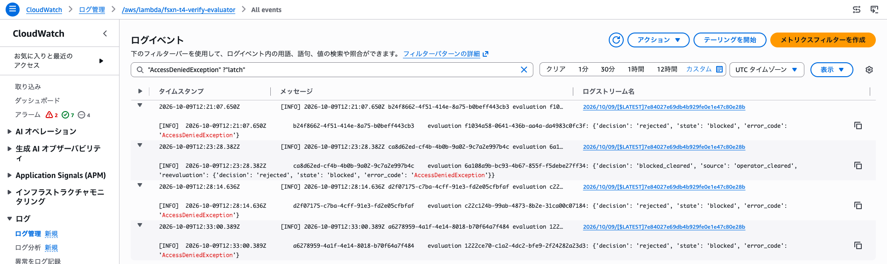
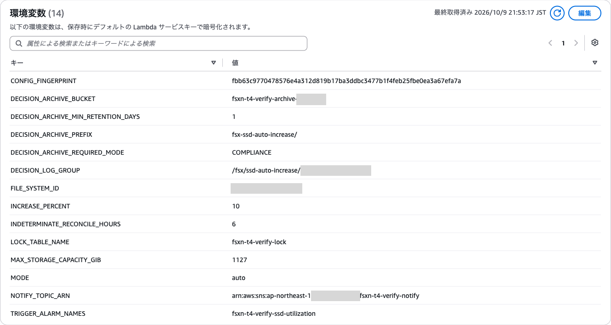

# CloudWatch 監視の動作確認結果（ダッシュボードテンプレート、Terraform モジュール、Qtree クォータ監視）

🌐 **日本語**（このページ） | [English](../en/verification-results-cloudwatch-monitoring.md)

## 実施概要

このページは 7 回の実行を記録しています。先にダッシュボードテンプレートと Terraform モジュールの 2026-10-05 の実行を記載します。Qtree クォータ監視の 2026-10-06 の最初の実行は、1 回のポーリングに成功した後に停止しており、経緯として [2026-10-06 の Qtree クォータ監視の実行](#2026-10-06-の-qtree-クォータ監視の実行)に残しています。同じ日の後刻の再実行は 4 回のポーリングを完了し、`QtreeQuotaAlarm` を OK から ALARM へ遷移させて OK に戻しました: [2026-10-06 の Qtree クォータ監視の再実行](#2026-10-06-の-qtree-クォータ監視の再実行)。2026-10-06 の夜に始めた実行では、テスト用ボリュームに実データを書き込み、テンプレートとモジュールの両方のファイルシステム容量アラームを OK から ALARM へ遷移させて OK に戻しました。これで F1 が残した ALARM 経路の空白が埋まります: [2026-10-06 の容量アラームの実データによる実行](#2026-10-06-の容量アラームの実データによる実行)。2026-10-07 に、ダッシュボードの表示を修正した後のモジュールをデプロイして撮影したダッシュボードとアラーム一覧の画面は、[2026-10-07 のダッシュボードとアラームの画面](#2026-10-07-のダッシュボードとアラームの画面)にあります。2026-10-08 には、Terraform のカスタムメトリクスモジュール（フェーズ T2、Qtree と SnapMirror）を適用し、1 つの SVM の中の関係で SnapMirror のアラームを動かしました: [2026-10-08 の Terraform カスタムメトリクスモジュールの実行](#2026-10-08-の-terraform-カスタムメトリクスモジュールの実行)。2026-10-09 には、Terraform のログアラームモジュール（フェーズ T3）を syslog VPC エンドポイント経路のロググループに適用し、実際の ONTAP の監査ログの行でアラームを動かしました。記録は [2026-10-09 の Terraform ログアラームモジュールの実行](#2026-10-09-の-terraform-ログアラームモジュールの実行)にあります。同じ 2026-10-09 の後刻に、Terraform の SSD 自動拡張モジュール（フェーズ T4）を `notify_only`・`approve`・`auto` で適用しました。`auto` は明示的な IAM の拒否の後ろで動かしたので、ストレージ容量は変わっていません。記録は [2026-10-09 の Terraform SSD 自動拡張モジュールの実行](#2026-10-09-の-terraform-ssd-自動拡張モジュールの実行)にあります。

2026-10-05（UTC）に、CloudFormation のダッシュボードテンプレート `shared/templates/fsxn-monitoring-dashboard.yaml` と Terraform モジュール `terraform/fsxn-monitoring-dashboard/` を、実在する Amazon FSx for NetApp ONTAP ファイルシステム 1 つに対してデプロイしました。対象は第 1 世代、`SINGLE_AZ_1`、HA ペア 1 つです。ダッシュボードのすべての系列がデータを返し、すべてのアラームが INSUFFICIENT_DATA を抜けて OK に達しました。Terraform のボリューム単位のアラーム 2 つは、ALARM に遷移させてから OK に戻すところまで確認しました。ファイルシステムの容量アラーム（CloudFormation と Terraform）は ALARM に遷移させられませんでした。閾値の下限（50%）が、観測した利用率（約 3.5%）を上回るためです（[F1](#所見) を参照）。この実行では、テンプレートとモジュールに欠陥は見つかっていません。2026-10-07 に見つかったダッシュボードの表示の欠陥は、[所見](#所見) の補足に記載しています。

| 項目 | 値 |
|------|-----|
| 検証日時 | 2026-10-05T16:03Z から 2026-10-06T00:06Z（UTC）。約 7.5 時間の中断を含む（環境情報を参照） |
| 検証環境 | テスト環境（`ap-northeast-1`）。アイドル状態のファイルシステムでのサンプル実行 |
| 範囲 | AWS 側の CloudWatch メトリクス・アラーム・ダッシュボードのみ。この実行では ONTAP REST API を呼んでいない |
| 結果 | デプロイ・系列・OK 評価: 合格。ボリューム単位の ALARM 経路: 合格。ファイルシステム容量の ALARM 経路: 到達不可（F1） |

以下の値が示すのは、このファイルシステムで系列が存在し、アラームがそれを評価することです。負荷時の挙動、第 2 世代のファイルシステム、HA ペアが 2 つ以上のファイルシステムについては何も示しません。

---

## 環境情報

| 項目 | 値 |
|------|-----|
| AWS リージョン | `ap-northeast-1` |
| ファイルシステム | `fs-0123456789abcdef0`（プレースホルダー）、AVAILABLE |
| デプロイタイプ / HA ペア数 | `SINGLE_AZ_1`（第 1 世代）/ 1 |
| スループット容量 / SSD 容量 | 128 MBps / 1024 GiB |
| 対象ボリューム | `fsvol-0123456789abcdef0`（プレースホルダー）。ルート以外、Lifecycle `CREATED`、`svm-0123456789abcdef0`（プレースホルダー）上 |
| ソースのリビジョン | `1a2414b`（main、#105 の後）。追跡ファイルは変更していない |
| Terraform / プロバイダー | Terraform v1.15.8（darwin_arm64）、ロックファイルの `hashicorp/aws` v6.67.0（`terraform init -lockfile=readonly`） |
| その他のツール | AWS CLI、boto3 1.43.93（読み取り専用の CloudWatch 呼び出し） |
| 認証 | AWS IAM Identity Center（SSO）のセッション |
| ONTAP のバージョン | 記録なし。この実行では ONTAP REST API を呼んでいない |
| 事前に存在した名前 | デプロイ前: スタック `fsxn-verify-monitoring-dashboard` は無し、接頭辞 `fsxn-verify` のアラームとダッシュボードはいずれも 0 件 |

SSO セッションは、最初のアラーム履歴の読み取り中の 2026-10-05T16:11Z ごろに期限切れになりました。回避策は取らずに実行を中断し、再サインイン後の 2026-10-05T23:47:34Z に再開しています。中断中に存在したのは CloudFormation スタックだけです。

`list-metrics` はこのファイルシステムについて 760 系列を返しました。2 つの成果物が使う組はすべて存在します。`CPUUtilization`、`FileServerDiskIopsUtilization`、`FileServerDiskThroughputUtilization`、`NetworkThroughputUtilization`、`DataReadBytes`/`DataWriteBytes`、`DataReadOperations`/`DataWriteOperations`、`NetworkSentBytes`/`NetworkReceivedBytes`、`StorageUsed` は `FileSystemId` のみ、`StorageCapacityUtilization` は `FileSystemId` + `StorageTier=SSD` + `DataType=All` です。`FileSystemId` だけの `StorageCapacityUtilization` 系列はありません。ボリューム単位では、`StorageCapacityUtilization` が `FileSystemId` + `VolumeId`（および `StorageTier=SSD` + `DataType=All` を加えた組）で存在し、`FilesUsed` と `FilesCapacity` が `FileSystemId` + `VolumeId` で存在します。

> **ディメンションに関する補足**: このファイルシステムに `FileSystemId` だけの `StorageCapacityUtilization` 系列が無いことは、#105 のディメンション修正と整合します。その変更の前は、容量アラームとウィジェットが `FileSystemId` だけを指定しており、ここではどの系列にも一致しなかったはずです。

---

## デプロイした構成

2 つの成果物は同じファイルシステムを対象に、順にデプロイしました。どちらも通知先のメールアドレスを指定していないため、SNS トピックは作成していません。

### CloudFormation ダッシュボードスタック

`shared/templates/fsxn-monitoring-dashboard.yaml` からスタック `fsxn-verify-monitoring-dashboard` を作成しました。パラメータは `CapacityThresholdPercent=80`、`FileSystemName=verify-fs` で、`NotificationEmail` は指定していません。作成されたのはダッシュボード 1 つ（`fsxn-verify-monitoring-dashboard-verify-fs`）と、テンプレートが常に作る 2 つのアラーム `StorageCapacityAlarm` と `ThroughputUtilizationAlarm` です。SNS トピックは作成されていません。

```bash
aws cloudformation deploy \
  --template-file shared/templates/fsxn-monitoring-dashboard.yaml \
  --stack-name fsxn-verify-monitoring-dashboard \
  --parameter-overrides \
    FileSystemId=fs-0123456789abcdef0 \
    FileSystemName=verify-fs \
    CapacityThresholdPercent=80 \
  --region ap-northeast-1
```

### Terraform モジュール

ローカルのルート構成から `name_prefix = "fsxn-verify-tf"` でモジュールを適用しました。オプトインのファイルサーバーアラーム 3 つをすべて有効にし、`file_server_names` は空にしたため、いずれも第 1 世代の形である `FileSystemId` のみを指定します。`volume_ids` にはボリュームを 1 つ指定しました。`notification_email` は指定していないため、SNS トピックは作成されていません。

```hcl
file_system_id                           = "fs-0123456789abcdef0"
file_system_name                         = "verify-fs"
name_prefix                              = "fsxn-verify-tf"
enable_cpu_utilization_alarm             = true
enable_disk_iops_utilization_alarm       = true
enable_disk_throughput_utilization_alarm = true
file_server_names                        = []
volume_ids                               = ["fsvol-0123456789abcdef0"]
```

`terraform plan` は 8 件の追加を報告し、`terraform apply` はダッシュボード 1 つ（`fsxn-verify-tf-verify-fs`）とアラーム 7 つを作成しました。

| アラーム（リソース） | 由来 | 確認した範囲 |
|----------------------|------|--------------|
| `storage_capacity` | テンプレートと同等 | OK の評価 |
| `network_throughput` | テンプレートと同等 | OK の評価 |
| `file_server["cpu_utilization"]` | オプトイン | OK の評価 |
| `file_server["disk_iops_utilization"]` | オプトイン | OK の評価 |
| `file_server["disk_throughput_utilization"]` | オプトイン | OK の評価 |
| `volume_capacity["fsvol-0123456789abcdef0"]` | オプトイン、`volume_ids` | OK、ALARM、OK への復帰 |
| `volume_inode["fsvol-0123456789abcdef0"]` | オプトイン、`volume_ids`（メトリクス算術式 `100 * FilesUsed / FilesCapacity`） | OK、ALARM、OK への復帰 |

---

## テスト結果サマリー

| # | 確認項目 | 結果 | 時刻（UTC） |
|---|----------|------|-------------|
| P4-1 | CloudFormation スタックのデプロイ | ✅ 合格。ダッシュボード 1、アラーム 2、SNS 無し | 2026-10-05T16:03:06Z → 16:03:43Z |
| P4-2 | ダッシュボードの全ウィジェット系列がデータポイントを返す（3 時間の窓） | ✅ 合格。9 系列中 9 系列が非ゼロ | 16:10:56Z、再確認 23:55:05Z |
| P4-3 | `StorageCapacityAlarm` INSUFFICIENT_DATA → OK | ✅ 合格 | 16:04:09Z |
| P4-4 | `ThroughputUtilizationAlarm` INSUFFICIENT_DATA → OK | ✅ 合格 | 16:04:26Z |
| P4-5 | `CapacityThresholdPercent=1` への更新 | ⛔ テンプレートが拒否（`MinValue` 50）。スタックは 80 のまま | 23:47:43Z |
| P4-6 | 下限の 50 へ更新し、`StorageCapacityAlarm` → ALARM | ⚠️ 到達不可。閾値 50.0 は反映されたが、利用率 3.45–3.51% でアラームは OK のまま（F1） | 23:47:54Z → 23:48:30Z、90 秒後に再読み取り |
| P4-7 | 80 に戻し、両アラームが OK | ✅ 合格 | 23:54:25Z → 23:55:02Z |
| P5-1 | `terraform init -lockfile=readonly` | ✅ 合格（`hashicorp/aws` v6.67.0） | 23:55:37Z |
| P5-2 | `terraform plan` | ✅ 合格。追加 8、変更 0、削除 0 | 23:55:37Z |
| P5-3 | `terraform apply` | ✅ 合格。8 件追加（ダッシュボード 1、アラーム 7） | 23:55:54Z → 23:55:57Z |
| P5-4 | 7 つのアラームすべてが INSUFFICIENT_DATA → OK | ✅ 合格（23:57:16Z までに全件 OK） | [アラームの状態遷移](#アラームの状態遷移)を参照 |
| P5-5 | ダッシュボードのウィジェットがデータを返す（3 時間の窓） | ✅ 合格。9 系列中 9 系列が非ゼロ | 2026-10-06T00:00:26Z |
| P5-6 | `capacity_threshold_percent=1` | ⛔ モジュールの検証が拒否（範囲 50–95）、`plan` は exit 1 | 00:00:34Z |
| P5-7 | 下限の閾値（容量 50、ボリューム容量 1、ボリューム inode 1）→ ALARM | ⚠️ 一部。ボリューム単位の 2 アラームは ALARM に到達。ファイルシステム容量アラームは閾値 50 を受け付け、3.45% で OK のまま（F1） | apply 00:00:42Z → 00:00:46Z |
| P5-8 | 既定値に戻し、全アラームが OK | ✅ 合格。00:03:56Z に 7 つすべて OK。続く `plan -detailed-exitcode` は exit 0、変更なし | apply 00:02:09Z → 00:02:17Z |
| P6 | 後片付けと約 65 秒後の再読み取り | ✅ 全リソースで合格 | 00:04:08Z → 00:06:10Z |

---

## アラームの状態遷移

`describe-alarm-history`（`StateUpdate`）より、UTC。アラーム名に含まれるボリューム ID はプレースホルダーに置き換えています。

| アラーム | 遷移 | 時刻 | 状態理由に含まれる値 |
|----------|------|------|----------------------|
| `fsxn-verify-monitoring-dashboard-capacity-high` | INSUFFICIENT_DATA → OK | 2026-10-05T16:04:09Z | 3.49, 3.49, 3.49, not > 80 |
| `fsxn-verify-monitoring-dashboard-throughput-high` | INSUFFICIENT_DATA → OK | 2026-10-05T16:04:26Z | 0.337, 0.273, 0.271, not > 80 |
| `fsxn-verify-tf-capacity-high` | INSUFFICIENT_DATA → OK | 2026-10-05T23:56:34Z | 3.45 ×3, not > 80 |
| `fsxn-verify-tf-fsvol-0123456789abcdef0-capacity-high` | INSUFFICIENT_DATA → OK | 2026-10-05T23:56:42Z | 20.23 ×3, not > 80 |
| `fsxn-verify-tf-cpu-high` | INSUFFICIENT_DATA → OK | 2026-10-05T23:56:51Z | 13.64, 12.81, 13.25, not > 80 |
| `fsxn-verify-tf-throughput-high` | INSUFFICIENT_DATA → OK | 2026-10-05T23:56:55Z | 0.280, 0.282, 0.315, not > 80 |
| `fsxn-verify-tf-disk-iops-high` | INSUFFICIENT_DATA → OK | 2026-10-05T23:57:03Z | 0.367, 0.318, 0.414, not > 80 |
| `fsxn-verify-tf-fsvol-0123456789abcdef0-inode-high` | INSUFFICIENT_DATA → OK | 2026-10-05T23:57:11Z | 34.908 ×3, not > 80 |
| `fsxn-verify-tf-disk-throughput-high` | INSUFFICIENT_DATA → OK | 2026-10-05T23:57:16Z | 0.367, 0.337, 0.393, not > 80 |
| `fsxn-verify-tf-fsvol-0123456789abcdef0-inode-high` | OK → ALARM | 2026-10-06T00:01:45Z | 34.908 ×3, > 1 |
| `fsxn-verify-tf-fsvol-0123456789abcdef0-capacity-high` | OK → ALARM | 2026-10-06T00:01:46Z | 20.23 ×3, > 1 |
| `fsxn-verify-tf-fsvol-0123456789abcdef0-inode-high` | ALARM → OK | 2026-10-06T00:03:20Z | 34.908 ×3, not > 80 |
| `fsxn-verify-tf-fsvol-0123456789abcdef0-capacity-high` | ALARM → OK | 2026-10-06T00:03:47Z | 20.23 ×3, not > 80 |

すべてのアラームが作成から約 1.5 分以内に OK に達しました。CloudWatch が既存のメトリクス履歴から 300 秒の期間 3 つを評価したためです。INSUFFICIENT_DATA のまま残ったアラームはありません。CloudFormation の容量アラームと Terraform のファイルシステム容量アラームには ALARM の記録がありません（F1）。

---

## ダッシュボードウィジェットのデータポイント

両方のダッシュボードが描画する 9 つのメトリクス系列について、直近 3 時間の `get-metric-data` の結果です。式の行（MB/s と IOPS への換算）はこれらの系列から計算されるため、別には数えていません。すべてのクエリで Status は `Complete` でした。

| ウィジェット | メトリクス（統計 / 期間） | ディメンション | CFN 13:10–16:10Z | CFN 20:55–23:55Z | TF 21:00–00:00Z | 観測した範囲 |
|--------------|--------------------------|----------------|:---:|:---:|:---:|--------------|
| Network Throughput (MB/s) | `DataReadBytes` Sum / 60 | `FileSystemId` | 180 | 180 | 180 | 0–3098 bytes/min |
| Network Throughput (MB/s) | `DataWriteBytes` Sum / 60 | `FileSystemId` | 180 | 180 | 180 | 0–1128 bytes/min |
| IOPS (Operations/s) | `DataReadOperations` Sum / 60 | `FileSystemId` | 180 | 180 | 180 | 0–6 /min |
| IOPS (Operations/s) | `DataWriteOperations` Sum / 60 | `FileSystemId` | 180 | 180 | 180 | 0–1 /min |
| Network Throughput Utilization (%) | `NetworkThroughputUtilization` Average / 60 | `FileSystemId` | 180 | 179 | 179 | 0.217–0.540% |
| Storage Capacity Utilization (%) | `StorageCapacityUtilization` Average / 300 | `FileSystemId`, `StorageTier=SSD`, `DataType=All` | 36 | 36 | 36 | 3.45–3.51% |
| Network Sent/Received (MB/s) | `NetworkSentBytes` Sum / 60 | `FileSystemId` | 180 | 179 | 179 | 1.95e7–4.86e7 bytes/min |
| Network Sent/Received (MB/s) | `NetworkReceivedBytes` Sum / 60 | `FileSystemId` | 180 | 179 | 179 | 1.53e7–3.81e7 bytes/min |
| Storage Used (GB) | `StorageUsed` Average / 300 | `FileSystemId` | 36 | 36 | 36 | 3.58e9–3.79e9 bytes |

180 ではなく 179 になっているのは、クエリ時点でまだ公開されていなかった直近 1 分の区間です。データポイントが 0 件の系列はありません。

> **負荷に関する補足**: ファイルシステムはアイドル状態で、負荷は生成していません。これらの件数は系列が存在して描画されることを示すもので、性能値ではありません。

---

## 所見

| # | 所見 | 種別 | この記録への影響 |
|---|------|------|------------------|
| F1 | 容量閾値の範囲が、利用率の低いファイルシステムでの ALARM 経路の確認を妨げる。`CapacityThresholdPercent`（CloudFormation、`MinValue` 50 / `MaxValue` 95）と `capacity_threshold_percent`（Terraform、同じ 50–95 の検証）はどちらも 1 を拒否した。下限の 50 では、利用率 3.45–3.51% は閾値を超えない | 検証上の制約で、コードの欠陥ではない | `StorageCapacityAlarm` と Terraform の `storage_capacity` について、OK → ALARM → OK は**この実行では未検証**。後に第 1 世代のファイルシステムで実データを書き込んで検証した: [2026-10-06 の容量アラームの実データによる実行](#2026-10-06-の容量アラームの実データによる実行)。検証済みなのは、ディメンションの組がデータを返し、アラームがそれを OK と評価すること。ALARM 経路は、閾値が 1–100 を受け付けるボリューム単位の 2 アラームで検証した。`set-alarm-state` は使っていない。これが確かめるのは通知の配線で、メトリクスの評価ではないため |
| F2 | 状態をまたがない閾値だけの変更（CloudFormation で 50）の後、CloudWatch は履歴を追加せず、アラームの `StateReason` は直前の遷移の文言（"threshold (80.0)"）のまま残る。`Threshold` フィールドは 50.0 を示す | CloudWatch の挙動で、コードの欠陥ではない | 50 での評価は ALARM にならなかったことからの推定で、直接は観測していない |

ダッシュボードテンプレートと Terraform モジュールの欠陥: この実行では見つかっていません。ダッシュボードの 9 系列と、アラームのメトリクスの組 9 つ（CloudFormation 2、Terraform 7）はすべて既存の系列に一致し、このファイルシステムでデータを返しました。

> **ダッシュボード表示に関する補足**
>
> 2026-10-07 に、デプロイしたダッシュボードのスクリーンショットを撮り、`aws cloudwatch get-dashboard` で本文を読み戻したところ、4 つのウィジェット（Network Throughput、IOPS、Network Sent/Received、Storage Used）が、式の入力である生のメトリクスを換算後の系列と同じ軸に描画していました。軸は 1 分あたりの生のバイト数や操作数、または生のバイト数を示し（Network Throughput の軸は MB/s のラベルのまま約 1.9G に達した）、換算後の MB/s、IOPS、GB の線は 0 付近にありました。2 つの利用率のウィジェット（Network Throughput Utilization、Storage Capacity Utilization）とすべてのアラームは影響を受けていません。上の `get-metric-data` の件数は、描画されたグラフではなく系列を読んだものなので、引き続き有効です。修正では、テンプレートとモジュールの両方で、生の入力 7 行に `visible: false` を設定しました。タグ `terraform-fsxn-monitoring-dashboard-v0.1.0` はこの修正より前のもので、修正はタグ `terraform-fsxn-monitoring-dashboard-v0.1.1` に含まれています。修正後のダッシュボードの画面は [2026-10-07 のダッシュボードとアラームの画面](#2026-10-07-のダッシュボードとアラームの画面) にあります。

---

## 未検証の範囲

| 項目 | 状態 | 理由 |
|------|------|------|
| `shared/templates/qtree-quota-monitor.yaml` | この実行では未実施 | 2026-10-05 の実行の範囲外で、Qtree のリソースはデプロイしていない。2026-10-06 に別途実行した。最初の実行は 1 回のポーリングに成功した後に停止し（[2026-10-06 の Qtree クォータ監視の実行](#2026-10-06-の-qtree-クォータ監視の実行)）、再実行は完了した（[2026-10-06 の Qtree クォータ監視の再実行](#2026-10-06-の-qtree-クォータ監視の再実行)） |
| ファイルシステム容量アラームの ALARM 経路（CloudFormation と Terraform） | この実行では未検証 | F1。後に第 1 世代のファイルシステムで検証済み: [2026-10-06 の容量アラームの実データによる実行](#2026-10-06-の容量アラームの実データによる実行) |
| 第 2 世代のファイルシステム（`file_server_names`、`FileServer` と `Aggregate` のディメンション） | 未実施 | 検証対象は第 1 世代 |
| HA ペアが 2 つ以上のファイルシステム | 未実施 | 検証対象の HA ペアは 1 つ |
| SNS 通知の配信 | 未実施 | `NotificationEmail` / `notification_email` を指定しなかったため、トピック・購読・アラーム/OK アクションが存在しなかった |
| レイテンシウィジェット | 対象外 | ダッシュボードにレイテンシウィジェットが実装されていない |
| 負荷時の挙動 | 未実施 | アイドル状態のファイルシステムで、負荷を生成していない |

---

## 後片付け

| 手順 | 結果 | 時刻（UTC） |
|------|------|-------------|
| 削除前の `terraform plan -detailed-exitcode` | exit 0、変更なし | 2026-10-06T00:04Z |
| `terraform destroy -auto-approve` | exit 0、8 件削除。`terraform state list` は空 | 00:04:08Z → 00:04:13Z |
| `aws cloudformation delete-stack` + `wait stack-delete-complete` | どちらも exit 0。`list-stacks` は DELETE_COMPLETE | 00:04:20Z → 00:04:51Z |
| 全リソースの再読み取り | スタックは存在しない。ダッシュボード 2 つはどちらも `ResourceNotFound`。どちらの接頭辞でもダッシュボード 0 件、アラーム 0 件（メトリクスと複合の両方）。9 つのアラーム名はそれぞれ 0 件。SNS トピック 0 件 | 00:06:10Z（スタック削除完了の約 65 秒後） |
| ローカルの Terraform 作業ディレクトリ（state、plan ファイル、tfvars） | 削除済み | 再読み取りの後 |

カスタムメトリクスは出力していません。2 つの成果物のメトリクス参照はすべて名前空間 `AWS/FSx` で、どちらも Lambda 関数も `PutMetricData` も含まず、この実行が作成したのは CloudWatch のアラームとダッシュボードだけです。VPC エンドポイント・セキュリティグループ・IAM・ボリューム・Lambda のリソースは作成も変更もしていません。CloudFormation スタックは SSO の中断を含めて約 8 時間、Terraform のリソースは約 8 分存在しました。

---

## 総合判定

| 項目 | 値 |
|------|-----|
| 判定 | ✅ 第 1 世代・HA ペア 1 つのファイルシステムで、両成果物のデプロイ・系列の指定・OK の評価を検証済み。ボリューム単位の ALARM 経路を検証済み（Terraform）。ファイルシステム容量の ALARM 経路はこの実行では未検証（F1）で、後の[実データによる実行](#2026-10-06-の容量アラームの実データによる実行)で検証済み |
| 合格 | 16 件中 12 件（P4-1–P4-4、P4-7、P5-1–P5-5、P5-8、P6） |
| 一部合格・到達不可 | 16 件中 2 件（P4-6、P5-7）。どちらも F1 による |
| 設計どおりの拒否 | 16 件中 2 件（P4-5、P5-6）。範囲外の閾値の要求を、テンプレートとモジュールが拒否した |
| 見つかった欠陥 | この実行では無し。2026-10-07 にダッシュボードの表示の欠陥が見つかった。[所見](#所見) を参照 |

---

## 2026-10-06 の Qtree クォータ監視の実行

2026-10-06（UTC）に、`shared/templates/qtree-quota-monitor.yaml` を、HA ペア 1 つの第 1 世代 `SINGLE_AZ_1` の FSx for ONTAP ファイルシステムに対してデプロイしました。実行は 02:16:26Z に停止しました。ONTAP がポーラーに HTTP 401 を返し始めたためで、ONTAP からの 401 または 403 はこの実行の停止条件の 1 つでした。停止の前に、スケジュールによるポーリングが 1 回成功しています。このポーリングは `FSxONTAP/Qtree` にデータポイントを 5 つ公開し、どの値も ONTAP のクォータレポートと一致しました。`QtreeQuotaAlarm` はそのデータポイントで INSUFFICIENT_DATA を抜けて OK に達しています。`QtreeQuotaAlarm` を ALARM に遷移させるための閾値の変更は、予定していましたが実行していません。その後に続いた失敗したポーリングにより、DLQ の経路は端から端まで確認できました。テンプレート単位の問題が 2 つ見つかっています（401/403 に対するバックオフが無いこと、スタック削除の順序によりロググループが取り残されること）。後述の所見（QF2、QF3）を参照してください。

| 項目 | 値 |
|------|-----|
| 検証日時 | 2026-10-06T01:56Z から 03:03Z（UTC） |
| 検証環境 | テスト環境（`ap-northeast-1`）。SVM 1 つ、テスト用ボリューム 1 つ、tree クォータを設定した Qtree 1 つでのサンプル実行 |
| 範囲 | スタックのデプロイ、Qtree 単位と SVM 単位のメトリクスの公開、アラームの初期評価、後片付け。Qtree の準備とクォータレポートの読み取りのため、踏み台ホストから ONTAP REST API を呼んだ |
| 結果 | 停止。予定した 2 回の成功ポーリングのうち 1 回を完了した後、ONTAP が HTTP 401 を返した。`QtreeQuotaAlarm` の ALARM 経路は未実施 |

以下の値は、1 つの Qtree に対する 1 回のポーリングから得たものです。示すのは、テンプレートが記載するディメンションの組で系列が公開されること、アラームが SVM 単位の系列を評価することです。複数サイクルにわたる挙動、規模を大きくしたときの挙動、第 2 世代や HA ペアが 2 つ以上のファイルシステムでの挙動は示しません。

### 環境とデプロイした構成（Qtree の実行）

| 項目 | 値 |
|------|-----|
| AWS リージョン | `ap-northeast-1` |
| ファイルシステム | `fs-0123456789abcdef0`（プレースホルダー）、`SINGLE_AZ_1`（第 1 世代）、HA ペア 1 つ、128 MBps |
| ONTAP のバージョン | NetApp Release 9.18.1P6（`GET /api/cluster`） |
| SVM | `<svm-name>`（プレースホルダー）、NFS 有効 |
| テンプレートのリビジョン | main の `54e4c5d`（#104）の `qtree-quota-monitor.yaml`。作業ツリーと同一 |
| テスト用ボリューム | `zz_mon_verify_qtree`、1024 MiB、UNIX セキュリティスタイル、スナップショットポリシー none、階層化ポリシー NONE。この実行のために Amazon FSx for NetApp ONTAP の管理 API（`aws fsx create-volume`）で作成し、終了後に削除 |
| Qtree とクォータ | Qtree `qt_mon_verify` に tree クォータルールを設定。ハードリミット 104857600 バイト（100 MiB）。ボリュームのクォータを有効化 |
| 書き込んだデータ | 踏み台ホストから一時的に NFSv3 でマウントして 60 MiB を書き込み、アンマウント。書き込み後の ONTAP のクォータレポート: 使用量 63168512 バイト、ハードリミット 104857600、`hard_limit_percent` 60。ポリシーを変更せずにマウントできたのは、ボリュームに SVM の `default` エクスポートポリシーが割り当てられ、そのルールがクライアント `0.0.0.0/0` に読み書きとスーパーユーザーのアクセスを許可していたため（テスト環境の設定。下のセキュリティに関する補足を参照） |
| Lambda の配置 | ファイルシステムのサブネット。そのルートテーブルは `0.0.0.0/0` をインターネットゲートウェイに送り、NAT ゲートウェイは無い |
| CloudWatch への経路 | この実行のために Lambda のサブネットに作成した `com.amazonaws.ap-northeast-1.monitoring` interface エンドポイント（プライベート DNS 有効） |
| Secrets Manager への経路 | VPC に既存の interface エンドポイントがあるため `CreateSecretsManagerEndpoint=false` |
| セキュリティグループ | Lambda と新しいエンドポイントの両方に、ファイルシステムの既存のセキュリティグループを使用。インバウンドはすべてのプロトコルを `0.0.0.0/0` から許可し、エグレスはすべての通信を許可している（テスト環境の設定。下のセキュリティに関する補足を参照）。そのため 443 は既に許可されており、セキュリティグループと IAM は変更していない |
| ONTAP の認証情報 | Secrets Manager に保存した `fsxadmin` の認証情報 |
| 認証 | AWS IAM Identity Center（SSO）のセッション |

> **セキュリティに関する補足**: 上のセキュリティグループとエクスポートポリシーは、テスト環境に既存の設定であり、推奨する設定ではありません。どちらも許可範囲が広かったため、この実行が示すのは、ネットワークと NFS の経路が開いている状態でモニターが動くことです。最小権限の構成を検証したものではありません。最小権限の構成では、Lambda のセキュリティグループから管理インターフェイスと 2 つの interface エンドポイントへの 443 だけを許可し、エクスポートポリシーはマウントが必要なクライアントに限ります。その構成はこの実行では試していません。

`shared/scripts/preflight-check.sh --profile automated-response` は exit 0 で、既存の Secrets Manager エンドポイントについて警告を 1 件出しました。このスクリプトにはこのテンプレート用のプロファイルが無く、`monitoring` エンドポイントの有無も確認しません（QF4）。

```bash
aws cloudformation create-stack \
  --stack-name fsxn-verify-qtree-quota \
  --template-body file://shared/templates/qtree-quota-monitor.yaml \
  --capabilities CAPABILITY_NAMED_IAM \
  --parameters \
    ParameterKey=OntapMgmtIp,ParameterValue=<management-ip> \
    ParameterKey=OntapCredentialsSecretArn,ParameterValue=arn:aws:secretsmanager:ap-northeast-1:123456789012:secret:<secret-name>-XXXXXX \
    ParameterKey=SvmName,ParameterValue=<svm-name> \
    ParameterKey=VpcId,ParameterValue=vpc-0123456789abcdef0 \
    ParameterKey=SubnetIds,ParameterValue=subnet-0123456789abcdef0 \
    ParameterKey=SecurityGroupId,ParameterValue=sg-0123456789abcdef0 \
    ParameterKey=PollIntervalMinutes,ParameterValue=5 \
    ParameterKey=QuotaThresholdPercent,ParameterValue=85 \
    ParameterKey=NotificationEmail,ParameterValue='' \
    ParameterKey=CreateSecretsManagerEndpoint,ParameterValue=false \
    ParameterKey=CaCertPath,ParameterValue='' \
    ParameterKey=CaCertLayerArn,ParameterValue='' \
  --region ap-northeast-1
```

スタックが作成したのは、IAM ロール、Lambda 関数、そのロググループ（保持期間 30 日）、DLQ、EventBridge のスケジュールルール、2 つのアラーム `fsxn-verify-qtree-quota-quota-high`（`QtreeQuotaAlarm`）と `fsxn-verify-qtree-quota-dlq-depth` です。`NotificationEmail` は空のため、SNS トピックは作成されていません。

### 確認項目の結果（Qtree の実行）

| # | 確認項目 | 結果 | 時刻（UTC） |
|---|----------|------|-------------|
| Q0 | 事前確認: エンドポイント、ルート、セキュリティグループ、ONTAP の読み取り専用の確認（クラスター、SVM、クォータレポートとルール、ボリューム） | ✅ 合格。SVM に tree クォータが無かったため Q1 が必要だった | 01:56:09Z → 01:59:22Z |
| Q1 | Qtree の準備: ボリューム、Qtree、100 MiB の tree クォータルール、クォータの有効化、60 MiB の書き込み | ✅ 合格 | 02:00:04Z → 02:02:28Z |
| Q2-1 | `monitoring` interface エンドポイント | ✅ 合格。available | 02:03:11Z → 02:04:26Z |
| Q2-2 | スタックの作成 | ✅ 合格。CREATE_COMPLETE | 02:04:00Z → 02:06:48Z |
| Q2-3 | ポーリング 1 回目: 系列が公開され、値が ONTAP のレポートと一致する | ✅ 合格。データポイント 5 つがすべて一致 | 02:11:22Z |
| Q2-4 | ポーリング 2 回目（必要な 2 回目の成功サイクル） | ❌ 不合格。ONTAP が HTTP 401（停止条件） | 02:16:22Z |
| Q3 | `QuotaThresholdPercent` を 85 → 50 にして `QtreeQuotaAlarm` を 60.24% で ALARM に遷移させ、元に戻す | ⏹️ 未実施（その前に停止） | — |
| Q4 | 後片付けと再読み取り | ✅ AWS のリソースはすべて合格。ONTAP 側の再読み取りは不可（401） | 02:24:36Z → 03:03:54Z |

### 観測したメトリクスとディメンションの組

ポーリング 1 回目（02:11:22Z）はコールドスタートでした。関数は `Found 2 qtree quota reports for SVM <svm-name> in 1 page(s)` と `Published 5 metric data points` をログに出し、実行時間は 629.89 ms、最大メモリは 95 MB でした。初期化時には、TLS 証明書の検証が無効（`cert_reqs=CERT_NONE`）で PoC 用途に限るという警告をログに出しています。`CaCertPath` が空だったためです。

その後、`FSxONTAP/Qtree` に対する `list-metrics` は次のディメンションの組を返しました。

| メトリクス | ディメンション |
|------------|----------------|
| `QtreeQuotaUsedPercent`、`QtreeQuotaUsedBytes`、`QtreeQuotaLimitBytes` | `SvmName`、`VolumeName=zz_mon_verify_qtree`、`QtreeName=qt_mon_verify` |
| `QtreeQuotaUsedPercentMax`、`QtreeQuotaReportTruncated` | `SvmName` のみ |

ボリュームのデフォルト Qtree（名前が空で、ハードリミットが無い）については系列を公開していません。ONTAP はこれも tree クォータレポートのレコードとして返します。

| メトリクス | 公開した値（各 1 データポイント） | ONTAP のクォータレポート（02:02:28Z） | 一致 |
|------------|----------------------------------|---------------------------------------|------|
| `QtreeQuotaUsedBytes` | 63168512 Bytes | 使用量 63168512 | 一致 |
| `QtreeQuotaLimitBytes` | 104857600 Bytes | ハードリミット 104857600 | 一致 |
| `QtreeQuotaUsedPercent` | 60.2421875 Percent | 63168512 / 104857600 × 100 = 60.2421875（ONTAP の `hard_limit_percent` は 60） | 一致 |
| `QtreeQuotaUsedPercentMax` | 60.2421875 Percent | Qtree 1 つでの最大値 | 一致 |
| `QtreeQuotaReportTruncated` | 0 Count | 1 ページ、次のリンク無し | 一致 |

> **ページングに関する補足**: これは 1 ページの場合です。レコード 2 件が 1 ページに収まり、次のリンクが無かったため、`QtreeQuotaReportTruncated` は 0 でした。次のリンクをたどる動作、50 ページの上限、打ち切りの値 1 は確認していません。

### アラームの状態遷移（Qtree スタック）

`describe-alarm-history`（`StateUpdate`）と `describe-alarms` より、UTC。

| アラーム | 遷移 | 時刻 | 状態理由に含まれる値 |
|----------|------|------|----------------------|
| `fsxn-verify-qtree-quota-dlq-depth` | INSUFFICIENT_DATA → OK | 02:05:51Z | 初回の評価 |
| `fsxn-verify-qtree-quota-quota-high` | INSUFFICIENT_DATA → OK | 02:12:50Z | データポイント 1 つ、60.2421875、not > 85 |
| `fsxn-verify-qtree-quota-dlq-depth` | OK → ALARM | 02:22:51Z | データポイント 1 つ、1.0、> 0 |

`QtreeQuotaAlarm` は、`EvaluationPeriods` が 2 であるにもかかわらず、データポイント 1 つで OK に達しました（QF8）。Q3 を実行していないため、ALARM の記録はありません。

DLQ の経路は、停止の副次的な結果として端から端まで確認できました。02:16:22Z に失敗した呼び出しは非同期で 2 回リトライされ（02:17:19Z、02:19:12Z）、02:19:16Z にエラーの文言を属性に持つメッセージが DLQ に届き、02:22:51Z に DLQ 深度アラームが ALARM に遷移しました。`NotificationEmail` が空だったため、SNS のアクションはありません。

### ONTAP の HTTP 401 によるポーラーの停止

| 時刻（UTC） | 呼び出し | 結果 |
|-------------|----------|------|
| 02:11:22Z | サイクル 1、コールドスタート | 成功（ONTAP の呼び出しは 0.63 秒） |
| 02:16:22Z | サイクル 2。サイクル 1 と同じウォームコンテナ、同じキャッシュ済みの認証情報 | HTTP 401 |
| 02:17:19Z、02:19:12Z | サイクル 2 の非同期リトライ | HTTP 401。02:19:16Z に DLQ メッセージ |
| 02:21:22Z | サイクル 3、ウォームコンテナ | HTTP 401 |
| 02:22:24Z | シークレットを読み直した新しいコンテナでのリトライ | HTTP 401 |
| 02:24:42Z | リトライ | HTTP 401 |

401 の応答はそれぞれ約 4.1–4.5 秒かかりました。ログに出るのはリクエストのパスとステータスだけで、パスワードやシークレットの値はログに出ていません。

停止後は ONTAP へのログインを試みず、読み取りだけで調べた結果は次のとおりです。

- シークレットの値が最後に変更されたのは実行の前（01:48:18Z）で、実行中には変更されていない。
- FSx for ONTAP の管理 API（`UpdateFileSystem`）による最後の `fsxadmin` のパスワードリセットは 01:41:33Z に要求され、完了している。CloudTrail には 01:00Z から 03:00Z の間に他の `UpdateFileSystem` の呼び出しが無い。
- つまり、踏み台ホスト（01:58Z から 02:02Z）とポーラー（02:11:23Z）で通った認証情報が 02:16:26Z から拒否された。その間に FSx for ONTAP の管理 API によるリセットもシークレットの変更も無い。
- この実行のプリンシパルのほかに、もう 1 つのプリンシパルが 02:22:30Z に同じシークレットを読んでいる。それが何に接続するのかは特定していない。

401 の原因は特定できていません。仮説が 2 つ残っており、どちらも ONTAP 側からは確認していません。

- 別のクライアントによるアカウントのロック。同じ VPC にある別の関数が、02:02Z ごろ、02:06Z ごろに 2 回、02:12Z ごろに呼び出されていた。いずれも 01:41Z のパスワードリセットの後、02:16:22Z の最初の 401 の前である。02:06Z の呼び出しはそれぞれ約 4 秒かかっており、ポーラーの 401 応答と同じ所要時間だった。この関数がリセット前のパスワードで認証を試み、ログイン失敗の繰り返しで `fsxadmin` がロックされたという見方と整合する。
- FSx for ONTAP の管理 API を経由しない、ONTAP 内でのパスワード変更。

どちらかを確かめるには、ONTAP 側の読み取り（ログインとロックの状態、または EMS イベント）か、FSx for ONTAP の管理 API による新たなパスワードリセットが必要です。この実行ではどちらも行っていません。同じ日の後刻の再実行では、その別の関数をスロットリングしてからパスワードをリセットし、401 なしで 4 回のポーリングを完了しました。[再実行前の認証情報の扱い](#再実行前の認証情報の扱い)を参照してください。

> **認証情報の共有に関する補足**: `fsxadmin` のパスワードを保存しているクライアントは、パスワードのリセットより前に、またはリセットと同時に更新する必要があります。古いパスワードを持つクライアントがログインに失敗し続け、ONTAP がアカウントをロックすると、このポーラーを含め、そのアカウントを共有するすべてのクライアントが失敗します。ポーラーが送るのは `/api/storage/quota/reports` への `GET` リクエストだけなので（確信度: `コード確認済み`）、読み取り専用ロールを持つ専用の ONTAP アカウントを使えば、`fsxadmin` を他のクライアントと共有せずに済みます。読み取り専用アカウントはこの実行では試していません。

### 所見（Qtree の実行）

| # | 所見 | 種別 | この記録への影響 |
|---|------|------|------------------|
| QF1 | `fsxadmin` の認証情報が、通ってから約 5 分後の 02:16:26Z から拒否された（HTTP 401）。その間に FSx for ONTAP の管理 API によるリセットもシークレットの変更も無い | 環境。原因は未特定 | 2 回目のポーリングサイクルと Q3 を妨げた。再実行の前に、ONTAP へのアクセスを回復し、原因を特定する必要がある |
| QF2 | ポーラーには 401/403 に対するバックオフが無い。5 分間隔のスケジュールと、呼び出しごとの 2 回の非同期リトライにより、約 8 分間（02:16:26Z から 02:24:46Z）に失敗する Basic 認証のリクエストを 6 回送った。ONTAP のロックアウトポリシーの下では、アカウントのロックが続く | テンプレートの設計上のトレードオフ | 401 で例外を送出しなければリトライは避けられるが、失敗が DLQ にも入らなくなる。この記録では修正を提案しない |
| QF3 | スタックの削除で、ロググループ（02:24:40Z）が関数（02:25:18Z）より先に削除され、ロールは 02:25:33Z まで `logs:CreateLogGroup` を許可していた。実行中のリトライが 02:24:51Z に保持期間なしでロググループを作り直した | テンプレートの欠陥（削除の順序） | スタックを削除した利用者の手元に、期限切れにならないロググループが取り残されうる。考えられる修正（未検証）: 関数に `DependsOn` を付けて先に削除させる、またはロールから `logs:CreateLogGroup` を外す |
| QF4 | `preflight-check.sh` にはこのテンプレート用のプロファイルが無く、`com.amazonaws.<region>.monitoring` の有無を確認しない。テンプレートもこのエンドポイントを作成しない | ツールとドキュメントの不足 | 今回のように NAT の無いサブネットでは、Lambda が `PutMetricData` を呼べるよう、エンドポイントを手作業で作成する必要があった |
| QF5 | `OntapMgmtIp` は IPv4 のリテラルだけを受け付け、管理用の DNS 名は `AllowedPattern` で拒否される | パラメータの制約 | 管理 IP が 1 つの今回の環境では問題なかった。IP が変わりうる場合に DNS 名のほうが安全な入力かどうかは評価していない |
| QF6 | ログの `Found 2 qtree quota reports` と戻り値のフィールド `qtrees_monitored`（2）は、後で読み飛ばすデフォルト Qtree のレコードを数えている。公開したのは Qtree 1 つ | 件数の表現 | この件数はレポートのレコード数で、監視している Qtree の数ではない |
| QF7 | 公開する割合（60.2421875）はバイト数から計算している。ONTAP の `hard_limit_percent` は 60 に丸める | 挙動に関する補足 | アラームの閾値は丸める前の値と比較される |
| QF8 | `QtreeQuotaAlarm` は `EvaluationPeriods` 2 で、データポイント 1 つで INSUFFICIENT_DATA から OK に遷移した | CloudWatch の挙動。1 回観測 | CloudWatch が部分的なデータを評価したことと整合する。再現は未確認 |

### 後片付け（Qtree の実行）

| 手順 | 結果 | 時刻（UTC） |
|------|------|-------------|
| `aws cloudformation delete-stack` | DELETE_COMPLETE | 02:24:37Z → 02:26:35Z |
| `monitoring` interface エンドポイントの削除 | 受理（失敗した項目は無し） | 02:25:02Z |
| ONTAP REST API: クォータルールの削除、クォータの無効化、Qtree の削除 | 試行していない。ONTAP は 401 を返しており、ログインの失敗を重ねるとロックが延びるおそれがあった | — |
| `SkipFinalBackup=true` での `aws fsx delete-volume` | ボリュームは見つからない状態として読み戻された | 02:56:00Z → 02:57:18Z |
| リトライが作り直したロググループの削除（QF3） | 削除済み。唯一のストリーム（02:24:42Z のリトライ）は先に保存した | 02:59:35Z |
| AWS の全リソースの再読み取り | スタックは存在しない（スタック ID では DELETE_COMPLETE）。エンドポイント、ボリューム、アラーム、関数、IAM ロール、DLQ、スケジュールルール、Lambda のネットワークインターフェイス、ロググループはいずれも何も返さない。踏み台ホストにマウントは残っていない | 02:58:59Z → 03:03:54Z |

未解決の項目が 2 つあります。

- ボリュームの削除時に、ONTAP が SVM のクォータポリシーから tree クォータルールを外したかどうかは未確認です。ONTAP へのアクセスが回復したら、`GET /api/storage/quota/rules?svm.name=<svm-name>` で確認し直してください。この項目は再実行で解消しました。05:29:25Z にこの呼び出しが返したのは再実行で作成した直後のルール 2 件だけで、この実行のルールは SVM に残っていませんでした。
- `FSxONTAP/Qtree` のカスタムメトリクス 5 系列は削除できず、02:59:04Z の時点でも一覧に出ていました。CloudWatch は、新しいデータが約 2 週間無いメトリクスを一覧に出さなくなり、そのデータを 15 か月保持します（[CloudWatch の概念](https://docs.aws.amazon.com/AmazonCloudWatch/latest/monitoring/cloudwatch_concepts.html)、[re:Post](https://repost.aws/knowledge-center/cloudwatch-delete-metric)）。

### 未検証の範囲（Qtree の実行）

| 項目 | 状態 | 理由 |
|------|------|------|
| 2 回目以降の成功したポーリングサイクルと、サイクル間の一貫性 | 未検証 | 成功したのはサイクル 1 だけ（QF1） |
| `QtreeQuotaAlarm` の ALARM への遷移と OK への復帰 | 未実施 | Q3 を実行していない |
| 使用率 0% のときの挙動 | 未実施 | 最初のポーリングの前にデータを書き込んだ |
| 401 の原因と、クォータルールと Qtree の ONTAP 側での再読み取り | 未検証 | 実行中に ONTAP へのアクセスが回復しなかった |
| 第 2 世代のファイルシステムと、HA ペアが 2 つ以上の構成 | 未実施 | 検証対象は第 1 世代で HA ペアは 1 つ |
| CA 証明書を使った TLS（`CaCertPath`、`CaCertLayerArn`） | 未実施 | 実行したのは `CERT_NONE` だけ |
| SNS 通知の配信 | 未実施 | `NotificationEmail` が空で、トピックを作成していない |
| 1 ページを超えるページング、打ち切りの経路（`QtreeQuotaReportTruncated=1`）、Qtree が 200 を超える SVM | 未実施 | SVM が返したのは 1 ページに収まる 2 レコード |
| ポーラー専用の読み取り専用 ONTAP アカウント | 未試験 | この実行は `fsxadmin` を使った |
| 最小権限のセキュリティグループとエクスポートポリシー | 未試験 | この実行は、`0.0.0.0/0` に開いたセキュリティグループと、`0.0.0.0/0` に読み書きとスーパーユーザーのアクセスを許可する `default` エクスポートポリシーを流用した |
| QF2 と QF3 の修正 | 未試験 | 提案のみ |

### 判定（Qtree の実行）

| 項目 | 値 |
|------|-----|
| 判定 | ⚠️ 一部。第 1 世代・HA ペア 1 つのファイルシステムで、Qtree 単位と SVM 単位のメトリクスの公開を 1 回のポーリングサイクルについて検証し、値は ONTAP のクォータレポートと一致した。`QtreeQuotaAlarm` が実データで OK と評価することを観測した。その ALARM 経路は未検証。DLQ の経路は端から端まで検証済み。実行は ONTAP の HTTP 401 で停止し、原因は未特定 |
| 合格 | 8 件中 6 件（Q0、Q1、Q2-1、Q2-2、Q2-3、Q4） |
| 不合格 | 8 件中 1 件（Q2-4、2 回目のポーリングサイクル） |
| 未実施 | 8 件中 1 件（Q3） |
| テンプレート単位の問題 | 2 件（QF2 は設計上のトレードオフ、QF3 は削除の順序） |

---

## 2026-10-06 の Qtree クォータ監視の再実行

2026-10-06（UTC）の後刻に、同じテンプレートを同じファイルシステムへもう一度デプロイしました。再実行の前に、最初の実行のロック仮説で挙げた別の関数をスロットリングし、その後で `fsxadmin` のパスワードをリセットしました。再実行は予定したすべての段階を完了しました。ONTAP はどの呼び出しにも 401 や 403 を返していません。スケジュールによるポーリングが 4 回続けて成功し、毎回データポイントを 5 つ公開し、値は ONTAP のクォータレポートと一致しました。`QtreeQuotaAlarm` は INSUFFICIENT_DATA を抜けて OK に達し、閾値を 50 に下げると ALARM に遷移し、85 に戻すと OK に復帰しました。後片付けでは、AWS 側と ONTAP 側のすべてのリソースを削除しました。

| 項目 | 値 |
|------|-----|
| 検証日時 | 2026-10-06T05:25Z から 06:02Z（UTC） |
| 検証環境 | テスト環境（`ap-northeast-1`）。SVM 1 つ、テスト用ボリューム 1 つ、tree クォータを設定した Qtree 1 つでのサンプル実行 |
| 範囲 | スタックのデプロイ、4 回のポーリングサイクル、Qtree 単位と SVM 単位のメトリクスの公開、`QtreeQuotaAlarm` の OK → ALARM → OK の経路、AWS と ONTAP での再読み取りを伴う後片付け |
| 結果 | 合格。確認項目 12 件中 12 件が合格 |

以下の値は、第 1 世代・HA ペア 1 つのファイルシステム上の 1 つの Qtree に対する 4 回のポーリングから得たものです。規模を大きくしたときの挙動、クォータレコードが 1 ページを超えるときの挙動、第 2 世代や HA ペアが 2 つ以上のファイルシステムでの挙動は示しません。

### 環境とデプロイした構成（再実行）

ファイルシステム、ONTAP のバージョン（9.18.1P6）、SVM、サブネット、セキュリティグループ、Secrets Manager のエンドポイント、スタック名、パラメータは[最初の実行](#2026-10-06-の-qtree-クォータ監視の実行)と同じです。`QuotaThresholdPercent=85`、`PollIntervalMinutes=5` で、`NotificationEmail`、`CaCertPath`、`CaCertLayerArn` は空です。最初の実行のセキュリティに関する補足に書いた、許可範囲の広いセキュリティグループと `default` エクスポートポリシーは、変更せずにそのまま使いました。異なる点は次のとおりです。

| 項目 | 値 |
|------|-----|
| テンプレートのリビジョン | main の `76f643f`（#110）の `qtree-quota-monitor.yaml`。このファイルは最初の実行のリビジョン `54e4c5d` から変わっていない |
| ONTAP の認証情報 | `fsxadmin`。FSx for ONTAP の管理 API によるパスワードリセット（05:18:26Z の `UpdateFileSystem`）の後のもの。シークレットは 05:20:41Z に更新 |
| テスト用ボリューム | `zz_mon_verify_qtree` を最初の実行と同じ設定で作り直した（05:27:31Z に `aws fsx create-volume`、05:28:31Z に `CREATED`） |
| 書き込んだデータ | 踏み台ホストから一時的に NFSv4.1 でマウントして 60 MiB を書き込み、アンマウントしてマウントポイントを削除。書き込み後の ONTAP のクォータレポート: 使用量 63168512 バイト、ハードリミット 104857600 |
| CloudWatch への経路 | 再実行のために新たに作成した `com.amazonaws.ap-northeast-1.monitoring` interface エンドポイント（プライベート DNS 有効）。作成前の VPC にはこのエンドポイントが無かった |

### 再実行前の認証情報の扱い

最初の実行で最有力だった仮説は、同じ VPC にある別の関数が以前の `fsxadmin` のパスワードを使い続け、それによってロックが起きたというものです。再実行の前に次のことを行いました。

- その関数の予約済み同時実行数を 0 に設定した。最後の呼び出しは 04:59Z ごろで、それ以降はトリガーがスロットリングされている（10 分ごとにスロットリング 3 回、再実行の終わりまで呼び出し 0 回、エラー 0 件）。設定は 0 のまま残し、06:01Z ごろに読み直して 0 だった。
- その後、05:18:26Z に FSx for ONTAP の管理 API でパスワードをリセットし、05:20:41Z にシークレットを更新した。
- 最初の ONTAP の呼び出し（05:25:31Z）から後片付けの最後の読み取り（06:01:49Z）まで、踏み台ホストとポーラーのどの呼び出しも 401 や 403 を受けていない。

したがって、最初の実行の 401 の原因は、その別のクライアントが以前のパスワードでログインし続けていたことである可能性が高いと考えます。リセットの前にそのクライアントをスロットリングしたところ、その後のポーリング 4 回で 401 は起きませんでした（観測）。これはロック仮説と整合しますが、ONTAP 側でのロックを証明するものではありません。どちらの実行でも ONTAP のログインとロックの状態や EMS イベントを読んでおらず、ONTAP 内でのパスワード変更の可能性も ONTAP 側からは排除していません。

> **パスワードリセットに関する補足**: 共有している `fsxadmin` のパスワードをリセットする前に、それを保存しているクライアントをすべて洗い出し、先にそれぞれを止めるか更新してください。この環境では、既知のクライアント 1 つをリセットの前にスロットリングするだけで再実行には足りました。`fsxadmin` の共有を避けられる、ポーラー専用の読み取り専用 ONTAP アカウントは、今回も試していません。

### 確認項目の結果（再実行）

| # | 確認項目 | 結果 | 時刻（UTC） |
|---|----------|------|-------------|
| R0-1 | ONTAP の読み取り専用の事前確認: 踏み台ホストからの `GET /api/cluster` | ✅ 合格。HTTP 200、9.18.1P6 | 05:25:31Z |
| R0-2 | `preflight-check.sh --profile automated-response` と、既存の `monitoring` エンドポイントの確認 | ✅ 合格。exit 0。既存の Secrets Manager エンドポイントがあるため `CreateSecretsManagerEndpoint=false`。`monitoring` エンドポイントは無かった | 05:26Z ごろ |
| R0-3 | `fsxadmin` のパスワードを保存している別のクライアントがスロットリングされたままであること | ✅ 合格。実行中の呼び出し 0 回、終了時の予約済み同時実行数 0 | 05:20Z → 06:01Z |
| R1 | Qtree の準備: ボリューム、Qtree、100 MiB の tree クォータルール、クォータの有効化、60 MiB の書き込み | ✅ 合格。ONTAP はデフォルトの tree ルールも作成した（RF1） | 05:27:31Z → 05:31Z |
| R2-1 | `monitoring` interface エンドポイント | ✅ 合格。available | 05:31:02Z → 05:32:03Z |
| R2-2 | スタックの作成 | ✅ 合格。CREATE_COMPLETE | 05:32:11Z → 05:35:19Z |
| R2-3 | ポーリングサイクル 1–4: エラー無し、毎回データポイント 5 つ、値が ONTAP のレポートと一致 | ✅ 合格。4 回中 4 回 | 05:39:27Z、05:44:27Z、05:49:27Z、05:54:27Z |
| R2-4 | Lambda の `Errors` と `Throttles`、DLQ の深さ | ✅ 合格。0、0、メッセージ 0 件 | 05:37Z → 05:54Z |
| R3-1 | `QtreeQuotaAlarm` が INSUFFICIENT_DATA → OK | ✅ 合格 | 05:40:27Z |
| R3-2 | `QuotaThresholdPercent` を 85 → 50（`update-stack`）。`QtreeQuotaAlarm` が 60.24% で OK → ALARM | ✅ 合格 | 更新 05:51:52Z → 05:52:24Z、ALARM 05:52:31Z |
| R3-3 | `QuotaThresholdPercent` を 50 → 85。`QtreeQuotaAlarm` が ALARM → OK | ✅ 合格 | 更新 05:52:52Z → 05:53:24Z、OK 05:54:45Z |
| R4 | 後片付けと、AWS と ONTAP での再読み取り | ✅ すべてのリソースで合格 | 05:55:13Z → 06:01:49Z |

### 観測したメトリクス（再実行）

各ポーリングは `Found 2 qtree quota reports for SVM <svm-name> in 1 page(s)` と `Published 5 metric data points` をログに出しました。ポーリング 1 回目はコールドスタート（618 ms）で、2–4 回目は 322–334 ms でした。コールドスタート時に、`cert_reqs=CERT_NONE` が PoC 用途に限るという警告を 1 回、urllib3 の `InsecureRequestWarning` とともにログに出しています。

| メトリクス | ディメンション | データポイント数 | 各ポーリングの値 | ONTAP のクォータレポート | 一致 |
|------------|----------------|:---:|------------------|--------------------------|------|
| `QtreeQuotaUsedPercent` | `SvmName`、`VolumeName`、`QtreeName` | 4 | 60.2421875 | 63168512 / 104857600 × 100 | 一致 |
| `QtreeQuotaUsedBytes` | `SvmName`、`VolumeName`、`QtreeName` | 4 | 63168512 | 使用量 63168512 | 一致 |
| `QtreeQuotaLimitBytes` | `SvmName`、`VolumeName`、`QtreeName` | 4 | 104857600 | ハードリミット 104857600 | 一致 |
| `QtreeQuotaUsedPercentMax` | `SvmName` | 4 | 60.2421875 | Qtree 1 つでの最大値 | 一致 |
| `QtreeQuotaReportTruncated` | `SvmName` | 4 | 0 | 1 ページ、次のリンク無し | 一致 |

05:51Z ごろに ONTAP のクォータレポートを読み直すと、使用量とリミットは同じ値でした。4 回のポーリングの間に値は変わっていません。

### アラームの状態遷移（再実行）

`describe-alarm-history`（`StateUpdate`）より、UTC。`EvaluationPeriods` は 2、統計は 300 秒間の `Maximum` です。

| アラーム | 遷移 | 時刻 | 状態理由に含まれる値 |
|----------|------|------|----------------------|
| `fsxn-verify-qtree-quota-dlq-depth` | INSUFFICIENT_DATA → OK | 05:33:02Z | データポイント無し、`notBreaching`。実行中ずっと OK |
| `fsxn-verify-qtree-quota-quota-high` | INSUFFICIENT_DATA → OK | 05:40:27Z | データポイント 1 つ、not > 85 |
| `fsxn-verify-qtree-quota-quota-high` | OK → ALARM | 05:52:31Z | データポイント 2 つ、60.2421875（05:47:00Z）と 60.2421875（05:42:00Z）、> 50 |
| `fsxn-verify-qtree-quota-quota-high` | ALARM → OK | 05:54:45Z | データポイント 2 つ、60.2421875（05:49:00Z）と 60.2421875（05:44:00Z）、not > 85 |

OK への復帰は、閾値を 85 に戻すスタック更新の完了から約 81 秒後でした。同じアラーム名の `describe-alarm-history` には最初の実行の 02:12:50Z の記録も含まれます。履歴はアラーム名で引かれ、両方の実行が同じスタック名を使ったためです。`NotificationEmail` が空だったため、SNS のアクションは実行されていません。

### 所見（再実行）

| # | 所見 | 種別 | この記録への影響 |
|---|------|------|------------------|
| RF1 | ボリュームに最初の明示的な tree クォータルールを作成すると、ONTAP がデフォルトの tree ルール（Qtree 名が空、リミット無し）を追加した。ポーラーはこれを報告し（`Found 2 qtree quota reports`）、読み飛ばすため、公開するデータポイントは 8 つではなく 5 つになる。後片付けでは両方のルールを削除する必要がある。デフォルトのルールの削除は HTTP 409 を返し、削除は成功したがクォータを無効化して再度有効化するまでルールは適用されたままという文言だった。その後のルール一覧は 0 件 | ONTAP の挙動。1 回観測 | 後片付けの手順にデフォルトのルールを削除する手順が必要。409 は削除の失敗を意味しないので、ルール一覧を読み直して確かめる |
| RF2 | スタックを削除する前にスケジュールルールを無効化したところ、ロググループは取り残されなかった。削除後、このスタックの `/aws/lambda/` ロググループは残っていない | QF3 の回避策。1 回観測 | QF3 はテンプレートでは修正されていない。この順序で避けられたのはこの実行についてだけ |
| RF3 | `QtreeQuotaAlarm` は今回もデータポイント 1 つで INSUFFICIENT_DATA から OK に達した。ALARM への遷移と OK への復帰は、それぞれデータポイント 2 つを根拠にしている | CloudWatch の挙動。QF8 の 2 回目の観測 | 最初の OK の評価は、`EvaluationPeriods` から想定するより 1 期間早く来ることがある |
| RF4 | セキュリティグループは `0.0.0.0/0` からのすべてのインバウンドを許可し、エクスポートポリシーは `0.0.0.0/0` に読み書きとスーパーユーザーのアクセスを許可している（どちらもこのテスト VPC に既存の設定） | テスト環境の設定 | この実行で通信できたことは、最小権限の構成で動くことを示さない。最小権限の構成では、Lambda のセキュリティグループから管理インターフェイスと、`monitoring` および Secrets Manager のエンドポイントへの 443 が必要 |
| RF5 | `CaCertPath` が空だったため、ポーラーは `CERT_NONE` で動いた | 範囲の制約 | CA 証明書による検証は確認していない |

### 後片付け（再実行）

| 手順 | 結果 | 時刻（UTC） |
|------|------|-------------|
| EventBridge のスケジュールルールの無効化 | DISABLED | 05:55:13Z |
| `aws cloudformation delete-stack` | 完了 | 05:55:14Z → 05:57:16Z |
| `monitoring` interface エンドポイントの削除 | 受理（失敗した項目は無し） | 05:57:21Z |
| ONTAP REST API: 明示的な tree クォータルールの削除 | HTTP 200（ジョブ） | 05:57:32Z |
| ONTAP REST API: デフォルトの tree ルールの削除（RF1） | HTTP 409。その後のルール一覧は 0 件 | 05:57:58Z |
| ONTAP REST API: ボリュームのクォータの無効化 | クォータの状態は off | 05:58:18Z |
| ONTAP REST API: Qtree の削除 | HTTP 200（ジョブ）。残ったのはボリュームの暗黙の Qtree だけ | 05:58:44Z |
| `SkipFinalBackup=true` での `aws fsx delete-volume` | ボリュームは見つからない状態として読み戻された | 05:59:14Z → 06:00:07Z |
| AWS での再読み取り | スタック、エンドポイント、ボリューム、2 つのアラーム、関数、ロググループ、スケジュールルール、DLQ、IAM ロール、スタックまたはエンドポイントのネットワークインターフェイスは、いずれも何も返さない | 06:01:22Z → 06:01:41Z |
| ONTAP での再読み取り | SVM のクォータルールは 0 件。Qtree `qt_mon_verify` は無い。ボリューム `zz_mon_verify_qtree` は見つからない | 06:01:41Z → 06:01:49Z |

`FSxONTAP/Qtree` のカスタムメトリクス 5 系列は削除できないため、最初の実行と同じく CloudWatch の保持期間による失効に任せています。再実行後の一覧は確認し直していません。

### 未検証の範囲（再実行）

| 項目 | 状態 | 理由 |
|------|------|------|
| 第 2 世代のファイルシステムと、HA ペアが 2 つ以上の構成 | 未実施 | 検証対象は第 1 世代で HA ペアは 1 つ |
| CA 証明書を使った TLS（`CaCertPath`、`CaCertLayerArn`） | 未実施 | 実行したのは `CERT_NONE` だけ（RF5） |
| SNS 通知の配信 | 未実施 | `NotificationEmail` が空で、アラームにアクションが無かった |
| 1 ページを超えるページング、打ち切りの経路（`QtreeQuotaReportTruncated=1`）、Qtree が 200 を超える SVM | 未実施 | SVM が返したのは 1 ページに収まる 2 レコード |
| 最小権限のセキュリティグループとエクスポートポリシー | 未試験 | この実行は、許可範囲の広いテスト環境の設定を流用した（RF4） |
| ポーラー専用の読み取り専用 ONTAP アカウント | 未試験 | この実行は `fsxadmin` を使った |
| 最初の実行のロックを ONTAP 側で証明すること | 未検証 | ONTAP のログインとロックの状態や EMS イベントを読んでいない |
| 使用率 0% のときの挙動と、使用量が変化するときの挙動 | 未実施 | 最初のポーリングの前にデータを書き込み、実行中は変化させていない |
| テンプレートでの QF2 と QF3 の修正 | 未試験 | 提案のみ。RF2 は運用の順序による回避策 |

### 判定（再実行）

| 項目 | 値 |
|------|-----|
| 判定 | ✅ 第 1 世代・HA ペア 1 つのファイルシステムで、Qtree 単位と SVM 単位のメトリクスの公開を連続 4 回のポーリングサイクルについて検証し、値は ONTAP のクォータレポートと一致した。`QtreeQuotaAlarm` の OK → ALARM → OK の経路を実データで検証した。401 と 403 は起きていない |
| 合格 | 12 件中 12 件 |
| 不合格または未実施 | 0 件 |
| テンプレート単位の問題 | 新たな問題は無し。最初の実行の QF2 と QF3 はテンプレートに残っている |

---

## 2026-10-06 の容量アラームの実データによる実行

2026-10-06T18:17Z から 2026-10-07T00:56Z（UTC）にかけて、ファイルシステム容量アラームを実データで OK から ALARM へ遷移させ、OK に戻しました。対象は CloudFormation テンプレート（`StorageCapacityAlarm`）と Terraform モジュール（`storage_capacity`）の両方です。これで、2026-10-05 の実行で [F1](#所見) が残した ALARM 経路の空白が埋まります。シンプロビジョニングのテスト用ボリュームに約 472.5 GiB のランダムなデータを書き込み、SSD の利用率を 3.48% から最大 58.6% まで上げて、閾値の 50% を超えさせました。両アラームは 22:27Z に ALARM へ遷移し、00:41Z に OK に戻りました。OK への復帰は、テスト用ボリュームを削除し、そのエントリを ONTAP の volume recovery queue から purge した後に利用率が下がったことで観測しています。閾値は引き上げていません。ボリュームを削除しただけでは利用率は下がりませんでした。[OK への復帰と volume recovery queue](#ok-への復帰と-volume-recovery-queue) を参照してください。

| 項目 | 値 |
|------|-----|
| 検証日時 | 2026-10-06T18:17Z から 2026-10-07T00:56Z（UTC）。SSO の再サインインのための約 9 分の中断を含む |
| 検証環境 | テスト環境（`ap-northeast-1`）。SVM 1 つ、テスト用ボリューム 1 つ、書き込みストリーム 1 本でのサンプル実行 |
| 範囲 | 両成果物のファイルシステム容量アラームについて、実データでの ALARM への遷移と OK への復帰。アグリゲートと volume recovery queue の読み取り、および recovery queue のエントリの purge のために、踏み台ホストから ONTAP REST API を呼んだ |
| 結果 | 合格。両アラームが INSUFFICIENT_DATA → OK → ALARM → OK と遷移した。8 件中 8 件が合格 |

以下の値は、第 1 世代・HA ペア 1 つのファイルシステムでの 1 回の実行から得たものです。示すのは、アラームが指定した系列で発報し、解除されることです。ファイルシステムのスループット値ではなく、第 2 世代や複数 HA ペアのファイルシステムについては何も示しません。

### 方法と環境（容量の実行）

実データを書き込む方法を取ったのは、2026-10-06 の先行する最初の試行で、領域の予約によって利用率を上げられなかったためです。その試行ではシックプロビジョニングのボリューム（スペースギャランティ `volume`）を作成しようとし、ONTAP はエラーコード 787011 で拒否しました: "Aggregates with attached object stores cannot contain volumes with a guarantee other than none"。検証対象のファイルシステムのアグリゲートにはオブジェクトストアが接続されている（`cloud_storage` の使用量を報告する）ため、このファイルシステムでは SSD の使用量はデータを書き込んだときにだけ増えます。そこでこの実行ではデータを書き込み、書き込み量をできるだけ小さくするために閾値を下限の 50 にしました。同じくデータを書き込んだ 2 回目の試行は、AWS とは無関係な理由で書き込みの途中に停止しており、この記録には含めていません。

| 項目 | 値 |
|------|-----|
| ファイルシステム | `fs-0123456789abcdef0`（プレースホルダー）、`SINGLE_AZ_1`（第 1 世代）、HA ペア 1 つ、128 MBps、SSD IOPS 3072（自動） |
| ONTAP のバージョン | 9.18.1P6（`GET /api/cluster`） |
| アグリゲート | `aggr1`、861.76 GiB。`StorageTier=SSD`、`DataType=All` の CloudWatch `StorageCapacity` も同じサイズを報告した |
| ソースのリビジョン | `shared/templates/fsxn-monitoring-dashboard.yaml` と `terraform/fsxn-monitoring-dashboard/` のどちらも `fc9e80f`（main） |
| Terraform プロバイダー | コミット済みのロックファイルの `hashicorp/aws` v6.67.0、ローカルの state |
| アラームの設定（両成果物） | 閾値 50（`CapacityThresholdPercent=50`、`capacity_threshold_percent=50`）。`StorageCapacityUtilization` を `FileSystemId` + `StorageTier=SSD` + `DataType=All` で参照、Average、300 秒 × 3、`GreaterThanThreshold`。通知先のメールアドレスは指定しておらず、SNS トピックは無し |
| Terraform のリソース | `name_prefix = "fsxn-verify-tf"`、オプトインのアラームは無し。3 件追加（ダッシュボードとテンプレート同等のアラーム 2 つ） |
| テスト用ボリューム | シンプロビジョニング（スペースギャランティ none）、520,000 MB、UNIX セキュリティ形式、Snapshot ポリシー none、階層化ポリシー `NONE`、ストレージ効率は無効。`aws fsx create-volume` で作成し、`SkipFinalBackup=true` で削除 |
| 書き込み | 踏み台ホストからの NFS 4.2 マウント上で、1 GiB のファイルを書き込む `dd if=/dev/urandom bs=1M oflag=direct` のループ 1 本 |
| 書き込み量 | 実際のアグリゲート使用量から、861.76 GiB の 58%（停止条件の 65% 未満）に達するよう算出。書き込み完了時にボリューム上にあったのは 472.5 GiB（483,818 MiB） |
| 認証 | AWS IAM Identity Center（SSO）のセッション。ONTAP は `fsxadmin` |

実行開始時のアグリゲートの使用量は 230.09 GiB（26.7%）で、アイドル時の基準値ではありませんでした。以前の試行で削除したテスト用ボリューム 3 つが、ONTAP の volume recovery queue に残っていたためです。書き込みを始める前にこの 3 エントリを purge すると、約 4 分以内に約 200 GiB が解放され、30.00 GiB（CloudWatch で 3.48%）になりました。

書き込みは 18:31:11Z に 10.41 GiB を書いた時点で 1 回停止しました。以前の試行の後片付けのコマンドが、遅れて踏み台ホストに届いたためです。そのコマンドは取り消し、残りの量を実際のアグリゲート使用量から計算し直して、18:44:17Z に書き込みを再開しました。

> **書き込み速度に関する補足**: 再開後、書き込みストリーム 1 本は最初の 5 分間は約 96 MiB/s、その後は約 30 MiB/s で安定しました。再開後に書いた 460 GiB の平均は 31.3 MiB/s で、4 時間 11 分かかっています。速度が落ちた原因は特定していません。1 回の実行で、バーストクレジットや IOPS のメトリクスも確認していないため、これらはファイルシステムのスループットの測定値ではありません。ストリーム 1 本でこの規模を書き込む場合は数時間を見込んでください。

### 確認項目の結果（容量の実行）

| # | 確認項目 | 結果 | 時刻（UTC） |
|---|----------|------|-------------|
| C0 | 事前確認: ONTAP の `GET /api/cluster`、アグリゲート、recovery queue、CloudWatch、ファイルシステムの状態 | ✅ 合格。HTTP 200。アグリゲートの使用量は 230.09 GiB（26.7%）で、以前の試行の recovery queue のエントリ 3 つが保持していた | 18:17Z |
| C1 | 古い recovery queue のエントリ 3 つの purge | ✅ 合格。それぞれ HTTP 202。18:18:52Z までに queue は 0 件、18:21:43Z までにアグリゲートは 30.00 GiB | 18:17:32Z → 18:21:43Z |
| C2 | テスト用ボリュームの作成、マウント、データの書き込み | ✅ 合格。ボリューム上に 472.5 GiB。1 回中断して再開（上記を参照） | 18:27:37Z → 22:55:28Z |
| C3 | CloudFormation スタックのデプロイと Terraform モジュールの適用（どちらも閾値 50） | ✅ 合格。CREATE_COMPLETE、3 件追加 | 18:30:30Z → 18:31:30Z |
| C4 | 両容量アラームが INSUFFICIENT_DATA → OK | ✅ 合格 | 18:32:26Z、18:32:28Z |
| C5 | 両容量アラームが OK → ALARM | ✅ 合格 | 22:27:26Z、22:27:28Z |
| C6 | アンマウント、ボリュームの削除、その recovery queue のエントリの purge。両アラームが ALARM → OK | ✅ 合格 | 22:58:52Z → 00:41:28Z |
| C7 | 後片付けと再読み取り | ✅ 全リソースで合格 | 00:54:58Z → 00:56:41Z |

### 利用率とアラームの状態遷移（容量の実行）

`describe-alarm-history`（`StateUpdate`）より、UTC。同じアラーム名では、同じ名前を使った 2026-10-05 の実行の記録も返ります。この実行に属するのは下表の記録だけです。

| アラーム | 遷移 | 時刻 | 状態理由に含まれる値 |
|----------|------|------|----------------------|
| `fsxn-verify-tf-capacity-high`（Terraform） | INSUFFICIENT_DATA → OK | 2026-10-06T18:32:26Z | 初回の評価。利用率は約 3.5–5% |
| `fsxn-verify-monitoring-dashboard-capacity-high`（CloudFormation） | INSUFFICIENT_DATA → OK | 2026-10-06T18:32:28Z | 初回の評価。利用率は約 3.5–5% |
| `fsxn-verify-tf-capacity-high`（Terraform） | OK → ALARM | 2026-10-06T22:27:26Z | 3 データポイント、50.176（22:12）、51.21（22:17）、52.242（22:22）、> 50 |
| `fsxn-verify-monitoring-dashboard-capacity-high`（CloudFormation） | OK → ALARM | 2026-10-06T22:27:28Z | 同じ 3 データポイント、> 50 |
| `fsxn-verify-tf-capacity-high`（Terraform） | ALARM → OK | 2026-10-07T00:41:26Z | 1 データポイント、48.21（00:36）、not > 50 |
| `fsxn-verify-monitoring-dashboard-capacity-high`（CloudFormation） | ALARM → OK | 2026-10-07T00:41:28Z | 同じデータポイント、not > 50 |

50% を超えた最初の 300 秒の期間は 22:12Z に始まり、両アラームはその 15 分後、連続 3 期間が閾値を超えた時点で ALARM に達しました。アグリゲートの使用量は、書き込みの終了（22:55Z）から purge（00:37:59Z）まで 504.96〜505.10 GiB（58.6%、CloudWatch の最大値は 58.61%）にとどまりました。CloudWatch の利用率が 50% を上回っていたのは約 2 時間 25 分（22:12Z の期間から 00:38Z まで）で、アラームが ALARM だったのは約 2 時間 14 分です。停止条件の 65% には近づいていません。

### OK への復帰と volume recovery queue

| 時刻（UTC） | 手順 | アグリゲートの使用量（ONTAP） | CloudWatch の利用率（60 秒の Average） |
|-------------|------|-------------------------------|----------------------------------------|
| 22:58:29Z | 書き込み後のアグリゲートの読み取り（書き込みの終了は 22:55:28Z） | 504.96 GiB（58.6%） | |
| 22:58:52Z | 通常の `umount` が成功（遅延アンマウントは不要）。マウントポイントを削除 | | |
| 00:36:36Z | `aws fsx delete-volume`（`SkipFinalBackup=true`）。00:37:38Z に `describe-volumes` から消えた | | |
| 00:37:44Z | 削除後: 削除したボリュームの recovery queue のエントリが 1 つ | 505.10 GiB（58.6%）、変化なし | 58.61%（00:37Z） |
| 00:37:59Z | そのエントリの purge: HTTP 202（ジョブを登録） | | |
| 00:39:02Z | 読み取り | 414.39 GiB（48.1%） | 40.86%（00:39Z） |
| 00:40:06Z | 読み取り | 337.68 GiB（39.2%） | |
| 00:41:10Z | 読み取り | 244.58 GiB（28.4%） | 21.8%（00:41Z） |
| 00:41:26Z、00:41:28Z | 両アラームが ALARM → OK | | |
| 00:42:14Z | 読み取り。queue は 0 件 | 155.13 GiB（18.0%） | 3.92%（00:43Z） |
| 00:54:35Z | 読み取り | 29.36 GiB（3.4%）、基準値 | 3.41%（00:45Z 以降） |

空欄は、その手順の時点で読み取っていない値です。

OK への復帰は、閾値の引き上げではなく、purge の後に利用率が下がったことで観測しました。アグリゲートは purge 後の最初の読み取り（63 秒後）で 50% を下回り、CloudWatch の 1 分のデータポイントは 00:39Z に 50% を下回り、両アラームは purge の約 3.5 分後に OK になりました。閾値を超えないデータポイント 1 つで足りています。00:36Z に始まる 300 秒の期間の平均が 48.21% でした。CloudWatch の利用率は、ONTAP から読んだアグリゲートの使用量より速く下がりました。両者は取得元が異なり、差は調べていません。

FSx for ONTAP の管理 API（`aws fsx delete-volume`） でボリュームを削除しても、その領域は解放されませんでした。AWS は、削除した FSx for ONTAP ボリュームが ONTAP の recovery queue に置かれることを文書化しており（[Recovering deleted FSx for ONTAP volumes](https://docs.aws.amazon.com/fsx/latest/ONTAPGuide/recovering-deleted-volumes.html)）、AWS re:Post は、削除したボリュームが既定で少なくとも 12 時間その queue に保持されてから完全に削除されると説明しています（[How can I recover a deleted FSx for ONTAP volume?](https://repost.aws/knowledge-center/fsx-ontap-recover-deleted-volume)）（確信度: `文書化済み`）。この実行では、削除したボリュームは purge するまで SSD の使用量に数えられ続けました。アグリゲートは削除の前後とも 505.10 GiB で、実行開始時には以前の試行で削除したボリューム 3 つがまだ約 200 GiB を保持しており、CloudWatch はそれを利用率 26.7% として報告していました（観測）。purge せずに保持期間が過ぎた後の解放は観測していません。

> **容量アラームの運用に関する補足**: ボリュームを削除しても、容量アラームはすぐには解除されません。recovery queue のエントリが期限切れになる（上記の re:Post の記事によれば既定で少なくとも 12 時間）か purge されるまで、削除したボリュームのデータは SSD の使用量と `StorageCapacityUtilization` に数えられたままです。したがって、ボリュームの削除は容量の逼迫をすぐに和らげる手段にはなりません。purge すればこの実行のように数分で領域が戻りますが、元に戻せません。purge したボリュームは queue から復旧できなくなります。このテスト環境では、`fsxadmin` が ONTAP REST API の private CLI パススルー `POST /api/private/cli/volume/recovery-queue/purge` に、本文で SVM と queue 上のボリューム名を渡してエントリを purge し、HTTP 202 とジョブが返りました。

### 所見（容量の実行）

| # | 所見 | 種別 | この記録への影響 |
|---|------|------|------------------|
| CF1 | ONTAP はシックプロビジョニングのボリューム（ギャランティ `volume`）をエラーコード 787011 で拒否した。アグリゲートにオブジェクトストアが接続されているため | ONTAP の制約で、このファイルシステムで観測 | ここでは領域の予約で利用率を上げられない。容量アラームの確認には実データが要る |
| CF2 | FSx for ONTAP の管理 API（`aws fsx delete-volume`） で削除したボリュームは ONTAP の recovery queue に残り、purge されるか保持期間（既定で少なくとも 12 時間、文書化済み。期限切れは未観測）が過ぎるまで SSD の使用量に数えられ続ける | ONTAP の挙動。保持期間は文書化済み、使用量は観測 | ボリュームを削除しても容量アラームはすぐには解除されない。この実行では purge の後に OK に戻った |
| CF3 | purge は数分で領域を解放した。3 エントリでは約 200 GiB を約 4 分以内に、1 エントリでは 505.10 GiB から 63 秒以内に 50% 未満へ、00:54:35Z までに基準値の 29.36 GiB へ | ONTAP の挙動で、この実行で 2 回観測 | purge は元に戻せない。テスト環境での手順であり、本番で推奨する手順ではない |
| CF4 | ALARM は閾値を超えた最初の期間の開始から 15 分後（3 期間中 3 期間）。OK は purge の約 3.5 分後で、閾値を超えないデータポイント 1 つによる | CloudWatch の評価で、1 回観測 | このアラーム設定では、ALARM の遅れは約 3 期間、OK の遅れは約 1 期間と見込む |
| CF5 | 書き込みストリーム 1 本の速度が、約 5 分後に約 96 MiB/s から約 30 MiB/s に落ちた | 観測。原因は未特定 | スループットの測定値ではない。この規模の書き込みに約 4 時間かかった |

この実行では、ダッシュボードテンプレートと Terraform モジュールに欠陥は見つかっていません。ダッシュボードの表示の欠陥が、その後 2026-10-07 に見つかりました。[所見](#所見) を参照してください。

### 後片付け（容量の実行）

| 手順 | 結果 | 時刻（UTC） |
|------|------|-------------|
| 書き込みプロセスが無いことの確認、アンマウント、マウントポイントの削除 | マウント配下にプロセスは無し。通常の `umount` が成功 | 22:58:52Z → 22:58:55Z |
| `aws fsx delete-volume` と、その recovery queue のエントリの purge | ボリュームは `describe-volumes` から消え、queue は 0 件 | 00:36:36Z → 00:42Z |
| `terraform destroy` | exit 0、3 件削除 | 00:54:58Z |
| `aws cloudformation delete-stack` + wait | 削除済み | 00:55Z → 00:55:33Z |
| ローカルと踏み台ホストの一時ファイル | 削除済み | 再読み取りの前 |
| 再読み取り | テスト用ボリュームは無し。recovery queue は 0 件。スタックは存在しない。接頭辞 `fsxn-verify-` のアラームは 0 件、接頭辞 `fsxn-verify` のダッシュボードは 0 件。踏み台ホストにテスト用のマウント・ディレクトリ・書き込みプロセスは無し。アグリゲートの使用量は 29.36 GiB（基準値）で、`cloud_storage` の使用量は 2.68 GiB のまま。CloudWatch の利用率は 3.41% | 00:56:41Z |

セキュリティグループ、IAM、エクスポートポリシーは変更していません。他のボリュームや recovery queue のエントリには触れていません。

### 未検証の範囲（容量の実行）

| 項目 | 状態 | 理由 |
|------|------|------|
| 第 2 世代のファイルシステム（`Aggregate` ディメンション付きの容量）と、HA ペアが 2 つ以上のファイルシステム | 未実施 | 検証対象は第 1 世代で、HA ペアは 1 つ |
| SNS 通知の配信 | 未実施 | 通知先のメールアドレスを指定しておらず、アラームにアクションが無かった |
| 50 以外の閾値（既定の 80 を含む）での ALARM | 未実施 | 書き込み量を抑えるため 50 だけを使った |
| purge せずに recovery queue のエントリが期限切れになったときの領域の解放 | 未観測 | エントリは purge した |
| 書き込み速度が落ちた原因 | 未特定 | バーストクレジットや IOPS のメトリクスを確認していない |

### 判定（容量の実行）

| 項目 | 値 |
|------|-----|
| 判定 | ✅ 第 1 世代・HA ペア 1 つのファイルシステムで、CloudFormation テンプレートと Terraform モジュールの両方について、ファイルシステム容量アラームの OK → ALARM → OK の経路を閾値 50 で実データにより検証した。OK への復帰は、purge の後に利用率が下がったことで観測した |
| 合格 | 8 件中 8 件 |
| 不合格または未実施 | 0 件 |
| 見つかった欠陥 | この実行では無し。2026-10-07 にダッシュボードの表示の欠陥が見つかった。[所見](#所見) を参照 |

---

## 2026-10-07 のダッシュボードとアラームの画面

2026-10-07（UTC）に、Terraform モジュールを `ap-northeast-1` の第 1 世代 `SINGLE_AZ_1`、HA ペア 1 つのファイルシステムに適用し、CloudWatch コンソールを撮影しました。確認項目を伴う検証の実行ではなく、1 つの環境でのサンプルです。画像が記録しているのは、撮影時点でコンソールに表示されていた内容です。デプロイは撮影後に削除しました。どちらの画像も、コンソールのナビゲーションバーとフッターを切り取り、ファイルシステム ID とボリューム ID をマスクしています。

| 項目 | 値 |
|------|-----|
| リージョン | アジアパシフィック（東京）、`ap-northeast-1` |
| ファイルシステム | `fs-0123456789abcdef0`（プレースホルダー）、`SINGLE_AZ_1`（第 1 世代）、HA ペア 1 つ |
| モジュール | `terraform/fsxn-monitoring-dashboard/` をローカルパスから適用。1 回目の apply は生の系列の表示の修正前、2 回目の apply は修正後。`hashicorp/aws` v6.67.0 |
| 入力 | `file_system_name = "fsx-for-ontap-demo"`、`name_prefix` は既定値（`fsxn-monitoring`）、ファイルサーバーの任意アラーム 3 つを `file_server_names` を空にして有効化、`volume_ids` に 1 件、`notification_email` は指定なしで SNS トピックは無し |
| リソース | 1 回目の apply は約 06:45Z に完了: 8 件追加（ダッシュボード 1、アラーム 7）。2 回目の apply は約 08:27Z: 1 件変更（ダッシュボードのみ）。destroy は約 08:30Z: 8 件削除 |
| コンソール | 日本語の UI、タイムゾーンは UTC |
| ダッシュボードの撮影 | 約 08:28Z、12 時間の範囲、修正後 |
| アラーム一覧の撮影 | 約 07:03Z、`fsxn-monitoring` で絞り込み、2 回目の apply の前。修正はダッシュボードの本文だけを変えたので、アラームは両方の apply で同じ |


12 時間の範囲（2026-10-06 の約 20:28Z から 2026-10-07 の約 08:28Z）は、同じファイルシステムでの[容量アラームの実データによる実行](#2026-10-06-の容量アラームの実データによる実行)の終盤と重なります。CloudWatch はメトリクスの履歴を保持しているので、2026-10-07 に作成したダッシュボードにもそれ以前の時間帯が描画されます。23:00Z の少し前まで、スループット、IOPS、ネットワークのグラフには、その実行の書き込みストリーム 1 本が現れています。書き込みの終了は 22:55:28Z です。Storage Capacity Utilization は約 58% まで上がり（その実行の CloudWatch の最大値は 58.61%）、その水準にとどまった後、テスト用ボリュームの recovery queue のエントリを 00:37:59Z に purge してから基準値に戻ります（[OK への復帰と volume recovery queue](#ok-への復帰と-volume-recovery-queue) を参照）。80 の位置の破線は、このダッシュボードの閾値の注記です。その実行のアラームは閾値 50 を使っており、このダッシュボードには載らない別のデプロイに属していました。約 01:00Z 以降のグラフには小さなスパイクしかありません。この撮影のための負荷はかけていません。


7 件のアラームは、テンプレートと同等の 2 つ（`capacity-high`、`throughput-high`）、ファイルサーバーの任意アラーム 3 つ（`cpu-high`、`disk-iops-high`、`disk-throughput-high`）、ボリューム単位の 2 つ（`fsvol-…-capacity-high`、`fsvol-…-inode-high`）です。アクションの列が「アクションなし」なのは、`notification_email` を指定していないためです。条件の列は、15 分以内の 3 データポイントで 80 を超えることを示しています。最終状態の更新の列では、すべてのアラームが 1 回目の apply の直後、06:45:24Z から 06:46:11Z の間に OK に達しています。一覧の右上にあるコンソールの表示「メトリクスデータが検証されていません」は調べていません。

> **表示の修正に関する補足**
>
> 修正前に撮影したこのダッシュボードの最初の画面では、4 つのウィジェットが、式の入力である生のメトリクスを換算後の系列と同じ軸に描画していました。これは [所見](#所見) のダッシュボード表示に関する補足に記載した欠陥です。上のダッシュボードの画像は、同じデプロイに修正を適用した後に撮影したものです。

これらの画像は、SNS 通知（メールアドレスを指定していない）、このデプロイでの ALARM 状態、第 2 世代や複数 HA ペアのファイルシステムを示していません。

---

## 2026-10-08 の Terraform カスタムメトリクスモジュールの実行

2026-10-08（UTC）に、Terraform モジュール `terraform/fsxn-ontap-custom-metrics/`（フェーズ T2）を、HA ペア 1 つの第 1 世代 `SINGLE_AZ_1` の FSx for ONTAP ファイルシステムに適用しました。2 つのコレクターを両方とも有効にし、ポーリング間隔は 1 分です。これは 1 つのファイルシステムでのサンプル実行です。SnapMirror の関係は、そのファイルシステムの同じ SVM の中にある 2 つのテスト用ボリュームの間で組みました。ファイルシステムの SVM の数が文書化された上限に達しており、宛先の SVM を作成できなかったためです（下の「環境とデプロイした構成（T2 の実行）」を参照）。2 つの SVM の間、および 2 つのファイルシステムの間の SnapMirror（クラスターピアリングと、別クラスターの宛先ファイルシステムのポーリング）は未検証のままです。

2 つのコレクターはモジュールの README に記載したすべての系列を発行し、値は ONTAP が返した内容と一致しました。SnapMirror の非健全アラームは、手動の転送を失敗させて ONTAP が関係を非健全と報告し、その後の転送で健全に戻ったときに、OK → ALARM → OK と遷移しました。遅延アラームは、遅延がテスト用の閾値 300 秒を超えたときと、更新の転送で遅延が戻ったときに、OK → ALARM → OK と遷移しました。2 つのハートビートのアラームは、最初のポーリングの前に ALARM になり、その後に OK になりました。予定した期待値のうち 1 つは成り立ちませんでした。初期化していない関係は非健全として数えられる想定でしたが、ONTAP 9.18.1P6 はその関係を `healthy: true` と報告し、コレクターはその値をそのまま発行しました（F1）。モジュールのコードに欠陥は見つからず、コードは変更していません。

| 項目 | 値 |
|------|-----|
| 検証日時 | 2026-10-08T01:00Z から 03:11Z（UTC）。SSO の再サインインのための約 30 分の中断（01:11Z から 01:42Z）を含む |
| 検証環境 | テスト環境（`ap-northeast-1`）。SVM 1 つ、テスト用ボリューム 2 つ、tree クォータを設定した Qtree 1 つ、その SVM の中の SnapMirror 関係 1 つでのサンプル実行 |
| 範囲 | モジュールのデプロイ、2 つのコレクター、ハートビート・Lambda エラー・DLQ のアラーム、ONTAP のクォータレポートと照合した Qtree の系列、SnapMirror の非健全アラームと遅延アラームの状態遷移、後片付け。テスト用オブジェクトの準備、関係の操作、状態の読み戻しのため、踏み台ホストから ONTAP REST API を呼んだ |
| 結果 | 確認項目 15 件中 12 件が合格。期待値が成り立たなかったものが 1 件（S1、F1）、サービスの上限で拒否された手順が 1 件（M1）、volume recovery queue のエントリ 2 つを残して後片付けを終えたものが 1 件（M6） |

以下の値は、第 1 世代・HA ペア 1 つのファイルシステム 1 つでの 1 回の実行から得たもので、ポーリング間隔 1 分と遅延の閾値 300 秒はテストのために選んだ値です。示すのは、コレクターが実際の ONTAP の応答を読み、アラームが発行された系列を評価することです。2 つのファイルシステムの間での挙動、既定の 5 分間隔での挙動、規模を大きくしたときの挙動、第 2 世代や HA ペアが 2 つ以上のファイルシステムでの挙動は示しません。

### 環境とデプロイした構成（T2 の実行）

| 項目 | 値 |
|------|-----|
| AWS リージョン | `ap-northeast-1` |
| ファイルシステム | `fs-0123456789abcdef0`（プレースホルダー）、`SINGLE_AZ_1`（第 1 世代）、HA ペア 1 つ、128 MBps、SSD 1024 GiB |
| ONTAP のバージョン | NetApp Release 9.18.1P6 |
| SVM | `<svm-name>`（プレースホルダー、`svm-0123456789abcdef0`）。ファイルシステムにある 6 つの SVM のうちの 1 つ |
| ソースのリビジョン | モジュールのフィーチャーブランチの `5b9b4ce`（マージ前）。実行のために、また実行の後に、コードは変更していない |
| Terraform / プロバイダー | Terraform v1.15.8、`examples/basic/` のロックファイルの `hashicorp/aws` 6.67.0 と `hashicorp/archive` 2.8.1 |
| テスト用ボリューム | `t2_sm_src`: RW、1024 MiB、UNIX セキュリティスタイル、スナップショットポリシー none、階層化ポリシー `NONE`。`t2_sm_dst`: DP、1024 MiB、階層化ポリシー `NONE`。どちらも `aws fsx create-volume` で作成し、`SkipFinalBackup=true` で削除 |
| Qtree とクォータ | `t2_sm_src` の Qtree `t2_qt` に tree クォータルールを設定。ハードリミット 104857600 バイト（100 MiB）。クォータを有効化 |
| SnapMirror 関係 | `<svm-name>:t2_sm_src` → `<svm-name>:t2_sm_dst`、ポリシー `MirrorAllSnapshots`（async）、転送スケジュール無し。転送元と転送先は同じ SVM で、SVM ピアは作成していない |
| ポーラー用の ONTAP ユーザー | `t2-metrics-ro`、アプリケーション `http`、ロール `fsxadmin-readonly`、クラスタースコープ。`POST /api/security/accounts` で作成。認証情報は Secrets Manager のシークレットに `{"username": ..., "password": ...}` の形で保存し、既定のキー `aws/secretsmanager` で暗号化 |
| Lambda の配置と経路 | NAT ゲートウェイの無い、ファイルシステムのサブネット。構成した経路で、経路を追跡したものではなく推論（下のネットワーク経路に関する補足を参照）。`PutMetricData` はモジュールが作る `monitoring` interface エンドポイント、Secrets Manager は VPC に既存の interface エンドポイントを経由 |
| デプロイした主体 | 管理者権限を持つ AWS IAM Identity Center（SSO）のセッション |

計画では、最初に宛先の SVM を作成する予定でした。01:02:26Z に `aws fsx create-storage-virtual-machine` は `ServiceLimitExceeded` を返しました。ファイルシステムには既に 6 つの SVM があり、[SVM の上限の表](https://docs.aws.amazon.com/fsx/latest/ONTAPGuide/managing-svms.html)は、HA ペア 1 つ・128 MBps での上限を 6 としています。何も作成されていません。承認を得て、宛先の DP ボリュームを転送元と同じ SVM に置き、宛先の SVM と SVM ピアは作らない形に変えました。

モジュールは、一時的なルート構成から相対パスのローカルの `source`（F2 を参照）と次の入力で呼び出しました。`notification_email` は指定していないため、SNS トピックは作成されていません。

```hcl
name_prefix                      = "fsxn-t2check"
file_system_id                   = "fs-0123456789abcdef0"
ontap_management_ip              = "<management-ip>"
ontap_credentials_secret_arn     = "arn:aws:secretsmanager:ap-northeast-1:123456789012:secret:fsxn-t2-ontap-readonly-XXXXXX"
vpc_id                           = "vpc-0123456789abcdef0"
subnet_ids                       = ["subnet-0123456789abcdef0"]
create_monitoring_endpoint       = true
create_secretsmanager_endpoint   = false
aws_api_egress_cidr_blocks       = ["<vpc-cidr>"]
qtree_svm_name                   = "<svm-name>"
poll_interval_minutes            = 1
snapmirror_lag_threshold_seconds = 300
log_retention_days               = 1
tags                             = { Purpose = "t2-live-verification" }
```

`terraform plan` は 23 件の追加を報告しました。`monitoring` エンドポイント、エンドポイントのセキュリティグループ、VPC CIDR へのエグレスルール、7 つのアラームを含み、Secrets Manager のエンドポイントと SNS トピックは含みません。`terraform apply` は 23 件のリソースを追加しました。時間がかかったのは、Lambda 関数（VPC への接続のため 2 分 20 秒）、DLQ（1 分 32 秒）、`monitoring` エンドポイント（45 秒）です。予約済み同時実行数 1 は受け付けられました。アカウントには予約されていない同時実行数が十分にありました。

> **セキュリティに関する補足**
>
> ファイルシステムのセキュリティグループはテスト環境に既存の設定で、`0.0.0.0/0` からのすべてのインバウンド通信を許可しており、既存の Secrets Manager エンドポイントも同じグループを使っています。そのため、Lambda のセキュリティグループに対するインバウンドルールは追加しておらず、README のインバウンドルールの手順と、destroy の前にルールを取り消す手順は実行していません。SVM の `default` エクスポートポリシーは `0.0.0.0/0` に読み書きを許可しており、Qtree へのデータの書き込みは変更せずにそれを使いました。どちらも推奨する設定ではありません。モジュール自身の Lambda のセキュリティグループのエグレスは、管理 IP（`/32`）と VPC CIDR だけに限られていました。

### 確認項目の結果（T2 の実行）

| # | 確認項目 | 結果 | 時刻（UTC） |
|---|----------|------|-------------|
| M0 | 事前確認: 認証主体、ファイルシステム、SVM、VPC エンドポイント、セキュリティグループ、ONTAP の読み取り専用の基準値 | ✅ 合格。既定の `GET /api/snapmirror/relationships` ビュー（コレクタが読む対象）は 0 件。転送元側のビュー（`list_destinations_only=true`）には実行前からの FSxN_OnPre の関係が 3 つあり、触れていない。volume recovery queue のエントリ 0 件、`t2*` のアカウントとボリュームは無し | 01:00:04Z から、M1 の前 |
| M1 | 宛先の SVM の作成 | ⛔ `ServiceLimitExceeded`（SVM 6 つ、128 MBps での文書化された上限）。何も作成されず、関係を 1 つの SVM の中に移した | 01:02:26Z |
| M2 | テスト用ボリューム、Qtree、100 MiB の tree クォータ、読み取り専用の ONTAP ユーザー、シークレット | ✅ 合格。DP ボリュームの要求が 1 回拒否され（`BadRequest`: DP ボリュームにはジャンクションパス、ストレージ効率、スナップショットポリシー、セキュリティスタイルを指定できない）、それらのパラメータを外して再試行した。`t2-metrics-ro` として、クラスター、SnapMirror、クォータレポートの `GET` が 200 を返した | 01:07:34Z → 01:09:32Z |
| M3 | `terraform init -lockfile=readonly`、`validate`、`plan` | ✅ 合格。2 回の再試行の後に 23 件の追加。再試行の理由は、絶対パスの `source`（F2）と、期限切れの SSO トークン | 01:42:21Z |
| M4 | `terraform apply` | ✅ 合格。23 件追加 | 01:42:45Z → 01:46:50Z |
| M5 | ハートビートのアラーム: 最初のポーリングの前に ALARM、その後に OK | ✅ 合格 | 01:44:37Z、01:45:46Z → 01:47:37Z、01:47:46Z |
| S1 | 初期化していない関係 → `SnapMirrorUnhealthyCount` 1、`snapmirror-unhealthy` が ALARM | ❌ 期待値は成り立たなかった。ONTAP は `healthy: true` を報告し、コレクターは健全 1・件数 0 を発行し、アラームは OK のまま（F1） | 01:48:40Z → 01:50:55Z |
| S2 | 初期化 → 健全 1、件数 0、遅延の系列が現れる | ✅ 合格。最初の遅延のデータポイントは 22 秒 | 01:52:31Z → 01:53:52Z |
| S3 | スケジュール無しで遅延が 300 秒を超える → `snapmirror-lag-high` が ALARM | ✅ 合格 | 01:58:52Z |
| S4 | 更新の転送 → 遅延が下がり、遅延アラームが OK | ✅ 合格。682 → 23 秒。02:09:52Z に OK、転送をスケジュールするものが無いため 02:10:52Z に再び ALARM | 02:04:30Z → 02:10:52Z |
| S1b | S1 の代替: 手動の転送の失敗 → 非健全、復旧の転送 → 健全、非健全アラームが OK → ALARM → OK | ✅ 合格 | 02:12:56Z → 02:27:52Z |
| S5-1 | ONTAP のクォータレポートと照合した Qtree の系列 | ✅ 合格。40.1641%（42115072 / 104857600） | 02:03Z 以降 |
| S5-2 | 発行された系列とディメンション名を、README の表とコストの式に照合 | ✅ 合格。各名前空間に 6 系列 | 02:29Z → 02:30Z |
| S5-3 | Lambda のエラーとスロットリング、ONTAP の認証エラー、DLQ | ✅ 合格。43 回の呼び出しで Errors 0、Throttles 0、HTTP 401 と 403 は無し、DLQ 0 | 02:29Z → 02:30Z |
| M6 | 後片付けと再読み取り | ⚠️ 例外付きで完了。Terraform が管理する 23 件のリソースすべてと、テスト用の SnapMirror 関係、2 つのテスト用ボリューム、Qtree、クォータルール、ONTAP ユーザーを削除した。残っているものは 3 種類（[後片付け](#後片付けt2-の実行)を参照）。volume recovery queue のエントリ 2 つは、purge が元に戻せない操作で承認を得ていないため残した。シークレットは 7 日間の復旧期間の後に削除される予定。12 のカスタムメトリクスの系列は CloudWatch の保持期間に従って残る | 02:32:26Z → 03:10:54Z |

デプロイしたコミットでは、オフラインの検査も通過しています。`shared/lambda/ontap_metrics/tests` に対する `pytest`（45 件合格）と、`make terraform`（exit 0。2 つのモジュールの `terraform test` で 15 件合格と 43 件合格）です。

### アラームの状態遷移（T2 の実行）

アラームの履歴（`StateUpdate`）とアラームの状態の読み取りより、UTC。アラーム名はすべて `fsxn-t2check-` で始まります。状態理由の括弧内の時刻は、CloudWatch が評価した 300 秒の窓の開始時刻です。

| アラーム | 遷移 | 時刻 | 状態理由に含まれる値 |
|----------|------|------|----------------------|
| `snapmirror-heartbeat` | 初回の評価 → ALARM | 01:44:37Z | 2 期間データポイントが無く、欠損を閾値超過として扱った |
| `qtree-heartbeat` | 初回の評価 → ALARM | 01:45:46Z | 同上 |
| `dlq-depth` | 初回の評価 → OK | 01:45:52Z | 欠損を閾値超過でないものとして扱った |
| `snapmirror-heartbeat` | ALARM → OK | 01:47:37Z | 最初のポーリングの後 |
| `qtree-heartbeat` | ALARM → OK | 01:47:46Z | データポイント 1 つ [1.0]、1.0 未満ではない |
| `qtree-quota-high` | INSUFFICIENT_DATA → OK | 01:47:47Z | 0.0 |
| `lambda-errors` | INSUFFICIENT_DATA → OK | 01:47:50Z | 0.0 |
| `snapmirror-unhealthy` | INSUFFICIENT_DATA → OK | 01:47:52Z | 0.0、関係はまだ無い |
| `snapmirror-lag-high` | INSUFFICIENT_DATA → OK | 01:53:52Z | 22.0（01:48）、not > 300 |
| `snapmirror-lag-high` | OK → ALARM | 01:58:52Z | 322.0（01:53）、> 300 |
| `snapmirror-lag-high` | ALARM → OK | 02:09:52Z | 263.0（02:04）、not > 300 |
| `snapmirror-lag-high` | OK → ALARM | 02:10:52Z | 323.0（02:05）、> 300 |
| `snapmirror-unhealthy` | OK → ALARM | 02:19:52Z | データポイント 2 つ、1.0（02:14）と 1.0（02:09）、> 0 |
| `snapmirror-unhealthy` | ALARM → OK | 02:27:52Z | 0.0（02:22）、not > 0 |
| `snapmirror-lag-high` | ALARM → OK | 02:27:52Z | 275.0、not > 300 |
| `snapmirror-lag-high` | OK → ALARM | 02:28:52Z | 335.0、> 300 |

アラームの履歴からは、各アラームが 5 分の区切りではなく、毎分、直近 300 秒を評価していることが分かります。遅延アラームは、閾値を超えた最初のデータポイントが発行されてから（01:57:55Z に 322 秒）57 秒後に ALARM に達しました。OK に戻ったのは更新の転送が終わってから 5 分 7 秒後です。300 秒の窓から更新前の最大値（02:03 の 682 秒）が外れるまで、Maximum が下がらなかったためです。非健全アラームは、最初の非健全のデータポイント（02:13:54Z）から 5 分 58 秒後に ALARM に達しました。300 秒の評価期間 2 つから見込まれるとおりです。復旧の転送から 5 分 38 秒後に OK に戻りました。転送のスケジュールが無いため、遅延アラームは、転送の後に遅延が再び 300 秒を超えるたびに発報しました。

### 観測したメトリクス（T2 の実行）

データポイントの分ごとの SnapMirror の系列です。関係ごとの系列は `FileSystemId`、`SourcePath=<svm-name>:t2_sm_src`、`DestinationPath=<svm-name>:t2_sm_dst` を持ちます。読み取った値では、関係ごとの `SnapMirrorLagSeconds` は `SnapMirrorLagSecondsMax` と一致していました。

| 時刻（UTC） | ONTAP から読んだ関係の状態 | `SnapMirrorRelationshipHealthy` | `SnapMirrorUnhealthyCount` | `SnapMirrorLagSecondsMax`（秒） |
|-------------|----------------------------|:---:|:---:|----------------------------------|
| 01:46–01:47 | 関係は無し | 系列無し | 0 | 発行されない |
| 01:48–01:50 | `uninitialized`、`healthy: true`、`lag_time` 無し | 1 | 0 | 発行されない |
| 01:52 | 01:52:31Z の初期化の後に `snapmirrored`、`lag_time` PT10S | 1 | 0 | 22 |
| 01:53–02:03 | 転送無し | 1 | 0 | 82、142、… 322（01:57）… 682（02:03）。ポーリングごとに +60 |
| 02:04 | 更新の転送、13 秒で 43074608 バイト | 1 | 0 | 23 |
| 02:05–02:12 | 転送無し | 1 | 0 | 83 … 263（02:08）、323（02:09）… |
| 02:13–02:21 | 転送の失敗: `transfer.state: failed`、`healthy: false`、`unhealthy_reason` のコード 2 つ | 0 | 1 | 増え続け、02:21 に 1043 |
| 02:22 以降 | 02:22:14Z の復旧の転送、`healthy: true` | 1 | 0 | 02:22 に 35 |

`SnapMirrorRelationshipsTruncated` はすべてのポーリングで 0 でした。転送の失敗は、存在しない転送元のスナップショットを指定した手動の転送の要求によるものです。ONTAP は理由のコード 6619937（スナップショットの作成に失敗）と 6619987（転送元のボリュームにそのスナップショットが無い）を返しました。関係が非健全の間、ポーリングのたびに、関係の UUID、`state=snapmirrored`、両方のパス、2 つの理由のコードを含む警告がログに出ました。モジュールの README に記載したログの形式です。

`t2_qt` の Qtree の系列（`SvmName`、`VolumeName=t2_sm_src`、`QtreeName=t2_qt`）: `QtreeQuotaLimitBytes` はすべてのポーリングで 104857600 でした。`QtreeQuotaUsedBytes` は 02:02 まで 0 で、02:03:41Z に踏み台ホストから一時的な NFSv3 マウントで 40 MiB のファイルを書き込んだ後、02:03 から 42115072 になりました。その 20 秒後の ONTAP のクォータレポートも、使用量 42115072 バイトを示しました。`QtreeQuotaUsedPercent` は 0 から 40.1641（42115072 / 104857600 × 100）になり、ハードリミットを持つ Qtree が 1 つだけなので、`QtreeQuotaUsedPercentMax` も同じ値でした。ボリュームのデフォルトの tree レコード（Qtree 名が空で、ハードリミットが無い）は、記載どおり系列を持ちません。`QtreeQuotaReportTruncated` は 0 でした。

`list-metrics` は各名前空間で 6 系列を返しました。`FSxONTAP/SnapMirror` は `CollectorSucceeded`、`SnapMirrorLagSeconds`、`SnapMirrorLagSecondsMax`、`SnapMirrorRelationshipHealthy`、`SnapMirrorRelationshipsTruncated`、`SnapMirrorUnhealthyCount`、`FSxONTAP/Qtree` は `CollectorSucceeded`、`QtreeQuotaLimitBytes`、`QtreeQuotaReportTruncated`、`QtreeQuotaUsedBytes`、`QtreeQuotaUsedPercent`、`QtreeQuotaUsedPercentMax` です。README のコストの式（SnapMirror 2 × 1 + 3 + 1 = 6、Qtree 3 × 1 + 2 + 1 = 6）と一致し、ディメンション名も README の表と一致します。`CollectorSucceeded` は、すべてのポーリングで両方のコレクターとも 1 でした。

関数は 43 回実行されました。どの実行も Qtree の成功の行と SnapMirror の要約の行をログに出し、`[ERROR]` の行、HTTP 401 と 403、トレースバック、タイムアウトはいずれも 0 件でした。実行時間は 327–568 ms、最大メモリ使用量は 256 MB 中 96 MB です。読み取り専用のユーザー `t2-metrics-ro` で、コレクターが送るすべての要求が通りました。`ca_cert_path` が空だったため、記載どおり、各実行は urllib3 の `InsecureRequestWarning` を 2 行出し、コールドスタートではモジュールの TLS の警告を出しました。ログの `Found credentials in environment variables.` は boto3 が Lambda のロールの認証情報を読んだもので、ONTAP の認証情報ではありません。

> **ネットワーク経路に関する補足**
>
> Secrets Manager の呼び出しは既存のエンドポイントを、`PutMetricData` はモジュールの `monitoring` エンドポイントを経由しました。これは経路を追跡した結果ではなく推定です。サブネットには NAT ゲートウェイが無く、Lambda のセキュリティグループのエグレスは VPC CIDR と管理 IP だけに限られ、データポイントが届いたことから推定しています。

### 所見（T2 の実行）

| # | 所見 | 種別 | この記録への影響 |
|---|------|------|------------------|
| F1 | ONTAP 9.18.1P6 では、初期化していない関係が `healthy: true` を報告し、`lag_time` を持たなかった。そのためモジュールは健全 1、件数 0 を発行し、遅延のデータポイントは発行しなかった。`snapmirror-unhealthy` は OK のまま、`snapmirror-lag-high` は INSUFFICIENT_DATA のままだった | ONTAP の挙動で、1 回観測。モジュールのコードの欠陥ではなく、監視の空白 | 作成したが一度も初期化していない関係では、どちらの SnapMirror アラームも発報しない。この空白を埋めるには新しいシグナルが要る。たとえば `uninitialized` の関係の件数や、`lag_time` の欠損を閾値超過として扱うこと。これはメトリクスカタログを変える設計上の判断なので、記録にとどめ、実装していない。非健全の確認は S1 の代わりに S1b で行った |
| F2 | `source` にローカルの絶対パスを指定すると、`terraform init` はモジュールを `file://` のソースとして `.terraform/modules/` 配下にシンボリックリンクで導入し、`archive_file` が `${path.module}/../../shared` をそのシンボリックリンクから解決して失敗した（`lstat .terraform/shared/lambda/ontap_metrics/__pycache__: no such file or directory`）。相対パスでは動いた | このモジュールの `shared/` へのパスに関する Terraform の挙動で、1 回観測 | ローカルの相対パス、git のソース、またはアーカイブの URL を使う。README に記載したソースは影響を受けない |
| F3 | `terraform destroy` は `aws_security_group.lambda` に 22 分 3 秒かかった。関数の削除後に Lambda のネットワークインターフェイスが解放されるのを待っていた | 1 回観測 | この長さの destroy を見込む。README はこの所要時間を未測定としていた |
| F4 | ポーリング間隔 1 分、期間 300 秒で、非健全アラームは最初の非健全のデータポイントから 5 分 58 秒後に ALARM、復旧の転送から 5 分 38 秒後に OK。遅延アラームは閾値を超えた最初のデータポイントから 57 秒後に ALARM、更新から 5 分 7 秒後に OK | CloudWatch の評価で、1 回観測 | 推定: 転送の後、遅延アラームはアラームの期間 1 つと最大 1 分以内に OK に戻る。転送のスケジュールが無いと、閾値の時間が経つたびに再び発報する |
| F5 | 2 つのハートビートのアラームは、作成から約 1.5–2.5 分後、最初のポーリングの前に ALARM になり、最初のポーリングから約 1 分以内に OK になった | 文書化した挙動で、今回観測した | `apply` の直後の ALARM は想定どおり。推定で、実行はしていない: `notification_email` を指定していれば、ALARM と、続いて OK の通知が送られる |
| F6 | 128 MBps の第 1 世代のファイルシステムには既に 6 つの SVM があり、これは文書化された上限なので、宛先の SVM を作成できなかった | サービスの上限で、文書化済み | 関係は 1 つの SVM の中で組んだ。SVM ピアリングと 2 つのファイルシステムの間の SnapMirror は未検証のまま |

モジュールのコードに欠陥は見つかっておらず、コードは変更していません。

### 後片付け（T2 の実行）

| 手順 | 結果 | 時刻（UTC） |
|------|------|-------------|
| Lambda のセキュリティグループを参照する、Terraform の外のルールの確認 | 参照していたのはモジュール自身のエンドポイントのセキュリティグループだけで、取り消すものは無し | 02:32:26Z の前 |
| 1 回目の `terraform destroy -auto-approve` | exit 1。SSO の `GetRoleCredentials` がネットワークでタイムアウトした。何も削除されず、state はすべてのリソースを保持していた | 02:32:26Z → 02:34:02Z |
| 2 回目の `terraform destroy -auto-approve` | exit 0、23 件削除。`aws_security_group.lambda` に 22 分 3 秒（F3）、`monitoring` エンドポイントに 2 分 51 秒、DLQ に 51 秒 | 02:43:57Z → 03:06:28Z |
| SnapMirror 関係の削除（転送元での解放を含む） | HTTP 200。転送先の一覧は 0 件。転送元の一覧には、実行前からあった別の SVM の関係 3 つだけが残り、`t2_sm_src` のスナップショットは 0 件 | 03:06:49Z |
| シークレットの削除 | `delete-secret --recovery-window-in-days 7`。削除日 2026-10-15T03:07:27Z | 03:07:27Z |
| 2 つのテスト用ボリュームの削除（`SkipFinalBackup=true`） | 03:10:03Z までにどちらも `VolumeNotFound` | 03:09:08Z → 03:10:03Z |
| ONTAP ユーザー `t2-metrics-ro` の削除 | HTTP 200。`t2*` のアカウントは 0 件 | 03:09:24Z |
| ローカルと踏み台ホストの一時ファイル | `terraform.tfvars`、state、plan のファイルを削除。パスワードの一時ファイル、踏み台ホストの使い捨ての鍵とマウントポイントは先に削除済み | 2 回目の destroy の後 |
| 再読み取り | AWS: state のエントリ 0 件。接頭辞 `fsxn-t2check` のアラーム・ロググループ・関数・ルール・キュー・IAM ロール・セキュリティグループは無し。モジュールが作った 2 つのセキュリティグループを持つネットワークインターフェイスは無し。`monitoring` エンドポイントは無し。既存の VPC エンドポイント 5 つは available。2 つのテスト用ボリュームは `VolumeNotFound`。SVM は 6 つ。ONTAP: 既定の `GET /api/snapmirror/relationships` ビューは 0 件（t2 の関係は消えた）。転送元側のビュー（`list_destinations_only=true`）には実行前からの FSxN_OnPre の関係 3 つだけ。SVM ピアは既存の 2 つだけ、`t2*` のボリューム・Qtree・アカウントは 0 件、`<svm-name>` のクォータルールは 0 件。踏み台ホストのパスは存在しない | 03:10:49Z → 03:10:54Z |

意図して残した項目が 3 つあります。

- `t2_sm_dst` と `t2_sm_src` の volume recovery queue のエントリ 2 つは purge していません。purge は元に戻せない操作で、承認を得ていないためです。アグリゲートの空き容量は基準値より 282951680 バイト（約 270 MiB）少なくなっていました。推定で、検証はしていません: この領域は、ONTAP が 2 つのエントリを期限切れにするまで保持されます。既定の保持期間はこの実行では確認していません。文書化された挙動は [OK への復帰と volume recovery queue](#ok-への復帰と-volume-recovery-queue) を参照してください。
- シークレットは 2026-10-15T03:07:27Z に削除される予定です（7 日間の復旧期間）。
- カスタムメトリクスの 12 系列（各名前空間に 6）は、01:46Z から約 02:44Z までのデータポイントを持ちます。カスタムメトリクスは削除できず、データは CloudWatch の保持期間に従って期限切れになります。保持期間はこの実行では確認し直していません。

エクスポートポリシー、モジュール外の IAM、モジュール外のセキュリティグループは変更していません。踏み台ホストの他の NFS マウント、実行前からあった SnapMirror 関係と SVM ピアには触れていません。

### 未検証の範囲（T2 の実行）

| 項目 | 状態 | 理由 |
|------|------|------|
| 2 つの SVM の間（SVM ピアリング）と 2 つのファイルシステムの間（クラスターピアリング、別クラスターの宛先ファイルシステムのポーリング）の SnapMirror | 未実施 | F6。関係は 1 つの SVM の中で組んだ |
| 一度も初期化していない関係に対するアラーム | モジュールの対象外 | F1 |
| 第 2 世代のファイルシステムと、HA ペアが 2 つ以上のファイルシステム | 未実施 | 検証対象は第 1 世代で HA ペアは 1 つ |
| デプロイ用の IAM ポリシー `examples/basic/iam-policy.json` | 未検証 | デプロイした主体は管理者権限を持っていた |
| README のインバウンドルールの手順と、destroy の前に取り消す手順（`DependencyViolation` の経路） | 未実施 | ファイルシステムのセキュリティグループが既にすべてのインバウンド通信を許可していた |
| `qtree-quota-high` の ALARM への遷移 | 未実施 | 使用率は 40.16% で、閾値の 85 を下回った |
| ハートビートの失敗の経路（`CollectorSucceeded` = 0） | 未実施 | すべてのポーリングで両方のコレクターが成功した |
| SVM スコープの ONTAP ユーザー | 未試験 | ユーザーはクラスタースコープの `fsxadmin-readonly` |
| README の前提条件にある SSH での `security login create` | 未実施 | ユーザーは `POST /api/security/accounts` で作成した |
| SNS 通知の配信 | 未実施 | `notification_email` を指定していない |
| CA 証明書を使った TLS の検証（`ca_cert_path`、`ca_cert_layer_arn`） | 未実施 | どちらも空 |
| 既定のポーリング間隔 5 分と、既定の遅延の閾値 10800 秒 | 未実施 | テストを短くするため 1 分と 300 秒を使った |
| 1 ページを超える応答、`snapmirror_max_relationships` の上限、打ち切りの値 1 | 未実施 | 関係 1 つとクォータレコード 2 件。打ち切りは 0 |
| 予約済み同時実行数 1 の下でのスロットリング | 未観測 | Throttles は 0 |
| recovery queue のエントリ 2 つが期限切れになったときの解放 | 未観測 | エントリは残したまま |

### 判定（T2 の実行）

| 項目 | 値 |
|------|-----|
| 判定 | ✅ このサンプル実行の範囲、つまり第 1 世代・HA ペア 1 つのファイルシステム 1 つと、1 つの SVM の中の SnapMirror 関係で、デプロイ、実際の ONTAP の応答に対する両方のコレクターの系列、最初のポーリングの前のハートビートの ALARM とその後の OK、SnapMirror の非健全アラームの OK → ALARM → OK、遅延アラームの OK → ALARM → OK を検証した。初期化していない関係ではアラームが発報しない（F1）。2 つの SVM の間と 2 つのファイルシステムの間の SnapMirror、`qtree-quota-high` の ALARM の経路は未検証 |
| 合格 | 15 件中 12 件（M0、M2–M5、S2、S3、S4、S1b、S5-1–S5-3） |
| 期待値が成り立たなかったもの | 15 件中 1 件（S1）。F1 による |
| サービスの上限による拒否 | 15 件中 1 件（M1）。F6 による |
| 残った項目付きで完了 | 15 件中 1 件（M6）。recovery queue のエントリ 2 つ、予定されたシークレットの削除、カスタムメトリクスのデータ |
| モジュールのコードの欠陥 | 見つかっていない。コードは変更していない |

---

## 2026-10-09 の Terraform ログアラームモジュールの実行

2026-10-09（UTC）に、Terraform モジュール `terraform/fsxn-log-alarm/`（フェーズ T3）を、CloudWatch Logs のロググループに適用しました。このロググループは、HA ペア 1 つの第 1 世代 `SINGLE_AZ_1` の FSx for ONTAP ファイルシステム 1 つの管理監査ログを、[syslog-vpce-setup-guide.md](syslog-vpce-setup-guide.md) の syslog VPC エンドポイント経路で受け取っています。これは 1 つのファイルシステムでのサンプル実行です。監査ログの行は、踏み台ホストからテスト用ボリュームとテスト用の ONTAP ユーザーに対して REST API を呼んで発生させました。

仕組みは動きました。すべてのアラームが INSUFFICIENT_DATA を抜け、`bulk-delete`、`privileged-operations`、`failed-access-rest403` は、一致する行が届いたときに OK → ALARM → OK と遷移しました。OK から ALARM への遷移は、最初に一致した操作から 13–74 秒後で、行が 60 秒の期間のどこに入ったかによって変わりました。OK への復帰は、一致の無い後の 1 分で起きました（アラームごとの値は[アラームの状態遷移](#アラームの状態遷移t3-の実行)）。`50f1f18` で同梱していた既定のパターンのうち 2 つは、実際の ONTAP の監査ログの行に合いませんでした。`privileged-operations` の既定値 `"admin"` は 5,156 行中 5,150 行に一致し、そのアラームはファイルシステム自身の管理の通信（ユーザー `fsx-control-plane` が書く行）で ALARM のままでした（F3）。`failed-access` の既定値 `?"Failure" ?"denied" ?"DENIED"` は、実際の認可の失敗 5 件のどれにも一致しませんでした（F4）。`autosize-fail` のレシピは、実際の `wafl.vol.autoSize.fail` イベントでは発報させていません。確認したのは、NetApp の EMS リファレンスから組み立てた行に対する `aws logs test-metric-filter` だけで、そもそも監査ログの転送先は EMS イベントを運びません（F8）。配送経路では、TLS のポート 6514 は何も届けず（F6）、`main` の共有 syslog テンプレートはスタックを作成できず（F1）、約 4–5 分の無通信の後の最初の操作が 3 回失われました（F9）。実行には `50f1f18` のモジュールを変更せずに使いました。実行の後に、`failed-access`・`privileged-operations`・`bulk-delete` の既定値を、取り込んだ行で確かめたパターンに置き換えました（F3–F5）。

| 項目 | 値 |
|------|-----|
| 検証日時 | 2026-10-09、03:55Z より前から 05:31Z（UTC）。04:48:55Z の後に画面の撮影のための中断を含む |
| 検証環境 | テスト環境（`ap-northeast-1`）。テスト用ボリューム 1 つ、テスト用の ONTAP ユーザー 1 つ、syslog VPC エンドポイント 1 つでのサンプル実行 |
| 範囲 | syslog の配送経路（テンプレート、syslog configuration、ONTAP の監査ログの転送先）、監査ログの行の形、実際の行に対する `test-metric-filter`、モジュールのデプロイ、6 つの検知のアラームの状態遷移、後片付け。EMS の syslog への配送は範囲外 |
| 結果 | 確認項目 18 件中 10 件が合格、1 件が回避策の後に合格（M1、F1）。期待値が成り立たなかったものが 4 件（M3、A5、A6、D1）、結果が分かれたものが 1 件（M7）、未実施が 1 件（A7）、2 つの項目を残して後片付けを終えたものが 1 件（M9） |

この結果は、第 1 世代・HA ペア 1 つのファイルシステム 1 つでの 1 回の実行から得たもので、期間 60 秒と閾値はテストのために選んだ値です。示すのは、モジュールのメトリクスフィルターとアラームが、syslog VPC エンドポイント経由で届いた実際の監査ログの行を評価することです。EMS の配送、モジュールの既定の期間 300 秒での挙動、負荷時の挙動、第 2 世代や HA ペアが 2 つ以上のファイルシステムでの挙動は示しません。

### 環境とデプロイした構成（T3 の実行）

| 項目 | 値 |
|------|-----|
| AWS リージョン | `ap-northeast-1` |
| ファイルシステム | `fs-0123456789abcdef0`（プレースホルダー）、`SINGLE_AZ_1`（第 1 世代）、HA ペア 1 つ |
| ONTAP のバージョン | NetApp Release 9.18.1P6 |
| SVM | `<svm-name>`（プレースホルダー）。ファイルシステムに既存の SVM |
| ソースのリビジョン | `main` の `50f1f18`（#123 の後）。実行のためにモジュールは変更していない。実行の後に既定のパターン 3 つを置き換えた（F3–F5） |
| Terraform / プロバイダー | Terraform v1.15.8、`hashicorp/aws` 6.67.0 |
| syslog の経路 | `shared/templates/syslog-vpce-cloudwatch.yaml` の一時的なコピーから作ったスタック `fsxn-t3check-syslog`。変更はセキュリティグループの説明だけ（F1）。`LogRetentionDays=1`、ロググループ `/syslog/fsxn-t3check-audit`、ファイルシステムのサブネットに interface エンドポイント 1 つ。実行前の VPC に `syslog-logs` のエンドポイントは無く、プライベート DNS の競合は無し |
| syslog configuration | `shared/scripts/create-syslog-configuration.py`（HTTP 200） |
| ONTAP の監査ログの転送先 | エンドポイントの IP、ポート 1514、`tcp_unencrypted`、facility `local7`。ポート 6514・`tcp_encrypted` の 2 つ目の転送先は何も届けなかった（M3） |
| 監査の設定 | `GET /api/security/audit` は `cli: false`、`http: false`、`ontapi: false` を返し、GET の要求は監査の対象外。変更していない |
| テスト用ボリューム | `t3_audit_vol`、1024 MiB、ジャンクションパス `/t3_audit_vol`、ストレージ効率は無効、スナップショットポリシー none、階層化ポリシー `NONE`。`aws fsx create-volume` で作成（`JunctionPath` が必須で、指定しない最初の呼び出しは `BadRequest`） |
| ONTAP ユーザー | 変更の操作には `fsxadmin`。認可の失敗を発生させるために `t3-alarm-ro`（アプリケーション `http`、パスワード認証、ロール `fsxadmin-readonly`）。そのパスワードは Secrets Manager のシークレットに保存し、そのシークレットだけに、踏み台ホストのロールが読めるリソースポリシーを付けた |
| デプロイした主体 | 管理者権限を持つ AWS IAM Identity Center（SSO）のセッション |

モジュールは、一時的なルート構成から、`source` に `50f1f18` のモジュールのローカルの絶対パスを指定し、次の検知で呼び出しました。どの検知も期間 60 秒、評価期間 1 のうち 1、閾値は注記が無ければ 0 です。`notification_email` と `alarm_sns_topic_arn` は指定していないため、SNS トピックは作成されず、どのアラームにもアクションはありません。

```hcl
log_group_name = "/syslog/fsxn-t3check-audit"
name_prefix    = "fsxn-t3check"
detections = {
  autosize-fail            = { pattern = "\"wafl.vol.autoSize.fail\"", threshold = 0, period_seconds = 60 }
  failed-access            = { pattern = "?\"Failure\" ?\"denied\" ?\"DENIED\"", threshold = 0, period_seconds = 60 }
  failed-access-rest403    = { pattern = "\"Error: not authorized\"", threshold = 0, period_seconds = 60 }
  bulk-delete              = { pattern = "?\"DELETE\" ?\"delete\" ?\"remove\"", threshold = 2, period_seconds = 60 }
  privileged-operations    = { pattern = "\"fsxadmin:fsxadmin\" -\"Pending\"", threshold = 0, period_seconds = 60 }
  privileged-default-admin = { pattern = "\"admin\"", threshold = 0, period_seconds = 60 }
}
tags = { Purpose = "t3-live-verification" }
```

`autosize-fail`、`failed-access`、`bulk-delete` は `50f1f18` で同梱していたパターンのままです。`failed-access-rest403` と `privileged-operations` は、`test-metric-filter` の結果（M7）から提案したパターンを使っています。この 2 つは、いまの `failed-access` と `privileged-operations` の既定値です。`privileged-default-admin` は、F3 を実際のアラームで観測するために、同梱の `privileged-operations` のパターン `"admin"` をそのまま使っています。`unauthorized-access` は、同梱のパターンがプレースホルダーのパスなので外しました。

### 確認項目の結果（T3 の実行）

| # | 確認項目 | 結果 | 時刻（UTC） |
|---|----------|------|-------------|
| M0 | 事前確認: 認証主体、ファイルシステム、VPC エンドポイント、ONTAP の監査ログの転送先と監査の設定 | ✅ 合格。VPC に `syslog-logs` のエンドポイントは無し。ONTAP には、すでに存在しないエンドポイントの IP を指す古い転送先が 2 つ（ポート 1514 と 6514）あった。記録したうえで、承認を得て後片付けで削除した。残っていた理由は特定していない | 03:55:03Z の前 |
| M1 | `shared/templates/syslog-vpce-cloudwatch.yaml` をそのままデプロイ | ⚠️ 回避策の後に合格。スタックは失敗した（`ROLLBACK_COMPLETE`）。EC2 がセキュリティグループの説明を拒否した（F1）。ロググループは保持の設定のためロールバック後も残り、再試行の前に削除した。1 行を直した一時的なコピーでは、約 1 分 40 秒でスタックが作成された | 03:55:03Z、03:59:43Z → 04:01:21Z |
| M2 | syslog configuration の作成 | ✅ 合格。HTTP 200。`aws logs list-syslog-configurations` に表示された（F2） | 04:02:30Z |
| M3 | エンドポイントの IP を指定した、ポート 6514・`tcp_encrypted` の ONTAP の転送先 | ❌ 期待値は成り立たなかった。`POST` は 201 を返した（ONTAP は `verify_server: true` を設定）が、約 4 分後もロググループのストリームは 0 で、エラーを報告する EMS イベントも無かった。ホスト名での指定は、クラスターが名前を解決できないため拒否された（F6） | 04:03:40Z → 04:07:36Z |
| M4 | ポート 1514・`tcp_unencrypted` の ONTAP の転送先 | ✅ 合格。最初の行（この `POST` 自身の `Pending` の行）が約 3 秒後に届いた | 04:07:33Z → 04:07:36Z |
| M5 | テスト用ボリューム、テスト用の ONTAP ユーザー、シークレット | ✅ 合格（計画からの変更あり）。`fsxadmin` はロール `readonly` を割り当てられなかった（403、"not authorized for that command"）。クラスターのロールは `autosupport`、`backup`、`fsxadmin`、`fsxadmin-readonly`、`none`、`snaplock`。ユーザーは `fsxadmin-readonly` で作成した | 04:05:54Z → 04:14:09Z |
| M6 | 変更の操作、GET、403、401 の監査ログの行の形 | ✅ 合格（観測）。変更の操作は 1 回ごとに 2 行を書いた。`:: Pending` と、続いて `:: Success:` か `:: Error: not authorized for that command`。GET は行を書かなかった。誤ったパスワードによる 401 は、40 秒以内に行を書かなかった。アカウント作成の行では、パスワードは `***` と表示された | 04:09:36Z → 04:18:07Z |
| M7 | 実際の行に対する、同梱のパターンでの `aws logs test-metric-filter` | ⚠️ 結果が分かれた。`bulk-delete` は REST の削除に一致した（1 回につき 2 行）。`privileged-operations` の `"admin"` はほぼすべての行に一致した（F3）。`failed-access` は実際の失敗のどれにも一致しなかった（F4）。`autosize-fail` は、EMS が無いので想定どおり実際の行に一致しなかった。`unauthorized-access` は、プレースホルダーのパスなので想定どおり何にも一致しなかった。詳細は[実際のログ行に対するフィルターパターンの一致](#実際のログ行に対するフィルターパターンの一致t3-の実行) | 04:17Z、04:20Z、05:24:40Z の前 |
| M8 | `terraform apply` | ✅ 合格。約 3 秒で 12 件追加（メトリクスフィルター 6、アラーム 6）。04:23:18Z にすべてのアラームが INSUFFICIENT_DATA | 04:23:15Z |
| A1 | すべてのアラームが INSUFFICIENT_DATA を抜ける | ✅ 合格。5 つが OK、`privileged-default-admin` が ALARM | 04:24:09Z → 04:25:05Z |
| A2 | `privileged-operations`（`"fsxadmin:fsxadmin" -"Pending"`）: `fsxadmin` の変更の操作で OK → ALARM、その後 OK | ✅ 合格、3 回 | 04:37:19Z、04:40:19Z、04:48:19Z |
| A3 | `bulk-delete`（同梱のパターン、閾値 2）: REST での Qtree の削除 4 回で OK → ALARM → OK | ✅ 合格。04:39 の分に一致した行が 4、04:40 の分に 4 | 04:40:05Z → 04:42:05Z |
| A4 | `failed-access-rest403`（`"Error: not authorized"`）: 拒否された要求 3 回で OK → ALARM → OK | ✅ 合格。04:41 の分に 3 行 | 04:42:09Z → 04:44:09Z |
| A5 | `failed-access`（同梱のパターン）が、同じ拒否された要求 3 回で ALARM に達する | ❌ 期待値は成り立たなかった。データポイントのあるどの分でもメトリクスは 0（F4） | 04:41Z 以降 |
| A6 | `privileged-default-admin`（同梱の `"admin"`）が、操作する人がいない間 OK のまま | ❌ 期待値は成り立たなかった。`fsx-control-plane` の管理の通信により 04:24:53Z から ALARM で、撮影時も ALARM のまま（F3） | 04:24:53Z 以降 |
| A7 | `autosize-fail` が実際の `wafl.vol.autoSize.fail` イベントで ALARM に達する | ⏭️ 未実施。実際のイベントは発生させておらず、監査ログの転送先は EMS イベントを運ばない（F8）。アラームは OK のまま | — |
| D1 | すべての変更の操作がロググループに届く | ❌ 期待値は成り立たなかった。エンドポイントが無通信の接続を閉じた後の最初の操作が、3 回失われた（F9） | 04:26:37Z、04:35:39Z、04:47:21Z |
| M9 | 後片付けと再読み取り | ⚠️ 2 つの項目を残して完了（[後片付け（T3 の実行）](#後片付けt3-の実行)を参照） | 05:24:40Z → 05:31Z |

### 配送経路の観測（T3 の実行）

ポート 6514・`tcp_encrypted` は、新しいエンドポイントを指す唯一の転送先だった間（04:03:40Z から 04:07:33Z）何も届けず、その後も何も届けていません。2 つの転送先が両方あった間、04:07–04:17 の 780 イベントには 780 の異なる ONTAP のシーケンス番号があり、同じ行が 2 回届いたことはありませんでした。ONTAP はその転送先に `verify_server: true` を設定し、セッションの失敗について EMS イベントを書きませんでした。原因は推定であり、確認していません。ONTAP のサーバー証明書の確認が IP アドレスとエンドポイントの証明書の名前を照合できず、クラスターが `syslog-logs.<region>.amazonaws.com` を解決できないため、ホスト名での指定も使えない、と考えています。ポート 1514・`tcp_unencrypted` は約 3 秒で届きました。

ロググループには、操作する人が始めたのではない管理の操作（ユーザー `fsx-control-plane`、ロール `admin`）が毎分約 80 行届いていました。たとえば `set -privilege diagnostic`、`security login unlock -username diag`、`POST /api/private/cli`、`Logging out` です。同梱の `"admin"` のパターンが一致するのはこの通信です（F3）。

3 つの操作はロググループに届きませんでした。どれも HTTP 201 を返しました。1 つ目については、ONTAP 自身の `GET /api/security/audit/messages` が、ノード `-02` でのその操作（`Pending` と成功のエントリ、04:26:37Z）を一覧に出しました。残りの 2 つでは、その一覧は読んでいません。どれも `SyslogConnectionsClosed` が記録された後の最初の操作で、その前にノード `-02` から転送される行が止まっていました。

| 操作 | 失われた時刻（UTC） | その前の `SyslogConnectionsClosed` | 次の操作（届いた） |
|------|---------------------|------------------------------------|---------------------|
| `fsxadmin` による Qtree `t3_qt1` の POST | 04:26:37Z | 04:22（ノード `-02` の最後の行は 04:17:53Z） | 操作はしていない。ノード `-02` は 04:27 に次の行で再接続した |
| `fsxadmin` による Qtree `t3_qt2` の POST | 04:35:39Z | 04:32（ノード `-02` の最後の行は 04:27:56Z） | 20 秒後の `t3_qt3` の POST。04:36:05Z に届いた |
| `fsxadmin` による Qtree `t3_qt6` の POST | 04:47:21Z | 04:46（ノード `-02` の最後の行は 04:41:13Z） | 18 秒後の `t3_qt7` の POST。届いた |

`AWS/Logs` の `SyslogConnectionsEstablished` と `SyslogConnectionsClosed` はディメンションを持ちません。`SyslogMessagesReceived` はロググループごとで、04:26 のデータポイントがありませんでした。アカウントには `SyslogMessagesDropped` の系列が無く、損失を数えた AWS のメトリクスはありません。次の仕組みはメトリクスの時刻からの推定であり、確認していません。エンドポイントは約 4–5 分無通信の接続を閉じ、ONTAP は次に書き込むときまでそれに気づかず、閉じた接続に書いた行が失われます。閉じた接続がノード `-02` のものだったことも、ディメンションの無い `SyslogConnectionsClosed` の時刻が、ノード `-02` の最後の行の 4–5 分後にあたることからの推定です。ノード `-01` ではこの実行中に起きていません。`fsx-control-plane` の操作が 5–6 分ごとに届いていました。

### アラームの状態遷移（T3 の実行）

アラームの履歴（`StateUpdate`）より、UTC。アラーム名はすべて `fsxn-t3check-` で始まります。

| アラーム | 遷移 | 時刻 | 原因 |
|----------|------|------|------|
| `failed-access-rest403` | INSUFFICIENT_DATA → OK | 04:24:09Z | 初回の評価、一致無し |
| `privileged-operations` | INSUFFICIENT_DATA → OK | 04:24:19Z | 同上 |
| `failed-access` | INSUFFICIENT_DATA → OK | 04:24:39Z | 同上 |
| `autosize-fail` | INSUFFICIENT_DATA → OK | 04:24:50Z | 同上 |
| `privileged-default-admin` | INSUFFICIENT_DATA → ALARM | 04:24:53Z | `fsx-control-plane` の行。操作する人の活動は無し |
| `bulk-delete` | INSUFFICIENT_DATA → OK | 04:25:05Z | 初回の評価、一致無し |
| `privileged-operations` | OK → ALARM | 04:37:19Z | `t3_qt3` の POST の `Success:` の行。04:36:05Z に取り込み |
| `privileged-operations` | ALARM → OK | 04:38:19Z | 次の分に一致無し |
| `bulk-delete` | OK → ALARM | 04:40:05Z | 04:39 の分に 4 行、> 2 |
| `privileged-operations` | OK → ALARM | 04:40:19Z | Qtree の作成と削除 |
| `bulk-delete` | ALARM → OK | 04:42:05Z | 0 行 |
| `failed-access-rest403` | OK → ALARM | 04:42:09Z | 04:41 の分に 3 行 |
| `privileged-operations` | ALARM → OK | 04:42:19Z | 0 行 |
| `failed-access-rest403` | ALARM → OK | 04:44:09Z | 0 行 |
| `privileged-operations` | OK → ALARM | 04:48:19Z | `t3_qt7` の POST の `Success:` の行 |

`failed-access` と `autosize-fail` は OK のままでした。`privileged-default-admin` は ALARM を抜けませんでした。

OK → ALARM の遷移ごとの、最初に一致した操作から状態が変わるまでの時間です。取り込みの時刻を読んだのは `t3_qt3` の行だけで、ほかの行は REST の呼び出しの時刻から測っています。呼び出しの時刻は、取り込みより数秒早くなります。

| アラーム | 操作（UTC） | OK → ALARM（UTC） | 経過 |
|----------|-------------|-------------------|------|
| `privileged-operations` | `t3_qt3` の `Success:` の行、04:36:05Z に取り込み | 04:37:19Z | 74 秒 |
| `privileged-operations` | 04:39:17Z の `t3_qt4` と `t3_qt5` の POST | 04:40:19Z | 約 62 秒 |
| `bulk-delete` | 04:39:52Z の最初の Qtree の DELETE | 04:40:05Z | 約 13 秒 |
| `failed-access-rest403` | 04:41:04Z から 04:41:13Z の拒否された POST | 04:42:09Z | 約 56–65 秒 |
| `privileged-operations` | 04:47:39Z の `t3_qt7` の POST | 04:48:19Z | 約 40 秒 |

この実行を通して、各アラームの状態は毎分同じ秒に変わりました（`bulk-delete` は :05、`failed-access-rest403` は :09、`privileged-operations` は :19）。そのため経過時間は、行がその秒の何秒前に届いたかで決まります。

`FSxONTAP/LogAlarm` の 60 秒ごとの Sum で、データポイントのある分です（`get-metric-data`、04:47Z より前に読み取り）。

| メトリクス | 値 |
|------------|-----|
| `fsxn-t3check-failed-access-rest403` | 04:41 = 3、ほかは 0 |
| `fsxn-t3check-bulk-delete` | 04:39 = 4、04:40 = 4、ほかは 0 |
| `fsxn-t3check-privileged-operations` | 04:36 = 1、04:39 = 4、04:40 = 2、ほかは 0 |
| `fsxn-t3check-privileged-default-admin` | 04:23 = 5、04:27 = 387、04:28 = 5、04:33 = 376、04:36 = 2、04:37 = 16、04:38 = 16、04:39 = 368、04:40 = 4、04:41 = 87、04:43 = 5、04:44 = 373 |
| `fsxn-t3check-failed-access`、`fsxn-t3check-autosize-fail` | データポイントのあるどの分でも 0 |

行がまったく届かなかった分にはデータポイントがありません。`default_value = "0"` が出るのは、行が届いてどれも一致しなかったときだけです。`privileged-default-admin` は 1–4 分の空白をまたいで ALARM のままでした。理由は推定であり、確認していません。まばらなデータに対して CloudWatch が最後の閾値超過のデータポイントを使い続けたため、`treat_missing_data = "notBreaching"` によって OK に戻らなかったと考えています。



アラーム一覧は、`privileged-operations` が 04:49:19Z に OK に戻った後、中断の間に撮影しました。`privileged-default-admin` は ALARM で、最終状態の更新は 04:24:53Z です。



次の 4 つのグラフは、CloudWatch の `GetMetricWidgetImage` で 04:20Z から 04:52Z を描画したものです。データポイントの無い分は空白のままで、線が結ぶのはデータポイントのある連続した分だけです。そのため、空白に挟まれたデータポイントは孤立した点として描かれます。


privileged-operations のグラフの 04:47 の 1 は、届いた `t3_qt7` の POST によるものです。上の `get-metric-data` はその分より前に読み取りました。

### 実際のログ行に対するフィルターパターンの一致（T3 の実行）

取り込んだ行に対して `aws logs test-metric-filter` を実行しました。最初は 04:07Z から 04:17Z の 780 イベント、次に 04:07Z から 05:24Z のすべての 5,156 イベントです。一致は部分文字列で判定するため、`"admin"` は `fsxadmin` や `fsxadmin-readonly` の中にも一致します。

| パターン | 位置付け | 実際の 5,156 行での一致 | 一致したもの |
|----------|----------|------------------------|--------------|
| `"admin"` | 同梱の `privileged-operations` | 5,150 | `autosupport` のコンソールの 6 行を除くすべての行 |
| `?"Failure" ?"denied" ?"DENIED"` | 同梱の `failed-access` | 0 | 無し。実際の 403 の 5 行も含む |
| `?"DELETE" ?"delete" ?"remove"` | 同梱の `bulk-delete` | 10 | REST での Qtree の削除 5 回 × 2 行（`Pending`、`Success:`） |
| `"wafl.vol.autoSize.fail"` | 同梱の `autosize-fail` | 0 | このロググループに実際の EMS の行は無い（F8） |
| `"/vol/data/confidential"` | 同梱の `unauthorized-access`（プレースホルダーのパス） | 0 | — |
| `"fsxadmin:fsxadmin" -"Pending"` | `privileged-operations` の候補。いまの既定値 | 13 | 完了した `fsxadmin` の変更の操作 1 回につき 1 行（成功でもエラーでも） |
| `"Error: not authorized"` | `failed-access` の候補。いまの既定値 | 5 | 実際の 403 の 5 行すべて。拒否された要求 1 回につき 1 行 |
| `"DELETE /api/" -"Pending"` | `bulk-delete` の候補 | 5 | 完了した REST の削除 1 回につき 1 行。ONTAP CLI での削除は試していない |
| `%DELETE.*::\sSuccess\|DELETE.*::\sError\|delete.*::\sSuccess\|delete.*::\sError\|remove.*::\sSuccess\|remove.*::\sError%` | `bulk-delete` の候補。いまの既定値 | 5 | 完了した REST の削除 1 回につき 1 行。同梱のパターンと同じ 3 つの語に、結果の行でだけ一致する |
| `?"DELETE" ?"delete" ?"remove" -"Pending"` | `bulk-delete` のために試したもの | 2,945 | 使えない。除外の語が OR の選択肢の 1 つとして働いた |

最後の 2 行は、実行の後の 2026-10-09 07:15Z から 07:22Z に、`aws logs test-metric-filter` を最大 50 イベントずつ呼んで追加しました。同梱の `failed-access`・`bulk-delete`・`privileged-operations` の 3 つのパターンと、ほかの 3 つの候補もそのときに再実行し、同じ件数でした。07:59Z には、現在の 5 つの既定値を同じ入力でもう一度実行しました。`autosize-fail` と `unauthorized-access` は 5,156 行のどれにも一致せず、残りの 3 つは表の件数と同じでした。入力は、取り込んだ 5,156 行と、生の証跡と一緒に保存したマスク済みのサンプル 13 行です。13 行の内訳は、`fsxadmin` の Qtree の行 4 行、拒否された `fsxadmin` のアカウント作成 1 行、`t3-alarm-ro` の行 2 行（`Pending` と拒否）、`fsx-control-plane` の行 4 行、組み立てた EMS の行 2 行です。マスク済みの 13 行では、`"Error: not authorized"` は 2 件の拒否に一致し、`"fsxadmin:fsxadmin" -"Pending"` は `fsxadmin` の結果の行 3 行（Qtree の作成、Qtree の削除、拒否されたアカウント作成）に一致し、正規表現のパターンは Qtree の削除の `Success:` の行だけに一致しました。同梱の `?"Failure" ?"denied" ?"DENIED"` はどれにも一致せず、`"admin"` は 11 行に一致しました。正規表現を括弧と空白を使って書いた形は、API が拒否しました（`InvalidParameterException`、"Invalid character(s) in term"）。[フィルターパターンの構文](https://docs.aws.amazon.com/AmazonCloudWatch/latest/logs/FilterAndPatternSyntax.html)はどちらも扱いません。取り込んだ行ではなく組み立てた行では、正規表現は ONTAP CLI の形の `volume delete ... :: Success` の行と拒否された `DELETE` にも一致し、`:: Pending` の行と完了した `POST` には一致しませんでした。

最初の 780 行では `?"Error:" ?"Failure" ?"denied" ?"DENIED"` も試しました。その範囲にあった実際の 403 の 2 行に一致しましたが、全体では 72 行に一致しました。68 行は `Error: Failed to convert Windows name to SID ...` で終わる `fsx-control-plane` の行、2 行は `Error: entry doesn't exist` で終わる行です。このファイルシステムでは、`"Error:"` だけでは広すぎます。

`autosize-fail` については、[ONTAP 9.18.1 の EMS リファレンス](https://docs.netapp.com/us-en/ontap-ems-9181/wafl-vol-events.html)にある `Unable to grow volume ...` のメッセージから 2 行を組み立てました。パターンは、取り込んだ `[kern_audit:info:...]` のヘッダーに倣ってイベント名を角括弧でヘッダーに入れた行に一致し、メッセージだけの行には一致しませんでした。ヘッダーの形は仮定で、実際の EMS の行は取り込んでいません。


ログイベントの画像は、F4 と F5 の根拠になる 2 つの事実を示しています。拒否された要求は `:: Error: not authorized for that command` で終わり、`Failure`、`denied`、`DENIED` のどれも含みません。また、変更の操作はどれも 2 回現れます。

### 所見（T3 の実行）

| # | 所見 | 種別 | この記録への影響 |
|---|------|------|------------------|
| F1 | `main` の `shared/templates/syslog-vpce-cloudwatch.yaml` はスタックを作成できない。`GroupDescription` が YAML の折り畳みスカラー `>` を使っており、末尾の改行が残る（PyYAML でテンプレートを読み込んで確認）。EC2 はその改行を拒否する（"Invalid security group description"）。`>` を `>-` に変えると直る | テンプレートの欠陥で、1 回観測。T3 モジュールではない | この実行ではその変更を加えた一時的なコピーを使った。`main` のテンプレートはこの実行では変更していない（`shared/` の変更には承認が要る）。修正は後続課題。セットアップガイドに回避策を記載した。その後に修正済み: テンプレートは `>-` を使い、`scripts/tests/test_cfn_security_group_description.py` が回帰を検出する |
| F2 | ガイドと `create-syslog-configuration.py` は、AWS CLI と boto3 に syslog configuration のコマンドが無い（2026 年 6 月時点）としている。実行中に AWS CLI 2.36.5 で `list-syslog-configurations` と `delete-syslog-configuration` を実行した。`put-syslog-configuration` は AWS に対しては実行していない。後片付けの後の 07:14Z に、同じ CLI で引数なしにローカルで呼ぶと `--log-group-identifier` を求め、存在しない名前のサブコマンドは "Found invalid choice" を返して `put-syslog-configuration` を候補に挙げたので、2.36.5 にこのコマンドはある。Python SDK の botocore 1.43.36 のモデルは 3 つの操作すべてを定義している。スクリプトはそのモデルに無い `allowAllSyslogSources` も送るが、呼び出しは 200 を返した | ドキュメントの記述が古い | セットアップガイドに CLI のコマンドを記載した。スクリプトは変更していない |
| F3 | 同梱の `privileged-operations` のパターン `"admin"` は、実際の 5,156 行中 5,150 行に一致した。`fsx-control-plane` の行はどれもロール `admin` を持ち、`fsxadmin` の行はどれも `admin` を含む。閾値 0 では、操作する人がいなくても最初の評価から ALARM になった | モジュールの既定のパターンの欠陥で、観測 | `50f1f18` で同梱していた既定値は、FSx for ONTAP の監査ログのロググループでは使える検知にならない。実行の後に修正し、既定値はいま `"fsxadmin:fsxadmin" -"Pending"`（監視する `<user>:<role>` の語に置き換える）。完了した操作 1 回につき 1 行になり、A2 を遷移させた |
| F4 | 同梱の `failed-access` のパターンは、実際の認可の失敗 5 件のどれにも一致しなかった。失敗の行は `:: Error: not authorized for that command` で終わる。誤ったパスワードによる REST の要求 1 回（HTTP 401）は、40 秒以内に監査ログの行を書かなかった | モジュールの既定のパターンの欠陥で、観測 | `50f1f18` で同梱していた既定値は、REST の認可の失敗では発報しない。実行の後に修正し、既定値はいま `"Error: not authorized"`。5 件すべてを捉え、A4 を遷移させた。数えるのは認可による拒否だけ。このログではログインの失敗は見られなかったため、どちらのパターンもパスワードの推測を検知できるとは確認できていない |
| F5 | 変更の操作は 1 回ごとに 2 回記録される。`:: Pending` と、続いて結果。そのため閾値は操作ではなく行を数える。`bulk-delete` の閾値 50 は REST の削除約 25 回にあたる。`"delete"` と `"remove"` は、それを含むどのコマンドの文字列にも一致する | ログの形式で、観測 | 実行の後に変更した。`bulk-delete` の既定値は、同じ 3 つの語に結果の行でだけ一致する正規表現のパターンになり、`test-metric-filter` では完了した REST の削除 1 回につき 1 行になった。実際のアラームでは動かしておらず、CLI での削除は取り込んでいない。また、ロググループごとに 5 本までという、CloudWatch Logs の正規表現のフィルターパターンの上限に数えられる |
| F6 | エンドポイントの IP を指定したポート 6514・`tcp_encrypted` は、約 4 分間何も届けず、ONTAP はエラーを報告しなかった。ホスト名での指定は "Cannot resolve the destination host" で拒否された | 配送経路で、1 回観測 | ガイドは 6514 を注記なしで本番の設定としていた。ここで起きたことを追記した。原因（IP に対する TLS の名前の確認）は推定 |
| F7 | ONTAP 9.18.1 の EMS リファレンスは `wafl.vol.autoSize.fail` の severity を NOTICE としている。`docs/ja/ems-detection-capabilities.md`、モジュールの README、モジュールのコメントは `error` としている | ドキュメントで、リファレンスによる。実際のイベントでは観測していない | この実行では変更していない。それらのファイルにまたがる後続課題 |
| F8 | 監査ログの転送先が運ぶのはコマンド履歴（`kern_audit`）だけである。`wafl.vol.autoSize.fail` のような EMS イベントは、別の EMS 通知の転送先を通してだけ syslog に届く。セットアップガイドもモジュールの README もそれを設定していない | ドキュメントの範囲の空白 | `autosize-fail` のレシピが一致するのは、EMS を同じロググループに送った場合だけ。EMS の転送先は作成していない（承認された計画に無い）ため、未検証 |
| F9 | ノードの接続が約 4–5 分無通信だった後、そのノードでの最初の操作が失われ、ONTAP は次の操作のために再接続した。3 回観測。損失を記録した EMS イベントも `AWS/Logs` の破棄のメトリクスも無かった | 配送経路で、3 回観測。仕組みはメトリクスの時刻からの推定 | 静かなノードでの特権の操作 1 回は検知されないことがある。セットアップガイドにこの挙動を記載した。対策は試していない |

リソースの作成とアラームの配線には欠陥は見つかりませんでした。フィルター、アラーム、メトリクスの名前と名前空間は、書いたとおりに動きました。同梱の既定のパターンのうち 2 つは欠陥で（F3、F4）、`bulk-delete` は操作 1 回につき約 2 行を数えていました（F5）。この 3 つの既定値は、実行の後に `terraform/fsxn-log-alarm/variables.tf` で置き換え、それを確かめるオフラインのテストを加えました。CloudFormation テンプレート `shared/templates/cloudwatch-log-alarm.yaml` は、同じ `failed-access-attempts` のクエリ（`/Failure/`、`/denied/`、`/DENIED/`）と同じ `bulk-delete-operations` の語を持ち、`specific-user-activity` の例のユーザーは `admin` です。この実行では変更していません。その後に変更済み: 3 つのクエリを上のパターンから Logs Insights のフィルタに書き換えました。LogAlarm のクエリとしては実行しておらず、`unverified` です。[組み込みの検知クエリ](cloudwatch-log-alarm.md#組み込みの検知クエリ)を参照してください。

### 後片付け（T3 の実行）

| 手順 | 結果 | 時刻（UTC） |
|------|------|-------------|
| `terraform destroy` | 12 件削除（アラーム 6、メトリクスフィルター 6）。再読み取り: 接頭辞 `fsxn-t3check` のアラームとメトリクスフィルターは 0 件 | 05:24:40Z |
| ONTAP の監査ログの転送先の削除 | この実行の 6514 と 1514 の転送先、M0 の古い転送先 2 つを、それぞれ HTTP 200 で削除。再読み取り: 0 件 | 05:24:56Z |
| テスト用の Qtree の削除 | ONTAP は先の削除の後に Qtree の ID を再利用していた。存在しない ID に対する 2 回の 404 の後、3 回の削除が 200 を返した。再読み取り: ボリュームのデフォルトの Qtree（ID 0）だけ | 05:24:56Z の後 |
| ONTAP ユーザー `t3-alarm-ro` の削除 | HTTP 200。再読み取り 0 件 | 05:24:56Z の後 |
| テスト用ボリュームの削除（`SkipFinalBackup=true`） | 05:31Z の再読み取りで `VolumeNotFound` | 05:26:33Z |
| シークレットの削除 | 7 日間の復旧期間付きの `delete-secret`。削除日 2026-10-16T05:26:35Z。リソースポリシーも一緒に消える | 05:26:35Z |
| syslog configuration の削除 | `aws logs delete-syslog-configuration`、exit 0。その後の一覧には、すでに存在しないエンドポイントに対する古い設定だけが残った。実行前からあったもので、触れていない | 05:27:37Z の前 |
| スタック `fsxn-t3check-syslog` の削除 | 約 3.5 分で `DELETE_COMPLETE`。再読み取り: スタック、エンドポイント、セキュリティグループはどれも見つからない | 05:27:37Z → 05:31:08Z |
| ロググループ `/syslog/fsxn-t3check-audit` の削除 | exit 0。スタックが保持するため、手で削除した | 05:31Z |
| ローカルのファイル | state、plan、`.terraform/` を削除。`terraform.tfvars` は使っていない | destroy の後 |

残っている項目が 2 つあります。

- シークレットは 2026-10-16T05:26:35Z に削除される予定です。
- `t3_audit_vol` の volume recovery queue のエントリは一覧で確認し、purge していません。purge は元に戻せない操作で、承認を得ていないためです。ONTAP は保持期間が切れたときにエントリを消します。保持期間はこの実行では確認していません。

実行前からあった古いロググループとその syslog configuration には触れていません。`FSxONTAP/LogAlarm` のカスタムメトリクスは削除できず、CloudWatch の保持期間に従って期限切れになります。

### 未検証の範囲（T3 の実行）

| 項目 | 状態 | 理由 |
|------|------|------|
| 実際の `wafl.vol.autoSize.fail` イベントでの `autosize-fail` | 未実施 | syslog への EMS の転送先を作成していない（F8）。パターンは組み立てた行でだけ確認した |
| syslog のエンドポイントへの EMS 通知の転送先と、実際の EMS の行の形式 | 未実施 | 承認された計画に無い（F8） |
| TLS のポート 6514 | 届かなかった | F6。ONTAP がエンドポイントを検証できるような CA やホスト名の設定は試していない |
| 同梱の既定の期間 300 秒、同梱の閾値と N/M の値 | 未実施 | テストを短くするため 60 秒と 1 のうち 1 を使った |
| `unauthorized-access`（ファイルパスのパターン） | 未実施 | 同梱のパターンはプレースホルダーで、ファイルアクセスは管理監査ログに無い |
| ONTAP CLI（SSH）での変更と削除の操作 | 未実施 | REST API だけを呼んだ。新しい `bulk-delete` の既定値が一致したのは、取り込んだ行ではなく組み立てた CLI の形の行 |
| 実際のアラームでの新しい `bulk-delete` の既定値 | 未実施 | 実行の後に選んだもので、確かめたのは `test-metric-filter` だけ |
| ALARM と OK での SNS 通知 | 未実施 | トピックを設定していない |
| デプロイ用の IAM ポリシー `examples/basic/iam-policy.json` | 未検証 | デプロイした主体は管理者権限を持っていた |
| F9 の対策（たとえば、各ノードの接続を保つ定期的な書き込み） | 未試験 | — |
| 実行前の ONTAP に古い転送先が 2 つあった理由 | 特定していない | 記録したうえで削除した |
| 第 2 世代のファイルシステムと、HA ペアが 2 つ以上のファイルシステム | 未実施 | 検証対象は第 1 世代で HA ペアは 1 つ |

### 判定（T3 の実行）

| 項目 | 値 |
|------|-----|
| 判定 | ⚠️ このサンプル実行の範囲、つまり第 1 世代・HA ペア 1 つのファイルシステム 1 つで、ポート 1514 で配送した場合に、デプロイ、すべてのアラームが INSUFFICIENT_DATA を抜けること、`bulk-delete`・`privileged-operations`・`failed-access-rest403` の実際の監査ログの行での OK → ALARM → OK を検証した。`50f1f18` で同梱していた既定のパターン 2 つは実際の行では機能せず（F3、F4）、実行の後に置き換えた。実際の EMS イベントでの `autosize-fail`、EMS の配送、TLS での配送は未検証 |
| 合格 | 18 件中 10 件（M0、M2、M4、M5、M6、M8、A1–A4） |
| 回避策の後に合格 | 18 件中 1 件（M1）。F1 による |
| 期待値が成り立たなかったもの | 18 件中 4 件（M3 は F6、A5 は F4、A6 は F3、D1 は F9 による） |
| 結果が分かれたもの | 18 件中 1 件（M7） |
| 未実施 | 18 件中 1 件（A7）。F8 による |
| 残った項目付きで完了 | 18 件中 1 件（M9）。予定されたシークレットの削除と recovery queue のエントリ 1 つ |
| モジュールの欠陥 | リソースの作成とアラームの配線: 見つかっていない。既定のパターン: 欠陥 2 つ（F3、F4）を実行の後に修正。`bulk-delete` は操作 1 回につき 1 行を数えるように変更（F5）。CloudFormation テンプレートの同等のクエリはこの実行では変更していない。その後に書き換え、`unverified` |

---

## 2026-10-09 の Terraform SSD 自動拡張モジュールの実行

2026-10-09（UTC）に、Terraform モジュール `terraform/fsxn-ssd-auto-increase/`（フェーズ T4）を、第 1 世代 `SINGLE_AZ_1`、HA ペア 1 つ、SSD ストレージ 1,024 GiB の FSx for ONTAP ファイルシステム 1 つに適用しました。これは 1 つのファイルシステムでのサンプル実行です。実行したのは [T4 のテスト計画](capacity-automation-t4-design.md#テスト計画)のうち元に戻せる行です。実際の OK → ALARM の遷移での `notify_only`、`approve`、アラームが OK のときの分岐、`fsx:UpdateFileSystem` への明示的な IAM の拒否の後ろでの `auto` と、その周りのロック・fail-closed・アーカイブの確認を行いました。+10% の実際の拡張は実行していません。

ガードは設計どおりに動きました。実行全体で関数が呼んだ `UpdateFileSystem` は 4 回で、すべて拒否の後ろの `auto` からの呼び出しで、すべて `AccessDenied` でした。呼び出しに達した評価 1 回あたり最大 1 回です。ファイルシステムは 1,024 GiB のままで、管理アクションは実行前と同じ 4 件でした。読み直したアーカイブのオブジェクトはすべてコンプライアンスモードで、保持期限は作成時刻 + 1 日でした。管理者がバイパスのヘッダーを付けて削除しても拒否されました。モジュールのコードに欠陥は見つからず、コードは変更していません。設計の記述と違う挙動が 3 つあります。呼び出しをしない評価のたびにレポートが出ること（F1）、`archive_retention_unproven` のレポートの `lock_state` が `calling` であること（F2）、`blocked` のラッチで止まった実行が判断ログの行もアーカイブのオブジェクトも残さないこと（F3）です。

| 項目 | 値 |
|------|-----|
| 検証日時 | 2026-10-09、11:55:59Z から 12:57:03Z（UTC）。12:40Z から 12:55Z に画面の撮影のための中断を含む |
| 検証環境 | テスト環境（`ap-northeast-1`）。ファイルシステム 1 つでのサンプル実行。使い捨てのコンプライアンスモードのアーカイブバケット（既定の保持期間 1 日）を使用 |
| 範囲 | デプロイ、実行ロールの IAM ポリシーのシミュレーション、`notify_only`、`approve`、アラームが OK のときの分岐、明示的な IAM の拒否の後ろでの `auto`（`blocked` のラッチ、オペレーターによる解除、同時の 2 回の呼び出し、リースの競合と期限切れ）、デプロイ時と実行時の fail-closed の確認、アーカイブの保持、後片付け。実際の拡張（テスト計画の行 (e)）は範囲外 |
| 結果 | 確認項目 20 件中 18 件が合格。1 件は到達の仕方が想定と違う形で合格（L3）。後片付け（M1）は完了し、アーカイブバケットは保持期間が過ぎるまで残した |

この結果は、SSD の利用率 3.5% の第 1 世代・HA ペア 1 つのファイルシステム 1 つでの 1 回の実行から得たものです。上限は最小の有効な拡張量（1,127 GiB）に、トリガーの閾値はテストのために 3% に下げています。示すのは、このファイルシステムでガードが設計どおりに呼び出しを止める、または通すことです。実際の拡張、その後のクールダウン、第 2 世代や HA ペアが 2 つ以上のファイルシステムでの挙動、数週間にわたる 1 時間ごとの再評価での挙動は示しません。

### 環境とデプロイした構成（T4 の実行）

| 項目 | 値 |
|------|-----|
| AWS リージョン | `ap-northeast-1` |
| ファイルシステム | `fs-0123456789abcdef0`（プレースホルダー）、`SINGLE_AZ_1`（第 1 世代）、HA ペア 1 つ、`StorageCapacity` 1,024 GiB、スループット 128 MBps、SSD IOPS `AUTOMATIC`（3,072） |
| ONTAP のバージョン | 9.18.1。T4 は AWS の API だけを呼ぶので、ONTAP の API は使っていない |
| 実行前の状態 | 実行前の 1 時間の SSD の `StorageCapacityUtilization` は 3.50–3.51%。`FILE_SYSTEM_UPDATE` の管理アクションが 4 件、すべて `COMPLETED`。最新は 2026-10-06T05:18:26Z で実行の 6 時間以上前なので、クールダウンは掛かっていない |
| ソースのリビジョン | `9aa4224`（#124）でマージしたモジュール。実行中に変更していない |
| Terraform とプロバイダー | Terraform v1.15.8、`hashicorp/aws` 6.67.0、`hashicorp/archive` 2.8.1 |
| アーカイブバケット | モジュールの想定どおり、実行の前にアカウントの所有者が Terraform の外で作成。Object Lock 有効、既定の保持は `COMPLIANCE` で 1 日、バージョニング有効、パブリックアクセスのブロックの 4 つの設定がすべて有効、SSE-S3 |
| レポートの読み取り | メールのサブスクリプションなしでレポートを読むため、作業用の SQS キュー（SQS マネージドの暗号化）を、モジュールの通知トピックに raw delivery でサブスクライブした |
| デプロイした主体 | 管理者権限の AWS IAM Identity Center（SSO）のセッション |

上限の計算: `ceil(1024 × 1.10)` = 1,127 GiB で、`increase_percent = 10` でも同じ値になります。上限を 1,127 GiB にしたので、関数が計算できる目標値は最小の有効な拡張量だけです。モジュールは作業用のルート構成から呼びました。

```hcl
module "ssd_auto_increase" {
  source = "<local path to terraform/fsxn-ssd-auto-increase>"

  name_prefix                         = "fsxn-t4-verify"
  file_system_id                      = "fs-0123456789abcdef0"
  max_storage_capacity_gib            = 1127
  mode                                = var.mode                      # notify_only, approve, auto
  trigger_threshold_percent           = var.trigger_threshold_percent # 80, lowered to 3 for the test
  increase_percent                    = 10
  log_retention_days                  = 1
  decision_archive_bucket             = "<archive-bucket-name>"
  decision_archive_required_mode      = var.required_mode                       # COMPLIANCE
  decision_archive_min_retention_days = var.decision_archive_min_retention_days # 1, set to 2 in V2
  tags = { Purpose = "t4-live-verification" }
}
```

最初の `terraform plan` が示したのは 18 個のリソースで、モジュールの 15 個とレポート用キューの 3 個です。`aws_fsx_*` のリソースは作成も変更もしておらず、ファイルシステムはデータソースで読んだだけです。その後の plan で変わったのはトリガーのアラームか関数の環境変数だけで、内訳は[確認項目の結果](#確認項目の結果t4-の実行)にあります。

明示的な拒否は、`auto` を適用する前に実行ロールのインラインポリシーとしてモジュールの外から付け、後片付けで `mode` を `notify_only` に戻してから外しました。

```json
{"Version":"2012-10-17","Statement":[{"Sid":"T4VerifyDenyUpdateFileSystem","Effect":"Deny","Action":"fsx:UpdateFileSystem","Resource":"*"}]}
```

モジュールのロールはこの名前のインラインポリシーを定義していないので、Terraform の plan はこのポリシーに触れませんでした。

### 確認項目の結果（T4 の実行）

| # | 確認項目 | 結果 | 時刻（UTC） |
|---|---------|------|------------|
| E1 | `notify_only`、閾値 80 での `terraform plan` と `apply` | ✅ 合格。18 個を追加し、`aws_fsx_*` の変更なし。トリガーのアラームは 12:00:50Z に OK に達した | 11:59Z → 12:00:50Z |
| S1 | デプロイした実行ロールに対する `aws iam simulate-principal-policy` | ✅ 合格。`fsx:UpdateFileSystem` は設定したファイルシステムで `allowed`、架空のファイルシステムの ARN とアカウント内の別の実在するファイルシステムで `implicitDeny`。`cloudwatch:DescribeAlarms` はトリガーのアラームで `allowed`、別のアラームで `implicitDeny`。`s3:PutObject` はプレフィックスの中で `allowed`、外で `implicitDeny`。`s3:GetObjectRetention` と `s3:GetBucketObjectLockConfiguration` は `allowed`。`s3:DeleteObject`・`s3:DeleteObjectVersion`・`s3:PutObjectRetention`・`s3:BypassGovernanceRetention` は `implicitDeny`。`sns:Publish` は通知トピックで `allowed`、トリガーのトピックで `implicitDeny`。`cloudwatch:GetMetricData` と `fsx:DescribeFileSystems` は `*` で `allowed`。ID ベースのポリシーだけの評価で、SCP やリソースポリシーの文脈は渡していない | E1 の後 |
| N1 | バケットがまだ無い状態で、アラームが OK のときのスケジュールのイベントでの呼び出し | ✅ 合格（設計どおりの fail-open）。決定は `alarm_not_in_alarm`。判断ログは `archive_result=write_failed`。レポートは `NoSuchBucket` の欠落を明示。ロックは解放。CloudTrail に関数による `fsx:DescribeFileSystems` と `UpdateFileSystem` は無い | 12:02:11Z |
| N2 | 実在するバケットで、アラームが OK のときのスケジュールのイベントでの呼び出し | ✅ 合格。決定は `alarm_not_in_alarm`。判断ログ 1 行とアーカイブのオブジェクト 1 つ。ロックの項目は残らず、`UpdateFileSystem` も無い。レポートが 1 通出た（F1） | 12:10:54Z |
| N3 | 実際の OK → ALARM の遷移での `notify_only` の一連の流れ（閾値を 3% に下げた。plan は 0 個追加、1 個変更） | ✅ 合格。アラームは更新の 50 秒後に実データで ALARM になり（`set-alarm-state` は使っていない）、トリガーのトピック経由で関数を 1 回呼んだ。決定は `increase`、`mode=notify_only`、現在値 1,024、目標値 1,127、上限 1,127、クールダウンなし。アーカイブのオブジェクト 1 つとレポート 1 通。その 1 分の Lambda の `Invocations` は 1 なので、レポートが関数を再び呼んではいない | 12:12:45Z → 12:13:37Z |
| N4 | `approve`（plan で変わったのは関数の `MODE` とフィンガープリントだけ） | ✅ 合格。レポートに、計算したコマンド `aws fsx update-file-system ... --storage-capacity 1127 --client-request-token <correlation-id>` が入っていた。コマンドは実行していない。ロックは解放 | 12:16:06Z |
| D0 | `auto` を適用する前の明示的な IAM の拒否 | ✅ 合格。シミュレーションは 12:16:55Z とその 86 秒後に、インラインポリシーによる `explicitDeny` を返した | 12:16:55Z → 12:18:21Z |
| V1 | デプロイ時の fail-closed: `mode = auto` と `decision_archive_required_mode = GOVERNANCE` | ✅ 合格。`terraform plan` は事前条件のメッセージ `mode = auto requires decision_archive_required_mode = COMPLIANCE.` で終了コード 1。何も適用していない | 12:17:51Z |
| V2 | 実行時の fail-closed: 1 日のバケットに対して `auto`、`decision_archive_min_retention_days = 2` | ✅ 合格。決定は `archive_retention_unproven`、"default retention is 1 day(s), required at least 2"。判断ログ 1 行、アーカイブのオブジェクトなし、レポート 1 通、ロックは解放、呼び出しなし（F2） | 12:19:02Z |
| L1 | 拒否の後ろでの `auto`、保持の最小値は 1 に戻した | ✅ 合格。`UpdateFileSystem` が 1 回、CloudTrail では 12:21:07Z に `AccessDenied`（明示的な拒否）。アーカイブには 1 つの相関 ID の下に `1-decision.json`（intent）と `2-rejected.json`（`deterministic_rejection`、`AccessDeniedException`）。レポートは呼び出し前のレポートと `blocked` のレポートの 2 通。ロックの項目はエラーコードとフィンガープリントを持つ `blocked` で、`report_sent` は true。`StorageCapacity` は 1,024 のまま | 12:21:03Z |
| L2 | ラッチが掛かった状態での次の実行 | ✅ 合格。`{"decision": "blocked"}`。呼び出しなし、レポートなし、ロックの項目は変わらない。この実行を記録したのは関数自身のログだけ（F3） | 12:22:00Z |
| L3 | オペレーターによるラッチの解除と、同時に始めた 2 回の非同期の呼び出し | ⚠️ 想定と違う形で合格。解除（`state = blocked` を条件に、根拠の文字列付きで `disposition = cleared`）は 1 回目の呼び出しが適用し、元の相関 ID の下に `3-reconciled.json` として記録した。続く再評価は拒否される呼び出しを 1 回行い、再びラッチを掛けた。2 回目の呼び出しは新しいラッチに当たり、呼び出しをしなかった。その 1 分の Lambda の `Throttles` は 2 で、予約済み同時実行数 1 が 2 回を順番に並べたため、DynamoDB のロックは競合していない。テスト計画のとおり 2 回の呼び出しから出た呼び出しは最大 1 回だが、"evaluation already running" の経路は L4 で確かめた | 12:23:26Z → 12:23:30Z |
| L4 | 別の所有者が持つ有効なリース（偽の `evaluating` の項目、リース 600 秒） | ✅ 合格。`{"decision": "evaluation_already_running"}`。項目は変わらず、呼び出しなし | 12:28:11Z |
| L5 | 期限切れのリース（`expires_at` を 60 秒前に設定） | ✅ 合格。新しい評価がロックを引き継ぎ、呼び出し前のレポートに引き継ぎ元の所有者を記載し、すべてのガードを実行し、拒否される呼び出しを 1 回行って `blocked` のラッチを掛けた | 12:28:13Z |
| V3 | 実行時の fail-closed: アーカイブバケットへの 2 つ目のインラインの拒否で、intent の `PutObject` を拒否 | ✅ 合格。決定は `archive_retention_unproven`、"intent write failed"。アーカイブのオブジェクトなし、ロックは解放、レポート 1 通、呼び出しなし。2 つ目の拒否は 12:31:45Z に外した | 12:29:27Z → 12:31:45Z |
| R1 | アーカイブしたバージョンの保持 | ✅ 読んだバージョン（アラームが OK のとき、`notify_only`、L1 のオブジェクト）ごとに合格。`COMPLIANCE`、保持期限 = 作成時刻 + 1 日。実行の終わりの時点で 12 バージョン、削除マーカー 0 | 12:10Z → 12:55Z |
| R2 | 管理者による、`--bypass-governance-retention` を付けたアーカイブのバージョンの削除 | ✅ 合格（否定側だけ）。終了コード 254、"Access Denied because object protected by object lock"。`head-object` でバージョンは `COMPLIANCE` のまま残っていた | V3 と L6 の間 |
| L6 | 画面の撮影のためにラッチを掛け直す | ✅ 合格。拒否される呼び出しが 1 回、`blocked` | 12:32:58Z |
| X1 | `UpdateFileSystem` の集計とファイルシステムの状態 | ✅ 合格。11:50Z 以降の CloudTrail のイベントは 4 件で、12:21:07Z（L1）、12:23:28Z（L3）、12:28:14Z（L5）、12:33:00Z（L6）。すべて関数のロールからの `AccessDenied` で、`requestParameters` は null。N1–N4、V1–V3、L2、L4、L3 の 2 回目の呼び出しのイベントは無い。`StorageCapacity` は 1,024 GiB、`AVAILABLE`、管理アクションは同じ 4 件 | 12:35:03Z。後片付けで再確認 |
| M1 | 後片付けと読み直し | ✅ 完了。アーカイブバケットは残した（[後片付け](#後片付けt4-の実行)を参照） | 12:55Z → 12:57:03Z |

### アラームの状態遷移（T4 の実行）

`fsxn-t4-verify-ssd-utilization` のアラームの履歴から。時刻は UTC です。

| 時刻 | 種類 | 内容 |
|------|------|------|
| 12:00:22Z | ConfigurationUpdate | 作成、閾値 80% |
| 12:00:50Z | StateUpdate | INSUFFICIENT_DATA → OK |
| 12:12:45Z | ConfigurationUpdate | 閾値 3% |
| 12:13:35Z | StateUpdate | OK → ALARM。実データ 3.51% による |
| 12:13:36Z | Action | トリガーのトピックに発行 |

アラームは実行の残りの間 ALARM のままでした。OK への復帰は観測していません。閾値は 12:55Z に 80% に戻し、アラームは 12:57Z に削除しました。その後の評価はすべて、スケジュールのイベントのペイロードを渡した `aws lambda invoke` で始めています。EventBridge のスケジュールのルール自体による呼び出しは、この記録に含みません。

### コンソールでの記録（T4 の実行）

以下の画面は、中断の間に日本語のコンソールで撮影しました。コンソールのナビゲーションバーとフッターは切り抜いています。ファイルシステム ID、AWS アカウント ID、アーカイブバケットの名前の末尾、CloudTrail のアクセスキー ID、ロール ID、送信元の IP アドレスは灰色でマスクしています。










### 所見（T4 の実行）

| # | 所見 | 種類 | この記録への影響 |
|---|------|------|------------------|
| F1 | 呼び出しをせず、共通の解放の経路で終わる評価は、そのたびに SNS のレポートを 1 通送る。`alarm_not_in_alarm` で N1 と N2 で観測し、ハンドラーを読む限り `administrative_action_in_progress`・`cooldown_active`・`ceiling_reached` も同じ。既定の `rate(1 hour)` では、何も起きていない間も 1 日最大 24 通になる。設計のレポートのガードは「呼び出しの前と、その後の状態の変化ごと」と書いている | 設計の記述と違う挙動。アラームが OK のときの分岐で観測し、ほかは `code-inspected`。ノイズで、呼び出しは起きない | 変更していない。状態の変化のときだけレポートするようにすると、オペレーターが受け取るものが変わり、その判断はモジュールの所有者のもの。1 時間ごとのレポートはモジュールの README に記載した |
| F2 | `archive_retention_unproven` の判断ログの行とレポートが `"lock_state": "calling"` を持つ（V2、V3）。項目は `evaluating` から一度も出ず、解放されている。この値は、アーカイブの確認の前に `auto` 向けに先に埋めている | レポートの内容。2 回観測 | 変更していない。README に、この結果では `lock_state` ではなく決定を読むよう記載した |
| F3 | `blocked` のラッチで止まった実行は、判断ログの行もアーカイブのオブジェクトも書かず、関数自身のログに 1 行を書くだけ（L2、L3 の 2 回目の呼び出し）。設計のロック状態の表は「`blocked` をログに記録する」と書き、判断アーカイブの行は `blocked` の決定を含むすべての評価に一連のイベントがあることを期待している | 設計の記述と違う挙動。観測 | `blocked` の決定そのものは元の相関 ID の下にアーカイブされている。その後のラッチが掛かった実行はアーカイブされないので、判断アーカイブの行のこの部分は満たしていない。ラッチが掛かった実行がどこに記録されるかは README に記載した |
| F4 | 認可で拒否された呼び出しを、CloudTrail は `requestParameters` が null のまま記録する。そのため拒否されたイベントからは `ClientRequestToken` を読めない | AWS の挙動。4 回観測 | 受け付けられた呼び出しで CloudTrail がトークンを示すかどうかは `open` のまま |
| F5 | CloudTrail のエラーコードは `AccessDenied` で、SDK が投げるのは `AccessDeniedException`。関数は SDK のコードで分類するので、`deterministic_rejection` としてラッチを掛けた | 名前の違い。観測 | 影響なし。分類を見るには CloudTrail だけでなく、関数のログかアーカイブを読む |
| F6 | 同時に始めた 2 回の非同期の呼び出しは、予約済み同時実行数 1 で順番に並んだ。Lambda は重なった分をスロットリングし、非同期のキューが再試行した | Lambda の挙動。1 回観測 | DynamoDB のロックは L4 と L5 で別に確かめた |

実行した経路では、モジュールのコードにも IAM ポリシーにも欠陥は見つかっていません。範囲を絞った Allow はシミュレーションでだけ示しました。拒否の後ろでの実行が示すのは呼び出しが認可に達したことで、Allow が機能することではありません。その実環境での陽性対照は実際の拡張です。実行の後に、`scripts/tests/test_terraform_iam_policy.py` に、リソースタイプの無いアクションとして登録していないステートメントが、範囲を絞れるアクションを `Resource: "*"` に置けないことをオフラインで確かめる検査を足しました。

### 後片付け（T4 の実行）

| 手順 | 結果 | 時刻（UTC） |
|------|------|------------|
| 既定の変数で適用 | 0 個追加、2 個変更。アラームの閾値 3% → 80%、`MODE` `auto` → `notify_only`。`MODE` は `notify_only` と読み直した | 12:55Z |
| インラインの拒否を外す | `MODE` が `notify_only` であることを確かめてから `delete-role-policy`。残ったのはモジュールのポリシーだけ。S3 の拒否は 12:31:45Z に外していた | 12:55:32Z |
| `terraform destroy` | `plan -destroy` は 18 個を削除、`aws_fsx_*` なし。18 個を削除。`terraform state list` は空 | → 12:57:03Z |
| 読み直し | 関数、ロール、テーブル、アラーム、2 つのトピック、2 つのキュー、スケジュールのルール、2 つのロググループは見つからない。モジュールは自分のロググループをどれも残さない | 12:57:03Z の後 |
| ファイルシステム | `StorageCapacity` 1,024 GiB、`AVAILABLE`、管理アクションは実行前と同じ 4 件 | 12:57:03Z の後 |
| CloudTrail | 実行中の `AccessDenied` の `UpdateFileSystem` イベント 4 件のまま | 12:57:03Z の後 |

残った項目は 1 つで、アーカイブバケットです。オブジェクトのバージョンが 12 個、削除マーカーが 0 個あります。バージョンの中で最も遅い保持期限は 2026-10-10T12:33:00.194Z です。それまではどのバージョンも削除できないので、バケットも削除できません。その後に、アカウントの所有者が `delete-object --version-id` で各バージョンを削除し、`delete-bucket` でバケットを削除します。

### 未検証の範囲（T4 の実行）

| 項目 | 状況 | 理由 |
|------|------|------|
| 実際の拡張（テスト計画の行 (e)）: `accepted`、`capacity_available`、`terminal`、CloudTrail と照合したリクエスト ID、`terminal` の後でだけのロックの解放 | 未実施 | 第 1 世代では元に戻せず、承認した範囲の外。範囲を絞った Allow の実環境での陽性対照でもある |
| 変更の後のクールダウン | 単体テストのみ | 変更をしておらず、実行前の最後の変更は 6 時間以上前 |
| 第 2 世代、`aggregate_names` のアラーム、HA ペアが 2 つ以上 | 未実施 | 検証対象は第 1 世代で HA ペアは 1 つ |
| レポートと `approve` のコマンドのメールでの配信 | 未実施 | メールのサブスクリプションなし。レポートは SQS で読んだ |
| デプロイする主体の最小の IAM ポリシー（`examples/basic/iam-policy.json`） | 未検証 | デプロイした主体は管理者権限 |
| アーカイブの対照の主体 A（Object Lock の無いバケットでの陽性対照）と、主体 B の陽性側（ガバナンスモードのバケットでのバイパスによる削除） | 未実施 | 承認された使い捨てのバケットは 1 つだけ |
| `auto` の実行時の、ガバナンスモードのバケットや既定の保持の無いバケットでの `archive_retention_unproven` | 未実施 | 代わりにデプロイ時の事前条件（V1）と、短い期間の場合（V2）を実行した |
| 設定のフィンガープリントの変更によるラッチの解除 | 単体テストのみ | ラッチはオペレーターの disposition で解除した（L3）。V3 の前は項目を削除した |
| DynamoDB のロックを同時に奪い合う 2 回の呼び出し | 観測していない | 予約済み同時実行数が 2 回を順番に並べた（F6）。リースの経路は 1 回ずつ実行した（L4、L5） |
| EventBridge のスケジュールのルールによる呼び出しと、アラームの OK への復帰 | 観測していない | [アラームの状態遷移](#アラームの状態遷移t4-の実行)を参照 |
| `USER_PROVISIONED` の IOPS、`ceiling_exceeds_service_maximum`、`iops_exceeds_maximum` | 単体テストのみ | ファイルシステムの IOPS は `AUTOMATIC` |

### 判定（T4 の実行）

| 項目 | 値 |
|------|-----|
| 判定 | ✅ このサンプル実行の範囲、つまり第 1 世代・HA ペア 1 つのファイルシステム 1 つで、実際のアラームの遷移での `notify_only`、`approve`、アラームが OK のときの分岐、`blocked` のラッチとオペレーターによる解除を含む明示的な IAM の拒否の後ろでの `auto`、評価 1 回あたり最大 1 回の呼び出し、リースの競合と引き継ぎ、デプロイ時と実行時の fail-closed の確認、読んだアーカイブのバージョンのコンプライアンスモードでの保持を検証した。ストレージ容量は変わっていない。実際の拡張は未検証 |
| 合格 | 20 件中 18 件（E1、S1、N1–N4、D0、V1–V3、L1、L2、L4–L6、R1、R2、X1） |
| 想定と違う形で合格 | 20 件中 1 件（L3）。F6 による |
| 残った項目付きで完了 | 20 件中 1 件（M1）: アーカイブバケットは 2026-10-10T12:33:00.194Z まで残る |
| T4 の完了条件 | すべては満たしていない。`notify_only`、`approve`、IAM の拒否、ポリシーのシミュレーション、アラームが OK のとき、同時実行、デプロイ時の検証の行は合格。判断アーカイブの行は未完了で、主体 A と B の陽性対照を実行しておらず、ラッチが掛かった実行はアーカイブされない（F3） |
| モジュールのコードの欠陥 | 見つかっていない。コードは変更していない。F1–F3 は設計の記述との違いで、モジュールの README に記載した |

---

## 関連ドキュメント

- [監視設計](monitoring-design.md): ダッシュボードテンプレート、Terraform T1 モジュール、Qtree クォータ監視。確信度の階層がこの記録を引用している
- [AWS ネイティブ代替マトリクス](native-alternative-matrix.md): System Manager のビュー → CloudWatch メトリクス → テンプレートの対応
- [Terraform モジュール: fsxn-monitoring-dashboard](../../terraform/fsxn-monitoring-dashboard/README.md): 入力・出力・検証状況
- [Terraform モジュール: fsxn-ontap-custom-metrics](../../terraform/fsxn-ontap-custom-metrics/README.ja.md): T2 の Qtree と SnapMirror のポーラーと、その検証状況
- [Terraform モジュール: fsxn-log-alarm](../../terraform/fsxn-log-alarm/README.ja.md): T3 のログアラームモジュールと、その検証状況
- [Terraform モジュール: fsxn-ssd-auto-increase](../../terraform/fsxn-ssd-auto-increase/README.ja.md): T4 のガード付き SSD 自動拡張サンプルと、その検証状況と運用手順
- [T4 ガード付き SSD 自動拡張: 実装設計](capacity-automation-t4-design.md#テスト計画): T4 の実行を照らし合わせたテスト計画と完了条件
- [Syslog VPC Endpoint セットアップガイド](syslog-vpce-setup-guide.md): T3 の実行で使った配送経路
- [CloudWatch ログアラーム](cloudwatch-log-alarm.md): 別のログアラームテンプレートと、その 2026-07-02 の E2E 記録
