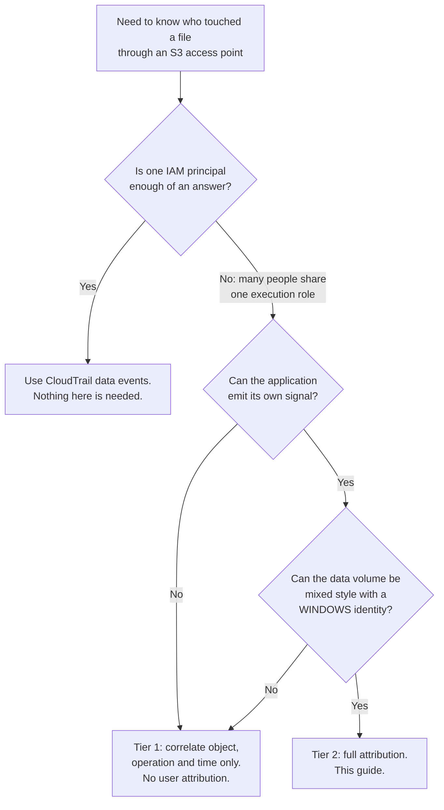

🌐 [日本語](../ja/setup-guide.md) | **English** (this page)

# Application-layer signal correlation — setup guide

## What you get, in one paragraph

An FSx for ONTAP audit record does not name the requester when the operation
arrived through an S3 access point. This integration adds the missing half: the
application records which end user it acted for, and a deterministic join key
lets the two be matched afterwards. Measured on ONTAP 9.18.1P3D1: six operations
by two users, all six correlated to the right user. What the storage layer cannot
attribute, the application can — but only if it is asked to, and only if the
volume is configured so that its operations are audited at all.

## Who this is for

Anyone who built their own application on top of an FSx for ONTAP S3 access point
and needs to answer "which person opened this file". The reference case is the
Amplify Gen2 file portal in
[FSx-for-ONTAP-S3AccessPoints-Serverless-Patterns](https://github.com/Yoshiki0705/FSx-for-ONTAP-S3AccessPoints-Serverless-Patterns),
but nothing here depends on it.

## Read this first if you read nothing else

Three facts decide whether this works, and all three were found by measuring
rather than by reading documentation.

**Enabling auditing records nothing.** The audit log will contain exactly one
entry — the audit subsystem announcing itself. File operations need an audit ACE
applied to the target.

**An audit ACE and a UNIX identity are mutually exclusive.** The ACE requires
`ntfs` or `mixed` security style; applying it makes the path's effective style
`ntfs`; and an access point presenting a UNIX identity then fails every data
operation with `AccessDenied`.

**A key-based checkpoint stalls the pipeline permanently.** ONTAP appends to one
active file whose key never changes, and rotated keys sort *before* it. Details
in [Why the checkpoint is a timestamp](#why-the-checkpoint-is-a-timestamp).

## How to choose whether you need this



## Prerequisites

| Item | Requirement | Why |
|---|---|---|
| ONTAP version | Measured on `9.18.1P3D1` | Other releases unconfirmed |
| Data volume security style | `mixed` | An audit ACE cannot exist on `unix` |
| Data volume ACLs | allow ACE **and** audit ACE | Without the allow ACE, access fails; without the audit ACE, nothing is recorded |
| Data access point identity | `WINDOWS` | A UNIX identity fails once the effective style is `ntfs` |
| Windows user | Local ONTAP user is sufficient | A domain user needs reachable domain controllers |
| Audit log volume | Separate volume, `unix` is fine | It is read, not audited |
| Audit format | `xml` | What the parser expects. **JSON is not an ONTAP audit format** |
| Shared Python layer | Published | The handler imports from it |

## Step 1 — the audit log volume and its access point

Create the volume that will receive rotated audit files, and an access point the
correlator reads it through. A UNIX identity is correct here.

```bash
aws fsx create-volume \
  --volume-type ONTAP --name appsig_auditlog \
  --ontap-configuration 'StorageVirtualMachineId=svm-0123456789abcdef0,SizeInMegabytes=10240,JunctionPath=/appsig_auditlog,SecurityStyle=UNIX,TieringPolicy={Name=NONE}'

aws fsx create-and-attach-s3-access-point --cli-input-json '{
  "Name": "appsig-auditlog-ap",
  "Type": "ONTAP",
  "OntapConfiguration": {
    "VolumeId": "fsvol-0123456789abcdef0",
    "FileSystemIdentity": { "Type": "UNIX", "UnixUser": { "Name": "root" } }
  }
}'
```

FSx-managed access points do **not** require an ONTAP S3 server on the SVM. That
was verified against 21 existing attachments on SVMs with no S3 service
configured.

## Step 2 — the data volume, with an identity that can be audited

Create it as `mixed` from the start rather than converting later.

```bash
aws fsx create-volume \
  --volume-type ONTAP --name appsig_data \
  --ontap-configuration 'StorageVirtualMachineId=svm-0123456789abcdef0,SizeInMegabytes=10240,JunctionPath=/appsig_data,SecurityStyle=MIXED,TieringPolicy={Name=NONE}'
```

Attach the access point with a **WINDOWS** identity naming a Windows user that
exists on the SVM:

```bash
aws fsx create-and-attach-s3-access-point --cli-input-json '{
  "Name": "appsig-data-ap",
  "Type": "ONTAP",
  "OntapConfiguration": {
    "VolumeId": "fsvol-0123456789abcdef0",
    "FileSystemIdentity": { "Type": "WINDOWS", "WindowsUser": { "Name": "s3apaudit" } }
  }
}'
```

FSx creates the `s3_win` name mapping for this automatically. Confirm it:

```bash
GET /api/name-services/name-mappings?svm.uuid=<uuid>&fields=direction,pattern,replacement
# expect a row like:  s3_win  amazon-fsx-XXXXXX -> s3apaudit
```

## Step 3 — the ACLs

Both ACEs, in one call. An audit ACE on its own leaves the DACL without an allow
entry for the requesting identity, and the resulting denial is indistinguishable
from a wrong identity.

```bash
POST /api/protocols/file-security/permissions/<svm-uuid>/%2Fappsig_data
{
  "acls": [
    { "access": "access_allow", "user": "s3apaudit",
      "advanced_rights": { "full_control": true },
      "apply_to": { "files": true, "sub_folders": true, "this_folder": true } },
    { "access": "audit_success", "user": "Everyone",
      "advanced_rights": { "read_data": true, "write_data": true, "append_data": true,
                           "delete": true, "delete_child": true,
                           "read_attr": true, "write_attr": true },
      "apply_to": { "files": true, "sub_folders": true, "this_folder": true } }
  ],
  "control_flags": "8014",
  "propagation_mode": "propagate"
}
```

Read the result back. `effective_style` becoming `ntfs` is expected and is the
point:

```bash
GET /api/protocols/file-security/permissions/<svm-uuid>/%2Fappsig_data
# security_style: mixed   effective_style: ntfs   acls: 2
```

## Step 4 — enable auditing

```bash
PATCH /api/protocols/audit/<svm-uuid>   {"log_path": "/appsig_auditlog"}
PATCH /api/protocols/audit/<svm-uuid>   {"enabled": true}
```

Both return a job, and **the job result is where the outcome is**. A 202 with a
job ID does not mean the change took effect. The enable can legitimately fail
with:

```
Cannot enable auditing for SVM "...". Reason: Final consolidation is in progress.
Retry after sometime.
```

That is transient; wait and retry. This PATCH is idempotent, so retrying it is
safe. Read `enabled` back before believing it.

## Step 5 — deploy the correlator

```bash
bash shared/python/build-layer.sh
aws lambda publish-layer-version --layer-name fsxn-shared-python \
  --zip-file fileb://shared/python/dist/fsxn-shared-python-layer.zip \
  --compatible-runtimes python3.12

export FSX_S3_ACCESS_POINT_ARN='arn:aws:s3:<region>:<account>:accesspoint/appsig-auditlog-ap'
export SHARED_LAYER_ARN='arn:aws:lambda:<region>:<account>:layer:fsxn-shared-python:1'
export OWNER_TAG='your-team'
bash integrations/amplify-portal/scripts/deploy.sh
```

The script uploads the real handler after the stack is created and then invokes
the function to confirm the placeholder is gone. A stack deployed without that
second step leaves a function that only raises.

## Step 6 — instrument the application

One call, in the same request that performs the S3 operation:

```python
from observability import emit_s3ap_app_signal

emit_s3ap_app_signal(
    object_key="data/report.txt",
    operation="GET",
    principal=event["identity"]["sub"],
)
```

The principal is hashed by default. It is a pseudonymous identifier rather than a
name, but it still identifies a person, and it lands in CloudWatch Logs which has
its own retention and its own readers. Set `APP_SIGNAL_HASH_PRINCIPAL=false`
where a deployment has decided otherwise.

## Verifying it works

Drive one operation and check both halves arrived.

```bash
aws s3api put-object --bucket <data-ap-arn> --key data/probe.txt --body /tmp/probe

# audit side: the correlator should report a non-zero count
aws lambda invoke --function-name <stack>-correlator --payload '{}' /tmp/out.json
cat /tmp/out.json
```

Expect `s3_path_records` and `join_keys_emitted` to be non-zero. If
`join_keys_emitted` is 0 while `records_parsed` is not, read which counter
absorbed them — `audit_management_records_skipped`,
`file_protocol_records_skipped` and `pathless_records_skipped` each name a
different reason.

Then run the join, which is an output of the stack (`JoinQuery`):

```
fields s3ap_join_key, marker, app_principal, audit_source_key, audit_operation
| filter ispresent(s3ap_join_key)
| stats count(marker) as audit_rows, count(app_principal) as app_rows,
        earliest(app_principal) as principal
    by s3ap_join_key
| filter audit_rows > 0 and app_rows > 0
```

## Measured result

Two objects, two users, PUT/GET/DELETE each, on 2026-08-30:

```
join key                         audit  app  principal
DELETE|data/alice-report.txt         1    1  b5d2a8c37510ca3d
DELETE|data/bob-notes.txt            1    1  a59268d39eca9880
GET|data/alice-report.txt            1    1  b5d2a8c37510ca3d
GET|data/bob-notes.txt               1    1  a59268d39eca9880
PUT|data/alice-report.txt            1    1  b5d2a8c37510ca3d
PUT|data/bob-notes.txt               1    1  a59268d39eca9880
```

All six correlated; the two users stayed distinct. The audit half is genuinely
ONTAP-produced. **The application half was produced by this module but injected
by a test driver rather than emitted from inside a portal handler**, because the
reference portal is not instrumented yet. The join mechanism is verified; the
portal's adoption of it is not.

Operations driven without an application signal appear with `app_rows = 0`:
attributable to an object and an operation, and to nobody.

## The ONTAP event names, measured

| S3 operation | EventID | EventName | `Source` | Where the path is |
|---|---|---|---|---|
| PUT | 4656 | `Create Object` | `HTTP` | `ObjectName` |
| GET | 4663 | `Read Object` | `HTTP` | `ObjectName` |
| LIST | 4663 | `S3A List Object` | `S3` | `ObjectName`, the volume root |
| DELETE | 9998 | `Unlink Object` | `HTTP` | **`FileName`** |

`SubjectUserName` and `SubjectDomainName` are the literal string `Not Present` on
every one of them. `SubjectUserSid` is populated, but it identifies the access
point's identity, not the end user.

A delete carries no `ObjectName` at all. Reading only that field makes deletes
look uncorrelatable; the path is in `FileName`.

## Why the checkpoint is a timestamp

The obvious design — remember the last object key processed and pass it to
`StartAfter` — does not work against an ONTAP audit volume, and fails silently.

ONTAP appends to one active file, `audit_<svm>_last.xml`, whose key never changes
while its content grows, and rotates it into
`audit_<svm>_D<timestamp>_<n>.xml`.

| Symptom | Cause |
|---|---|
| The active file is read once and its later content never appears | Its key equals the checkpoint, so `StartAfter` excludes it. Measured: the file grew from 907 to 12,754 bytes and the next run listed zero files |
| Every future rotated file is skipped, permanently | `audit_..._D...` sorts **before** `audit_..._last` because `D` < `l`. Once the checkpoint holds the active key, nothing sorts after it again |

So the watermark here is the timestamp of the newest audit *record* already
emitted, in epoch nanoseconds, and files are selected by modification time. The
active file is re-read every run and records at or below the watermark are
skipped. Nanoseconds rather than milliseconds because the watermark is the
deduplication key: records written inside the same millisecond would otherwise be
indistinguishable, and the watermark would either skip or repeat them.

> **Applies to the other integrations too**: the nine vendor integrations in this
> repository use the same `StartAfter` plus last-processed-key pattern. Reading an
> ONTAP audit volume through them is subject to the same two failures. Not changed
> here; recorded so it is not rediscovered.

## Cost

The dominant term is custom metrics, and the lever is dimension count, not
volume. Every distinct combination of dimension values is a separately billed
metric, so a key or a checkpoint value in a dimension makes the bill scale with
the number of files. This integration keeps those in EMF *properties*, which are
queryable in Logs Insights and not billed as metrics.

Rates, ap-northeast-1, from the Pricing API, published 2026-08-06:

| Item | Rate |
|---|---|
| CloudWatch custom metric | $0.30 / metric-month (first 10,000) |
| CloudWatch logs ingested | $0.76 / GB |
| CloudWatch logs stored | $0.033 / GB-month |
| CloudWatch alarm | $0.10 / alarm-month |
| X-Ray traces stored | $5.00 / million |

A volume on an existing file system with provisioned SSD headroom adds nothing:
the verification file system was measured at 0.36% of 1024 GB used.

**No total for a real run is published here.** Tag-based cost allocation lags by
more than a day, and the verification environment was torn down before the data
landed. An estimate is not a measurement and is not presented as one.

## FAQ and common misreadings

**"The audit log has entries, so auditing works."** Not necessarily. Check what
those entries *are*. A log containing only `Audit Enabled` means no file
operation has been recorded, and the cause is a missing audit ACE.

**"ONTAP does not record who did it."** Too broad. It does not attribute *file
operations arriving over the S3 access path*. An administrative action over the
management interface **is** attributed — the `Audit Enabled` record names the
account that enabled it.

**"Correlating on file name is unsafe, so this design is unsafe."** The warning is
correct and this design addresses it: a later read of the same file over SMB or
NFS produces a record with that same name. The join is restricted to records
whose `Source` is `HTTP` or `S3`. Remove that filter and the false attribution
returns. See
[s3ap-monitoring-coverage-implications.md](../../../../docs/en/s3ap-monitoring-coverage-implications.md).

**"A HEAD request will show up."** It will not. Six HEAD calls produced zero audit
records. An existence check has no audit half to join to.

**"JSON is a valid audit format."** It is not an ONTAP audit output format.
`evtx` and `xml` are. This integration needs `xml`.

## Security and privacy notes

> **Security note**: the audit ACE in step 3 uses `Everyone` as the audit
> principal. That is deliberate — the goal is recording every access, not
> restricting any. The **allow** ACE is where the restriction belongs, and it
> names one user.

> **Privacy note**: the principal recorded by `emit_s3ap_app_signal` is hashed by
> default. A Cognito subject is pseudonymous but still identifies a person, and
> the value lands in CloudWatch Logs. Decide retention on the application's log
> group accordingly, not just on the correlator's.

> **Blast-radius note**: enabling auditing is per-SVM, not per-volume. Every
> volume on that SVM with an audit ACE starts being audited. On a shared SVM this
> is not a local change.

> **Credential note**: the ONTAP management endpoint is usually a private
> address, so this needs something inside the VPC. Have that host fetch the
> credential from Secrets Manager itself rather than passing it in a command —
> otherwise it lands in SSM command history.

> **Lockout note**: ONTAP locks an account after repeated failed logins. If two
> stored secrets share the username `fsxadmin`, trying both against the same
> endpoint is not a diagnostic, it is a way to lose administrative access.
> Identify which credential belongs to which file system from metadata and make
> one attempt per target.

> **Recovery note**: `aws fsx update-file-system --ontap-configuration
> FsxAdminPassword=...` resets the password without needing ONTAP
> authentication, which is what recovers a lockout. It is also a change to a
> shared credential, so other automation reading the old value breaks.

> **Reversibility note**: ONTAP validates `log_path` on write, so an audit
> configuration whose path no longer exists **cannot be restored to that value**.
> Capture the original configuration before changing it, and expect the path to
> be the part you cannot put back.

> **Ordering note**: deleting FSx resources has a required order — access point
> attachment, then volume, then SVM. And read the final state of anything reached
> through a bastion before terminating the bastion.

> **Consolidation note**: `enabled: true` can be refused with "Final
> consolidation is in progress". A 202 with a job ID is not success; read the job
> result.

## What is not verified

| Item | Status |
|---|---|
| The join, end to end | **Verified**, 6 of 6 operations, two users |
| Application signal emitted from inside the reference portal | **Not done** — injected by a test driver |
| Delivery through the OTel Collector to the nine vendor backends | **Not built** |
| Cost of a real run | **Not measured** |
| Latency between an operation and its correlated pair | **Not measured** |
| ONTAP releases other than 9.18.1P3D1 | Unconfirmed |
| A domain (rather than local) Windows identity | Unconfirmed — the domain controllers were unreachable |
| HEAD operations | Not auditable |

## Related documents

- [Integration README](../../README.md) — the shape of the deliverable
- [S3 access point monitoring coverage](../../../../docs/en/s3ap-monitoring-coverage-implications.md) — the measured basis for the requester-attribution gap
- [`shared/python/observability.py`](../../../../shared/python/observability.py) — the drop-in module
- [`shared/python/ontap_audit_parser.py`](../../../../shared/python/ontap_audit_parser.py) — the audit schema
- [OTel Collector integration](../../../otel-collector/README.md) — where signals fan out to vendor backends
