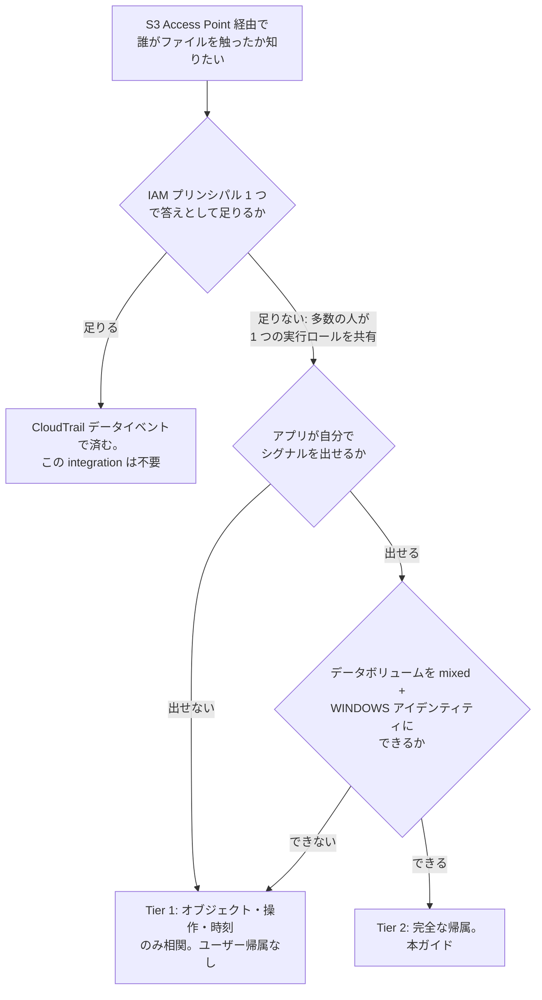

🌐 **日本語**（このページ） | [English](../en/setup-guide.md)

# アプリ層シグナルの相関 — セットアップガイド

## 一段落での要約

S3 Access Point 経由で到達した操作について、FSx for ONTAP の監査レコードは要求者を記録しません。この integration は欠けている片側を足します。アプリケーションが「誰のために操作したか」を記録し、決定論的な join key で後から突き合わせます。ONTAP 9.18.1P3D1 での実測では、2 ユーザーによる 6 操作すべてが正しいユーザーに突合しました。ストレージ層が帰属できないものをアプリケーションが帰属できる、ただしそう依頼した場合に限り、かつボリュームがそもそも監査される設定になっている場合に限ります。

## 対象読者

FSx for ONTAP の S3 Access Point 上に自分でアプリケーションを構築し、「どの人がこのファイルを開いたか」に答える必要がある方。参照実装は [FSx-for-ONTAP-S3AccessPoints-Serverless-Patterns](https://github.com/Yoshiki0705/FSx-for-ONTAP-S3AccessPoints-Serverless-Patterns) の Amplify Gen2 ファイルポータルですが、依存はしていません。

## 他を読まないならここだけ

成否を決める事実が 3 つあり、いずれもドキュメントではなく実測で判明したものです。

**監査を有効化しただけでは何も記録されません。** 監査ログに入るのは監査サブシステムが自分自身を宣言する 1 件だけです。ファイル操作の記録には対象への監査 ACE が必要です。

**監査 ACE と UNIX アイデンティティは両立しません。** ACE には `ntfs` または `mixed` のセキュリティスタイルが必要で、適用するとそのパスの実効スタイルが `ntfs` になり、UNIX アイデンティティを提示する Access Point は全データ操作が `AccessDenied` になります。

**キーベースのチェックポイントはパイプラインを恒久的に停止させます。** ONTAP はキーが変わらない 1 つのアクティブファイルに追記し、ローテート済みキーはその**前**に並びます。詳細は [チェックポイントがタイムスタンプである理由](#チェックポイントがタイムスタンプである理由)。

## 必要かどうかの判断



## 前提条件

| 項目 | 要件 | 理由 |
|---|---|---|
| ONTAP バージョン | `9.18.1P3D1` で実測 | 他リリースは未確認 |
| データボリュームのセキュリティスタイル | `mixed` | `unix` には監査 ACE が存在できない |
| データボリュームの ACL | 許可 ACE **と** 監査 ACE | 許可 ACE がないとアクセス失敗、監査 ACE がないと何も記録されない |
| データ AP のアイデンティティ | `WINDOWS` | 実効スタイルが `ntfs` になると UNIX では失敗する |
| Windows ユーザー | ONTAP のローカルユーザーで足りる | ドメインユーザーには到達可能な DC が必要 |
| 監査ログボリューム | 別ボリューム、`unix` で可 | 読まれる側であり監査対象ではない |
| 監査フォーマット | `xml` | パーサが期待する形式。**JSON は ONTAP の監査フォーマットではない** |
| 共有 Python Layer | publish 済み | ハンドラが import する |

## 手順 1 — 監査ログボリュームとその Access Point

ローテート済み監査ファイルを受けるボリュームと、相関 Lambda が読むための Access Point を作ります。ここは UNIX アイデンティティが正解です。

```bash
aws fsx create-volume \
  --volume-type ONTAP --name appsig_auditlog \
  --ontap-configuration 'StorageVirtualMachineId=svm-0123456789abcdef0,SizeInMegabytes=10240,JunctionPath=/appsig_auditlog,SecurityStyle=UNIX,TieringPolicy={Name=NONE}'

aws fsx create-and-attach-s3-access-point --cli-input-json '{
  "Name": "appsig-auditlog-ap",
  "Type": "ONTAP",
  "OntapConfiguration": {
    "VolumeId": "fsvol-0123456789abcdef0",
    "FileSystemIdentity": { "Type": "UNIX", "UnixUser": { "Name": "root" } }
  }
}'
```

FSx 管理の Access Point は SVM 側の ONTAP S3 サーバ設定を**必要としません**。S3 サービス未設定の SVM 上にある既存 21 個のアタッチメントで確認しました。

## 手順 2 — 監査できるアイデンティティを持つデータボリューム

後から変換するのではなく、最初から `mixed` で作ります。

```bash
aws fsx create-volume \
  --volume-type ONTAP --name appsig_data \
  --ontap-configuration 'StorageVirtualMachineId=svm-0123456789abcdef0,SizeInMegabytes=10240,JunctionPath=/appsig_data,SecurityStyle=MIXED,TieringPolicy={Name=NONE}'
```

SVM 上に存在する Windows ユーザーを指定して、**WINDOWS** アイデンティティで Access Point をアタッチします。

```bash
aws fsx create-and-attach-s3-access-point --cli-input-json '{
  "Name": "appsig-data-ap",
  "Type": "ONTAP",
  "OntapConfiguration": {
    "VolumeId": "fsvol-0123456789abcdef0",
    "FileSystemIdentity": { "Type": "WINDOWS", "WindowsUser": { "Name": "s3apaudit" } }
  }
}'
```

`s3_win` の name mapping は FSx が自動で作ります。確認します。

```bash
GET /api/name-services/name-mappings?svm.uuid=<uuid>&fields=direction,pattern,replacement
# 次のような行が出るはず:  s3_win  amazon-fsx-XXXXXX -> s3apaudit
```

## 手順 3 — ACL

2 つの ACE を 1 回の呼び出しで適用します。監査 ACE だけを入れると DACL に要求元アイデンティティの許可エントリが無い状態になり、その拒否は「アイデンティティが違う」場合と区別できません。

```bash
POST /api/protocols/file-security/permissions/<svm-uuid>/%2Fappsig_data
{
  "acls": [
    { "access": "access_allow", "user": "s3apaudit",
      "advanced_rights": { "full_control": true },
      "apply_to": { "files": true, "sub_folders": true, "this_folder": true } },
    { "access": "audit_success", "user": "Everyone",
      "advanced_rights": { "read_data": true, "write_data": true, "append_data": true,
                           "delete": true, "delete_child": true,
                           "read_attr": true, "write_attr": true },
      "apply_to": { "files": true, "sub_folders": true, "this_folder": true } }
  ],
  "control_flags": "8014",
  "propagation_mode": "propagate"
}
```

結果を読み返します。`effective_style` が `ntfs` になるのは想定どおりで、それが目的です。

```bash
GET /api/protocols/file-security/permissions/<svm-uuid>/%2Fappsig_data
# security_style: mixed   effective_style: ntfs   acls: 2
```

## 手順 4 — 監査の有効化

```bash
PATCH /api/protocols/audit/<svm-uuid>   {"log_path": "/appsig_auditlog"}
PATCH /api/protocols/audit/<svm-uuid>   {"enabled": true}
```

どちらも job を返し、**結果は job にあります**。job ID を伴う 202 は変更が効いたことを意味しません。有効化は次の理由で正当に失敗しえます。

```
Cannot enable auditing for SVM "...". Reason: Final consolidation is in progress.
Retry after sometime.
```

これは一時的なもので、待って再試行します。この PATCH は冪等なので再試行は安全です。信じる前に `enabled` を読み返してください。

## 手順 5 — 相関 Lambda のデプロイ

```bash
bash shared/python/build-layer.sh
aws lambda publish-layer-version --layer-name fsxn-shared-python \
  --zip-file fileb://shared/python/dist/fsxn-shared-python-layer.zip \
  --compatible-runtimes python3.12

export FSX_S3_ACCESS_POINT_ARN='arn:aws:s3:<region>:<account>:accesspoint/appsig-auditlog-ap'
export SHARED_LAYER_ARN='arn:aws:lambda:<region>:<account>:layer:fsxn-shared-python:1'
export OWNER_TAG='your-team'
bash integrations/amplify-portal/scripts/deploy.sh
```

スクリプトはスタック作成後に本物のハンドラをアップロードし、関数を invoke して placeholder が消えたことを確認します。この 2 段目を踏まないと、raise するだけの関数が残ります。

## 手順 6 — アプリケーションの計装

S3 操作を行う同じリクエスト内で 1 行です。

```python
from observability import emit_s3ap_app_signal

emit_s3ap_app_signal(
    object_key="data/report.txt",
    operation="GET",
    principal=event["identity"]["sub"],
)
```

principal は既定でハッシュ化されます。Cognito の subject は名前ではなく仮名の識別子ですが、それでも個人を識別しますし、値は CloudWatch Logs に入って独自の保持期間と読者を持ちます。方針が異なる環境では `APP_SIGNAL_HASH_PRINCIPAL=false` を設定します。

## 動作確認

1 操作を流して、両側が届いたことを確認します。

```bash
aws s3api put-object --bucket <data-ap-arn> --key data/probe.txt --body /tmp/probe

# 監査側: 相関 Lambda が 0 以外を報告するはず
aws lambda invoke --function-name <stack>-correlator --payload '{}' /tmp/out.json
cat /tmp/out.json
```

`s3_path_records` と `join_keys_emitted` が 0 以外になることを期待します。`records_parsed` が 0 以外なのに `join_keys_emitted` が 0 の場合は、どのカウンタが吸収したかを読みます。`audit_management_records_skipped` / `file_protocol_records_skipped` / `pathless_records_skipped` はそれぞれ別の理由を指します。

続いて join を実行します。これはスタックの出力（`JoinQuery`）です。

```
fields s3ap_join_key, marker, app_principal, audit_source_key, audit_operation
| filter ispresent(s3ap_join_key)
| stats count(marker) as audit_rows, count(app_principal) as app_rows,
        earliest(app_principal) as principal
    by s3ap_join_key
| filter audit_rows > 0 and app_rows > 0
```

## 実測結果

2 オブジェクト、2 ユーザー、各 PUT/GET/DELETE、2026-08-30 の実測。

```
join key                         audit  app  principal
DELETE|data/alice-report.txt         1    1  b5d2a8c37510ca3d
DELETE|data/bob-notes.txt            1    1  a59268d39eca9880
GET|data/alice-report.txt            1    1  b5d2a8c37510ca3d
GET|data/bob-notes.txt               1    1  a59268d39eca9880
PUT|data/alice-report.txt            1    1  b5d2a8c37510ca3d
PUT|data/bob-notes.txt               1    1  a59268d39eca9880
```

6 件すべてが突合し、2 ユーザーは区別されたままでした。監査側は ONTAP が実際に生成したものです。**アプリ側はこのモジュールが生成しましたが、ポータルのハンドラ内部から出したものではなくテストドライバから注入したものです**。参照ポータルはまだ計装されていません。join の仕組みは検証済みですが、ポータルによる採用は未検証です。

アプリ側シグナルなしで流した操作は `app_rows = 0` で現れます。オブジェクトと操作には帰属でき、人には帰属できません。

## 実測した ONTAP のイベント名

| S3 操作 | EventID | EventName | `Source` | パスの在り処 |
|---|---|---|---|---|
| PUT | 4656 | `Create Object` | `HTTP` | `ObjectName` |
| GET | 4663 | `Read Object` | `HTTP` | `ObjectName` |
| LIST | 4663 | `S3A List Object` | `S3` | `ObjectName`、ボリュームルート |
| DELETE | 9998 | `Unlink Object` | `HTTP` | **`FileName`** |

`SubjectUserName` と `SubjectDomainName` はすべてで文字列 `Not Present` です。`SubjectUserSid` は入っていますが、これは Access Point のアイデンティティを指し、エンドユーザーではありません。

削除は `ObjectName` を一切持ちません。そのフィールドだけを読むと削除は相関不能に見えますが、パスは `FileName` にあります。

## チェックポイントがタイムスタンプである理由

素直な設計 — 最後に処理したオブジェクトキーを覚えて `StartAfter` に渡す — は ONTAP の監査ボリュームでは機能せず、しかも無言で失敗します。

ONTAP は内容が増えてもキーが変わらない 1 つのアクティブファイル `audit_<svm>_last.xml` に追記し、`audit_<svm>_D<日時>_<n>.xml` にローテートします。

| 症状 | 原因 |
|---|---|
| アクティブファイルが 1 度読まれ、以降の内容が現れない | キーがチェックポイントと等しく `StartAfter` が除外する。実測: 907 → 12,754 バイトに増えたのに次の実行は 0 ファイル |
| 以降ローテートされる全ファイルが恒久的にスキップされる | `D` < `l` なので `audit_..._D...` は `audit_..._last` の**前**に並ぶ。チェックポイントがアクティブキーを保持した時点で、その後に並ぶものが二度と現れない |

そこで watermark は既に出力した最新の監査**レコード**のタイムスタンプ（epoch ナノ秒）にし、ファイル選択は更新時刻で行います。アクティブファイルは毎回再読込し、watermark 以下のレコードはスキップします。ミリ秒ではなくナノ秒なのは、watermark が重複排除キーだからです。同一ミリ秒内に書かれたレコードは区別できず、watermark はそれらを取りこぼすか繰り返します。

> **他の integration にも該当します**: このリポジトリの 9 ベンダー integration は同じ `StartAfter` + last-processed-key の方式を使っています。ONTAP 監査ボリュームをそれらで読む場合、同じ 2 つの失敗が起きます。ここでは変更していません。再発見されないよう記録しています。

## コスト

支配項はカスタムメトリクスで、効くレバーは量ではなくディメンション数です。ディメンション値の組合せごとに別課金のメトリクスになるため、キーやチェックポイント値をディメンションに置くと請求がファイル数に比例します。この integration はそれらを EMF の**プロパティ**に置いています。Logs Insights でクエリでき、メトリクスとして課金されません。

単価、ap-northeast-1、Pricing API 取得、公開 2026-08-06。

| 項目 | 単価 |
|---|---|
| CloudWatch カスタムメトリクス | $0.30 / metric-month（最初の 10,000） |
| CloudWatch ログ取り込み | $0.76 / GB |
| CloudWatch ログ保管 | $0.033 / GB-month |
| CloudWatch アラーム | $0.10 / alarm-month |
| X-Ray トレース保管 | $5.00 / 100 万件 |

プロビジョニング済み SSD に余裕がある既存ファイルシステム上のボリュームは増分ゼロです。検証に使ったファイルシステムは 1024 GB のうち 0.36% 使用と実測しました。

**実際の実行での合計はここに載せていません。** タグ別のコスト配分は 1 日以上遅れ、検証環境はデータが揃う前に撤収しました。見積りは実測ではないので、実測として提示しません。

## FAQ とよくある誤読

**「監査ログにエントリがあるから監査は動いている」** 必ずしもそうではありません。そのエントリが**何か**を確認してください。`Audit Enabled` だけのログは、ファイル操作が 1 件も記録されていないことを意味し、原因は監査 ACE の欠落です。

**「ONTAP は誰がやったかを記録しない」** 広すぎます。記録しないのは **S3 アクセスパス経由で到達したファイル操作**についてです。管理インターフェース経由の管理操作は**帰属されます** — `Audit Enabled` のレコードは有効化したアカウントを記録しています。

**「ファイル名での相関は危険だから、この設計も危険だ」** 警告は正しく、この設計はそれに対処しています。同じファイルを後から SMB や NFS で読むと同じ名前のレコードが出ます。join は `Source` が `HTTP` または `S3` のレコードに限定しています。このフィルタを外すと誤った帰属が戻ります。[s3ap-monitoring-coverage-implications.md](../../../../docs/ja/s3ap-monitoring-coverage-implications.md) を参照。

**「HEAD リクエストも出る」** 出ません。HEAD 6 コールで監査レコードは 0 件でした。存在確認には突合する監査側がありません。

**「JSON は有効な監査フォーマット」** ONTAP の監査出力フォーマットではありません。`evtx` と `xml` です。この integration は `xml` を必要とします。

## セキュリティとプライバシーに関する補足

> **セキュリティに関する補足**: 手順 3 の監査 ACE は監査プリンシパルに `Everyone` を使います。これは意図的で、目的は全アクセスの記録であり制限ではありません。制限は**許可** ACE の側で行い、そちらは 1 ユーザーを指定します。

> **プライバシーに関する補足**: `emit_s3ap_app_signal` が記録する principal は既定でハッシュ化されます。Cognito の subject は仮名ですが個人を識別し、値は CloudWatch Logs に入ります。相関 Lambda 側だけでなく、アプリケーションのロググループの保持期間も併せて判断してください。

> **影響範囲に関する補足**: 監査の有効化はボリューム単位ではなく **SVM 単位**です。その SVM 上で監査 ACE を持つ全ボリュームが監査され始めます。共有 SVM では局所的な変更ではありません。

> **認証情報に関する補足**: ONTAP 管理エンドポイントは通常プライベートアドレスなので、VPC 内に何かが必要です。そのホスト自身に Secrets Manager から取得させ、コマンドで渡さないでください。渡すと SSM のコマンド履歴に残ります。

> **ロックアウトに関する補足**: ONTAP は認証失敗の繰り返しでアカウントをロックします。保存された 2 つのシークレットがユーザー名 `fsxadmin` を共有している場合、同じエンドポイントに両方を試すのは診断ではなく管理アクセスを失う手順です。どの認証情報がどのファイルシステムのものかをメタデータで特定し、対象ごとに 1 回だけ試してください。

> **復旧に関する補足**: `aws fsx update-file-system --ontap-configuration FsxAdminPassword=...` は ONTAP 認証なしでパスワードを再設定でき、これがロックアウトからの復旧手段です。同時に共有認証情報の変更でもあるため、旧値を読む他の自動化は壊れます。

> **可逆性に関する補足**: ONTAP は書き込み時に `log_path` を検証するため、パスが既に存在しない監査設定は**その値に戻せません**。変更前に元の設定を採取し、パスは戻せない部分だと想定してください。

> **順序に関する補足**: FSx リソースの削除には順序があります。Access Point アタッチメント → ボリューム → SVM。そして踏み台経由でしか触れないものは、踏み台を終了する前に最終状態を読んでください。

> **consolidation に関する補足**: `enabled: true` は「Final consolidation is in progress」で拒否されえます。job ID を伴う 202 は成功ではありません。job の結果を読んでください。

## 未検証の事項

| 項目 | 状態 |
|---|---|
| join の end-to-end | **検証済み**、6 操作中 6 件、2 ユーザー |
| 参照ポータル内部からのアプリ側シグナル出力 | **未実施** — テストドライバから注入 |
| OTel Collector 経由での 9 ベンダーへの配送 | **未構築** |
| 実際の実行のコスト | **未測定** |
| 操作とその相関ペアの間のレイテンシ | **未測定** |
| 9.18.1P3D1 以外の ONTAP リリース | 未確認 |
| ローカルではなくドメインの Windows アイデンティティ | 未確認 — DC が到達不能だった |
| HEAD 操作 | 監査不可 |

## 関連ドキュメント

- [Integration README](../../README.md) — 成果物の全体像
- [S3 Access Point の監視カバレッジ](../../../../docs/ja/s3ap-monitoring-coverage-implications.md) — 要求者帰属のギャップの実測根拠
- [`shared/python/observability.py`](../../../../shared/python/observability.py) — ドロップインモジュール
- [`shared/python/ontap_audit_parser.py`](../../../../shared/python/ontap_audit_parser.py) — 監査スキーマ
- [OTel Collector integration](../../../otel-collector/README.md) — シグナルがベンダーバックエンドへファンアウトする先
